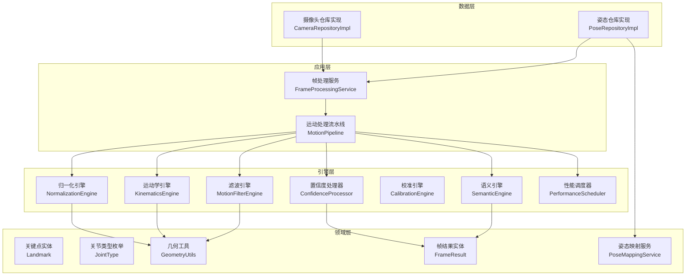
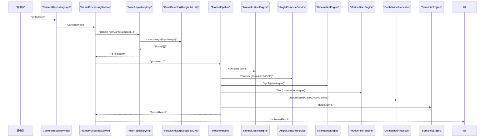
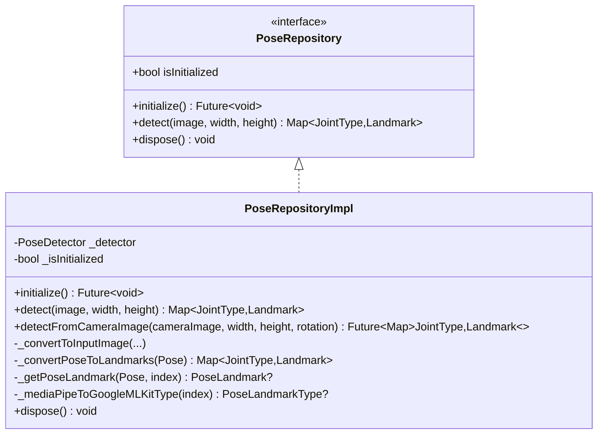
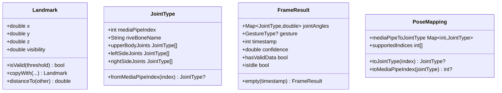
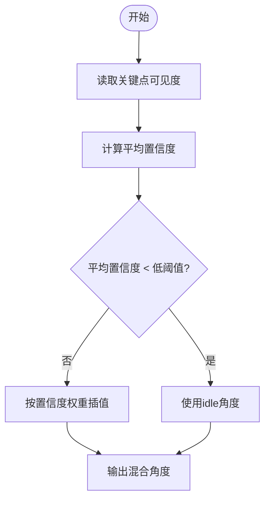
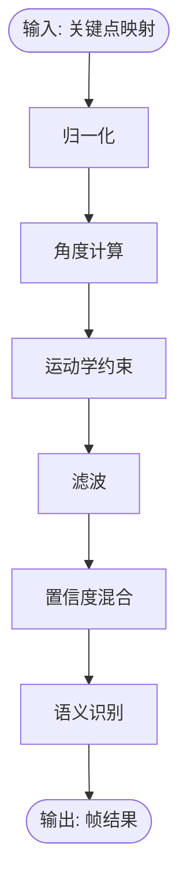
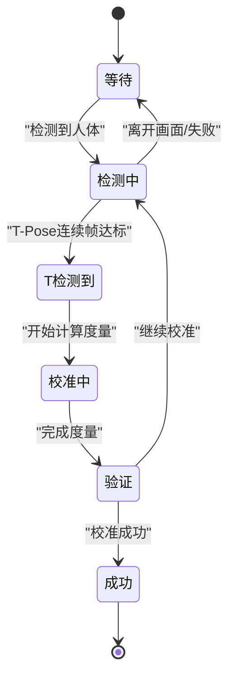
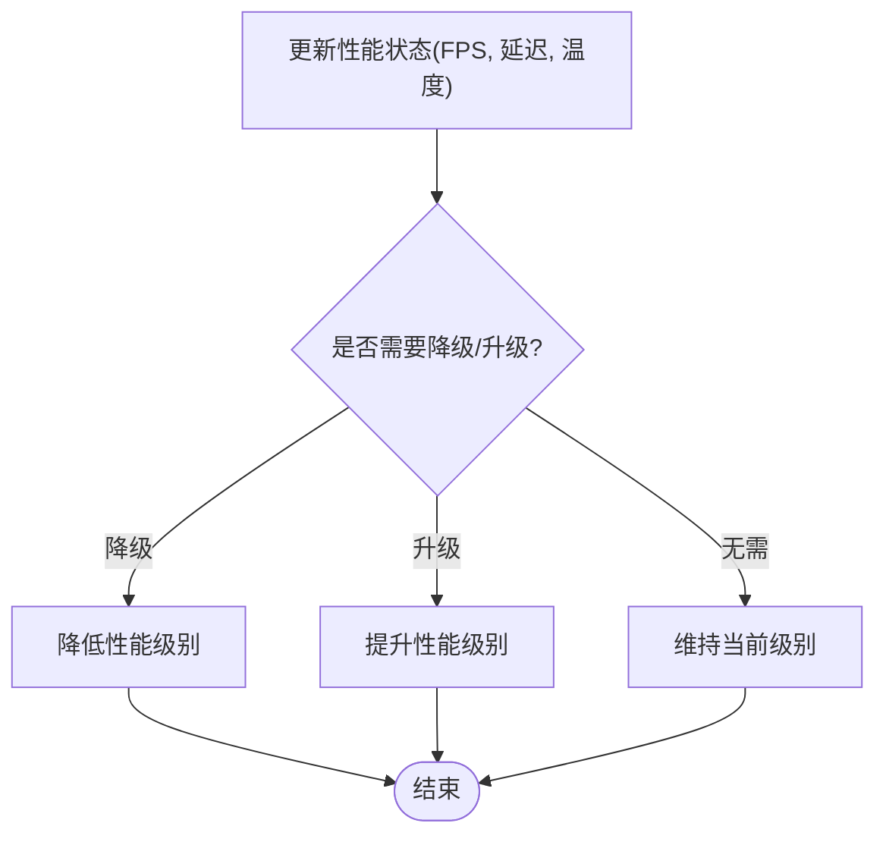
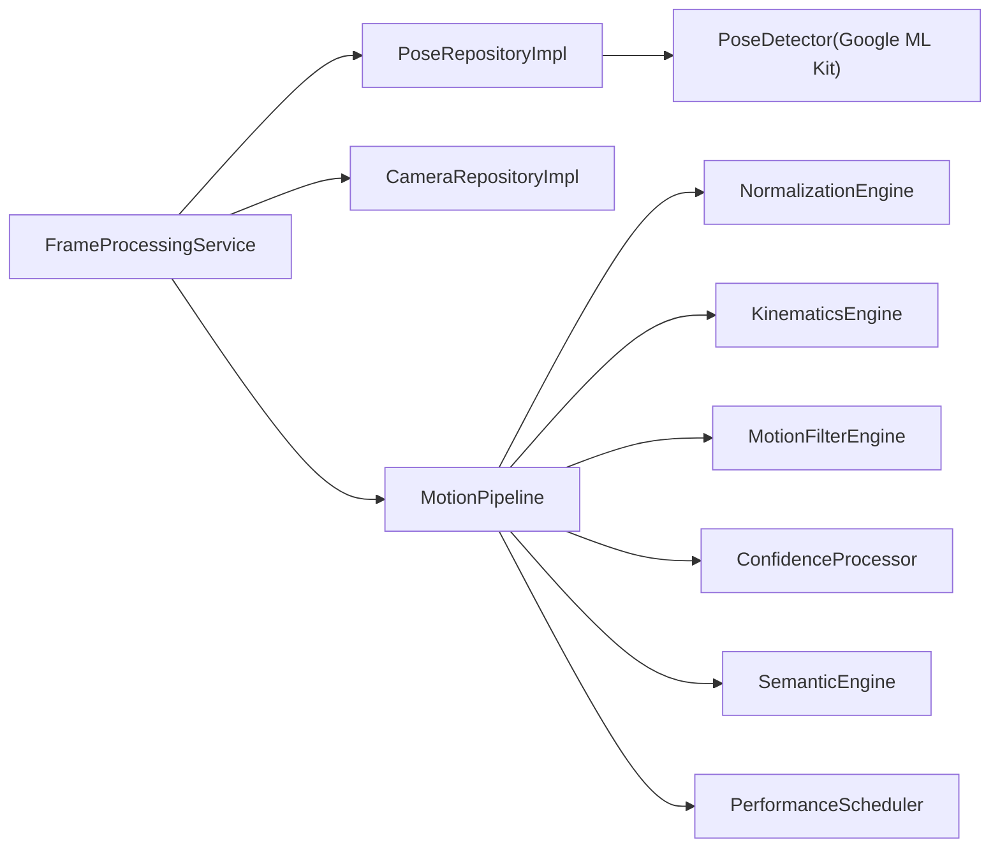

# AI集成

<cite>
**本文引用的文件**
- [pose_repository.dart](file://lib/domain/repositories/pose_repository.dart)
- [pose_repository_impl.dart](file://lib/data/repositories_impl/pose_repository_impl.dart)
- [camera_repository_impl.dart](file://lib/data/repositories_impl/camera_repository_impl.dart)
- [frame_processing_service.dart](file://lib/application/services/frame_processing_service.dart)
- [motion_pipeline.dart](file://lib/application/pipeline/motion_pipeline.dart)
- [landmark.dart](file://lib/domain/entities/landmark.dart)
- [joint_type.dart](file://lib/domain/entities/joint_type.dart)
- [frame_result.dart](file://lib/domain/entities/frame_result.dart)
- [pose_mapping_service.dart](file://lib/domain/services/pose_mapping_service.dart)
- [normalization_engine.dart](file://lib/domain/engines/normalization/normalization_engine.dart)
- [kinematics_engine.dart](file://lib/domain/engines/kinematics/kinematics_engine.dart)
- [motion_filter_engine.dart](file://lib/domain/engines/filtering/motion_filter_engine.dart)
- [semantic_engine.dart](file://lib/domain/engines/semantic/semantic_engine.dart)
- [confidence_processor.dart](file://lib/domain/engines/confidence/confidence_processor.dart)
- [calibration_engine.dart](file://lib/domain/engines/calibration/calibration_engine.dart)
- [geometry_utils.dart](file://lib/core/utils/geometry_utils.dart)
- [performance_scheduler.dart](file://lib/domain/engines/performance/performance_scheduler.dart)
</cite>

## 目录
1. [简介](#简介)
2. [项目结构](#项目结构)
3. [核心组件](#核心组件)
4. [架构总览](#架构总览)
5. [详细组件分析](#详细组件分析)
6. [依赖分析](#依赖分析)
7. [性能考虑](#性能考虑)
8. [故障排查指南](#故障排查指南)
9. [结论](#结论)
10. [附录](#附录)

## 简介
本技术文档聚焦于Mimo项目中的AI集成，特别是基于Google ML Kit的姿态检测模块。文档系统性地阐述了以下内容：
- Google ML Kit姿态检测的集成方式与配置项
- AI姿态检测的实现原理与关键点数据处理流程
- 置信度评估机制与过滤策略
- 实时姿态检测的性能优化与资源管理
- AI模型选择标准与替换策略
- 姿态检测结果的数据结构与处理方法
- 置信度阈值设置与误检处理机制
- 调试工具与性能监控方法
- 错误处理与降级策略

## 项目结构
Mimo的AI集成采用分层架构，围绕“摄像头采集 → 姿态检测 → 数据归一化/角度计算 → 运动学约束/滤波 → 置信度混合 → 语义识别”的流水线组织。核心文件分布如下：
- 领域层：实体与服务（关键点、关节类型、帧结果、几何工具）
- 数据层：仓库实现（摄像头与姿态检测）
- 应用层：帧处理服务与运动处理流水线
- 引擎层：归一化、运动学、滤波、置信度、校准、语义、性能调度

图表来源
- [frame_processing_service.dart:32-62](file://lib/application/services/frame_processing_service.dart#L32-L62)
- [motion_pipeline.dart:53-141](file://lib/application/pipeline/motion_pipeline.dart#L53-L141)
- [camera_repository_impl.dart:5-102](file://lib/data/repositories_impl/camera_repository_impl.dart#L5-L102)
- [pose_repository_impl.dart:10-247](file://lib/data/repositories_impl/pose_repository_impl.dart#L10-L247)
- [pose_mapping_service.dart:6-37](file://lib/domain/services/pose_mapping_service.dart#L6-L37)
- [normalization_engine.dart:9-143](file://lib/domain/engines/normalization/normalization_engine.dart#L9-L143)
- [kinematics_engine.dart:9-95](file://lib/domain/engines/kinematics/kinematics_engine.dart#L9-L95)
- [motion_filter_engine.dart:8-117](file://lib/domain/engines/filtering/motion_filter_engine.dart#L8-L117)
- [confidence_processor.dart:6-91](file://lib/domain/engines/confidence/confidence_processor.dart#L6-L91)
- [semantic_engine.dart:9-221](file://lib/domain/engines/semantic/semantic_engine.dart#L9-L221)
- [calibration_engine.dart:62-302](file://lib/domain/engines/calibration/calibration_engine.dart#L62-L302)
- [geometry_utils.dart:5-117](file://lib/core/utils/geometry_utils.dart#L5-L117)
- [performance_scheduler.dart:63-194](file://lib/domain/engines/performance/performance_scheduler.dart#L63-L194)

章节来源
- [frame_processing_service.dart:32-62](file://lib/application/services/frame_processing_service.dart#L32-L62)
- [motion_pipeline.dart:53-141](file://lib/application/pipeline/motion_pipeline.dart#L53-L141)
- [camera_repository_impl.dart:5-102](file://lib/data/repositories_impl/camera_repository_impl.dart#L5-L102)
- [pose_repository_impl.dart:10-247](file://lib/data/repositories_impl/pose_repository_impl.dart#L10-L247)

## 核心组件
- 摄像头仓库实现：负责初始化前置摄像头、启动预览与图像流回调。
- 姿态仓库实现：封装Google ML Kit的PoseDetector，提供从CameraImage到关键点映射的转换。
- 帧处理服务：连接摄像头与姿态检测，协调归一化、角度计算、运动学约束、滤波、置信度混合与语义识别，并维护状态与性能指标。
- 运动处理流水线：对单帧执行完整的姿态处理链路，产出帧结果。

章节来源
- [camera_repository_impl.dart:5-102](file://lib/data/repositories_impl/camera_repository_impl.dart#L5-L102)
- [pose_repository_impl.dart:10-247](file://lib/data/repositories_impl/pose_repository_impl.dart#L10-L247)
- [frame_processing_service.dart:32-62](file://lib/application/services/frame_processing_service.dart#L32-L62)
- [motion_pipeline.dart:53-141](file://lib/application/pipeline/motion_pipeline.dart#L53-L141)

## 架构总览
下图展示了从摄像头采集到姿态结果输出的端到端流程，以及各引擎之间的协作关系。

图表来源
- [frame_processing_service.dart:108-148](file://lib/application/services/frame_processing_service.dart#L108-L148)
- [pose_repository_impl.dart:40-71](file://lib/data/repositories_impl/pose_repository_impl.dart#L40-L71)
- [motion_pipeline.dart:61-130](file://lib/application/pipeline/motion_pipeline.dart#L61-L130)

## 详细组件分析

### Google ML Kit姿态检测集成与配置
- 检测器初始化：通过构造函数传入检测模式与模型精度，当前使用流式模式与高精度模型。
- 输入转换：将CameraImage转换为InputImage后交由Detector处理；若转换失败或无检测结果则返回空映射。
- 关键点映射：将MediaPipe关键点索引映射到Mimo的关节类型，并提取可见度与三维坐标，封装为Landmark实体。
- 模型与模式：当前配置为流式处理与高精度模型，便于实时场景下的稳定性与准确性平衡。

图表来源
- [pose_repository.dart:4-23](file://lib/domain/repositories/pose_repository.dart#L4-L23)
- [pose_repository_impl.dart:10-247](file://lib/data/repositories_impl/pose_repository_impl.dart#L10-L247)

章节来源
- [pose_repository_impl.dart:14-21](file://lib/data/repositories_impl/pose_repository_impl.dart#L14-L21)
- [pose_repository_impl.dart:38-71](file://lib/data/repositories_impl/pose_repository_impl.dart#L38-L71)
- [pose_repository_impl.dart:192-240](file://lib/data/repositories_impl/pose_repository_impl.dart#L192-L240)

### 关键点数据结构与处理
- 关键点实体Landmark：包含归一化坐标(x,y)、深度(z)与可见度(visibility)，并提供有效性判断与复制方法。
- 关节类型JointType：定义与MediaPipe索引的映射关系，支持上肢关节集合与左右侧分组。
- 帧结果FrameResult：承载每帧的关节角度、手势、时间戳与平均置信度，提供空帧与有效性判断。
- 姿态映射服务：建立MediaPipe索引到JointType的双向映射，便于统一处理。

图表来源
- [landmark.dart:4-87](file://lib/domain/entities/landmark.dart#L4-L87)
- [joint_type.dart:4-66](file://lib/domain/entities/joint_type.dart#L4-L66)
- [frame_result.dart:7-93](file://lib/domain/entities/frame_result.dart#L7-L93)
- [pose_mapping_service.dart:6-37](file://lib/domain/services/pose_mapping_service.dart#L6-L37)

章节来源
- [landmark.dart:17-57](file://lib/domain/entities/landmark.dart#L17-L57)
- [joint_type.dart:26-56](file://lib/domain/entities/joint_type.dart#L26-L56)
- [frame_result.dart:20-44](file://lib/domain/entities/frame_result.dart#L20-L44)
- [pose_mapping_service.dart:10-36](file://lib/domain/services/pose_mapping_service.dart#L10-L36)

### 置信度评估与过滤策略
- 置信度处理器：提供高/低阈值，依据置信度在跟踪角度与idle角度间线性插值，避免误检导致的跳变。
- 平均置信度：对关键点可见度取平均，用于整体质量评估与idle状态判定。
- 低置信度处理：当平均置信度低于阈值时，进入idle状态，使用默认idle角度，减少误动作。

图表来源
- [confidence_processor.dart:26-91](file://lib/domain/engines/confidence/confidence_processor.dart#L26-L91)
- [motion_pipeline.dart:76-112](file://lib/application/pipeline/motion_pipeline.dart#L76-L112)

章节来源
- [confidence_processor.dart:16-50](file://lib/domain/engines/confidence/confidence_processor.dart#L16-L50)
- [motion_pipeline.dart:76-112](file://lib/application/pipeline/motion_pipeline.dart#L76-L112)

### 实时姿态检测流程与关键点处理
- 流水线步骤：姿态检测 → 平均置信度 → 归一化 → 角度计算 → 运动学约束 → 滤波 → 置信度混合 → 语义识别 → 性能调度。
- 角度计算：基于几何工具计算肩/肘角度，归一化到[-π, π]范围，保证一致性。
- 归一化：以肩宽为基准，按缩放因子对关键点进行中心化与尺度归一，消除个体差异。
- 滤波：组合死区过滤、One Euro滤波与速度平滑，抑制抖动与噪声。
- 语义识别：检测举手、双手张开、挥手、拍手、双手高举等手势，结合历史记录提升稳定性。

图表来源
- [motion_pipeline.dart:69-130](file://lib/application/pipeline/motion_pipeline.dart#L69-L130)
- [normalization_engine.dart:77-113](file://lib/domain/engines/normalization/normalization_engine.dart#L77-L113)
- [angle_compute_service.dart:20-104](file://lib/domain/services/angle_compute_service.dart#L20-L104)
- [kinematics_engine.dart:36-81](file://lib/domain/engines/kinematics/kinematics_engine.dart#L36-L81)
- [motion_filter_engine.dart:28-72](file://lib/domain/engines/filtering/motion_filter_engine.dart#L28-L72)
- [semantic_engine.dart:33-80](file://lib/domain/engines/semantic/semantic_engine.dart#L33-L80)

章节来源
- [motion_pipeline.dart:69-130](file://lib/application/pipeline/motion_pipeline.dart#L69-L130)
- [angle_compute_service.dart:67-104](file://lib/domain/services/angle_compute_service.dart#L67-L104)
- [normalization_engine.dart:77-113](file://lib/domain/engines/normalization/normalization_engine.dart#L77-L113)
- [motion_filter_engine.dart:28-72](file://lib/domain/engines/filtering/motion_filter_engine.dart#L28-L72)
- [semantic_engine.dart:33-80](file://lib/domain/engines/semantic/semantic_engine.dart#L33-L80)

### 校准与人体度量
- 校准流程：等待 → 检测人体 → T-Pose检测 → 校准中 → 验证 → 成功/失败。
- T-Pose判定：手臂水平伸展且肘部基本伸直，结合连续帧计数与超时控制。
- 人体度量：计算肩宽、缩放因子与臂长，用于后续归一化与角度幅度调整。

图表来源
- [calibration_engine.dart:8-32](file://lib/domain/engines/calibration/calibration_engine.dart#L8-L32)
- [calibration_engine.dart:119-176](file://lib/domain/engines/calibration/calibration_engine.dart#L119-L176)

章节来源
- [calibration_engine.dart:119-176](file://lib/domain/engines/calibration/calibration_engine.dart#L119-L176)
- [calibration_engine.dart:246-286](file://lib/domain/engines/calibration/calibration_engine.dart#L246-L286)

### 性能调度与降级策略
- 性能状态：包含FPS、延迟、温度、连续高/低负载帧数。
- 自适应策略：根据温度、延迟与目标FPS动态降级/升级性能级别，保障稳定性。
- 降级触发：连续高负载帧数达到阈值时降低性能级别；升级则要求连续低负载帧数达到阈值。

图表来源
- [performance_scheduler.dart:90-180](file://lib/domain/engines/performance/performance_scheduler.dart#L90-L180)

章节来源
- [performance_scheduler.dart:90-180](file://lib/domain/engines/performance/performance_scheduler.dart#L90-L180)

## 依赖分析
- 组件耦合：帧处理服务聚合多个引擎，通过Provider注入，降低耦合度；姿态仓库与摄像头仓库分别承担输入与检测职责。
- 外部依赖：Google ML Kit用于姿态检测；camera包用于图像采集；Flutter Riverpod用于状态管理与依赖注入。
- 循环依赖：未发现循环依赖，各层职责清晰。

图表来源
- [frame_processing_service.dart:32-62](file://lib/application/services/frame_processing_service.dart#L32-L62)
- [pose_repository_impl.dart:10-247](file://lib/data/repositories_impl/pose_repository_impl.dart#L10-L247)
- [motion_pipeline.dart:53-141](file://lib/application/pipeline/motion_pipeline.dart#L53-L141)

章节来源
- [frame_processing_service.dart:32-62](file://lib/application/services/frame_processing_service.dart#L32-L62)
- [motion_pipeline.dart:53-141](file://lib/application/pipeline/motion_pipeline.dart#L53-L141)

## 性能考虑
- 模型与模式：当前使用高精度模型与流式模式，适合实时场景；如需更低功耗可切换至低精度模型或批处理模式。
- 滤波策略：死区过滤+One Euro滤波+速度平滑，兼顾平滑度与响应速度；可根据设备能力调整阈值与平滑系数。
- 归一化：以肩宽为基准的尺度归一化，减少个体差异带来的计算偏差。
- 性能调度：基于温度、延迟与FPS的自适应降级/升级，确保长时间运行稳定性。
- 资源管理：及时释放Detector与CameraController，避免内存泄漏；在暂停/停止状态下取消订阅与销毁控制器。

## 故障排查指南
- 无检测结果：检查图像格式转换与旋转参数；确认摄像头权限与分辨率设置；查看Detector初始化状态。
- 置信度过低：提高光照条件，确保关键点可见度；调整置信度阈值；检查滤波参数。
- 校准失败：确保T-Pose姿势正确且连续帧数达标；检查超时与关键点缺失问题。
- 性能异常：监控FPS与温度，必要时启用降级策略；检查滤波参数与角度范围约束。
- 错误处理与降级：捕获异常并回退到空结果；在idle状态下使用默认角度；在降级模式下降低模型精度或帧率。

章节来源
- [pose_repository_impl.dart:46-71](file://lib/data/repositories_impl/pose_repository_impl.dart#L46-L71)
- [frame_processing_service.dart:145-148](file://lib/application/services/frame_processing_service.dart#L145-L148)
- [calibration_engine.dart:124-132](file://lib/domain/engines/calibration/calibration_engine.dart#L124-L132)
- [performance_scheduler.dart:132-146](file://lib/domain/engines/performance/performance_scheduler.dart#L132-L146)

## 结论
Mimo的AI集成以Google ML Kit为核心，结合多引擎协同实现了从姿态检测到动作语义识别的完整流水线。通过置信度混合、运动学约束、滤波与性能调度等策略，系统在准确性和实时性之间取得良好平衡。建议在部署时根据设备能力与场景需求，灵活调整模型精度、滤波参数与性能级别，并完善调试与监控手段以保障用户体验。

## 附录
- 模型选择标准：优先考虑实时性与精度的平衡；低端设备倾向低精度模型；高端设备可使用高精度模型。
- 替换策略：通过抽象仓库接口与Provider注入，可平滑替换为其他姿态检测SDK或本地模型。
- 置信度阈值：高阈值=0.6，低阈值=0.3；可根据误检率与漏检率调整。
- 误检处理：结合置信度混合与idle状态、语义识别历史记录，减少误动作影响。