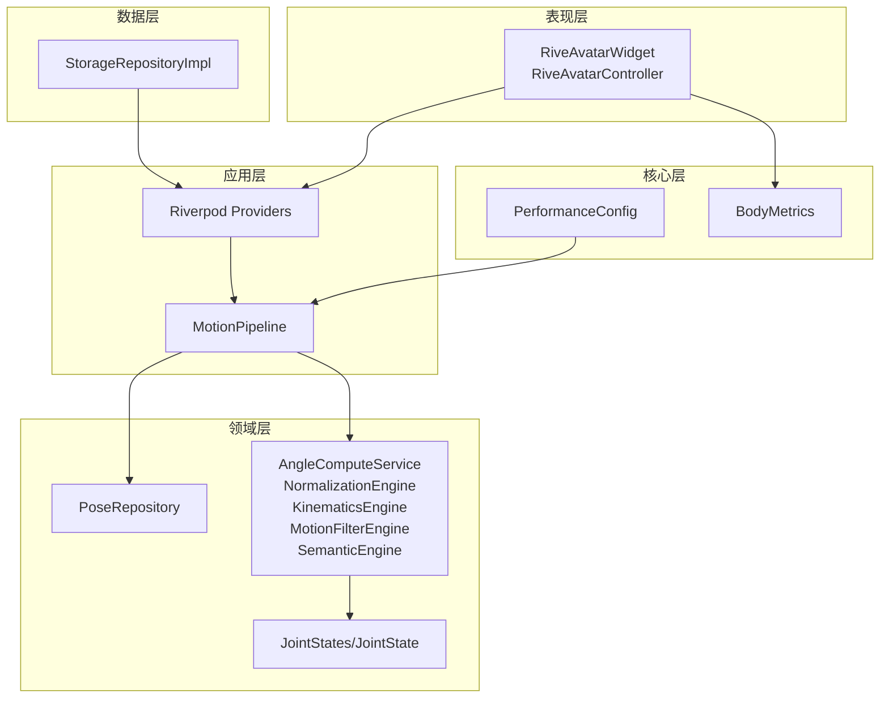
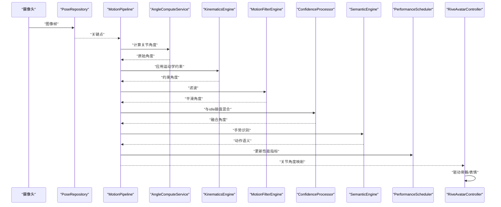
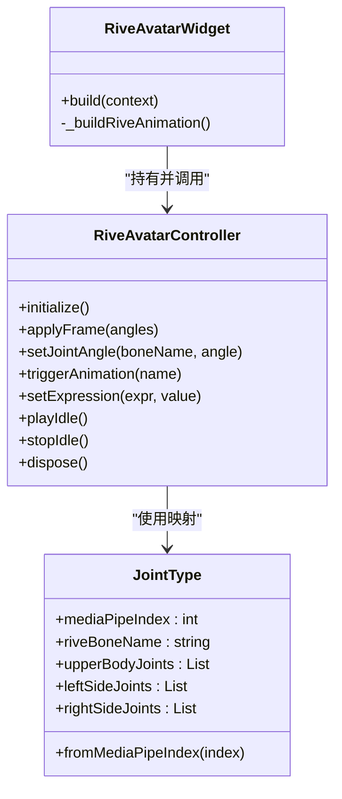
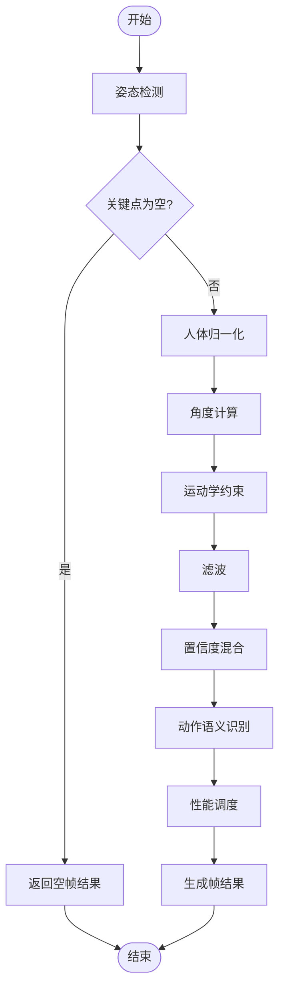
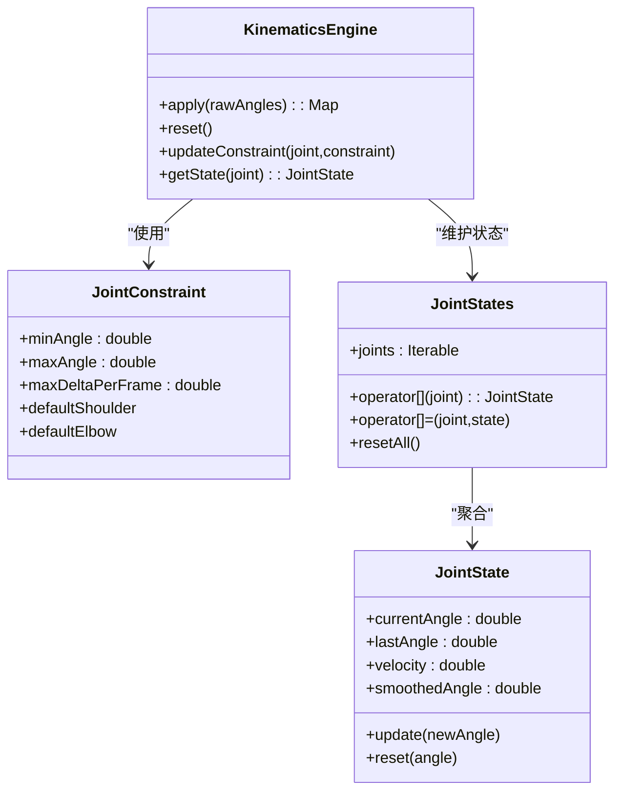
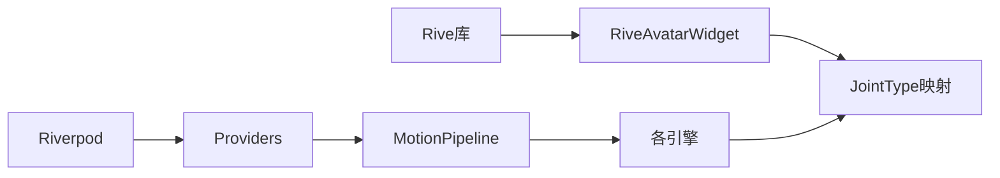

# 动画系统

<cite>
**本文引用的文件**
- [pubspec.yaml](file://pubspec.yaml)
- [main.dart](file://lib/main.dart)
- [rive_avatar_widget.dart](file://lib/presentation/widgets/rive_avatar_widget.dart)
- [joint_type.dart](file://lib/domain/entities/joint_type.dart)
- [motion_pipeline.dart](file://lib/application/pipeline/motion_pipeline.dart)
- [kinematics_engine.dart](file://lib/domain/engines/kinematics/kinematics_engine.dart)
- [joint_constraint.dart](file://lib/domain/engines/kinematics/joint_constraint.dart)
- [joint_state.dart](file://lib/domain/engines/kinematics/joint_state.dart)
- [providers.dart](file://lib/application/providers/providers.dart)
- [frame_result.dart](file://lib/domain/entities/frame_result.dart)
- [angle_compute_service.dart](file://lib/domain/services/angle_compute_service.dart)
- [performance_config.dart](file://lib/core/config/performance_config.dart)
- [body_metrics.dart](file://lib/domain/entities/body_metrics.dart)
</cite>

## 目录
1. [简介](#简介)
2. [项目结构](#项目结构)
3. [核心组件](#核心组件)
4. [架构总览](#架构总览)
5. [详细组件分析](#详细组件分析)
6. [依赖关系分析](#依赖关系分析)
7. [性能考量](#性能考量)
8. [故障排查指南](#故障排查指南)
9. [结论](#结论)
10. [附录](#附录)

## 简介
本文件面向Mimo项目的动画系统，聚焦于Rive动画的集成与实时驱动机制，解释从姿态数据到动画驱动的转换流程，覆盖骨骼控制、动画文件管理、渲染性能优化与资源管理、播放控制与状态管理、调试与性能监控，以及扩展性与第三方集成能力。文档以代码为依据，结合可视化图示帮助读者快速理解系统设计与实现要点。

## 项目结构
Mimo采用分层架构：应用入口负责路由与主题；应用层编排运动处理流水线；领域层包含姿态引擎、运动学、归一化、滤波、语义识别等；表现层包含Rive角色渲染与控制器；数据层提供仓库实现；核心层包含配置与常量。

图表来源
- [main.dart:1-34](file://lib/main.dart#L1-L34)
- [providers.dart:1-103](file://lib/application/providers/providers.dart#L1-L103)
- [motion_pipeline.dart:1-141](file://lib/application/pipeline/motion_pipeline.dart#L1-L141)
- [rive_avatar_widget.dart:1-118](file://lib/presentation/widgets/rive_avatar_widget.dart#L1-L118)
- [performance_config.dart:1-79](file://lib/core/config/performance_config.dart#L1-L79)
- [body_metrics.dart:1-109](file://lib/domain/entities/body_metrics.dart#L1-L109)

章节来源
- [main.dart:1-34](file://lib/main.dart#L1-L34)
- [pubspec.yaml:1-80](file://pubspec.yaml#L1-L80)

## 核心组件
- RiveAvatarWidget 与 RiveAvatarController：负责Rive角色的渲染与骨骼驱动接口（占位实现，待接入具体Rive API）。
- JointType：定义受支持的关节类型及与Rive骨骼名称的映射。
- MotionPipeline：串联姿态检测、置信度处理、归一化、角度计算、运动学约束、滤波、语义识别与性能调度。
- KinematicsEngine 与 JointStates/JointState：实现角度范围与单帧变化量约束，并跟踪关节状态。
- AngleComputeService：从关键点计算肩/肘关节角度。
- Riverpod Providers：集中管理各引擎与仓库实例，提供状态订阅。
- PerformanceConfig：定义目标/降级/最低推理帧率、分辨率、温度与延迟阈值等性能配置。
- BodyMetrics：人体度量数据，用于归一化不同用户动作幅度。

章节来源
- [rive_avatar_widget.dart:1-118](file://lib/presentation/widgets/rive_avatar_widget.dart#L1-L118)
- [joint_type.dart:1-66](file://lib/domain/entities/joint_type.dart#L1-L66)
- [motion_pipeline.dart:1-141](file://lib/application/pipeline/motion_pipeline.dart#L1-L141)
- [kinematics_engine.dart:1-95](file://lib/domain/engines/kinematics/kinematics_engine.dart#L1-L95)
- [joint_state.dart:1-99](file://lib/domain/engines/kinematics/joint_state.dart#L1-L99)
- [angle_compute_service.dart:1-120](file://lib/domain/services/angle_compute_service.dart#L1-L120)
- [providers.dart:1-103](file://lib/application/providers/providers.dart#L1-L103)
- [performance_config.dart:1-79](file://lib/core/config/performance_config.dart#L1-L79)
- [body_metrics.dart:1-109](file://lib/domain/entities/body_metrics.dart#L1-L109)

## 架构总览
下图展示从摄像头输入到Rive角色骨骼驱动的端到端流程，包括姿态检测、角度计算、运动学约束、滤波、置信度混合、语义识别与性能调度。

图表来源
- [motion_pipeline.dart:53-130](file://lib/application/pipeline/motion_pipeline.dart#L53-L130)
- [angle_compute_service.dart:20-65](file://lib/domain/services/angle_compute_service.dart#L20-L65)
- [kinematics_engine.dart:36-53](file://lib/domain/engines/kinematics/kinematics_engine.dart#L36-L53)
- [providers.dart:72-83](file://lib/application/providers/providers.dart#L72-L83)
- [rive_avatar_widget.dart:27-43](file://lib/presentation/widgets/rive_avatar_widget.dart#L27-L43)

## 详细组件分析

### Rive动画集成与实时驱动
- RiveAvatarWidget：作为渲染容器，监听人体度量与姿态结果，构建Rive动画组件。
- RiveAvatarController：提供占位的初始化、帧应用、动画触发、表情设置与资源释放接口，后续需对接Rive Artboard与RuntimeArtboard以实现骨骼驱动。
- 关节到骨骼映射：通过JointType.riveBoneName将关节类型映射到Rive骨骼名称，实现角度驱动。

图表来源
- [rive_avatar_widget.dart:74-118](file://lib/presentation/widgets/rive_avatar_widget.dart#L74-L118)
- [rive_avatar_widget.dart:9-71](file://lib/presentation/widgets/rive_avatar_widget.dart#L9-L71)
- [joint_type.dart:4-57](file://lib/domain/entities/joint_type.dart#L4-L57)

章节来源
- [rive_avatar_widget.dart:1-118](file://lib/presentation/widgets/rive_avatar_widget.dart#L1-L118)
- [joint_type.dart:1-66](file://lib/domain/entities/joint_type.dart#L1-L66)

### 姿态到动画的转换流程
- 输入：摄像头图像帧与尺寸。
- 处理：
  - 姿态检测输出关键点。
  - 归一化与角度计算得到原始角度。
  - 运动学约束限制角度范围与单帧变化量。
  - 滤波进一步平滑。
  - 置信度混合（与idle插值）。
  - 动作语义识别。
  - 性能调度更新FPS与延迟。
- 输出：FrameResult（包含关节角度、手势、置信度与时间戳），供Rive驱动。

图表来源
- [motion_pipeline.dart:61-130](file://lib/application/pipeline/motion_pipeline.dart#L61-L130)
- [frame_result.dart:20-35](file://lib/domain/entities/frame_result.dart#L20-L35)

章节来源
- [motion_pipeline.dart:1-141](file://lib/application/pipeline/motion_pipeline.dart#L1-L141)
- [frame_result.dart:1-93](file://lib/domain/entities/frame_result.dart#L1-L93)

### 骨骼控制机制与运动学约束
- 关节约束：通过JointConstraint定义角度范围与单帧最大变化量，避免突变与不自然动作。
- 关节状态：JointState记录当前/上一帧角度与角速度，并维护历史角度用于平滑。
- 运动学引擎：对每个关节应用约束，更新状态，确保符合人体生物力学。

图表来源
- [kinematics_engine.dart:9-95](file://lib/domain/engines/kinematics/kinematics_engine.dart#L9-L95)
- [joint_constraint.dart:4-47](file://lib/domain/engines/kinematics/joint_constraint.dart#L4-L47)
- [joint_state.dart:6-99](file://lib/domain/engines/kinematics/joint_state.dart#L6-L99)

章节来源
- [kinematics_engine.dart:1-95](file://lib/domain/engines/kinematics/kinematics_engine.dart#L1-L95)
- [joint_constraint.dart:1-47](file://lib/domain/engines/kinematics/joint_constraint.dart#L1-L47)
- [joint_state.dart:1-99](file://lib/domain/engines/kinematics/joint_state.dart#L1-L99)

### 动画文件管理策略
- 资源路径：Rive动画文件位于assets目录，通过RiveAnimation.asset加载。
- 资产声明：pubspec.yaml中声明了assets/rive与assets/sounds。
- 文件命名与组织：建议按角色/场景分类管理.riv文件，配合版本号与分支策略进行迭代。

章节来源
- [rive_avatar_widget.dart:111-117](file://lib/presentation/widgets/rive_avatar_widget.dart#L111-L117)
- [pubspec.yaml:76-79](file://pubspec.yaml#L76-L79)

### 动画渲染性能优化与资源管理
- 性能配置：定义目标/降级/最低推理帧率与分辨率，支持根据设备温度与延迟动态调整。
- 渲染策略：固定60FPS渲染，通过插值与滤波提升观感稳定性。
- 资源释放：RiveAvatarController提供dispose以清理Artboard与骨骼缓存。

章节来源
- [performance_config.dart:5-58](file://lib/core/config/performance_config.dart#L5-L58)
- [rive_avatar_widget.dart:65-71](file://lib/presentation/widgets/rive_avatar_widget.dart#L65-L71)

### 动画播放控制与状态管理
- 控制接口：提供播放idle、停止idle与触发动画的方法，表情参数设置预留。
- 状态订阅：通过Riverpod providers暴露当前FPS、追踪状态与人体度量，便于UI联动。

章节来源
- [rive_avatar_widget.dart:45-64](file://lib/presentation/widgets/rive_avatar_widget.dart#L45-L64)
- [providers.dart:95-103](file://lib/application/providers/providers.dart#L95-L103)

### 从姿态数据到动画驱动的转换细节
- 角度计算：基于关键点几何关系计算肩/肘角度，归一化到[-π, π]或限定范围。
- 置信度混合：将跟踪角度与idle角度按置信度插值，避免丢失时的突变。
- 骨骼驱动：将关节角度映射到Rive骨骼名称，调用控制器接口完成驱动（占位实现待接入）。

章节来源
- [angle_compute_service.dart:20-104](file://lib/domain/services/angle_compute_service.dart#L20-L104)
- [motion_pipeline.dart:100-112](file://lib/application/pipeline/motion_pipeline.dart#L100-L112)
- [rive_avatar_widget.dart:27-43](file://lib/presentation/widgets/rive_avatar_widget.dart#L27-L43)

## 依赖关系分析
- 外部依赖：Rive渲染库、Riverpod状态管理、ML Kit姿态检测、音频播放等。
- 内部耦合：MotionPipeline聚合多个引擎，Riverpod统一注入；RiveAvatarWidget依赖providers与JointType映射。

图表来源
- [pubspec.yaml:43-44](file://pubspec.yaml#L43-L44)
- [providers.dart:72-83](file://lib/application/providers/providers.dart#L72-L83)
- [motion_pipeline.dart:42-51](file://lib/application/pipeline/motion_pipeline.dart#L42-L51)
- [rive_avatar_widget.dart:74-118](file://lib/presentation/widgets/rive_avatar_widget.dart#L74-L118)

章节来源
- [pubspec.yaml:30-60](file://pubspec.yaml#L30-L60)
- [providers.dart:1-103](file://lib/application/providers/providers.dart#L1-L103)

## 性能考量
- 帧率与分辨率：根据性能等级选择推理帧率与分辨率，平衡流畅度与精度。
- 延迟与温度：监控延迟与设备温度，必要时降级策略保障稳定性。
- 渲染插值：固定渲染帧率，结合滤波与历史状态平滑，降低抖动感。
- 资源管理：及时释放Artboard与控制器，避免内存泄漏。

章节来源
- [performance_config.dart:36-79](file://lib/core/config/performance_config.dart#L36-L79)

## 故障排查指南
- Rive未驱动：检查JointType.riveBoneName是否与Rive骨骼一致，确认控制器初始化与applyFrame调用时机。
- 角度过度变化：检查运动学约束配置与单帧变化量，适当降低maxDeltaPerFrame。
- 置信度异常：确认置信度混合逻辑与idle角度插值权重，避免误判idle状态。
- 性能不足：启用降级性能等级，降低推理分辨率或帧率，减少滤波窗口。

章节来源
- [joint_constraint.dart:14-32](file://lib/domain/engines/kinematics/joint_constraint.dart#L14-L32)
- [kinematics_engine.dart:68-75](file://lib/domain/engines/kinematics/kinematics_engine.dart#L68-L75)
- [motion_pipeline.dart:100-112](file://lib/application/pipeline/motion_pipeline.dart#L100-L112)
- [performance_config.dart:36-58](file://lib/core/config/performance_config.dart#L36-L58)

## 结论
Mimo动画系统以Rive为核心渲染引擎，通过清晰的分层与Riverpod状态管理，实现了从姿态检测到骨骼驱动的完整链路。系统在运动学约束、滤波与置信度混合方面具备良好的鲁棒性，并提供性能配置与资源管理策略以适配多端设备。后续可在RiveAvatarController中接入Artboard与RuntimeArtboard，完善骨骼驱动与动画播放控制。

## 附录
- 动画文件格式：使用Rive .riv文件，建议在Rive编辑器中按左右对称结构组织骨骼层级。
- 导入导出：在Rive编辑器中导出.riv与相关资源，发布前在pubspec.yaml声明assets路径。
- 配置选项：通过PerformanceConfig调整推理帧率、分辨率与阈值；通过JointConstraint定制关节约束。
- 自定义方法：新增关节类型时，扩展JointType枚举并提供对应的Rive骨骼名；在AngleComputeService中添加角度计算逻辑；在MotionPipeline中插入新的处理阶段。
- 扩展与集成：可接入更多姿态模型或传感器数据；与音频播放模块联动实现音画同步；通过Providers扩展更多仓库与引擎。