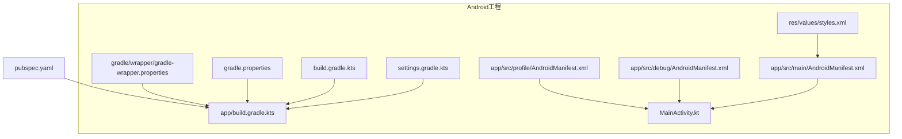
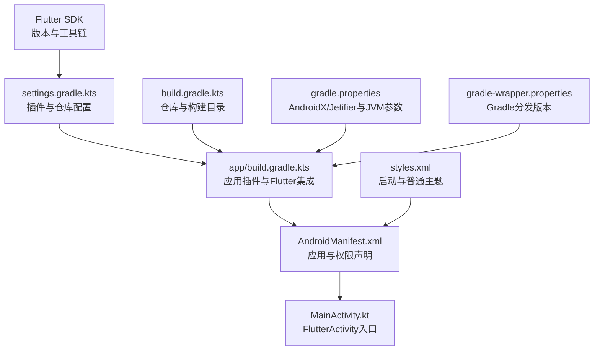
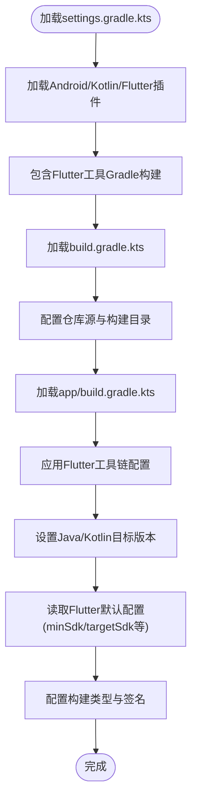
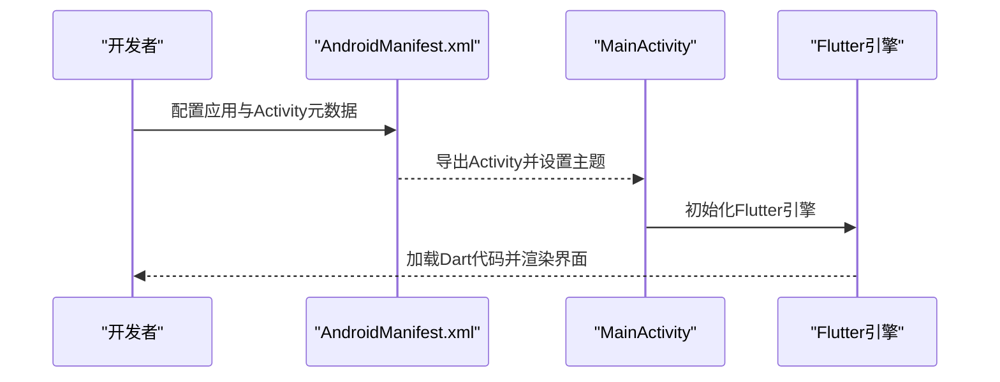
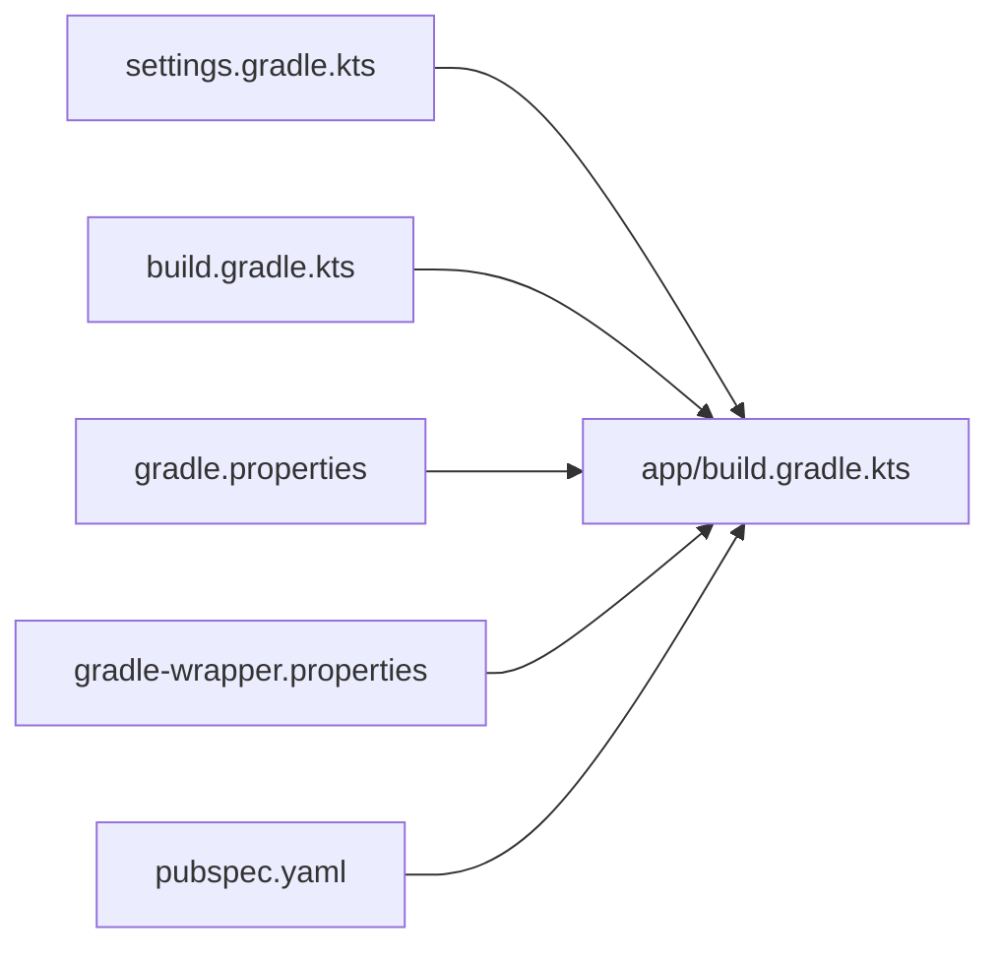

# Android平台

<cite>
**本文引用的文件**
- [android/app/build.gradle.kts](file://android/app/build.gradle.kts)
- [android/build.gradle.kts](file://android/build.gradle.kts)
- [android/gradle.properties](file://android/gradle.properties)
- [android/settings.gradle.kts](file://android/settings.gradle.kts)
- [android/gradle/wrapper/gradle-wrapper.properties](file://android/gradle/wrapper/gradle-wrapper.properties)
- [android/app/src/main/AndroidManifest.xml](file://android/app/src/main/AndroidManifest.xml)
- [android/app/src/debug/AndroidManifest.xml](file://android/app/src/debug/AndroidManifest.xml)
- [android/app/src/profile/AndroidManifest.xml](file://android/app/src/profile/AndroidManifest.xml)
- [android/app/src/main/kotlin/com/mimo/mimo_app/MainActivity.kt](file://android/app/src/main/kotlin/com/mimo/mimo_app/MainActivity.kt)
- [android/app/src/main/res/values/styles.xml](file://android/app/src/main/res/values/styles.xml)
- [pubspec.yaml](file://pubspec.yaml)
</cite>

## 目录
1. [简介](#简介)
2. [项目结构](#项目结构)
3. [核心组件](#核心组件)
4. [架构总览](#架构总览)
5. [详细组件分析](#详细组件分析)
6. [依赖分析](#依赖分析)
7. [性能考虑](#性能考虑)
8. [故障排查指南](#故障排查指南)
9. [结论](#结论)
10. [附录](#附录)

## 简介
本章节面向Android平台开发，围绕Mimo项目的Android工程配置与Gradle脚本进行系统化说明，涵盖构建配置、清单文件权限与应用配置、原生能力集成方式、版本配置（minSdk、targetSdk）的影响、签名与发布流程、Android Studio开发环境与调试技巧，以及内存与电池优化建议。内容基于仓库中实际存在的Android工程与Flutter配置文件整理而成，确保可操作性与准确性。

## 项目结构
Android工程位于android目录下，采用Flutter标准工程布局，包含应用模块app、全局Gradle配置、Gradle Wrapper、仓库配置与Flutter插件加载设置。核心文件包括：
- 应用模块Gradle脚本：定义编译SDK、Java/Kotlin版本、默认配置（应用ID、minSdk、targetSdk、版本号）、构建类型与签名配置，并通过flutter{}块关联Flutter源码路径。
- 全局Gradle脚本：统一仓库源、构建目录位置、子工程构建目录与清理任务。
- Gradle属性：启用AndroidX/Jetifier、JVM参数调优。
- Gradle Wrapper：指定Gradle分发版本。
- 清单文件：主清单、调试与Profile清单分别声明运行所需权限；Activity配置与主题资源。
- 主入口Activity：继承FlutterActivity，作为启动入口。
- 资源样式：启动主题与普通主题定义。

**图表来源**
- [android/app/build.gradle.kts:1-45](file://android/app/build.gradle.kts#L1-L45)
- [android/build.gradle.kts:1-22](file://android/build.gradle.kts#L1-L22)
- [android/gradle.properties:1-4](file://android/gradle.properties#L1-L4)
- [android/gradle/wrapper/gradle-wrapper.properties:1-6](file://android/gradle/wrapper/gradle-wrapper.properties#L1-L6)
- [android/settings.gradle.kts:1-26](file://android/settings.gradle.kts#L1-L26)
- [android/app/src/main/AndroidManifest.xml:1-46](file://android/app/src/main/AndroidManifest.xml#L1-L46)
- [android/app/src/debug/AndroidManifest.xml:1-8](file://android/app/src/debug/AndroidManifest.xml#L1-L8)
- [android/app/src/profile/AndroidManifest.xml:1-8](file://android/app/src/profile/AndroidManifest.xml#L1-L8)
- [android/app/src/main/kotlin/com/mimo/mimo_app/MainActivity.kt:1-6](file://android/app/src/main/kotlin/com/mimo/mimo_app/MainActivity.kt#L1-L6)
- [android/app/src/main/res/values/styles.xml:1-19](file://android/app/src/main/res/values/styles.xml#L1-L19)
- [pubspec.yaml:1-80](file://pubspec.yaml#L1-L80)

**章节来源**
- [android/app/build.gradle.kts:1-45](file://android/app/build.gradle.kts#L1-L45)
- [android/build.gradle.kts:1-22](file://android/build.gradle.kts#L1-L22)
- [android/gradle.properties:1-4](file://android/gradle.properties#L1-L4)
- [android/gradle/wrapper/gradle-wrapper.properties:1-6](file://android/gradle/wrapper/gradle-wrapper.properties#L1-L6)
- [android/settings.gradle.kts:1-26](file://android/settings.gradle.kts#L1-L26)
- [android/app/src/main/AndroidManifest.xml:1-46](file://android/app/src/main/AndroidManifest.xml#L1-L46)
- [android/app/src/debug/AndroidManifest.xml:1-8](file://android/app/src/debug/AndroidManifest.xml#L1-L8)
- [android/app/src/profile/AndroidManifest.xml:1-8](file://android/app/src/profile/AndroidManifest.xml#L1-L8)
- [android/app/src/main/kotlin/com/mimo/mimo_app/MainActivity.kt:1-6](file://android/app/src/main/kotlin/com/mimo/mimo_app/MainActivity.kt#L1-L6)
- [android/app/src/main/res/values/styles.xml:1-19](file://android/app/src/main/res/values/styles.xml#L1-L19)
- [pubspec.yaml:1-80](file://pubspec.yaml#L1-L80)

## 核心组件
- 构建脚本与插件链
  - 应用模块使用Android应用插件、Kotlin插件与Flutter Gradle插件，且Flutter插件需在Android与Kotlin之后应用，以确保Flutter工具链正确注入。
  - 编译SDK、NDK版本由Flutter工具链提供，Java/Kotlin目标版本统一至11。
  - 默认配置从Flutter工具链读取minSdk、targetSdk、versionCode与versionName，保证与Flutter侧一致。
  - 构建类型release默认使用debug签名配置以便直接运行，生产发布应替换为正式签名配置。
- 清单与权限
  - 主清单声明应用名称、图标、主Activity、硬件加速、配置变更处理、软键盘适配、查询意图（PROCESS_TEXT）等。
  - 调试与Profile清单显式声明INTERNET权限，便于热重载与断点调试。
- 主入口Activity
  - MainActivity继承FlutterActivity，作为Flutter引擎的宿主入口。
- 资源与主题
  - 启动主题与普通主题分别控制启动页背景与运行期窗口背景，配合v2嵌入模式使用。

**章节来源**
- [android/app/build.gradle.kts:1-45](file://android/app/build.gradle.kts#L1-L45)
- [android/app/src/main/AndroidManifest.xml:1-46](file://android/app/src/main/AndroidManifest.xml#L1-L46)
- [android/app/src/debug/AndroidManifest.xml:1-8](file://android/app/src/debug/AndroidManifest.xml#L1-L8)
- [android/app/src/profile/AndroidManifest.xml:1-8](file://android/app/src/profile/AndroidManifest.xml#L1-L8)
- [android/app/src/main/kotlin/com/mimo/mimo_app/MainActivity.kt:1-6](file://android/app/src/main/kotlin/com/mimo/mimo_app/MainActivity.kt#L1-L6)
- [android/app/src/main/res/values/styles.xml:1-19](file://android/app/src/main/res/values/styles.xml#L1-L19)

## 架构总览
下图展示Android工程与Flutter工具链的协作关系，以及关键配置文件之间的依赖：

**图表来源**
- [android/settings.gradle.kts:1-26](file://android/settings.gradle.kts#L1-L26)
- [android/build.gradle.kts:1-22](file://android/build.gradle.kts#L1-L22)
- [android/app/build.gradle.kts:1-45](file://android/app/build.gradle.kts#L1-L45)
- [android/gradle.properties:1-4](file://android/gradle.properties#L1-L4)
- [android/gradle/wrapper/gradle-wrapper.properties:1-6](file://android/gradle/wrapper/gradle-wrapper.properties#L1-L6)
- [android/app/src/main/AndroidManifest.xml:1-46](file://android/app/src/main/AndroidManifest.xml#L1-L46)
- [android/app/src/main/kotlin/com/mimo/mimo_app/MainActivity.kt:1-6](file://android/app/src/main/kotlin/com/mimo/mimo_app/MainActivity.kt#L1-L6)
- [android/app/src/main/res/values/styles.xml:1-19](file://android/app/src/main/res/values/styles.xml#L1-L19)

## 详细组件分析

### 构建与Gradle配置
- 插件与顺序
  - Android应用插件、Kotlin插件与Flutter Gradle插件按固定顺序应用，确保Flutter工具链正确注入。
- 编译与语言级别
  - 编译SDK与NDK版本由Flutter工具链提供；Java/Kotlin目标版本统一为11，提升兼容性与性能。
- 默认配置
  - 应用ID、minSdk、targetSdk、versionCode、versionName均来自Flutter工具链，保持与Flutter侧一致。
- 构建类型与签名
  - release类型默认使用debug签名配置，便于直接运行；生产发布需替换为正式签名配置。
- 全局仓库与构建目录
  - 统一仓库源（Google、Maven Central），自定义构建目录到根目录build，减少跨工程路径复杂度。
- Gradle Wrapper
  - 使用固定版本的Gradle分发包，确保团队一致性与可重复构建。

**图表来源**
- [android/settings.gradle.kts:1-26](file://android/settings.gradle.kts#L1-L26)
- [android/build.gradle.kts:1-22](file://android/build.gradle.kts#L1-L22)
- [android/app/build.gradle.kts:1-45](file://android/app/build.gradle.kts#L1-L45)
- [android/gradle/wrapper/gradle-wrapper.properties:1-6](file://android/gradle/wrapper/gradle-wrapper.properties#L1-L6)

**章节来源**
- [android/app/build.gradle.kts:1-45](file://android/app/build.gradle.kts#L1-L45)
- [android/build.gradle.kts:1-22](file://android/build.gradle.kts#L1-L22)
- [android/gradle.properties:1-4](file://android/gradle.properties#L1-L4)
- [android/gradle/wrapper/gradle-wrapper.properties:1-6](file://android/gradle/wrapper/gradle-wrapper.properties#L1-L6)
- [android/settings.gradle.kts:1-26](file://android/settings.gradle.kts#L1-L26)

### 清单与权限声明
- 主清单要点
  - 应用标签、图标、主Activity导出标志、单Top启动模式、任务亲和性、主题、配置变更处理、硬件加速、软键盘适配。
  - Flutter嵌入版本元数据用于生成插件注册类。
  - queries声明支持PROCESS_TEXT意图，满足文本处理相关插件需求。
- 调试与Profile清单
  - 显式声明INTERNET权限，便于开发时热重载与断点调试。
- 权限建议
  - 若涉及摄像头、麦克风、存储等敏感权限，应在主清单中添加相应声明，并在运行时请求用户授权。
  - 对于仅开发阶段需要的权限，保持仅在debug/profile变体中声明，避免影响生产包。

**图表来源**
- [android/app/src/main/AndroidManifest.xml:1-46](file://android/app/src/main/AndroidManifest.xml#L1-L46)
- [android/app/src/debug/AndroidManifest.xml:1-8](file://android/app/src/debug/AndroidManifest.xml#L1-L8)
- [android/app/src/profile/AndroidManifest.xml:1-8](file://android/app/src/profile/AndroidManifest.xml#L1-L8)
- [android/app/src/main/kotlin/com/mimo/mimo_app/MainActivity.kt:1-6](file://android/app/src/main/kotlin/com/mimo/mimo_app/MainActivity.kt#L1-L6)

**章节来源**
- [android/app/src/main/AndroidManifest.xml:1-46](file://android/app/src/main/AndroidManifest.xml#L1-L46)
- [android/app/src/debug/AndroidManifest.xml:1-8](file://android/app/src/debug/AndroidManifest.xml#L1-L8)
- [android/app/src/profile/AndroidManifest.xml:1-8](file://android/app/src/profile/AndroidManifest.xml#L1-L8)
- [android/app/src/main/kotlin/com/mimo/mimo_app/MainActivity.kt:1-6](file://android/app/src/main/kotlin/com/mimo/mimo_app/MainActivity.kt#L1-L6)

### 版本配置与影响
- minSdk与targetSdk的作用
  - minSdk决定最低兼容系统版本，影响可用API范围与运行时行为。
  - targetSdk影响系统对应用的运行时权限策略、默认行为与兼容性处理。
- 当前配置来源
  - 应用模块通过Flutter工具链读取minSdk与targetSdk，确保与Flutter侧版本一致。
- 建议
  - 定期评估并提升targetSdk以获得最新系统行为与安全更新。
  - 在提升minSdk前，评估用户设备覆盖情况与必要的兼容性处理。

**章节来源**
- [android/app/build.gradle.kts:27-30](file://android/app/build.gradle.kts#L27-L30)
- [pubspec.yaml:19](file://pubspec.yaml#L19)

### 原生功能集成方式
- Flutter嵌入模式
  - 清单中声明Flutter嵌入版本元数据，用于生成插件注册类，使原生插件与Dart层协同工作。
- 常见集成点
  - 摄像头、Rive动画、姿态识别（ML Kit）等原生能力通过Flutter插件接入，无需直接修改原生代码。
- 建议
  - 对于需要深度定制的场景，可在Android原生层新增Module或扩展现有插件，遵循Flutter插件规范。

**章节来源**
- [android/app/src/main/AndroidManifest.xml:30-32](file://android/app/src/main/AndroidManifest.xml#L30-L32)
- [pubspec.yaml:40-56](file://pubspec.yaml#L40-L56)

### 签名配置与发布流程
- 当前状态
  - release构建类型使用debug签名配置，便于快速运行与测试。
- 发布建议
  - 生成并配置正式签名密钥库，替换release签名配置。
  - 在CI/CD中安全存储密钥库与密码，构建时自动注入。
  - 生成混淆规则与资源压缩配置，结合ProGuard/R8优化产物体积与性能。

**章节来源**
- [android/app/build.gradle.kts:33-39](file://android/app/build.gradle.kts#L33-L39)

### Android Studio开发环境与调试技巧
- 开发环境
  - 使用与Gradle Wrapper匹配的Android Studio版本，确保Gradle与工具链兼容。
- 调试技巧
  - 利用debug/profile清单中的INTERNET权限进行热重载与断点调试。
  - 在MainActivity中设置日志与断点，观察Flutter引擎初始化与页面生命周期。
  - 结合Android Monitor查看CPU、内存与网络使用情况。

**章节来源**
- [android/app/src/debug/AndroidManifest.xml:1-8](file://android/app/src/debug/AndroidManifest.xml#L1-L8)
- [android/app/src/profile/AndroidManifest.xml:1-8](file://android/app/src/profile/AndroidManifest.xml#L1-L8)
- [android/app/src/main/kotlin/com/mimo/mimo_app/MainActivity.kt:1-6](file://android/app/src/main/kotlin/com/mimo/mimo_app/MainActivity.kt#L1-L6)

## 依赖分析
- Gradle插件与仓库
  - settings.gradle.kts集中管理插件版本与仓库源，includeBuild指向Flutter工具Gradle构建目录。
- 子工程依赖
  - 所有子工程构建目录统一指向根build目录，清理任务删除根构建目录，避免分散。
- Flutter集成
  - app/build.gradle.kts通过flutter{}块关联Flutter源码路径，确保Dart与原生同步构建。

**图表来源**
- [android/settings.gradle.kts:1-26](file://android/settings.gradle.kts#L1-L26)
- [android/build.gradle.kts:1-22](file://android/build.gradle.kts#L1-L22)
- [android/gradle.properties:1-4](file://android/gradle.properties#L1-L4)
- [android/gradle/wrapper/gradle-wrapper.properties:1-6](file://android/gradle/wrapper/gradle-wrapper.properties#L1-L6)
- [android/app/build.gradle.kts:42-44](file://android/app/build.gradle.kts#L42-L44)
- [pubspec.yaml:1-80](file://pubspec.yaml#L1-L80)

**章节来源**
- [android/settings.gradle.kts:1-26](file://android/settings.gradle.kts#L1-L26)
- [android/build.gradle.kts:1-22](file://android/build.gradle.kts#L1-L22)
- [android/gradle.properties:1-4](file://android/gradle.properties#L1-L4)
- [android/gradle/wrapper/gradle-wrapper.properties:1-6](file://android/gradle/wrapper/gradle-wrapper.properties#L1-L6)
- [android/app/build.gradle.kts:42-44](file://android/app/build.gradle.kts#L42-L44)
- [pubspec.yaml:1-80](file://pubspec.yaml#L1-L80)

## 性能考虑
- 内存管理
  - 合理使用缓存与对象池，避免大对象常驻堆内存。
  - 及时释放监听器与回调，防止泄漏。
  - 使用弱引用或惰性加载策略处理大型资源。
- 电池优化
  - 合并网络请求与后台任务，避免频繁唤醒CPU。
  - 使用WorkManager执行周期性任务，遵循系统Doze模式策略。
  - 关闭不必要的传感器与相机预览，降低功耗。
- 构建与运行
  - 启用增量编译与并行构建，缩短构建时间。
  - 使用ProGuard/R8进行代码压缩与混淆，减小包体。

[本节为通用性能指导，不直接分析具体文件]

## 故障排查指南
- 构建失败
  - 检查Gradle与Android Studio版本是否与gradle-wrapper.properties匹配。
  - 确认gradle.properties中AndroidX与Jetifier已启用。
  - 清理构建目录后重试，必要时删除.gradle缓存。
- 运行异常
  - 确认清单中INTERNET权限在debug/profile变体中存在。
  - 检查minSdk与targetSdk与设备系统版本兼容性。
  - 观察MainActivity初始化日志，定位Flutter引擎问题。
- 发布问题
  - 确认release签名配置已替换为正式密钥库。
  - 在CI/CD中验证签名与混淆配置。

**章节来源**
- [android/gradle/wrapper/gradle-wrapper.properties:1-6](file://android/gradle/wrapper/gradle-wrapper.properties#L1-L6)
- [android/gradle.properties:1-4](file://android/gradle.properties#L1-L4)
- [android/app/src/debug/AndroidManifest.xml:1-8](file://android/app/src/debug/AndroidManifest.xml#L1-L8)
- [android/app/src/profile/AndroidManifest.xml:1-8](file://android/app/src/profile/AndroidManifest.xml#L1-L8)
- [android/app/build.gradle.kts:33-39](file://android/app/build.gradle.kts#L33-L39)

## 结论
本文件基于仓库中的Android工程与Flutter配置，系统梳理了构建脚本、清单权限、版本配置、签名与发布、开发调试及性能优化等关键环节。建议在保持与Flutter工具链一致性的前提下，逐步完善生产级签名与混淆配置，并持续评估minSdk与targetSdk的升级策略，以兼顾兼容性与系统新特性。

## 附录
- 常用命令
  - 清理构建：执行根工程clean任务。
  - 生成构建目录：首次构建时自动生成。
- 参考路径
  - 应用模块构建脚本：[android/app/build.gradle.kts](file://android/app/build.gradle.kts)
  - 全局构建脚本：[android/build.gradle.kts](file://android/build.gradle.kts)
  - Gradle属性：[android/gradle.properties](file://android/gradle.properties)
  - Gradle Wrapper：[android/gradle/wrapper/gradle-wrapper.properties](file://android/gradle/wrapper/gradle-wrapper.properties)
  - 设置脚本：[android/settings.gradle.kts](file://android/settings.gradle.kts)
  - 主清单：[android/app/src/main/AndroidManifest.xml](file://android/app/src/main/AndroidManifest.xml)
  - 调试清单：[android/app/src/debug/AndroidManifest.xml](file://android/app/src/debug/AndroidManifest.xml)
  - Profile清单：[android/app/src/profile/AndroidManifest.xml](file://android/app/src/profile/AndroidManifest.xml)
  - 主入口Activity：[android/app/src/main/kotlin/com/mimo/mimo_app/MainActivity.kt](file://android/app/src/main/kotlin/com/mimo/mimo_app/MainActivity.kt)
  - 主题资源：[android/app/src/main/res/values/styles.xml](file://android/app/src/main/res/values/styles.xml)
  - Flutter配置：[pubspec.yaml](file://pubspec.yaml)