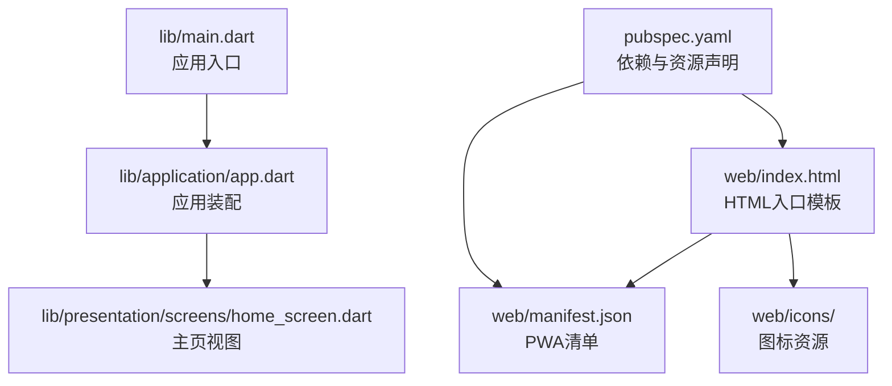
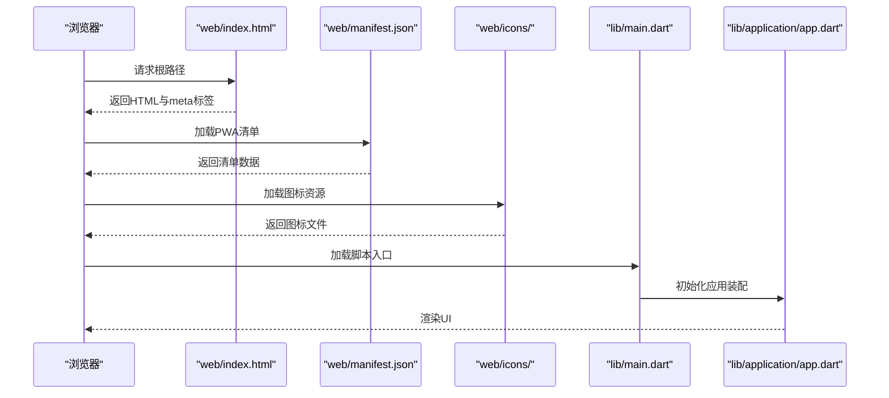
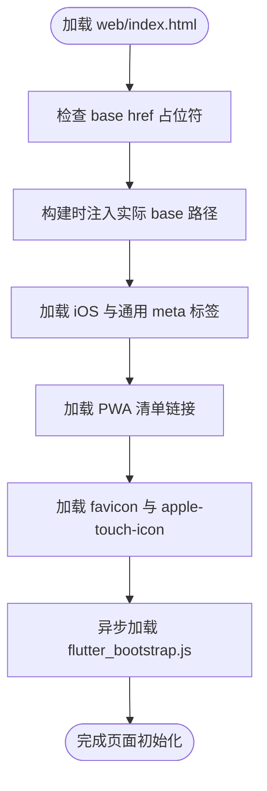
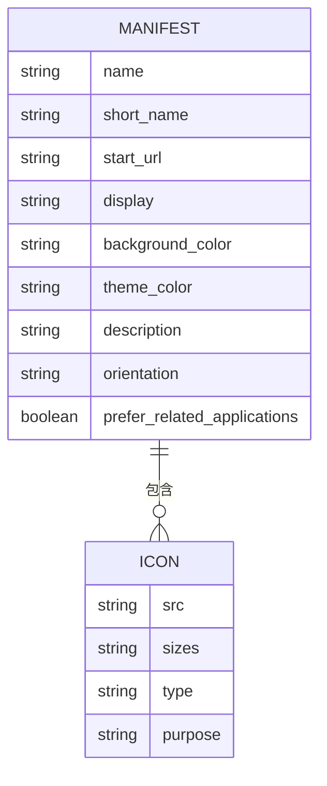
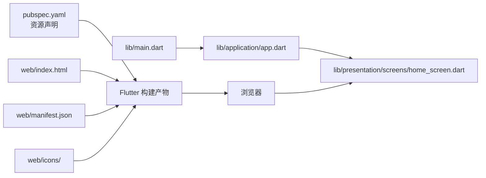
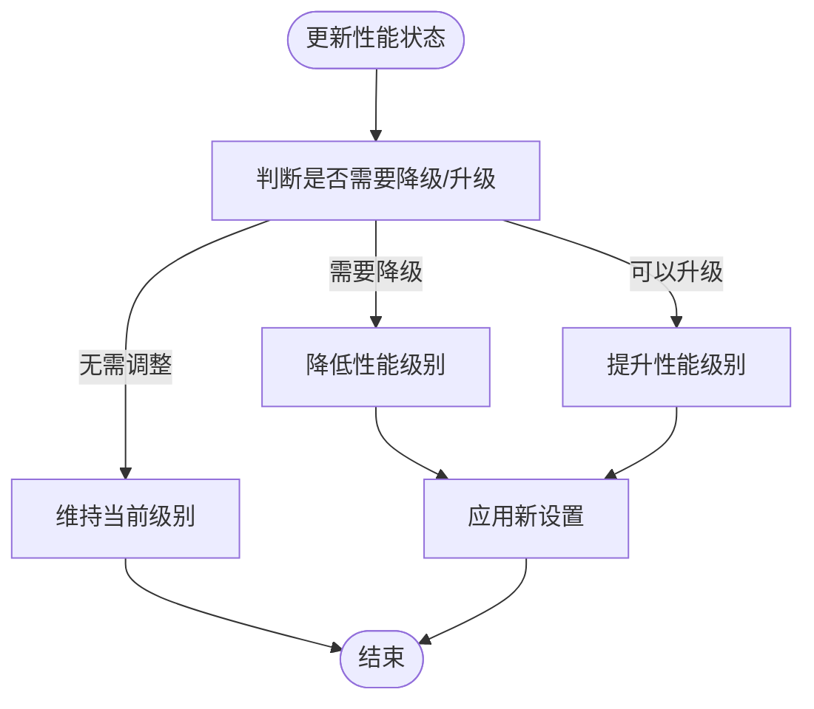

# Web平台

<cite>
**本文引用的文件**
- [web/index.html](file://web/index.html)
- [web/manifest.json](file://web/manifest.json)
- [pubspec.yaml](file://pubspec.yaml)
- [lib/main.dart](file://lib/main.dart)
- [lib/application/app.dart](file://lib/application/app.dart)
- [lib/presentation/screens/home_screen.dart](file://lib/presentation/screens/home_screen.dart)
- [lib/domain/engines/performance/performance_scheduler.dart](file://lib/domain/engines/performance/performance_scheduler.dart)
- [lib/core/config/performance_config.dart](file://lib/core/config/performance_config.dart)
- [lib/data/repositories_impl/camera_repository_impl.dart](file://lib/data/repositories_impl/camera_repository_impl.dart)
- [lib/domain/entities/frame_result.dart](file://lib/domain/entities/frame_result.dart)
</cite>

## 目录
1. [简介](#简介)
2. [项目结构](#项目结构)
3. [核心组件](#核心组件)
4. [架构总览](#架构总览)
5. [详细组件分析](#详细组件分析)
6. [依赖关系分析](#依赖关系分析)
7. [性能考虑](#性能考虑)
8. [故障排查指南](#故障排查指南)
9. [结论](#结论)
10. [附录](#附录)

## 简介
本章节面向Mimo项目的Web平台开发，系统化梳理Flutter Web的构建配置与部署策略，详解HTML模板、PWA清单与图标管理，说明浏览器兼容性与PWA特性在Web端的落地方式，并给出文件上传、剪贴板访问等Web特有功能的实现思路与最佳实践。同时提供Firebase Hosting与GitHub Pages等部署选项的配置要点与流程建议。

## 项目结构
Mimo的Web平台相关文件集中在web目录中，包含HTML入口模板、PWA清单与图标资源；应用主入口位于lib目录，业务逻辑与UI组件按领域模型分层组织。Flutter Web通过标准的构建流程生成静态资源，供托管服务分发。

**图表来源**
- [web/index.html:1-39](file://web/index.html#L1-L39)
- [web/manifest.json:1-36](file://web/manifest.json#L1-L36)
- [pubspec.yaml:72-80](file://pubspec.yaml#L72-L80)
- [lib/main.dart:1-50](file://lib/main.dart#L1-L50)
- [lib/application/app.dart:1-80](file://lib/application/app.dart#L1-L80)
- [lib/presentation/screens/home_screen.dart:1-60](file://lib/presentation/screens/home_screen.dart#L1-L60)

**章节来源**
- [web/index.html:1-39](file://web/index.html#L1-L39)
- [web/manifest.json:1-36](file://web/manifest.json#L1-L36)
- [pubspec.yaml:72-80](file://pubspec.yaml#L72-L80)
- [lib/main.dart:1-50](file://lib/main.dart#L1-L50)
- [lib/application/app.dart:1-80](file://lib/application/app.dart#L1-L80)
- [lib/presentation/screens/home_screen.dart:1-60](file://lib/presentation/screens/home_screen.dart#L1-L60)

## 核心组件
- HTML模板与基础路径：web/index.html定义了基础URL占位符、元信息、iOS PWA相关meta标签、favicon以及指向PWA清单的链接，确保在不同部署路径下正确解析资源。
- PWA清单与图标：web/manifest.json集中声明应用名称、显示模式、主题色、启动路径、方向与多尺寸图标，支持maskable图标以适配不同系统的圆角/遮罩展示。
- 资源与资产：pubspec.yaml的flutter部分声明了Rive与音效等资源，这些资源在Web构建后由Flutter工具链打包到输出目录。
- 应用入口与装配：lib/main.dart负责初始化平台环境，lib/application/app.dart进行路由与依赖装配，lib/presentation/screens/home_screen.dart承载Web端UI。

**章节来源**
- [web/index.html:17-33](file://web/index.html#L17-L33)
- [web/manifest.json:11-34](file://web/manifest.json#L11-L34)
- [pubspec.yaml:76-79](file://pubspec.yaml#L76-L79)
- [lib/main.dart:1-50](file://lib/main.dart#L1-L50)
- [lib/application/app.dart:1-80](file://lib/application/app.dart#L1-L80)
- [lib/presentation/screens/home_screen.dart:1-60](file://lib/presentation/screens/home_screen.dart#L1-L60)

## 架构总览
下图展示了Web平台从HTML模板到应用装配的整体流程，以及PWA清单与图标资源的关联关系。

**图表来源**
- [web/index.html:17-33](file://web/index.html#L17-L33)
- [web/manifest.json:1-36](file://web/manifest.json#L1-L36)
- [lib/main.dart:1-50](file://lib/main.dart#L1-L50)
- [lib/application/app.dart:1-80](file://lib/application/app.dart#L1-L80)

## 详细组件分析

### HTML模板与基础路径
- 基础路径占位符：模板中的base元素使用$FLUTTER_BASE_HREF占位符，构建时由flutter build注入实际base路径，确保非根路径部署时资源引用正确。
- 兼容性与元信息：meta标签包含charset、IE兼容性与描述信息；iOS相关meta用于在移动设备上以PWA形式安装。
- PWA集成：通过link rel="manifest"指向清单文件，使浏览器识别PWA元数据。
- 脚本加载：async加载flutter_bootstrap.js，提升首屏渲染性能。

**图表来源**
- [web/index.html:17-36](file://web/index.html#L17-L36)

**章节来源**
- [web/index.html:17-36](file://web/index.html#L17-L36)

### PWA清单与图标管理
- 清单字段：包含应用名称、短名、启动路径、显示模式、背景色与主题色、描述、方向、是否优先推荐原生应用等。
- 图标集合：提供192x192与512x512尺寸PNG图标，以及maskable用途的同尺寸图标，满足不同系统与桌面/移动端的展示需求。
- 启动与安装：standalone显示模式与正确的图标配置有助于在桌面端以独立窗口启动，提升用户体验。

**图表来源**
- [web/manifest.json:1-36](file://web/manifest.json#L1-L36)

**章节来源**
- [web/manifest.json:1-36](file://web/manifest.json#L1-L36)

### 浏览器兼容性与PWA特性
- 兼容性：meta标签设置X-UA-Compatible以确保在较老IE环境下采用最新渲染引擎；HTML5语义与现代meta标签提升跨浏览器一致性。
- PWA特性：通过manifest.json与service worker机制（由Flutter工具链生成）实现离线缓存、安装提示与桌面化启动；图标资源完善有助于在不同系统上获得一致的安装体验。

**章节来源**
- [web/index.html:19-27](file://web/index.html#L19-L27)
- [web/manifest.json:4-10](file://web/manifest.json#L4-L10)

### Web特有功能：文件上传与剪贴板访问
- 文件上传：在Web端可通过HTML input元素或拖拽交互触发文件选择，结合Dart侧的File API进行读取与处理。建议在UI层提供直观的上传入口，并在业务层对文件类型与大小进行校验。
- 剪贴板访问：利用Web平台的Clipboard API实现复制/粘贴功能，需注意权限与安全策略限制，确保在HTTPS环境下可用。

[本小节为概念性说明，不直接分析具体代码文件]

### SEO优化与性能监控
- SEO优化：在HTML模板中设置合理的title与description；为关键页面提供结构化数据；确保构建产物包含必要的预连接与预加载指令以加速资源加载。
- 性能监控：结合前端埋点与浏览器性能API，记录首屏时间、关键渲染路径与交互延迟；在应用层实现性能状态跟踪与动态降级策略，保障在低端设备上的流畅体验。

[本小节为概念性说明，不直接分析具体代码文件]

### 部署选项与配置指南
- Firebase Hosting：配置firebase.json指定public目录与重写规则；将Flutter Web构建产物放置于public目录；启用HTTPS与CDN加速。
- GitHub Pages：将构建产物推送到gh-pages分支或docs目录；在仓库设置中启用Pages服务；若部署在子路径，需配合HTML模板的base href与构建参数使用。

[本小节为概念性说明，不直接分析具体代码文件]

## 依赖关系分析
Web平台的运行依赖于HTML模板、PWA清单与图标资源，以及应用入口与装配模块之间的协作。Flutter工具链会根据pubspec.yaml中的资源声明打包静态资源，最终由web/index.html与web/manifest.json共同驱动浏览器行为。

**图表来源**
- [pubspec.yaml:76-79](file://pubspec.yaml#L76-L79)
- [web/index.html:17-33](file://web/index.html#L17-L33)
- [web/manifest.json:1-36](file://web/manifest.json#L1-L36)
- [lib/main.dart:1-50](file://lib/main.dart#L1-L50)
- [lib/application/app.dart:1-80](file://lib/application/app.dart#L1-L80)
- [lib/presentation/screens/home_screen.dart:1-60](file://lib/presentation/screens/home_screen.dart#L1-L60)

**章节来源**
- [pubspec.yaml:76-79](file://pubspec.yaml#L76-L79)
- [web/index.html:17-33](file://web/index.html#L17-L33)
- [web/manifest.json:1-36](file://web/manifest.json#L1-L36)
- [lib/main.dart:1-50](file://lib/main.dart#L1-L50)
- [lib/application/app.dart:1-80](file://lib/application/app.dart#L1-L80)
- [lib/presentation/screens/home_screen.dart:1-60](file://lib/presentation/screens/home_screen.dart#L1-L60)

## 性能考虑
- 渲染与推理：应用内置性能调度器，基于FPS、延迟与温度指标动态调整性能级别，避免在高负载场景下出现卡顿或过热。
- 资源加载：合理拆分与懒加载静态资源，结合CDN与缓存策略减少首屏时间；在HTML模板中适当配置预连接与预加载。
- 设备适配：针对低端设备启用低分辨率推理与降级策略，保持交互流畅性。

**图表来源**
- [lib/domain/engines/performance/performance_scheduler.dart:90-129](file://lib/domain/engines/performance/performance_scheduler.dart#L90-L129)
- [lib/core/config/performance_config.dart:1-34](file://lib/core/config/performance_config.dart#L1-L34)

**章节来源**
- [lib/domain/engines/performance/performance_scheduler.dart:1-194](file://lib/domain/engines/performance/performance_scheduler.dart#L1-L194)
- [lib/core/config/performance_config.dart:1-34](file://lib/core/config/performance_config.dart#L1-L34)

## 故障排查指南
- 基础路径问题：若部署在子路径导致资源404，确认HTML模板中的base href已被构建参数正确替换，且服务器未覆盖该行为。
- PWA安装失败：检查manifest.json字段完整性与图标资源可达性；确保网站通过HTTPS提供服务。
- 首屏缓慢：核查静态资源体积与网络状况，启用压缩与缓存；在应用层评估是否需要降级策略。
- 摄像头/媒体流：Web端摄像头访问需HTTPS与用户授权，确保权限弹窗与错误提示清晰；参考相机仓库实现的预览停止与切换逻辑。

**章节来源**
- [web/index.html:17-17](file://web/index.html#L17-L17)
- [web/manifest.json:1-36](file://web/manifest.json#L1-L36)
- [lib/data/repositories_impl/camera_repository_impl.dart:56-97](file://lib/data/repositories_impl/camera_repository_impl.dart#L56-L97)

## 结论
Mimo的Web平台通过标准化的HTML模板与PWA清单实现了良好的跨浏览器兼容性与安装体验；借助性能调度器与资源优化策略，可在多样硬件条件下保持稳定表现。结合合适的部署方案与监控手段，可进一步提升Web端的可用性与用户体验。

## 附录
- 构建与部署建议：使用Flutter Web构建命令生成静态产物，按目标托管平台要求配置入口目录与重写规则；在生产环境启用HTTPS、CDN与缓存策略。
- 资源管理：确保所有图标与静态资源随构建流程一并打包，避免运行时资源缺失。

[本小节为概念性说明，不直接分析具体代码文件]