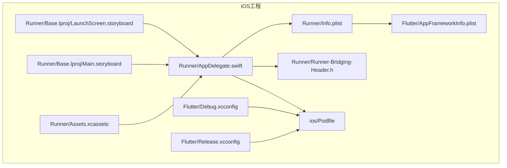
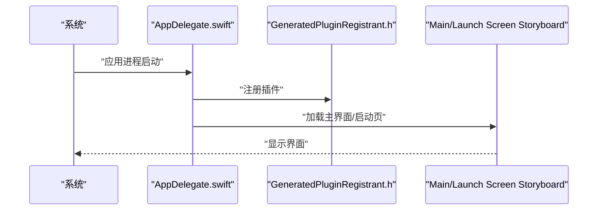
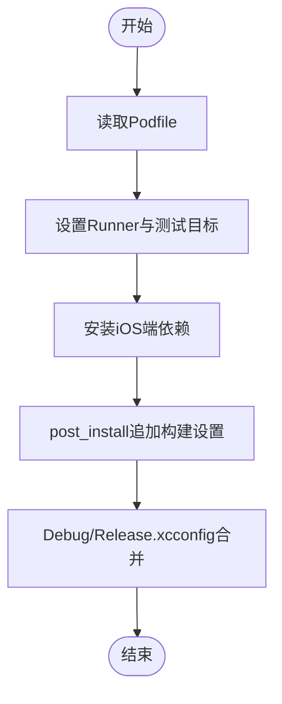
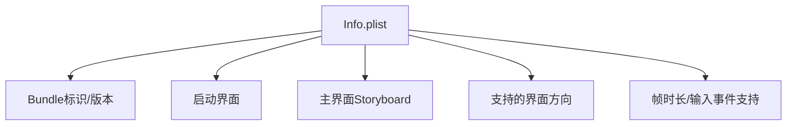
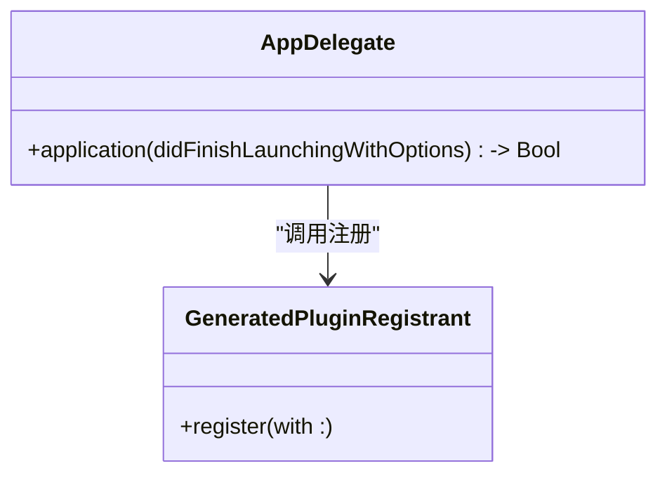
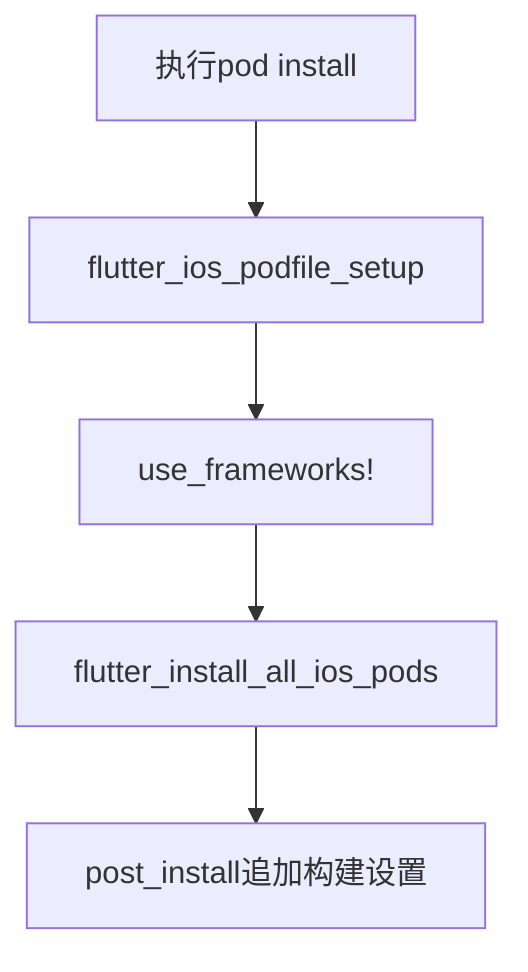
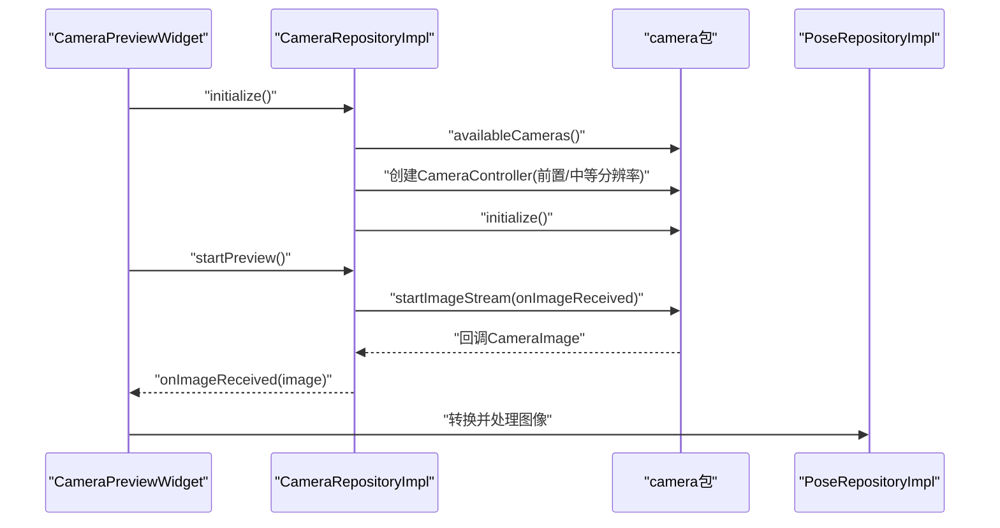
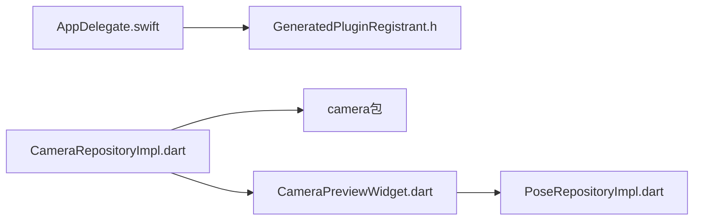

# iOS平台

<cite>
**本文引用的文件**
- [ios/Runner/Info.plist](file://ios/Runner/Info.plist)
- [ios/Runner/AppDelegate.swift](file://ios/Runner/AppDelegate.swift)
- [ios/Runner/Runner-Bridging-Header.h](file://ios/Runner/Runner-Bridging-Header.h)
- [ios/Flutter/AppFrameworkInfo.plist](file://ios/Flutter/AppFrameworkInfo.plist)
- [ios/Flutter/Debug.xcconfig](file://ios/Flutter/Debug.xcconfig)
- [ios/Flutter/Release.xcconfig](file://ios/Flutter/Release.xcconfig)
- [ios/Runner/Base.lproj/LaunchScreen.storyboard](file://ios/Runner/Base.lproj/LaunchScreen.storyboard)
- [ios/Runner/Base.lproj/Main.storyboard](file://ios/Runner/Base.lproj/Main.storyboard)
- [ios/Podfile](file://ios/Podfile)
- [pubspec.yaml](file://pubspec.yaml)
- [lib/data/repositories_impl/camera_repository_impl.dart](file://lib/data/repositories_impl/camera_repository_impl.dart)
- [lib/domain/repositories/camera_repository.dart](file://lib/domain/repositories/camera_repository.dart)
- [lib/presentation/widgets/camera_preview_widget.dart](file://lib/presentation/widgets/camera_preview_widget.dart)
- [lib/data/repositories_impl/pose_repository_impl.dart](file://lib/data/repositories_impl/pose_repository_impl.dart)
</cite>

## 目录
1. [简介](#简介)
2. [项目结构](#项目结构)
3. [核心组件](#核心组件)
4. [架构总览](#架构总览)
5. [详细组件分析](#详细组件分析)
6. [依赖关系分析](#依赖关系分析)
7. [性能考虑](#性能考虑)
8. [故障排查指南](#故障排查指南)
9. [结论](#结论)
10. [附录](#附录)

## 简介
本文件面向Mimo项目的iOS平台开发，围绕Xcode工程配置、Info.plist权限与系统集成、Swift原生代码与Flutter集成、CocoaPods依赖管理、iOS原生能力（如相机访问）实现、应用商店发布流程与审核要点，以及设备适配与性能优化最佳实践进行系统化说明。内容以仓库中现有配置与代码为依据，避免臆测，确保可操作性与准确性。

## 项目结构
iOS相关工程位于ios目录，包含Flutter框架层、Runner宿主应用、资源与构建配置。关键文件包括：
- 应用入口与生命周期：AppDelegate.swift
- 应用元数据与权限：Info.plist
- 构建配置：Flutter/Debug.xcconfig、Flutter/Release.xcconfig
- 启动与主界面：Base.lproj/LaunchScreen.storyboard、Base.lproj/Main.storyboard
- 依赖管理：ios/Podfile
- 资源与图标：Runner/Assets.xcassets
- Swift桥接头：Runner-Bridging-Header.h
- Flutter框架元数据：Flutter/AppFrameworkInfo.plist

**图表来源**
- [ios/Runner/AppDelegate.swift:1-14](file://ios/Runner/AppDelegate.swift#L1-L14)
- [ios/Runner/Info.plist:1-50](file://ios/Runner/Info.plist#L1-L50)
- [ios/Flutter/AppFrameworkInfo.plist:1-27](file://ios/Flutter/AppFrameworkInfo.plist#L1-L27)
- [ios/Flutter/Debug.xcconfig:1-3](file://ios/Flutter/Debug.xcconfig#L1-L3)
- [ios/Flutter/Release.xcconfig:1-3](file://ios/Flutter/Release.xcconfig#L1-L3)
- [ios/Runner/Base.lproj/LaunchScreen.storyboard:1-38](file://ios/Runner/Base.lproj/LaunchScreen.storyboard#L1-L38)
- [ios/Runner/Base.lproj/Main.storyboard:1-27](file://ios/Runner/Base.lproj/Main.storyboard#L1-L27)
- [ios/Runner/Runner-Bridging-Header.h:1-2](file://ios/Runner/Runner-Bridging-Header.h#L1-L2)
- [ios/Podfile:1-44](file://ios/Podfile#L1-L44)
- [ios/Runner/Assets.xcassets/AppIcon.appiconset/Contents.json:72-122](file://ios/Runner/Assets.xcassets/AppIcon.appiconset/Contents.json#L72-L122)

**章节来源**
- [ios/Runner/Info.plist:1-50](file://ios/Runner/Info.plist#L1-L50)
- [ios/Runner/AppDelegate.swift:1-14](file://ios/Runner/AppDelegate.swift#L1-L14)
- [ios/Flutter/AppFrameworkInfo.plist:1-27](file://ios/Flutter/AppFrameworkInfo.plist#L1-L27)
- [ios/Flutter/Debug.xcconfig:1-3](file://ios/Flutter/Debug.xcconfig#L1-L3)
- [ios/Flutter/Release.xcconfig:1-3](file://ios/Flutter/Release.xcconfig#L1-L3)
- [ios/Runner/Base.lproj/LaunchScreen.storyboard:1-38](file://ios/Runner/Base.lproj/LaunchScreen.storyboard#L1-L38)
- [ios/Runner/Base.lproj/Main.storyboard:1-27](file://ios/Runner/Base.lproj/Main.storyboard#L1-L27)
- [ios/Podfile:1-44](file://ios/Podfile#L1-L44)
- [ios/Runner/Runner-Bridging-Header.h:1-2](file://ios/Runner/Runner-Bridging-Header.h#L1-L2)

## 核心组件
- 应用入口与插件注册：AppDelegate负责在应用启动时完成插件注册，确保Flutter引擎与原生环境协同工作。
- 应用元数据与系统集成：Info.plist定义应用标识、版本、支持的屏幕方向、启动与主界面Storyboard、以及帧率与输入事件支持等。
- 构建配置：Debug/Release.xcconfig通过包含Pod生成的配置与Flutter生成的配置，统一构建参数。
- 依赖管理：Podfile通过flutter_tools提供的辅助方法安装iOS端依赖，并在安装后追加额外构建设置。
- 资源与图标：Assets.xcassets提供App图标与启动图，满足多尺寸与多设备需求。
- Swift桥接：桥接头导入GeneratedPluginRegistrant.h，使Swift侧能访问由Flutter生成的插件注册表。

**章节来源**
- [ios/Runner/AppDelegate.swift:1-14](file://ios/Runner/AppDelegate.swift#L1-L14)
- [ios/Runner/Info.plist:1-50](file://ios/Runner/Info.plist#L1-L50)
- [ios/Flutter/Debug.xcconfig:1-3](file://ios/Flutter/Debug.xcconfig#L1-L3)
- [ios/Flutter/Release.xcconfig:1-3](file://ios/Flutter/Release.xcconfig#L1-L3)
- [ios/Podfile:1-44](file://ios/Podfile#L1-L44)
- [ios/Runner/Runner-Bridging-Header.h:1-2](file://ios/Runner/Runner-Bridging-Header.h#L1-L2)

## 架构总览
下图展示从应用启动到Flutter引擎加载、再到插件注册的整体流程，映射到实际代码文件：

**图表来源**
- [ios/Runner/AppDelegate.swift:1-14](file://ios/Runner/AppDelegate.swift#L1-L14)
- [ios/Runner/Runner-Bridging-Header.h:1-2](file://ios/Runner/Runner-Bridging-Header.h#L1-L2)
- [ios/Runner/Base.lproj/Main.storyboard:1-27](file://ios/Runner/Base.lproj/Main.storyboard#L1-L27)
- [ios/Runner/Base.lproj/LaunchScreen.storyboard:1-38](file://ios/Runner/Base.lproj/LaunchScreen.storyboard#L1-L38)

## 详细组件分析

### Xcode项目配置与构建设置
- 平台与最低系统版本：Flutter框架元数据声明最低系统版本，确保运行环境符合要求。
- Debug/Release构建配置：Debug与Release配置包含Pod生成的Target配置与Flutter生成的配置，保证构建参数一致。
- 工程目标与方案：Podfile定义Runner目标及测试目标，使用framework模式安装依赖并继承搜索路径。
- 附加构建设置：post_install阶段为所有Pod目标追加额外iOS构建设置，提升兼容性与稳定性。

**图表来源**
- [ios/Podfile:1-44](file://ios/Podfile#L1-L44)
- [ios/Flutter/Debug.xcconfig:1-3](file://ios/Flutter/Debug.xcconfig#L1-L3)
- [ios/Flutter/Release.xcconfig:1-3](file://ios/Flutter/Release.xcconfig#L1-L3)

**章节来源**
- [ios/Flutter/AppFrameworkInfo.plist:1-27](file://ios/Flutter/AppFrameworkInfo.plist#L1-L27)
- [ios/Flutter/Debug.xcconfig:1-3](file://ios/Flutter/Debug.xcconfig#L1-L3)
- [ios/Flutter/Release.xcconfig:1-3](file://ios/Flutter/Release.xcconfig#L1-L3)
- [ios/Podfile:1-44](file://ios/Podfile#L1-L44)

### Info.plist权限与系统集成设置
- 应用标识与版本：通过占位符映射到Flutter构建名与构建号，确保与pubspec.yaml版本策略一致。
- 启动与主界面：指定启动Storyboard与主Storyboard，保证启动流程与界面加载。
- 屏幕方向：支持手机竖向与横向，iPad支持上下翻转与横向，满足多形态使用。
- 帧率与输入：启用最小帧时长禁用与间接输入事件支持，提升交互流畅度与兼容性。

**图表来源**
- [ios/Runner/Info.plist:1-50](file://ios/Runner/Info.plist#L1-L50)

**章节来源**
- [ios/Runner/Info.plist:1-50](file://ios/Runner/Info.plist#L1-L50)

### Swift原生代码与Flutter集成
- 插件注册：AppDelegate在应用启动完成后调用插件注册函数，确保所有插件可用。
- 桥接头：桥接头导入GeneratedPluginRegistrant.h，使Swift侧能够访问插件注册表。
- 生命周期：基于FlutterAppDelegate，遵循Flutter生命周期约定。

**图表来源**
- [ios/Runner/AppDelegate.swift:1-14](file://ios/Runner/AppDelegate.swift#L1-L14)
- [ios/Runner/Runner-Bridging-Header.h:1-2](file://ios/Runner/Runner-Bridging-Header.h#L1-L2)

**章节来源**
- [ios/Runner/AppDelegate.swift:1-14](file://ios/Runner/AppDelegate.swift#L1-L14)
- [ios/Runner/Runner-Bridging-Header.h:1-2](file://ios/Runner/Runner-Bridging-Header.h#L1-L2)

### CocoaPods依赖管理与CocoaPods使用
- 依赖安装：通过flutter_install_all_ios_pods自动安装iOS端依赖。
- 目标与测试：Runner为目标，RunnerTests继承搜索路径，便于测试。
- 附加设置：post_install阶段对所有Pod目标追加额外iOS构建设置，减少兼容性问题。

**图表来源**
- [ios/Podfile:1-44](file://ios/Podfile#L1-L44)

**章节来源**
- [ios/Podfile:1-44](file://ios/Podfile#L1-L44)

### iOS原生功能：相机访问与姿态识别
- 相机初始化与预览：通过camera包初始化前置摄像头，设置分辨率与图像格式，启动图像流并提供切换摄像头能力。
- 图像流回调：将原始图像传递给上层逻辑，用于后续处理或渲染。
- 姿态识别：将相机图像转换为InputImage，供ML Kit姿态检测使用；根据平台选择合适的图像格式组（iOS默认BGRA8888）。

**图表来源**
- [lib/presentation/widgets/camera_preview_widget.dart:1-49](file://lib/presentation/widgets/camera_preview_widget.dart#L1-L49)
- [lib/data/repositories_impl/camera_repository_impl.dart:1-97](file://lib/data/repositories_impl/camera_repository_impl.dart#L1-L97)
- [lib/data/repositories_impl/pose_repository_impl.dart:73-114](file://lib/data/repositories_impl/pose_repository_impl.dart#L73-L114)

**章节来源**
- [lib/data/repositories_impl/camera_repository_impl.dart:1-97](file://lib/data/repositories_impl/camera_repository_impl.dart#L1-L97)
- [lib/domain/repositories/camera_repository.dart:1-28](file://lib/domain/repositories/camera_repository.dart#L1-L28)
- [lib/presentation/widgets/camera_preview_widget.dart:1-49](file://lib/presentation/widgets/camera_preview_widget.dart#L1-L49)
- [lib/data/repositories_impl/pose_repository_impl.dart:73-114](file://lib/data/repositories_impl/pose_repository_impl.dart#L73-L114)

### iOS应用商店发布流程与审核要点
- 版本与构建号：应用版本与构建号由pubspec.yaml定义，Info.plist通过占位符映射到Bundle短版本与构建号，确保发布一致性。
- 资源与图标：App图标与启动图需按规范准备多尺寸资源，确保不同设备与场景下的清晰显示。
- 权限与隐私：若涉及相机等敏感权限，应在Info.plist中正确声明用途字符串并在首次使用前请求授权。
- 审核清单：遵循Apple审核指南，确保应用名称、描述、截图、隐私政策链接等信息完整且合规。

**章节来源**
- [pubspec.yaml:1-80](file://pubspec.yaml#L1-L80)
- [ios/Runner/Info.plist:1-50](file://ios/Runner/Info.plist#L1-L50)
- [ios/Runner/Assets.xcassets/AppIcon.appiconset/Contents.json:72-122](file://ios/Runner/Assets.xcassets/AppIcon.appiconset/Contents.json#L72-L122)

## 依赖关系分析
- 组件内聚与耦合：AppDelegate与GeneratedPluginRegistrant紧密耦合，确保插件注册；相机仓库与camera包解耦，便于替换实现。
- 外部依赖：Podfile集中管理iOS端依赖，post_install统一追加构建设置，降低环境差异带来的问题。
- 数据流：相机图像流经仓库回调至UI层，随后进入姿态识别处理，形成清晰的数据链路。

**图表来源**
- [ios/Runner/AppDelegate.swift:1-14](file://ios/Runner/AppDelegate.swift#L1-L14)
- [ios/Runner/Runner-Bridging-Header.h:1-2](file://ios/Runner/Runner-Bridging-Header.h#L1-L2)
- [lib/data/repositories_impl/camera_repository_impl.dart:1-97](file://lib/data/repositories_impl/camera_repository_impl.dart#L1-L97)
- [lib/presentation/widgets/camera_preview_widget.dart:1-49](file://lib/presentation/widgets/camera_preview_widget.dart#L1-L49)
- [lib/data/repositories_impl/pose_repository_impl.dart:73-114](file://lib/data/repositories_impl/pose_repository_impl.dart#L73-L114)

**章节来源**
- [ios/Podfile:1-44](file://ios/Podfile#L1-L44)
- [lib/data/repositories_impl/camera_repository_impl.dart:1-97](file://lib/data/repositories_impl/camera_repository_impl.dart#L1-L97)
- [lib/presentation/widgets/camera_preview_widget.dart:1-49](file://lib/presentation/widgets/camera_preview_widget.dart#L1-L49)

## 性能考虑
- 帧率与输入：启用最小帧时长禁用与间接输入事件支持，有助于在高负载场景保持流畅体验。
- 相机分辨率与格式：在保证效果的前提下选择合适分辨率与图像格式，减少CPU/GPU压力。
- 依赖与构建：通过post_install统一构建设置，避免重复编译与链接错误，缩短构建时间。
- 资源优化：确保App图标与启动图尺寸恰当，避免过大资源导致冷启动延迟。

**章节来源**
- [ios/Runner/Info.plist:1-50](file://ios/Runner/Info.plist#L1-L50)
- [ios/Podfile:1-44](file://ios/Podfile#L1-L44)

## 故障排查指南
- 插件未注册：确认AppDelegate中已完成插件注册调用，且桥接头导入了GeneratedPluginRegistrant。
- 相机无画面：检查相机初始化是否成功、图像流是否启动、前置摄像头是否存在；必要时切换到后置摄像头验证。
- 构建失败：确保已执行flutter pub get后再执行pod install；检查Flutter生成的配置文件是否存在。
- 启动异常：核对Info.plist中的启动与主界面Storyboard配置，确保与实际文件一致。

**章节来源**
- [ios/Runner/AppDelegate.swift:1-14](file://ios/Runner/AppDelegate.swift#L1-L14)
- [ios/Runner/Runner-Bridging-Header.h:1-2](file://ios/Runner/Runner-Bridging-Header.h#L1-L2)
- [lib/data/repositories_impl/camera_repository_impl.dart:1-97](file://lib/data/repositories_impl/camera_repository_impl.dart#L1-L97)
- [ios/Podfile:1-44](file://ios/Podfile#L1-L44)
- [ios/Runner/Info.plist:1-50](file://ios/Runner/Info.plist#L1-L50)

## 结论
Mimo的iOS工程采用标准的Flutter + CocoaPods架构，通过Info.plist与构建配置统一版本与系统特性，借助Swift与Flutter双向集成实现插件注册与原生能力接入。相机与姿态识别模块以清晰的职责划分与数据流设计实现高效处理。结合本文的发布与优化建议，可进一步提升应用稳定性与用户体验。

## 附录
- 版本与构建号映射：应用版本与构建号由pubspec.yaml定义，Info.plist通过占位符映射到Bundle短版本与构建号。
- 资源清单：App图标与启动图需按多尺寸准备，确保在不同设备与场景下正常显示。

**章节来源**
- [pubspec.yaml:1-80](file://pubspec.yaml#L1-L80)
- [ios/Runner/Info.plist:1-50](file://ios/Runner/Info.plist#L1-L50)
- [ios/Runner/Assets.xcassets/AppIcon.appiconset/Contents.json:72-122](file://ios/Runner/Assets.xcassets/AppIcon.appiconset/Contents.json#L72-L122)