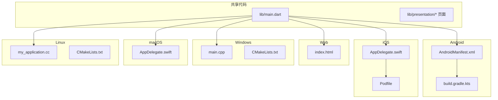
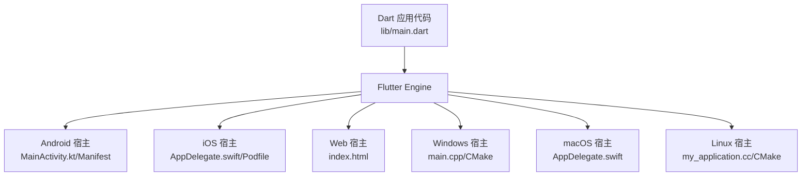
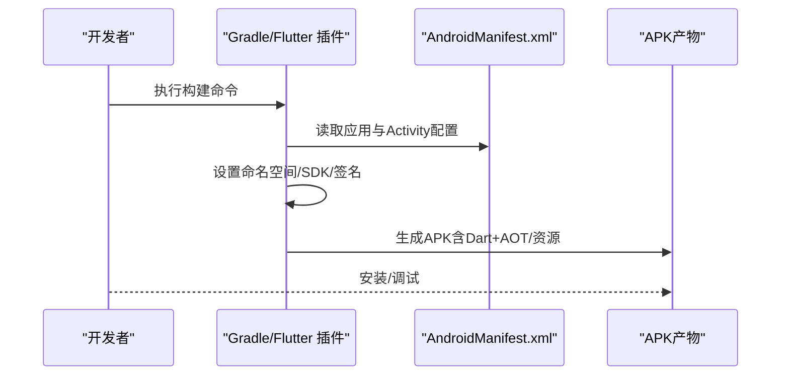
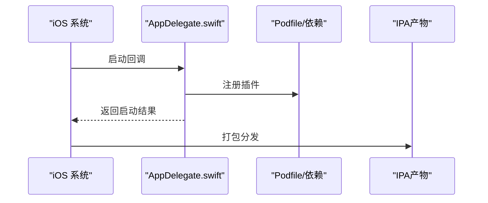
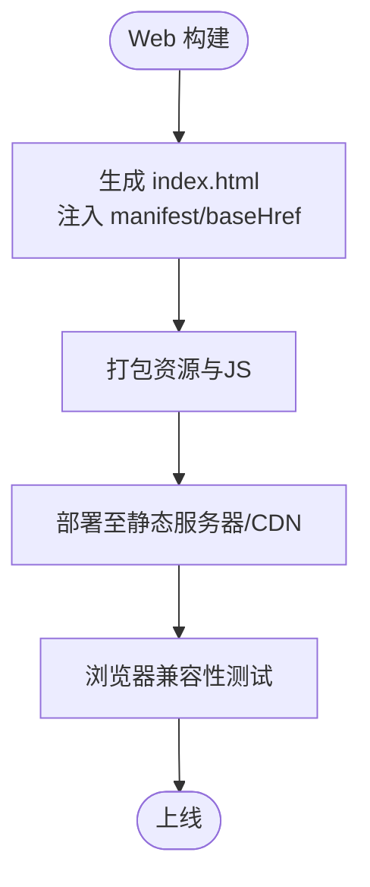
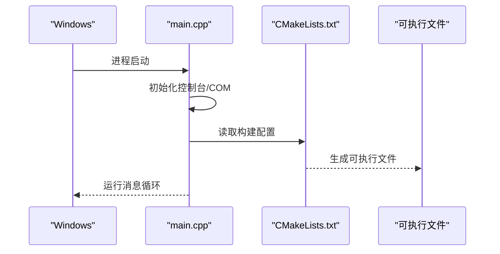
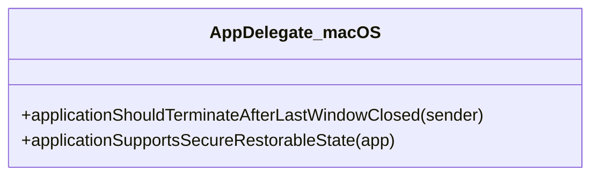
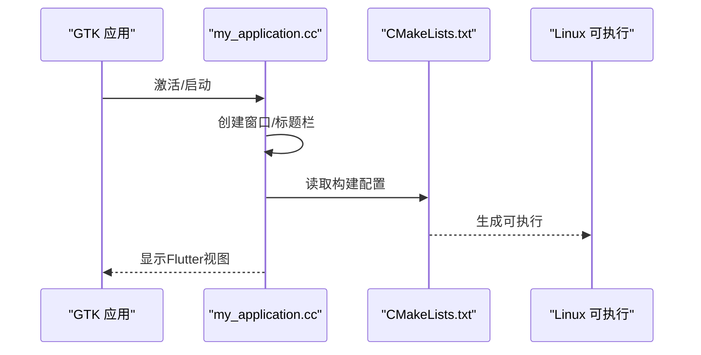
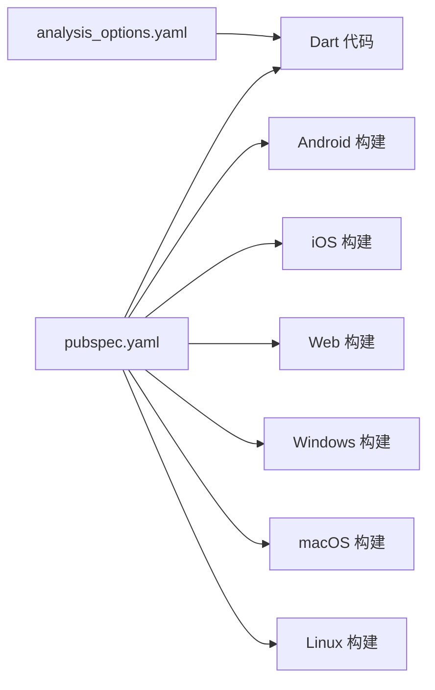

# 多平台支持

<cite>
**本文引用的文件**
- [pubspec.yaml](file://pubspec.yaml)
- [main.dart](file://lib/main.dart)
- [AndroidManifest.xml](file://android/app/src/main/AndroidManifest.xml)
- [build.gradle.kts](file://android/app/build.gradle.kts)
- [AppDelegate.swift](file://ios/Runner/AppDelegate.swift)
- [Podfile](file://ios/Podfile)
- [my_application.cc](file://linux/runner/my_application.cc)
- [CMakeLists.txt（Linux）](file://linux/CMakeLists.txt)
- [AppDelegate.swift（macOS）](file://macos/Runner/AppDelegate.swift)
- [main.cpp（Windows）](file://windows/runner/main.cpp)
- [CMakeLists.txt（Windows）](file://windows/CMakeLists.txt)
- [index.html](file://web/index.html)
- [analysis_options.yaml](file://analysis_options.yaml)
</cite>

## 目录
1. [引言](#引言)
2. [项目结构](#项目结构)
3. [核心组件](#核心组件)
4. [架构总览](#架构总览)
5. [详细组件分析](#详细组件分析)
6. [依赖关系分析](#依赖关系分析)
7. [性能考虑](#性能考虑)
8. [故障排查指南](#故障排查指南)
9. [结论](#结论)
10. [附录](#附录)

## 引言
本文件面向Mimo项目的多平台支持，系统化阐述Flutter跨平台开发在Android、iOS、Web、Windows、macOS与Linux平台的实现策略与配置要点。文档从统一代码库出发，结合各平台的原生集成方式、构建配置、权限与安全策略、发布与部署流程，以及性能优化与调试测试实践，帮助开发者高效维护与迭代。

## 项目结构
Mimo采用标准Flutter工程布局，包含跨平台共享的Dart代码与各平台原生层目录：
- 共享代码：lib/ 下的应用入口与页面路由等
- 平台原生：android/、ios/、web/、windows/、macos/、linux/
- 构建与依赖：pubspec.yaml、analysis_options.yaml

图表来源
- [main.dart:1-34](file://lib/main.dart#L1-L34)
- [AndroidManifest.xml:1-46](file://android/app/src/main/AndroidManifest.xml#L1-L46)
- [build.gradle.kts:1-45](file://android/app/build.gradle.kts#L1-L45)
- [AppDelegate.swift（iOS）:1-14](file://ios/Runner/AppDelegate.swift#L1-L14)
- [Podfile:1-44](file://ios/Podfile#L1-L44)
- [index.html:1-39](file://web/index.html#L1-L39)
- [main.cpp（Windows）:1-44](file://windows/runner/main.cpp#L1-L44)
- [CMakeLists.txt（Windows）:1-109](file://windows/CMakeLists.txt#L1-L109)
- [AppDelegate.swift（macOS）:1-14](file://macos/Runner/AppDelegate.swift#L1-L14)
- [my_application.cc（Linux）:1-131](file://linux/runner/my_application.cc#L1-L131)
- [CMakeLists.txt（Linux）:1-129](file://linux/CMakeLists.txt#L1-L129)

章节来源
- [pubspec.yaml:1-80](file://pubspec.yaml#L1-L80)
- [main.dart:1-34](file://lib/main.dart#L1-L34)

## 核心组件
- 应用入口与主题：应用在共享层通过MaterialApp定义主题、路由与初始页面，确保跨平台UI一致性。
- 资源与插件：通过pubspec.yaml声明摄像头、Rive动画、MLKit姿态检测、音频播放、状态管理等依赖，统一在各平台编译打包。
- 平台桥接：各平台通过原生清单或配置文件注册插件、设置构建参数，并在必要时引入原生能力。

章节来源
- [main.dart:7-34](file://lib/main.dart#L7-L34)
- [pubspec.yaml:30-67](file://pubspec.yaml#L30-L67)

## 架构总览
Flutter引擎在各平台以“共享Dart代码 + 平台原生宿主”的模式运行。Android/iOS使用各自的原生宿主（Activity/Swift App）承载Flutter子系统；Web通过浏览器加载；Windows/macOS/Linux通过各自窗口框架启动Flutter视图。

图表来源
- [main.dart:1-34](file://lib/main.dart#L1-L34)
- [AndroidManifest.xml:1-46](file://android/app/src/main/AndroidManifest.xml#L1-L46)
- [build.gradle.kts:1-45](file://android/app/build.gradle.kts#L1-L45)
- [AppDelegate.swift（iOS）:1-14](file://ios/Runner/AppDelegate.swift#L1-L14)
- [Podfile:1-44](file://ios/Podfile#L1-L44)
- [index.html:1-39](file://web/index.html#L1-L39)
- [main.cpp（Windows）:1-44](file://windows/runner/main.cpp#L1-L44)
- [CMakeLists.txt（Windows）:1-109](file://windows/CMakeLists.txt#L1-L109)
- [AppDelegate.swift（macOS）:1-14](file://macos/Runner/AppDelegate.swift#L1-L14)
- [my_application.cc（Linux）:1-131](file://linux/runner/my_application.cc#L1-L131)
- [CMakeLists.txt（Linux）:1-129](file://linux/CMakeLists.txt#L1-L129)

## 详细组件分析

### Android 平台
- 应用清单与权限
  - 清单中声明主Activity、启动主题、硬件加速与配置变更处理，以及查询意图以支持文本处理。
  - 版本信息由Flutter工具根据版本号映射到Android字段。
- 构建配置
  - 使用Gradle Kotlin DSL，启用Flutter Gradle插件，设置命名空间、Java/Kotlin版本、最小/目标SDK、签名类型等。
  - 默认release签名使用debug密钥以便调试运行。
- 插件与资源
  - 通过Flutter工具链自动注册插件；共享资源在pubspec中声明，构建时打包进APK。
- 权限与安全
  - 摄像头与外部存储等敏感权限需在清单中显式声明并在运行时请求，结合业务逻辑在共享层调用相机插件。

图表来源
- [AndroidManifest.xml:1-46](file://android/app/src/main/AndroidManifest.xml#L1-L46)
- [build.gradle.kts:1-45](file://android/app/build.gradle.kts#L1-L45)

章节来源
- [AndroidManifest.xml:1-46](file://android/app/src/main/AndroidManifest.xml#L1-L46)
- [build.gradle.kts:1-45](file://android/app/build.gradle.kts#L1-L45)
- [pubspec.yaml:30-67](file://pubspec.yaml#L30-L67)

### iOS 平台
- 应用生命周期
  - AppDelegate在应用启动时注册插件并交由父类继续生命周期处理。
- 依赖管理
  - Podfile通过Flutter工具生成并安装iOS端依赖，目标Runner及测试目标继承搜索路径。
- 发布准备
  - 需要配置平台版本、签名与证书、Info.plist键值、Entitlements等；本仓库未包含具体证书与配置文件，实际发布前应补齐。

图表来源
- [AppDelegate.swift（iOS）:1-14](file://ios/Runner/AppDelegate.swift#L1-L14)
- [Podfile:1-44](file://ios/Podfile#L1-L44)

章节来源
- [AppDelegate.swift（iOS）:1-14](file://ios/Runner/AppDelegate.swift#L1-L14)
- [Podfile:1-44](file://ios/Podfile#L1-L44)
- [pubspec.yaml:30-67](file://pubspec.yaml#L30-L67)

### Web 平台
- 入口与部署
  - index.html提供基础标签、Apple移动Web元信息、图标与manifest链接，配合Flutter引导脚本。
  - 构建时可指定base href，用于非根路径部署场景。
- 浏览器兼容性
  - 通过现代浏览器特性与Flutter Web引擎适配，建议在CI中针对主流浏览器进行回归测试。

图表来源
- [index.html:1-39](file://web/index.html#L1-L39)

章节来源
- [index.html:1-39](file://web/index.html#L1-L39)
- [pubspec.yaml:76-79](file://pubspec.yaml#L76-L79)

### Windows 平台
- 启动流程
  - main.cpp初始化控制台与COM，创建Flutter项目与窗口，设置Dart入口参数后进入消息循环。
- 构建与安装
  - CMakeLists定义多配置模式、编译选项、资源与AOT库安装规则，支持就地运行与Visual Studio集成。

图表来源
- [main.cpp（Windows）:1-44](file://windows/runner/main.cpp#L1-L44)
- [CMakeLists.txt（Windows）:1-109](file://windows/CMakeLists.txt#L1-L109)

章节来源
- [main.cpp（Windows）:1-44](file://windows/runner/main.cpp#L1-L44)
- [CMakeLists.txt（Windows）:1-109](file://windows/CMakeLists.txt#L1-L109)

### macOS 平台
- 应用委托
  - AppDelegate设置关闭行为与安全恢复能力，遵循macOS窗口生命周期。
- 构建与打包
  - 与iOS类似，通过Flutter工具链生成并安装依赖，最终产出.app包。

图表来源
- [AppDelegate.swift（macOS）:1-14](file://macos/Runner/AppDelegate.swift#L1-L14)

章节来源
- [AppDelegate.swift（macOS）:1-14](file://macos/Runner/AppDelegate.swift#L1-L14)
- [pubspec.yaml:30-67](file://pubspec.yaml#L30-L67)

### Linux 平台
- 应用启动
  - my_application.cc基于GTK创建窗口、标题栏与Flutter视图，按桌面环境选择界面风格，注册插件并抓取焦点。
- 构建与打包
  - CMakeLists定义标准编译选项、安装规则与资源复制，支持多配置构建。

图表来源
- [my_application.cc（Linux）:1-131](file://linux/runner/my_application.cc#L1-L131)
- [CMakeLists.txt（Linux）:1-129](file://linux/CMakeLists.txt#L1-L129)

章节来源
- [my_application.cc（Linux）:1-131](file://linux/runner/my_application.cc#L1-L131)
- [CMakeLists.txt（Linux）:1-129](file://linux/CMakeLists.txt#L1-L129)

## 依赖关系分析
- 统一依赖声明：pubspec.yaml集中声明Flutter SDK、UI、状态管理、摄像头、Rive、MLKit、本地存储、音频、工具库等，保证跨平台一致性。
- 构建与分析：analysis_options.yaml启用推荐lint规则，提升代码质量与一致性。

图表来源
- [pubspec.yaml:30-67](file://pubspec.yaml#L30-L67)
- [analysis_options.yaml:1-29](file://analysis_options.yaml#L1-L29)

章节来源
- [pubspec.yaml:1-80](file://pubspec.yaml#L1-L80)
- [analysis_options.yaml:1-29](file://analysis_options.yaml#L1-L29)

## 性能考虑
- 构建优化
  - Android：启用Java/Kotlin 11，合理设置minSdk/targetSdk，避免过度的配置变更监听。
  - iOS：使用框架形式集成，减少ObjC混编开销；按需开启Bitcode与符号剥离。
  - Web：启用压缩与缓存策略，合理拆分资源与懒加载。
  - Windows/macOS/Linux：使用CMake优化编译选项与链接器标志，Release/Profile下启用-O3与链接时优化。
- 运行时优化
  - 减少主线程阻塞，使用Riverpod进行细粒度状态订阅。
  - 对Rive动画与摄像头帧流进行节流与缓存策略。
  - 音频播放使用异步解码与预加载队列。
- 资源与网络
  - 在pubspec中集中管理资源，避免重复加载；对远程资源使用ETag/缓存头。

## 故障排查指南
- Android
  - 启动白屏/黑屏：检查启动主题与硬件加速配置，确认Activity导出与Intent过滤器。
  - 权限问题：确认清单中声明权限并在运行时请求；相机插件需同时处理权限与设备能力。
  - 构建失败：核对命名空间、SDK版本与签名配置；确保Flutter Gradle插件版本匹配。
- iOS
  - 启动崩溃：检查插件注册顺序与Info.plist键值；确保Pods正确安装且版本匹配。
  - 证书/签名：确认开发者账号、Provisioning Profile与签名团队配置。
- Web
  - 路径问题：构建时设置正确的base href；服务端需支持历史路由回退。
  - 兼容性：针对旧版浏览器进行polyfill与降级处理。
- Windows/macOS/Linux
  - 窗口/焦点：确认窗口尺寸与焦点设置；Linux需适配不同桌面环境。
  - 资源缺失：检查CMake安装阶段是否复制flutter_assets与AOT库。
- 通用
  - 日志与调试：Android使用logcat，iOS使用Console，Web使用浏览器开发者工具，桌面平台使用日志输出与断点。
  - 代码规范：遵循analysis_options.yaml中的lint规则，保持一致的编码风格。

章节来源
- [AndroidManifest.xml:1-46](file://android/app/src/main/AndroidManifest.xml#L1-L46)
- [build.gradle.kts:1-45](file://android/app/build.gradle.kts#L1-L45)
- [AppDelegate.swift（iOS）:1-14](file://ios/Runner/AppDelegate.swift#L1-L14)
- [Podfile:1-44](file://ios/Podfile#L1-L44)
- [index.html:1-39](file://web/index.html#L1-L39)
- [main.cpp（Windows）:1-44](file://windows/runner/main.cpp#L1-L44)
- [CMakeLists.txt（Windows）:1-109](file://windows/CMakeLists.txt#L1-L109)
- [AppDelegate.swift（macOS）:1-14](file://macos/Runner/AppDelegate.swift#L1-L14)
- [my_application.cc（Linux）:1-131](file://linux/runner/my_application.cc#L1-L131)
- [CMakeLists.txt（Linux）:1-129](file://linux/CMakeLists.txt#L1-L129)
- [analysis_options.yaml:1-29](file://analysis_options.yaml#L1-L29)

## 结论
Mimo通过Flutter实现了统一的Dart代码库与多平台原生宿主的协同。Android/iOS/Web/Windows/macOS/Linux均具备清晰的构建与集成路径：Android侧重清单与Gradle配置，iOS强调Pod与签名，Web关注部署与兼容，Windows/macOS/Linux聚焦窗口与CMake。结合pubspec与analysis_options，项目在功能与质量上形成闭环。后续可在各平台补充权限清单、证书与发布配置，完善自动化测试与性能监控体系。

## 附录
- 版本与构建
  - 版本号与构建号映射：Android使用versionName/versionCode，iOS使用CFBundleShortVersionString/CFBundleVersion，Windows使用产品与文件版本的主次补丁与构建后缀。
- 资源与资产
  - 共享资源在pubspec中声明，构建时打包；Web端通过manifest与图标配置提升PWA体验。
- 最佳实践
  - 统一状态管理与路由；按平台拆分平台特定逻辑；持续集成中为各平台添加构建与测试步骤；定期更新依赖与工具链。

章节来源
- [pubspec.yaml:10-19](file://pubspec.yaml#L10-L19)
- [pubspec.yaml:76-79](file://pubspec.yaml#L76-L79)