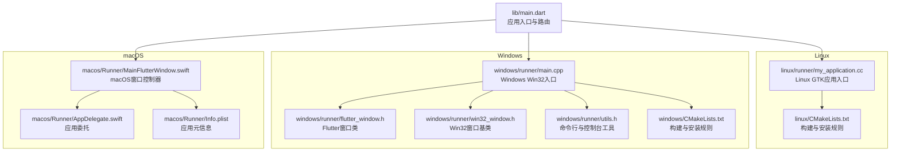
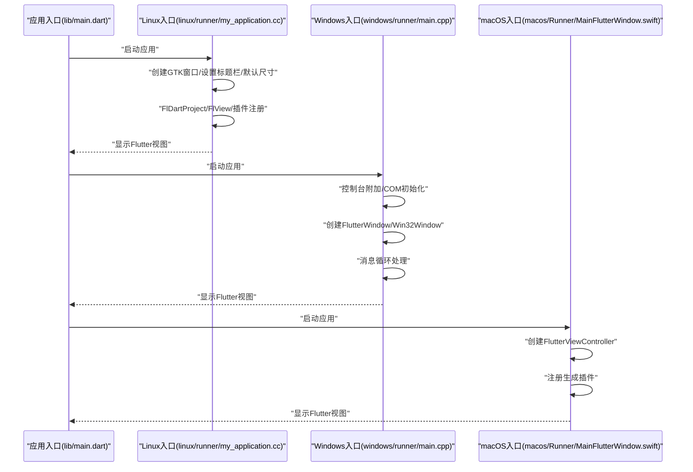
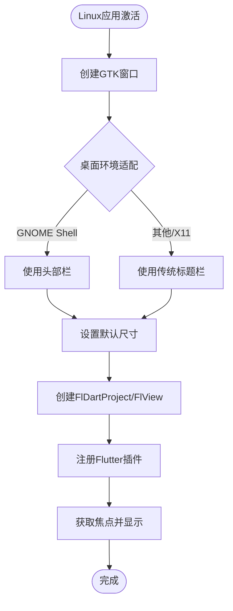
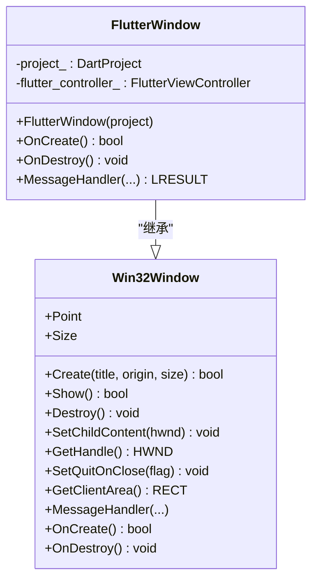
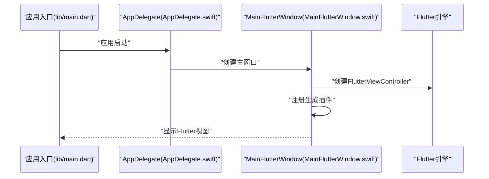
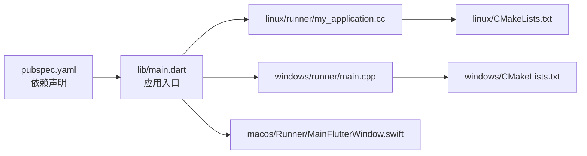

# 桌面平台

<cite>
**本文引用的文件**
- [pubspec.yaml](file://pubspec.yaml)
- [linux/CMakeLists.txt](file://linux/CMakeLists.txt)
- [windows/CMakeLists.txt](file://windows/CMakeLists.txt)
- [macos/Runner/Info.plist](file://macos/Runner/Info.plist)
- [linux/runner/my_application.h](file://linux/runner/my_application.h)
- [linux/runner/my_application.cc](file://linux/runner/my_application.cc)
- [windows/runner/main.cpp](file://windows/runner/main.cpp)
- [windows/runner/flutter_window.h](file://windows/runner/flutter_window.h)
- [windows/runner/win32_window.h](file://windows/runner/win32_window.h)
- [windows/runner/utils.h](file://windows/runner/utils.h)
- [macos/Runner/MainFlutterWindow.swift](file://macos/Runner/MainFlutterWindow.swift)
- [macos/Runner/AppDelegate.swift](file://macos/Runner/AppDelegate.swift)
- [lib/main.dart](file://lib/main.dart)
</cite>

## 目录
1. [引言](#引言)
2. [项目结构](#项目结构)
3. [核心组件](#核心组件)
4. [架构总览](#架构总览)
5. [详细组件分析](#详细组件分析)
6. [依赖关系分析](#依赖关系分析)
7. [性能考虑](#性能考虑)
8. [故障排除指南](#故障排除指南)
9. [结论](#结论)
10. [附录](#附录)

## 引言
本文件面向Mimo项目的桌面平台开发，系统性梳理Flutter Desktop在Linux、Windows与macOS三平台的多平台支持与原生集成方式，覆盖窗口管理、文件系统访问、系统集成、打包分发、性能优化与调试排障等主题。文档以仓库中现有实现为依据，结合代码级图示帮助读者快速理解并开展二次开发。

## 项目结构
Mimo采用Flutter多端统一代码库，桌面平台通过平台特定的入口与构建脚本接入Flutter引擎：
- Linux：基于GTK的应用入口与CMake打包规则
- Windows：基于Win32窗口与FlutterViewController的原生窗口宿主
- macOS：基于FlutterMacOS的窗口与应用委托

**图表来源**
- [lib/main.dart:1-34](file://lib/main.dart#L1-L34)
- [linux/runner/my_application.cc:1-131](file://linux/runner/my_application.cc#L1-L131)
- [windows/runner/main.cpp:1-44](file://windows/runner/main.cpp#L1-L44)
- [windows/runner/flutter_window.h:1-34](file://windows/runner/flutter_window.h#L1-L34)
- [windows/runner/win32_window.h:1-103](file://windows/runner/win32_window.h#L1-L103)
- [windows/runner/utils.h:1-20](file://windows/runner/utils.h#L1-L20)
- [macos/Runner/MainFlutterWindow.swift:1-16](file://macos/Runner/MainFlutterWindow.swift#L1-L16)
- [macos/Runner/AppDelegate.swift:1-14](file://macos/Runner/AppDelegate.swift#L1-L14)
- [linux/CMakeLists.txt:1-129](file://linux/CMakeLists.txt#L1-L129)
- [windows/CMakeLists.txt:1-109](file://windows/CMakeLists.txt#L1-L109)
- [macos/Runner/Info.plist:1-33](file://macos/Runner/Info.plist#L1-L33)

**章节来源**
- [lib/main.dart:1-34](file://lib/main.dart#L1-L34)
- [linux/CMakeLists.txt:1-129](file://linux/CMakeLists.txt#L1-L129)
- [windows/CMakeLists.txt:1-109](file://windows/CMakeLists.txt#L1-L109)
- [macos/Runner/Info.plist:1-33](file://macos/Runner/Info.plist#L1-L33)

## 核心组件
- 应用入口与路由：统一的Flutter应用入口负责初始化Riverpod状态体系与页面路由，作为跨平台UI层的根节点。
- 平台入口：
  - Linux：通过GTK应用类创建窗口、设置标题栏与默认尺寸，并注册Flutter插件。
  - Windows：Win32入口负责控制台附加、COM初始化、创建Flutter窗口并进入消息循环。
  - macOS：窗口控制器承载FlutterViewController，注册生成的插件。
- 构建与打包：各平台使用CMake定义构建目标、安装路径与资源复制规则；Windows还包含原生资源目录安装。

**章节来源**
- [lib/main.dart:7-34](file://lib/main.dart#L7-L34)
- [linux/runner/my_application.cc:18-63](file://linux/runner/my_application.cc#L18-L63)
- [windows/runner/main.cpp:8-43](file://windows/runner/main.cpp#L8-L43)
- [macos/Runner/MainFlutterWindow.swift:4-15](file://macos/Runner/MainFlutterWindow.swift#L4-L15)

## 架构总览
下图展示从应用启动到窗口呈现的关键调用链，体现各平台的原生窗口宿主与Flutter引擎交互。

**图表来源**
- [lib/main.dart:7-34](file://lib/main.dart#L7-L34)
- [linux/runner/my_application.cc:18-63](file://linux/runner/my_application.cc#L18-L63)
- [windows/runner/main.cpp:8-43](file://windows/runner/main.cpp#L8-L43)
- [macos/Runner/MainFlutterWindow.swift:4-15](file://macos/Runner/MainFlutterWindow.swift#L4-L15)

## 详细组件分析

### Linux 桌面平台
- 窗口管理与系统集成
  - 使用GTK应用类创建窗口，按桌面环境选择标题栏样式（GNOME Shell优先使用头部栏）。
  - 设置默认窗口尺寸，注册Flutter插件，将FlView嵌入容器并获取焦点。
- 文件系统与资源
  - CMake安装规则将ICU数据、Flutter库、插件库与资源复制到bundle目录，支持运行时加载。
  - 非Debug构建安装AOT库，提升启动性能。
- 打包与分发
  - 安装前清理bundle目录，确保资源一致性；通过install指令输出可重定位的bundle。
- 性能与资源管理
  - 非Debug启用编译器优化选项；RPATH设置为相对路径，便于部署。

**图表来源**
- [linux/runner/my_application.cc:18-63](file://linux/runner/my_application.cc#L18-L63)

**章节来源**
- [linux/runner/my_application.h:1-19](file://linux/runner/my_application.h#L1-L19)
- [linux/runner/my_application.cc:18-63](file://linux/runner/my_application.cc#L18-L63)
- [linux/CMakeLists.txt:78-129](file://linux/CMakeLists.txt#L78-L129)

### Windows 桌面平台
- 窗口管理与系统集成
  - 入口函数负责控制台附加与调试器检测、COM初始化；创建FlutterWindow并设置退出行为。
  - FlutterWindow继承Win32Window，后者提供高DPI感知、消息处理与内容嵌入能力。
- 文件系统与资源
  - CMake安装规则将ICU数据、Flutter库、插件库与资源复制到可执行文件同级目录。
  - 非Debug配置安装AOT库，减少启动时间。
- 打包与分发
  - 安装步骤默认加入“生成”流程，便于Visual Studio直接运行；支持就地运行模式。
- 性能与资源管理
  - 启用严格警告与异常配置，按构建类型设置编译选项；提供UTF-16到UTF-8转换与命令行参数解析工具。

**图表来源**
- [windows/runner/win32_window.h:13-103](file://windows/runner/win32_window.h#L13-L103)
- [windows/runner/flutter_window.h:12-34](file://windows/runner/flutter_window.h#L12-L34)

**章节来源**
- [windows/runner/main.cpp:8-43](file://windows/runner/main.cpp#L8-L43)
- [windows/runner/flutter_window.h:12-34](file://windows/runner/flutter_window.h#L12-L34)
- [windows/runner/win32_window.h:13-103](file://windows/runner/win32_window.h#L13-L103)
- [windows/runner/utils.h:7-17](file://windows/runner/utils.h#L7-L17)
- [windows/CMakeLists.txt:61-109](file://windows/CMakeLists.txt#L61-L109)

### macOS 桌面平台
- 窗口管理与系统集成
  - 主窗口类在awakeFromNib阶段创建FlutterViewController并设置内容控制器，随后注册生成插件。
  - 应用委托控制最后窗口关闭时的应用终止行为与安全恢复能力。
- 文件系统与资源
  - Info.plist定义应用标识、版本、最低系统版本等元信息；窗口控制器负责与Flutter引擎交互。
- 打包与分发
  - 通过Xcode工作区与方案进行构建与签名；应用包内包含资源与插件。

**图表来源**
- [lib/main.dart:7-34](file://lib/main.dart#L7-L34)
- [macos/Runner/AppDelegate.swift:5-12](file://macos/Runner/AppDelegate.swift#L5-L12)
- [macos/Runner/MainFlutterWindow.swift:4-15](file://macos/Runner/MainFlutterWindow.swift#L4-L15)

**章节来源**
- [macos/Runner/MainFlutterWindow.swift:4-15](file://macos/Runner/MainFlutterWindow.swift#L4-L15)
- [macos/Runner/AppDelegate.swift:5-12](file://macos/Runner/AppDelegate.swift#L5-L12)
- [macos/Runner/Info.plist:4-31](file://macos/Runner/Info.plist#L4-L31)

## 依赖关系分析
- 通用依赖：应用通过pubspec声明Flutter SDK、Riverpod、camera、rive、MLKit姿态识别、音效播放、数据库与工具库等。
- 平台入口：各平台入口文件直接或间接依赖Flutter引擎与平台SDK（GTK、Windows API、Cocoa）。
- 构建系统：CMake负责生成与安装，安装规则统一复制资源与库文件，保证bundle完整性。

**图表来源**
- [pubspec.yaml:30-67](file://pubspec.yaml#L30-L67)
- [lib/main.dart:1-34](file://lib/main.dart#L1-L34)
- [linux/CMakeLists.txt:49-76](file://linux/CMakeLists.txt#L49-L76)
- [windows/CMakeLists.txt:48-58](file://windows/CMakeLists.txt#L48-L58)

**章节来源**
- [pubspec.yaml:30-67](file://pubspec.yaml#L30-L67)
- [linux/CMakeLists.txt:49-76](file://linux/CMakeLists.txt#L49-L76)
- [windows/CMakeLists.txt:48-58](file://windows/CMakeLists.txt#L48-L58)

## 性能考虑
- 编译优化
  - Linux：非Debug启用编译器优化与NDEBUG宏，降低运行时开销。
  - Windows：启用严格警告与异常配置，按构建类型设置编译选项。
- 启动与运行
  - Linux：非Debug安装AOT库；设置RPATH为$ORIGIN/lib，确保库查找正确。
  - Windows：非Debug安装AOT库；入口函数中初始化COM，避免插件库初始化问题。
  - macOS：通过Info.plist设置最低系统版本，确保兼容性与性能。
- 资源与内存
  - 统一通过CMake安装规则复制资源，避免旧资源残留；窗口尺寸固定有助于GPU与渲染管线稳定。

**章节来源**
- [linux/CMakeLists.txt:42-47](file://linux/CMakeLists.txt#L42-L47)
- [linux/CMakeLists.txt:124-129](file://linux/CMakeLists.txt#L124-L129)
- [windows/CMakeLists.txt:40-46](file://windows/CMakeLists.txt#L40-L46)
- [windows/CMakeLists.txt:105-109](file://windows/CMakeLists.txt#L105-L109)
- [macos/Runner/Info.plist:23-24](file://macos/Runner/Info.plist#L23-L24)

## 故障排除指南
- 控制台与日志
  - Windows：入口函数在调试器存在时创建并附加控制台，便于输出日志与诊断。
  - 工具函数提供UTF-16到UTF-8转换与命令行参数解析，避免编码与参数传递问题。
- 窗口与消息循环
  - Windows：Win32Window封装消息处理与高DPI感知，若窗口异常需检查OnCreate返回值与消息循环。
  - Linux：若标题栏样式不符合预期，检查桌面环境判断逻辑与窗口管理器名称。
  - macOS：若应用无法保持后台运行，检查应用委托的终止策略与安全恢复能力。
- 资源与安装
  - Linux/Windows：确认CMake安装规则已复制ICU数据、Flutter库与插件库；非Debug安装AOT库。
  - macOS：确认Info.plist中的最低系统版本与应用标识正确。

**章节来源**
- [windows/runner/main.cpp:10-14](file://windows/runner/main.cpp#L10-L14)
- [windows/runner/utils.h:7-17](file://windows/runner/utils.h#L7-L17)
- [windows/runner/win32_window.h:62-85](file://windows/runner/win32_window.h#L62-L85)
- [linux/runner/my_application.cc:30-48](file://linux/runner/my_application.cc#L30-L48)
- [macos/Runner/AppDelegate.swift:6-12](file://macos/Runner/AppDelegate.swift#L6-L12)
- [linux/CMakeLists.txt:97-129](file://linux/CMakeLists.txt#L97-L129)
- [windows/CMakeLists.txt:77-109](file://windows/CMakeLists.txt#L77-L109)
- [macos/Runner/Info.plist:23-24](file://macos/Runner/Info.plist#L23-L24)

## 结论
Mimo的桌面平台通过平台特定入口与CMake构建系统实现了与Flutter引擎的深度集成。Linux侧重GTK适配与RPATH部署，Windows强调Win32窗口宿主与AOT优化，macOS聚焦窗口控制器与应用委托。遵循现有构建与安装规则，可在三平台实现一致的用户体验与稳定的性能表现。

## 附录
- 版本与构建信息
  - 应用版本号与构建号在pubspec中定义，用于各平台的版本化发布。
- 资产与依赖
  - 应用资产与依赖在pubspec中声明，确保构建时正确打包与安装。

**章节来源**
- [pubspec.yaml:19](file://pubspec.yaml#L19)
- [pubspec.yaml:76-79](file://pubspec.yaml#L76-L79)