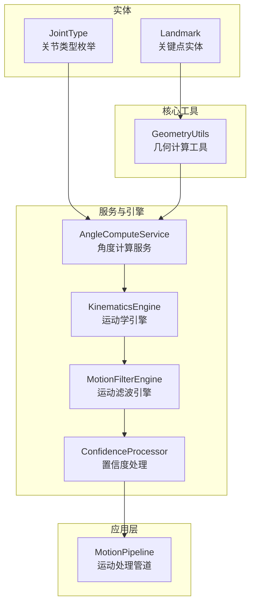
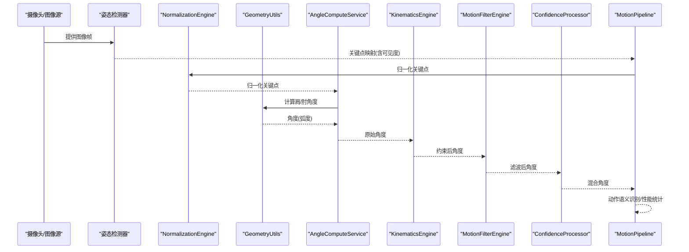
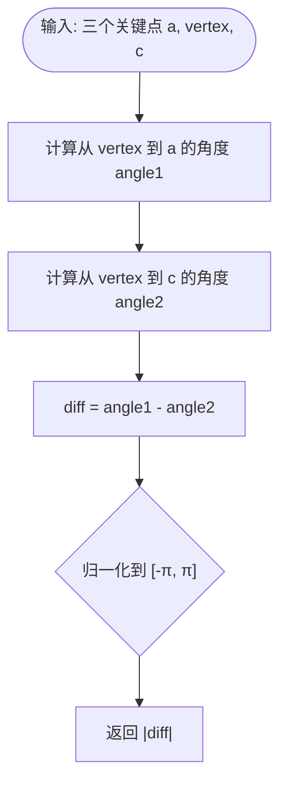
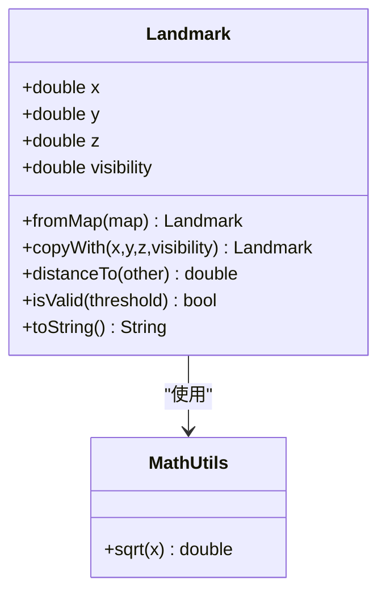
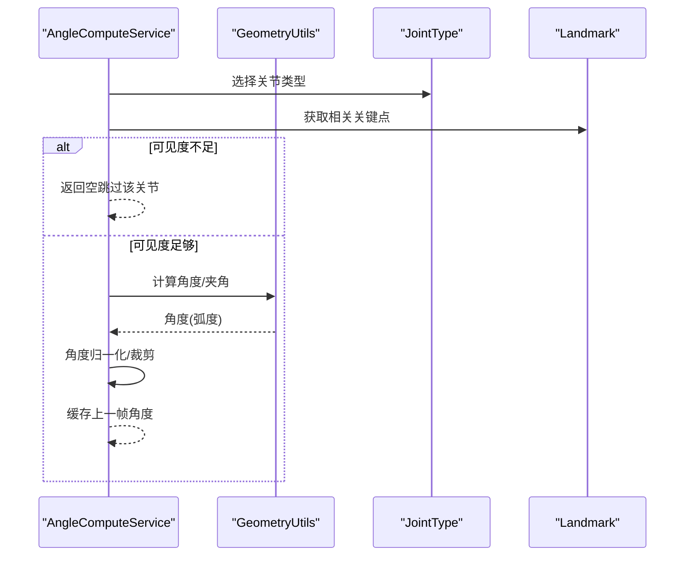
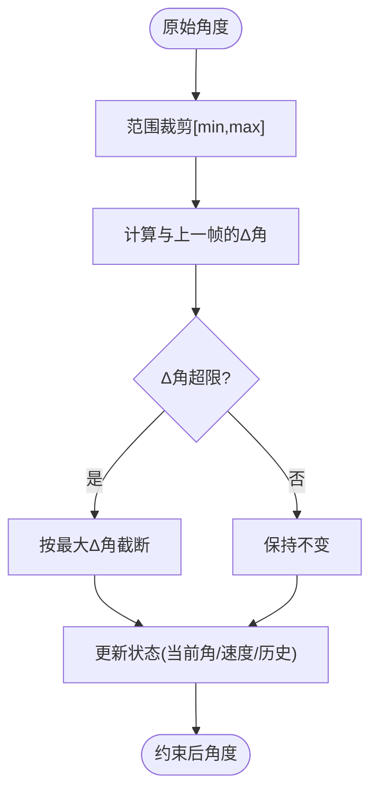
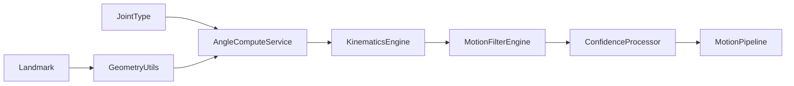

# 几何计算工具

<cite>
**本文引用的文件**
- [geometry_utils.dart](file://lib/core/utils/geometry_utils.dart)
- [landmark.dart](file://lib/domain/entities/landmark.dart)
- [joint_type.dart](file://lib/domain/entities/joint_type.dart)
- [angle_compute_service.dart](file://lib/domain/services/angle_compute_service.dart)
- [kinematics_engine.dart](file://lib/domain/engines/kinematics/kinematics_engine.dart)
- [joint_constraint.dart](file://lib/domain/engines/kinematics/joint_constraint.dart)
- [joint_state.dart](file://lib/domain/engines/kinematics/joint_state.dart)
- [motion_pipeline.dart](file://lib/application/pipeline/motion_pipeline.dart)
- [confidence_processor.dart](file://lib/domain/engines/confidence/confidence_processor.dart)
- [joint_constants.dart](file://lib/core/constants/joint_constants.dart)
- [motion_filter_engine.dart](file://lib/domain/engines/filtering/motion_filter_engine.dart)
</cite>

## 目录
1. [简介](#简介)
2. [项目结构](#项目结构)
3. [核心组件](#核心组件)
4. [架构总览](#架构总览)
5. [详细组件分析](#详细组件分析)
6. [依赖分析](#依赖分析)
7. [性能考量](#性能考量)
8. [故障排查指南](#故障排查指南)
9. [结论](#结论)
10. [附录](#附录)

## 简介
本文件面向Mimo项目的几何计算工具，系统性梳理geometry_utils.dart中的几何算法与数据模型，覆盖坐标系与向量运算、角度计算、关节角度推导、姿态识别辅助判断、以及在人体运动学中的应用路径。文档同时给出API说明、流程图、类图与性能优化建议，帮助开发者快速理解与高效使用。

## 项目结构
几何计算工具位于核心层，围绕关键点实体与关节类型枚举构建，向上被角度计算服务与运动管线调用，向下与运动学引擎、滤波引擎协同完成从姿态检测到驱动输出的全链路处理。

**图表来源**
- [geometry_utils.dart:1-117](file://lib/core/utils/geometry_utils.dart#L1-L117)
- [landmark.dart:1-87](file://lib/domain/entities/landmark.dart#L1-L87)
- [joint_type.dart:1-66](file://lib/domain/entities/joint_type.dart#L1-L66)
- [angle_compute_service.dart:1-120](file://lib/domain/services/angle_compute_service.dart#L1-L120)
- [kinematics_engine.dart:1-86](file://lib/domain/engines/kinematics/kinematics_engine.dart#L1-L86)
- [motion_filter_engine.dart:1-48](file://lib/domain/engines/filtering/motion_filter_engine.dart#L1-L48)
- [confidence_processor.dart:52-91](file://lib/domain/engines/confidence/confidence_processor.dart#L52-L91)
- [motion_pipeline.dart:53-141](file://lib/application/pipeline/motion_pipeline.dart#L53-L141)

**章节来源**
- [geometry_utils.dart:1-117](file://lib/core/utils/geometry_utils.dart#L1-L117)
- [landmark.dart:1-87](file://lib/domain/entities/landmark.dart#L1-L87)
- [joint_type.dart:1-66](file://lib/domain/entities/joint_type.dart#L1-L66)
- [angle_compute_service.dart:1-120](file://lib/domain/services/angle_compute_service.dart#L1-L120)
- [motion_pipeline.dart:53-141](file://lib/application/pipeline/motion_pipeline.dart#L53-L141)

## 核心组件
- 几何计算工具（GeometryUtils）：提供基础几何运算，包括两点间角度、三点夹角、肘关节角度、肩关节角度、距离、安全框判断等。
- 关键点实体（Landmark）：封装MediaPipe关键点的归一化坐标与可见度，提供距离与有效性判断。
- 关节类型（JointType）：定义支持的关节枚举及其对应的MediaPipe索引与Rive骨骼名。
- 角度计算服务（AngleComputeService）：基于几何工具与可见度阈值，计算肩/肘角度并进行归一化与平滑。
- 运动学引擎（KinematicsEngine）：对原始角度施加范围与单帧变化量约束，保证动作符合人体生物力学。
- 运动滤波引擎（MotionFilterEngine）：组合死区、One Euro滤波与速度平滑，降低抖动与突变。
- 置信度处理器（ConfidenceProcessor）：将跟踪角度与idle姿态按置信度混合，提升鲁棒性。
- 运动处理管道（MotionPipeline）：串联姿态检测、归一化、角度计算、约束、滤波、混合与语义识别。

**章节来源**
- [geometry_utils.dart:1-117](file://lib/core/utils/geometry_utils.dart#L1-L117)
- [landmark.dart:1-87](file://lib/domain/entities/landmark.dart#L1-L87)
- [joint_type.dart:1-66](file://lib/domain/entities/joint_type.dart#L1-L66)
- [angle_compute_service.dart:1-120](file://lib/domain/services/angle_compute_service.dart#L1-L120)
- [kinematics_engine.dart:1-86](file://lib/domain/engines/kinematics/kinematics_engine.dart#L1-L86)
- [motion_filter_engine.dart:1-48](file://lib/domain/engines/filtering/motion_filter_engine.dart#L1-L48)
- [confidence_processor.dart:52-91](file://lib/domain/engines/confidence/confidence_processor.dart#L52-L91)
- [motion_pipeline.dart:53-141](file://lib/application/pipeline/motion_pipeline.dart#L53-L141)

## 架构总览
下图展示从关键点到关节角度再到驱动输出的关键路径，强调几何工具在角度计算阶段的核心作用。

**图表来源**
- [motion_pipeline.dart:53-141](file://lib/application/pipeline/motion_pipeline.dart#L53-L141)
- [geometry_utils.dart:1-117](file://lib/core/utils/geometry_utils.dart#L1-L117)
- [angle_compute_service.dart:1-120](file://lib/domain/services/angle_compute_service.dart#L1-L120)
- [kinematics_engine.dart:1-86](file://lib/domain/engines/kinematics/kinematics_engine.dart#L1-L86)
- [motion_filter_engine.dart:1-48](file://lib/domain/engines/filtering/motion_filter_engine.dart#L1-L48)
- [confidence_processor.dart:52-91](file://lib/domain/engines/confidence/confidence_processor.dart#L52-L91)

## 详细组件分析

### 几何计算工具（GeometryUtils）
- 坐标系与向量运算
  - 使用归一化屏幕坐标（x∈[0,1], y∈[0,1]），以左上为原点的笛卡尔坐标系。
  - 向量由两点差(dx, dy)定义；角度通过二元反正切函数计算，确保象限正确性。
- 角度计算
  - 两点角度：从起点指向终点的弧度角，返回值域(-π, π]。
  - 三点夹角：以顶点为基准，计算两条射线夹角，归一化至[0, π]。
  - 肩关节角度：相对躯干方向（肩到髋）与手臂方向（肩到肘）之差，返回值域(-π, π]。
  - 肘关节角度：三点夹角的绝对值，范围[0, π]。
- 辅助功能
  - 距离：欧氏距离sqrt(dx^2 + dy^2)。
  - 安全框：判断关键点是否在给定矩形区域内。
  - T-Pose检测：基于手臂与水平方向的夹角阈值判断。

**图表来源**
- [geometry_utils.dart:21-38](file://lib/core/utils/geometry_utils.dart#L21-L38)

**章节来源**
- [geometry_utils.dart:1-117](file://lib/core/utils/geometry_utils.dart#L1-L117)

### 关键点实体（Landmark）
- 字段：x/y/z坐标与可见度visibility。
- 方法：fromMap、copyWith、distanceTo、isValid、toString等。
- 数学工具扩展：提供安全开方（非负处理）。

**图表来源**
- [landmark.dart:1-87](file://lib/domain/entities/landmark.dart#L1-L87)

**章节来源**
- [landmark.dart:1-87](file://lib/domain/entities/landmark.dart#L1-L87)

### 关节类型（JointType）
- 定义支持的关节（左/右肩、左/右肘、左/右腕、鼻子/头部），并标注MediaPipe索引与Rive骨骼名。
- 提供上肢关节、左右侧关节集合与从索引反查的工具方法。

**章节来源**
- [joint_type.dart:1-66](file://lib/domain/entities/joint_type.dart#L1-L66)

### 角度计算服务（AngleComputeService）
- 输入：关键点映射（JointType -> Landmark）。
- 流程：对每个目标关节（肩/肘）检查可见度阈值，计算角度并归一化；保存上一帧角度用于后续平滑。
- 输出：关节类型 -> 角度（弧度）映射。

**图表来源**
- [angle_compute_service.dart:15-120](file://lib/domain/services/angle_compute_service.dart#L15-L120)
- [geometry_utils.dart:1-117](file://lib/core/utils/geometry_utils.dart#L1-L117)

**章节来源**
- [angle_compute_service.dart:1-120](file://lib/domain/services/angle_compute_service.dart#L1-L120)

### 运动学引擎（KinematicsEngine）
- 功能：对原始角度施加范围约束与单帧最大变化量约束，避免不自然的大角度突变。
- 约束配置：默认肩关节[-180°, 180°]、肘关节[0°, 150°]，单帧最大变化约±25°。
- 状态管理：JointStates维护当前/上一帧角度与速度，并记录历史角度用于平滑。

**图表来源**
- [kinematics_engine.dart:31-81](file://lib/domain/engines/kinematics/kinematics_engine.dart#L31-L81)
- [joint_constraint.dart:1-47](file://lib/domain/engines/kinematics/joint_constraint.dart#L1-L47)
- [joint_state.dart:1-99](file://lib/domain/engines/kinematics/joint_state.dart#L1-L99)

**章节来源**
- [kinematics_engine.dart:1-86](file://lib/domain/engines/kinematics/kinematics_engine.dart#L1-L86)
- [joint_constraint.dart:1-47](file://lib/domain/engines/kinematics/joint_constraint.dart#L1-L47)
- [joint_state.dart:1-99](file://lib/domain/engines/kinematics/joint_state.dart#L1-L99)

### 运动滤波引擎（MotionFilterEngine）
- 策略：死区过滤（抑制微小扰动）、One Euro滤波（高频噪声抑制）、速度平滑（历史加权）。
- 输出：更平滑稳定的关节角度序列，适合驱动与动画播放。

**章节来源**
- [motion_filter_engine.dart:1-48](file://lib/domain/engines/filtering/motion_filter_engine.dart#L1-L48)

### 置信度处理（ConfidenceProcessor）
- 将跟踪角度与idle姿态按置信度线性混合，低置信度时向idle姿态靠拢，提高鲁棒性。
- 提供平均置信度计算与进入idle状态的阈值判断。

**章节来源**
- [confidence_processor.dart:52-91](file://lib/domain/engines/confidence/confidence_processor.dart#L52-L91)

### 运动处理管道（MotionPipeline）
- 全链路：姿态检测 -> 平均置信度 -> 归一化 -> 角度计算 -> 运动学约束 -> 滤波 -> 置信度混合 -> 语义识别 -> 性能统计。
- 提供统一reset接口，便于校准与运行时重置。

**章节来源**
- [motion_pipeline.dart:53-141](file://lib/application/pipeline/motion_pipeline.dart#L53-L141)

## 依赖分析
- 几何工具依赖关键点实体与关节类型，提供纯数学运算。
- 角度计算服务依赖几何工具与可见度阈值，负责角度的可解释性与稳定性。
- 运动学引擎与滤波引擎分别负责物理合理性与信号平滑。
- 置信度处理贯穿于角度混合阶段，提升系统鲁棒性。
- 管道层串联上述模块，形成端到端的运动处理流水线。

**图表来源**
- [geometry_utils.dart:1-117](file://lib/core/utils/geometry_utils.dart#L1-L117)
- [landmark.dart:1-87](file://lib/domain/entities/landmark.dart#L1-L87)
- [joint_type.dart:1-66](file://lib/domain/entities/joint_type.dart#L1-L66)
- [angle_compute_service.dart:1-120](file://lib/domain/services/angle_compute_service.dart#L1-L120)
- [kinematics_engine.dart:1-86](file://lib/domain/engines/kinematics/kinematics_engine.dart#L1-L86)
- [motion_filter_engine.dart:1-48](file://lib/domain/engines/filtering/motion_filter_engine.dart#L1-L48)
- [confidence_processor.dart:52-91](file://lib/domain/engines/confidence/confidence_processor.dart#L52-L91)
- [motion_pipeline.dart:53-141](file://lib/application/pipeline/motion_pipeline.dart#L53-L141)

## 性能考量
- 算法复杂度
  - 角度计算与距离计算均为O(1)，整体复杂度与关键点数量线性相关。
- 数值稳定性
  - 使用二元反正切函数避免除零与象限歧义；对角度进行区间归一化，减少累积误差。
  - 开方运算采用非负安全版本，避免异常。
- 内存管理
  - 角度计算与滤波均使用就地更新与有限历史窗口，控制内存占用。
  - JointStates维护固定长度的历史列表，避免无限增长。
- 优化建议
  - 批量化：在上层对多帧数据进行批处理，减少重复初始化。
  - 缓存：对常用计算（如肩/肘角度）进行缓存，避免重复计算。
  - 预分配：对Map与List进行预分配，减少扩容开销。
  - 可见度短路：在不可见关键点时直接跳过计算，减少无效工作。

**章节来源**
- [geometry_utils.dart:1-117](file://lib/core/utils/geometry_utils.dart#L1-L117)
- [landmark.dart:79-87](file://lib/domain/entities/landmark.dart#L79-L87)
- [joint_state.dart:19-40](file://lib/domain/engines/kinematics/joint_state.dart#L19-L40)
- [motion_filter_engine.dart:18-48](file://lib/domain/engines/filtering/motion_filter_engine.dart#L18-L48)

## 故障排查指南
- 角度过大或突变
  - 检查是否启用运动学约束与滤波；确认单帧最大变化量设置合理。
  - 参考：[kinematics_engine.dart:68-75](file://lib/domain/engines/kinematics/kinematics_engine.dart#L68-L75)
- 角度不稳定或抖动
  - 启用滤波器并调整死区阈值与速度平滑系数。
  - 参考：[motion_filter_engine.dart:18-21](file://lib/domain/engines/filtering/motion_filter_engine.dart#L18-L21)
- 关节角度为null
  - 检查关键点可见度是否低于阈值；确认关键点映射是否完整。
  - 参考：[angle_compute_service.dart:75-97](file://lib/domain/services/angle_compute_service.dart#L75-L97)
- 角度范围越界
  - 确认约束配置与单位换算（度/弧度）一致。
  - 参考：[joint_constraint.dart:20-32](file://lib/domain/engines/kinematics/joint_constraint.dart#L20-L32)，[joint_constants.dart:28-32](file://lib/core/constants/joint_constants.dart#L28-L32)
- T-Pose误判
  - 调整阈值（度）与角度归一化逻辑，确保水平方向阈值覆盖0与π。
  - 参考：[geometry_utils.dart:68-91](file://lib/core/utils/geometry_utils.dart#L68-L91)

**章节来源**
- [kinematics_engine.dart:68-75](file://lib/domain/engines/kinematics/kinematics_engine.dart#L68-L75)
- [motion_filter_engine.dart:18-21](file://lib/domain/engines/filtering/motion_filter_engine.dart#L18-L21)
- [angle_compute_service.dart:75-97](file://lib/domain/services/angle_compute_service.dart#L75-L97)
- [joint_constraint.dart:20-32](file://lib/domain/engines/kinematics/joint_constraint.dart#L20-L32)
- [joint_constants.dart:28-32](file://lib/core/constants/joint_constants.dart#L28-L32)
- [geometry_utils.dart:68-91](file://lib/core/utils/geometry_utils.dart#L68-L91)

## 结论
几何计算工具以简洁高效的数学运算为基础，结合可见度与运动学约束，实现了从关键点到稳定关节角度的可靠转换。通过与滤波与置信度处理的协同，系统在实时性与鲁棒性之间取得良好平衡，适用于人体运动学建模与驱动场景。

## 附录

### API参考（GeometryUtils）
- 计算两点间角度（弧度）
  - 参数：起始关键点、结束关键点
  - 返回：从起点指向终点的角度（弧度）
  - 参考：[geometry_utils.dart:9-19](file://lib/core/utils/geometry_utils.dart#L9-L19)
- 计算三点夹角（弧度）
  - 参数：第一个点、顶点、第三个点
  - 返回：在顶点处的夹角（弧度，范围[0, π]）
  - 参考：[geometry_utils.dart:21-38](file://lib/core/utils/geometry_utils.dart#L21-L38)
- 计算肘关节角度（弧度）
  - 参数：肩、肘、腕关键点
  - 返回：肘关节弯曲角度（弧度，范围[0, π]）
  - 参考：[geometry_utils.dart:40-47](file://lib/core/utils/geometry_utils.dart#L40-L47)
- 计算肩关节角度（相对躯干，弧度）
  - 参数：肩、肘、髋关键点
  - 返回：相对躯干的角度（弧度，范围(-π, π]）
  - 参考：[geometry_utils.dart:49-66](file://lib/core/utils/geometry_utils.dart#L49-L66)
- T-Pose检测
  - 参数：左右肩、左右肘关键点，阈值（度）
  - 返回：是否满足T-Pose条件
  - 参考：[geometry_utils.dart:68-91](file://lib/core/utils/geometry_utils.dart#L68-L91)
- 两点间距离
  - 参数：两个关键点
  - 返回：欧氏距离
  - 参考：[geometry_utils.dart:93-98](file://lib/core/utils/geometry_utils.dart#L93-L98)
- 安全框判断
  - 参数：关键点，左、上、右、下边界
  - 返回：是否在安全框内
  - 参考：[geometry_utils.dart:100-112](file://lib/core/utils/geometry_utils.dart#L100-L112)

### 人体运动学应用场景
- 关节角度驱动：将计算得到的肩/肘角度映射到Rive骨骼，驱动虚拟角色。
- 动作识别：结合语义引擎识别特定动作或姿态。
- 校准与反馈：利用安全框与可见度阈值进行实时校准与用户提示。
- 参考：[joint_type.dart:26-30](file://lib/domain/entities/joint_type.dart#L26-L30)，[motion_pipeline.dart:114-129](file://lib/application/pipeline/motion_pipeline.dart#L114-L129)