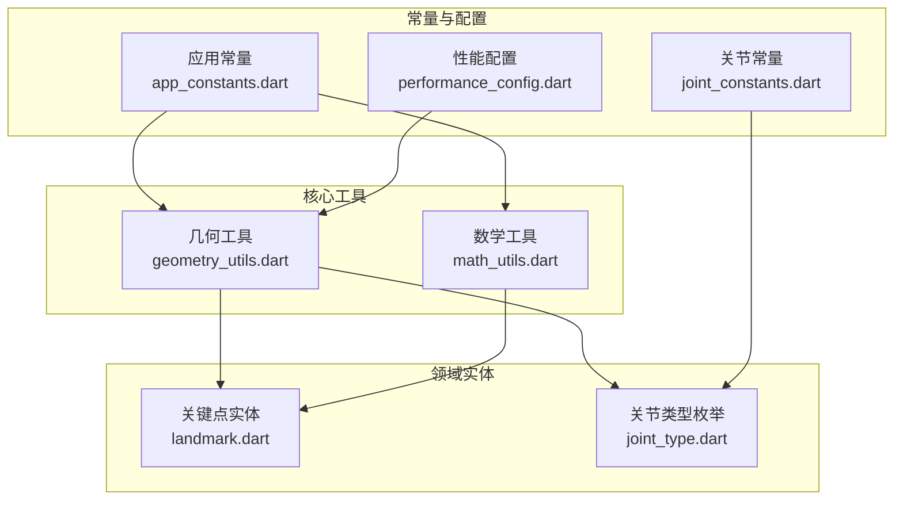
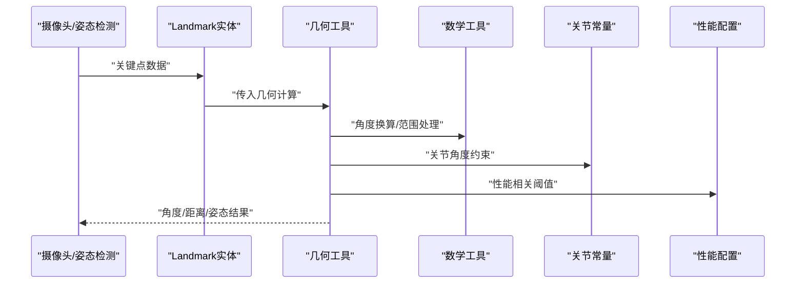
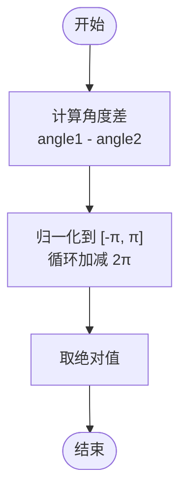
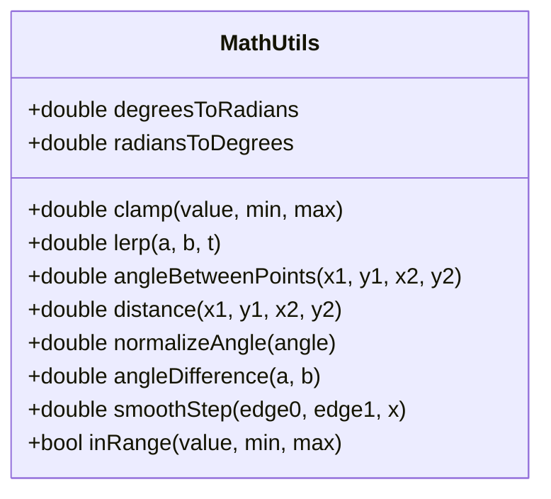
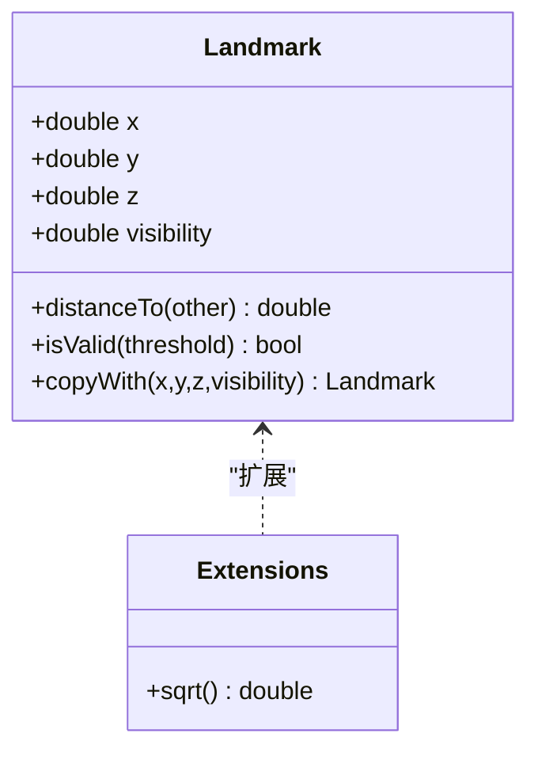
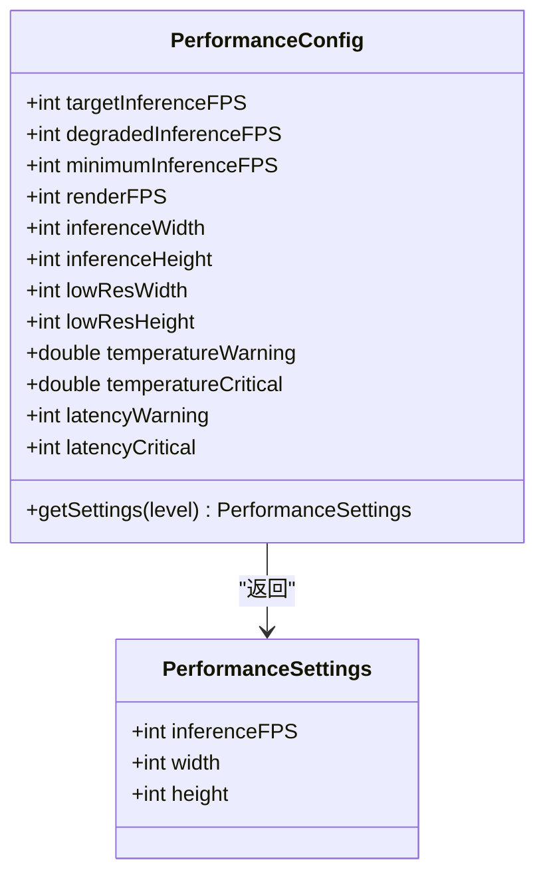
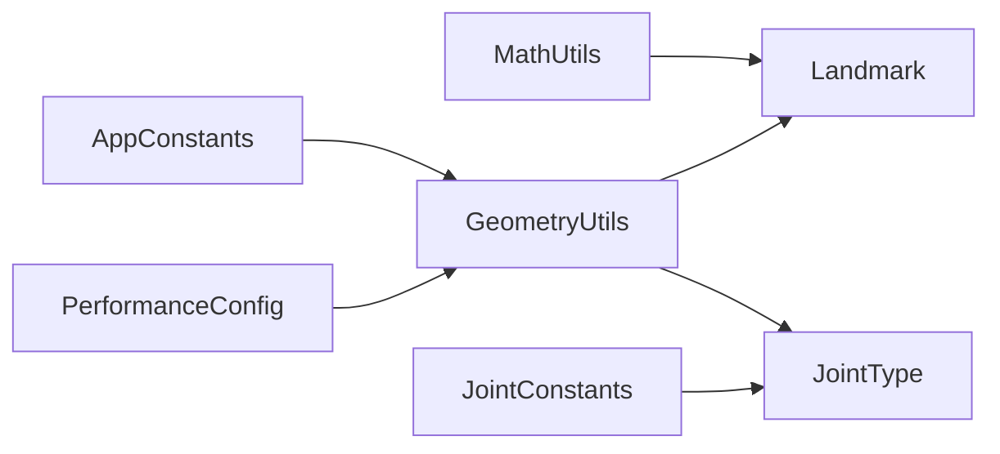

# 工具类与实用程序

<cite>
**本文引用的文件**
- [geometry_utils.dart](file://lib/core/utils/geometry_utils.dart)
- [math_utils.dart](file://lib/core/utils/math_utils.dart)
- [app_constants.dart](file://lib/core/constants/app_constants.dart)
- [joint_constants.dart](file://lib/core/constants/joint_constants.dart)
- [landmark.dart](file://lib/domain/entities/landmark.dart)
- [joint_type.dart](file://lib/domain/entities/joint_type.dart)
- [performance_config.dart](file://lib/core/config/performance_config.dart)
- [widget_test.dart](file://test/widget_test.dart)
- [pubspec.yaml](file://pubspec.yaml)
</cite>

## 目录
1. [简介](#简介)
2. [项目结构](#项目结构)
3. [核心组件](#核心组件)
4. [架构总览](#架构总览)
5. [详细组件分析](#详细组件分析)
6. [依赖分析](#依赖分析)
7. [性能考虑](#性能考虑)
8. [故障排查指南](#故障排查指南)
9. [结论](#结论)
10. [附录](#附录)

## 简介
本章节面向Mimo项目中的工具类与实用程序，系统梳理几何计算工具、数学计算辅助函数、常量与配置、实体模型以及整体架构设计。重点解释以下方面：
- 几何计算工具的数学原理与实现方法：角度计算、关节角度、肘/肩角度、安全框检查、关键点距离等。
- 数据转换工具的功能与使用场景：角度单位换算、线性插值、平滑过渡、范围判断等。
- 数学计算辅助函数的设计思路与性能考虑：归一化角度、角度差、clamp、smoothStep等。
- 实用函数库的组织结构与扩展机制：常量集中管理、性能配置、关节约束、实体模型。
- 工具类的完整API说明与使用示例：通过源码路径定位具体接口，避免直接粘贴代码。
- 测试策略与质量保证机制：单元测试与集成测试现状与建议。
- 性能优化与内存管理：算法复杂度、缓存与中间值复用、数值稳定性。
- 版本管理与兼容性：依赖版本、平台兼容、升级路径。

## 项目结构
工具类与实用程序主要分布在以下模块：
- 几何与数学工具：lib/core/utils 下的 geometry_utils.dart 与 math_utils.dart
- 常量与配置：lib/core/constants 下的 app_constants.dart 与 joint_constants.dart；lib/core/config 下的 performance_config.dart
- 实体模型：lib/domain/entities 下的 landmark.dart 与 joint_type.dart
- 测试：test/widget_test.dart
- 依赖：pubspec.yaml

图表来源
- [geometry_utils.dart:1-117](file://lib/core/utils/geometry_utils.dart#L1-L117)
- [math_utils.dart:1-66](file://lib/core/utils/math_utils.dart#L1-L66)
- [app_constants.dart:1-35](file://lib/core/constants/app_constants.dart#L1-L35)
- [joint_constants.dart:1-41](file://lib/core/constants/joint_constants.dart#L1-L41)
- [landmark.dart:1-87](file://lib/domain/entities/landmark.dart#L1-L87)
- [joint_type.dart:1-66](file://lib/domain/entities/joint_type.dart#L1-L66)
- [performance_config.dart:1-79](file://lib/core/config/performance_config.dart#L1-L79)

章节来源
- [geometry_utils.dart:1-117](file://lib/core/utils/geometry_utils.dart#L1-L117)
- [math_utils.dart:1-66](file://lib/core/utils/math_utils.dart#L1-L66)
- [app_constants.dart:1-35](file://lib/core/constants/app_constants.dart#L1-L35)
- [joint_constants.dart:1-41](file://lib/core/constants/joint_constants.dart#L1-L41)
- [landmark.dart:1-87](file://lib/domain/entities/landmark.dart#L1-L87)
- [joint_type.dart:1-66](file://lib/domain/entities/joint_type.dart#L1-L66)
- [performance_config.dart:1-79](file://lib/core/config/performance_config.dart#L1-L79)

## 核心组件
本节概述工具类与实用程序的核心能力与职责边界：
- 几何工具（GeometryUtils）：围绕关键点（Landmark）进行角度、距离、姿态判断等几何计算，支撑动作识别与动画驱动。
- 数学工具（MathUtils）：提供通用数值处理能力，如角度换算、插值、范围钳制、平滑过渡等。
- 常量与配置：集中管理应用行为参数（如FPS、校准阈值、安全框比例）、关节角度约束、性能等级与设置。
- 实体模型：Landmark与JointType定义了姿态数据结构与关节语义，是几何与数学工具的输入基础。

章节来源
- [geometry_utils.dart:5-117](file://lib/core/utils/geometry_utils.dart#L5-L117)
- [math_utils.dart:3-66](file://lib/core/utils/math_utils.dart#L3-L66)
- [app_constants.dart:2-35](file://lib/core/constants/app_constants.dart#L2-L35)
- [joint_constants.dart:4-41](file://lib/core/constants/joint_constants.dart#L4-L41)
- [landmark.dart:4-87](file://lib/domain/entities/landmark.dart#L4-L87)
- [joint_type.dart:4-66](file://lib/domain/entities/joint_type.dart#L4-L66)

## 架构总览
工具类与实用程序在Mimo中的作用链路如下：
- 输入层：来自摄像头与姿态检测（如MediaPipe）的关键点数据，封装为Landmark实体。
- 几何层：基于Landmark计算角度、距离、相对方向，识别T-Pose等基本姿态。
- 数学层：提供角度换算、插值、平滑过渡、范围钳制等通用数学能力。
- 配置层：通过AppConstants、JointConstants、PerformanceConfig统一控制行为与性能。
- 输出层：驱动动画（Rive）或用于后续动作判定与反馈。

图表来源
- [geometry_utils.dart:15-112](file://lib/core/utils/geometry_utils.dart#L15-L112)
- [math_utils.dart:14-65](file://lib/core/utils/math_utils.dart#L14-L65)
- [joint_constants.dart:8-32](file://lib/core/constants/joint_constants.dart#L8-L32)
- [performance_config.dart:37-58](file://lib/core/config/performance_config.dart#L37-L58)
- [landmark.dart:24-57](file://lib/domain/entities/landmark.dart#L24-L57)

## 详细组件分析

### 几何计算工具（GeometryUtils）
- 设计目标：以Landmark为输入，提供人体关节角度计算、相对方向判断、安全框检查与关键点距离计算。
- 数学原理：
  - 使用 atan2 计算两点间角度，避免除零与象限问题。
  - 通过角度差的周期性归一化，确保输出在 [-π, π] 区间，便于比较与驱动。
  - T-Pose 判断基于手臂与躯干的相对角度接近 0 或 π 的条件。
- 关键API与使用场景：
  - calculateAngle(start, end)：计算从起点到终点的方向角，用于肩/肘/腕等相对方向分析。
  - calculateJointAngle(a, vertex, c)：计算三点构成的关节角度，返回绝对值，适用于肘/膝等。
  - calculateElbowAngle(shoulder, elbow, wrist)：肘关节角度专用封装。
  - calculateShoulderAngle(shoulder, elbow, hip)：肩关节相对躯干的角度，考虑躯干方向。
  - isTPose(leftShoulder, leftElbow, rightShoulder, rightElbow, thresholdDegrees)：判断是否为T-Pose，阈值以度为单位。
  - distance(a, b)：两点间欧氏距离。
  - isInSafetyFrame(landmark, frameLeft, frameTop, frameRight, frameBottom)：判断关键点是否在安全区域内。
- 性能与数值稳定性：
  - 使用局部变量保存中间差值，减少重复计算。
  - 角度归一化采用循环减法，时间复杂度 O(1)，空间复杂度 O(1)。
  - _pi 与 _atan2 作为私有常量与封装，提升可维护性与一致性。

图表来源
- [geometry_utils.dart:28-38](file://lib/core/utils/geometry_utils.dart#L28-L38)

章节来源
- [geometry_utils.dart:9-112](file://lib/core/utils/geometry_utils.dart#L9-L112)

### 数学计算辅助函数（MathUtils）
- 设计目标：提供通用数值处理与转换能力，支撑几何工具与动画插值。
- 关键API与使用场景：
  - 角度换算常量：degreesToRadians、radiansToDegrees。
  - clamp(value, min, max)：将值限制在指定范围内，避免越界。
  - lerp(a, b, t)：线性插值，用于平滑过渡。
  - angleBetweenPoints(x1, y1, x2, y2)：两点间角度。
  - distance(x1, y1, x2, y2)：两点间距离。
  - normalizeAngle(angle)：将任意角度归一化到 [-π, π]。
  - angleDifference(a, b)：考虑周期性的角度差。
  - smoothStep(edge0, edge1, x)：三次多项式平滑阶跃，常用于动画缓入缓出。
  - inRange(value, min, max)：判断值是否在闭区间内。
- 设计思路与性能：
  - 所有函数均为纯函数，无副作用，便于测试与复用。
  - 归一化与角度差均采用循环调整，O(1) 时间与空间复杂度。
  - smoothStep 使用 clamp 控制 t ∈ [0,1]，保证平滑性与稳定性。

图表来源
- [math_utils.dart:4-66](file://lib/core/utils/math_utils.dart#L4-L66)

章节来源
- [math_utils.dart:7-66](file://lib/core/utils/math_utils.dart#L7-L66)

### 实体模型与常量

#### 关键点实体（Landmark）
- 字段：x/y/z（归一化坐标与深度）、visibility（置信度）。
- 方法：fromMap、copyWith、distanceTo、isValid、toString、相等性与哈希。
- 扩展：提供安全平方根与double扩展，避免负数开方导致异常。

图表来源
- [landmark.dart:4-87](file://lib/domain/entities/landmark.dart#L4-L87)

章节来源
- [landmark.dart:17-87](file://lib/domain/entities/landmark.dart#L17-L87)

#### 关节类型枚举（JointType）
- 定义：左/右肩、肘、腕、鼻子/头部，并映射到MediaPipe索引与Rive骨骼名。
- 工具：fromMediaPipeIndex、upperBodyJoints、leftSideJoints、rightSideJoints。
- 扩展：List<JointType>分组判断左右侧。

章节来源
- [joint_type.dart:4-66](file://lib/domain/entities/joint_type.dart#L4-L66)

#### 应用常量（AppConstants）
- FPS与延迟：targetFPS、minFPS、maxLatencyMs。
- 校准：calibrationTimeoutSeconds、calibrationArmAngleThreshold、calibrationHoldFrames。
- 安全框：safetyFrameWidthRatio、safetyFrameHeightRatio、safetyFrameTopMargin。
- 置信度阈值：confidenceHighThreshold、confidenceLowThreshold。
- 性能降级：temperatureWarningThreshold、temperatureCriticalThreshold、idleTimeoutSeconds、idleDeepTimeoutSeconds。

章节来源
- [app_constants.dart:11-35](file://lib/core/constants/app_constants.dart#L11-L35)

#### 关节约束常量（JointConstants）
- 角度约束：Map<JointType, AngleConstraint>，含minAngle/maxAngle。
- 单帧最大角度变化：maxDeltaPerFrame。
- 角度换算：degreesToRadians、radiansToDegrees。
- 访问器：getMinAngle、getMaxAngle。

章节来源
- [joint_constants.dart:8-32](file://lib/core/constants/joint_constants.dart#L8-L32)

#### 性能配置（PerformanceConfig）
- 目标与降级：targetInferenceFPS、degradedInferenceFPS、minimumInferenceFPS。
- 渲染：renderFPS 固定60FPS，结合插值。
- 分辨率：inferenceWidth/Height 与 lowResWidth/Height。
- 温度与延迟阈值：temperatureWarning/Critical、latencyWarning/Critical。
- 性能级别：high/medium/low，getSettings(level)返回PerformanceSettings。

图表来源
- [performance_config.dart:6-79](file://lib/core/config/performance_config.dart#L6-L79)

章节来源
- [performance_config.dart:36-79](file://lib/core/config/performance_config.dart#L36-L79)

### API参考与使用示例（按源码路径定位）
- 几何工具
  - 计算两关键点间角度：[calculateAngle:15-19](file://lib/core/utils/geometry_utils.dart#L15-L19)
  - 计算三点构成的关节角度：[calculateJointAngle:28-38](file://lib/core/utils/geometry_utils.dart#L28-L38)
  - 肘关节角度：[calculateElbowAngle:41-47](file://lib/core/utils/geometry_utils.dart#L41-L47)
  - 肩关节相对角度：[calculateShoulderAngle:50-66](file://lib/core/utils/geometry_utils.dart#L50-L66)
  - T-Pose判断：[isTPose:71-91](file://lib/core/utils/geometry_utils.dart#L71-L91)
  - 距离计算：[distance:94-98](file://lib/core/utils/geometry_utils.dart#L94-L98)
  - 安全框检查：[isInSafetyFrame:101-112](file://lib/core/utils/geometry_utils.dart#L101-L112)
- 数学工具
  - 角度换算常量：[degreesToRadians](file://lib/core/utils/math_utils.dart#L8)、[radiansToDegrees](file://lib/core/utils/math_utils.dart#L11)
  - clamp：[clamp:14-16](file://lib/core/utils/math_utils.dart#L14-L16)
  - lerp：[lerp:19-21](file://lib/core/utils/math_utils.dart#L19-L21)
  - angleBetweenPoints：[angleBetweenPoints:24-29](file://lib/core/utils/math_utils.dart#L24-L29)
  - distance：[distance:32-39](file://lib/core/utils/math_utils.dart#L32-L39)
  - normalizeAngle：[normalizeAngle:42-46](file://lib/core/utils/math_utils.dart#L42-L46)
  - angleDifference：[angleDifference:49-54](file://lib/core/utils/math_utils.dart#L49-L54)
  - smoothStep：[smoothStep:57-60](file://lib/core/utils/math_utils.dart#L57-L60)
  - inRange：[inRange:63-65](file://lib/core/utils/math_utils.dart#L63-L65)
- 实体与常量
  - Landmark构造与工厂：[Landmark:17-32](file://lib/domain/entities/landmark.dart#L17-L32)
  - Landmark复制与距离：[copyWith:35-47](file://lib/domain/entities/landmark.dart#L35-L47)、[distanceTo:50-54](file://lib/domain/entities/landmark.dart#L50-L54)
  - Landmark有效性：[isValid](file://lib/domain/entities/landmark.dart#L57)
  - 关节类型访问器：[fromMediaPipeIndex:35-42](file://lib/domain/entities/joint_type.dart#L35-L42)、[upperBodyJoints:45-50](file://lib/domain/entities/joint_type.dart#L45-L50)
  - 关节约束访问器：[getMinAngle:19-21](file://lib/core/constants/joint_constants.dart#L19-L21)、[getMaxAngle:24-26](file://lib/core/constants/joint_constants.dart#L24-L26)
  - 性能设置获取：[getSettings:37-58](file://lib/core/config/performance_config.dart#L37-L58)

## 依赖分析
- 内部依赖
  - GeometryUtils 依赖 Landmark 与 JointType，用于语义化关节计算。
  - MathUtils 为纯数学函数集合，不依赖业务实体。
  - JointConstants 提供关节角度约束，被几何工具用于合理性检查。
  - AppConstants 为全局行为常量，被几何与性能模块间接使用。
  - PerformanceConfig 提供性能等级与设置，影响推理与渲染策略。
- 外部依赖
  - pubspec.yaml 中声明了Flutter、Riverpod、Camera、Rive、ML Kit、音频播放、UUID、国际化等依赖，工具类本身未直接引入外部包，但其结果会被上层模块使用。

图表来源
- [geometry_utils.dart:1-3](file://lib/core/utils/geometry_utils.dart#L1-L3)
- [math_utils.dart](file://lib/core/utils/math_utils.dart#L1)
- [joint_constants.dart](file://lib/core/constants/joint_constants.dart#L1)
- [app_constants.dart](file://lib/core/constants/app_constants.dart#L1)
- [performance_config.dart](file://lib/core/config/performance_config.dart#L1)

章节来源
- [pubspec.yaml:30-60](file://pubspec.yaml#L30-L60)

## 性能考虑
- 算法复杂度
  - 角度计算与距离计算均为 O(1)，适合高频调用。
  - 角度归一化采用常数次循环，O(1) 时间与空间复杂度。
- 缓存与中间值复用
  - 几何工具中对中间角度差进行缓存，避免重复计算。
- 数值稳定性
  - 使用 atan2 替代 atan，避免除零与象限错误。
  - safe sqrt 扩展确保非负输入，防止异常。
- 插值与平滑
  - lerp 与 smoothStep 支持动画与状态过渡，降低抖动。
- 性能配置联动
  - PerformanceConfig 提供不同性能等级下的推理帧率与分辨率，几何与数学工具的调用频率应与之匹配，避免过度计算。

## 故障排查指南
- 常见问题
  - 角度过大或符号异常：检查是否正确归一化到 [-π, π]。
  - T-Pose误判：调整阈值（度）与置信度阈值。
  - 关节角度越界：使用 JointConstants 的 getMinAngle/getMaxAngle 进行约束。
  - 关键点无效：使用 Landmark.isValid 判断置信度。
- 调试建议
  - 在几何工具入口打印中间角度与差值，验证归一化逻辑。
  - 使用 MathUtils.inRange 与 clamp 辅助快速定位越界输入。
  - 结合 AppConstants 中的安全框与置信度阈值进行过滤。

章节来源
- [geometry_utils.dart:34-37](file://lib/core/utils/geometry_utils.dart#L34-L37)
- [joint_constants.dart:19-26](file://lib/core/constants/joint_constants.dart#L19-L26)
- [landmark.dart](file://lib/domain/entities/landmark.dart#L57)

## 结论
本文件系统性梳理了Mimo项目中的工具类与实用程序，明确了几何与数学工具的职责边界、数据结构与配置常量的作用，给出了API定位与使用建议，并提供了性能与故障排查指导。通过集中化的常量与配置、清晰的实体模型与工具函数，项目实现了从姿态数据到动画驱动的高效转换。

## 附录

### 测试策略与质量保证
- 当前测试
  - 存在基础的UI测试样例，覆盖主界面的基本交互与状态。
- 建议
  - 为工具类新增单元测试：针对角度归一化、平滑插值、范围钳制、安全框判断等函数编写断言。
  - 使用边界值测试：如角度为 0、π、2π、-π 的情况；距离为 0 与极大值的情况。
  - 集成测试：结合 Landmark 与 JointType，验证几何工具在典型姿态下的正确性。

章节来源
- [widget_test.dart:13-30](file://test/widget_test.dart#L13-L30)

### 版本管理与兼容性
- 语言与框架
  - SDK：^3.8.0；Flutter 生态版本需保持一致。
- 依赖版本
  - Riverpod、Camera、Rive、ML Kit、音频播放、UUID、国际化等依赖版本明确，升级时需关注API变更与性能差异。
- 兼容性
  - 几何与数学工具为纯函数，跨平台兼容性良好；涉及平台特定功能（如摄像头、渲染）需在上层模块处理。

章节来源
- [pubspec.yaml:21-22](file://pubspec.yaml#L21-L22)
- [pubspec.yaml:30-60](file://pubspec.yaml#L30-L60)