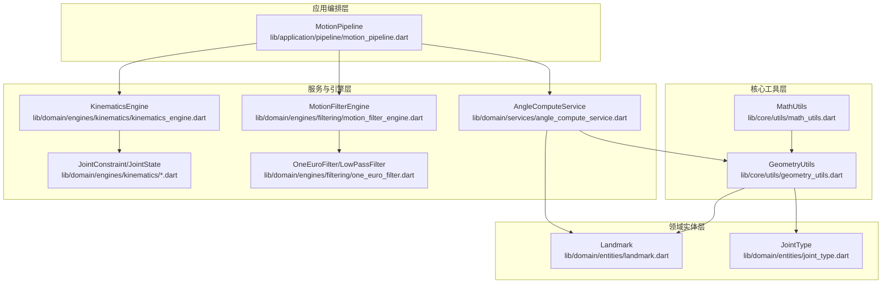
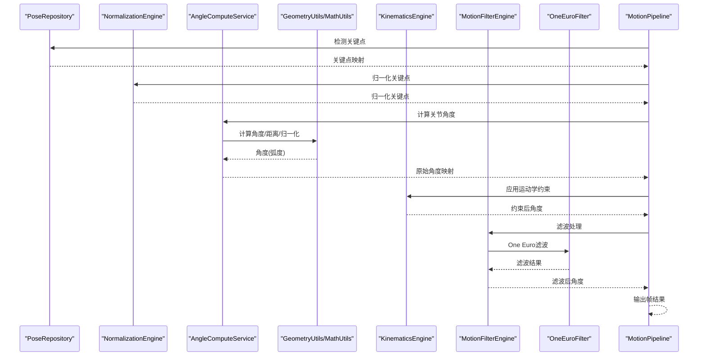
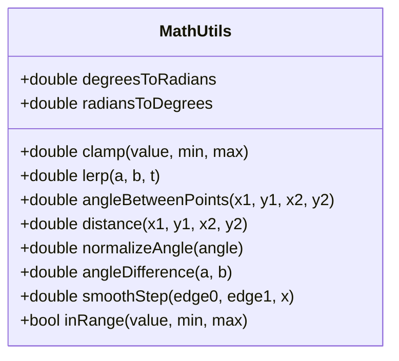
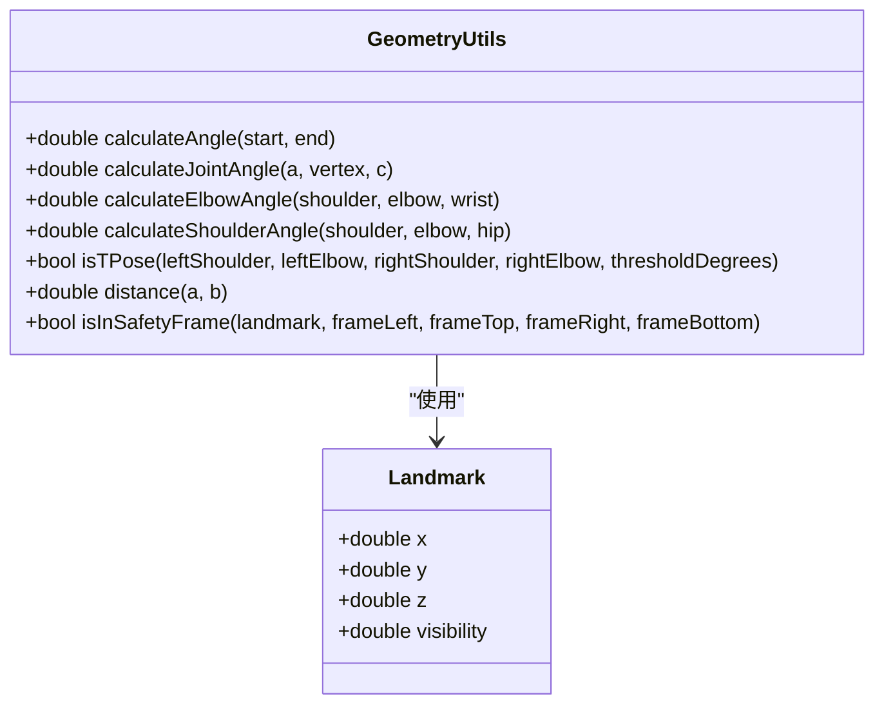
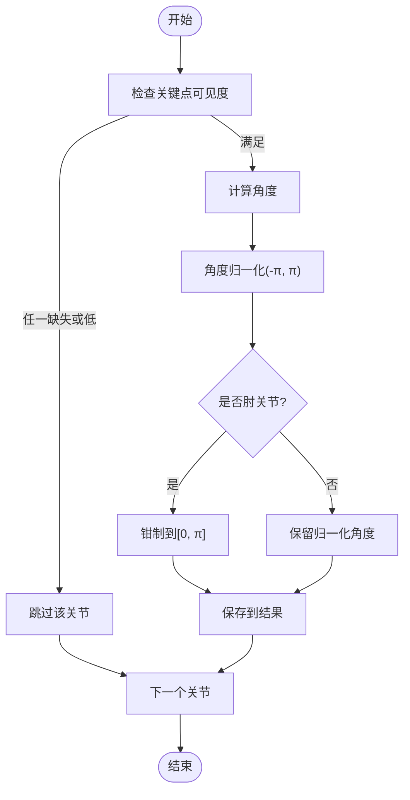
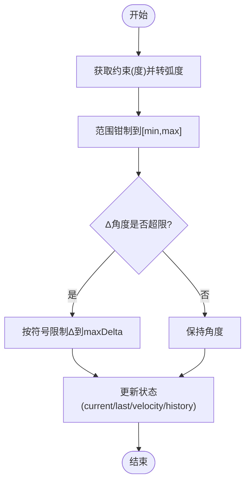
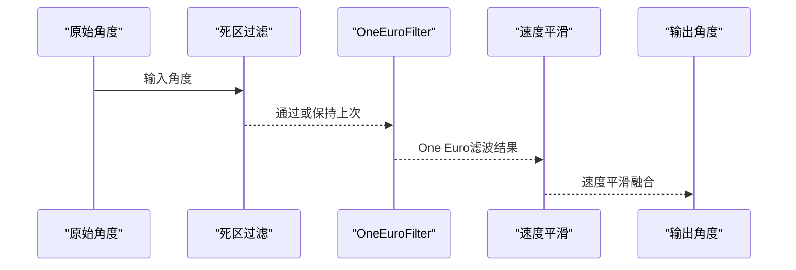
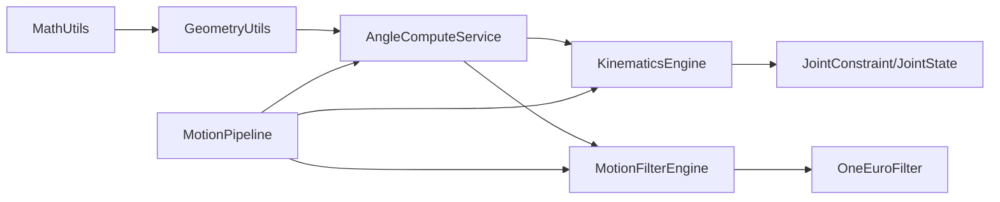

# 数学计算辅助

<cite>
**本文引用的文件**
- [lib/core/utils/math_utils.dart](file://lib/core/utils/math_utils.dart)
- [lib/core/utils/geometry_utils.dart](file://lib/core/utils/geometry_utils.dart)
- [lib/domain/entities/landmark.dart](file://lib/domain/entities/landmark.dart)
- [lib/domain/entities/joint_type.dart](file://lib/domain/entities/joint_type.dart)
- [lib/domain/services/angle_compute_service.dart](file://lib/domain/services/angle_compute_service.dart)
- [lib/domain/engines/kinematics/kinematics_engine.dart](file://lib/domain/engines/kinematics/kinematics_engine.dart)
- [lib/domain/engines/kinematics/joint_constraint.dart](file://lib/domain/engines/kinematics/joint_constraint.dart)
- [lib/domain/engines/kinematics/joint_state.dart](file://lib/domain/engines/kinematics/joint_state.dart)
- [lib/domain/engines/filtering/motion_filter_engine.dart](file://lib/domain/engines/filtering/motion_filter_engine.dart)
- [lib/domain/engines/filtering/one_euro_filter.dart](file://lib/domain/engines/filtering/one_euro_filter.dart)
- [lib/application/pipeline/motion_pipeline.dart](file://lib/application/pipeline/motion_pipeline.dart)
</cite>

## 目录
1. [简介](#简介)
2. [项目结构](#项目结构)
3. [核心组件](#核心组件)
4. [架构总览](#架构总览)
5. [详细组件分析](#详细组件分析)
6. [依赖关系分析](#依赖关系分析)
7. [性能考量](#性能考量)
8. [故障排查指南](#故障排查指南)
9. [结论](#结论)
10. [附录](#附录)

## 简介
本文件面向Mimo项目中的数学计算辅助工具，系统梳理并深入解析以下内容：
- 数学工具库math_utils.dart中的数值处理、插值、角度与距离计算、平滑阶跃函数等函数的设计思路与实现原理。
- 几何工具geometry_utils.dart在姿态检测与运动学中的应用，包括关节角度计算、肘关节角度、肩关节相对角度、T-Pose判断、关键点距离与安全框检查。
- 数学函数的精度控制与误差处理机制（如角度归一化、范围钳制、边界条件处理）。
- 在姿态检测与运动学计算中的应用场景与数据流。
- 算法复杂度分析与性能优化建议。
- 完整的函数签名、参数说明、返回值文档与边界条件处理。
- 测试验证与质量保证方法。

## 项目结构
数学与几何工具主要分布在如下层次：
- 核心工具层：lib/core/utils/math_utils.dart、lib/core/utils/geometry_utils.dart
- 领域实体层：lib/domain/entities/landmark.dart、lib/domain/entities/joint_type.dart
- 服务与引擎层：lib/domain/services/angle_compute_service.dart、lib/domain/engines/kinematics/*.dart、lib/domain/engines/filtering/*.dart
- 应用编排层：lib/application/pipeline/motion_pipeline.dart

图表来源
- [lib/core/utils/math_utils.dart:1-66](file://lib/core/utils/math_utils.dart#L1-L66)
- [lib/core/utils/geometry_utils.dart:1-117](file://lib/core/utils/geometry_utils.dart#L1-L117)
- [lib/domain/entities/landmark.dart:1-87](file://lib/domain/entities/landmark.dart#L1-L87)
- [lib/domain/entities/joint_type.dart:1-66](file://lib/domain/entities/joint_type.dart#L1-L66)
- [lib/domain/services/angle_compute_service.dart:1-120](file://lib/domain/services/angle_compute_service.dart#L1-L120)
- [lib/domain/engines/kinematics/kinematics_engine.dart:1-95](file://lib/domain/engines/kinematics/kinematics_engine.dart#L1-L95)
- [lib/domain/engines/kinematics/joint_constraint.dart:1-47](file://lib/domain/engines/kinematics/joint_constraint.dart#L1-L47)
- [lib/domain/engines/kinematics/joint_state.dart:1-99](file://lib/domain/engines/kinematics/joint_state.dart#L1-L99)
- [lib/domain/engines/filtering/motion_filter_engine.dart:1-117](file://lib/domain/engines/filtering/motion_filter_engine.dart#L1-L117)
- [lib/domain/engines/filtering/one_euro_filter.dart:1-112](file://lib/domain/engines/filtering/one_euro_filter.dart#L1-L112)
- [lib/application/pipeline/motion_pipeline.dart:1-141](file://lib/application/pipeline/motion_pipeline.dart#L1-L141)

章节来源
- [lib/core/utils/math_utils.dart:1-66](file://lib/core/utils/math_utils.dart#L1-L66)
- [lib/core/utils/geometry_utils.dart:1-117](file://lib/core/utils/geometry_utils.dart#L1-L117)
- [lib/domain/entities/landmark.dart:1-87](file://lib/domain/entities/landmark.dart#L1-L87)
- [lib/domain/entities/joint_type.dart:1-66](file://lib/domain/entities/joint_type.dart#L1-L66)
- [lib/domain/services/angle_compute_service.dart:1-120](file://lib/domain/services/angle_compute_service.dart#L1-L120)
- [lib/domain/engines/kinematics/kinematics_engine.dart:1-95](file://lib/domain/engines/kinematics/kinematics_engine.dart#L1-L95)
- [lib/domain/engines/kinematics/joint_constraint.dart:1-47](file://lib/domain/engines/kinematics/joint_constraint.dart#L1-L47)
- [lib/domain/engines/kinematics/joint_state.dart:1-99](file://lib/domain/engines/kinematics/joint_state.dart#L1-L99)
- [lib/domain/engines/filtering/motion_filter_engine.dart:1-117](file://lib/domain/engines/filtering/motion_filter_engine.dart#L1-L117)
- [lib/domain/engines/filtering/one_euro_filter.dart:1-112](file://lib/domain/engines/filtering/one_euro_filter.dart#L1-L112)
- [lib/application/pipeline/motion_pipeline.dart:1-141](file://lib/application/pipeline/motion_pipeline.dart#L1-L141)

## 核心组件
本节聚焦math_utils.dart中的数学函数族，逐项给出设计动机、实现要点、复杂度与边界处理。

- 角度常量
  - 角度转弧度：将角度值转换为弧度，便于三角函数与周期性角度运算。
  - 弧度转角度：将弧度值转换为角度，便于用户交互与可视化展示。
  - 设计要点：基于数学常量π，采用静态常量避免重复计算；数值稳定且可复用。
  - 复杂度：O(1)。
  - 边界处理：无特殊边界；输入为任意实数。

- 数值钳制 clamp
  - 功能：将给定值限制在[min, max]范围内。
  - 实现要点：调用内置clamp，确保返回值落在闭区间。
  - 复杂度：O(1)。
  - 边界处理：当min > max时，返回空（由内置clamp行为决定），建议调用方确保min ≤ max。

- 线性插值 lerp
  - 功能：在[a, b]区间按权重t进行线性插值。
  - 实现要点：t ∈ [0,1]时输出[a,b]；超出范围时外推。
  - 复杂度：O(1)。
  - 边界处理：t可为负或大于1，允许外推；注意浮点误差累积。

- 两点间角度 angleBetweenPoints
  - 功能：计算两点连线与正x轴的夹角（弧度），范围[-π, π]。
  - 实现要点：使用atan2(dy, dx)，自动处理象限与零点。
  - 复杂度：O(1)。
  - 边界处理：当dx=0且dy=0时，atan2返回0；实际应用中需结合业务逻辑判断无效情况。

- 两点间距离 distance
  - 功能：计算二维欧氏距离。
  - 实现要点：先求差分dx、dy，再开平方。
  - 复杂度：O(1)。
  - 边界处理：无特殊边界；若输入为NaN或无穷，可能产生NaN或无穷。

- 角度归一化 normalizeAngle
  - 功能：将任意角度归一化至[-π, π]。
  - 实现要点：循环加减2π直到落入目标区间。
  - 复杂度：均摊O(1)，最坏O(|angle|/π)。
  - 边界处理：输入为±∞或NaN时需外部校验；对极小浮点误差有鲁棒性。

- 角度差 angleDifference
  - 功能：计算两角度之差并考虑周期性（范围[-π, π]）。
  - 实现要点：先做差，再归一化。
  - 复杂度：O(1)。
  - 边界处理：输入为NaN或无穷时需外部处理。

- 平滑阶跃 smoothStep
  - 功能：三次多项式平滑的阶跃函数，常用于过渡与抗抖。
  - 实现要点：先将x映射到[0,1]区间，再用t^2*(3-2t)平滑过渡。
  - 复杂度：O(1)。
  - 边界处理：当edge0=edge1时，t为NaN，需在外层钳制或分支处理。

- 范围判断 inRange
  - 功能：判断value是否在闭区间[min, max]内。
  - 实现要点：比较运算。
  - 复杂度：O(1)。
  - 边界处理：min > max时返回false；NaN与无穷需外部处理。

章节来源
- [lib/core/utils/math_utils.dart:7-66](file://lib/core/utils/math_utils.dart#L7-L66)

## 架构总览
下图展示了从关键点到关节角度、再到运动学约束与滤波的整体流程，以及数学工具在其中的位置。

图表来源
- [lib/application/pipeline/motion_pipeline.dart:61-130](file://lib/application/pipeline/motion_pipeline.dart#L61-L130)
- [lib/domain/services/angle_compute_service.dart:20-65](file://lib/domain/services/angle_compute_service.dart#L20-L65)
- [lib/core/utils/geometry_utils.dart:15-38](file://lib/core/utils/geometry_utils.dart#L15-L38)
- [lib/core/utils/math_utils.dart:42-54](file://lib/core/utils/math_utils.dart#L42-L54)
- [lib/domain/engines/kinematics/kinematics_engine.dart:36-53](file://lib/domain/engines/kinematics/kinematics_engine.dart#L36-L53)
- [lib/domain/engines/filtering/motion_filter_engine.dart:28-48](file://lib/domain/engines/filtering/motion_filter_engine.dart#L28-L48)
- [lib/domain/engines/filtering/one_euro_filter.dart:43-66](file://lib/domain/engines/filtering/one_euro_filter.dart#L43-L66)

## 详细组件分析

### 数学工具类 MathUtils
- 类型与职责
  - 静态工具类，提供通用数值与几何运算辅助函数。
- 关键函数与设计
  - 角度常量：degreesToRadians、radiansToDegrees，用于统一单位转换。
  - clamp：范围钳制，确保数值稳定性。
  - lerp：线性插值，支持外推。
  - angleBetweenPoints：使用atan2计算角度，覆盖四象限。
  - distance：欧氏距离，避免中间值溢出的常见技巧。
  - normalizeAngle：将角度归一化至[-π, π]，保证周期一致性。
  - angleDifference：周期性角度差，便于比较与控制。
  - smoothStep：三次多项式平滑阶跃，抑制抖动。
  - inRange：闭区间判断，便于阈值判定。
- 复杂度与性能
  - 大部分函数为O(1)，normalizeAngle在极端情况下可能O(|angle|/π)。
- 边界与异常
  - atan2在dx=0且dy=0时返回0；distance在NaN/无穷时可能产生NaN/无穷。
  - smoothStep在edge0=edge1时t为NaN，需在外层保护。
- 应用场景
  - 角度归一化与差值用于运动学控制与UI显示。
  - clamp与smoothStep用于平滑过渡与防抖。

图表来源
- [lib/core/utils/math_utils.dart:4-66](file://lib/core/utils/math_utils.dart#L4-L66)

章节来源
- [lib/core/utils/math_utils.dart:1-66](file://lib/core/utils/math_utils.dart#L1-L66)

### 几何工具类 GeometryUtils
- 类型与职责
  - 基于Landmark实体计算几何关系，服务于姿态分析与动作识别。
- 关键函数与设计
  - calculateAngle：两点间角度，内部使用atan2，返回从起点到终点的角度（弧度）。
  - calculateJointAngle：三关节夹角，通过两个向量角度差并归一化至[0, π]。
  - calculateElbowAngle：肘关节角度，直接复用三关节夹角。
  - calculateShoulderAngle：肩关节相对角度，相对于躯干（肩到髋）方向计算相对角。
  - isTPose：判断是否为T-Pose，基于手臂与水平方向的角度阈值。
  - distance：两点距离，复用MathUtils.distance。
  - isInSafetyFrame：关键点是否在安全框内。
- 复杂度与性能
  - O(1)。
- 边界与异常
  - atan2在零向量时返回0；isTPose依赖阈值度数转换为弧度。
- 应用场景
  - 角度计算用于驱动动画与动作识别。
  - 安全框与距离用于检测异常或边界提示。

图表来源
- [lib/core/utils/geometry_utils.dart:6-117](file://lib/core/utils/geometry_utils.dart#L6-L117)
- [lib/domain/entities/landmark.dart:4-22](file://lib/domain/entities/landmark.dart#L4-L22)

章节来源
- [lib/core/utils/geometry_utils.dart:1-117](file://lib/core/utils/geometry_utils.dart#L1-L117)
- [lib/domain/entities/landmark.dart:1-87](file://lib/domain/entities/landmark.dart#L1-L87)

### 角度计算服务 AngleComputeService
- 类型与职责
  - 从关键点映射计算各关节角度，负责可见度检查与角度归一化。
- 关键流程
  - 计算左右肩角度：使用几何工具计算肩到肘角度，并归一化至[-π, π]。
  - 计算左右肘角度：使用三关节夹角，钳制在[0, π]。
  - 历史缓存：保存上一帧角度，便于平滑与对比。
- 复杂度与性能
  - O(1)每关节。
- 边界与异常
  - 关键点缺失或可见度低于阈值时跳过该关节。
  - 角度归一化确保后续处理一致性。

图表来源
- [lib/domain/services/angle_compute_service.dart:67-104](file://lib/domain/services/angle_compute_service.dart#L67-L104)

章节来源
- [lib/domain/services/angle_compute_service.dart:1-120](file://lib/domain/services/angle_compute_service.dart#L1-L120)

### 运动学引擎 KinematicsEngine
- 类型与职责
  - 对原始角度施加生物力学约束，限制角度范围与单帧变化量，防止突变。
- 关键流程
  - 读取约束配置（度数范围与最大Δ角度），转换为弧度。
  - 应用范围钳制与单帧Δ限制。
  - 更新关节状态（当前角、上一帧角、角速度、历史）。
- 复杂度与性能
  - O(n)遍历所有关节。
- 边界与异常
  - 角度与Δ均转换为弧度处理，避免单位混用。
  - 状态更新失败时需重置。

图表来源
- [lib/domain/engines/kinematics/kinematics_engine.dart:55-81](file://lib/domain/engines/kinematics/kinematics_engine.dart#L55-L81)
- [lib/domain/engines/kinematics/joint_constraint.dart:20-32](file://lib/domain/engines/kinematics/joint_constraint.dart#L20-L32)
- [lib/domain/engines/kinematics/joint_state.dart:29-46](file://lib/domain/engines/kinematics/joint_state.dart#L29-L46)

章节来源
- [lib/domain/engines/kinematics/kinematics_engine.dart:1-95](file://lib/domain/engines/kinematics/kinematics_engine.dart#L1-L95)
- [lib/domain/engines/kinematics/joint_constraint.dart:1-47](file://lib/domain/engines/kinematics/joint_constraint.dart#L1-L47)
- [lib/domain/engines/kinematics/joint_state.dart:1-99](file://lib/domain/engines/kinematics/joint_state.dart#L1-L99)

### 运动滤波引擎 MotionFilterEngine 与 OneEuroFilter
- 类型与职责
  - 组合死区过滤、One Euro滤波与速度平滑，降低抖动并保持响应速度。
- 关键流程
  - 死区过滤：忽略小于阈值的变化。
  - One Euro滤波：自适应截止频率，动态调整平滑程度。
  - 速度平滑：基于最近速度历史计算平均速度并融合。
- 复杂度与性能
  - 每关节O(1)，速度历史长度固定为5，空间与时间开销可控。
- 边界与异常
  - 时间步长被限制在合理范围，避免导数过大。
  - 滤波器状态需重置以避免漂移。

图表来源
- [lib/domain/engines/filtering/motion_filter_engine.dart:50-102](file://lib/domain/engines/filtering/motion_filter_engine.dart#L50-L102)
- [lib/domain/engines/filtering/one_euro_filter.dart:43-72](file://lib/domain/engines/filtering/one_euro_filter.dart#L43-L72)

章节来源
- [lib/domain/engines/filtering/motion_filter_engine.dart:1-117](file://lib/domain/engines/filtering/motion_filter_engine.dart#L1-L117)
- [lib/domain/engines/filtering/one_euro_filter.dart:1-112](file://lib/domain/engines/filtering/one_euro_filter.dart#L1-L112)

## 依赖关系分析
- 数学工具与几何工具
  - MathUtils为GeometryUtils提供基础数值与角度归一化能力。
- 角度计算服务
  - 依赖GeometryUtils进行角度计算，并对结果进行归一化与钳制。
- 运动学与滤波
  - KinematicsEngine依赖JointConstraint与JointState进行约束与状态管理。
  - MotionFilterEngine依赖OneEuroFilter进行低延迟平滑。
- 应用编排
  - MotionPipeline串联上述组件，形成端到端的姿态处理流水线。

图表来源
- [lib/core/utils/math_utils.dart:1-66](file://lib/core/utils/math_utils.dart#L1-L66)
- [lib/core/utils/geometry_utils.dart:1-117](file://lib/core/utils/geometry_utils.dart#L1-L117)
- [lib/domain/services/angle_compute_service.dart:1-120](file://lib/domain/services/angle_compute_service.dart#L1-L120)
- [lib/domain/engines/kinematics/kinematics_engine.dart:1-95](file://lib/domain/engines/kinematics/kinematics_engine.dart#L1-L95)
- [lib/domain/engines/kinematics/joint_constraint.dart:1-47](file://lib/domain/engines/kinematics/joint_constraint.dart#L1-L47)
- [lib/domain/engines/kinematics/joint_state.dart:1-99](file://lib/domain/engines/kinematics/joint_state.dart#L1-L99)
- [lib/domain/engines/filtering/motion_filter_engine.dart:1-117](file://lib/domain/engines/filtering/motion_filter_engine.dart#L1-L117)
- [lib/domain/engines/filtering/one_euro_filter.dart:1-112](file://lib/domain/engines/filtering/one_euro_filter.dart#L1-L112)
- [lib/application/pipeline/motion_pipeline.dart:1-141](file://lib/application/pipeline/motion_pipeline.dart#L1-L141)

章节来源
- [lib/application/pipeline/motion_pipeline.dart:1-141](file://lib/application/pipeline/motion_pipeline.dart#L1-L141)

## 性能考量
- 时间复杂度
  - MathUtils与GeometryUtils函数均为O(1)。
  - AngleComputeService对每个关节O(1)，整体O(n)。
  - KinematicsEngine对每个关节O(1)，整体O(n)。
  - MotionFilterEngine对每个关节O(1)，整体O(n)。
- 空间复杂度
  - JointState维护固定长度历史（5），空间O(1)。
  - MotionFilterEngine按关节存储滤波器与历史，空间O(n)。
- 优化建议
  - 使用clamp与smoothStep减少后续处理分支。
  - 在MotionFilterEngine中维持合理的deadZoneThreshold与velocitySmoothing，平衡平滑与响应。
  - 在KinematicsEngine中合理设置maxDeltaPerFrame，避免过度限制导致僵硬。
  - 对于大量关节的场景，优先使用Map迭代而非多次查找，减少常数开销。

## 故障排查指南
- 角度异常
  - 症状：角度在[-π, π]之外或出现NaN。
  - 排查：确认输入关键点非空且可见度足够；检查atan2输入是否为零向量；必要时在AngleComputeService中加入NaN/无穷检查。
- 角度突变
  - 症状：动作出现跳跃或抖动。
  - 排查：检查KinematicsEngine的maxDeltaPerFrame是否过小；确认MotionFilterEngine的deadZoneThreshold与velocitySmoothing设置是否合理。
- T-Pose误判
  - 症状：T-Pose判定不稳定。
  - 排查：检查thresholdDegrees转换为弧度的正确性；确认isTPose中角度阈值是否覆盖0与π两种情况。
- 性能瓶颈
  - 症状：帧率下降或延迟升高。
  - 排查：检查MotionPipeline中各阶段耗时；确认OneEuroFilter初始化与重置时机；评估JointState历史长度与滤波器数量。

章节来源
- [lib/domain/services/angle_compute_service.dart:67-104](file://lib/domain/services/angle_compute_service.dart#L67-L104)
- [lib/domain/engines/kinematics/kinematics_engine.dart:55-81](file://lib/domain/engines/kinematics/kinematics_engine.dart#L55-L81)
- [lib/domain/engines/filtering/motion_filter_engine.dart:50-102](file://lib/domain/engines/filtering/motion_filter_engine.dart#L50-L102)
- [lib/core/utils/geometry_utils.dart:68-91](file://lib/core/utils/geometry_utils.dart#L68-L91)

## 结论
Mimo项目的数学与几何工具以简洁高效的O(1)函数为核心，配合AngleComputeService、KinematicsEngine与MotionFilterEngine，构建了从关键点到稳定关节角度的完整链路。MathUtils提供基础数值与角度运算，GeometryUtils完成姿态几何分析，KinematicsEngine与MotionFilterEngine分别负责生物力学约束与低延迟平滑。通过合理的边界处理与参数调优，系统在实时性与稳定性之间取得良好平衡。

## 附录

### 函数签名与参数说明（摘自源码路径）
- MathUtils
  - clamp(value, min, max) → 返回值在[min, max]内
  - lerp(a, b, t) → 线性插值
  - angleBetweenPoints(x1, y1, x2, y2) → 两点间角度（弧度）
  - distance(x1, y1, x2, y2) → 欧氏距离
  - normalizeAngle(angle) → 角度归一化至[-π, π]
  - angleDifference(a, b) → 角度差（周期性）
  - smoothStep(edge0, edge1, x) → 平滑阶跃
  - inRange(value, min, max) → 判断是否在闭区间
- GeometryUtils
  - calculateAngle(start, end) → 两关键点间角度（弧度）
  - calculateJointAngle(a, vertex, c) → 三关节夹角（弧度）
  - calculateElbowAngle(shoulder, elbow, wrist) → 肘关节角度（弧度）
  - calculateShoulderAngle(shoulder, elbow, hip) → 肩关节相对角度（弧度）
  - isTPose(leftShoulder, leftElbow, rightShoulder, rightElbow, thresholdDegrees) → 是否为T-Pose
  - distance(a, b) → 两点距离
  - isInSafetyFrame(landmark, frameLeft, frameTop, frameRight, frameBottom) → 是否在安全框内
- AngleComputeService
  - compute(joints) → 计算所有关节角度映射（弧度）
  - _computeShoulderAngle(...) → 计算肩角度（弧度）
  - _computeElbowAngle(...) → 计算肘角度（弧度）
- KinematicsEngine
  - apply(rawAngles) → 应用约束后的角度映射（弧度）
  - updateConstraint(joint, constraint) → 更新约束
  - reset() → 重置状态
- MotionFilterEngine
  - filter(angles) → 滤波后的角度映射（弧度）
  - reset() / resetJoint(joint) → 重置滤波器
- OneEuroFilter
  - filter(value, timestamp) → 滤波结果（弧度）
  - forAngle(initialValue) → 角度专用工厂
- JointConstraint / JointState
  - defaultShoulder / defaultElbow → 默认约束
  - JointStates → 状态集合管理

章节来源
- [lib/core/utils/math_utils.dart:14-65](file://lib/core/utils/math_utils.dart#L14-L65)
- [lib/core/utils/geometry_utils.dart:15-112](file://lib/core/utils/geometry_utils.dart#L15-L112)
- [lib/domain/services/angle_compute_service.dart:20-104](file://lib/domain/services/angle_compute_service.dart#L20-L104)
- [lib/domain/engines/kinematics/kinematics_engine.dart:36-95](file://lib/domain/engines/kinematics/kinematics_engine.dart#L36-L95)
- [lib/domain/engines/filtering/motion_filter_engine.dart:28-117](file://lib/domain/engines/filtering/motion_filter_engine.dart#L28-L117)
- [lib/domain/engines/filtering/one_euro_filter.dart:43-92](file://lib/domain/engines/filtering/one_euro_filter.dart#L43-L92)
- [lib/domain/engines/kinematics/joint_constraint.dart:20-47](file://lib/domain/engines/kinematics/joint_constraint.dart#L20-L47)
- [lib/domain/engines/kinematics/joint_state.dart:29-99](file://lib/domain/engines/kinematics/joint_state.dart#L29-L99)