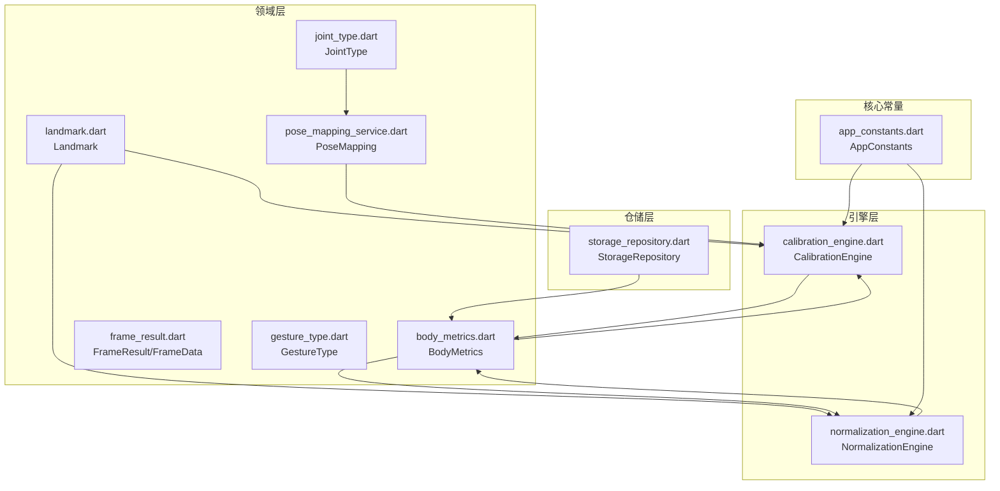
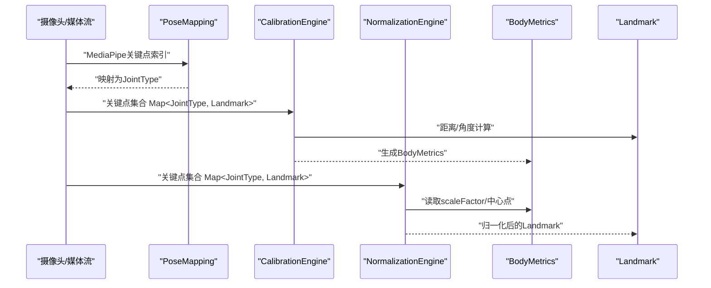
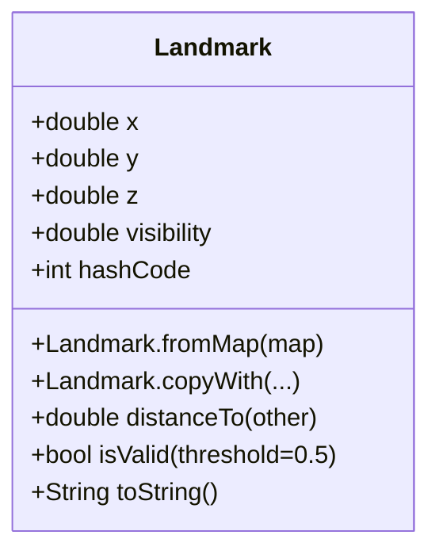
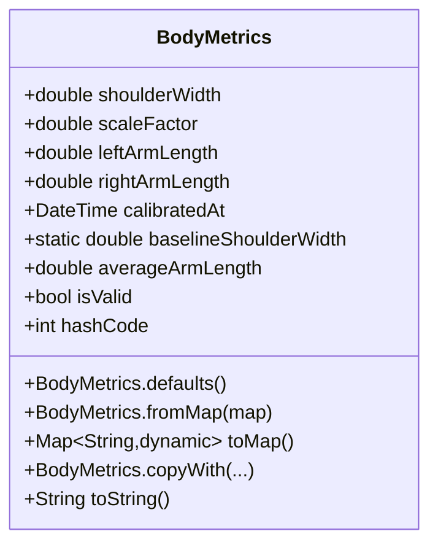
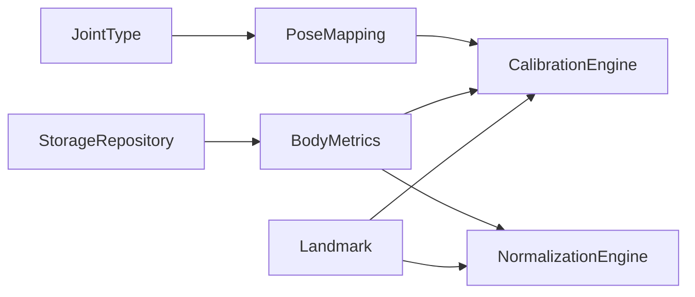
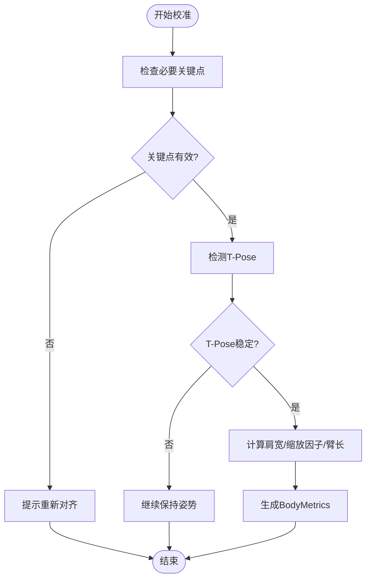
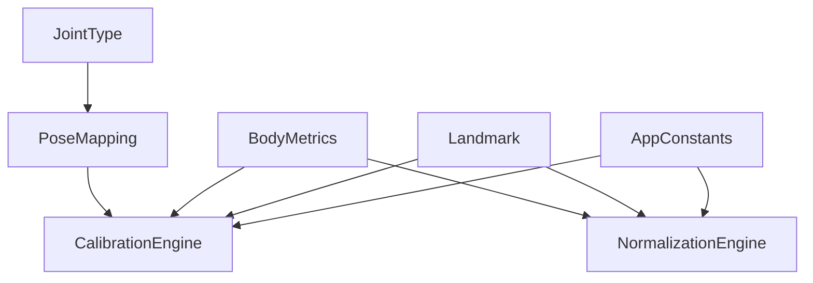

# 数据实体模型

<cite>
**本文引用的文件**
- [lib/domain/entities/landmark.dart](file://lib/domain/entities/landmark.dart)
- [lib/domain/entities/body_metrics.dart](file://lib/domain/entities/body_metrics.dart)
- [lib/domain/entities/frame_result.dart](file://lib/domain/entities/frame_result.dart)
- [lib/domain/entities/gesture_type.dart](file://lib/domain/entities/gesture_type.dart)
- [lib/domain/entities/joint_type.dart](file://lib/domain/entities/joint_type.dart)
- [lib/domain/services/pose_mapping_service.dart](file://lib/domain/services/pose_mapping_service.dart)
- [lib/domain/engines/calibration/calibration_engine.dart](file://lib/domain/engines/calibration/calibration_engine.dart)
- [lib/domain/engines/normalization/normalization_engine.dart](file://lib/domain/engines/normalization/normalization_engine.dart)
- [lib/domain/repositories/storage_repository.dart](file://lib/domain/repositories/storage_repository.dart)
- [lib/core/constants/app_constants.dart](file://lib/core/constants/app_constants.dart)
</cite>

## 目录
1. [简介](#简介)
2. [项目结构](#项目结构)
3. [核心组件](#核心组件)
4. [架构总览](#架构总览)
5. [详细组件分析](#详细组件分析)
6. [依赖分析](#依赖分析)
7. [性能考虑](#性能考虑)
8. [故障排查指南](#故障排查指南)
9. [结论](#结论)
10. [附录](#附录)

## 简介
本文件聚焦于Mimo项目中的数据实体模型，系统性解析姿态关键点实体Landmark与人体度量数据实体BodyMetrics的设计理念、数据结构、使用场景、序列化/反序列化机制、实体间关系与依赖、验证规则与数据完整性保障，以及在不同层级间的传递与转换策略。目标是帮助开发者与产品人员准确理解这些实体如何支撑姿态识别、校准与归一化流程。

## 项目结构
围绕数据实体模型，Mimo采用分层架构：
- domain/entities：定义不可变数据实体与领域模型（如Landmark、BodyMetrics、FrameResult、GestureType、JointType）。
- domain/services：提供领域服务（如姿态映射）。
- domain/engines：实现业务引擎（如校准、归一化），消费实体并产出结果。
- domain/repositories：抽象存储接口，负责实体的持久化与加载。
- core/constants：提供系统常量（如校准阈值、帧率等）。

图表来源
- [lib/domain/entities/landmark.dart:1-87](file://lib/domain/entities/landmark.dart#L1-L87)
- [lib/domain/entities/body_metrics.dart:1-109](file://lib/domain/entities/body_metrics.dart#L1-L109)
- [lib/domain/entities/frame_result.dart:1-93](file://lib/domain/entities/frame_result.dart#L1-L93)
- [lib/domain/entities/gesture_type.dart:1-60](file://lib/domain/entities/gesture_type.dart#L1-L60)
- [lib/domain/entities/joint_type.dart:1-66](file://lib/domain/entities/joint_type.dart#L1-L66)
- [lib/domain/services/pose_mapping_service.dart:1-37](file://lib/domain/services/pose_mapping_service.dart#L1-L37)
- [lib/domain/engines/calibration/calibration_engine.dart:1-302](file://lib/domain/engines/calibration/calibration_engine.dart#L1-L302)
- [lib/domain/engines/normalization/normalization_engine.dart:1-143](file://lib/domain/engines/normalization/normalization_engine.dart#L1-L143)
- [lib/domain/repositories/storage_repository.dart:1-19](file://lib/domain/repositories/storage_repository.dart#L1-L19)
- [lib/core/constants/app_constants.dart:1-35](file://lib/core/constants/app_constants.dart#L1-L35)

章节来源
- [lib/domain/entities/landmark.dart:1-87](file://lib/domain/entities/landmark.dart#L1-L87)
- [lib/domain/entities/body_metrics.dart:1-109](file://lib/domain/entities/body_metrics.dart#L1-L109)
- [lib/domain/entities/frame_result.dart:1-93](file://lib/domain/entities/frame_result.dart#L1-L93)
- [lib/domain/entities/gesture_type.dart:1-60](file://lib/domain/entities/gesture_type.dart#L1-L60)
- [lib/domain/entities/joint_type.dart:1-66](file://lib/domain/entities/joint_type.dart#L1-L66)
- [lib/domain/services/pose_mapping_service.dart:1-37](file://lib/domain/services/pose_mapping_service.dart#L1-L37)
- [lib/domain/engines/calibration/calibration_engine.dart:1-302](file://lib/domain/engines/calibration/calibration_engine.dart#L1-L302)
- [lib/domain/engines/normalization/normalization_engine.dart:1-143](file://lib/domain/engines/normalization/normalization_engine.dart#L1-L143)
- [lib/domain/repositories/storage_repository.dart:1-19](file://lib/domain/repositories/storage_repository.dart#L1-L19)
- [lib/core/constants/app_constants.dart:1-35](file://lib/core/constants/app_constants.dart#L1-L35)

## 核心组件
本节对Landmark与BodyMetrics两大实体进行深入剖析，覆盖属性定义、数据类型、业务规则、序列化/反序列化、验证与一致性保障。

- Landmark（姿态关键点）
  - 属性与类型：x、y、z（均为归一化坐标）、visibility（可见度/置信度）。
  - 设计要点：不可变构造；提供fromMap工厂构造器、copyWith复制修改、distanceTo距离计算、isValid有效性判断、toString与相等性/哈希。
  - 使用场景：作为MediaPipe输出的标准化载体，在校准与归一化阶段参与几何计算与有效性过滤。
  - 验证规则：通过visibility阈值（默认0.5）判定有效性；内部sqrt扩展避免负数开方。
  - 序列化：实体本身未内置toMap，但可通过fromMap与copyWith配合实现Map互转。

- BodyMetrics（人体度量）
  - 字段与类型：shoulderWidth、scaleFactor、leftArmLength、rightArmLength、calibratedAt。
  - 设计要点：不可变构造；defaults静态工厂提供默认值；fromMap/ toMap完成序列化；averageArmLength派生属性；isValid有效性判断；copyWith复制修改；相等性/哈希。
  - 业务规则：baselineShoulderWidth为标准肩宽基准；scaleFactor限制在合理区间；averageArmLength用于平均臂长；calibratedAt记录校准时间。
  - 验证规则：isValid要求肩宽与缩放因子均大于0；fromMap对缺失字段回退至默认值，保证鲁棒性。

章节来源
- [lib/domain/entities/landmark.dart:1-87](file://lib/domain/entities/landmark.dart#L1-L87)
- [lib/domain/entities/body_metrics.dart:1-109](file://lib/domain/entities/body_metrics.dart#L1-L109)

## 架构总览
实体在系统中的流转路径如下：媒体流关键点经映射与过滤后进入校准引擎生成BodyMetrics，随后由归一化引擎将Landmark按BodyMetrics进行尺度与中心归一化，最终驱动上肢关节角度计算与手势识别。

图表来源
- [lib/domain/services/pose_mapping_service.dart:1-37](file://lib/domain/services/pose_mapping_service.dart#L1-L37)
- [lib/domain/engines/calibration/calibration_engine.dart:1-302](file://lib/domain/engines/calibration/calibration_engine.dart#L1-L302)
- [lib/domain/engines/normalization/normalization_engine.dart:1-143](file://lib/domain/engines/normalization/normalization_engine.dart#L1-L143)
- [lib/domain/entities/body_metrics.dart:1-109](file://lib/domain/entities/body_metrics.dart#L1-L109)
- [lib/domain/entities/landmark.dart:1-87](file://lib/domain/entities/landmark.dart#L1-L87)

## 详细组件分析

### Landmark 实体分析
- 数据结构与属性
  - x/y/z：归一化坐标系中的位置与深度信息；visibility：置信度，用于有效性判定。
  - 不可变设计：构造后不可更改，便于线程安全与缓存复用。
- 方法与行为
  - fromMap：从Map安全解析，缺失字段回退为0.0，避免异常。
  - copyWith：基于参数更新，未传入的字段沿用原值，支持链式修改。
  - distanceTo：欧氏距离，用于计算肩宽、臂长等几何量。
  - isValid：默认阈值0.5，高于阈值视为有效。
  - toString/hashCode：便于日志与集合比较。
- 使用场景
  - 校准阶段：计算肩宽、臂长与角度。
  - 归一化阶段：按中心点与scaleFactor进行坐标变换。
- 序列化/反序列化
  - 未内置toMap，建议通过copyWith与外部Map组装实现序列化；fromMap用于反序列化。
- 验证与完整性
  - visibility阈值保障数据质量；sqrt扩展避免负数开方导致异常。

图表来源
- [lib/domain/entities/landmark.dart:1-87](file://lib/domain/entities/landmark.dart#L1-L87)

章节来源
- [lib/domain/entities/landmark.dart:1-87](file://lib/domain/entities/landmark.dart#L1-L87)

### BodyMetrics 实体分析
- 字段与含义
  - shoulderWidth：肩宽（归一化坐标）。
  - scaleFactor：缩放因子 = 实际肩宽 / 标准肩宽，用于消除身高差异。
  - leftArmLength/rightArmLength：左右臂长（归一化坐标）。
  - calibratedAt：校准时间戳。
- 默认值与基准
  - defaults：提供标准肩宽、默认缩放因子与平均臂长，保证无校准数据时的可用性。
  - baselineShoulderWidth：标准肩宽基准值。
- 方法与行为
  - fromMap：从Map解析，缺失字段回退至默认值；日期字符串解析失败时回退至当前时间。
  - toMap：序列化为Map，日期使用ISO格式字符串。
  - averageArmLength：左右臂长平均值，便于统一幅度控制。
  - isValid：有效性判断，要求肩宽与缩放因子均大于0。
  - copyWith：复制并修改字段，支持部分更新。
- 使用场景
  - 校准引擎：根据Landmark计算肩宽与臂长，生成BodyMetrics。
  - 归一化引擎：读取scaleFactor与中心点，对Landmark进行尺度与中心归一化。
  - 存储与加载：通过StorageRepository持久化与恢复校准数据。

图表来源
- [lib/domain/entities/body_metrics.dart:1-109](file://lib/domain/entities/body_metrics.dart#L1-L109)

章节来源
- [lib/domain/entities/body_metrics.dart:1-109](file://lib/domain/entities/body_metrics.dart#L1-L109)

### 实体关系与依赖
- Landmark 与 BodyMetrics
  - Landmark提供几何位置与置信度，BodyMetrics提供尺度与中心参考；两者共同构成归一化的输入与输出。
- Landmark 与 JointType
  - 通过PoseMapping将MediaPipe索引映射为JointType，再以JointType为键组织Map<JointType, Landmark>，便于引擎处理。
- CalibrationEngine 与 NormalizationEngine
  - CalibrationEngine接收Map<JointType, Landmark>，计算并产出BodyMetrics；NormalizationEngine接收Map<JointType, Landmark>与BodyMetrics，返回归一化后的Landmark集合。
- StorageRepository
  - 提供saveCalibration/loadCalibration接口，用于持久化BodyMetrics，实现跨会话的校准数据复用。

图表来源
- [lib/domain/engines/calibration/calibration_engine.dart:1-302](file://lib/domain/engines/calibration/calibration_engine.dart#L1-L302)
- [lib/domain/engines/normalization/normalization_engine.dart:1-143](file://lib/domain/engines/normalization/normalization_engine.dart#L1-L143)
- [lib/domain/entities/body_metrics.dart:1-109](file://lib/domain/entities/body_metrics.dart#L1-L109)
- [lib/domain/entities/landmark.dart:1-87](file://lib/domain/entities/landmark.dart#L1-L87)
- [lib/domain/entities/joint_type.dart:1-66](file://lib/domain/entities/joint_type.dart#L1-L66)
- [lib/domain/services/pose_mapping_service.dart:1-37](file://lib/domain/services/pose_mapping_service.dart#L1-L37)
- [lib/domain/repositories/storage_repository.dart:1-19](file://lib/domain/repositories/storage_repository.dart#L1-L19)

章节来源
- [lib/domain/engines/calibration/calibration_engine.dart:1-302](file://lib/domain/engines/calibration/calibration_engine.dart#L1-L302)
- [lib/domain/engines/normalization/normalization_engine.dart:1-143](file://lib/domain/engines/normalization/normalization_engine.dart#L1-L143)
- [lib/domain/entities/body_metrics.dart:1-109](file://lib/domain/entities/body_metrics.dart#L1-L109)
- [lib/domain/entities/landmark.dart:1-87](file://lib/domain/entities/landmark.dart#L1-L87)
- [lib/domain/entities/joint_type.dart:1-66](file://lib/domain/entities/joint_type.dart#L1-L66)
- [lib/domain/services/pose_mapping_service.dart:1-37](file://lib/domain/services/pose_mapping_service.dart#L1-L37)
- [lib/domain/repositories/storage_repository.dart:1-19](file://lib/domain/repositories/storage_repository.dart#L1-L19)

### 序列化与反序列化机制
- Landmark
  - 未内置toMap；建议通过copyWith与外部Map组装实现序列化；fromMap用于反序列化，缺失字段回退为0.0。
- BodyMetrics
  - fromMap：解析数字字段为double，日期字符串解析失败时回退至当前时间，保证健壮性。
  - toMap：序列化为Map，日期使用ISO字符串，便于跨平台传输与存储。
- 存储与加载
  - StorageRepository定义saveCalibration/loadCalibration接口，结合BodyMetrics的toMap/fromMap实现持久化与恢复。

章节来源
- [lib/domain/entities/landmark.dart:24-47](file://lib/domain/entities/landmark.dart#L24-L47)
- [lib/domain/entities/body_metrics.dart:42-64](file://lib/domain/entities/body_metrics.dart#L42-L64)
- [lib/domain/repositories/storage_repository.dart:1-19](file://lib/domain/repositories/storage_repository.dart#L1-L19)

### 使用场景与最佳实践
- 校准阶段
  - 使用CalibrationEngine.processFrame接收Map<JointType, Landmark>，内部调用Landmark.distanceTo与角度计算，产出BodyMetrics。
  - 建议在fromMap阶段对关键字段做边界检查与回退，避免异常传播。
- 归一化阶段
  - 使用NormalizationEngine.normalize对Landmark进行中心与尺度归一化，确保不同身高用户的动作幅度一致。
  - 建议在归一化前检查BodyMetrics.isValid，若无效则使用默认值或跳过归一化。
- 手势与角度
  - 结合FrameResult与GestureType，将归一化后的关节角度映射为具体手势，提升交互体验。
- 性能优化
  - 不可变实体减少拷贝成本；copyWith支持局部更新，降低内存分配。
  - visibility阈值过滤无效关键点，减少后续计算量。

章节来源
- [lib/domain/engines/calibration/calibration_engine.dart:114-176](file://lib/domain/engines/calibration/calibration_engine.dart#L114-L176)
- [lib/domain/engines/normalization/normalization_engine.dart:72-125](file://lib/domain/engines/normalization/normalization_engine.dart#L72-L125)
- [lib/domain/entities/frame_result.dart:1-93](file://lib/domain/entities/frame_result.dart#L1-L93)
- [lib/domain/entities/gesture_type.dart:1-60](file://lib/domain/entities/gesture_type.dart#L1-L60)

### 验证规则与数据完整性
- Landmark
  - 通过visibility > 0.5判定有效性；distanceTo计算距离时使用安全开方扩展，避免负数开方。
- BodyMetrics
  - isValid要求shoulderWidth > 0且scaleFactor > 0；fromMap对缺失字段回退默认值；toMap保证日期序列化格式一致。
- 引擎层约束
  - CalibrationEngine在processFrame中检查必要关键点与T-Pose状态，超时与失败场景返回明确错误信息。
  - NormalizationEngine在未校准情况下返回原始数据，避免错误归一化。

图表来源
- [lib/domain/engines/calibration/calibration_engine.dart:114-176](file://lib/domain/engines/calibration/calibration_engine.dart#L114-L176)
- [lib/domain/engines/calibration/calibration_engine.dart:245-286](file://lib/domain/engines/calibration/calibration_engine.dart#L245-L286)

章节来源
- [lib/domain/entities/landmark.dart:56-57](file://lib/domain/entities/landmark.dart#L56-L57)
- [lib/domain/entities/body_metrics.dart:69-70](file://lib/domain/entities/body_metrics.dart#L69-L70)
- [lib/domain/engines/calibration/calibration_engine.dart:114-176](file://lib/domain/engines/calibration/calibration_engine.dart#L114-L176)

## 依赖分析
- 组件耦合
  - CalibrationEngine与NormalizationEngine均依赖Landmark与BodyMetrics；PoseMapping为JointType与MediaPipe索引的桥梁。
- 外部依赖
  - AppConstants提供校准阈值、超时与帧率等配置，影响引擎行为。
- 循环依赖
  - 未发现循环导入；实体为纯数据结构，引擎与服务通过接口解耦。

图表来源
- [lib/core/constants/app_constants.dart:1-35](file://lib/core/constants/app_constants.dart#L1-L35)
- [lib/domain/engines/calibration/calibration_engine.dart:1-302](file://lib/domain/engines/calibration/calibration_engine.dart#L1-L302)
- [lib/domain/engines/normalization/normalization_engine.dart:1-143](file://lib/domain/engines/normalization/normalization_engine.dart#L1-L143)
- [lib/domain/entities/landmark.dart:1-87](file://lib/domain/entities/landmark.dart#L1-L87)
- [lib/domain/entities/body_metrics.dart:1-109](file://lib/domain/entities/body_metrics.dart#L1-L109)
- [lib/domain/entities/joint_type.dart:1-66](file://lib/domain/entities/joint_type.dart#L1-L66)
- [lib/domain/services/pose_mapping_service.dart:1-37](file://lib/domain/services/pose_mapping_service.dart#L1-L37)

章节来源
- [lib/core/constants/app_constants.dart:1-35](file://lib/core/constants/app_constants.dart#L1-L35)
- [lib/domain/engines/calibration/calibration_engine.dart:1-302](file://lib/domain/engines/calibration/calibration_engine.dart#L1-L302)
- [lib/domain/engines/normalization/normalization_engine.dart:1-143](file://lib/domain/engines/normalization/normalization_engine.dart#L1-L143)
- [lib/domain/entities/landmark.dart:1-87](file://lib/domain/entities/landmark.dart#L1-L87)
- [lib/domain/entities/body_metrics.dart:1-109](file://lib/domain/entities/body_metrics.dart#L1-L109)
- [lib/domain/entities/joint_type.dart:1-66](file://lib/domain/entities/joint_type.dart#L1-L66)
- [lib/domain/services/pose_mapping_service.dart:1-37](file://lib/domain/services/pose_mapping_service.dart#L1-L37)

## 性能考虑
- 不可变数据结构：减少并发修改带来的同步成本，提高缓存命中率。
- copyWith局部更新：避免深拷贝大对象，降低GC压力。
- visibility阈值过滤：在早期剔除低质量关键点，减少后续计算。
- 归一化范围限制：scaleFactor使用clamp限制在合理区间，避免极端缩放导致数值不稳定。
- 帧率与延迟：AppConstants提供目标帧率与最大延迟阈值，引擎需在此范围内平衡精度与性能。

## 故障排查指南
- 校准失败
  - 现象：持续提示“请站成T-Pose姿势”或“请确保上半身完全在画面中”。
  - 排查：确认关键点可见度高于阈值；检查必要关节是否在画面内；关注超时与失败信息。
- 归一化异常
  - 现象：动作幅度异常或抖动。
  - 排查：确认BodyMetrics.isValid；检查scaleFactor是否在合理范围；核对中心点计算逻辑。
- 序列化问题
  - 现象：从Map解析失败或日期不正确。
  - 排查：fromMap对缺失字段回退默认值；toMap使用ISO字符串；确保字段类型一致。

章节来源
- [lib/domain/engines/calibration/calibration_engine.dart:124-132](file://lib/domain/engines/calibration/calibration_engine.dart#L124-L132)
- [lib/domain/engines/calibration/calibration_engine.dart:134-140](file://lib/domain/engines/calibration/calibration_engine.dart#L134-L140)
- [lib/domain/engines/normalization/normalization_engine.dart:77-113](file://lib/domain/engines/normalization/normalization_engine.dart#L77-L113)
- [lib/domain/entities/body_metrics.dart:49-52](file://lib/domain/entities/body_metrics.dart#L49-L52)

## 结论
Landmark与BodyMetrics构成了Mimo姿态识别与归一化流程的核心数据基础。前者提供高置信度的归一化坐标与深度信息，后者提供尺度与中心参考。二者通过CalibrationEngine与NormalizationEngine协同工作，结合PoseMapping与StorageRepository，实现了从媒体流到可交互动作的可靠转换。遵循本文的最佳实践与验证规则，可在保证数据完整性的同时获得稳定的性能表现。

## 附录
- 相关枚举与映射
  - JointType：定义上肢关键点与MediaPipe索引映射。
  - GestureType：定义可识别手势及其触发条件。
  - PoseMapping：提供双向索引映射工具。
- 常量配置
  - AppConstants：校准阈值、超时、帧率与安全框等系统常量。

章节来源
- [lib/domain/entities/joint_type.dart:1-66](file://lib/domain/entities/joint_type.dart#L1-L66)
- [lib/domain/entities/gesture_type.dart:1-60](file://lib/domain/entities/gesture_type.dart#L1-L60)
- [lib/domain/services/pose_mapping_service.dart:1-37](file://lib/domain/services/pose_mapping_service.dart#L1-L37)
- [lib/core/constants/app_constants.dart:1-35](file://lib/core/constants/app_constants.dart#L1-L35)