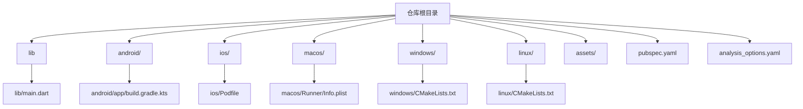
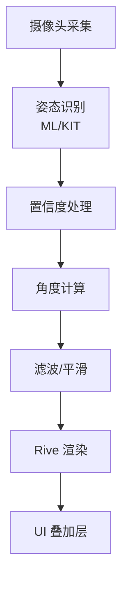
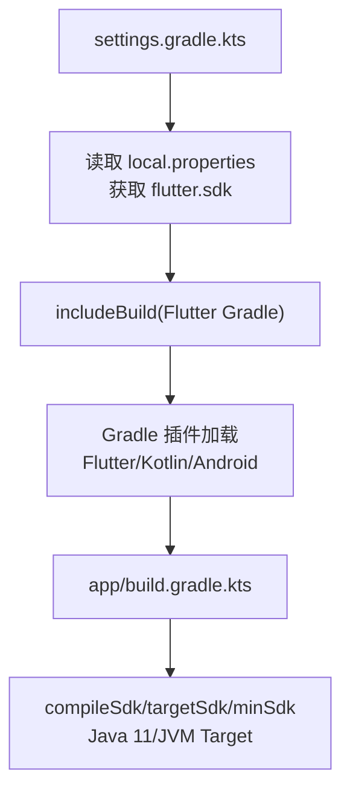
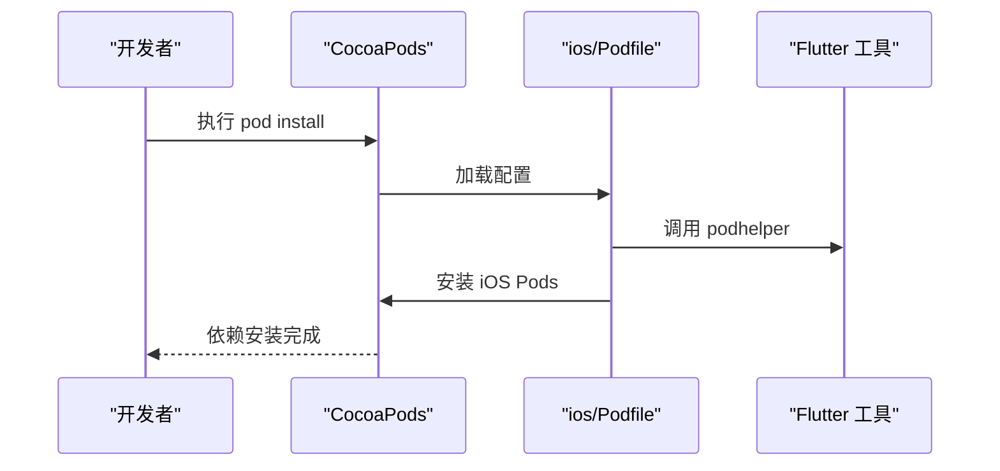
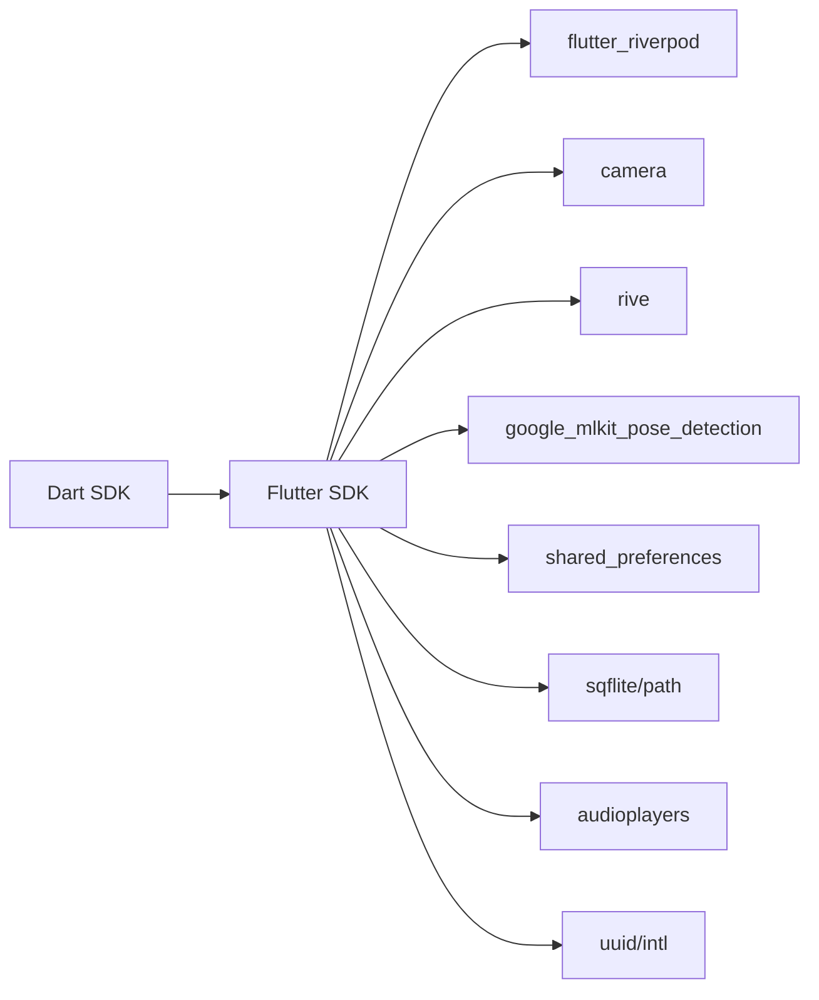

# 快速开始

<cite>
**本文引用的文件**
- [pubspec.yaml](file://pubspec.yaml)
- [main.dart](file://lib/main.dart)
- [android/app/build.gradle.kts](file://android/app/build.gradle.kts)
- [android/settings.gradle.kts](file://android/settings.gradle.kts)
- [android/gradle.properties](file://android/gradle.properties)
- [ios/Podfile](file://ios/Podfile)
- [linux/CMakeLists.txt](file://linux/CMakeLists.txt)
- [windows/CMakeLists.txt](file://windows/CMakeLists.txt)
- [macos/Runner/Info.plist](file://macos/Runner/Info.plist)
- [analysis_options.yaml](file://analysis_options.yaml)
- [README.md](file://README.md)
</cite>

## 目录
1. [简介](#简介)
2. [项目结构](#项目结构)
3. [核心组件](#核心组件)
4. [架构总览](#架构总览)
5. [详细组件分析](#详细组件分析)
6. [依赖关系分析](#依赖关系分析)
7. [性能注意事项](#性能注意事项)
8. [故障排除指南](#故障排除指南)
9. [结论](#结论)
10. [附录](#附录)

## 简介
本指南面向首次接触 Mimo 项目的开发者，帮助你在 Windows、macOS、Linux 等主流平台上快速完成开发环境搭建、依赖安装、项目构建与运行，并提供常见问题的排查思路与解决方案。Mimo 是一款基于 Flutter 的跨平台应用，结合摄像头与 AI 视觉识别（姿态检测）实现实时 2D 动捕互动。

## 项目结构
Mimo 采用 Flutter 跨平台工程结构，包含 Android、iOS、macOS、Windows、Linux 多端支持，以及 Flutter 代码库与资源资产。关键目录与文件如下：
- lib：Flutter 应用入口与业务分层代码
- android/：Android 构建脚本与 Gradle 配置
- ios/：iOS 构建脚本与 CocoaPods 配置
- macos/、windows/、linux/：各桌面平台构建脚本
- assets/：Rive 动画与音效资源
- pubspec.yaml：Dart 包依赖与 Flutter 资源声明
- analysis_options.yaml：代码风格与 Lint 规则

**图表来源**
- [pubspec.yaml](file://pubspec.yaml)
- [main.dart](file://lib/main.dart)
- [android/app/build.gradle.kts](file://android/app/build.gradle.kts)
- [ios/Podfile](file://ios/Podfile)
- [macos/Runner/Info.plist](file://macos/Runner/Info.plist)
- [windows/CMakeLists.txt](file://windows/CMakeLists.txt)
- [linux/CMakeLists.txt](file://linux/CMakeLists.txt)

**章节来源**
- [pubspec.yaml](file://pubspec.yaml)
- [main.dart](file://lib/main.dart)
- [android/app/build.gradle.kts](file://android/app/build.gradle.kts)
- [ios/Podfile](file://ios/Podfile)
- [macos/Runner/Info.plist](file://macos/Runner/Info.plist)
- [windows/CMakeLists.txt](file://windows/CMakeLists.txt)
- [linux/CMakeLists.txt](file://linux/CMakeLists.txt)

## 核心组件
- 应用入口与 UI：lib/main.dart 提供基础的 Material 应用骨架，可作为开发起点进行替换与扩展。
- 依赖声明：pubspec.yaml 声明了 Flutter SDK 版本、核心依赖（Riverpod、camera、rive、google_mlkit_pose_detection、shared_preferences、sqflite、audioplayers 等）与资源清单。
- 多端构建：各平台通过各自构建脚本（Gradle、CMake、Podfile）集成 Flutter 工具链，完成打包与运行。

**章节来源**
- [main.dart](file://lib/main.dart)
- [pubspec.yaml](file://pubspec.yaml)

## 架构总览
Mimo 的运行时数据流大致为：摄像头采集 → 姿态识别（ML/KIT）→ 角度计算与滤波 → Rive 渲染 → UI 叠加层。该流程在 README 中有详细描述，便于理解端到端管线。

**图表来源**
- [README.md](file://README.md)

**章节来源**
- [README.md](file://README.md)

## 详细组件分析

### Flutter SDK 与开发工具
- Flutter SDK：pubspec.yaml 指定 Dart SDK 版本，确保使用兼容的 Flutter 版本。
- 代码风格与 Lint：analysis_options.yaml 引入 Flutter 推荐规则，建议在 IDE 中启用分析器以获得即时反馈。
- IDE 配置：推荐使用 Android Studio 或 VS Code，并安装 Flutter、Dart 插件，开启格式化与分析器。

**章节来源**
- [pubspec.yaml](file://pubspec.yaml)
- [analysis_options.yaml](file://analysis_options.yaml)

### Android 平台配置
- Gradle 插件与版本：android/app/build.gradle.kts 使用 Flutter Gradle 插件与 Kotlin 插件，compileSdk/targetSdk/minSdk 由 Flutter 工具链统一管理。
- Java 版本：Java 11 兼容性配置，确保 Gradle 与编译链稳定。
- Gradle 属性：android/gradle.properties 启用 AndroidX 与 Jetifier，保证第三方库兼容性。
- 本地 SDK 路径：android/settings.gradle.kts 通过 local.properties 读取 Flutter SDK 路径，确保构建脚本正确加载。

**图表来源**
- [android/settings.gradle.kts](file://android/settings.gradle.kts)
- [android/app/build.gradle.kts](file://android/app/build.gradle.kts)
- [android/gradle.properties](file://android/gradle.properties)

**章节来源**
- [android/app/build.gradle.kts](file://android/app/build.gradle.kts)
- [android/settings.gradle.kts](file://android/settings.gradle.kts)
- [android/gradle.properties](file://android/gradle.properties)

### iOS 平台配置
- CocoaPods：ios/Podfile 使用 Flutter 工具提供的 podhelper，自动安装 iOS 依赖。
- FLUTTER_ROOT 校验：Podfile 会在缺失 Generated.xcconfig 时抛出明确错误，提示先执行 flutter pub get。
- 平台与目标：Podfile 未固定最低系统版本，建议根据产品需求在 Xcode 中设置。

**图表来源**
- [ios/Podfile](file://ios/Podfile)

**章节来源**
- [ios/Podfile](file://ios/Podfile)

### macOS 平台配置
- 信息配置：macos/Runner/Info.plist 使用 Flutter 注入的构建变量，确保版本与标识符正确。
- Xcode 工作空间：Runner.xcworkspace 与相关配置文件已提供，可直接在 Xcode 中打开与构建。

**章节来源**
- [macos/Runner/Info.plist](file://macos/Runner/Info.plist)

### Windows 平台配置
- CMake：windows/CMakeLists.txt 定义了构建类型、编译选项与安装规则，适配 Flutter 工具链。
- 依赖与资源：通过 flutter/generated_plugins.cmake 引入插件，安装阶段复制资源与 ICU 数据。

**章节来源**
- [windows/CMakeLists.txt](file://windows/CMakeLists.txt)

### Linux 平台配置
- CMake：linux/CMakeLists.txt 定义 GTK 依赖、构建类型与资源安装规则，适配 Flutter Linux 打包。
- 依赖检查：使用 pkg-config 检查 GTK+ 依赖，确保运行时可用。

**章节来源**
- [linux/CMakeLists.txt](file://linux/CMakeLists.txt)

### 资源与依赖
- 资产清单：pubspec.yaml 的 flutter.assets 声明了 Rive 与声音资源路径，确保构建时资源打包。
- 核心依赖：Riverpod、camera、rive、google_mlkit_pose_detection、shared_preferences、sqflite、audioplayers 等已在 pubspec.yaml 中声明，安装后即可在代码中使用。

**章节来源**
- [pubspec.yaml](file://pubspec.yaml)

## 依赖关系分析
- Dart 语言与 Flutter SDK：由 pubspec.yaml 指定，确保 Dart 与 Flutter 版本匹配。
- 第三方包：Riverpod（状态管理）、camera（相机）、rive（动画）、google_mlkit_pose_detection（姿态识别）、shared_preferences/sqflite（本地存储）、audioplayers（音效）、uuid/intl（工具）。
- 多端构建：Android 通过 Gradle、iOS 通过 CocoaPods、桌面平台通过 CMake，均遵循 Flutter 工具链约定。

**图表来源**
- [pubspec.yaml](file://pubspec.yaml)

**章节来源**
- [pubspec.yaml](file://pubspec.yaml)

## 性能注意事项
- 推理与渲染分离：README 中建议使用 Isolate 将 AI 推理与 UI 渲染分离，避免主线程阻塞。
- 性能调度：建议实现自适应性能调度器，依据 FPS、推理耗时与温度趋势动态调整分辨率、推理频率与模型复杂度。
- 资源与内存：桌面端构建脚本已包含资源安装与 ICU 数据复制，注意在发布前清理不必要的资源以减小体积。

**章节来源**
- [README.md](file://README.md)
- [windows/CMakeLists.txt](file://windows/CMakeLists.txt)
- [linux/CMakeLists.txt](file://linux/CMakeLists.txt)

## 故障排除指南

### Flutter 环境与依赖
- 依赖未安装或版本不匹配
  - 症状：运行时提示缺少包或版本冲突
  - 处理：执行 flutter pub get，确保 pubspec.yaml 中依赖已正确声明；必要时运行 flutter pub upgrade
- 分析器报错
  - 症状：IDE 报告 Lint 错误
  - 处理：根据 analysis_options.yaml 的规则调整代码；可在特定文件或行添加注释抑制

**章节来源**
- [pubspec.yaml](file://pubspec.yaml)
- [analysis_options.yaml](file://analysis_options.yaml)

### Android 平台
- Gradle 同步失败
  - 症状：Android Studio 同步失败或找不到 Flutter SDK
  - 处理：检查 android/local.properties 是否存在 flutter.sdk；确保 Gradle Wrapper 与 Android Gradle Plugin 版本兼容
- Java 版本不兼容
  - 症状：编译报错，提示 Java 版本不匹配
  - 处理：确认 JDK 版本与 Gradle 配置一致（Java 11）

**章节来源**
- [android/settings.gradle.kts](file://android/settings.gradle.kts)
- [android/app/build.gradle.kts](file://android/app/build.gradle.kts)
- [android/gradle.properties](file://android/gradle.properties)

### iOS 平台
- CocoaPods 依赖安装失败
  - 症状：pod install 报错，提示找不到 FLUTTER_ROOT 或 Generated.xcconfig
  - 处理：先执行 flutter pub get，再执行 pod install；确保 Xcode 工程与 Podfile 一致
- 未设置最低系统版本
  - 症状：构建警告或运行时兼容性问题
  - 处理：在 Xcode 中设置 iOS Deployment Target，满足产品需求

**章节来源**
- [ios/Podfile](file://ios/Podfile)

### 桌面平台（Windows/Linux/macOS）
- CMake 配置错误
  - 症状：构建失败或找不到依赖
  - 处理：检查 CMakeLists.txt 中的依赖查找与安装规则；确保 Flutter 工具链路径正确
- 资源未打包
  - 症状：运行时资源缺失
  - 处理：确认 flutter_assets 与本地资源在安装阶段被复制

**章节来源**
- [windows/CMakeLists.txt](file://windows/CMakeLists.txt)
- [linux/CMakeLists.txt](file://linux/CMakeLists.txt)
- [macos/Runner/Info.plist](file://macos/Runner/Info.plist)

## 结论
按照本指南完成环境与依赖配置后，你可以在多平台上成功运行 Mimo 项目。建议先从 Android/iOS 真机或模拟器验证基础功能，再逐步接入摄像头与姿态识别模块。遇到问题时，优先参考各平台构建脚本与错误提示，结合本指南的故障排除建议逐一排查。

## 附录

### 快速开始步骤（概览）
- 安装 Flutter SDK 与 IDE 插件
- 克隆仓库并执行 flutter pub get
- Android：配置 JDK 与 Gradle，连接设备或启动模拟器
- iOS：执行 flutter pub get 与 pod install，打开 Runner.xcworkspace
- 桌面平台：按需安装 GTK（Linux）或 Visual Studio（Windows），使用 flutter run -d <device>
- 运行应用：选择目标平台，执行 flutter run

### 项目入口与演示
- 应用入口：lib/main.dart 提供基础 UI，可作为开发起点替换为实际页面与管线

**章节来源**
- [main.dart](file://lib/main.dart)