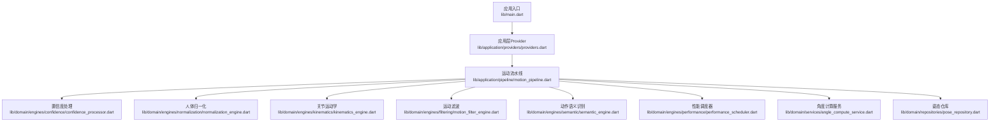
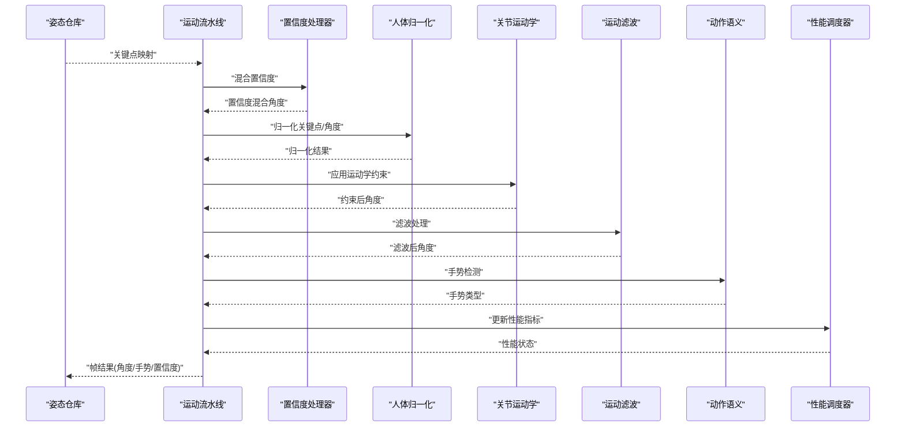
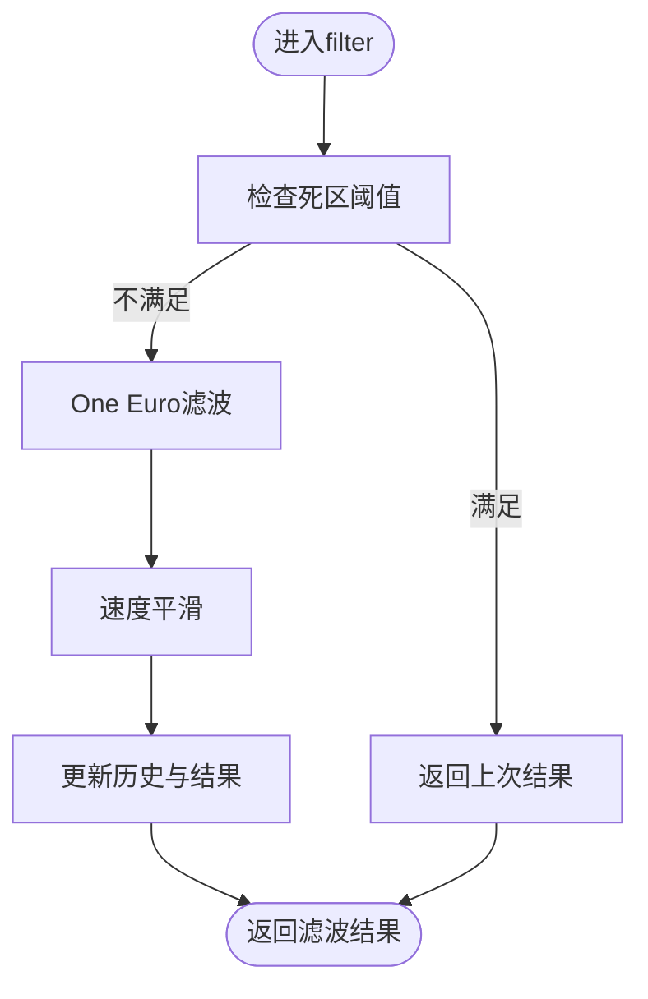

# 引擎扩展方法

<cite>
**本文引用的文件**
- [lib/main.dart](file://lib/main.dart)
- [lib/application/providers/providers.dart](file://lib/application/providers/providers.dart)
- [lib/application/pipeline/motion_pipeline.dart](file://lib/application/pipeline/motion_pipeline.dart)
- [lib/domain/engines/filtering/motion_filter_engine.dart](file://lib/domain/engines/filtering/motion_filter_engine.dart)
- [lib/domain/engines/filtering/one_euro_filter.dart](file://lib/domain/engines/filtering/one_euro_filter.dart)
- [lib/domain/engines/kinematics/kinematics_engine.dart](file://lib/domain/engines/kinematics/kinematics_engine.dart)
- [lib/domain/engines/kinematics/joint_constraint.dart](file://lib/domain/engines/kinematics/joint_constraint.dart)
- [lib/domain/engines/kinematics/joint_state.dart](file://lib/domain/engines/kinematics/joint_state.dart)
- [lib/domain/engines/normalization/normalization_engine.dart](file://lib/domain/engines/normalization/normalization_engine.dart)
- [lib/domain/engines/semantic/semantic_engine.dart](file://lib/domain/engines/semantic/semantic_engine.dart)
- [lib/domain/engines/performance/performance_scheduler.dart](file://lib/domain/engines/performance/performance_scheduler.dart)
- [lib/domain/engines/confidence/confidence_processor.dart](file://lib/domain/engines/confidence/confidence_processor.dart)
- [lib/domain/engines/calibration/calibration_engine.dart](file://lib/domain/engines/calibration/calibration_engine.dart)
- [lib/domain/entities/joint_type.dart](file://lib/domain/entities/joint_type.dart)
- [lib/domain/entities/gesture_type.dart](file://lib/domain/entities/gesture_type.dart)
- [lib/core/config/performance_config.dart](file://lib/core/config/performance_config.dart)
</cite>

## 目录
1. [简介](#简介)
2. [项目结构](#项目结构)
3. [核心组件](#核心组件)
4. [架构总览](#架构总览)
5. [详细组件分析](#详细组件分析)
6. [依赖分析](#依赖分析)
7. [性能考虑](#性能考虑)
8. [故障排查指南](#故障排查指南)
9. [结论](#结论)
10. [附录](#附录)

## 简介
本文件面向希望扩展现有运动处理引擎系统的开发者，系统性说明引擎接口设计规范、实现要求、注册与集成流程、引擎间依赖与通信机制、配置管理与参数传递方式，并提供扩展开发模板与最佳实践。Mimo项目采用分层清晰的领域引擎架构，通过“流水线编排 + 多引擎协作”的方式完成从姿态关键点到语义动作的全链路处理。

## 项目结构
- 入口与路由：应用入口负责初始化Provider与页面路由，运动处理逻辑位于应用层的Provider与流水线中。
- 应用层Provider：集中声明各引擎Provider，便于在UI层以Riverpod注入使用。
- 流水线MotionPipeline：串联姿态仓库、置信度处理、归一化、运动学约束、滤波、语义识别、性能调度与角度计算服务，形成端到端处理链路。
- 领域引擎：按功能拆分为校准、置信度、归一化、运动学、滤波、语义、性能调度等独立模块，彼此通过统一的数据模型（关键点、关节类型、角度等）交互。

图表来源
- [lib/main.dart:1-34](file://lib/main.dart#L1-L34)
- [lib/application/providers/providers.dart:1-69](file://lib/application/providers/providers.dart#L1-L69)
- [lib/application/pipeline/motion_pipeline.dart:1-141](file://lib/application/pipeline/motion_pipeline.dart#L1-L141)

章节来源
- [lib/main.dart:1-34](file://lib/main.dart#L1-L34)
- [lib/application/providers/providers.dart:1-69](file://lib/application/providers/providers.dart#L1-L69)
- [lib/application/pipeline/motion_pipeline.dart:1-141](file://lib/application/pipeline/motion_pipeline.dart#L1-L141)

## 核心组件
- 运动流水线MotionPipeline：负责编排各引擎，串联输入输出，统一对外暴露处理结果。
- 置信度处理器ConfidenceProcessor：根据关键点置信度对跟踪角度与idle角度进行平滑混合。
- 人体归一化引擎NormalizationEngine：基于T-Pose校准得到的度量数据，对关键点与角度进行尺度归一化。
- 关节运动学引擎KinematicsEngine：施加角度范围与单帧变化量约束，保证动作符合人体生物力学。
- 运动滤波引擎MotionFilterEngine：组合死区过滤、One Euro滤波与速度平滑，降低抖动并保持响应。
- 动作语义引擎SemanticEngine：识别举手、双手张开、挥手、拍手、双手高举等手势。
- 性能调度器PerformanceScheduler：动态调整推理帧率与分辨率，维持稳定性能。
- 校准引擎CalibrationEngine：引导用户完成T-Pose校准，输出人体度量数据。

章节来源
- [lib/application/pipeline/motion_pipeline.dart:14-141](file://lib/application/pipeline/motion_pipeline.dart#L14-L141)
- [lib/domain/engines/confidence/confidence_processor.dart:1-91](file://lib/domain/engines/confidence/confidence_processor.dart#L1-L91)
- [lib/domain/engines/normalization/normalization_engine.dart:1-143](file://lib/domain/engines/normalization/normalization_engine.dart#L1-L143)
- [lib/domain/engines/kinematics/kinematics_engine.dart:1-95](file://lib/domain/engines/kinematics/kinematics_engine.dart#L1-L95)
- [lib/domain/engines/filtering/motion_filter_engine.dart:1-117](file://lib/domain/engines/filtering/motion_filter_engine.dart#L1-L117)
- [lib/domain/engines/semantic/semantic_engine.dart:1-221](file://lib/domain/engines/semantic/semantic_engine.dart#L1-L221)
- [lib/domain/engines/performance/performance_scheduler.dart:1-194](file://lib/domain/engines/performance/performance_scheduler.dart#L1-L194)
- [lib/domain/engines/calibration/calibration_engine.dart:1-302](file://lib/domain/engines/calibration/calibration_engine.dart#L1-L302)

## 架构总览
下图展示引擎间的调用关系与数据流：流水线接收姿态关键点，依次经过置信度混合、归一化、运动学约束、滤波、语义识别，最后由性能调度器更新统计指标并输出帧结果。

图表来源
- [lib/application/pipeline/motion_pipeline.dart:14-141](file://lib/application/pipeline/motion_pipeline.dart#L14-L141)
- [lib/domain/engines/confidence/confidence_processor.dart:26-73](file://lib/domain/engines/confidence/confidence_processor.dart#L26-L73)
- [lib/domain/engines/normalization/normalization_engine.dart:72-125](file://lib/domain/engines/normalization/normalization_engine.dart#L72-L125)
- [lib/domain/engines/kinematics/kinematics_engine.dart:31-81](file://lib/domain/engines/kinematics/kinematics_engine.dart#L31-L81)
- [lib/domain/engines/filtering/motion_filter_engine.dart:23-72](file://lib/domain/engines/filtering/motion_filter_engine.dart#L23-L72)
- [lib/domain/engines/semantic/semantic_engine.dart:32-80](file://lib/domain/engines/semantic/semantic_engine.dart#L32-L80)
- [lib/domain/engines/performance/performance_scheduler.dart:90-129](file://lib/domain/engines/performance/performance_scheduler.dart#L90-L129)

## 详细组件分析

### 引擎接口设计规范与实现要求
- 统一输入/输出约定
  - 角度输入/输出：统一使用Map<JointType, double>表示关节角度（弧度）。
  - 关键点输入/输出：统一使用Map<JointType, Landmark>表示关键点（含可见性）。
  - 手势输出：统一使用GestureType枚举或空值。
- 状态管理
  - 支持reset()重置内部状态，便于重新开始或切换场景。
  - 对于需要历史状态的引擎（如滤波、语义、性能），提供内部缓冲与阈值控制。
- 可配置参数
  - 通过构造函数参数或静态常量暴露关键阈值与权重，便于外部注入与调优。
- 数据一致性
  - 引擎间通过统一的JointType与Landmark模型传递，避免跨模块耦合。

章节来源
- [lib/domain/entities/joint_type.dart:1-66](file://lib/domain/entities/joint_type.dart#L1-L66)
- [lib/domain/engines/kinematics/joint_state.dart:1-63](file://lib/domain/engines/kinematics/joint_state.dart#L1-L63)
- [lib/domain/engines/semantic/semantic_engine.dart:32-80](file://lib/domain/engines/semantic/semantic_engine.dart#L32-L80)

### 注册与集成流程
- Provider注册
  - 在应用层providers中新增引擎Provider，返回具体引擎实例。
  - 将新引擎Provider加入MotionPipeline的构造函数参数列表，确保流水线编排时可注入。
- UI层使用
  - 通过Riverpod ref.watch/ref.read访问Provider，获得引擎实例并调用其方法。
- 示例路径
  - 新增Provider：[lib/application/providers/providers.dart:67-69](file://lib/application/providers/providers.dart#L67-L69)
  - 流水线注入：[lib/application/pipeline/motion_pipeline.dart:42-51](file://lib/application/pipeline/motion_pipeline.dart#L42-L51)

章节来源
- [lib/application/providers/providers.dart:61-69](file://lib/application/providers/providers.dart#L61-L69)
- [lib/application/pipeline/motion_pipeline.dart:42-51](file://lib/application/pipeline/motion_pipeline.dart#L42-L51)

### 引擎间依赖关系与通信机制
- 依赖关系
  - MotionPipeline依赖PoseRepository、ConfidenceProcessor、NormalizationEngine、KinematicsEngine、MotionFilterEngine、SemanticEngine、PerformanceScheduler、AngleComputeService。
  - MotionFilterEngine内部依赖OneEuroFilter；KinematicsEngine依赖JointConstraint与JointStates；SemanticEngine依赖GestureType与JointType。
- 通信机制
  - 通过统一数据模型（Map<JointType, ...>、Landmark、double）在引擎间传递。
  - 置信度混合在流水线阶段统一处理，避免引擎间重复计算。
  - 性能调度器仅接收统计指标（FPS、延迟、温度），不参与具体算法细节。

章节来源
- [lib/application/pipeline/motion_pipeline.dart:14-141](file://lib/application/pipeline/motion_pipeline.dart#L14-L141)
- [lib/domain/engines/filtering/motion_filter_engine.dart:1-117](file://lib/domain/engines/filtering/motion_filter_engine.dart#L1-L117)
- [lib/domain/engines/kinematics/kinematics_engine.dart:1-95](file://lib/domain/engines/kinematics/kinematics_engine.dart#L1-L95)
- [lib/domain/engines/semantic/semantic_engine.dart:1-221](file://lib/domain/engines/semantic/semantic_engine.dart#L1-L221)

### 配置管理与参数传递
- 性能配置
  - 通过PerformanceConfig定义目标/降级/最低推理帧率、渲染帧率、推理分辨率与阈值，PerformanceScheduler据此动态调整。
- 引擎参数
  - MotionFilterEngine：deadZoneThreshold、velocitySmoothing。
  - KinematicsEngine：JointConstraint（minAngle、maxAngle、maxDeltaPerFrame）。
  - SemanticEngine：手势检测阈值与历史长度。
  - CalibrationEngine：requiredTPoseFrames、armAngleThreshold、timeoutSeconds。
- 传递方式
  - 通过构造函数注入；或在运行期通过setter/更新方法（如KinematicsEngine.updateConstraint）动态调整。

章节来源
- [lib/core/config/performance_config.dart:1-79](file://lib/core/config/performance_config.dart#L1-L79)
- [lib/domain/engines/performance/performance_scheduler.dart:60-194](file://lib/domain/engines/performance/performance_scheduler.dart#L60-L194)
- [lib/domain/engines/filtering/motion_filter_engine.dart:18-21](file://lib/domain/engines/filtering/motion_filter_engine.dart#L18-L21)
- [lib/domain/engines/kinematics/joint_constraint.dart:14-47](file://lib/domain/engines/kinematics/joint_constraint.dart#L14-L47)
- [lib/domain/engines/semantic/semantic_engine.dart:16-30](file://lib/domain/engines/semantic/semantic_engine.dart#L16-L30)
- [lib/domain/engines/calibration/calibration_engine.dart:84-88](file://lib/domain/engines/calibration/calibration_engine.dart#L84-L88)

### 新引擎开发模板与代码示例
- 模板步骤
  - 定义引擎类，提供filter/process/detect等方法，输入/输出遵循统一约定。
  - 在lib/application/providers/providers.dart中新增Provider。
  - 在lib/application/pipeline/motion_pipeline.dart中注入并调用。
  - 如需配置项，在构造函数中暴露参数并通过PerformanceConfig或常量管理。
- 示例路径
  - Provider注册：[lib/application/providers/providers.dart:67-69](file://lib/application/providers/providers.dart#L67-L69)
  - 流水线接入：[lib/application/pipeline/motion_pipeline.dart:42-51](file://lib/application/pipeline/motion_pipeline.dart#L42-L51)
  - One Euro滤波参考实现：[lib/domain/engines/filtering/one_euro_filter.dart:1-112](file://lib/domain/engines/filtering/one_euro_filter.dart#L1-L112)

章节来源
- [lib/application/providers/providers.dart:61-69](file://lib/application/providers/providers.dart#L61-L69)
- [lib/application/pipeline/motion_pipeline.dart:42-51](file://lib/application/pipeline/motion_pipeline.dart#L42-L51)
- [lib/domain/engines/filtering/one_euro_filter.dart:1-112](file://lib/domain/engines/filtering/one_euro_filter.dart#L1-L112)

### 性能考虑与优化策略
- 降级与升级
  - 基于温度、延迟、FPS阈值动态调整推理帧率与分辨率，避免卡顿。
- 滤波与平滑
  - MotionFilterEngine结合死区过滤、One Euro滤波与速度平滑，兼顾响应与稳定性。
- 约束与历史
  - KinematicsEngine限制单帧变化量，配合JointStates历史记录，减少突变。
- 语义检测窗口
  - SemanticEngine使用历史窗口与稳定阈值，避免误检。
- 资源复用
  - 引擎内部使用Map缓存（如One Euro滤波器、历史缓冲），避免重复分配。

章节来源
- [lib/domain/engines/performance/performance_scheduler.dart:90-194](file://lib/domain/engines/performance/performance_scheduler.dart#L90-L194)
- [lib/domain/engines/filtering/motion_filter_engine.dart:50-102](file://lib/domain/engines/filtering/motion_filter_engine.dart#L50-L102)
- [lib/domain/engines/kinematics/kinematics_engine.dart:68-81](file://lib/domain/engines/kinematics/kinematics_engine.dart#L68-L81)
- [lib/domain/engines/semantic/semantic_engine.dart:190-221](file://lib/domain/engines/semantic/semantic_engine.dart#L190-L221)

### 调试与测试方法
- 状态重置
  - 各引擎提供reset()方法，便于在测试或切换场景时清空内部状态。
- 历史记录
  - 语义引擎与滤波引擎维护历史缓冲，可用于离线回放与可视化分析。
- 性能指标
  - PerformanceScheduler提供FPS、延迟、温度等指标，便于定位瓶颈。
- 单元测试建议
  - 对关键阈值与边界条件进行测试（如滤波死区、运动学约束、语义稳定阈值）。
  - 使用Mock关键点数据验证流水线端到端行为。

章节来源
- [lib/domain/engines/semantic/semantic_engine.dart:214-221](file://lib/domain/engines/semantic/semantic_engine.dart#L214-L221)
- [lib/domain/engines/filtering/motion_filter_engine.dart:104-117](file://lib/domain/engines/filtering/motion_filter_engine.dart#L104-L117)
- [lib/domain/engines/kinematics/kinematics_engine.dart:83-95](file://lib/domain/engines/kinematics/kinematics_engine.dart#L83-L95)
- [lib/domain/engines/performance/performance_scheduler.dart:188-194](file://lib/domain/engines/performance/performance_scheduler.dart#L188-L194)

### 版本管理与向后兼容性
- 接口稳定性
  - 保持输入/输出签名稳定，新增参数尽量提供默认值，避免破坏既有调用方。
- 配置演进
  - 通过PerformanceConfig集中管理阈值与参数，版本升级时可渐进式调整。
- 枚举与模型
  - JointType与GestureType等枚举作为契约，新增枚举值需谨慎并提供兼容映射。
- Provider扩展
  - 新增引擎Provider不影响既有Provider契约，通过流水线注入即可无缝集成。

章节来源
- [lib/domain/entities/joint_type.dart:1-66](file://lib/domain/entities/joint_type.dart#L1-L66)
- [lib/domain/entities/gesture_type.dart:1-60](file://lib/domain/entities/gesture_type.dart#L1-L60)
- [lib/core/config/performance_config.dart:36-79](file://lib/core/config/performance_config.dart#L36-L79)

## 依赖分析
- 内聚与耦合
  - 各引擎内聚于单一职责，耦合通过统一数据模型与Provider注入实现，降低模块间依赖。
- 外部依赖
  - Riverpod用于状态与依赖注入；无第三方深度依赖，便于移植。
- 循环依赖
  - 通过流水线集中编排，避免引擎间循环调用。

图表来源
- [lib/application/providers/providers.dart:1-69](file://lib/application/providers/providers.dart#L1-L69)
- [lib/application/pipeline/motion_pipeline.dart:1-141](file://lib/application/pipeline/motion_pipeline.dart#L1-L141)

章节来源
- [lib/application/providers/providers.dart:1-69](file://lib/application/providers/providers.dart#L1-L69)
- [lib/application/pipeline/motion_pipeline.dart:1-141](file://lib/application/pipeline/motion_pipeline.dart#L1-L141)

## 性能考虑
- 优先使用增量更新与缓存（如One Euro滤波器、历史缓冲）。
- 控制单帧处理复杂度，必要时启用性能调度器降级。
- 对高频计算（如三角函数、距离计算）进行阈值与边界保护。

## 故障排查指南
- 校准失败
  - 检查关键点可见性与T-Pose判定阈值；确认requiredTPoseFrames与timeoutSeconds设置合理。
- 手势误检
  - 调整语义检测阈值与历史长度；确保关键点置信度满足要求。
- 滤波抖动
  - 调整MotionFilterEngine的死区阈值与速度平滑系数；检查One Euro滤波初始参数。
- 性能波动
  - 查看PerformanceScheduler状态与阈值；评估设备温度与延迟。

章节来源
- [lib/domain/engines/calibration/calibration_engine.dart:106-176](file://lib/domain/engines/calibration/calibration_engine.dart#L106-L176)
- [lib/domain/engines/semantic/semantic_engine.dart:190-221](file://lib/domain/engines/semantic/semantic_engine.dart#L190-L221)
- [lib/domain/engines/filtering/motion_filter_engine.dart:50-102](file://lib/domain/engines/filtering/motion_filter_engine.dart#L50-L102)
- [lib/domain/engines/performance/performance_scheduler.dart:90-194](file://lib/domain/engines/performance/performance_scheduler.dart#L90-L194)

## 结论
通过统一的数据模型、清晰的Provider注入与流水线编排，Mimo实现了高度模块化的运动处理引擎体系。扩展新引擎只需遵循接口规范、在Provider与流水线中注册，并通过配置与阈值进行调优，即可与现有系统无缝集成并在性能调度下稳定运行。

## 附录
- 关键流程图：滤波算法流程

图表来源
- [lib/domain/engines/filtering/motion_filter_engine.dart:50-102](file://lib/domain/engines/filtering/motion_filter_engine.dart#L50-L102)
- [lib/domain/engines/filtering/one_euro_filter.dart:38-66](file://lib/domain/engines/filtering/one_euro_filter.dart#L38-L66)