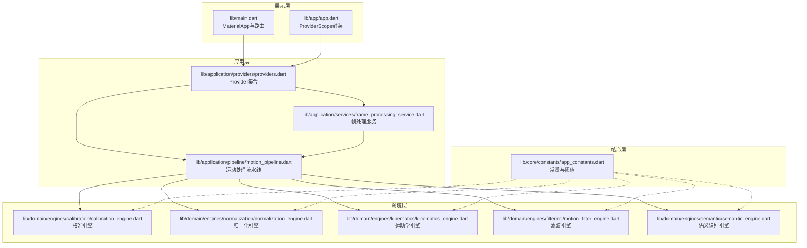
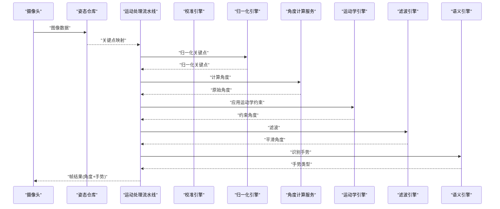
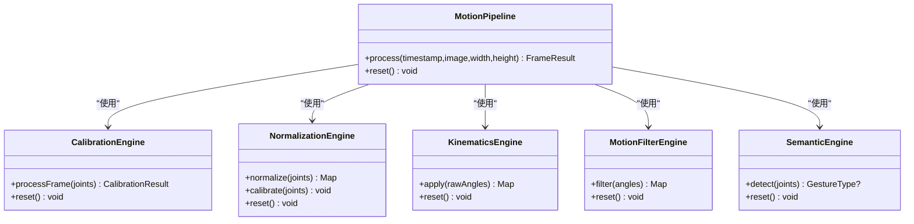
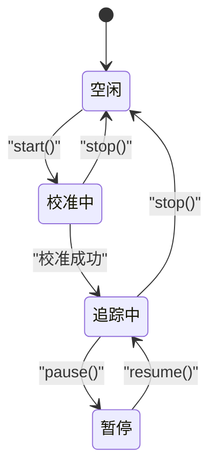
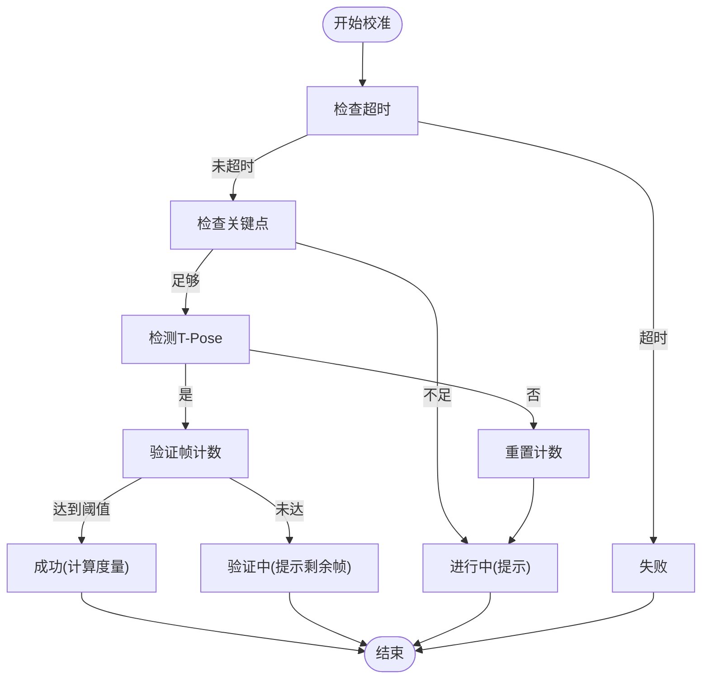
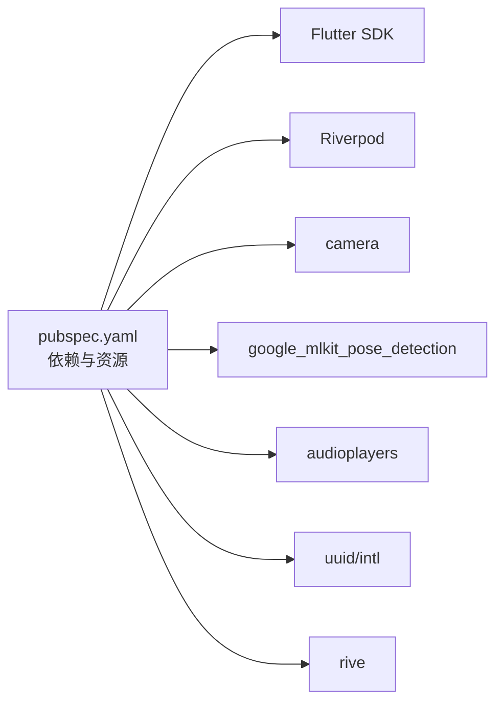

# 扩展开发

<cite>
**本文引用的文件**
- [pubspec.yaml](file://pubspec.yaml)
- [main.dart](file://lib/main.dart)
- [app.dart](file://lib/app/app.dart)
- [providers.dart](file://lib/application/providers/providers.dart)
- [motion_pipeline.dart](file://lib/application/pipeline/motion_pipeline.dart)
- [frame_processing_service.dart](file://lib/application/services/frame_processing_service.dart)
- [calibration_engine.dart](file://lib/domain/engines/calibration/calibration_engine.dart)
- [kinematics_engine.dart](file://lib/domain/engines/kinematics/kinematics_engine.dart)
- [normalization_engine.dart](file://lib/domain/engines/normalization/normalization_engine.dart)
- [motion_filter_engine.dart](file://lib/domain/engines/filtering/motion_filter_engine.dart)
- [semantic_engine.dart](file://lib/domain/engines/semantic/semantic_engine.dart)
- [app_constants.dart](file://lib/core/constants/app_constants.dart)
- [body_metrics.dart](file://lib/domain/entities/body_metrics.dart)
- [frame_result.dart](file://lib/domain/entities/frame_result.dart)
- [joint_type.dart](file://lib/domain/entities/joint_type.dart)
- [landmark.dart](file://lib/domain/entities/landmark.dart)
- [analysis_options.yaml](file://analysis_options.yaml)
</cite>

## 目录
1. [简介](#简介)
2. [项目结构](#项目结构)
3. [核心组件](#核心组件)
4. [架构总览](#架构总览)
5. [详细组件分析](#详细组件分析)
6. [依赖分析](#依赖分析)
7. [性能考虑](#性能考虑)
8. [故障排查指南](#故障排查指南)
9. [结论](#结论)
10. [附录](#附录)

## 简介
本文件面向Mimo项目的扩展开发者，系统性阐述扩展开发的指导原则、开发流程、引擎扩展方法与接口规范、第三方集成策略、社区贡献流程与代码规范、插件系统架构与扩展点识别、新功能开发模板与最佳实践、向后兼容性维护策略、扩展功能的测试与验证方法，以及文档编写与发布流程。内容基于现有代码库的模块化分层、Riverpod状态管理、MotionPipeline处理管线与各领域引擎的职责边界进行归纳总结，并提供可视化图示帮助理解。

## 项目结构
Mimo采用“展示层(Presentation) -> 应用层(Application) -> 领域层(Domain) -> 核心层(Core)”的分层架构，配合Riverpod Provider进行依赖注入与状态管理。关键目录与职责概览如下：
- lib/main.dart：应用入口，定义路由与主题。
- lib/app/app.dart：替代入口（MimoApp），同样通过ProviderScope提供全局状态。
- lib/application/providers/providers.dart：集中声明各Provider，串联数据仓库、引擎与服务。
- lib/application/pipeline/motion_pipeline.dart：运动处理主干流水线，编排姿态检测、归一化、角度计算、运动学约束、滤波、置信度混合与语义识别。
- lib/application/services/frame_processing_service.dart：连接摄像头与姿态检测，驱动Pipeline并输出帧结果。
- lib/domain/engines/*：各领域引擎（校准、归一化、运动学、滤波、语义等）。
- lib/domain/entities/*：通用实体模型（关节类型、关键点、帧结果、人体度量）。
- lib/core/constants/app_constants.dart：系统常量与阈值配置。
- pubspec.yaml：依赖与资源清单；analysis_options.yaml：代码风格与静态检查规则。

图表来源
- [main.dart:1-34](file://lib/main.dart#L1-L34)
- [app.dart:1-27](file://lib/app/app.dart#L1-L27)
- [providers.dart:1-103](file://lib/application/providers/providers.dart#L1-L103)
- [motion_pipeline.dart:1-141](file://lib/application/pipeline/motion_pipeline.dart#L1-L141)
- [frame_processing_service.dart:1-254](file://lib/application/services/frame_processing_service.dart#L1-L254)
- [calibration_engine.dart:1-302](file://lib/domain/engines/calibration/calibration_engine.dart#L1-L302)
- [normalization_engine.dart:1-143](file://lib/domain/engines/normalization/normalization_engine.dart#L1-L143)
- [kinematics_engine.dart:1-95](file://lib/domain/engines/kinematics/kinematics_engine.dart#L1-L95)
- [motion_filter_engine.dart:1-117](file://lib/domain/engines/filtering/motion_filter_engine.dart#L1-L117)
- [semantic_engine.dart:1-221](file://lib/domain/engines/semantic/semantic_engine.dart#L1-L221)
- [app_constants.dart:1-35](file://lib/core/constants/app_constants.dart#L1-L35)

章节来源
- [main.dart:1-34](file://lib/main.dart#L1-L34)
- [app.dart:1-27](file://lib/app/app.dart#L1-L27)
- [providers.dart:1-103](file://lib/application/providers/providers.dart#L1-L103)
- [motion_pipeline.dart:1-141](file://lib/application/pipeline/motion_pipeline.dart#L1-L141)
- [frame_processing_service.dart:1-254](file://lib/application/services/frame_processing_service.dart#L1-L254)
- [app_constants.dart:1-35](file://lib/core/constants/app_constants.dart#L1-L35)

## 核心组件
- Provider体系：集中声明数据仓库、引擎与服务Provider，MotionPipeline通过Provider组合各组件，便于替换与扩展。
- 帧处理服务：负责初始化摄像头与姿态检测、驱动Pipeline、状态机切换（校准/追踪/暂停）、FPS统计与回调。
- 运动处理流水线：统一编排姿态检测、归一化、角度计算、运动学约束、滤波、置信度混合与语义识别，提供reset能力。
- 领域引擎：校准、归一化、运动学、滤波、语义识别各自独立，遵循单一职责，便于替换与测试。
- 实体模型：JointType、Landmark、BodyMetrics、FrameResult等，定义跨层的数据契约。
- 常量与阈值：集中于AppConstants，便于统一配置与性能调优。

章节来源
- [providers.dart:1-103](file://lib/application/providers/providers.dart#L1-L103)
- [frame_processing_service.dart:1-254](file://lib/application/services/frame_processing_service.dart#L1-L254)
- [motion_pipeline.dart:1-141](file://lib/application/pipeline/motion_pipeline.dart#L1-L141)
- [calibration_engine.dart:1-302](file://lib/domain/engines/calibration/calibration_engine.dart#L1-L302)
- [normalization_engine.dart:1-143](file://lib/domain/engines/normalization/normalization_engine.dart#L1-L143)
- [kinematics_engine.dart:1-95](file://lib/domain/engines/kinematics/kinematics_engine.dart#L1-L95)
- [motion_filter_engine.dart:1-117](file://lib/domain/engines/filtering/motion_filter_engine.dart#L1-L117)
- [semantic_engine.dart:1-221](file://lib/domain/engines/semantic/semantic_engine.dart#L1-L221)
- [joint_type.dart:1-66](file://lib/domain/entities/joint_type.dart#L1-L66)
- [landmark.dart:1-87](file://lib/domain/entities/landmark.dart#L1-L87)
- [body_metrics.dart:1-109](file://lib/domain/entities/body_metrics.dart#L1-L109)
- [frame_result.dart:1-93](file://lib/domain/entities/frame_result.dart#L1-L93)
- [app_constants.dart:1-35](file://lib/core/constants/app_constants.dart#L1-L35)

## 架构总览
下图展示了从摄像头图像到最终帧结果的端到端流程，以及各引擎在Pipeline中的职责与交互关系。

图表来源
- [frame_processing_service.dart:108-216](file://lib/application/services/frame_processing_service.dart#L108-L216)
- [motion_pipeline.dart:61-130](file://lib/application/pipeline/motion_pipeline.dart#L61-L130)
- [calibration_engine.dart:114-176](file://lib/domain/engines/calibration/calibration_engine.dart#L114-L176)
- [normalization_engine.dart:72-113](file://lib/domain/engines/normalization/normalization_engine.dart#L72-L113)
- [kinematics_engine.dart:31-53](file://lib/domain/engines/kinematics/kinematics_engine.dart#L31-L53)
- [motion_filter_engine.dart:23-48](file://lib/domain/engines/filtering/motion_filter_engine.dart#L23-L48)
- [semantic_engine.dart:32-80](file://lib/domain/engines/semantic/semantic_engine.dart#L32-L80)

## 详细组件分析

### 插件系统与扩展点识别
- Provider扩展点：在providers.dart中集中注册Provider，新增引擎或服务只需在此处声明并注入到MotionPipeline或FrameProcessingService即可。
- Pipeline扩展点：motion_pipeline.dart作为编排层，新增处理步骤可在process方法内插入，保持输入输出契约不变。
- 引擎扩展点：各领域引擎独立实现，遵循相同接口风格（如apply/filter/detect/reset），便于替换与测试。
- 第三方集成点：camera与google_mlkit_pose_detection通过数据仓库抽象接入，便于替换为其他实现。

图表来源
- [motion_pipeline.dart:14-51](file://lib/application/pipeline/motion_pipeline.dart#L14-L51)
- [calibration_engine.dart:59-88](file://lib/domain/engines/calibration/calibration_engine.dart#L59-L88)
- [normalization_engine.dart:6-16](file://lib/domain/engines/normalization/normalization_engine.dart#L6-L16)
- [kinematics_engine.dart:6-19](file://lib/domain/engines/kinematics/kinematics_engine.dart#L6-L19)
- [motion_filter_engine.dart:5-21](file://lib/domain/engines/filtering/motion_filter_engine.dart#L5-L21)
- [semantic_engine.dart:6-25](file://lib/domain/engines/semantic/semantic_engine.dart#L6-L25)

章节来源
- [providers.dart:1-103](file://lib/application/providers/providers.dart#L1-L103)
- [motion_pipeline.dart:14-141](file://lib/application/pipeline/motion_pipeline.dart#L14-L141)

### 帧处理服务与状态机
- 状态机：idle -> calibrating -> tracking -> paused，支持start/stop/pause/resume。
- 校准阶段：调用CalibrationEngine，成功后写入BodyMetrics并切换到tracking。
- 追踪阶段：执行Pipeline，输出FrameResult并回调UI。

图表来源
- [frame_processing_service.dart:21-27](file://lib/application/services/frame_processing_service.dart#L21-L27)
- [frame_processing_service.dart:70-106](file://lib/application/services/frame_processing_service.dart#L70-L106)
- [frame_processing_service.dart:150-167](file://lib/application/services/frame_processing_service.dart#L150-L167)
- [frame_processing_service.dart:169-216](file://lib/application/services/frame_processing_service.dart#L169-L216)

章节来源
- [frame_processing_service.dart:1-254](file://lib/application/services/frame_processing_service.dart#L1-L254)

### 校准引擎
- 支持T-Pose检测、超时控制、置信度检查、人体度量计算与校准数据持久化。
- 提供状态枚举与结果对象，便于UI与业务逻辑消费。

图表来源
- [calibration_engine.dart:106-176](file://lib/domain/engines/calibration/calibration_engine.dart#L106-L176)
- [calibration_engine.dart:178-195](file://lib/domain/engines/calibration/calibration_engine.dart#L178-L195)
- [calibration_engine.dart:197-238](file://lib/domain/engines/calibration/calibration_engine.dart#L197-L238)
- [calibration_engine.dart:245-286](file://lib/domain/engines/calibration/calibration_engine.dart#L245-L286)

章节来源
- [calibration_engine.dart:1-302](file://lib/domain/engines/calibration/calibration_engine.dart#L1-L302)

### 归一化引擎
- 基于BodyMetrics对关键点进行中心化与缩放，消除不同用户体型差异。
- 提供默认度量与重置能力。

章节来源
- [normalization_engine.dart:1-143](file://lib/domain/engines/normalization/normalization_engine.dart#L1-L143)
- [body_metrics.dart:1-109](file://lib/domain/entities/body_metrics.dart#L1-L109)

### 运动学引擎
- 对关节角度施加范围限制与单帧变化量限制，保证动作符合人体生物力学。
- 支持动态更新约束与重置状态。

章节来源
- [kinematics_engine.dart:1-95](file://lib/domain/engines/kinematics/kinematics_engine.dart#L1-L95)

### 滤波引擎
- 组合死区过滤、One Euro滤波与速度平滑，降低抖动并提升稳定性。
- 支持按关节维度独立复位。

章节来源
- [motion_filter_engine.dart:1-117](file://lib/domain/engines/filtering/motion_filter_engine.dart#L1-L117)

### 语义引擎
- 识别举手、双手张开、挥手、拍手、双手高举等手势，具备历史记录与稳定判定。
- 提供重置历史能力。

章节来源
- [semantic_engine.dart:1-221](file://lib/domain/engines/semantic/semantic_engine.dart#L1-L221)

### 数据模型与实体
- JointType：定义支持的关节类型与MediaPipe索引映射。
- Landmark：关键点坐标与可见度。
- BodyMetrics：人体度量数据，用于归一化。
- FrameResult：帧处理结果，包含角度、手势、置信度与时间戳。

章节来源
- [joint_type.dart:1-66](file://lib/domain/entities/joint_type.dart#L1-L66)
- [landmark.dart:1-87](file://lib/domain/entities/landmark.dart#L1-L87)
- [body_metrics.dart:1-109](file://lib/domain/entities/body_metrics.dart#L1-L109)
- [frame_result.dart:1-93](file://lib/domain/entities/frame_result.dart#L1-L93)

## 依赖分析
- 依赖管理：pubspec.yaml声明了Flutter SDK、Riverpod、camera、rive、google_mlkit_pose_detection、音频播放、工具库等依赖。
- 资源与主题：main.dart中设置Material主题与路由；app.dart提供另一种入口封装。
- 分析选项：analysis_options.yaml启用Flutter推荐lint集，建议在PR中保持无告警。

图表来源
- [pubspec.yaml:30-80](file://pubspec.yaml#L30-L80)
- [main.dart:16-32](file://lib/main.dart#L16-L32)
- [app.dart:12-26](file://lib/app/app.dart#L12-L26)
- [analysis_options.yaml:8-29](file://analysis_options.yaml#L8-L29)

章节来源
- [pubspec.yaml:1-80](file://pubspec.yaml#L1-L80)
- [main.dart:1-34](file://lib/main.dart#L1-L34)
- [app.dart:1-27](file://lib/app/app.dart#L1-L27)
- [analysis_options.yaml:1-29](file://analysis_options.yaml#L1-L29)

## 性能考虑
- 目标与阈值：目标FPS、最低FPS、最大延迟等由AppConstants集中管理，便于统一调优。
- Pipeline性能：MotionPipeline在每帧末尾统计处理耗时并更新PerformanceScheduler，可用于动态降级。
- FPS统计：FrameProcessingService内置帧率统计与回调，便于UI显示与调试。
- 建议：
  - 在低性能设备上优先降低滤波复杂度或降低目标FPS。
  - 使用置信度阈值与idle状态减少无效渲染。
  - 将耗时操作放入后台任务或异步队列。

章节来源
- [app_constants.dart:11-15](file://lib/core/constants/app_constants.dart#L11-L15)
- [motion_pipeline.dart:117-122](file://lib/application/pipeline/motion_pipeline.dart#L117-L122)
- [frame_processing_service.dart:230-241](file://lib/application/services/frame_processing_service.dart#L230-L241)

## 故障排查指南
- 校准失败：检查光照条件、人物是否完全入镜、T-Pose是否稳定；查看CalibrationEngine错误消息与超时判断。
- 追踪中断：确认摄像头权限与初始化顺序；检查FrameProcessingService状态机流转。
- 角度过大或不稳定：调整运动学约束与滤波参数；必要时降低目标FPS。
- 置信度过低：优化摄像头角度与分辨率；提高环境亮度。
- 语义识别不灵敏：检查手势历史长度与阈值；确保关键点可见度达标。

章节来源
- [calibration_engine.dart:124-132](file://lib/domain/engines/calibration/calibration_engine.dart#L124-L132)
- [frame_processing_service.dart:70-88](file://lib/application/services/frame_processing_service.dart#L70-L88)
- [semantic_engine.dart:190-205](file://lib/domain/engines/semantic/semantic_engine.dart#L190-L205)

## 结论
Mimo通过清晰的分层架构、Provider依赖注入与可插拔的引擎设计，为扩展开发提供了良好的基础。开发者可在Provider与Pipeline层面进行扩展，同时利用各领域引擎的独立性快速迭代功能。建议在新增功能时严格遵循接口契约、保持向后兼容、完善测试与文档，并通过统一常量与阈值进行性能调优。

## 附录

### 新功能开发模板与最佳实践
- 模板步骤
  - 在application/providers/providers.dart中新增Provider，注入到MotionPipeline或FrameProcessingService。
  - 在domain/engines新增领域引擎，实现独立接口（如apply/filter/detect/reset）。
  - 在application/pipeline/motion_pipeline.dart中插入新步骤，保持输入输出一致。
  - 在application/services/frame_processing_service.dart中根据状态机调用新引擎。
  - 在core/constants/app_constants.dart中添加必要的阈值与参数。
  - 编写单元测试与集成测试，覆盖边界条件与异常路径。
  - 更新analysis_options.yaml与pubspec.yaml（如需新增依赖）。
- 最佳实践
  - 单一职责：每个引擎只做一件事。
  - 接口一致性：输入输出参数命名与类型保持稳定。
  - 可配置性：将阈值与权重参数化，便于A/B测试。
  - 兼容性：保留旧接口一段时间，提供迁移指南。
  - 文档：为新引擎与Provider补充README说明与使用示例。

章节来源
- [providers.dart:1-103](file://lib/application/providers/providers.dart#L1-L103)
- [motion_pipeline.dart:14-141](file://lib/application/pipeline/motion_pipeline.dart#L14-L141)
- [frame_processing_service.dart:1-254](file://lib/application/services/frame_processing_service.dart#L1-L254)
- [app_constants.dart:1-35](file://lib/core/constants/app_constants.dart#L1-L35)

### 向后兼容性维护策略
- 版本号与构建号：遵循语义化版本，变更破坏性接口时升级主版本。
- Provider兼容：新增Provider时保留旧Provider别名或提供迁移脚本。
- 接口演进：新增方法时提供默认实现或兼容包装。
- 配置迁移：AppConstants新增字段时提供默认值与回退逻辑。

章节来源
- [pubspec.yaml:19](file://pubspec.yaml#L19)
- [app_constants.dart:1-35](file://lib/core/constants/app_constants.dart#L1-L35)

### 测试与验证方法
- 单元测试：针对引擎的纯函数与边界条件（如滤波阈值、运动学约束）。
- 集成测试：通过FrameProcessingService模拟摄像头与姿态检测，验证Pipeline整体行为。
- 性能测试：在不同设备上测量FPS、延迟与内存占用，结合AppConstants阈值评估。
- 用户验收测试：在真实场景下验证校准、追踪与手势识别效果。

章节来源
- [motion_filter_engine.dart:1-117](file://lib/domain/engines/filtering/motion_filter_engine.dart#L1-L117)
- [kinematics_engine.dart:1-95](file://lib/domain/engines/kinematics/kinematics_engine.dart#L1-L95)
- [semantic_engine.dart:1-221](file://lib/domain/engines/semantic/semantic_engine.dart#L1-L221)
- [frame_processing_service.dart:1-254](file://lib/application/services/frame_processing_service.dart#L1-L254)

### 文档编写与发布流程
- 文档编写：为新增引擎与Provider撰写README，说明输入输出、配置项与使用示例。
- 发布准备：更新pubspec.yaml版本号与变更日志；确保analysis_options无告警；运行flutter test与flutter analyze。
- 社区贡献：遵循analysis_options规则；提交PR前自检；在README中补充贡献者指南与代码规范链接。

章节来源
- [analysis_options.yaml:1-29](file://analysis_options.yaml#L1-L29)
- [pubspec.yaml:1-80](file://pubspec.yaml#L1-L80)