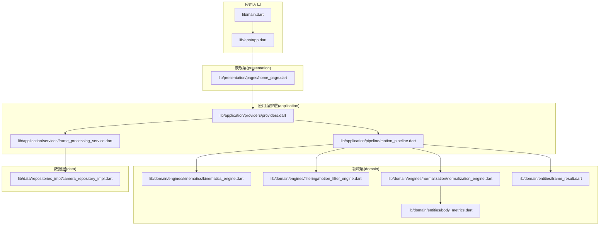
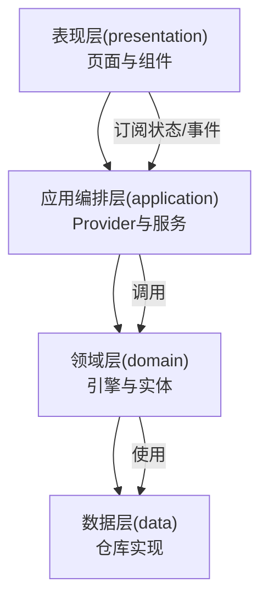
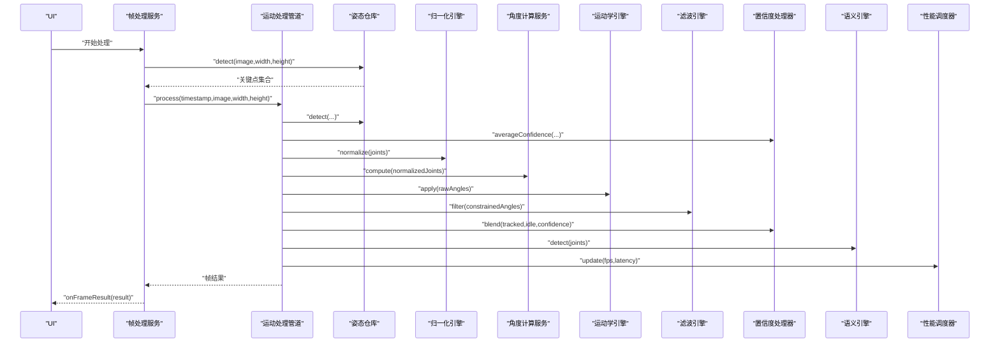
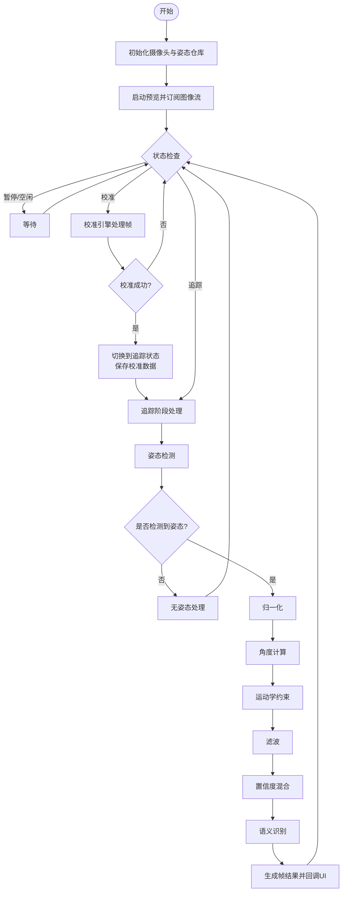
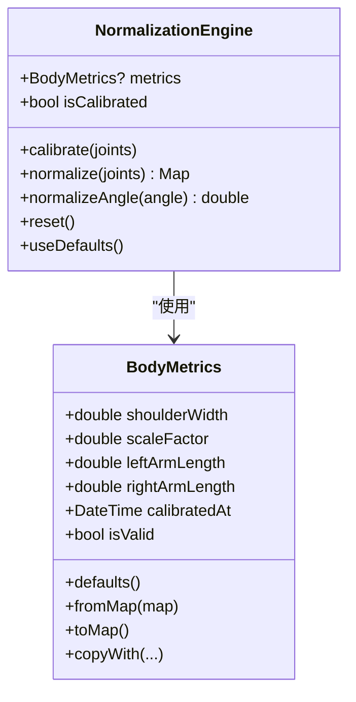
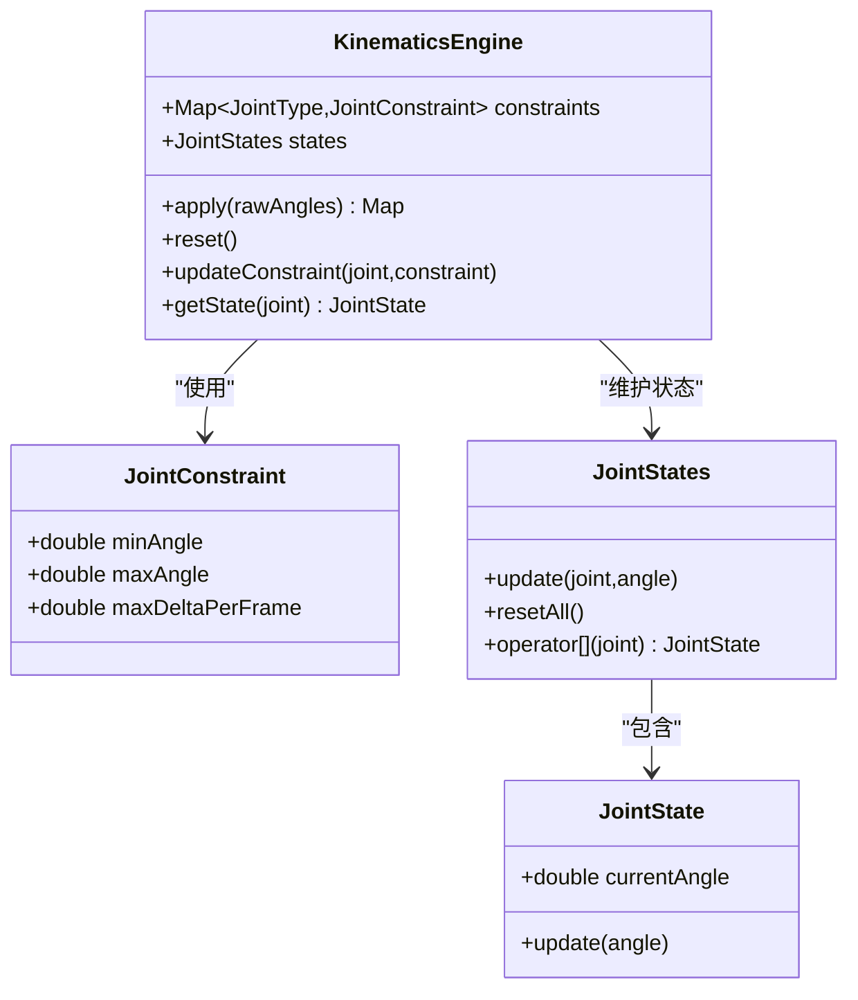
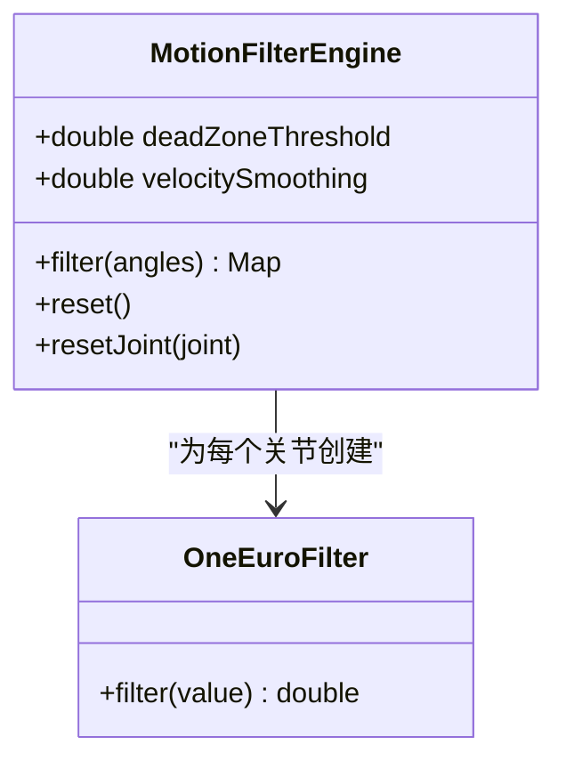
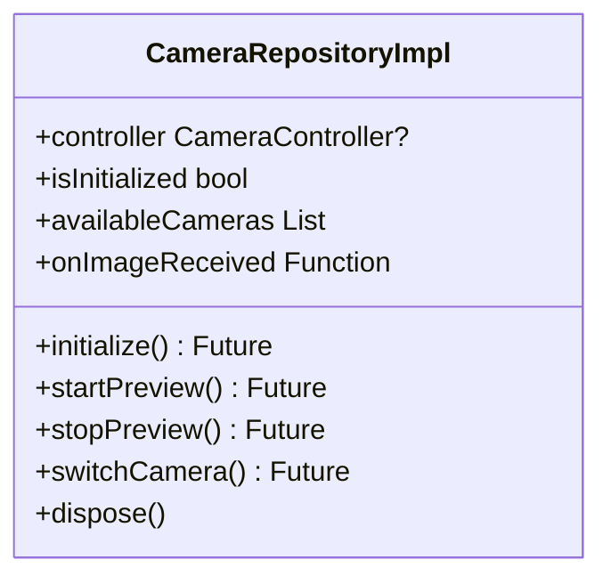
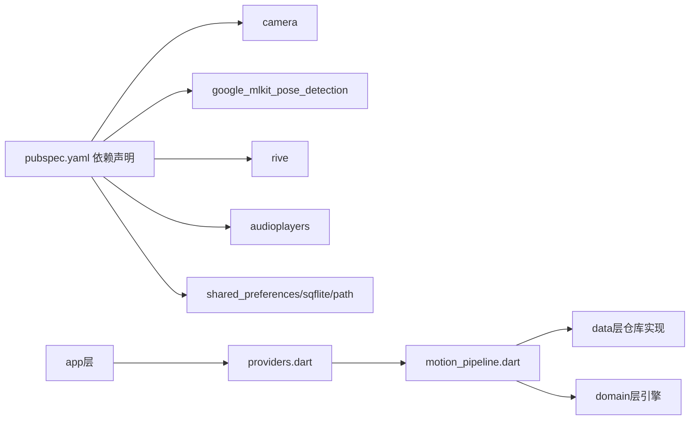

# 新功能开发指南

<cite>
**本文档引用的文件**
- [lib/main.dart](file://lib/main.dart)
- [pubspec.yaml](file://pubspec.yaml)
- [lib/app/app.dart](file://lib/app/app.dart)
- [lib/application/providers/providers.dart](file://lib/application/providers/providers.dart)
- [lib/application/pipeline/motion_pipeline.dart](file://lib/application/pipeline/motion_pipeline.dart)
- [lib/application/services/frame_processing_service.dart](file://lib/application/services/frame_processing_service.dart)
- [lib/domain/engines/kinematics/kinematics_engine.dart](file://lib/domain/engines/kinematics/kinematics_engine.dart)
- [lib/domain/engines/filtering/motion_filter_engine.dart](file://lib/domain/engines/filtering/motion_filter_engine.dart)
- [lib/domain/engines/normalization/normalization_engine.dart](file://lib/domain/engines/normalization/normalization_engine.dart)
- [lib/data/repositories_impl/camera_repository_impl.dart](file://lib/data/repositories_impl/camera_repository_impl.dart)
- [lib/domain/entities/frame_result.dart](file://lib/domain/entities/frame_result.dart)
- [lib/domain/entities/body_metrics.dart](file://lib/domain/entities/body_metrics.dart)
- [lib/presentation/pages/home_page.dart](file://lib/presentation/pages/home_page.dart)
- [test/widget_test.dart](file://test/widget_test.dart)
</cite>

## 目录
1. [简介](#简介)
2. [项目结构](#项目结构)
3. [核心组件](#核心组件)
4. [架构总览](#架构总览)
5. [详细组件分析](#详细组件分析)
6. [依赖关系分析](#依赖关系分析)
7. [性能考虑](#性能考虑)
8. [故障排查指南](#故障排查指南)
9. [结论](#结论)
10. [附录](#附录)

## 简介
本指南面向在Mimo项目中新增功能的开发者，系统讲解从需求分析到实现部署的完整流程，并基于Clean Architecture分层模型，给出新功能模块的落地步骤、设计原则、测试策略、与现有运动处理管道的集成方式、模板与示例路径、常见问题与解决方案，以及文档编写与代码审查流程。

## 项目结构
Mimo采用Clean Architecture分层组织，核心目录与职责如下：
- lib/app：应用入口与顶层封装
- lib/application：应用编排层（Provider、Pipeline、服务）
- lib/domain：领域模型与引擎（运动学、滤波、归一化、语义等）
- lib/data：数据访问层（仓库实现）
- lib/presentation：UI层（页面与组件）
- lib/main.dart：应用启动入口
- pubspec.yaml：依赖与资源声明

图表来源
- [lib/main.dart:1-34](file://lib/main.dart#L1-L34)
- [lib/app/app.dart:1-27](file://lib/app/app.dart#L1-L27)
- [lib/application/providers/providers.dart:1-103](file://lib/application/providers/providers.dart#L1-L103)
- [lib/application/pipeline/motion_pipeline.dart:1-141](file://lib/application/pipeline/motion_pipeline.dart#L1-L141)
- [lib/application/services/frame_processing_service.dart:1-254](file://lib/application/services/frame_processing_service.dart#L1-L254)
- [lib/domain/engines/kinematics/kinematics_engine.dart:1-95](file://lib/domain/engines/kinematics/kinematics_engine.dart#L1-L95)
- [lib/domain/engines/filtering/motion_filter_engine.dart:1-117](file://lib/domain/engines/filtering/motion_filter_engine.dart#L1-L117)
- [lib/domain/engines/normalization/normalization_engine.dart:1-143](file://lib/domain/engines/normalization/normalization_engine.dart#L1-L143)
- [lib/data/repositories_impl/camera_repository_impl.dart:1-97](file://lib/data/repositories_impl/camera_repository_impl.dart#L1-L97)
- [lib/domain/entities/frame_result.dart:1-93](file://lib/domain/entities/frame_result.dart#L1-L93)
- [lib/domain/entities/body_metrics.dart:1-109](file://lib/domain/entities/body_metrics.dart#L1-L109)
- [lib/presentation/pages/home_page.dart:1-215](file://lib/presentation/pages/home_page.dart#L1-L215)

章节来源
- [lib/main.dart:1-34](file://lib/main.dart#L1-L34)
- [pubspec.yaml:1-80](file://pubspec.yaml#L1-L80)

## 核心组件
- 应用入口与路由：应用通过主入口初始化Provider作用域，并定义页面路由；应用入口封装为独立组件以便扩展。
- Provider体系：集中定义各仓库、引擎、服务与状态Provider，统一注入到Pipeline与UI。
- 运动处理管道：MotionPipeline串联姿态检测、置信度处理、归一化、角度计算、运动学约束、滤波、语义识别与性能统计。
- 帧处理服务：连接摄像头与姿态检测，驱动Pipeline并输出帧结果，负责状态机与FPS统计。
- 领域引擎：包含运动学约束、滤波策略、人体归一化等，确保动作符合生物力学与平滑性。
- 数据仓库：摄像头仓库实现设备初始化、图像流订阅与切换相机等能力。
- UI页面：主页承载摄像头预览、安全框叠加与Rive角色层，并展示FPS与校准引导。

章节来源
- [lib/app/app.dart:1-27](file://lib/app/app.dart#L1-L27)
- [lib/application/providers/providers.dart:1-103](file://lib/application/providers/providers.dart#L1-L103)
- [lib/application/pipeline/motion_pipeline.dart:1-141](file://lib/application/pipeline/motion_pipeline.dart#L1-L141)
- [lib/application/services/frame_processing_service.dart:1-254](file://lib/application/services/frame_processing_service.dart#L1-L254)
- [lib/domain/engines/kinematics/kinematics_engine.dart:1-95](file://lib/domain/engines/kinematics/kinematics_engine.dart#L1-L95)
- [lib/domain/engines/filtering/motion_filter_engine.dart:1-117](file://lib/domain/engines/filtering/motion_filter_engine.dart#L1-L117)
- [lib/domain/engines/normalization/normalization_engine.dart:1-143](file://lib/domain/engines/normalization/normalization_engine.dart#L1-L143)
- [lib/data/repositories_impl/camera_repository_impl.dart:1-97](file://lib/data/repositories_impl/camera_repository_impl.dart#L1-L97)
- [lib/domain/entities/frame_result.dart:1-93](file://lib/domain/entities/frame_result.dart#L1-L93)
- [lib/presentation/pages/home_page.dart:1-215](file://lib/presentation/pages/home_page.dart#L1-L215)

## 架构总览
下图展示了新功能开发时应遵循的Clean Architecture分层与交互关系，强调“依赖倒置”和“向上层暴露抽象”的原则。

图表来源
- [lib/application/providers/providers.dart:1-103](file://lib/application/providers/providers.dart#L1-L103)
- [lib/application/pipeline/motion_pipeline.dart:1-141](file://lib/application/pipeline/motion_pipeline.dart#L1-L141)
- [lib/application/services/frame_processing_service.dart:1-254](file://lib/application/services/frame_processing_service.dart#L1-L254)
- [lib/domain/engines/kinematics/kinematics_engine.dart:1-95](file://lib/domain/engines/kinematics/kinematics_engine.dart#L1-L95)
- [lib/domain/engines/filtering/motion_filter_engine.dart:1-117](file://lib/domain/engines/filtering/motion_filter_engine.dart#L1-L117)
- [lib/domain/engines/normalization/normalization_engine.dart:1-143](file://lib/domain/engines/normalization/normalization_engine.dart#L1-L143)
- [lib/data/repositories_impl/camera_repository_impl.dart:1-97](file://lib/data/repositories_impl/camera_repository_impl.dart#L1-L97)
- [lib/presentation/pages/home_page.dart:1-215](file://lib/presentation/pages/home_page.dart#L1-L215)

## 详细组件分析

### 运动处理管道（MotionPipeline）分析
MotionPipeline是编排层的核心，负责串联各引擎与仓库，形成完整的姿态处理流水线。其处理步骤包括：姿态检测、置信度计算、归一化、角度计算、运动学约束、滤波、置信度混合、语义识别与性能统计。

图表来源
- [lib/application/services/frame_processing_service.dart:108-216](file://lib/application/services/frame_processing_service.dart#L108-L216)
- [lib/application/pipeline/motion_pipeline.dart:53-130](file://lib/application/pipeline/motion_pipeline.dart#L53-L130)
- [lib/domain/engines/normalization/normalization_engine.dart:72-113](file://lib/domain/engines/normalization/normalization_engine.dart#L72-L113)
- [lib/domain/engines/kinematics/kinematics_engine.dart:31-53](file://lib/domain/engines/kinematics/kinematics_engine.dart#L31-L53)
- [lib/domain/engines/filtering/motion_filter_engine.dart:23-48](file://lib/domain/engines/filtering/motion_filter_engine.dart#L23-L48)
- [lib/domain/engines/confidence/confidence_processor.dart](file://lib/domain/engines/confidence/confidence_processor.dart)
- [lib/domain/engines/semantic/semantic_engine.dart](file://lib/domain/engines/semantic/semantic_engine.dart)

章节来源
- [lib/application/pipeline/motion_pipeline.dart:1-141](file://lib/application/pipeline/motion_pipeline.dart#L1-L141)
- [lib/application/services/frame_processing_service.dart:1-254](file://lib/application/services/frame_processing_service.dart#L1-L254)

### 帧处理服务（FrameProcessingService）分析
FrameProcessingService负责连接摄像头与姿态检测，驱动Pipeline并输出帧结果。它维护状态机（空闲/校准/追踪/暂停），并在追踪阶段执行完整的处理链路。

图表来源
- [lib/application/services/frame_processing_service.dart:70-248](file://lib/application/services/frame_processing_service.dart#L70-L248)
- [lib/domain/engines/normalization/normalization_engine.dart:72-113](file://lib/domain/engines/normalization/normalization_engine.dart#L72-L113)
- [lib/domain/engines/kinematics/kinematics_engine.dart:31-53](file://lib/domain/engines/kinematics/kinematics_engine.dart#L31-L53)
- [lib/domain/engines/filtering/motion_filter_engine.dart:23-48](file://lib/domain/engines/filtering/motion_filter_engine.dart#L23-L48)
- [lib/domain/engines/confidence/confidence_processor.dart](file://lib/domain/engines/confidence/confidence_processor.dart)
- [lib/domain/engines/semantic/semantic_engine.dart](file://lib/domain/engines/semantic/semantic_engine.dart)

章节来源
- [lib/application/services/frame_processing_service.dart:1-254](file://lib/application/services/frame_processing_service.dart#L1-L254)

### 人体归一化引擎（NormalizationEngine）分析
NormalizationEngine负责消除不同用户体型差异，通过肩宽与缩放因子对关键点与角度进行归一化，支持默认值与重置。

图表来源
- [lib/domain/engines/normalization/normalization_engine.dart:1-143](file://lib/domain/engines/normalization/normalization_engine.dart#L1-L143)
- [lib/domain/entities/body_metrics.dart:1-109](file://lib/domain/entities/body_metrics.dart#L1-L109)

章节来源
- [lib/domain/engines/normalization/normalization_engine.dart:1-143](file://lib/domain/engines/normalization/normalization_engine.dart#L1-L143)
- [lib/domain/entities/body_metrics.dart:1-109](file://lib/domain/entities/body_metrics.dart#L1-L109)

### 运动学引擎（KinematicsEngine）分析
运动学引擎对关节角度施加范围与单帧变化量约束，结合状态机避免突变，保证动作符合人体生物力学。

图表来源
- [lib/domain/engines/kinematics/kinematics_engine.dart:1-95](file://lib/domain/engines/kinematics/kinematics_engine.dart#L1-L95)

章节来源
- [lib/domain/engines/kinematics/kinematics_engine.dart:1-95](file://lib/domain/engines/kinematics/kinematics_engine.dart#L1-L95)

### 滤波引擎（MotionFilterEngine）分析
滤波引擎组合死区过滤、One Euro滤波与速度平滑，减少噪声与抖动，提升轨迹稳定性。

图表来源
- [lib/domain/engines/filtering/motion_filter_engine.dart:1-117](file://lib/domain/engines/filtering/motion_filter_engine.dart#L1-L117)

章节来源
- [lib/domain/engines/filtering/motion_filter_engine.dart:1-117](file://lib/domain/engines/filtering/motion_filter_engine.dart#L1-L117)

### 摄像头仓库（CameraRepositoryImpl）分析
摄像头仓库实现设备发现、控制器初始化、图像流订阅与切换相机等能力，向上层暴露统一接口。

图表来源
- [lib/data/repositories_impl/camera_repository_impl.dart:1-97](file://lib/data/repositories_impl/camera_repository_impl.dart#L1-L97)

章节来源
- [lib/data/repositories_impl/camera_repository_impl.dart:1-97](file://lib/data/repositories_impl/camera_repository_impl.dart#L1-L97)

## 依赖关系分析
- 依赖倒置：UI仅依赖Provider抽象，Provider再注入具体实现；Pipeline依赖抽象仓库与引擎，便于替换与测试。
- Provider集中管理：通过providers.dart统一注册与注入，降低耦合度。
- 外部依赖：摄像头、ML Kit、River、音频播放、本地存储等通过pubspec.yaml声明。

图表来源
- [pubspec.yaml:30-60](file://pubspec.yaml#L30-L60)
- [lib/application/providers/providers.dart:1-103](file://lib/application/providers/providers.dart#L1-L103)
- [lib/application/pipeline/motion_pipeline.dart:1-141](file://lib/application/pipeline/motion_pipeline.dart#L1-L141)

章节来源
- [pubspec.yaml:1-80](file://pubspec.yaml#L1-L80)
- [lib/application/providers/providers.dart:1-103](file://lib/application/providers/providers.dart#L1-L103)

## 性能考虑
- Pipeline内部包含多步处理，需关注每步耗时与整体延迟；建议在Pipeline中记录处理耗时并更新FPS。
- 滤波与运动学约束会引入状态缓存，注意在重置时清理状态，避免状态泄漏。
- 摄像头图像流与UI渲染需协调，避免阻塞主线程；可利用异步处理与状态订阅机制。
- 归一化与角度计算涉及数学运算，建议在不影响实时性的前提下优化常量与阈值。

## 故障排查指南
- 无姿态检测：检查摄像头初始化与权限，确认图像流回调是否触发；在Pipeline中增加空结果分支处理。
- 校准失败：确认T-Pose关键点是否完整，校准数据是否保存与加载；在UI层显示明确提示。
- FPS过低：检查滤波参数、归一化与语义识别的复杂度；必要时降低分辨率或启用性能调度。
- 状态异常：确认状态机转换逻辑（空闲/校准/追踪/暂停）与Provider状态同步。

章节来源
- [lib/application/services/frame_processing_service.dart:108-216](file://lib/application/services/frame_processing_service.dart#L108-L216)
- [lib/application/pipeline/motion_pipeline.dart:53-130](file://lib/application/pipeline/motion_pipeline.dart#L53-L130)
- [lib/presentation/pages/home_page.dart:148-209](file://lib/presentation/pages/home_page.dart#L148-L209)

## 结论
通过遵循Clean Architecture分层与依赖倒置原则，新功能可在不破坏现有稳定性的前提下快速迭代。建议优先在domain层定义清晰的接口与实体，在application层编排逻辑并通过Provider注入，在data层实现具体仓库，在presentation层以UI组件消费状态与事件。配合完善的测试与性能监控，可确保新功能高质量交付。

## 附录

### 新功能开发流程（从需求到部署）
- 需求分析：明确业务目标、输入输出、性能指标与边界条件。
- 设计阶段：确定新增模块属于哪一层，定义接口与实体，评估对现有Pipeline的影响。
- 实现阶段：在domain层实现引擎/实体，在data层实现仓库，在application层通过Provider接入，在presentation层消费状态。
- 集成测试：在FrameProcessingService与MotionPipeline中验证端到端流程，确保状态机与回调正常。
- 性能验证：监控FPS、延迟与内存占用，必要时优化算法或参数。
- 文档与评审：编写设计文档与变更说明，提交代码审查，确保可维护性与一致性。

### Clean Architecture分层添加新功能模块步骤
- 在domain层新增引擎或实体，定义对外接口与行为契约。
- 在data层实现对应仓库，封装外部依赖（如网络、数据库、硬件）。
- 在application层通过Provider注册与注入，必要时扩展MotionPipeline或FrameProcessingService。
- 在presentation层新增页面或组件，订阅Provider状态并响应用户交互。
- 在pubspec.yaml中添加必要的依赖项与资源。

### 测试策略与验证方法
- 单元测试：针对引擎与实体的纯函数与状态逻辑进行断言。
- 集成测试：模拟Pipeline与仓库交互，验证数据流转与错误处理。
- UI测试：使用WidgetTester验证页面渲染与交互，参考现有测试样例。
- 性能测试：测量FPS、延迟与内存峰值，确保满足实时性要求。

章节来源
- [test/widget_test.dart:1-31](file://test/widget_test.dart#L1-L31)

### 与现有运动处理管道的集成要点
- 通过Provider注入新引擎或服务，确保依赖可见且可替换。
- 在MotionPipeline中新增处理步骤或扩展现有步骤，保持顺序与数据类型一致。
- 在FrameProcessingService中根据状态机调用新逻辑，避免阻塞图像流。
- 通过FrameResult扩展字段或新增实体，确保UI层可消费新数据。

### 模板与示例（代码片段路径）
- Provider注册模板：[lib/application/providers/providers.dart:71-83](file://lib/application/providers/providers.dart#L71-L83)
- Pipeline处理步骤模板：[lib/application/pipeline/motion_pipeline.dart:53-130](file://lib/application/pipeline/motion_pipeline.dart#L53-L130)
- 帧处理服务状态机模板：[lib/application/services/frame_processing_service.dart:108-216](file://lib/application/services/frame_processing_service.dart#L108-L216)
- 归一化引擎使用模板：[lib/domain/engines/normalization/normalization_engine.dart:72-113](file://lib/domain/engines/normalization/normalization_engine.dart#L72-L113)
- 运动学引擎使用模板：[lib/domain/engines/kinematics/kinematics_engine.dart:31-53](file://lib/domain/engines/kinematics/kinematics_engine.dart#L31-L53)
- 滤波引擎使用模板：[lib/domain/engines/filtering/motion_filter_engine.dart:23-48](file://lib/domain/engines/filtering/motion_filter_engine.dart#L23-L48)
- 摄像头仓库使用模板：[lib/data/repositories_impl/camera_repository_impl.dart:19-61](file://lib/data/repositories_impl/camera_repository_impl.dart#L19-L61)
- UI页面消费状态模板：[lib/presentation/pages/home_page.dart:38-88](file://lib/presentation/pages/home_page.dart#L38-L88)

### 常见问题与解决方案
- 问题：新功能导致FPS下降
  - 解决：优化算法参数、减少不必要的计算、启用性能调度器
- 问题：新引擎状态未重置
  - 解决：在Pipeline的reset中调用新引擎的reset方法
- 问题：UI不更新
  - 解决：确保Provider状态变更后触发UI重建，检查状态订阅
- 问题：跨平台兼容性
  - 解决：在pubspec.yaml中声明平台依赖，使用条件导入与平台适配

### 文档编写与代码审查流程
- 文档：包含设计思路、接口定义、数据流图、性能指标与回滚方案
- 代码审查：关注分层清晰度、依赖倒置、错误处理、可测试性与命名规范
- 回归测试：确保新功能不影响现有Pipeline与UI交互