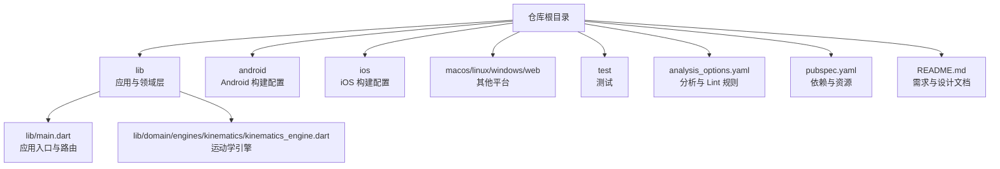
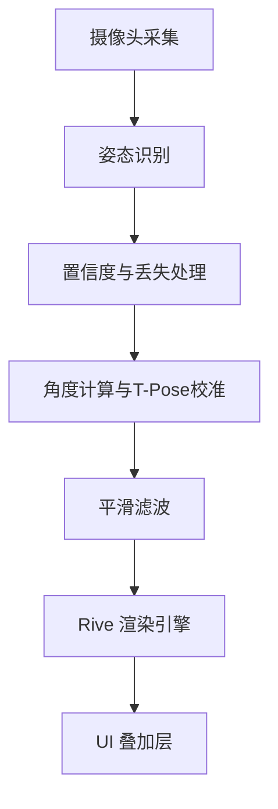
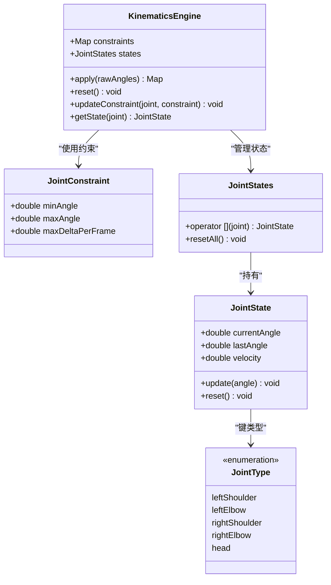
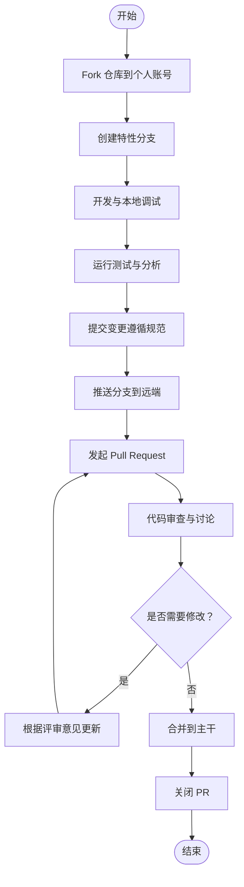
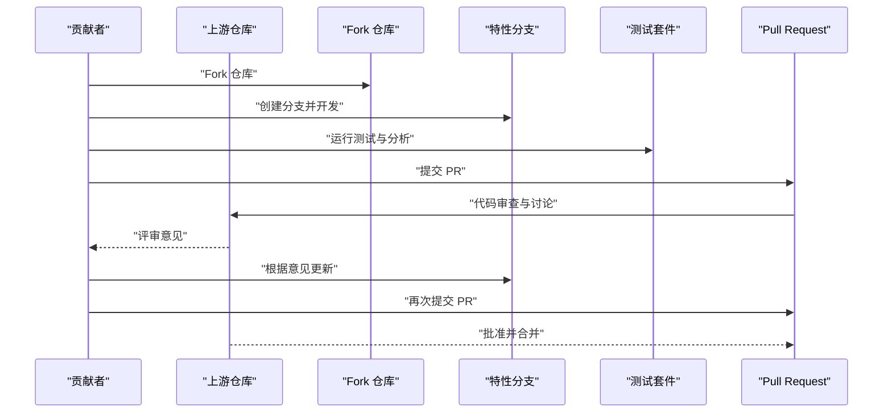
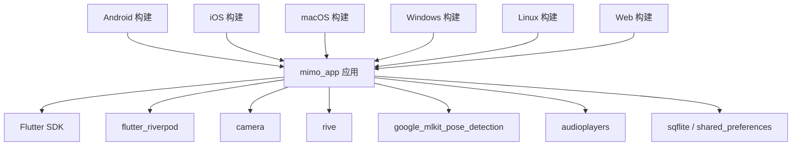

# 社区贡献

<cite>
**本文引用的文件**   
- [README.md](file://README.md)
- [analysis_options.yaml](file://analysis_options.yaml)
- [pubspec.yaml](file://pubspec.yaml)
- [lib/main.dart](file://lib/main.dart)
- [test/widget_test.dart](file://test/widget_test.dart)
- [android/app/build.gradle.kts](file://android/app/build.gradle.kts)
- [ios/Runner/AppDelegate.swift](file://ios/Runner/AppDelegate.swift)
- [lib/domain/engines/kinematics/kinematics_engine.dart](file://lib/domain/engines/kinematics/kinematics_engine.dart)
</cite>

## 目录
1. [简介](#简介)
2. [项目结构](#项目结构)
3. [核心组件](#核心组件)
4. [架构总览](#架构总览)
5. [详细组件分析](#详细组件分析)
6. [依赖关系分析](#依赖关系分析)
7. [性能考量](#性能考量)
8. [故障排查指南](#故障排查指南)
9. [结论](#结论)
10. [附录](#附录)

## 简介
本文件面向希望参与 Mimo（米莫）项目的社区贡献者，提供从 Fork 到 Pull Request 的完整流程说明，以及代码风格、质量标准、测试与代码审查、文档与翻译、Bug 报告与功能请求模板、社区行为准则与沟通规范、贡献者权益与认可机制、项目治理与决策流程等系统化指导。内容结合仓库现有配置与代码组织，帮助新老贡献者高效协作，共同打造高质量的跨平台动捕互动应用。

## 项目结构
Mimo 是一个基于 Flutter 的跨平台应用，包含移动端（Android/iOS/macOS/Linux/Windows/Web）与核心业务域（domain）模块。根目录下的关键位置如下：
- lib：应用入口与分层架构（application、core、data、domain、presentation、main.dart）
- android/ios/macos/linux/windows/web：各平台构建与配置
- test：基础 UI 测试示例
- analysis_options.yaml：静态分析与 Lint 规则
- pubspec.yaml：依赖与资源清单
- README.md：产品与技术需求文档（PRD）

图表来源
- [lib/main.dart:1-34](file://lib/main.dart#L1-L34)
- [android/app/build.gradle.kts:1-45](file://android/app/build.gradle.kts#L1-L45)
- [ios/Runner/AppDelegate.swift:1-14](file://ios/Runner/AppDelegate.swift#L1-L14)
- [analysis_options.yaml:1-29](file://analysis_options.yaml#L1-L29)
- [pubspec.yaml:1-80](file://pubspec.yaml#L1-L80)
- [README.md:1-800](file://README.md#L1-L800)
- [lib/domain/engines/kinematics/kinematics_engine.dart:1-95](file://lib/domain/engines/kinematics/kinematics_engine.dart#L1-L95)

章节来源
- [lib/main.dart:1-34](file://lib/main.dart#L1-L34)
- [android/app/build.gradle.kts:1-45](file://android/app/build.gradle.kts#L1-L45)
- [ios/Runner/AppDelegate.swift:1-14](file://ios/Runner/AppDelegate.swift#L1-L14)
- [analysis_options.yaml:1-29](file://analysis_options.yaml#L1-L29)
- [pubspec.yaml:1-80](file://pubspec.yaml#L1-L80)
- [README.md:1-800](file://README.md#L1-L800)

## 核心组件
- 应用入口与路由：应用通过 lib/main.dart 初始化并配置路由，包含校准页、主页与设置页。
- 运动学引擎：位于 lib/domain/engines/kinematics/kinematics_engine.dart，负责对原始角度施加生物力学约束、限制单帧变化量并更新状态，体现“动作驱动模型”与“稳定性工程”的关键实现。
- 构建与平台：android/app/build.gradle.kts 定义 Android 构建参数；ios/Runner/AppDelegate.swift 为 iOS 应用生命周期入口。
- 依赖与资源：pubspec.yaml 声明 Flutter SDK、第三方包与资源路径；analysis_options.yaml 启用 Flutter 推荐 Lint 规则。

章节来源
- [lib/main.dart:1-34](file://lib/main.dart#L1-L34)
- [lib/domain/engines/kinematics/kinematics_engine.dart:1-95](file://lib/domain/engines/kinematics/kinematics_engine.dart#L1-L95)
- [android/app/build.gradle.kts:1-45](file://android/app/build.gradle.kts#L1-L45)
- [ios/Runner/AppDelegate.swift:1-14](file://ios/Runner/AppDelegate.swift#L1-L14)
- [pubspec.yaml:1-80](file://pubspec.yaml#L1-L80)
- [analysis_options.yaml:1-29](file://analysis_options.yaml#L1-L29)

## 架构总览
Mimo 采用 Flutter 跨平台框架，结合 Riverpod 状态管理、camera 摄像头、google_mlkit 姿态识别、rive 动画渲染等技术栈。README.md 中提供了清晰的逻辑架构与数据流设计，强调“摄像头采集 → 姿态识别 → 置信度与丢失处理 → 角度计算与校准 → 平滑滤波 → Rive 渲染”的闭环。

图表来源
- [README.md:128-174](file://README.md#L128-L174)

章节来源
- [README.md:128-174](file://README.md#L128-L174)

## 详细组件分析

### 组件：运动学引擎（KinematicsEngine）
该组件负责对原始角度施加生物力学约束，限制角度范围与单帧变化量，并维护关节状态，是“动作驱动模型过于理想化”问题的解决方案之一。

图表来源
- [lib/domain/engines/kinematics/kinematics_engine.dart:1-95](file://lib/domain/engines/kinematics/kinematics_engine.dart#L1-L95)

章节来源
- [lib/domain/engines/kinematics/kinematics_engine.dart:1-95](file://lib/domain/engines/kinematics/kinematics_engine.dart#L1-L95)

### 流程：代码贡献从 Fork 到 PR（概念流程）
以下为通用贡献流程示意，适用于本项目：

说明
- 本图为概念流程，用于指导贡献者按步骤执行，不直接映射具体源码文件。

### 流程：一次典型的功能修复或特性开发（代码级序列）
以“修复置信度处理导致的动作卡顿”为例，展示从问题发现到 PR 合入的关键调用链。

说明
- 本图为概念流程，用于帮助贡献者理解从开发到合入的整体节奏。

## 依赖关系分析
- 语言与工具：Flutter SDK 版本由 pubspec.yaml 指定；analysis_options.yaml 启用 Flutter 推荐 Lint。
- 第三方库：Riverpod、camera、rive、google_mlkit_pose_detection、audioplayers、sqflite、shared_preferences 等。
- 平台构建：Android 使用 Gradle/Kotlin；iOS 使用 Swift；macOS/Linux/Windows/Web 由 Flutter 提供模板与配置。

图表来源
- [pubspec.yaml:30-67](file://pubspec.yaml#L30-L67)
- [android/app/build.gradle.kts:1-45](file://android/app/build.gradle.kts#L1-L45)
- [ios/Runner/AppDelegate.swift:1-14](file://ios/Runner/AppDelegate.swift#L1-L14)

章节来源
- [pubspec.yaml:1-80](file://pubspec.yaml#L1-L80)
- [android/app/build.gradle.kts:1-45](file://android/app/build.gradle.kts#L1-L45)
- [ios/Runner/AppDelegate.swift:1-14](file://ios/Runner/AppDelegate.swift#L1-L14)

## 性能考量
- 延迟与帧率：README.md 中明确了端到端延迟与推理帧率的目标，建议在低端设备上验证性能表现。
- 降采样与热管理：通过降低推理频率与释放摄像头资源等方式保障长时间运行稳定性。
- 平滑算法：One Euro Filter 为基础，建议结合速度滤波与死区策略进一步优化“跟手感”。

章节来源
- [README.md:75-91](file://README.md#L75-L91)
- [README.md:470-501](file://README.md#L470-L501)

## 故障排查指南
- 本地测试：使用 Flutter 测试框架运行基础 UI 测试，确保应用入口与路由正确。
- 静态分析：运行分析器检查潜在问题与 Lint 违规，确保代码风格统一。
- 平台构建：确认 Android/iOS 构建参数与依赖版本匹配，避免签名与兼容性问题。

章节来源
- [test/widget_test.dart:1-31](file://test/widget_test.dart#L1-L31)
- [analysis_options.yaml:1-29](file://analysis_options.yaml#L1-L29)
- [android/app/build.gradle.kts:1-45](file://android/app/build.gradle.kts#L1-L45)
- [ios/Runner/AppDelegate.swift:1-14](file://ios/Runner/AppDelegate.swift#L1-L14)

## 结论
本指导文档围绕 Mimo 项目的贡献流程、代码规范、测试与审查、文档与翻译、问题模板、行为准则与治理等方面提供了系统化建议。建议贡献者在提交前完成本地测试与静态分析，遵循统一的代码风格与命名约定，并通过 PR 流程进行充分的讨论与审查。对于涉及“动作驱动模型”“校准鲁棒性”“置信度处理”“平滑算法”等关键模块的改动，应参考 README.md 中的建议优先级与模块设计，确保体验与稳定性双达标。

## 附录

### 代码贡献流程（Fork 到 PR）
- Fork 仓库到个人账号
- 创建特性分支（建议以 issue 编号命名）
- 开发与本地调试（运行测试与分析）
- 提交变更（遵循 Lint 规则与命名约定）
- 推送分支并发起 PR
- 根据评审意见迭代更新
- 获得批准后合并

章节来源
- [analysis_options.yaml:1-29](file://analysis_options.yaml#L1-L29)
- [pubspec.yaml:1-80](file://pubspec.yaml#L1-L80)

### 代码风格与质量标准
- 遵循 Flutter 推荐 Lint 规则（analysis_options.yaml 已启用）
- 统一命名与注释规范，保持模块职责单一
- 对关键算法（如运动学约束、置信度处理）提供清晰注释与边界说明

章节来源
- [analysis_options.yaml:8-26](file://analysis_options.yaml#L8-L26)

### 测试与代码审查
- 使用 Flutter 测试框架编写与运行测试
- 运行静态分析器，修复警告与错误
- PR 需要至少一名维护者审查并通过

章节来源
- [test/widget_test.dart:1-31](file://test/widget_test.dart#L1-L31)
- [analysis_options.yaml:1-29](file://analysis_options.yaml#L1-L29)

### 文档贡献与翻译
- 文档以 Markdown 维护，遵循统一标题层级与语言规范
- 翻译工作需保持术语一致性与上下文连贯性
- 新增或修改文档需配合示例与截图说明

### Bug 报告模板
- 标题：简述问题现象
- 环境：操作系统、设备型号、Flutter 版本
- 复现步骤：最小可复现步骤
- 预期结果：期望行为
- 实际结果：实际行为
- 日志与截图：必要时附上

### 功能请求模板
- 标题：功能名称
- 背景：为什么需要此功能
- 描述：功能目标与使用场景
- 参考：可参考的竞品或实现思路
- 优先级：P0/P1/P2

### 社区行为准则与沟通规范
- 尊重与包容：营造开放友好的讨论氛围
- 基于事实：提供可验证的信息与证据
- 积极反馈：建设性地提出修改意见
- 遵守法律与伦理：不传播不当内容

### 贡献者权益与认可机制
- 代码贡献记录：通过 PR 与提交历史追踪
- 证书与致谢：在发布说明或 README 中列出主要贡献者
- 社区活动：邀请参与线上/线下活动与技术分享

### 项目治理与决策流程
- 决策主体：核心维护者与主要贡献者
- 决策方式：公开讨论、投票或多数同意
- 变更流程：Issue → PR → 代码审查 → 合并 → 发布