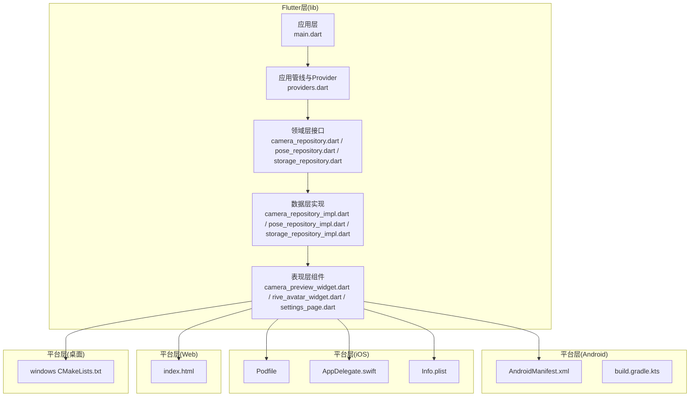
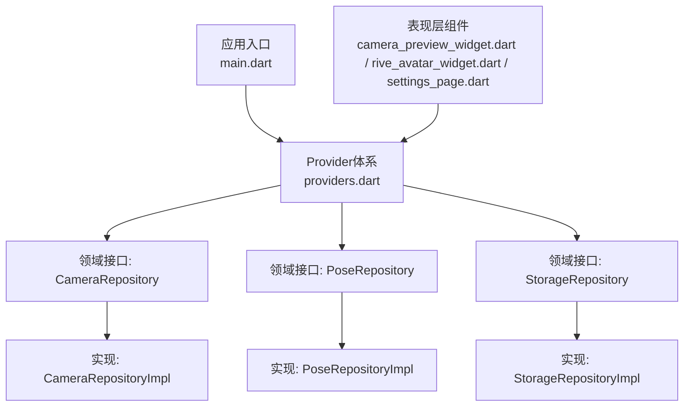
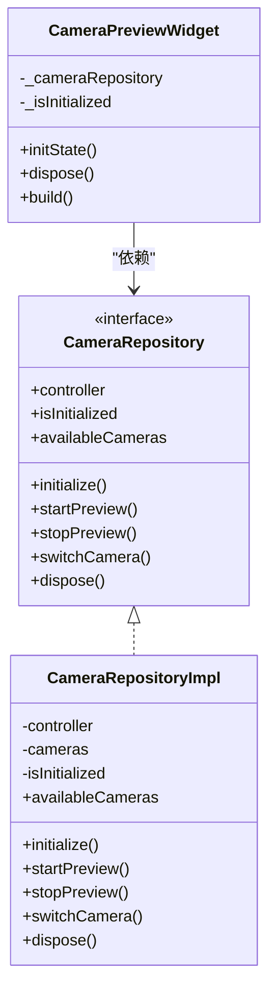
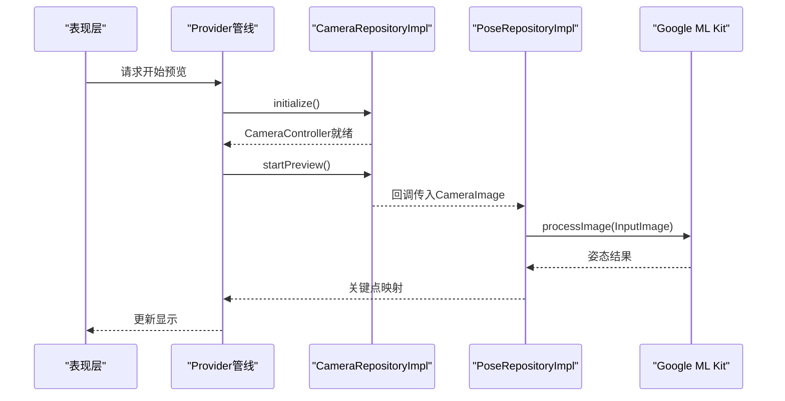
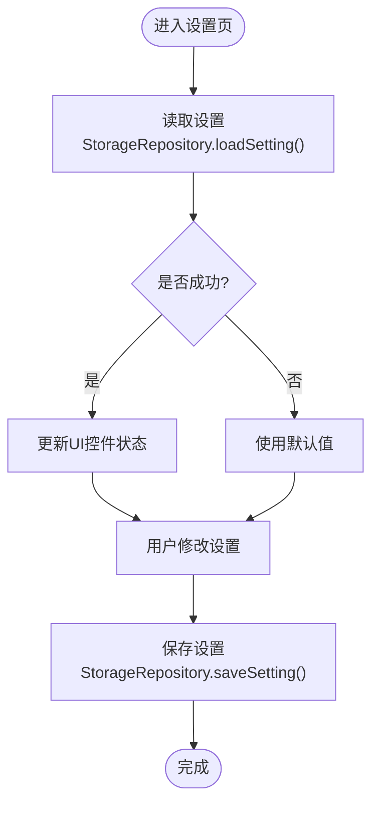
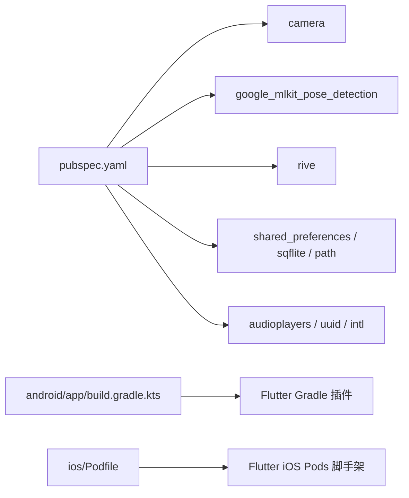

# 第三方集成

<cite>
**本文引用的文件**
- [pubspec.yaml](file://pubspec.yaml)
- [main.dart](file://lib/main.dart)
- [providers.dart](file://lib/application/providers/providers.dart)
- [camera_repository.dart](file://lib/domain/repositories/camera_repository.dart)
- [camera_repository_impl.dart](file://lib/data/repositories_impl/camera_repository_impl.dart)
- [camera_preview_widget.dart](file://lib/presentation/widgets/camera_preview_widget.dart)
- [pose_repository.dart](file://lib/domain/repositories/pose_repository.dart)
- [pose_repository_impl.dart](file://lib/data/repositories_impl/pose_repository_impl.dart)
- [storage_repository.dart](file://lib/domain/repositories/storage_repository.dart)
- [storage_repository_impl.dart](file://lib/data/repositories_impl/storage_repository_impl.dart)
- [settings_page.dart](file://lib/presentation/pages/settings_page.dart)
- [rive_avatar_widget.dart](file://lib/presentation/widgets/rive_avatar_widget.dart)
- [AndroidManifest.xml](file://android/app/src/main/AndroidManifest.xml)
- [build.gradle.kts](file://android/app/build.gradle.kts)
- [Podfile](file://ios/Podfile)
- [AppDelegate.swift](file://ios/Runner/AppDelegate.swift)
- [Info.plist](file://ios/Runner/Info.plist)
- [index.html](file://web/index.html)
- [windows CMakeLists.txt](file://windows/CMakeLists.txt)
</cite>

## 目录
1. [简介](#简介)
2. [项目结构](#项目结构)
3. [核心组件](#核心组件)
4. [架构总览](#架构总览)
5. [详细组件分析](#详细组件分析)
6. [依赖分析](#依赖分析)
7. [性能考量](#性能考量)
8. [故障排除指南](#故障排除指南)
9. [结论](#结论)
10. [附录](#附录)

## 简介
本文件面向Mimo项目的第三方集成与扩展，系统性说明如何在Flutter多端（Android、iOS、Web、macOS、Windows）环境中引入新库与SDK，涵盖依赖管理最佳实践、版本控制策略、平台特定集成方法、配置与初始化流程、安全与权限管理、测试与验证方法、故障排除以及文档维护流程，并给出性能影响与优化建议。

## 项目结构
Mimo采用Flutter多端统一代码库，按领域驱动设计分层组织：lib下包含应用、领域、数据、表现等层次；android/与ios/分别承载原生Android与iOS工程；web/承载Web端入口；linux/macos/windows为桌面端支持。第三方库主要通过pubspec.yaml声明，Android通过Gradle/Kotlin DSL管理，iOS通过CocoaPods管理。

图表来源
- [main.dart:1-34](file://lib/main.dart#L1-L34)
- [providers.dart:1-103](file://lib/application/providers/providers.dart#L1-L103)
- [camera_repository.dart:1-28](file://lib/domain/repositories/camera_repository.dart#L1-L28)
- [camera_repository_impl.dart:1-97](file://lib/data/repositories_impl/camera_repository_impl.dart#L1-L97)
- [pose_repository.dart:1-23](file://lib/domain/repositories/pose_repository.dart#L1-L23)
- [pose_repository_impl.dart:1-204](file://lib/data/repositories_impl/pose_repository_impl.dart#L1-L204)
- [storage_repository.dart:1-19](file://lib/domain/repositories/storage_repository.dart#L1-L19)
- [storage_repository_impl.dart:41-115](file://lib/data/repositories_impl/storage_repository_impl.dart#L41-L115)
- [camera_preview_widget.dart:1-49](file://lib/presentation/widgets/camera_preview_widget.dart#L1-L49)
- [rive_avatar_widget.dart:1-118](file://lib/presentation/widgets/rive_avatar_widget.dart#L1-L118)
- [settings_page.dart:1-284](file://lib/presentation/pages/settings_page.dart#L1-L284)
- [AndroidManifest.xml:1-46](file://android/app/src/main/AndroidManifest.xml#L1-L46)
- [build.gradle.kts:1-45](file://android/app/build.gradle.kts#L1-L45)
- [Podfile:1-44](file://ios/Podfile#L1-L44)
- [AppDelegate.swift:1-14](file://ios/Runner/AppDelegate.swift#L1-L14)
- [Info.plist:1-50](file://ios/Runner/Info.plist#L1-L50)
- [index.html:1-39](file://web/index.html#L1-L39)
- [windows CMakeLists.txt:1-109](file://windows/CMakeLists.txt#L1-L109)

章节来源
- [pubspec.yaml:1-80](file://pubspec.yaml#L1-L80)
- [main.dart:1-34](file://lib/main.dart#L1-L34)
- [providers.dart:1-103](file://lib/application/providers/providers.dart#L1-L103)

## 核心组件
- 依赖声明与版本管理：通过pubspec.yaml集中声明Flutter/Dart依赖，遵循语义化版本，优先锁定关键路径依赖版本，避免自动升级带来的破坏性变更。
- Provider体系：以Riverpod为核心的状态与依赖注入容器，将各仓库与引擎以Provider形式注入，便于测试替换与解耦。
- 领域抽象：以接口定义（如CameraRepository、PoseRepository、StorageRepository）隔离具体实现，便于替换第三方SDK或适配不同平台。
- 平台桥接：Android通过AndroidManifest.xml声明权限与能力；iOS通过Info.plist与Podfile管理；Web通过index.html与manifest.json；桌面端通过CMakeLists与生成脚本。

章节来源
- [pubspec.yaml:30-67](file://pubspec.yaml#L30-L67)
- [providers.dart:16-83](file://lib/application/providers/providers.dart#L16-L83)
- [camera_repository.dart:1-28](file://lib/domain/repositories/camera_repository.dart#L1-L28)
- [pose_repository.dart:1-23](file://lib/domain/repositories/pose_repository.dart#L1-L23)
- [storage_repository.dart:1-19](file://lib/domain/repositories/storage_repository.dart#L1-L19)

## 架构总览
Mimo的第三方集成遵循“接口抽象—实现注入—平台桥接”的三层架构。Flutter层通过Provider组合各仓库与引擎；数据层实现对接具体SDK（如camera、google_mlkit_pose_detection、rive、shared_preferences等）；平台层负责原生能力注册与配置。

图表来源
- [main.dart:1-34](file://lib/main.dart#L1-L34)
- [providers.dart:16-83](file://lib/application/providers/providers.dart#L16-L83)
- [camera_repository.dart:1-28](file://lib/domain/repositories/camera_repository.dart#L1-L28)
- [camera_repository_impl.dart:1-97](file://lib/data/repositories_impl/camera_repository_impl.dart#L1-L97)
- [pose_repository.dart:1-23](file://lib/domain/repositories/pose_repository.dart#L1-L23)
- [pose_repository_impl.dart:1-204](file://lib/data/repositories_impl/pose_repository_impl.dart#L1-L204)
- [storage_repository.dart:1-19](file://lib/domain/repositories/storage_repository.dart#L1-L19)
- [storage_repository_impl.dart:41-115](file://lib/data/repositories_impl/storage_repository_impl.dart#L41-L115)

## 详细组件分析

### 摄像头集成（camera）
- 依赖声明：在pubspec.yaml中声明camera依赖，确保版本稳定。
- 接口与实现：通过CameraRepository接口抽象，CameraRepositoryImpl封装CameraController生命周期与图像流回调。
- 表现层使用：CameraPreviewWidget通过Provider读取CameraRepository，初始化并展示预览。
- 平台集成：Android通过AndroidManifest.xml声明查询能力；iOS通过Info.plist声明应用信息；桌面端由Flutter SDK与CMake管理。

图表来源
- [camera_repository.dart:1-28](file://lib/domain/repositories/camera_repository.dart#L1-L28)
- [camera_repository_impl.dart:1-97](file://lib/data/repositories_impl/camera_repository_impl.dart#L1-L97)
- [camera_preview_widget.dart:1-49](file://lib/presentation/widgets/camera_preview_widget.dart#L1-L49)

章节来源
- [pubspec.yaml:40-42](file://pubspec.yaml#L40-L42)
- [camera_repository.dart:1-28](file://lib/domain/repositories/camera_repository.dart#L1-L28)
- [camera_repository_impl.dart:19-82](file://lib/data/repositories_impl/camera_repository_impl.dart#L19-L82)
- [camera_preview_widget.dart:20-35](file://lib/presentation/widgets/camera_preview_widget.dart#L20-L35)
- [AndroidManifest.xml:34-44](file://android/app/src/main/AndroidManifest.xml#L34-L44)
- [windows CMakeLists.txt:48-58](file://windows/CMakeLists.txt#L48-L58)

### 姿态检测集成（google_mlkit_pose_detection）
- 依赖声明：在pubspec.yaml中声明google_mlkit_pose_detection依赖。
- 接口与实现：PoseRepository接口抽象检测流程；PoseRepositoryImpl封装PoseDetector初始化、输入图像转换、检测执行与结果映射。
- 数据流：上游通过CameraRepositoryImpl的图像流回调传递给检测实现，下游通过Provider链路输出到表现层。

图表来源
- [providers.dart:72-83](file://lib/application/providers/providers.dart#L72-L83)
- [camera_repository_impl.dart:50-54](file://lib/data/repositories_impl/camera_repository_impl.dart#L50-L54)
- [pose_repository_impl.dart:38-71](file://lib/data/repositories_impl/pose_repository_impl.dart#L38-L71)

章节来源
- [pubspec.yaml:46-47](file://pubspec.yaml#L46-L47)
- [pose_repository.dart:1-23](file://lib/domain/repositories/pose_repository.dart#L1-L23)
- [pose_repository_impl.dart:10-31](file://lib/data/repositories_impl/pose_repository_impl.dart#L10-L31)
- [pose_repository_impl.dart:38-71](file://lib/data/repositories_impl/pose_repository_impl.dart#L38-L71)

### 本地存储集成（shared_preferences、sqflite、path）
- 依赖声明：在pubspec.yaml中声明shared_preferences、sqflite、path依赖。
- 接口与实现：StorageRepository接口抽象设置与校准数据存取；StorageRepositoryImpl基于SharedPreferences实现键值持久化。
- 设置页联动：SettingsPage通过Provider读取/写入设置，实现性能模式、滤波参数等动态配置。

图表来源
- [settings_page.dart:34-50](file://lib/presentation/pages/settings_page.dart#L34-L50)
- [storage_repository.dart:14-19](file://lib/domain/repositories/storage_repository.dart#L14-L19)
- [storage_repository_impl.dart:41-84](file://lib/data/repositories_impl/storage_repository_impl.dart#L41-L84)

章节来源
- [pubspec.yaml:49-52](file://pubspec.yaml#L49-L52)
- [storage_repository.dart:1-19](file://lib/domain/repositories/storage_repository.dart#L1-L19)
- [storage_repository_impl.dart:41-115](file://lib/data/repositories_impl/storage_repository_impl.dart#L41-L115)
- [settings_page.dart:34-50](file://lib/presentation/pages/settings_page.dart#L34-L50)

### 动画渲染集成（rive）
- 依赖声明：在pubspec.yaml中声明rive依赖。
- 表现层：RiveAvatarWidget通过RiveAnimation加载动画资源，RiveAvatarController负责骨骼与动画控制占位逻辑。
- 资源管理：assets目录在pubspec.yaml中声明，确保构建时打包。

章节来源
- [pubspec.yaml:43-44](file://pubspec.yaml#L43-L44)
- [rive_avatar_widget.dart:1-118](file://lib/presentation/widgets/rive_avatar_widget.dart#L1-L118)
- [pubspec.yaml:76-79](file://pubspec.yaml#L76-L79)

### Web端集成（web/index.html）
- 入口与清单：index.html作为Web启动页，包含manifest.json链接与基础href配置，配合Flutter Web引导脚本。
- 资产与图标：通过manifest.json与图标资源完善Web应用体验。

章节来源
- [index.html:17-36](file://web/index.html#L17-L36)

### 桌面端集成（windows CMakeLists.txt）
- 构建配置：CMakeLists.txt定义构建类型、标准设置、安装规则与资产复制，确保Flutter生成插件与运行时库正确安装。
- 多平台一致性：通过统一的生成脚本与安装规则，保证Windows/Linux/macOS行为一致。

章节来源
- [windows CMakeLists.txt:14-31](file://windows/CMakeLists.txt#L14-L31)
- [windows CMakeLists.txt:58-109](file://windows/CMakeLists.txt#L58-L109)

## 依赖分析
- 依赖来源：Flutter/Dart依赖集中在pubspec.yaml；Android依赖通过Flutter Gradle插件与build.gradle.kts；iOS依赖通过CocoaPods与Podfile。
- 版本策略：固定关键依赖版本，避免自动升级导致的不兼容；定期使用“过期检查”工具评估升级风险。
- 耦合与内聚：通过Provider与接口抽象降低耦合；平台差异通过条件编译与平台通道隔离。

图表来源
- [pubspec.yaml:30-67](file://pubspec.yaml#L30-L67)
- [build.gradle.kts:1-6](file://android/app/build.gradle.kts#L1-L6)
- [Podfile:26-33](file://ios/Podfile#L26-L33)

章节来源
- [pubspec.yaml:30-67](file://pubspec.yaml#L30-L67)
- [build.gradle.kts:1-45](file://android/app/build.gradle.kts#L1-L45)
- [Podfile:1-44](file://ios/Podfile#L1-L44)

## 性能考量
- 帧率与调度：通过PerformanceScheduler与Provider管线控制处理频率与资源占用，避免过度计算。
- 图像处理：选择合适的分辨率与图像格式组，减少内存与CPU压力。
- 缓存与懒加载：对第三方资源（如Rive动画）采用懒加载与缓存策略，降低首帧延迟。
- 平台差异：移动端与桌面端在GPU加速、线程模型与内存管理上存在差异，需针对平台特性优化。

[本节为通用指导，无需列出章节来源]

## 故障排除指南
- 摄像头初始化失败：检查相机权限与设备可用性，查看初始化异常日志并回退到备用摄像头。
- 姿态检测无结果：确认输入图像格式与旋转参数，检查ML Kit模型下载与网络环境。
- 存储读取异常：验证键名前缀与类型序列化，捕获解析异常并回退默认值。
- 平台注册问题：Android需确保GeneratedPluginRegistrant注册；iOS需检查Pod安装与Info.plist配置。
- Web构建异常：核对index.html基础href与manifest链接，确保资源路径正确。

章节来源
- [camera_repository_impl.dart:20-47](file://lib/data/repositories_impl/camera_repository_impl.dart#L20-L47)
- [pose_repository_impl.dart:46-71](file://lib/data/repositories_impl/pose_repository_impl.dart#L46-L71)
- [storage_repository_impl.dart:79-84](file://lib/data/repositories_impl/storage_repository_impl.dart#L79-L84)
- [AppDelegate.swift:10](file://ios/Runner/AppDelegate.swift#L10)
- [Podfile:39-43](file://ios/Podfile#L39-L43)
- [index.html:17](file://web/index.html#L17)

## 结论
Mimo通过清晰的分层架构与接口抽象，实现了对第三方库与SDK的模块化集成。结合稳定的依赖管理与平台特定配置，能够在多端环境中高效、安全地扩展功能。建议持续关注依赖健康度、平台能力边界与性能瓶颈，以保障长期可维护性与用户体验。

[本节为总结性内容，无需列出章节来源]

## 附录

### 如何集成新的第三方库与SDK（步骤清单）
- 分析需求与平台支持：确认目标平台（Android/iOS/Web/桌面）是否支持该SDK。
- 依赖声明：在pubspec.yaml中添加依赖；Android/iOS分别在build.gradle.kts与Podfile中补充原生依赖。
- 接口抽象：新增领域接口与实现类，保持对Flutter层的透明接入。
- Provider注入：在providers.dart中注册Provider，确保依赖注入与生命周期管理。
- 权限与配置：在AndroidManifest.xml、Info.plist、index.html等平台配置文件中添加必要权限与元数据。
- 测试与验证：编写单元测试与集成测试，覆盖初始化、错误分支与边界场景。
- 文档与维护：记录版本、变更与注意事项，纳入发布说明与知识库。

章节来源
- [pubspec.yaml:30-67](file://pubspec.yaml#L30-L67)
- [build.gradle.kts:1-6](file://android/app/build.gradle.kts#L1-L6)
- [Podfile:26-33](file://ios/Podfile#L26-L33)
- [providers.dart:16-83](file://lib/application/providers/providers.dart#L16-L83)
- [AndroidManifest.xml:1-46](file://android/app/src/main/AndroidManifest.xml#L1-L46)
- [Info.plist:1-50](file://ios/Runner/Info.plist#L1-L50)
- [index.html:17-36](file://web/index.html#L17-L36)

### 平台特定集成要点
- Android：通过AndroidManifest.xml声明查询与能力；Gradle配置Java/Kotlin版本与签名；注意最小SDK与目标SDK版本。
- iOS：通过Info.plist声明应用元数据；通过Podfile管理依赖与构建设置；AppDelegate注册插件。
- Web：通过index.html与manifest.json完善应用体验；确保静态资源路径与基础href正确。
- 桌面：通过CMakeLists定义构建与安装规则，确保Flutter生成插件与运行时库正确部署。

章节来源
- [AndroidManifest.xml:1-46](file://android/app/src/main/AndroidManifest.xml#L1-L46)
- [build.gradle.kts:8-31](file://android/app/build.gradle.kts#L8-L31)
- [Podfile:1-44](file://ios/Podfile#L1-L44)
- [AppDelegate.swift:10](file://ios/Runner/AppDelegate.swift#L10)
- [Info.plist:1-50](file://ios/Runner/Info.plist#L1-L50)
- [index.html:17-36](file://web/index.html#L17-L36)
- [windows CMakeLists.txt:48-109](file://windows/CMakeLists.txt#L48-L109)

### 安全与权限管理
- 权限最小化：仅申请必要权限，避免敏感权限滥用。
- 数据保护：对本地存储进行加密或混淆，避免泄露用户隐私。
- 网络与证书：对网络请求进行证书固定与域名白名单校验。
- 平台合规：遵循各平台商店政策与隐私要求。

[本节为通用指导，无需列出章节来源]

### 测试与验证方法
- 单元测试：针对接口与实现类编写测试，覆盖正常与异常路径。
- 集成测试：模拟Provider管线与平台桥接，验证端到端流程。
- 性能测试：测量初始化耗时、帧率与内存占用，定位瓶颈。
- 兼容性测试：在目标平台与版本上验证功能与稳定性。

[本节为通用指导，无需列出章节来源]

### 文档编写与维护流程
- 版本与变更记录：每次引入或升级第三方库均需记录版本、动机与风险。
- 知识库：将集成步骤、配置要点与常见问题沉淀至团队知识库。
- 发布说明：在版本发布时同步更新第三方库变更摘要。

[本节为通用指导，无需列出章节来源]