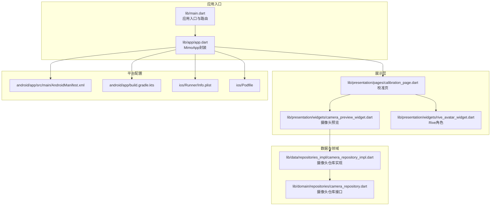
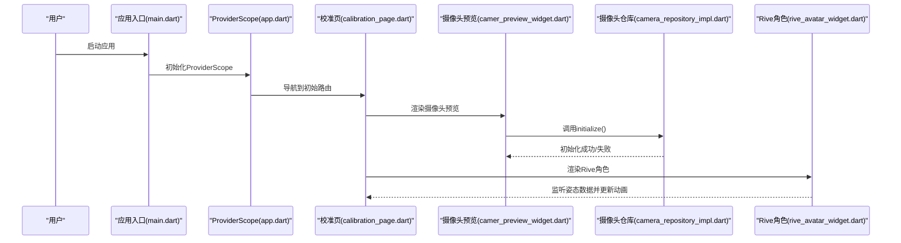
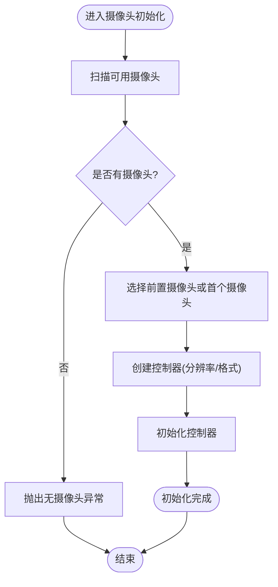
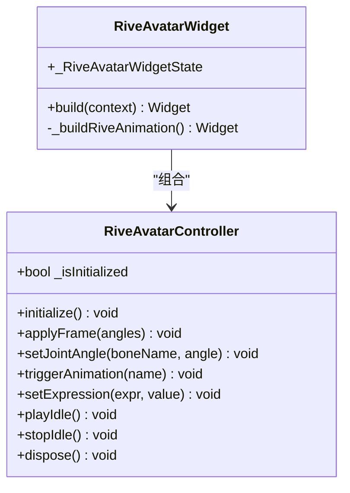
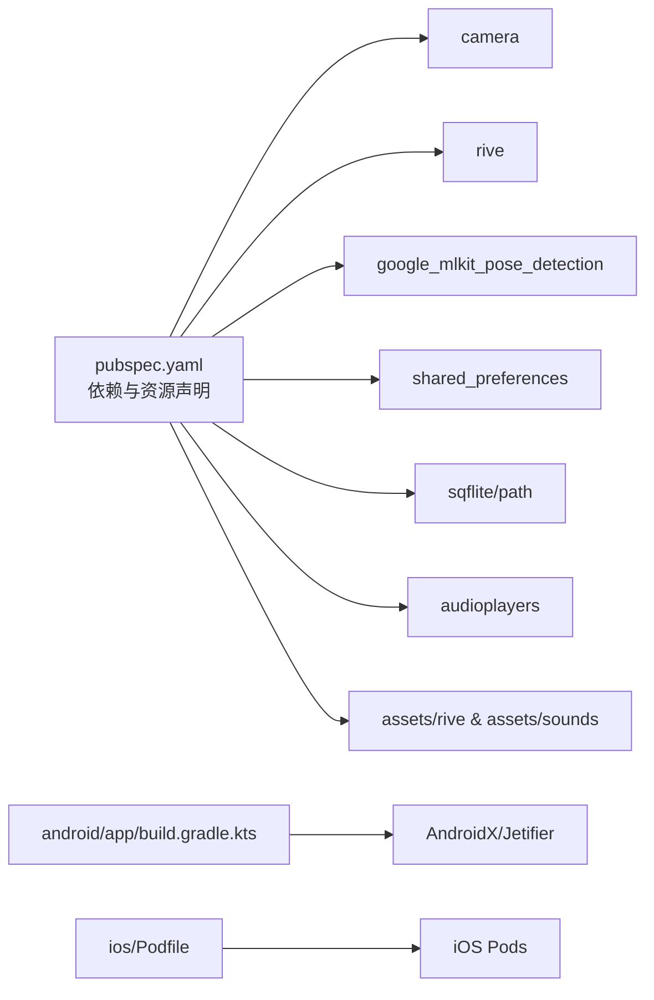

# 常见问题解决

<cite>
**本文引用的文件**
- [pubspec.yaml](file://pubspec.yaml)
- [main.dart](file://lib/main.dart)
- [app.dart](file://lib/app/app.dart)
- [camera_preview_widget.dart](file://lib/presentation/widgets/camera_preview_widget.dart)
- [camera_repository_impl.dart](file://lib/data/repositories_impl/camera_repository_impl.dart)
- [camera_repository.dart](file://lib/domain/repositories/camera_repository.dart)
- [rive_avatar_widget.dart](file://lib/presentation/widgets/rive_avatar_widget.dart)
- [AndroidManifest.xml](file://android/app/src/main/AndroidManifest.xml)
- [build.gradle.kts](file://android/app/build.gradle.kts)
- [gradle.properties](file://android/gradle.properties)
- [Info.plist](file://ios/Runner/Info.plist)
- [Podfile](file://ios/Podfile)
- [AppDelegate.swift](file://ios/Runner/AppDelegate.swift)
- [MainActivity.kt](file://android/app/src/main/kotlin/com/mimo/mimo_app/MainActivity.kt)
</cite>

## 目录
1. [简介](#简介)
2. [项目结构](#项目结构)
3. [核心组件](#核心组件)
4. [架构总览](#架构总览)
5. [详细组件分析](#详细组件分析)
6. [依赖关系分析](#依赖关系分析)
7. [性能考虑](#性能考虑)
8. [故障排查指南](#故障排查指南)
9. [结论](#结论)
10. [附录](#附录)

## 简介
本指南面向Mimo项目使用者与维护者，聚焦以下高频问题的诊断与修复：应用启动失败、摄像头权限与初始化异常、AI检测（姿态）异常、动画加载失败等。文档提供症状、可能原因、分步解决步骤、检查清单、验证方法、预防措施与最佳实践，帮助快速定位并解决问题。

## 项目结构
Mimo采用Flutter多平台架构，核心模块包括：
- 应用入口与路由：lib/main.dart、lib/app/app.dart
- 页面与UI：lib/presentation/pages、lib/presentation/widgets
- 数据与领域：lib/data、lib/domain
- 平台集成：android/、ios/、macos/、windows/、linux/

图表来源
- [main.dart:1-34](file://lib/main.dart#L1-L34)
- [app.dart:1-27](file://lib/app/app.dart#L1-L27)
- [calibration_page.dart](file://lib/presentation/pages/calibration_page.dart)
- [camera_preview_widget.dart:1-49](file://lib/presentation/widgets/camera_preview_widget.dart#L1-L49)
- [camera_repository_impl.dart:1-54](file://lib/data/repositories_impl/camera_repository_impl.dart#L1-L54)
- [camera_repository.dart:1-28](file://lib/domain/repositories/camera_repository.dart#L1-L28)
- [rive_avatar_widget.dart:1-118](file://lib/presentation/widgets/rive_avatar_widget.dart#L1-L118)
- [AndroidManifest.xml:1-46](file://android/app/src/main/AndroidManifest.xml#L1-L46)
- [build.gradle.kts:1-45](file://android/app/build.gradle.kts#L1-L45)
- [Info.plist:1-50](file://ios/Runner/Info.plist#L1-L50)
- [Podfile:1-44](file://ios/Podfile#L1-L44)

章节来源
- [main.dart:1-34](file://lib/main.dart#L1-L34)
- [app.dart:1-27](file://lib/app/app.dart#L1-L27)
- [AndroidManifest.xml:1-46](file://android/app/src/main/AndroidManifest.xml#L1-L46)
- [build.gradle.kts:1-45](file://android/app/build.gradle.kts#L1-L45)
- [Info.plist:1-50](file://ios/Runner/Info.plist#L1-L50)
- [Podfile:1-44](file://ios/Podfile#L1-L44)

## 核心组件
- 应用入口与路由：定义初始路由为校准页，统一主题与导航。
- 摄像头模块：通过仓库接口抽象，实现类负责初始化、预览与图像流。
- 动画模块：Rive角色控制器与渲染Widget，监听姿态数据驱动骨骼动画。
- 平台配置：Android清单与Gradle、iOS Info.plist与Podfile，决定运行环境与权限声明。

章节来源
- [main.dart:7-33](file://lib/main.dart#L7-L33)
- [camera_repository.dart:1-28](file://lib/domain/repositories/camera_repository.dart#L1-L28)
- [camera_repository_impl.dart:20-47](file://lib/data/repositories_impl/camera_repository_impl.dart#L20-L47)
- [rive_avatar_widget.dart:10-71](file://lib/presentation/widgets/rive_avatar_widget.dart#L10-L71)

## 架构总览
应用启动流程与关键交互如下：

图表来源
- [main.dart:7-33](file://lib/main.dart#L7-L33)
- [app.dart:10-26](file://lib/app/app.dart#L10-L26)
- [calibration_page.dart:58-112](file://lib/presentation/pages/calibration_page.dart#L58-L112)
- [camera_preview_widget.dart:25-35](file://lib/presentation/widgets/camera_preview_widget.dart#L25-L35)
- [camera_repository_impl.dart:20-47](file://lib/data/repositories_impl/camera_repository_impl.dart#L20-L47)
- [rive_avatar_widget.dart:96-118](file://lib/presentation/widgets/rive_avatar_widget.dart#L96-L118)

## 详细组件分析

### 摄像头初始化与预览
- 初始化流程：调用仓库initialize()，扫描可用摄像头，选择前置摄像头并初始化控制器，开启图像流。
- 异常处理：初始化失败会抛出异常，预览Widget在未就绪时显示加载指示器。
- 关键点：前置摄像头默认选择、分辨率与格式设置、图像流回调。

图表来源
- [camera_repository_impl.dart:20-47](file://lib/data/repositories_impl/camera_repository_impl.dart#L20-L47)

章节来源
- [camera_repository_impl.dart:1-54](file://lib/data/repositories_impl/camera_repository_impl.dart#L1-L54)
- [camera_repository.dart:1-28](file://lib/domain/repositories/camera_repository.dart#L1-L28)
- [camera_preview_widget.dart:25-35](file://lib/presentation/widgets/camera_preview_widget.dart#L25-L35)

### Rive动画加载与姿态驱动
- 初始化：控制器initialize()标记就绪；渲染Widget在构建时加载Rive资源。
- 姿态驱动：监听姿态数据，按关节类型映射到骨骼名称并设置角度。
- 资源路径：从assets加载.riv文件，需确保路径与资源清单一致。

图表来源
- [rive_avatar_widget.dart:10-71](file://lib/presentation/widgets/rive_avatar_widget.dart#L10-L71)
- [rive_avatar_widget.dart:74-118](file://lib/presentation/widgets/rive_avatar_widget.dart#L74-L118)

章节来源
- [rive_avatar_widget.dart:1-118](file://lib/presentation/widgets/rive_avatar_widget.dart#L1-L118)

## 依赖关系分析
- 依赖库：camera、rive、google_mlkit_pose_detection、shared_preferences、sqflite、audioplayers等。
- 资源清单：assets中声明了rive与sounds目录。
- 平台配置：Android启用AndroidX/Jetifier；iOS通过Podfile安装依赖；Info.plist声明应用信息。

图表来源
- [pubspec.yaml:30-79](file://pubspec.yaml#L30-L79)
- [build.gradle.kts:2-6](file://android/app/build.gradle.kts#L2-L6)
- [Podfile:30-37](file://ios/Podfile#L30-L37)

章节来源
- [pubspec.yaml:1-80](file://pubspec.yaml#L1-L80)
- [build.gradle.kts:1-45](file://android/app/build.gradle.kts#L1-L45)
- [Podfile:1-44](file://ios/Podfile#L1-L44)

## 性能考虑
- 摄像头分辨率与格式：中等分辨率与nv21格式平衡性能与质量。
- 图像流回调：避免在主线程执行重计算，必要时异步处理。
- 动画更新：按帧率节流，减少不必要的重绘与骨骼更新。
- 资源加载：Rive资源应缓存与复用，避免重复加载。

## 故障排查指南

### 一、应用启动失败
- 症状
  - 启动即崩溃或白屏
  - 路由无法跳转
- 可能原因
  - 入口文件未正确注册或路由表缺失
  - Provider作用域未包裹根组件
  - 平台插件未注册（iOS）
- 快速检查
  - 确认入口调用ProviderScope并传入根组件
  - 确认初始路由存在且页面可构建
  - 确认iOS AppDelegate已注册插件
- 分步修复
  - 在入口文件包裹ProviderScope
  - 补充路由表中的页面
  - iOS执行依赖安装后重新构建
- 验证方法
  - 重新运行应用，观察是否进入初始路由
  - 查看日志中是否有未捕获异常
- 预防措施
  - 统一入口封装，避免遗漏ProviderScope
  - 路由变更时同步更新路由表

章节来源
- [main.dart:7-33](file://lib/main.dart#L7-L33)
- [app.dart:10-26](file://lib/app/app.dart#L10-L26)
- [AppDelegate.swift:10](file://ios/Runner/AppDelegate.swift#L10)

### 二、摄像头权限问题
- 症状
  - 打开校准页后仅显示加载指示器
  - 控制台打印初始化失败
- 可能原因
  - Android缺少相机权限声明或未授予
  - iOS缺少隐私使用说明
  - 设备无可用摄像头
- 快速检查
  - Android清单是否包含必要权限
  - iOS Info.plist是否包含相机使用说明
  - 设备是否具备前置/后置摄像头
- 分步修复
  - Android：在清单中添加相机相关权限声明
  - iOS：在Info.plist中添加NSCameraUsageDescription
  - 重启设备或切换摄像头方向
- 验证方法
  - 重新运行应用，确认预览正常显示
  - 检查系统权限弹窗是否出现
- 预防措施
  - 在开发阶段主动请求权限
  - 提供清晰的权限引导文案

章节来源
- [AndroidManifest.xml:1-46](file://android/app/src/main/AndroidManifest.xml#L1-L46)
- [Info.plist:1-50](file://ios/Runner/Info.plist#L1-L50)
- [camera_repository_impl.dart:20-47](file://lib/data/repositories_impl/camera_repository_impl.dart#L20-L47)

### 三、摄像头初始化异常
- 症状
  - 初始化抛出“无可用摄像头”异常
  - 预览Widget长时间显示加载
- 可能原因
  - 设备未检测到任何摄像头
  - 前置摄像头不可用时回退策略不当
- 快速检查
  - 设备是否物理支持摄像头
  - 仓库实现是否正确选择前置摄像头
- 分步修复
  - 在无前置摄像头时明确提示用户
  - 增加可用摄像头列表展示与手动切换
- 验证方法
  - 使用模拟器或真机测试不同摄像头配置
- 预防措施
  - 在初始化前检查可用摄像头数量
  - 提供摄像头切换按钮与错误提示

章节来源
- [camera_repository_impl.dart:20-47](file://lib/data/repositories_impl/camera_repository_impl.dart#L20-L47)
- [camera_preview_widget.dart:25-35](file://lib/presentation/widgets/camera_preview_widget.dart#L25-L35)

### 四、AI检测（姿态）异常
- 症状
  - 动画不随动作变化
  - 姿态数据为空或异常
- 可能原因
  - 未正确接入姿态检测库
  - 未将检测结果映射到关节角度
  - 摄像头预览未开始或图像流未启用
- 快速检查
  - 确认已引入姿态检测依赖
  - 确认已启动摄像头预览并开始图像流
  - 确认姿态数据监听逻辑有效
- 分步修复
  - 实现姿态检测回调并将角度写入动画控制器
  - 在预览初始化完成后才进行检测
- 验证方法
  - 手持物体或做动作，观察角色是否响应
- 预防措施
  - 将检测与渲染解耦，保证数据通道稳定

章节来源
- [pubspec.yaml:46-47](file://pubspec.yaml#L46-L47)
- [camera_repository_impl.dart:49-54](file://lib/data/repositories_impl/camera_repository_impl.dart#L49-L54)
- [rive_avatar_widget.dart:96-109](file://lib/presentation/widgets/rive_avatar_widget.dart#L96-L109)

### 五、动画加载失败
- 症状
  - Rive角色不显示或空白
  - 控制台报资源加载错误
- 可能原因
  - Rive资源路径错误或文件缺失
  - 资源未加入assets清单
  - 动画控制器未初始化
- 快速检查
  - 确认assets/rive下存在对应.riv文件
  - 确认pubspec.yaml中已声明assets路径
  - 确认渲染Widget已调用资源加载
- 分步修复
  - 将.riv文件放入assets/rive并刷新资源
  - 在pubspec.yaml中补充assets路径
  - 确保控制器initialize()在build前完成
- 验证方法
  - 重新运行应用，观察角色是否显示
- 预防措施
  - 资源变更后执行资源刷新与清理

章节来源
- [pubspec.yaml:76-79](file://pubspec.yaml#L76-L79)
- [rive_avatar_widget.dart:111-118](file://lib/presentation/widgets/rive_avatar_widget.dart#L111-L118)

### 六、权限配置问题
- Android
  - 检查清单中是否声明相机权限
  - 确认minSdk/targetSdk与编译SDK匹配
- iOS
  - 检查Info.plist中NSCameraUsageDescription是否存在
  - 确认Podfile已正确安装依赖
- 验证方法
  - 运行时触发权限弹窗，查看系统权限界面
  - 查看日志中权限相关错误

章节来源
- [AndroidManifest.xml:1-46](file://android/app/src/main/AndroidManifest.xml#L1-L46)
- [build.gradle.kts:22-31](file://android/app/build.gradle.kts#L22-L31)
- [Info.plist:1-50](file://ios/Runner/Info.plist#L1-L50)
- [Podfile:30-37](file://ios/Podfile#L30-L37)

### 七、依赖库版本冲突
- 症状
  - 构建失败或运行时崩溃
  - 包管理器提示版本不兼容
- 快速检查
  - pubspec.yaml中各依赖版本是否与Flutter SDK兼容
  - Android/iOS平台配置是否与依赖要求一致
- 分步修复
  - 升级Flutter SDK至pubspec要求范围
  - 更新Android Gradle与Kotlin版本以满足依赖
  - iOS执行pod install并清理DerivedData
- 验证方法
  - 清理并重新构建工程
  - 查看依赖树中是否存在重复或冲突版本

章节来源
- [pubspec.yaml:21-22](file://pubspec.yaml#L21-L22)
- [build.gradle.kts:13-20](file://android/app/build.gradle.kts#L13-L20)
- [gradle.properties:1-4](file://android/gradle.properties#L1-L4)
- [Podfile:13-26](file://ios/Podfile#L13-L26)

### 八、配置文件错误
- Android
  - applicationId、minSdk、targetSdk需与Flutter工具链一致
  - AndroidX/Jetifier已启用
- iOS
  - FLUTTER_ROOT与Generated.xcconfig路径正确
  - Pods安装成功且版本匹配
- 验证方法
  - 执行构建命令查看错误详情
  - 检查生成文件是否存在

章节来源
- [build.gradle.kts:22-31](file://android/app/build.gradle.kts#L22-L31)
- [gradle.properties:2-3](file://android/gradle.properties#L2-L3)
- [Podfile:13-26](file://ios/Podfile#L13-L26)

## 结论
通过以上分层排查与修复步骤，可系统性解决Mimo启动、摄像头、姿态检测与动画加载等常见问题。建议在开发与发布前完成权限与依赖检查，并建立标准化的资源与配置管理流程，以降低问题发生概率。

## 附录

### 快速定位检查清单
- 应用启动
  - 入口是否包裹ProviderScope
  - 初始路由是否存在
  - iOS插件是否注册
- 摄像头
  - 权限是否授权
  - 是否检测到可用摄像头
  - 前置摄像头是否可用
- 姿态检测
  - 是否启动摄像头预览
  - 是否开始图像流
  - 是否将姿态数据映射到动画
- 动画
  - Rive资源路径是否正确
  - assets是否声明
  - 控制器是否初始化

### 验证方法
- 日志输出：关注初始化与权限相关日志
- 系统弹窗：确认权限弹窗出现
- 视觉验证：预览画面与角色动画是否正常