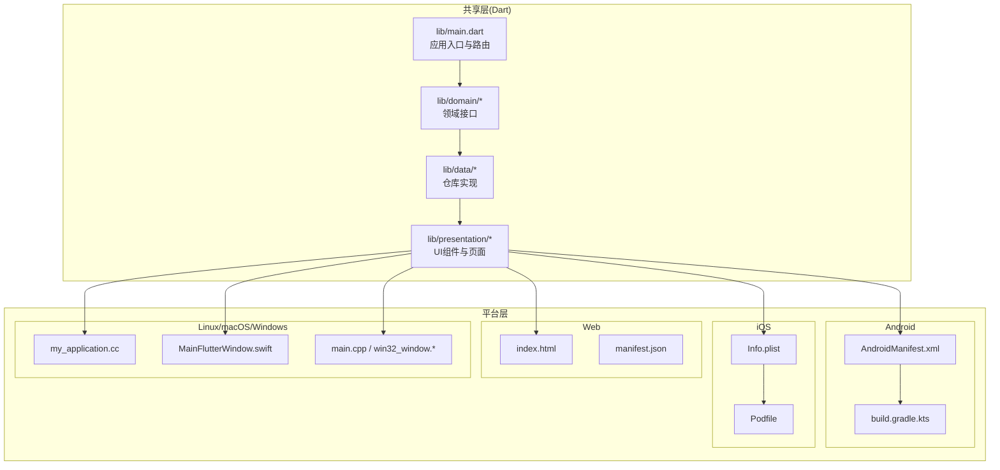
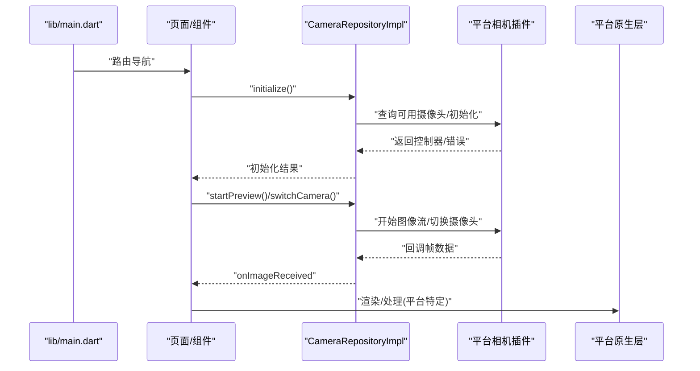
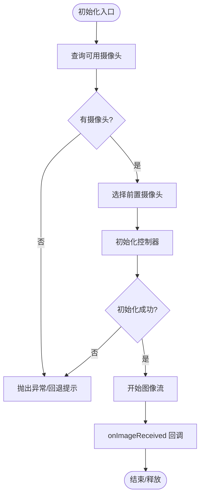
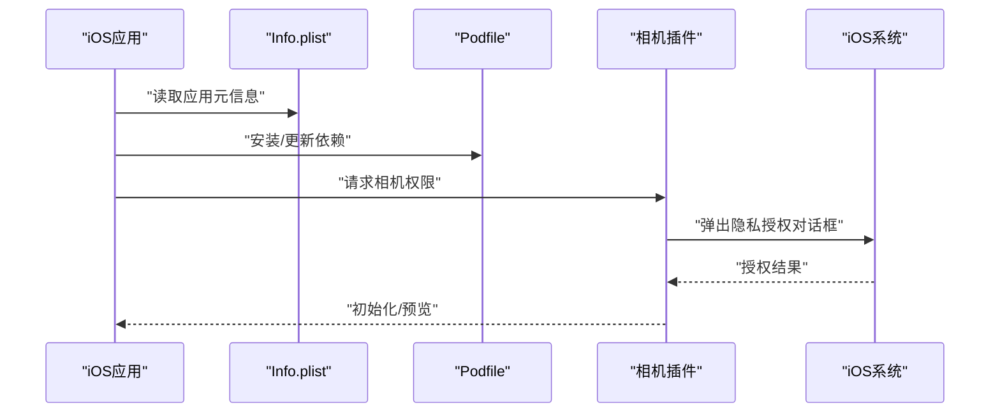
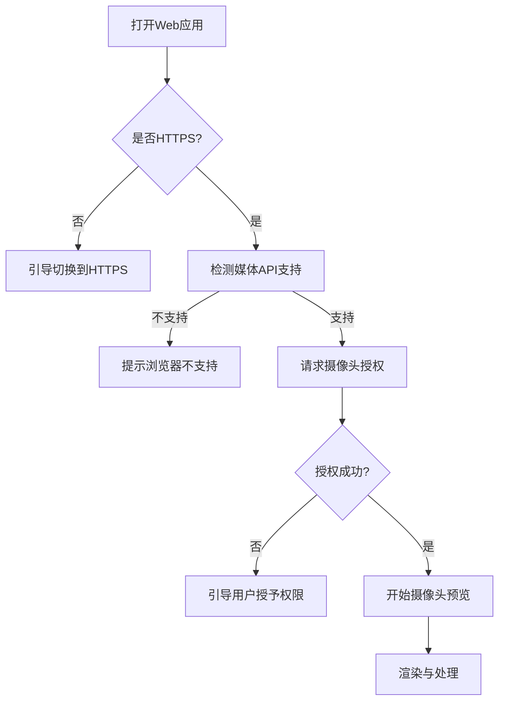
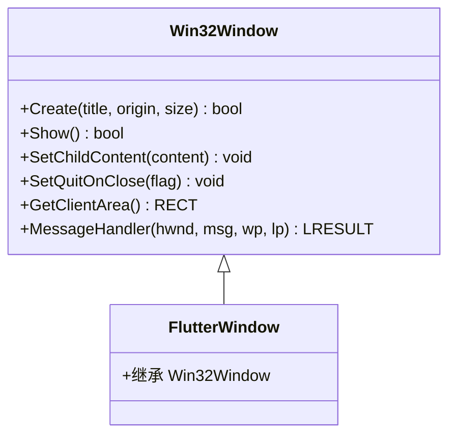

# 平台特定问题

<cite>
**本文引用的文件**
- [pubspec.yaml](file://pubspec.yaml)
- [lib/main.dart](file://lib/main.dart)
- [lib/domain/repositories/camera_repository.dart](file://lib/domain/repositories/camera_repository.dart)
- [lib/data/repositories_impl/camera_repository_impl.dart](file://lib/data/repositories_impl/camera_repository_impl.dart)
- [lib/presentation/widgets/camera_preview_widget.dart](file://lib/presentation/widgets/camera_preview_widget.dart)
- [android/app/src/main/AndroidManifest.xml](file://android/app/src/main/AndroidManifest.xml)
- [android/app/src/debug/AndroidManifest.xml](file://android/app/src/debug/AndroidManifest.xml)
- [android/app/src/profile/AndroidManifest.xml](file://android/app/src/profile/AndroidManifest.xml)
- [android/app/build.gradle.kts](file://android/app/build.gradle.kts)
- [ios/Runner/Info.plist](file://ios/Runner/Info.plist)
- [ios/Podfile](file://ios/Podfile)
- [web/index.html](file://web/index.html)
- [web/manifest.json](file://web/manifest.json)
- [linux/runner/my_application.cc](file://linux/runner/my_application.cc)
- [macos/Runner/MainFlutterWindow.swift](file://macos/Runner/MainFlutterWindow.swift)
- [macos/Runner/Release.entitlements](file://macos/Runner/Release.entitlements)
- [macos/Runner/DebugProfile.entitlements](file://macos/Runner/DebugProfile.entitlements)
- [windows/runner/main.cpp](file://windows/runner/main.cpp)
- [windows/runner/win32_window.cpp](file://windows/runner/win32_window.cpp)
- [windows/runner/win32_window.h](file://windows/runner/win32_window.h)
</cite>

## 目录
1. [简介](#简介)
2. [项目结构](#项目结构)
3. [核心组件](#核心组件)
4. [架构总览](#架构总览)
5. [详细组件分析](#详细组件分析)
6. [依赖分析](#依赖分析)
7. [性能考量](#性能考量)
8. [故障排查指南](#故障排查指南)
9. [结论](#结论)
10. [附录](#附录)

## 简介
本指南聚焦于Mimo项目在多平台（Android、iOS、Web、Linux/macOS/Windows）上的平台特定问题与排查策略，围绕以下主题展开：
- Android：相机权限、后台运行、硬件兼容性
- iOS：隐私权限、App Store审核、设备适配
- Web：浏览器兼容性、摄像头访问、性能优化
- 桌面：窗口管理、输入设备、系统集成
并提供统一的调试工具与测试方法建议，帮助快速定位与解决问题。

## 项目结构
Mimo采用Flutter多端统一架构，通过平台特定的原生层（Android/iOS/Web/Linux/macOS/Windows）与共享的Dart业务层协作，形成“共享逻辑 + 平台桥接”的分层设计。关键特性：
- 共享层：路由、页面、状态管理、数据仓库与业务逻辑
- 平台层：各端入口、清单/配置文件、原生窗口与系统能力接入
- 外部依赖：相机、MLKit姿态检测、Rive动画、音频播放、本地存储等

图示来源
- [lib/main.dart:1-34](file://lib/main.dart#L1-L34)
- [android/app/src/main/AndroidManifest.xml:1-46](file://android/app/src/main/AndroidManifest.xml#L1-L46)
- [android/app/build.gradle.kts:1-45](file://android/app/build.gradle.kts#L1-L45)
- [ios/Runner/Info.plist:1-50](file://ios/Runner/Info.plist#L1-L50)
- [ios/Podfile:1-44](file://ios/Podfile#L1-L44)
- [web/index.html:1-39](file://web/index.html#L1-L39)
- [web/manifest.json:1-36](file://web/manifest.json#L1-L36)
- [linux/runner/my_application.cc:1-131](file://linux/runner/my_application.cc#L1-L131)
- [macos/Runner/MainFlutterWindow.swift:1-16](file://macos/Runner/MainFlutterWindow.swift#L1-L16)
- [windows/runner/main.cpp:1-44](file://windows/runner/main.cpp#L1-L44)
- [windows/runner/win32_window.cpp:40-273](file://windows/runner/win32_window.cpp#L40-L273)

章节来源
- [lib/main.dart:1-34](file://lib/main.dart#L1-L34)
- [pubspec.yaml:1-80](file://pubspec.yaml#L1-L80)

## 核心组件
- 路由与入口：应用以共享入口启动，按路由切换校准页、主页与设置页，便于跨平台一致的导航体验。
- 相机模块：通过统一的仓库接口抽象，实现跨平台摄像头初始化、预览、图像流接收与切换；具体实现位于Android/iOS/Web/Linux/macOS/Windows的平台适配层。
- 外部能力：依赖相机、MLKit姿态检测、Rive动画、音频播放、本地存储等，这些能力在不同平台上的可用性与行为存在差异，需分别验证与降级。

章节来源
- [lib/main.dart:1-34](file://lib/main.dart#L1-L34)
- [lib/domain/repositories/camera_repository.dart:1-28](file://lib/domain/repositories/camera_repository.dart#L1-L28)
- [lib/data/repositories_impl/camera_repository_impl.dart:1-97](file://lib/data/repositories_impl/camera_repository_impl.dart#L1-L97)
- [pubspec.yaml:40-56](file://pubspec.yaml#L40-L56)

## 架构总览
下图展示从应用入口到平台原生层的关键交互路径，以及相机相关流程在各平台的落地方式。

图示来源
- [lib/main.dart:1-34](file://lib/main.dart#L1-L34)
- [lib/data/repositories_impl/camera_repository_impl.dart:1-97](file://lib/data/repositories_impl/camera_repository_impl.dart#L1-L97)
- [lib/presentation/widgets/camera_preview_widget.dart:1-49](file://lib/presentation/widgets/camera_preview_widget.dart#L1-L49)

## 详细组件分析

### Android 平台
- 权限与清单
  - 应用清单声明了Activity、主题、配置变更与查询意图，未显式声明相机权限，通常由相机插件在运行时请求。
  - 调试/Profile构建包含网络权限，便于开发调试。
- 构建与SDK
  - 使用Flutter Gradle插件，compile/target/minSdk版本由Flutter工具链注入，确保与Flutter SDK版本匹配。
- 相机与硬件兼容性
  - 仓库实现默认选择前置摄像头并初始化控制器，若无可用摄像头则抛出异常；支持切换摄像头与停止/开始图像流。
  - 若设备缺少后置摄像头或权限不足，应优先检查相机插件的权限请求与设备能力。
- 后台运行
  - 当前清单未声明前台服务或后台任务能力；若需要在后台持续采集图像，需评估平台限制与权限策略，并谨慎设计生命周期管理。

图示来源
- [lib/data/repositories_impl/camera_repository_impl.dart:1-97](file://lib/data/repositories_impl/camera_repository_impl.dart#L1-L97)

章节来源
- [android/app/src/main/AndroidManifest.xml:1-46](file://android/app/src/main/AndroidManifest.xml#L1-L46)
- [android/app/src/debug/AndroidManifest.xml:1-7](file://android/app/src/debug/AndroidManifest.xml#L1-L7)
- [android/app/src/profile/AndroidManifest.xml:1-7](file://android/app/src/profile/AndroidManifest.xml#L1-L7)
- [android/app/build.gradle.kts:1-45](file://android/app/build.gradle.kts#L1-L45)
- [lib/data/repositories_impl/camera_repository_impl.dart:1-97](file://lib/data/repositories_impl/camera_repository_impl.dart#L1-L97)

### iOS 平台
- 配置与能力
  - Info.plist声明了应用标识、支持的方向、最小系统版本、启动Storyboard与主Storyboard等；未显式声明相机权限键，通常由相机插件在运行时请求。
  - Podfile启用Flutter iOS安装流程，确保依赖正确集成。
- 隐私与审核
  - 需要在项目中添加NSCameraUsageDescription以满足App Store审核要求；该键用于向用户说明相机使用目的。
- 设备适配
  - 支持iPhone与iPad横竖屏方向；需在真机上验证不同尺寸与安全区域表现。

图示来源
- [ios/Runner/Info.plist:1-50](file://ios/Runner/Info.plist#L1-L50)
- [ios/Podfile:1-44](file://ios/Podfile#L1-L44)

章节来源
- [ios/Runner/Info.plist:1-50](file://ios/Runner/Info.plist#L1-L50)
- [ios/Podfile:1-44](file://ios/Podfile#L1-L44)

### Web 平台
- 清单与入口
  - index.html定义基础路径、iOS元标签、图标与manifest链接；manifest.json声明显示模式、主题色与图标集。
- 浏览器兼容性
  - 需验证现代浏览器对getUserMedia、WebAssembly、Service Worker等的支持；在旧版浏览器上可能无法加载或功能受限。
- 摄像头访问
  - 依赖HTTPS与现代浏览器API；在非HTTPS或用户拒绝授权时需提供清晰的引导与降级提示。
- 性能优化
  - Web端图像处理与动画渲染对CPU/GPU压力较大，建议在低分辨率预设与帧率控制下进行基准测试。

图示来源
- [web/index.html:1-39](file://web/index.html#L1-L39)
- [web/manifest.json:1-36](file://web/manifest.json#L1-L36)

章节来源
- [web/index.html:1-39](file://web/index.html#L1-L39)
- [web/manifest.json:1-36](file://web/manifest.json#L1-L36)

### 桌面平台（Linux/macOS/Windows）
- Linux
  - 应用通过GTK窗口创建Flutter视图，自动根据桌面环境选择标题栏风格；默认窗口尺寸为固定值，建议在高分屏上关注DPI缩放与布局适配。
- macOS
  - 主窗口以FlutterViewController承载，配合沙箱与网络/运行时权限配置；发布时建议开启沙箱并明确所需权限。
- Windows
  - 通过Win32窗口类注册与消息循环创建窗口，支持DPI感知与WM_SIZE/WM_DPICHANGED消息处理；建议在多显示器与高DPI场景下验证缩放与焦点行为。

图示来源
- [windows/runner/win32_window.h:1-75](file://windows/runner/win32_window.h#L1-L75)
- [windows/runner/win32_window.cpp:40-273](file://windows/runner/win32_window.cpp#L40-L273)
- [windows/runner/main.cpp:1-44](file://windows/runner/main.cpp#L1-L44)
- [linux/runner/my_application.cc:1-131](file://linux/runner/my_application.cc#L1-L131)
- [macos/Runner/MainFlutterWindow.swift:1-16](file://macos/Runner/MainFlutterWindow.swift#L1-L16)
- [macos/Runner/Release.entitlements:1-8](file://macos/Runner/Release.entitlements#L1-L8)
- [macos/Runner/DebugProfile.entitlements:1-12](file://macos/Runner/DebugProfile.entitlements#L1-L12)

章节来源
- [linux/runner/my_application.cc:1-131](file://linux/runner/my_application.cc#L1-L131)
- [macos/Runner/MainFlutterWindow.swift:1-16](file://macos/Runner/MainFlutterWindow.swift#L1-L16)
- [macos/Runner/Release.entitlements:1-8](file://macos/Runner/Release.entitlements#L1-L8)
- [macos/Runner/DebugProfile.entitlements:1-12](file://macos/Runner/DebugProfile.entitlements#L1-L12)
- [windows/runner/main.cpp:1-44](file://windows/runner/main.cpp#L1-L44)
- [windows/runner/win32_window.cpp:40-273](file://windows/runner/win32_window.cpp#L40-L273)

## 依赖分析
- 外部库与用途
  - 相机：用于摄像头初始化与图像流
  - MLKit姿态检测：用于姿态识别
  - Rive：用于动画渲染
  - 音效播放：用于音效播放
  - 本地存储：SharedPreferences/SQFlite/Path
- 平台差异
  - Android/iOS：相机权限与隐私政策要求不同，需分别配置与引导
  - Web：HTTPS与浏览器API支持差异显著
  - 桌面：窗口管理、DPI缩放、沙箱与权限策略各异

章节来源
- [pubspec.yaml:40-56](file://pubspec.yaml#L40-L56)

## 性能考量
- 相机分辨率与格式
  - 在Android/iOS/Web/Linux/macOS/Windows上，图像格式与分辨率直接影响处理开销；建议在低端设备上降低分辨率预设并限制帧率。
- 渲染与动画
  - Rive动画在Web端依赖WebAssembly与GPU加速；在低性能设备上可考虑简化动画或降级为静态资源。
- 内存与GC
  - 持续图像流与解码会增加内存压力，需定期释放不再使用的资源并监控内存峰值。
- 网络与缓存
  - Web端若涉及在线模型或资源，建议启用缓存策略与离线兜底。

## 故障排查指南

### Android
- 症状：无法打开摄像头或黑屏
  - 排查要点：确认相机插件已请求权限；检查设备是否有物理摄像头；查看日志中初始化失败原因。
  - 参考实现路径：[相机仓库初始化与异常处理:20-47](file://lib/data/repositories_impl/camera_repository_impl.dart#L20-L47)
- 症状：后台运行时画面停止
  - 排查要点：当前清单未声明后台能力；评估是否需要前台服务或限制电池优化。
  - 参考配置路径：[Android清单:1-46](file://android/app/src/main/AndroidManifest.xml#L1-L46)
- 症状：低端设备卡顿
  - 排查要点：降低分辨率预设与图像格式；减少同时并发的任务数量。

### iOS
- 症状：App Store审核被拒
  - 排查要点：补充NSCameraUsageDescription；在Info.plist中明确使用目的。
  - 参考配置路径：[Info.plist:1-50](file://ios/Runner/Info.plist#L1-L50)
- 症状：iPad横竖屏适配异常
  - 排查要点：核对Info.plist中的UISupportedInterfaceOrientations与iPad方向数组。
- 症状：隐私授权弹窗不出现
  - 排查要点：确认相机插件已正确集成；检查Bundle标识与签名。

### Web
- 症状：白屏或无法加载
  - 排查要点：确认部署在HTTPS；检查浏览器控制台错误；验证manifest与图标资源可达。
  - 参考配置路径：[index.html:1-39](file://web/index.html#L1-L39)、[manifest.json:1-36](file://web/manifest.json#L1-L36)
- 症状：摄像头不可用
  - 排查要点：确认用户已授予权限；在非HTTPS环境下浏览器会阻止访问。
- 症状：性能差
  - 排查要点：降低分辨率与帧率；避免在主线程执行重计算；启用Web Workers处理部分逻辑。

### 桌面（Linux/macOS/Windows）
- 症状：窗口无标题栏或布局错位
  - 排查要点：Linux端根据桌面环境选择标题栏风格；Windows端检查DPI消息处理与窗口尺寸缩放。
  - 参考实现路径：[Linux窗口创建:18-63](file://linux/runner/my_application.cc#L18-L63)、[Windows窗口类与消息处理:89-150](file://windows/runner/win32_window.cpp#L89-L150)
- 症状：macOS沙箱导致网络/运行时异常
  - 排查要点：在发布配置中开启必要权限；DebugProfile与Release权限不同，需分别验证。
  - 参考配置路径：[macOS发布权限:1-8](file://macos/Runner/Release.entitlements#L1-L8)、[macOS调试权限:1-12](file://macos/Runner/DebugProfile.entitlements#L1-L12)

### 通用调试与测试方法
- 日志与断点
  - Android：使用adb logcat过滤应用日志；在IDE中设置断点定位初始化与回调。
  - iOS：使用Xcode控制台与LLDB断点；真机上观察隐私授权弹窗与权限状态。
  - Web：使用浏览器开发者工具Network/Console/Performance面板；在不同浏览器对比行为。
  - 桌面：在Windows/Linux/macOS上分别运行调试版本，观察窗口与DPI表现。
- 功能回归
  - 在各平台最小可行版本上验证：相机初始化、授权流程、预览渲染、切换摄像头、退出清理。
- 性能基线
  - 在目标设备上记录CPU/GPU/内存占用，对比不同分辨率与动画复杂度下的表现。

## 结论
Mimo项目在多平台上实现了统一的业务逻辑与UI体验，但相机、隐私与系统集成等平台特定问题仍需分别对待。建议：
- 明确各平台的权限与配置要求，完善审核与隐私文档
- 在各端进行端到端的功能与性能回归测试
- 对低端设备制定降级策略与阈值
- 建立跨平台问题追踪与修复流程

## 附录
- 快速检查清单
  - Android：相机权限、后台能力、低端设备兼容
  - iOS：NSCameraUsageDescription、审核清单、iPad适配
  - Web：HTTPS、浏览器API、性能基线
  - 桌面：窗口管理、DPI缩放、沙箱与权限