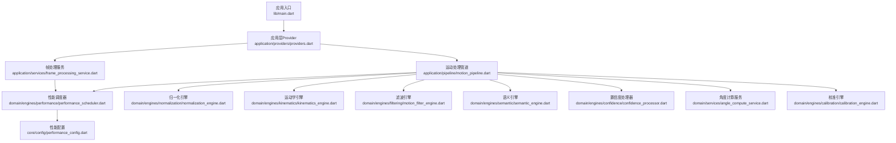
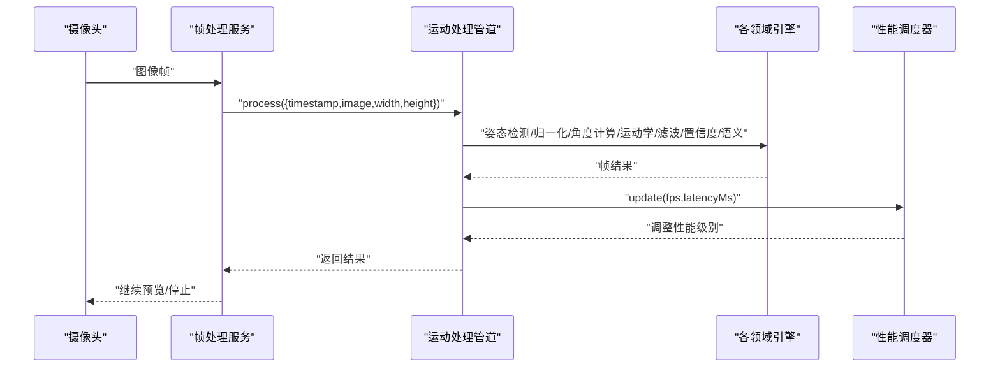
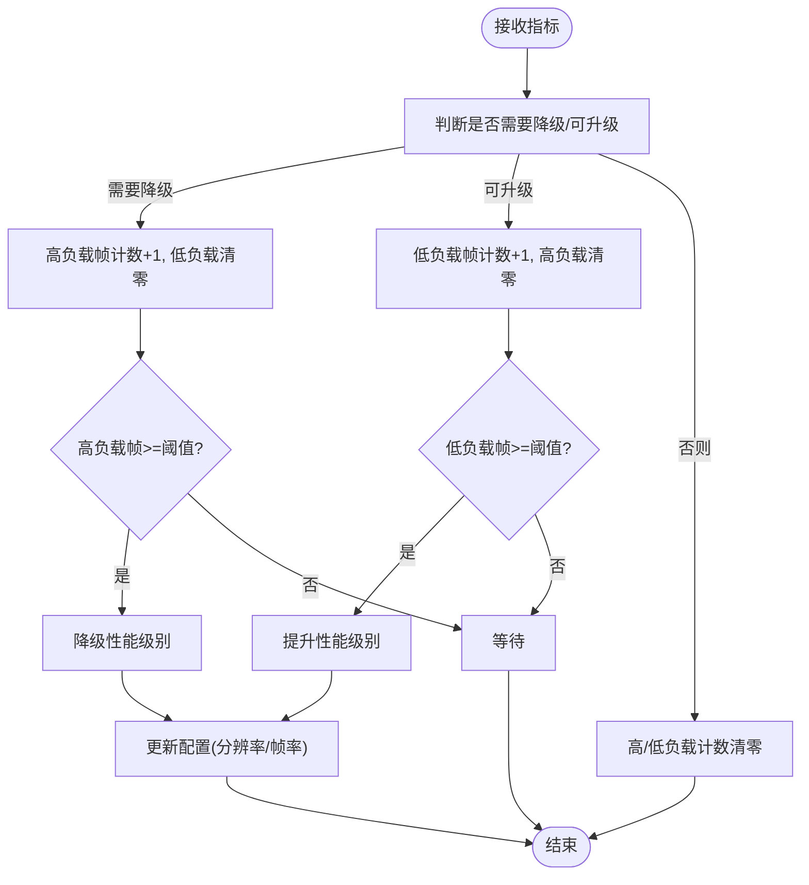
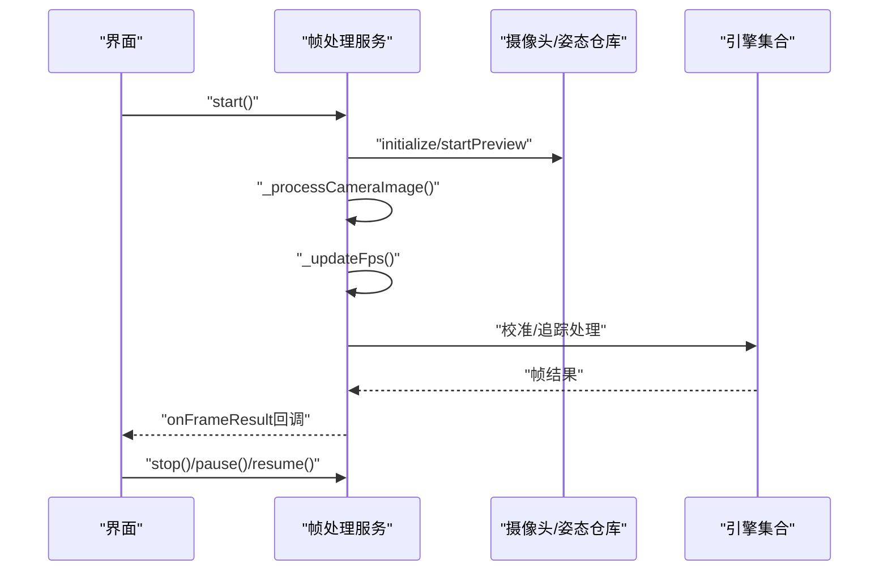
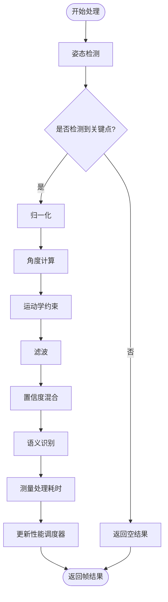
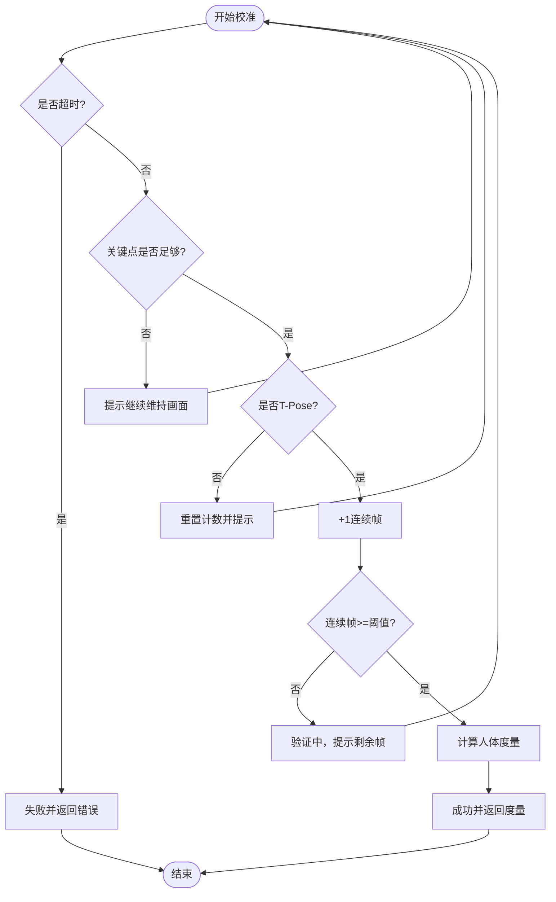
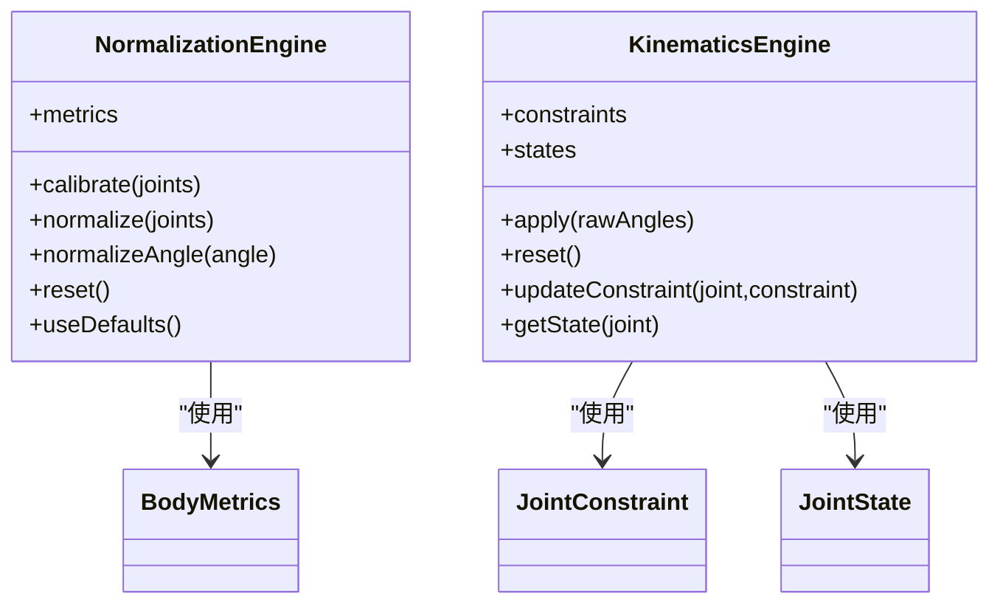
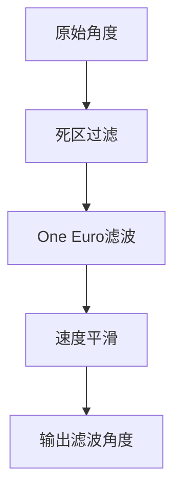
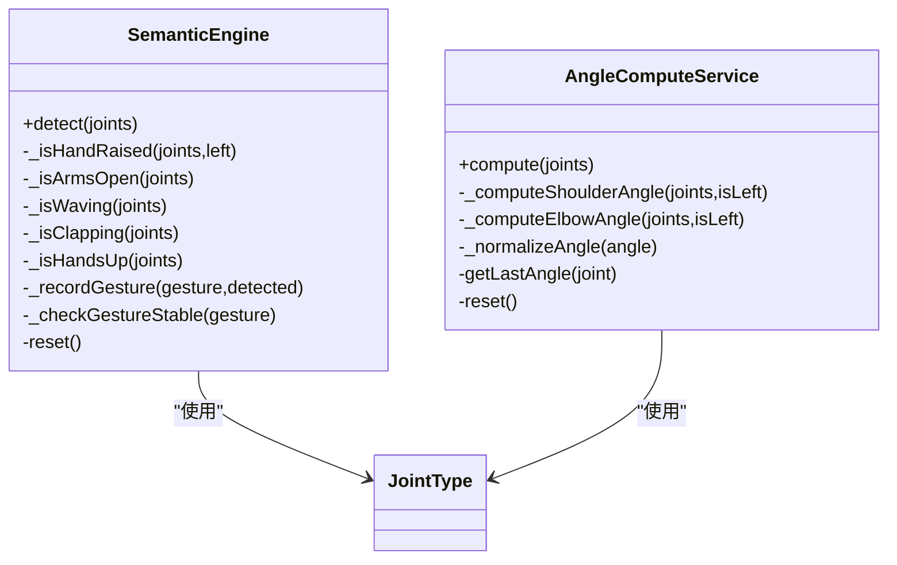
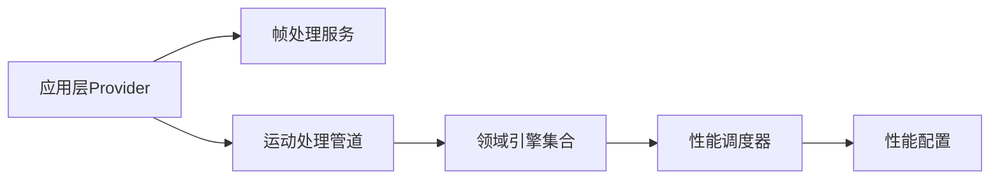

# 性能问题诊断

<cite>
**本文引用的文件**
- [pubspec.yaml](file://pubspec.yaml)
- [main.dart](file://lib/main.dart)
- [performance_config.dart](file://lib/core/config/performance_config.dart)
- [app_constants.dart](file://lib/core/constants/app_constants.dart)
- [providers.dart](file://lib/application/providers/providers.dart)
- [frame_processing_service.dart](file://lib/application/services/frame_processing_service.dart)
- [motion_pipeline.dart](file://lib/application/pipeline/motion_pipeline.dart)
- [performance_scheduler.dart](file://lib/domain/engines/performance/performance_scheduler.dart)
- [calibration_engine.dart](file://lib/domain/engines/calibration/calibration_engine.dart)
- [kinematics_engine.dart](file://lib/domain/engines/kinematics/kinematics_engine.dart)
- [motion_filter_engine.dart](file://lib/domain/engines/filtering/motion_filter_engine.dart)
- [normalization_engine.dart](file://lib/domain/engines/normalization/normalization_engine.dart)
- [confidence_processor.dart](file://lib/domain/engines/confidence/confidence_processor.dart)
- [semantic_engine.dart](file://lib/domain/engines/semantic/semantic_engine.dart)
- [angle_compute_service.dart](file://lib/domain/services/angle_compute_service.dart)
- [build.gradle.kts](file://android/app/build.gradle.kts)
- [project.pbxproj](file://ios/Runner.xcodeproj/project.pbxproj)
</cite>

## 目录
1. [简介](#简介)
2. [项目结构](#项目结构)
3. [核心组件](#核心组件)
4. [架构总览](#架构总览)
5. [详细组件分析](#详细组件分析)
6. [依赖关系分析](#依赖关系分析)
7. [性能考量](#性能考量)
8. [故障排查指南](#故障排查指南)
9. [结论](#结论)
10. [附录](#附录)

## 简介
本指南面向Mimo项目的性能问题诊断与优化，聚焦以下目标：
- 识别与分析关键性能指标（FPS、延迟、温度、置信度、帧处理耗时）。
- 针对CPU使用率过高、内存泄漏、帧率下降等典型问题给出系统化诊断流程。
- 提供性能配置参数的调整策略与效果评估方法。
- 解释多平台（Android/iOS/Web/Desktop）性能特点与优化重点。
- 给出性能基准测试与瓶颈识别技术，以及性能回归检测与持续监控方案。
- 总结资源使用优化与内存管理最佳实践。

## 项目结构
Mimo采用Flutter跨平台框架，核心代码位于lib目录，包含应用入口、领域模型、应用层编排与数据访问层。性能相关逻辑主要分布在：
- 配置层：性能配置与常量定义
- 应用层：帧处理服务与运动处理管道
- 领域层：各引擎（校准、归一化、运动学、滤波、语义、置信度、角度计算）
- 平台构建：Android与iOS的构建配置

**图示来源**
- [main.dart:1-34](file://lib/main.dart#L1-L34)
- [providers.dart:1-103](file://lib/application/providers/providers.dart#L1-L103)
- [frame_processing_service.dart:1-254](file://lib/application/services/frame_processing_service.dart#L1-L254)
- [motion_pipeline.dart:1-141](file://lib/application/pipeline/motion_pipeline.dart#L1-L141)
- [performance_scheduler.dart:1-194](file://lib/domain/engines/performance/performance_scheduler.dart#L1-L194)
- [performance_config.dart:1-79](file://lib/core/config/performance_config.dart#L1-L79)
- [normalization_engine.dart:1-143](file://lib/domain/engines/normalization/normalization_engine.dart#L1-L143)
- [kinematics_engine.dart:1-95](file://lib/domain/engines/kinematics/kinematics_engine.dart#L1-L95)
- [motion_filter_engine.dart:1-117](file://lib/domain/engines/filtering/motion_filter_engine.dart#L1-L117)
- [semantic_engine.dart:1-221](file://lib/domain/engines/semantic/semantic_engine.dart#L1-L221)
- [confidence_processor.dart:1-91](file://lib/domain/engines/confidence/confidence_processor.dart#L1-L91)
- [angle_compute_service.dart:1-120](file://lib/domain/services/angle_compute_service.dart#L1-L120)
- [calibration_engine.dart:1-302](file://lib/domain/engines/calibration/calibration_engine.dart#L1-L302)

**章节来源**
- [main.dart:1-34](file://lib/main.dart#L1-L34)
- [providers.dart:1-103](file://lib/application/providers/providers.dart#L1-L103)

## 核心组件
- 性能配置与常量
  - 性能等级与目标帧率、分辨率、温度/延迟阈值
  - 应用常量（目标FPS、最小FPS、最大延迟等）
- 帧处理服务
  - 连接摄像头与姿态检测，驱动处理流水线，统计FPS
- 运动处理管道
  - 将姿态检测、归一化、角度计算、运动学约束、滤波、置信度混合、语义识别串联
- 性能调度器
  - 基于FPS、延迟、温度的自适应降级/升级策略
- 校准引擎
  - T-Pose检测与人体度量计算，影响后续归一化与语义识别
- 其他引擎与服务
  - 归一化、运动学、滤波、置信度、角度计算、语义识别

**章节来源**
- [performance_config.dart:1-79](file://lib/core/config/performance_config.dart#L1-L79)
- [app_constants.dart:1-35](file://lib/core/constants/app_constants.dart#L1-L35)
- [frame_processing_service.dart:1-254](file://lib/application/services/frame_processing_service.dart#L1-L254)
- [motion_pipeline.dart:1-141](file://lib/application/pipeline/motion_pipeline.dart#L1-L141)
- [performance_scheduler.dart:1-194](file://lib/domain/engines/performance/performance_scheduler.dart#L1-L194)
- [calibration_engine.dart:1-302](file://lib/domain/engines/calibration/calibration_engine.dart#L1-L302)

## 架构总览
下图展示从摄像头输入到渲染输出的完整处理链路，以及性能调度器如何根据运行时指标动态调整性能级别。

**图示来源**
- [frame_processing_service.dart:108-148](file://lib/application/services/frame_processing_service.dart#L108-L148)
- [motion_pipeline.dart:61-130](file://lib/application/pipeline/motion_pipeline.dart#L61-L130)
- [performance_scheduler.dart:90-129](file://lib/domain/engines/performance/performance_scheduler.dart#L90-L129)

## 详细组件分析

### 组件A：性能调度器与自适应策略
- 目标
  - 基于温度、延迟、FPS三要素，自动降级/升级性能级别
  - 通过连续高/低负载帧计数避免频繁抖动
- 关键阈值
  - 温度警告/临界、延迟警告/临界、目标/降级/最低FPS
- 策略要点
  - 达到连续高负载阈值后降级；达到连续低负载阈值后升级
  - 升降级后更新对应的推理分辨率与帧率配置

**图示来源**
- [performance_scheduler.dart:90-180](file://lib/domain/engines/performance/performance_scheduler.dart#L90-L180)
- [performance_config.dart:36-58](file://lib/core/config/performance_config.dart#L36-L58)

**章节来源**
- [performance_scheduler.dart:1-194](file://lib/domain/engines/performance/performance_scheduler.dart#L1-L194)
- [performance_config.dart:1-79](file://lib/core/config/performance_config.dart#L1-L79)

### 组件B：帧处理服务与FPS统计
- 目标
  - 管理摄像头生命周期、异步图像处理、状态机切换（空闲/校准/追踪/暂停）
  - 统计并上报实时FPS，驱动UI与性能调度器
- 关键流程
  - 摄像头初始化与预览启动
  - 图像到达回调中更新FPS并异步处理
  - 校准阶段与追踪阶段分别调用不同处理路径

**图示来源**
- [frame_processing_service.dart:70-106](file://lib/application/services/frame_processing_service.dart#L70-L106)
- [frame_processing_service.dart:108-148](file://lib/application/services/frame_processing_service.dart#L108-L148)
- [frame_processing_service.dart:230-241](file://lib/application/services/frame_processing_service.dart#L230-L241)

**章节来源**
- [frame_processing_service.dart:1-254](file://lib/application/services/frame_processing_service.dart#L1-L254)

### 组件C：运动处理管道与性能指标采集
- 目标
  - 串联姿态检测、归一化、角度计算、运动学、滤波、置信度混合、语义识别
  - 在每帧结束后计算处理耗时并更新性能调度器
- 指标采集
  - 计算处理耗时，推导FPS，上报延迟（毫秒）

**图示来源**
- [motion_pipeline.dart:61-130](file://lib/application/pipeline/motion_pipeline.dart#L61-L130)

**章节来源**
- [motion_pipeline.dart:1-141](file://lib/application/pipeline/motion_pipeline.dart#L1-L141)

### 组件D：校准引擎与人体度量
- 目标
  - T-Pose检测、超时控制、连续帧验证、人体度量计算
- 影响
  - 校准成功后提供归一化所需尺度因子，直接影响后续角度与动作识别稳定性

**图示来源**
- [calibration_engine.dart:106-176](file://lib/domain/engines/calibration/calibration_engine.dart#L106-L176)
- [calibration_engine.dart:245-286](file://lib/domain/engines/calibration/calibration_engine.dart#L245-L286)

**章节来源**
- [calibration_engine.dart:1-302](file://lib/domain/engines/calibration/calibration_engine.dart#L1-L302)

### 组件E：归一化与运动学约束
- 归一化
  - 基于肩宽与尺度因子，将关键点坐标按中心点缩放，消除个体差异
- 运动学约束
  - 角度范围限制与单帧最大变化量限制，防止异常跳变

**图示来源**
- [normalization_engine.dart:1-143](file://lib/domain/engines/normalization/normalization_engine.dart#L1-L143)
- [kinematics_engine.dart:1-95](file://lib/domain/engines/kinematics/kinematics_engine.dart#L1-L95)

**章节来源**
- [normalization_engine.dart:1-143](file://lib/domain/engines/normalization/normalization_engine.dart#L1-L143)
- [kinematics_engine.dart:1-95](file://lib/domain/engines/kinematics/kinematics_engine.dart#L1-L95)

### 组件F：滤波与置信度混合
- 滤波
  - 死区过滤、One Euro滤波、速度平滑，减少噪声与抖动
- 置信度混合
  - 高置信度完全跟踪，低置信度向idle过渡，中等线性插值

**图示来源**
- [motion_filter_engine.dart:23-72](file://lib/domain/engines/filtering/motion_filter_engine.dart#L23-L72)
- [confidence_processor.dart:26-50](file://lib/domain/engines/confidence/confidence_processor.dart#L26-L50)

**章节来源**
- [motion_filter_engine.dart:1-117](file://lib/domain/engines/filtering/motion_filter_engine.dart#L1-L117)
- [confidence_processor.dart:1-91](file://lib/domain/engines/confidence/confidence_processor.dart#L1-L91)

### 组件G：语义识别与角度计算
- 语义识别
  - 手势检测（举手、双手张开、挥手、拍手、双手高举），带历史稳定判定
- 角度计算
  - 肩/肘角度计算，支持归一化与历史平滑

**图示来源**
- [semantic_engine.dart:1-221](file://lib/domain/engines/semantic/semantic_engine.dart#L1-L221)
- [angle_compute_service.dart:15-65](file://lib/domain/services/angle_compute_service.dart#L15-L65)

**章节来源**
- [semantic_engine.dart:1-221](file://lib/domain/engines/semantic/semantic_engine.dart#L1-L221)
- [angle_compute_service.dart:1-120](file://lib/domain/services/angle_compute_service.dart#L1-L120)

## 依赖关系分析
- 应用层依赖领域引擎与仓库，通过Provider注入，形成清晰的依赖方向
- 性能调度器依赖配置层，读取阈值与性能级别映射
- 管道层负责编排，向上游提供统一接口，便于扩展与替换

**图示来源**
- [providers.dart:1-103](file://lib/application/providers/providers.dart#L1-L103)
- [performance_scheduler.dart:1-194](file://lib/domain/engines/performance/performance_scheduler.dart#L1-L194)
- [performance_config.dart:1-79](file://lib/core/config/performance_config.dart#L1-L79)

**章节来源**
- [providers.dart:1-103](file://lib/application/providers/providers.dart#L1-L103)

## 性能考量
- 指标定义
  - FPS：实时帧率，用于衡量整体吞吐
  - 延迟：单帧处理耗时（毫秒），反映端到端时延
  - 温度：设备热阈值，用于主动降级保护
  - 置信度：关键点可见性平均值，影响动作稳定性
- 配置参数
  - 目标/降级/最低推理帧率与分辨率
  - 温度/延迟阈值
  - 性能级别（高/中/低）
- 平台差异
  - Android：Java/Kotlin运行时、NDK版本、JVM目标版本
  - iOS：Swift编译优化级别、Bitcode禁用、Metal调试开关
- 优化建议
  - 优先降低分辨率与帧率，再考虑算法简化
  - 合理使用滤波与置信度混合，避免过度平滑导致迟滞
  - 校准质量直接影响后续稳定性，应确保充足的校准时间与光照条件

**章节来源**
- [performance_config.dart:1-79](file://lib/core/config/performance_config.dart#L1-L79)
- [app_constants.dart:1-35](file://lib/core/constants/app_constants.dart#L1-L35)
- [build.gradle.kts:1-45](file://android/app/build.gradle.kts#L1-L45)
- [project.pbxproj:397-537](file://ios/Runner.xcodeproj/project.pbxproj#L397-L537)

## 故障排查指南

### CPU使用率过高
- 诊断步骤
  - 确认当前性能级别与实际FPS，观察是否频繁降级/升级
  - 检查是否存在长时间高负载帧累积
  - 分析单帧处理耗时，定位最慢环节（姿态检测/滤波/语义识别）
- 调整策略
  - 降低分辨率与帧率至“中”或“低”
  - 减少滤波复杂度或提高死区阈值
  - 优化语义识别窗口长度与历史记录大小
- 效果评估
  - 对比降级前后的FPS、平均延迟、温度变化
  - 观察置信度与动作识别稳定性

**章节来源**
- [performance_scheduler.dart:90-180](file://lib/domain/engines/performance/performance_scheduler.dart#L90-L180)
- [motion_pipeline.dart:117-122](file://lib/application/pipeline/motion_pipeline.dart#L117-L122)

### 内存泄漏
- 诊断步骤
  - 使用平台工具（Android Studio Profiler、Xcode Instruments）监控堆内存与分配速率
  - 关注帧处理服务与各引擎的生命周期，确认dispose调用
  - 检查是否持有大量历史数据（如语义识别历史、滤波历史）
- 调整策略
  - 控制历史记录长度（如语义识别历史、滤波速度历史）
  - 在停止/切换场景及时reset引擎与清理缓存
  - 避免闭包持有大对象或重复注册监听
- 效果评估
  - 观察GC频率与内存峰值，确认泄漏消失

**章节来源**
- [semantic_engine.dart:190-220](file://lib/domain/engines/semantic/semantic_engine.dart#L190-L220)
- [motion_filter_engine.dart:77-117](file://lib/domain/engines/filtering/motion_filter_engine.dart#L77-L117)
- [frame_processing_service.dart:243-249](file://lib/application/services/frame_processing_service.dart#L243-L249)

### 帧率下降
- 诊断步骤
  - 统计实时FPS与平均延迟，对比目标帧率
  - 检查是否处于降级级别且持续高负载
  - 分析置信度是否过低导致idle过渡频繁
- 调整策略
  - 提升性能级别（若温度允许）
  - 改善摄像头光照与对焦，提高关键点置信度
  - 适当放宽置信度阈值或增加置信度混合权重
- 效果评估
  - 回归测试对比不同场景下的平均FPS与P95延迟

**章节来源**
- [frame_processing_service.dart:230-241](file://lib/application/services/frame_processing_service.dart#L230-L241)
- [confidence_processor.dart:86-91](file://lib/domain/engines/confidence/confidence_processor.dart#L86-L91)

### 不同平台的性能特点与优化重点
- Android
  - JVM目标版本与NDK版本影响运行时性能
  - 建议在release构建中启用优化与符号剥离
- iOS
  - Swift优化级别与Metal调试开关影响GPU/CPU平衡
  - 建议在发布配置关闭调试信息与启用优化

**章节来源**
- [build.gradle.kts:13-20](file://android/app/build.gradle.kts#L13-L20)
- [project.pbxproj:527-533](file://ios/Runner.xcodeproj/project.pbxproj#L527-L533)

### 性能基准测试与瓶颈识别
- 方法
  - 固定分辨率与帧率，记录平均FPS、P95/P99延迟、温度曲线
  - 针对不同场景（静止/运动/遮挡/光照变化）分别测试
- 瓶颈识别
  - 通过管道中各阶段耗时对比，定位最慢环节
  - 结合置信度与校准质量，评估对整体性能的影响

**章节来源**
- [motion_pipeline.dart:61-130](file://lib/application/pipeline/motion_pipeline.dart#L61-L130)

### 性能回归检测与持续监控
- 方案
  - 在CI中集成基准测试脚本，定期跑多场景用例
  - 将FPS、延迟、温度、置信度等指标写入报告
  - 设定阈值告警，发现回归立即阻断发布
- 监控
  - 运行时收集FPS与延迟，结合性能调度器状态，绘制趋势图

**章节来源**
- [performance_scheduler.dart:90-129](file://lib/domain/engines/performance/performance_scheduler.dart#L90-L129)

### 资源使用优化与内存管理最佳实践
- 优化
  - 控制历史缓冲长度，及时清理无用缓存
  - 合理拆分任务，避免单帧内长时间占用主线程
- 内存
  - 避免闭包捕获大数组或图像数据
  - 在停止/切换时显式reset与释放资源

**章节来源**
- [semantic_engine.dart:190-220](file://lib/domain/engines/semantic/semantic_engine.dart#L190-L220)
- [motion_filter_engine.dart:77-117](file://lib/domain/engines/filtering/motion_filter_engine.dart#L77-L117)
- [frame_processing_service.dart:243-249](file://lib/application/services/frame_processing_service.dart#L243-L249)

## 结论
Mimo的性能体系围绕“配置—调度—管道—引擎”的分层设计展开，具备自适应降级/升级能力。通过明确的性能指标与平台配置，配合系统化的诊断与优化策略，可在多平台上获得稳定流畅的体验。建议在持续集成中引入基准测试与监控，确保回归可控、问题可溯。

## 附录
- 关键文件索引
  - 配置与常量：[performance_config.dart](file://lib/core/config/performance_config.dart)，[app_constants.dart](file://lib/core/constants/app_constants.dart)
  - 应用层：[frame_processing_service.dart](file://lib/application/services/frame_processing_service.dart)，[motion_pipeline.dart](file://lib/application/pipeline/motion_pipeline.dart)，[providers.dart](file://lib/application/providers/providers.dart)
  - 领域引擎：[performance_scheduler.dart](file://lib/domain/engines/performance/performance_scheduler.dart)，[calibration_engine.dart](file://lib/domain/engines/calibration/calibration_engine.dart)，[normalization_engine.dart](file://lib/domain/engines/normalization/normalization_engine.dart)，[kinematics_engine.dart](file://lib/domain/engines/kinematics/kinematics_engine.dart)，[motion_filter_engine.dart](file://lib/domain/engines/filtering/motion_filter_engine.dart)，[confidence_processor.dart](file://lib/domain/engines/confidence/confidence_processor.dart)，[semantic_engine.dart](file://lib/domain/engines/semantic/semantic_engine.dart)，[angle_compute_service.dart](file://lib/domain/services/angle_compute_service.dart)
  - 平台构建：[build.gradle.kts](file://android/app/build.gradle.kts)，[project.pbxproj](file://ios/Runner.xcodeproj/project.pbxproj)