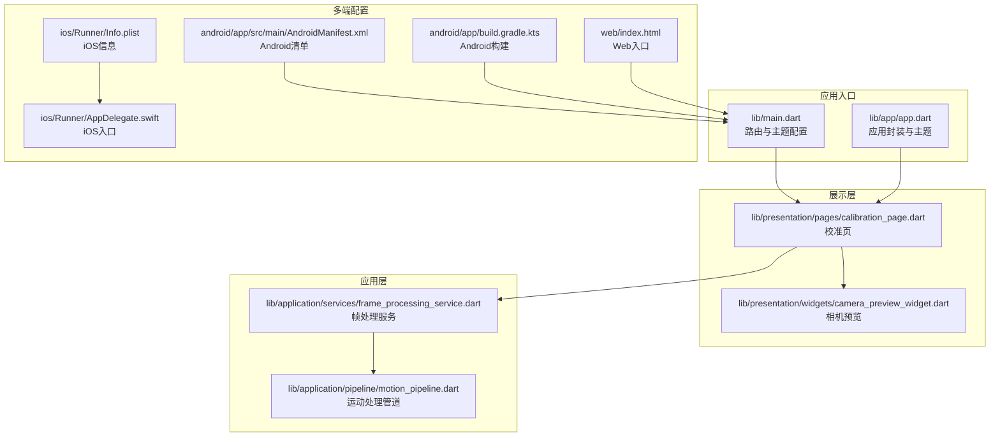
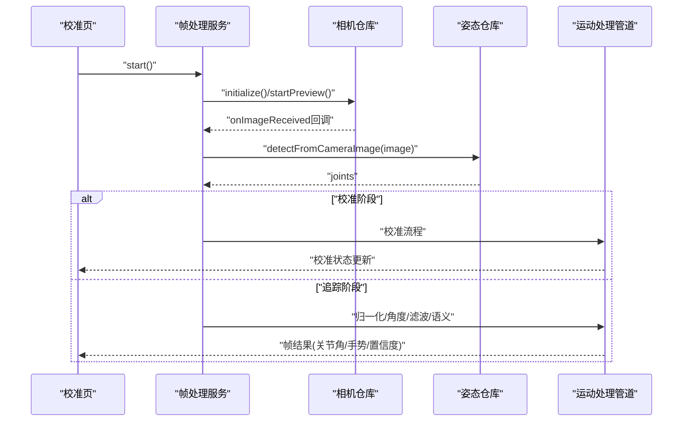
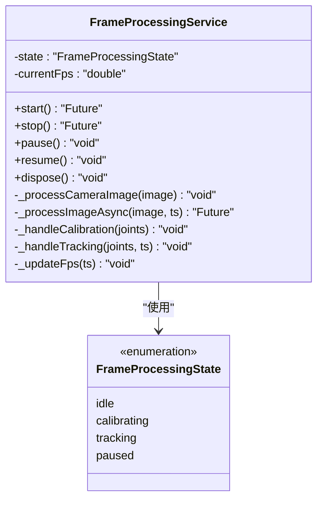
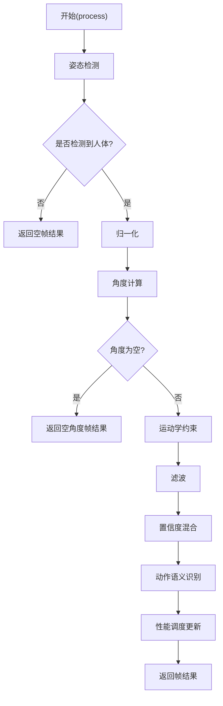
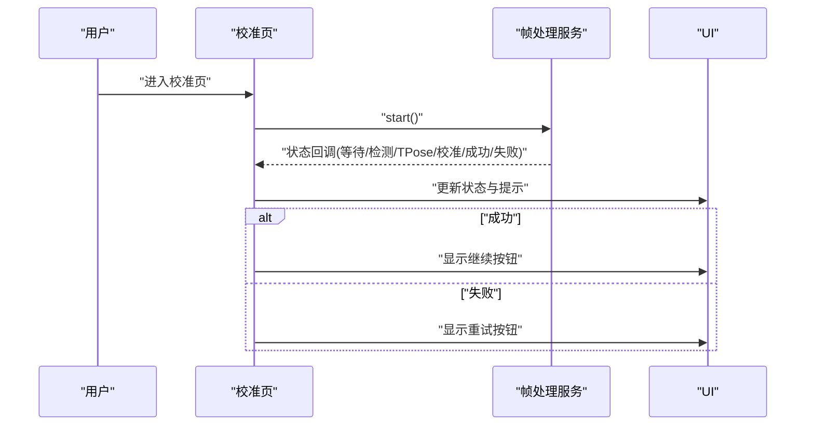
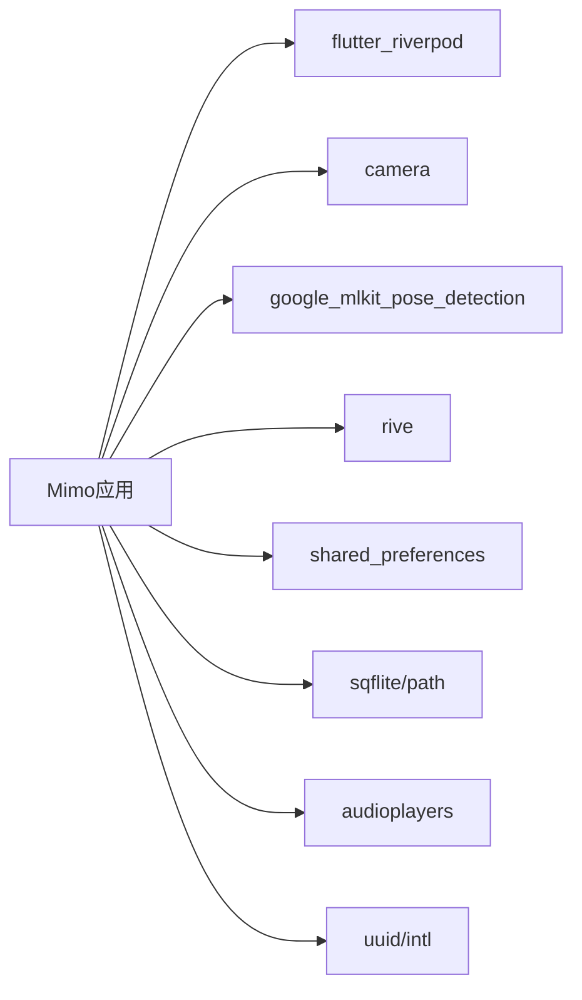
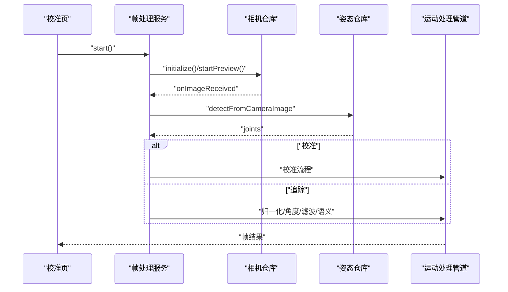

# 故障排除

<cite>
**本文引用的文件**   
- [lib/main.dart](file://lib/main.dart)
- [lib/app/app.dart](file://lib/app/app.dart)
- [lib/application/services/frame_processing_service.dart](file://lib/application/services/frame_processing_service.dart)
- [lib/application/pipeline/motion_pipeline.dart](file://lib/application/pipeline/motion_pipeline.dart)
- [lib/presentation/pages/calibration_page.dart](file://lib/presentation/pages/calibration_page.dart)
- [lib/presentation/widgets/camera_preview_widget.dart](file://lib/presentation/widgets/camera_preview_widget.dart)
- [pubspec.yaml](file://pubspec.yaml)
- [android/app/src/main/AndroidManifest.xml](file://android/app/src/main/AndroidManifest.xml)
- [android/app/build.gradle.kts](file://android/app/build.gradle.kts)
- [ios/Runner/Info.plist](file://ios/Runner/Info.plist)
- [ios/Runner/AppDelegate.swift](file://ios/Runner/AppDelegate.swift)
- [web/index.html](file://web/index.html)
</cite>

## 目录
1. [简介](#简介)
2. [项目结构](#项目结构)
3. [核心组件](#核心组件)
4. [架构总览](#架构总览)
5. [详细组件分析](#详细组件分析)
6. [依赖分析](#依赖分析)
7. [性能考虑](#性能考虑)
8. [故障排除指南](#故障排除指南)
9. [结论](#结论)
10. [附录](#附录)

## 简介
本指南面向Mimo项目的运维与开发人员，聚焦于常见问题的诊断与解决、性能瓶颈的识别与优化、平台特定问题的排查与修复、日志与调试方法、以及网络/权限/兼容性等跨领域问题的处理策略。文档同时提供问题分类与优先级评估标准、问题报告模板与信息收集清单、预防性维护与健康检查方法，以及紧急情况下的应急流程。

## 项目结构
Mimo是一个基于Flutter的跨平台应用，采用模块化分层设计：应用入口在lib目录下，业务逻辑通过Riverpod进行状态管理，核心功能围绕“摄像头采集—姿态检测—运动处理—语义识别—渲染反馈”的流水线展开。多端配置位于android、ios、web、linux、macos、windows等子工程中。

**图表来源**
- [lib/main.dart:1-34](file://lib/main.dart#L1-L34)
- [lib/app/app.dart:1-27](file://lib/app/app.dart#L1-L27)
- [lib/presentation/pages/calibration_page.dart:1-286](file://lib/presentation/pages/calibration_page.dart#L1-L286)
- [lib/presentation/widgets/camera_preview_widget.dart:1-76](file://lib/presentation/widgets/camera_preview_widget.dart#L1-L76)
- [lib/application/services/frame_processing_service.dart:1-254](file://lib/application/services/frame_processing_service.dart#L1-L254)
- [lib/application/pipeline/motion_pipeline.dart:1-141](file://lib/application/pipeline/motion_pipeline.dart#L1-L141)
- [android/app/src/main/AndroidManifest.xml:1-46](file://android/app/src/main/AndroidManifest.xml#L1-L46)
- [android/app/build.gradle.kts:1-45](file://android/app/build.gradle.kts#L1-L45)
- [ios/Runner/Info.plist:1-50](file://ios/Runner/Info.plist#L1-L50)
- [ios/Runner/AppDelegate.swift:1-14](file://ios/Runner/AppDelegate.swift#L1-L14)
- [web/index.html:1-39](file://web/index.html#L1-L39)

**章节来源**
- [lib/main.dart:1-34](file://lib/main.dart#L1-L34)
- [lib/app/app.dart:1-27](file://lib/app/app.dart#L1-L27)
- [pubspec.yaml:1-80](file://pubspec.yaml#L1-L80)

## 核心组件
- 应用入口与路由
  - 应用通过入口文件设置主题、路由与初始页面，校准页作为首屏加载。
- 帧处理服务
  - 负责初始化摄像头与姿态检测、驱动处理流水线、状态机切换（空闲/校准/追踪/暂停）、统计FPS并回调上层。
- 运动处理管道
  - 将姿态检测结果按顺序通过归一化、角度计算、运动学约束、滤波、置信度混合与语义识别，输出帧结果。
- 展示层
  - 校准页负责引导用户完成T-Pose校准，并根据状态显示提示；相机预览组件负责初始化与渲染摄像头画面。

**章节来源**
- [lib/main.dart:7-34](file://lib/main.dart#L7-L34)
- [lib/application/services/frame_processing_service.dart:29-254](file://lib/application/services/frame_processing_service.dart#L29-L254)
- [lib/application/pipeline/motion_pipeline.dart:14-141](file://lib/application/pipeline/motion_pipeline.dart#L14-L141)
- [lib/presentation/pages/calibration_page.dart:9-286](file://lib/presentation/pages/calibration_page.dart#L9-L286)
- [lib/presentation/widgets/camera_preview_widget.dart:7-76](file://lib/presentation/widgets/camera_preview_widget.dart#L7-L76)

## 架构总览
Mimo采用“展示层-应用层-领域层-数据层”的分层架构，配合Riverpod进行状态管理与依赖注入。核心数据流自摄像头采集开始，经姿态检测与运动处理流水线，最终反馈到UI与音效/动画等表现层。

**图表来源**
- [lib/presentation/pages/calibration_page.dart:31-45](file://lib/presentation/pages/calibration_page.dart#L31-L45)
- [lib/application/services/frame_processing_service.dart:71-148](file://lib/application/services/frame_processing_service.dart#L71-L148)
- [lib/application/pipeline/motion_pipeline.dart:61-130](file://lib/application/pipeline/motion_pipeline.dart#L61-L130)

## 详细组件分析

### 组件A：帧处理服务（FrameProcessingService）
- 职责
  - 管理摄像头与姿态检测初始化、图像流接收、状态机切换、FPS统计、异常捕获与资源释放。
- 关键流程
  - 启动：初始化相机与姿态仓库，注册图像回调，进入校准状态。
  - 处理：异步调用姿态检测，根据状态执行校准或追踪分支；追踪时进行归一化、角度计算、运动学约束、滤波、置信度混合与语义识别。
  - 停止/暂停：停止预览、取消订阅、释放资源。
- 错误处理
  - 启动与处理过程中均包含try-catch，打印错误信息；建议在生产环境统一上报与降级处理。
- 性能指标
  - 每秒帧数统计，供UI显示与性能监控。

**图表来源**
- [lib/application/services/frame_processing_service.dart:21-254](file://lib/application/services/frame_processing_service.dart#L21-L254)

**章节来源**
- [lib/application/services/frame_processing_service.dart:29-254](file://lib/application/services/frame_processing_service.dart#L29-L254)

### 组件B：运动处理管道（MotionPipeline）
- 职责
  - 串联姿态检测、置信度处理、归一化、角度计算、运动学约束、滤波、语义识别与性能调度。
- 关键流程
  - 输入：图像、宽高、时间戳。
  - 输出：帧结果（关节角、手势、置信度、时间戳）。
- 性能
  - 记录处理耗时并更新调度器，便于动态调节帧率与延迟。

**图表来源**
- [lib/application/pipeline/motion_pipeline.dart:53-130](file://lib/application/pipeline/motion_pipeline.dart#L53-L130)

**章节来源**
- [lib/application/pipeline/motion_pipeline.dart:14-141](file://lib/application/pipeline/motion_pipeline.dart#L14-L141)

### 组件C：校准页（CalibrationPage）
- 职责
  - 引导用户完成T-Pose校准，显示实时状态与进度，成功后跳转首页。
- 关键流程
  - 初始化帧处理服务，注册帧结果回调，启动处理；根据状态更新UI与交互。
- 平台差异
  - iOS/Android/Windows/Linux/macOS/Web等平台需保证相机权限与前置/后置摄像头可用性一致。

**图表来源**
- [lib/presentation/pages/calibration_page.dart:31-45](file://lib/presentation/pages/calibration_page.dart#L31-L45)
- [lib/application/services/frame_processing_service.dart:71-88](file://lib/application/services/frame_processing_service.dart#L71-L88)

**章节来源**
- [lib/presentation/pages/calibration_page.dart:9-286](file://lib/presentation/pages/calibration_page.dart#L9-L286)

### 组件D：相机预览组件（CameraPreviewWidget）
- 职责
  - 初始化相机控制器、适配屏幕比例并渲染预览。
- 关键点
  - 初始化失败时显示加载指示器；销毁时释放控制器。

**章节来源**
- [lib/presentation/widgets/camera_preview_widget.dart:7-76](file://lib/presentation/widgets/camera_preview_widget.dart#L7-L76)

## 依赖分析
- 核心依赖
  - 状态管理：flutter_riverpod
  - 摄像头：camera
  - 姿态检测：google_mlkit_pose_detection
  - 渲染：rive（动画）、Material（UI）
  - 存储：shared_preferences、sqflite、path
  - 音效：audioplayers
  - 工具：uuid、intl
- 多端支持
  - Android/iOS/Windows/Linux/macOS/Web均有对应工程配置。

**图表来源**
- [pubspec.yaml:30-60](file://pubspec.yaml#L30-L60)

**章节来源**
- [pubspec.yaml:1-80](file://pubspec.yaml#L1-L80)

## 性能考虑
- 流水线开销
  - 姿态检测、归一化、角度计算、滤波、语义识别均为CPU/GPU密集操作，应关注帧率与延迟。
- 资源管理
  - 相机预览与姿态检测需在页面销毁时释放，避免内存泄漏与后台占用。
- 调度与节流
  - 使用性能调度器动态调整帧率与处理频率，降低功耗与发热。
- UI刷新
  - FPS与状态更新应避免过度重建，结合Riverpod选择性订阅。

[本节为通用指导，无需具体文件分析]

## 故障排除指南

### 一、问题分类与优先级评估
- P0（紧急）：应用崩溃、无法启动、无画面、无声音、系统卡死
- P1（高）：功能不可用（如校准失败、追踪丢失）、严重卡顿、频繁ANR
- P2（中）：UI显示异常、部分手势不识别、轻微延迟
- P3（低）：日志噪声、小UI错位、非关键提示缺失

### 二、问题报告模板
- 问题标题：简明描述现象
- 版本信息：应用版本、Flutter SDK、平台版本
- 设备信息：机型、系统版本、摄像头型号、内存/CPU
- 复现步骤：最小可复现路径
- 预期行为：期望结果
- 实际行为：实际结果
- 日志/截图：关键日志片段、错误截图、视频
- 附件：设备日志、系统日志、抓包文件（如涉及网络）

### 三、信息收集清单
- 应用日志：控制台输出、异常堆栈
- 系统日志：Android Logcat、iOS Console、Windows Event Viewer
- 性能指标：FPS、CPU/内存/电量、GPU占用
- 环境变量：相机权限、网络状态、存储空间
- 配置文件：AndroidManifest、Info.plist、构建脚本

### 四、常见问题与处置

#### 1. 相机相关问题
- 症状
  - 无法打开相机、黑屏、预览不显示、权限被拒
- 诊断
  - 检查相机权限声明与运行时授权；确认前置/后置摄像头可用；查看初始化异常日志
- 解决
  - 在Android清单中确保必要权限与查询意图；在iOS Info.plist中配置隐私描述；在页面初始化失败时提示用户手动授予权限

**章节来源**
- [android/app/src/main/AndroidManifest.xml:1-46](file://android/app/src/main/AndroidManifest.xml#L1-L46)
- [ios/Runner/Info.plist:1-50](file://ios/Runner/Info.plist#L1-L50)
- [lib/presentation/widgets/camera_preview_widget.dart:25-35](file://lib/presentation/widgets/camera_preview_widget.dart#L25-L35)

#### 2. 姿态检测与追踪问题
- 症状
  - 无法检测到人体、追踪丢失、角度异常、帧率骤降
- 诊断
  - 检查帧处理服务状态机流转、日志中的异常与空姿态分支；观察FPS与处理耗时
- 解决
  - 重置流水线与引擎状态；优化滤波参数；在无姿态时回退到idle状态并提示用户；必要时降低分辨率或帧率

**章节来源**
- [lib/application/services/frame_processing_service.dart:109-148](file://lib/application/services/frame_processing_service.dart#L109-L148)
- [lib/application/pipeline/motion_pipeline.dart:69-74](file://lib/application/pipeline/motion_pipeline.dart#L69-L74)

#### 3. 校准问题
- 症状
  - 校准失败、进度条卡住、提示“请重试”
- 诊断
  - 查看校准引擎状态与阈值；确认用户是否保持T-Pose；检查光照与背景
- 解决
  - 提示用户调整姿势与环境；允许重新开始校准；记录失败原因以便后续优化

**章节来源**
- [lib/presentation/pages/calibration_page.dart:115-182](file://lib/presentation/pages/calibration_page.dart#L115-L182)
- [lib/application/services/frame_processing_service.dart:150-167](file://lib/application/services/frame_processing_service.dart#L150-L167)

#### 4. 平台特定问题
- Android
  - 权限与硬件加速：检查清单与硬件加速配置；确认NDK/SDK版本匹配
- iOS
  - 隐私描述与入口：确保Info.plist中相机/麦克风隐私描述；AppDelegate正确注册插件
- Web
  - 兼容性与HTTPS：确保媒体访问与HTTPS；检查基础路径与manifest
- 桌面端（Windows/Linux/macOS）
  - 构建与资源：确认CMakeLists与资源路径；检查权限与驱动

**章节来源**
- [android/app/build.gradle.kts:8-45](file://android/app/build.gradle.kts#L8-L45)
- [ios/Runner/AppDelegate.swift:1-14](file://ios/Runner/AppDelegate.swift#L1-L14)
- [web/index.html:17-33](file://web/index.html#L17-L33)

#### 5. 网络与离线问题
- 症状
  - 首次启动缓慢、在线功能不可用
- 诊断
  - 检查网络连通性与DNS；确认离线缓存策略
- 解决
  - 降级到离线模式；缓存常用资源；对网络请求增加超时与重试

[本节为通用指导，无需具体文件分析]

#### 6. 权限问题
- Android
  - 在清单中声明相机权限；在运行时请求权限；处理拒绝后的降级提示
- iOS
  - 在Info.plist中添加相机使用说明；首次请求权限并处理拒绝
- Web
  - 确保HTTPS与用户交互触发媒体访问

**章节来源**
- [android/app/src/main/AndroidManifest.xml:1-46](file://android/app/src/main/AndroidManifest.xml#L1-L46)
- [ios/Runner/Info.plist:1-50](file://ios/Runner/Info.plist#L1-L50)

#### 7. 兼容性问题
- 不同分辨率与设备形态
  - 预览缩放适配；避免裁剪导致的姿态检测偏差
- 操作系统版本差异
  - 检查API可用性与默认行为差异；对旧系统做降级处理

**章节来源**
- [lib/presentation/widgets/camera_preview_widget.dart:63-75](file://lib/presentation/widgets/camera_preview_widget.dart#L63-L75)

#### 8. 日志分析与调试工具
- 控制台日志
  - 收集启动、初始化、异常与状态切换日志
- 平台日志
  - Android：logcat过滤应用PID；iOS：Console连接设备；桌面端：系统事件查看器
- 性能分析
  - 使用Flutter DevTools监控UI渲染、内存、网络与性能；结合帧处理服务的FPS与耗时指标

[本节为通用指导，无需具体文件分析]

### 五、预防性维护与健康检查
- 健康检查
  - 启动自检：相机初始化、权限、网络连通性
  - 运行期巡检：FPS阈值、异常计数、资源占用
- 预防措施
  - 降级策略：离线模式、简化滤波、降低帧率
  - 缓存与持久化：校准数据、模型权重、配置项
  - 版本灰度：新功能灰度发布与回滚预案

[本节为通用指导，无需具体文件分析]

### 六、紧急情况应急流程
- 快速止损
  - 禁用高负载功能、回退到安全模式、释放全部资源
- 信息收集
  - 截图、日志、设备信息打包上传
- 升级响应
  - 发布热修复、回滚版本、通知用户

[本节为通用指导，无需具体文件分析]

## 结论
本指南提供了Mimo项目从架构到实现层面的故障排除方法论与实操步骤。通过明确问题分类与优先级、规范问题报告与信息收集、结合平台特性与性能指标进行定位与优化，可显著提升问题解决效率与用户体验稳定性。建议团队建立标准化的健康检查与应急流程，并持续完善日志与监控体系。

## 附录

### A. 关键流程图（代码级）

**图表来源**
- [lib/application/services/frame_processing_service.dart:71-148](file://lib/application/services/frame_processing_service.dart#L71-L148)
- [lib/application/pipeline/motion_pipeline.dart:61-130](file://lib/application/pipeline/motion_pipeline.dart#L61-L130)