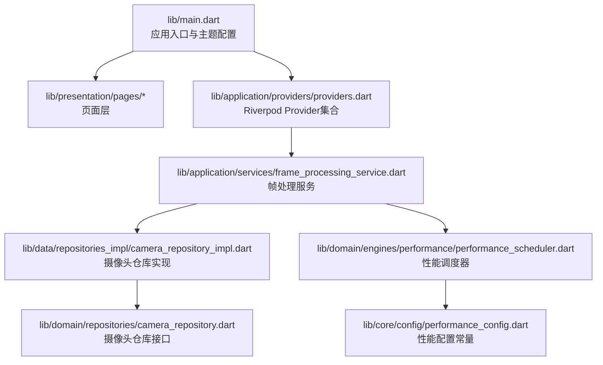
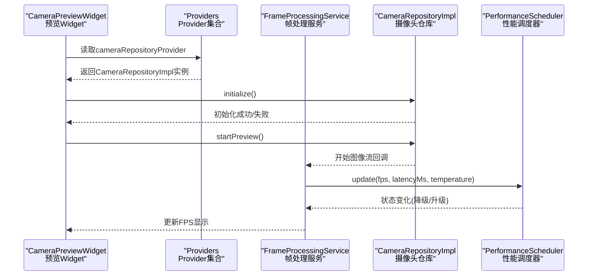
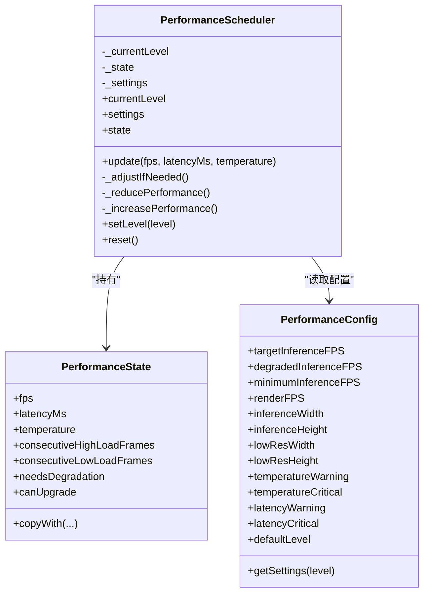
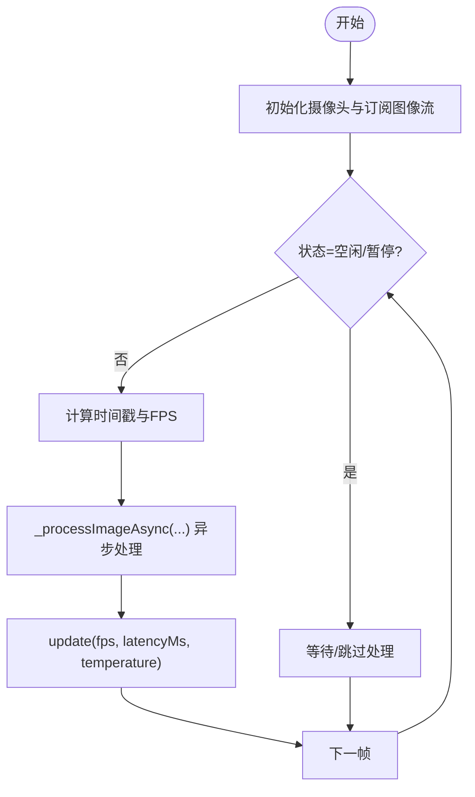
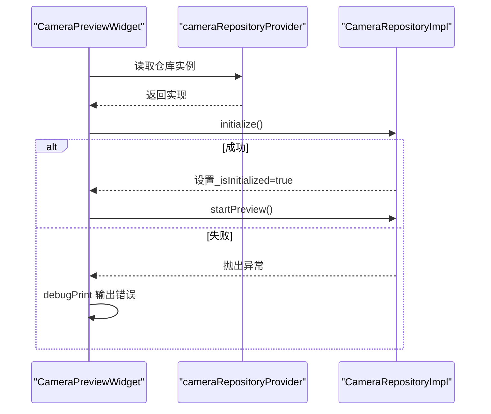
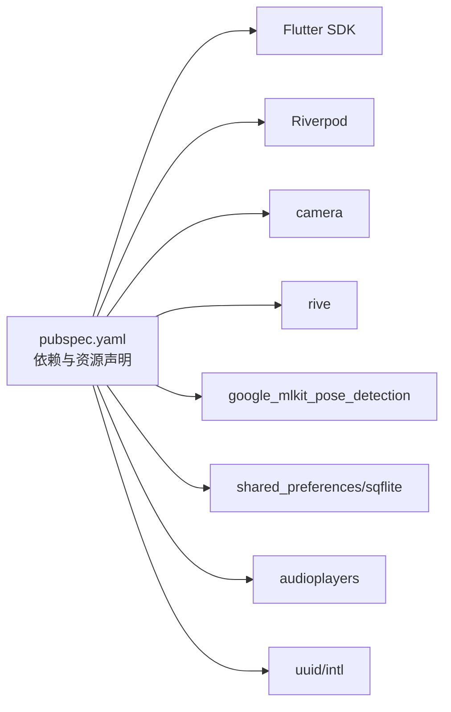

# 调试工具与日志分析

<cite>
**本文引用的文件**
- [lib/main.dart](file://lib/main.dart)
- [pubspec.yaml](file://pubspec.yaml)
- [lib/core/config/performance_config.dart](file://lib/core/config/performance_config.dart)
- [lib/domain/engines/performance/performance_scheduler.dart](file://lib/domain/engines/performance/performance_scheduler.dart)
- [lib/application/providers/providers.dart](file://lib/application/providers/providers.dart)
- [lib/application/services/frame_processing_service.dart](file://lib/application/services/frame_processing_service.dart)
- [lib/presentation/widgets/camera_preview_widget.dart](file://lib/presentation/widgets/camera_preview_widget.dart)
- [lib/data/repositories_impl/camera_repository_impl.dart](file://lib/data/repositories_impl/camera_repository_impl.dart)
- [lib/domain/repositories/camera_repository.dart](file://lib/domain/repositories/camera_repository.dart)
- [android/app/src/debug/AndroidManifest.xml](file://android/app/src/debug/AndroidManifest.xml)
- [android/app/src/profile/AndroidManifest.xml](file://android/app/src/profile/AndroidManifest.xml)
- [ios/Runner.xcodeproj/xcshareddata/xcschemes/Runner.xcscheme](file://ios/Runner.xcodeproj/xcshareddata/xcschemes/Runner.xcscheme)
</cite>

## 目录
1. [简介](#简介)
2. [项目结构](#项目结构)
3. [核心组件](#核心组件)
4. [架构总览](#架构总览)
5. [详细组件分析](#详细组件分析)
6. [依赖关系分析](#依赖关系分析)
7. [性能与调试要点](#性能与调试要点)
8. [日志系统与级别管理](#日志系统与级别管理)
9. [断点调试与变量监视](#断点调试与变量监视)
10. [调用栈分析与远程调试](#调用栈分析与远程调试)
11. [第三方工具与自定义调试器](#第三方工具与自定义调试器)
12. [日志收集、分析与问题重现流程](#日志收集分析与问题重现流程)
13. [自动化测试与CI中的调试策略](#自动化测试与ci中的调试策略)
14. [结论](#结论)

## 简介
本指南面向Mimo项目，聚焦于调试工具与日志分析，覆盖Flutter DevTools使用、性能分析、日志配置与级别管理、断点调试、变量监视、调用栈分析、远程调试与生产问题定位、第三方工具集成与自定义调试器、日志收集与问题重现流程，以及自动化测试与持续集成中的调试策略。文档基于仓库中现有代码与配置进行说明，并提供可视化图示帮助理解。

## 项目结构
Mimo是一个基于Flutter的跨平台应用，采用Riverpod状态管理，包含摄像头、姿态检测、Rive动画、音效播放等模块。项目根目录包含多平台工程（android、ios、linux、macos、windows）与Flutter应用源码（lib）。关键入口为lib/main.dart，应用通过ProviderScope包裹MyApp，路由包含校准页、主页与设置页。

图表来源
- [lib/main.dart:1-34](file://lib/main.dart#L1-L34)
- [lib/application/providers/providers.dart:1-104](file://lib/application/providers/providers.dart#L1-L104)
- [lib/application/services/frame_processing_service.dart:21-121](file://lib/application/services/frame_processing_service.dart#L21-L121)
- [lib/data/repositories_impl/camera_repository_impl.dart:1-97](file://lib/data/repositories_impl/camera_repository_impl.dart#L1-L97)
- [lib/domain/engines/performance/performance_scheduler.dart:1-194](file://lib/domain/engines/performance/performance_scheduler.dart#L1-L194)
- [lib/core/config/performance_config.dart:1-79](file://lib/core/config/performance_config.dart#L1-L79)
- [lib/domain/repositories/camera_repository.dart:1-28](file://lib/domain/repositories/camera_repository.dart#L1-L28)

章节来源
- [lib/main.dart:1-34](file://lib/main.dart#L1-L34)
- [pubspec.yaml:1-80](file://pubspec.yaml#L1-L80)

## 核心组件
- 应用入口与路由：在lib/main.dart中定义MaterialApp、主题与路由表，初始路由指向校准页。
- Provider体系：在lib/application/providers/providers.dart中集中声明各领域引擎与服务的Provider，包括姿态处理流水线、性能调度器、角度计算服务等。
- 帧处理服务：在lib/application/services/frame_processing_service.dart中连接摄像头图像流，驱动姿态检测与运动处理流水线，并维护FPS统计。
- 摄像头仓库：在lib/data/repositories_impl/camera_repository_impl.dart中封装camera包的CameraController初始化、预览控制与切换摄像头逻辑；接口定义见lib/domain/repositories/camera_repository.dart。
- 性能配置与调度：在lib/core/config/performance_config.dart中定义目标/降级/最低推理帧率、分辨率与阈值；在lib/domain/engines/performance/performance_scheduler.dart中实现自动降级/升级策略与状态更新。

章节来源
- [lib/main.dart:7-34](file://lib/main.dart#L7-L34)
- [lib/application/providers/providers.dart:17-104](file://lib/application/providers/providers.dart#L17-L104)
- [lib/application/services/frame_processing_service.dart:21-121](file://lib/application/services/frame_processing_service.dart#L21-L121)
- [lib/data/repositories_impl/camera_repository_impl.dart:1-97](file://lib/data/repositories_impl/camera_repository_impl.dart#L1-L97)
- [lib/domain/repositories/camera_repository.dart:1-28](file://lib/domain/repositories/camera_repository.dart#L1-L28)
- [lib/core/config/performance_config.dart:1-79](file://lib/core/config/performance_config.dart#L1-L79)
- [lib/domain/engines/performance/performance_scheduler.dart:1-194](file://lib/domain/engines/performance/performance_scheduler.dart#L1-L194)

## 架构总览
下图展示从UI到数据与引擎的端到端交互路径，突出调试关注点：Provider注入、摄像头初始化与图像流、性能调度与FPS监控、姿态处理流水线。

图表来源
- [lib/presentation/widgets/camera_preview_widget.dart:1-49](file://lib/presentation/widgets/camera_preview_widget.dart#L1-L49)
- [lib/application/providers/providers.dart:17-30](file://lib/application/providers/providers.dart#L17-L30)
- [lib/application/services/frame_processing_service.dart:90-121](file://lib/application/services/frame_processing_service.dart#L90-L121)
- [lib/data/repositories_impl/camera_repository_impl.dart:50-61](file://lib/data/repositories_impl/camera_repository_impl.dart#L50-L61)
- [lib/domain/engines/performance/performance_scheduler.dart:90-129](file://lib/domain/engines/performance/performance_scheduler.dart#L90-L129)

## 详细组件分析

### 性能调度器与配置
性能调度器根据温度、延迟与FPS阈值动态调整推理帧率与分辨率，避免设备过热或卡顿。其状态包含连续高/低负载帧计数，用于平滑升降级决策。

图表来源
- [lib/core/config/performance_config.dart:1-79](file://lib/core/config/performance_config.dart#L1-L79)
- [lib/domain/engines/performance/performance_scheduler.dart:1-194](file://lib/domain/engines/performance/performance_scheduler.dart#L1-L194)

章节来源
- [lib/core/config/performance_config.dart:1-79](file://lib/core/config/performance_config.dart#L1-L79)
- [lib/domain/engines/performance/performance_scheduler.dart:1-194](file://lib/domain/engines/performance/performance_scheduler.dart#L1-L194)

### 帧处理服务与FPS统计
帧处理服务负责启动摄像头图像流、统计FPS、异步处理图像并驱动性能调度器。它维护状态机（空闲/校准/跟踪/暂停），并在暂停状态下跳过处理。

图表来源
- [lib/application/services/frame_processing_service.dart:90-121](file://lib/application/services/frame_processing_service.dart#L90-L121)
- [lib/domain/engines/performance/performance_scheduler.dart:90-129](file://lib/domain/engines/performance/performance_scheduler.dart#L90-L129)

章节来源
- [lib/application/services/frame_processing_service.dart:21-121](file://lib/application/services/frame_processing_service.dart#L21-L121)

### 摄像头仓库与预览Widget
预览Widget在初始化时读取cameraRepositoryProvider并尝试初始化摄像头控制器；若初始化失败，使用debugPrint输出错误信息。摄像头仓库封装了初始化、开始/停止预览、切换摄像头与资源释放。

图表来源
- [lib/presentation/widgets/camera_preview_widget.dart:1-49](file://lib/presentation/widgets/camera_preview_widget.dart#L1-L49)
- [lib/data/repositories_impl/camera_repository_impl.dart:19-47](file://lib/data/repositories_impl/camera_repository_impl.dart#L19-L47)

章节来源
- [lib/presentation/widgets/camera_preview_widget.dart:1-49](file://lib/presentation/widgets/camera_preview_widget.dart#L1-L49)
- [lib/data/repositories_impl/camera_repository_impl.dart:1-97](file://lib/data/repositories_impl/camera_repository_impl.dart#L1-L97)
- [lib/domain/repositories/camera_repository.dart:1-28](file://lib/domain/repositories/camera_repository.dart#L1-L28)

## 依赖关系分析
- 语言与框架：Dart SDK版本要求，Flutter SDK依赖，Riverpod状态管理。
- 外部库：camera、rive、google_mlkit_pose_detection、shared_preferences、sqflite、audioplayers、uuid、intl等。
- 资源：assets/rive/ 与 assets/sounds/。

图表来源
- [pubspec.yaml:21-78](file://pubspec.yaml#L21-L78)

章节来源
- [pubspec.yaml:1-80](file://pubspec.yaml#L1-L80)

## 性能与调试要点
- 性能阈值与降级策略：当温度、延迟或FPS超过阈值时触发降级；当条件稳定后允许升级。建议在调试时观察FPS指示器与性能状态变化，结合设备温度监控验证策略有效性。
- FPS指标：主页顶部栏包含FPS指示器，便于直观评估性能。帧处理服务负责统计与上报。
- 调试构建权限：Android Debug/Profile构建均声明INTERNET权限，确保DevTools与热重载通信正常。

章节来源
- [lib/core/config/performance_config.dart:25-31](file://lib/core/config/performance_config.dart#L25-L31)
- [lib/domain/engines/performance/performance_scheduler.dart:28-40](file://lib/domain/engines/performance/performance_scheduler.dart#L28-L40)
- [lib/presentation/pages/home_page.dart:121-137](file://lib/presentation/pages/home_page.dart#L121-L137)
- [android/app/src/debug/AndroidManifest.xml:1-7](file://android/app/src/debug/AndroidManifest.xml#L1-L7)
- [android/app/src/profile/AndroidManifest.xml:1-7](file://android/app/src/profile/AndroidManifest.xml#L1-L7)

## 日志系统与级别管理
- 当前代码中的日志输出：预览Widget在初始化失败时使用debugPrint输出错误信息，便于快速定位摄像头初始化问题。
- 建议的日志级别管理：
  - 调试(Debug)：开发期的详细信息，如初始化参数、内部状态。
  - 信息(Info)：常规运行信息，如启动完成、状态切换。
  - 警告(Warn)：潜在问题但不影响功能，如性能降级触发。
  - 错误(Error)：异常与失败，如摄像头不可用、推理失败。
- 日志采集建议：在关键路径（初始化、图像流回调、性能调整、错误处理）记录结构化日志，便于后续检索与分析。

章节来源
- [lib/presentation/widgets/camera_preview_widget.dart:32-34](file://lib/presentation/widgets/camera_preview_widget.dart#L32-L34)

## 断点调试与变量监视
- Flutter断点：在IDE中对关键函数（如initialize、startPreview、update、_processImageAsync）设置断点，逐步执行观察变量变化。
- 变量监视：重点监视摄像头控制器状态、图像流回调次数、FPS计数器、性能调度器状态与设置变更。
- 条件断点：在性能调度器的阈值判断处设置条件断点，仅在温度/延迟/FPS越界时触发，提高调试效率。

章节来源
- [lib/data/repositories_impl/camera_repository_impl.dart:19-47](file://lib/data/repositories_impl/camera_repository_impl.dart#L19-L47)
- [lib/application/services/frame_processing_service.dart:90-121](file://lib/application/services/frame_processing_service.dart#L90-L121)
- [lib/domain/engines/performance/performance_scheduler.dart:90-129](file://lib/domain/engines/performance/performance_scheduler.dart#L90-L129)

## 调用栈分析与远程调试
- 调用栈：在异常或性能异常时，查看调用栈定位从UI到仓库再到引擎的完整路径，确认问题发生在初始化、图像流、处理管线还是调度器。
- 远程调试：确保Android Debug/Profile构建具备INTERNET权限，以便通过DevTools连接设备进行远程调试。iOS可通过Xcode Scheme选择LLDB调试器进行本地/远程调试。

章节来源
- [android/app/src/debug/AndroidManifest.xml:1-7](file://android/app/src/debug/AndroidManifest.xml#L1-L7)
- [android/app/src/profile/AndroidManifest.xml:1-7](file://android/app/src/profile/AndroidManifest.xml#L1-L7)
- [ios/Runner.xcodeproj/xcshareddata/xcschemes/Runner.xcscheme:54-76](file://ios/Runner.xcodeproj/xcshareddata/xcschemes/Runner.xcscheme#L54-L76)

## 第三方工具与自定义调试器
- Flutter DevTools：用于性能分析（Timeline、Memory、CPU/GPU）、网络请求检查、对象检查与状态树浏览。
- 自定义调试器：可在帧处理服务中增加额外的采样点（如每N帧记录一次性能指标），并将结果导出至文件或日志系统，便于离线分析。

章节来源
- [lib/application/services/frame_processing_service.dart:46-50](file://lib/application/services/frame_processing_service.dart#L46-L50)

## 日志收集、分析与问题重现流程
- 标准化流程建议：
  1) 问题发现：通过UI指标（FPS、性能降级提示）或用户反馈定位。
  2) 现场日志：开启详细日志（调试级别），记录初始化、图像流、处理阶段与调度器状态。
  3) 数据导出：将日志按时间序列保存，附带设备型号、系统版本、构建类型。
  4) 分析与重现：在相同设备/条件下重现问题，对比日志与调用栈，定位瓶颈或异常分支。
  5) 修复与回归：修复后在CI中回归测试，确保问题不再出现。

章节来源
- [lib/presentation/pages/home_page.dart:121-137](file://lib/presentation/pages/home_page.dart#L121-L137)
- [lib/application/services/frame_processing_service.dart:90-121](file://lib/application/services/frame_processing_service.dart#L90-L121)

## 自动化测试与CI中的调试策略
- 单元测试：针对性能调度器的关键阈值与状态转换编写测试，覆盖高/中/低负载场景。
- 集成测试：模拟摄像头初始化与图像流回调，验证帧处理服务在不同性能级别下的行为。
- CI策略：在CI中运行测试套件，收集日志与覆盖率报告；对性能相关测试设置阈值（如FPS波动范围），失败时触发告警与回滚。

章节来源
- [lib/domain/engines/performance/performance_scheduler.dart:132-146](file://lib/domain/engines/performance/performance_scheduler.dart#L132-L146)
- [lib/application/providers/providers.dart:57-60](file://lib/application/providers/providers.dart#L57-L60)

## 结论
通过对Provider体系、帧处理服务、摄像头仓库与性能调度器的深入分析，结合Flutter DevTools与现有日志输出，可建立一套完整的调试与日志分析流程。建议在开发与测试阶段充分利用断点、变量监视与调用栈分析，在生产环境通过结构化日志与阈值监控实现问题快速定位与修复。