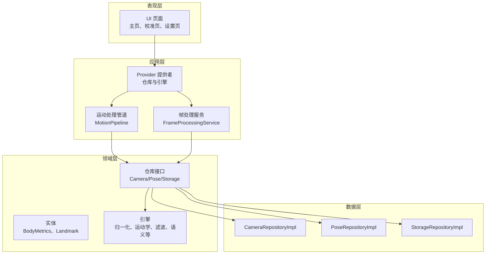
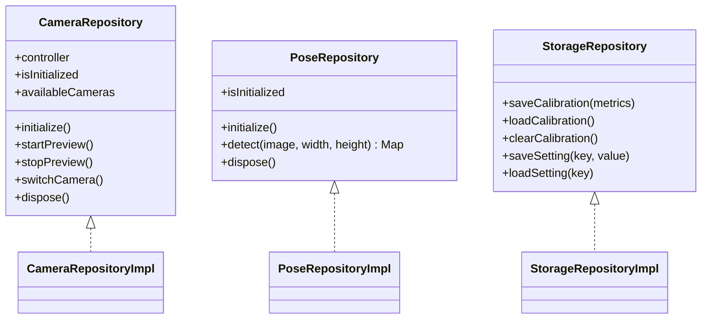
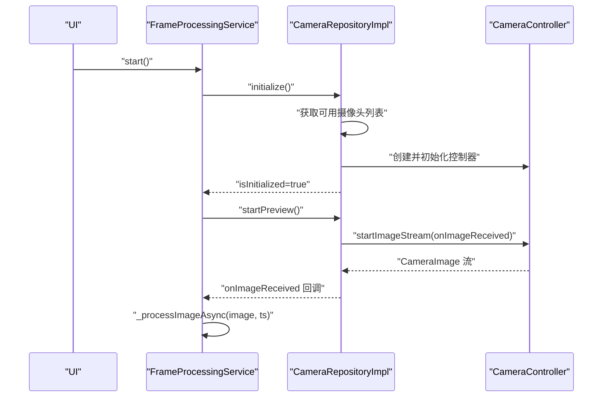
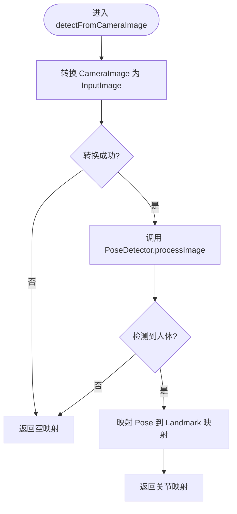
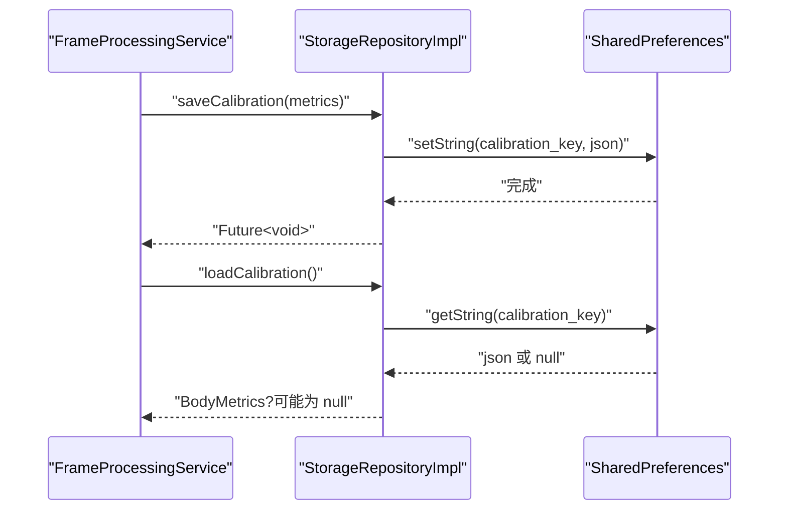
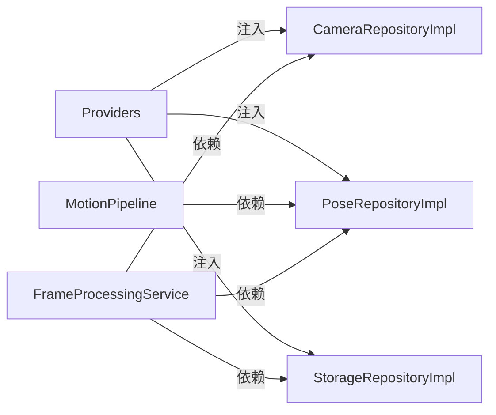
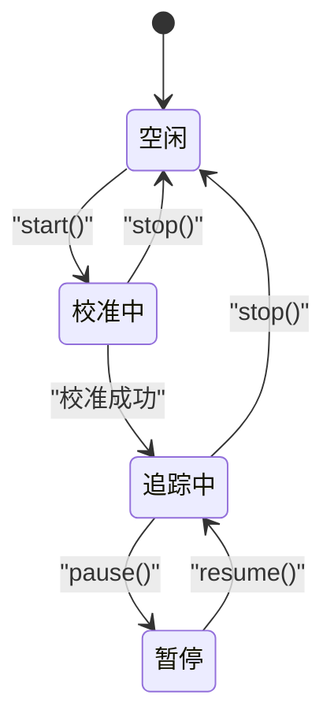
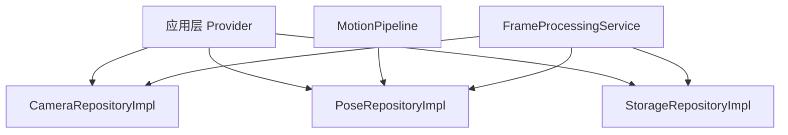

# 仓库模式实现

<cite>
**本文档引用的文件**
- [lib/main.dart](file://lib/main.dart)
- [lib/domain/repositories/camera_repository.dart](file://lib/domain/repositories/camera_repository.dart)
- [lib/domain/repositories/pose_repository.dart](file://lib/domain/repositories/pose_repository.dart)
- [lib/domain/repositories/storage_repository.dart](file://lib/domain/repositories/storage_repository.dart)
- [lib/data/repositories_impl/camera_repository_impl.dart](file://lib/data/repositories_impl/camera_repository_impl.dart)
- [lib/data/repositories_impl/pose_repository_impl.dart](file://lib/data/repositories_impl/pose_repository_impl.dart)
- [lib/data/repositories_impl/storage_repository_impl.dart](file://lib/data/repositories_impl/storage_repository_impl.dart)
- [lib/domain/entities/body_metrics.dart](file://lib/domain/entities/body_metrics.dart)
- [lib/domain/entities/landmark.dart](file://lib/domain/entities/landmark.dart)
- [lib/domain/services/pose_mapping_service.dart](file://lib/domain/services/pose_mapping_service.dart)
- [lib/application/providers/providers.dart](file://lib/application/providers/providers.dart)
- [lib/application/pipeline/motion_pipeline.dart](file://lib/application/pipeline/motion_pipeline.dart)
- [lib/application/services/frame_processing_service.dart](file://lib/application/services/frame_processing_service.dart)
</cite>

## 目录
1. [简介](#简介)
2. [项目结构](#项目结构)
3. [核心组件](#核心组件)
4. [架构总览](#架构总览)
5. [详细组件分析](#详细组件分析)
6. [依赖分析](#依赖分析)
7. [性能考虑](#性能考虑)
8. [故障排除指南](#故障排除指南)
9. [结论](#结论)
10. [附录](#附录)

## 简介
本文件系统性梳理 Mimo 项目中“仓库模式”的实现与 Clean Architecture 中的作用。仓库模式作为数据访问层的抽象，向上隔离 Domain 层对具体数据源（摄像头、姿态检测、本地存储）的依赖，向下封装平台差异与第三方库细节。本文将重点解析 CameraRepository、PoseRepository、StorageRepository 的接口与实现，阐述数据访问抽象的设计原则、与 Domain 的交互方式、依赖倒置的应用、错误处理与异常管理策略、异步操作与状态管理，并给出测试策略与模拟对象的使用建议。

## 项目结构
Mimo 采用典型的 Clean Architecture 分层组织：
- domain：定义实体、仓库接口与业务规则
- data：提供仓库接口的具体实现
- application：编排层（Provider、管道、服务），协调各引擎与仓库
- presentation：UI 层（页面与部件）
- main.dart：应用入口与路由配置

图表来源
- [lib/application/providers/providers.dart:16-83](file://lib/application/providers/providers.dart#L16-L83)
- [lib/application/pipeline/motion_pipeline.dart:14-141](file://lib/application/pipeline/motion_pipeline.dart#L14-L141)
- [lib/application/services/frame_processing_service.dart:29-254](file://lib/application/services/frame_processing_service.dart#L29-L254)
- [lib/domain/repositories/camera_repository.dart:1-28](file://lib/domain/repositories/camera_repository.dart#L1-L28)
- [lib/domain/repositories/pose_repository.dart:1-23](file://lib/domain/repositories/pose_repository.dart#L1-L23)
- [lib/domain/repositories/storage_repository.dart:1-19](file://lib/domain/repositories/storage_repository.dart#L1-L19)
- [lib/data/repositories_impl/camera_repository_impl.dart:1-97](file://lib/data/repositories_impl/camera_repository_impl.dart#L1-L97)
- [lib/data/repositories_impl/pose_repository_impl.dart:1-203](file://lib/data/repositories_impl/pose_repository_impl.dart#L1-L203)
- [lib/data/repositories_impl/storage_repository_impl.dart:1-115](file://lib/data/repositories_impl/storage_repository_impl.dart#L1-L115)

章节来源
- [lib/main.dart:7-34](file://lib/main.dart#L7-L34)
- [lib/application/providers/providers.dart:16-83](file://lib/application/providers/providers.dart#L16-L83)

## 核心组件
本节聚焦三个仓库接口及其具体实现，说明其职责边界、方法契约与实现细节。

- 摄像头仓库接口 CameraRepository
  - 职责：提供摄像头控制器、初始化、预览控制、切换摄像头、释放资源、查询可用摄像头列表
  - 关键方法：initialize、startPreview、stopPreview、switchCamera、dispose、availableCameras
  - 设计要点：通过抽象接口屏蔽底层 CameraController 的平台差异；提供 isInitialized 状态位；暴露 onImageReceived 回调以便上层订阅图像流

- 姿态检测仓库接口 PoseRepository
  - 职责：提供姿态检测能力，支持从图像输入检测关键点映射
  - 关键方法：detect、initialize、dispose、isInitialized
  - 设计要点：detect 接受动态图像输入与尺寸参数；内部通过 Google ML Kit 进行检测；提供 detectFromCameraImage 以适配 CameraImage 流

- 存储仓库接口 StorageRepository
  - 职责：提供校准数据与用户设置的持久化能力
  - 关键方法：saveCalibration、loadCalibration、clearCalibration、saveSetting、loadSetting
  - 设计要点：统一键空间与类型编码/解码；支持泛型加载；提供便捷的布尔/整数/双精度存取方法

章节来源
- [lib/domain/repositories/camera_repository.dart:1-28](file://lib/domain/repositories/camera_repository.dart#L1-L28)
- [lib/domain/repositories/pose_repository.dart:1-23](file://lib/domain/repositories/pose_repository.dart#L1-L23)
- [lib/domain/repositories/storage_repository.dart:1-19](file://lib/domain/repositories/storage_repository.dart#L1-L19)

## 架构总览
仓库模式在 Clean Architecture 中承担“数据访问抽象”的角色，遵循依赖倒置原则：
- Domain 层仅依赖抽象接口（仓库接口）
- Data 层提供具体实现（仓库实现）
- Application 层通过 Provider 注入实现，协调引擎与 UI

图表来源
- [lib/domain/repositories/camera_repository.dart:1-28](file://lib/domain/repositories/camera_repository.dart#L1-L28)
- [lib/domain/repositories/pose_repository.dart:1-23](file://lib/domain/repositories/pose_repository.dart#L1-L23)
- [lib/domain/repositories/storage_repository.dart:1-19](file://lib/domain/repositories/storage_repository.dart#L1-L19)
- [lib/data/repositories_impl/camera_repository_impl.dart:4-97](file://lib/data/repositories_impl/camera_repository_impl.dart#L4-L97)
- [lib/data/repositories_impl/pose_repository_impl.dart:9-203](file://lib/data/repositories_impl/pose_repository_impl.dart#L9-L203)
- [lib/data/repositories_impl/storage_repository_impl.dart:6-115](file://lib/data/repositories_impl/storage_repository_impl.dart#L6-L115)

## 详细组件分析

### 摄像头仓库实现 CameraRepositoryImpl
- 初始化流程
  - 获取可用摄像头列表，若为空抛出异常
  - 优先选择前置摄像头，否则回退到首个摄像头
  - 使用指定分辨率与图像格式创建 CameraController
  - 初始化控制器并标记 isInitialized
- 预览与切换
  - startPreview：启动图像流并注册 onImageReceived 回调
  - stopPreview：停止图像流
  - switchCamera：停止预览、释放当前控制器、切换到下一个摄像头并重新初始化
- 错误处理
  - 初始化失败时将 isInitialized 置为 false 并重新抛出异常
  - 图像流回调通过 onImageReceived 暴露给上层，便于解耦
- 资源管理
  - dispose：释放控制器、清空引用、重置初始化状态

图表来源
- [lib/application/services/frame_processing_service.dart:70-121](file://lib/application/services/frame_processing_service.dart#L70-L121)
- [lib/data/repositories_impl/camera_repository_impl.dart:20-61](file://lib/data/repositories_impl/camera_repository_impl.dart#L20-L61)

章节来源
- [lib/data/repositories_impl/camera_repository_impl.dart:4-97](file://lib/data/repositories_impl/camera_repository_impl.dart#L4-L97)
- [lib/application/services/frame_processing_service.dart:70-121](file://lib/application/services/frame_processing_service.dart#L70-L121)

### 姿态检测仓库实现 PoseRepositoryImpl
- 初始化与检测
  - initialize：标记 isInitialized，为后续直接使用检测器做准备
  - detect：当前返回空映射（占位），实际检测由 detectFromCameraImage 完成
- 图像转换与检测
  - detectFromCameraImage：接收 CameraImage，根据格式组（NV21/YUV420/BGRA8888）构造 InputImage
  - 使用 Google ML Kit 的 PoseDetector 执行检测，取第一个检测到的人体
  - 将 Pose 转换为 JointType -> Landmark 映射，使用 PoseMapping 进行索引映射
- 错误处理
  - 对图像转换与检测过程捕获异常并打印日志，返回空映射以保证健壮性
- 资源管理
  - dispose：关闭检测器并重置初始化状态

图表来源
- [lib/data/repositories_impl/pose_repository_impl.dart:37-70](file://lib/data/repositories_impl/pose_repository_impl.dart#L37-L70)
- [lib/data/repositories_impl/pose_repository_impl.dart:72-130](file://lib/data/repositories_impl/pose_repository_impl.dart#L72-L130)
- [lib/data/repositories_impl/pose_repository_impl.dart:148-182](file://lib/data/repositories_impl/pose_repository_impl.dart#L148-L182)
- [lib/domain/services/pose_mapping_service.dart:9-18](file://lib/domain/services/pose_mapping_service.dart#L9-L18)

章节来源
- [lib/data/repositories_impl/pose_repository_impl.dart:9-203](file://lib/data/repositories_impl/pose_repository_impl.dart#L9-L203)
- [lib/domain/services/pose_mapping_service.dart:1-37](file://lib/domain/services/pose_mapping_service.dart#L1-L37)

### 存储仓库实现 StorageRepositoryImpl
- 校准数据
  - saveCalibration：序列化 BodyMetrics 后保存到 SharedPreferences
  - loadCalibration：从 SharedPreferences 读取 JSON 字符串并反序列化为 BodyMetrics，异常时返回空
  - clearCalibration：移除校准键
- 用户设置
  - saveSetting：根据值类型选择对应存储方法；非基本类型序列化为字符串
  - loadSetting<T>：按类型读取；若为字符串则尝试 JSON 解码
  - 提供 getDouble/getBool/getInt/setDouble/setBool/setInt 的便捷方法

图表来源
- [lib/application/services/frame_processing_service.dart:156-166](file://lib/application/services/frame_processing_service.dart#L156-L166)
- [lib/data/repositories_impl/storage_repository_impl.dart:11-32](file://lib/data/repositories_impl/storage_repository_impl.dart#L11-L32)

章节来源
- [lib/data/repositories_impl/storage_repository_impl.dart:6-115](file://lib/data/repositories_impl/storage_repository_impl.dart#L6-L115)
- [lib/domain/entities/body_metrics.dart:1-109](file://lib/domain/entities/body_metrics.dart#L1-L109)

### 与 Domain 的交互与依赖倒置
- 应用层通过 Provider 注入具体仓库实现，Domain 层仅依赖抽象接口
- MotionPipeline 与 FrameProcessingService 通过依赖注入获得 PoseRepository，从而在不关心具体实现的情况下执行检测与处理
- 依赖倒置确保：
  - Domain 不受第三方库（如 Google ML Kit、camera、shared_preferences）影响
  - 可替换性：可在测试中注入 Mock 实现
  - 可维护性：变更底层实现不影响上层逻辑

图表来源
- [lib/application/providers/providers.dart:16-83](file://lib/application/providers/providers.dart#L16-L83)
- [lib/application/pipeline/motion_pipeline.dart:17-51](file://lib/application/pipeline/motion_pipeline.dart#L17-L51)
- [lib/application/services/frame_processing_service.dart:32-62](file://lib/application/services/frame_processing_service.dart#L32-L62)

章节来源
- [lib/application/providers/providers.dart:16-83](file://lib/application/providers/providers.dart#L16-L83)
- [lib/application/pipeline/motion_pipeline.dart:17-51](file://lib/application/pipeline/motion_pipeline.dart#L17-L51)
- [lib/application/services/frame_processing_service.dart:32-62](file://lib/application/services/frame_processing_service.dart#L32-L62)

### 异步操作与状态管理
- 异步操作
  - initialize、startPreview、stopPreview、switchCamera、detectFromCameraImage、saveSetting/loadSetting 均为 Future
  - 图像流通过回调 onImageReceived 传递，避免阻塞主线程
- 状态管理
  - FrameProcessingState：idle、calibrating、tracking、paused
  - FPS 统计：每秒统计帧数并更新 Provider
  - 校准状态与人体度量通过 Provider 管理，驱动 UI 更新

图表来源
- [lib/application/services/frame_processing_service.dart:21-27](file://lib/application/services/frame_processing_service.dart#L21-L27)
- [lib/application/services/frame_processing_service.dart:70-106](file://lib/application/services/frame_processing_service.dart#L70-L106)

章节来源
- [lib/application/services/frame_processing_service.dart:21-27](file://lib/application/services/frame_processing_service.dart#L21-L27)
- [lib/application/services/frame_processing_service.dart:230-241](file://lib/application/services/frame_processing_service.dart#L230-L241)

### 错误处理与异常管理
- 摄像头初始化：若无可用摄像头或初始化失败，抛出异常并保持未初始化状态
- 姿态检测：图像转换与检测异常被捕获并记录日志，返回空映射，保证流程继续
- 存储读取：JSON 解析异常返回空值，避免崩溃
- 帧处理：start/stop/process 中的异常通过日志输出，防止 UI 卡死

章节来源
- [lib/data/repositories_impl/camera_repository_impl.dart:20-47](file://lib/data/repositories_impl/camera_repository_impl.dart#L20-L47)
- [lib/data/repositories_impl/pose_repository_impl.dart:44-69](file://lib/data/repositories_impl/pose_repository_impl.dart#L44-L69)
- [lib/data/repositories_impl/storage_repository_impl.dart:26-31](file://lib/data/repositories_impl/storage_repository_impl.dart#L26-L31)
- [lib/application/services/frame_processing_service.dart:74-87](file://lib/application/services/frame_processing_service.dart#L74-L87)

### 测试策略与模拟对象
- 模拟仓库接口：为 CameraRepository、PoseRepository、StorageRepository 提供 Mock 实现，覆盖正常与异常路径
- Provider 注入：通过 ProviderScope 注入 Mock 实现，隔离真实依赖
- 状态断言：利用 Riverpod 的状态 Provider 断言校准状态、人体度量、FPS 等
- 数据契约：验证 detectFromCameraImage 的输入输出映射、BodyMetrics 的序列化/反序列化正确性

## 依赖分析
- 组件耦合
  - 应用层通过 Provider 依赖注入具体仓库实现，降低耦合
  - MotionPipeline 与 FrameProcessingService 依赖抽象接口，符合开闭原则
- 外部依赖
  - camera：摄像头与图像流
  - google_mlkit_pose_detection：姿态检测
  - shared_preferences：本地持久化
- 循环依赖
  - 未发现循环依赖；Provider 在应用层集中声明，避免跨层循环

图表来源
- [lib/application/providers/providers.dart:16-83](file://lib/application/providers/providers.dart#L16-L83)
- [lib/application/pipeline/motion_pipeline.dart:17-51](file://lib/application/pipeline/motion_pipeline.dart#L17-L51)
- [lib/application/services/frame_processing_service.dart:32-62](file://lib/application/services/frame_processing_service.dart#L32-L62)

章节来源
- [lib/application/providers/providers.dart:16-83](file://lib/application/providers/providers.dart#L16-L83)
- [lib/application/pipeline/motion_pipeline.dart:17-51](file://lib/application/pipeline/motion_pipeline.dart#L17-L51)
- [lib/application/services/frame_processing_service.dart:32-62](file://lib/application/services/frame_processing_service.dart#L32-L62)

## 性能考虑
- 图像格式与转换
  - 支持 NV21/YUV420/BGRA8888，减少不必要的格式转换
  - 使用 InputImageMetadata 正确设置尺寸与旋转，避免额外计算
- 检测选项
  - PoseDetectionOptions 使用 stream 模式与 accurate 模型，平衡速度与精度
- 状态与调度
  - FPS 统计基于时间差，避免频繁更新 UI
  - 性能调度器根据处理耗时调整帧率策略

## 故障排除指南
- 摄像头无可用设备
  - 现象：初始化抛出异常
  - 处理：检查设备权限与相机可用性；回退到备用摄像头
- 姿态检测返回空映射
  - 现象：检测失败或无人
  - 处理：降低置信度阈值或提示用户靠近摄像头
- 存储读取失败
  - 现象：JSON 解析异常导致返回空
  - 处理：清理损坏数据或重建默认值
- 帧处理卡顿
  - 现象：FPS 下降
  - 处理：检查主线程阻塞、降低分辨率或优化滤波参数

章节来源
- [lib/data/repositories_impl/camera_repository_impl.dart:20-47](file://lib/data/repositories_impl/camera_repository_impl.dart#L20-L47)
- [lib/data/repositories_impl/pose_repository_impl.dart:44-69](file://lib/data/repositories_impl/pose_repository_impl.dart#L44-L69)
- [lib/data/repositories_impl/storage_repository_impl.dart:26-31](file://lib/data/repositories_impl/storage_repository_impl.dart#L26-L31)
- [lib/application/services/frame_processing_service.dart:230-241](file://lib/application/services/frame_processing_service.dart#L230-L241)

## 结论
Mimo 的仓库模式通过清晰的接口抽象与实现分离，有效实现了 Clean Architecture 的依赖倒置。CameraRepository、PoseRepository、StorageRepository 各司其职，配合应用层的 Provider 注入与状态管理，构建了稳定、可扩展的数据访问层。结合完善的错误处理与性能优化策略，仓库模式为上层引擎与 UI 提供了可靠的数据支撑。

## 附录
- 实体与映射
  - BodyMetrics：校准数据载体，支持序列化/反序列化与有效性判断
  - Landmark：关键点实体，支持距离计算与可见度阈值判断
  - PoseMapping：MediaPipe 索引到 JointType 的映射表

章节来源
- [lib/domain/entities/body_metrics.dart:1-109](file://lib/domain/entities/body_metrics.dart#L1-L109)
- [lib/domain/entities/landmark.dart:1-87](file://lib/domain/entities/landmark.dart#L1-L87)
- [lib/domain/services/pose_mapping_service.dart:1-37](file://lib/domain/services/pose_mapping_service.dart#L1-L37)