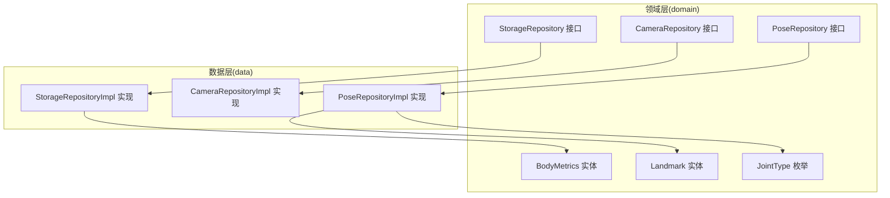
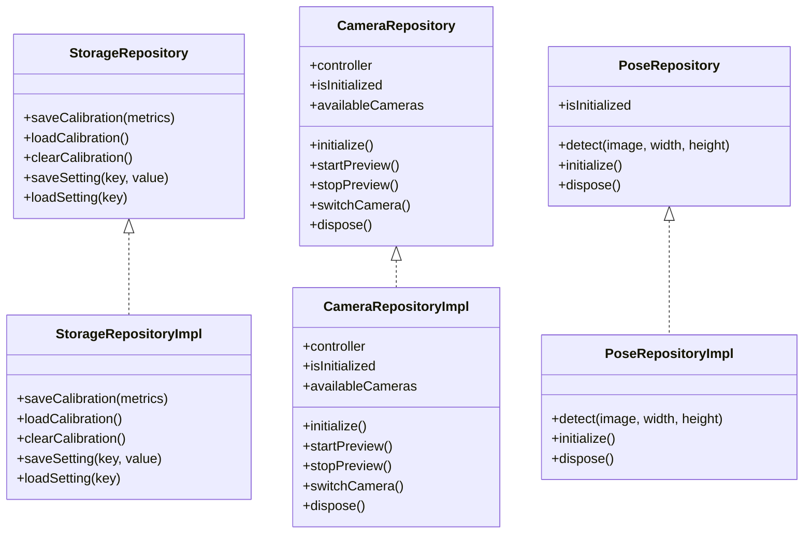
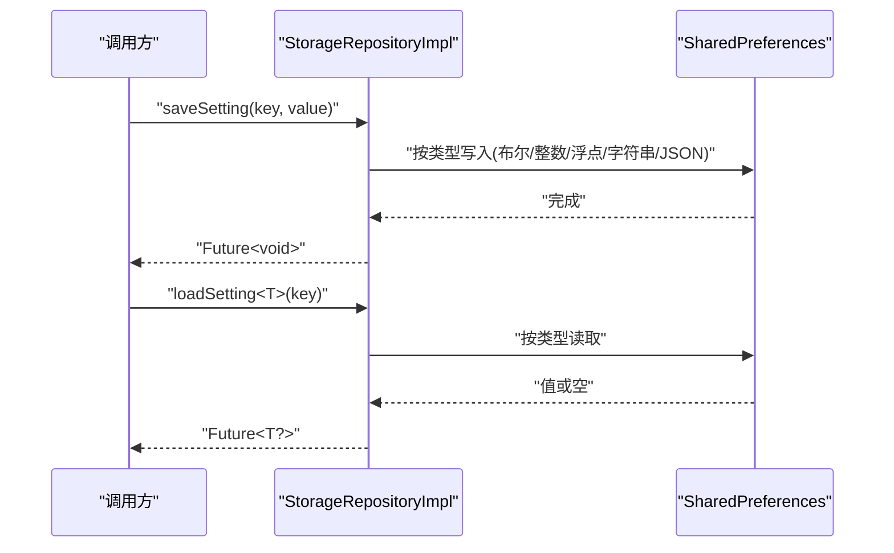
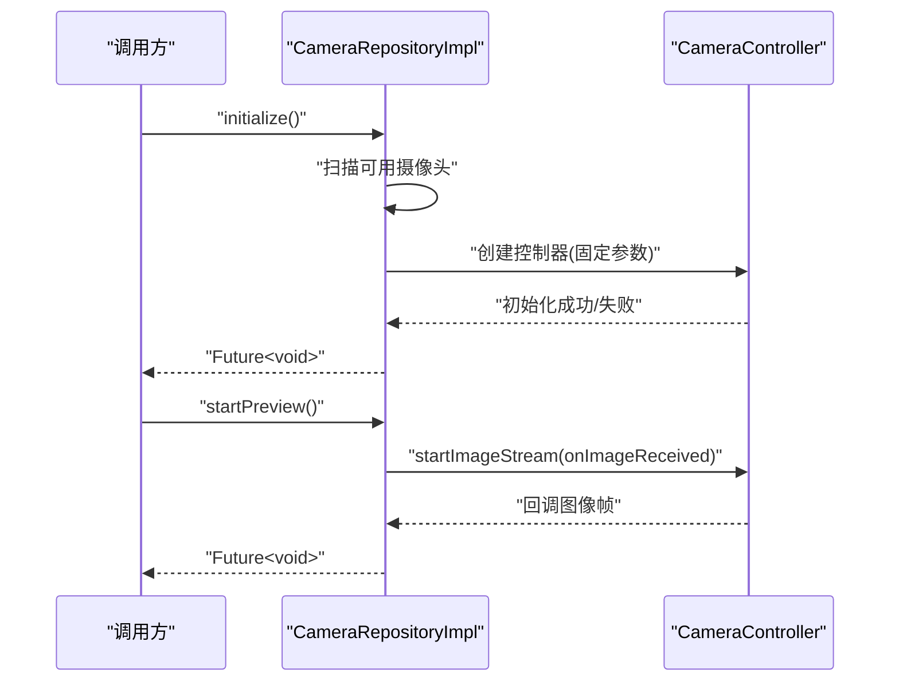
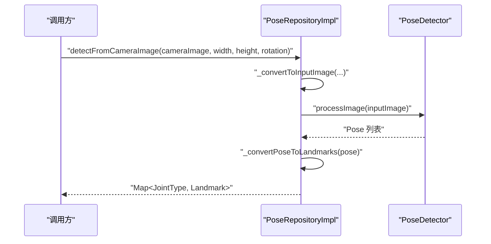
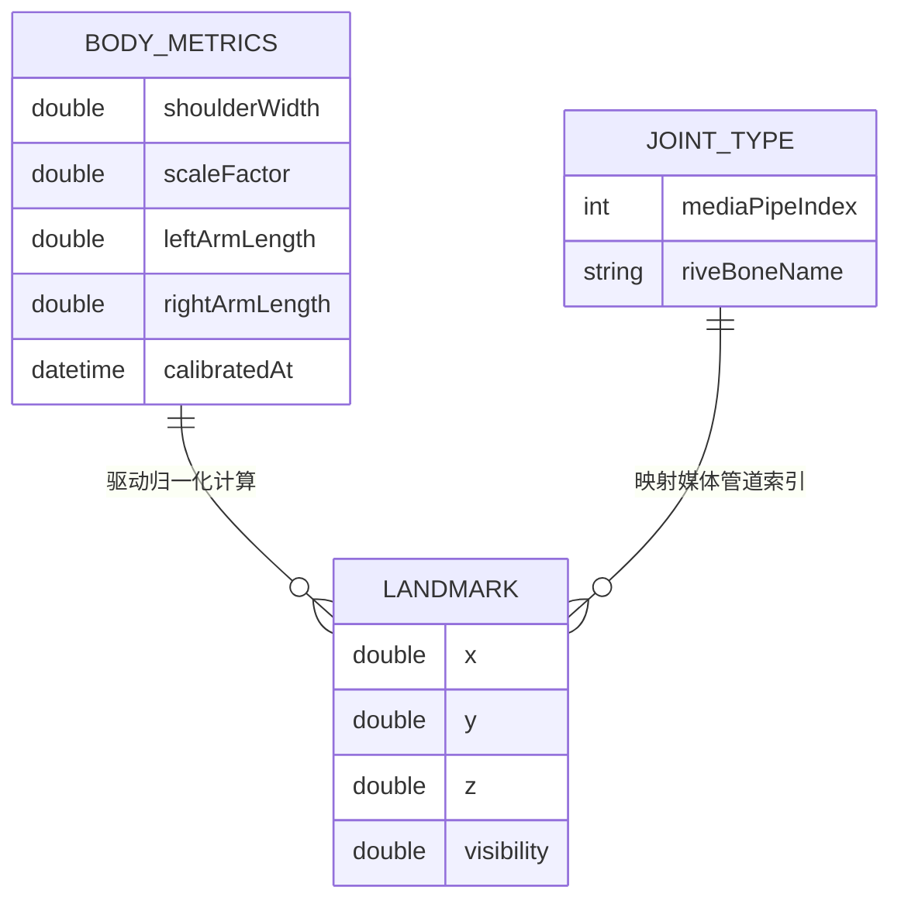
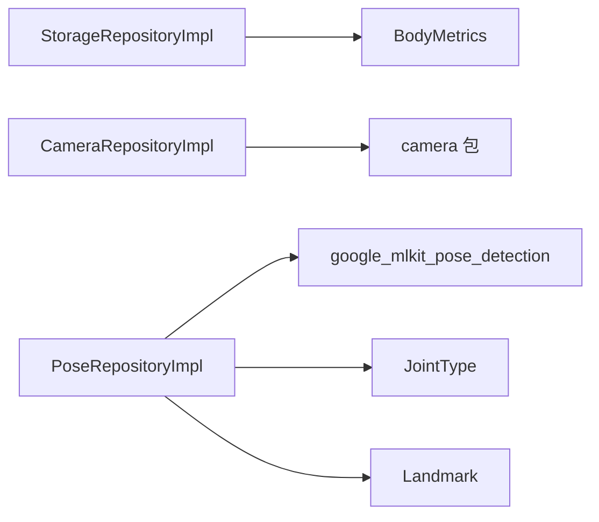

# 数据层设计

<cite>
**本文引用的文件**
- [storage_repository_impl.dart](file://lib/data/repositories_impl/storage_repository_impl.dart)
- [camera_repository_impl.dart](file://lib/data/repositories_impl/camera_repository_impl.dart)
- [pose_repository_impl.dart](file://lib/data/repositories_impl/pose_repository_impl.dart)
- [storage_repository.dart](file://lib/domain/repositories/storage_repository.dart)
- [camera_repository.dart](file://lib/domain/repositories/camera_repository.dart)
- [pose_repository.dart](file://lib/domain/repositories/pose_repository.dart)
- [body_metrics.dart](file://lib/domain/entities/body_metrics.dart)
- [landmark.dart](file://lib/domain/entities/landmark.dart)
- [joint_type.dart](file://lib/domain/entities/joint_type.dart)
</cite>

## 目录
1. [简介](#简介)
2. [项目结构](#项目结构)
3. [核心组件](#核心组件)
4. [架构总览](#架构总览)
5. [详细组件分析](#详细组件分析)
6. [依赖分析](#依赖分析)
7. [性能考虑](#性能考虑)
8. [故障排查指南](#故障排查指南)
9. [结论](#结论)
10. [附录](#附录)

## 简介
本文件系统性梳理 Mimo 项目的“数据层设计”，重点覆盖以下方面：
- 仓库模式实现与数据访问抽象
- 数据模型定义与实体关系映射
- 本地存储方案选择与实现策略
- 数据访问层接口设计与实现细节
- 数据验证规则与业务规则
- 数据模型规范与字段定义
- 缓存策略与性能考量
- 数据迁移路径与版本管理建议
- 数据安全、隐私与访问控制机制

## 项目结构
数据层位于 lib/data 目录，采用“领域接口 + 具体实现”的分层组织方式：
- domain/repositories：定义数据访问抽象接口（如存储、相机、姿态检测）
- domain/entities：定义数据模型与业务实体（如人体度量、关键点、关节类型）
- data/repositories_impl：具体实现（SharedPreferences 存储、camera 包集成、Google ML Kit 姿态检测）

图表来源
- [storage_repository.dart:1-19](file://lib/domain/repositories/storage_repository.dart#L1-L19)
- [camera_repository.dart:1-28](file://lib/domain/repositories/camera_repository.dart#L1-L28)
- [pose_repository.dart:1-23](file://lib/domain/repositories/pose_repository.dart#L1-L23)
- [storage_repository_impl.dart:1-85](file://lib/data/repositories_impl/storage_repository_impl.dart#L1-L85)
- [camera_repository_impl.dart:1-102](file://lib/data/repositories_impl/camera_repository_impl.dart#L1-L102)
- [pose_repository_impl.dart:1-247](file://lib/data/repositories_impl/pose_repository_impl.dart#L1-L247)
- [body_metrics.dart:1-109](file://lib/domain/entities/body_metrics.dart#L1-L109)
- [landmark.dart:1-87](file://lib/domain/entities/landmark.dart#L1-L87)
- [joint_type.dart:1-66](file://lib/domain/entities/joint_type.dart#L1-L66)

章节来源
- [storage_repository_impl.dart:1-85](file://lib/data/repositories_impl/storage_repository_impl.dart#L1-L85)
- [camera_repository_impl.dart:1-102](file://lib/data/repositories_impl/camera_repository_impl.dart#L1-L102)
- [pose_repository_impl.dart:1-247](file://lib/data/repositories_impl/pose_repository_impl.dart#L1-L247)
- [storage_repository.dart:1-19](file://lib/domain/repositories/storage_repository.dart#L1-L19)
- [camera_repository.dart:1-28](file://lib/domain/repositories/camera_repository.dart#L1-L28)
- [pose_repository.dart:1-23](file://lib/domain/repositories/pose_repository.dart#L1-L23)
- [body_metrics.dart:1-109](file://lib/domain/entities/body_metrics.dart#L1-L109)
- [landmark.dart:1-87](file://lib/domain/entities/landmark.dart#L1-L87)
- [joint_type.dart:1-66](file://lib/domain/entities/joint_type.dart#L1-L66)

## 核心组件
- 仓库接口（Domain）：定义统一的数据访问契约，隔离业务逻辑与平台实现差异。
- 实体模型（Domain）：标准化数据结构，提供序列化/反序列化与基础校验。
- 仓库实现（Data）：对接具体平台能力（SharedPreferences、camera、Google ML Kit），封装平台细节。

关键职责划分：
- StorageRepository/StorageRepositoryImpl：负责用户校准数据与设置项的持久化与读取。
- CameraRepository/CameraRepositoryImpl：负责摄像头设备发现、初始化、预览流切换与资源释放。
- PoseRepository/PoseRepositoryImpl：负责姿态检测初始化、图像格式转换、检测执行与结果映射。

章节来源
- [storage_repository.dart:1-19](file://lib/domain/repositories/storage_repository.dart#L1-L19)
- [camera_repository.dart:1-28](file://lib/domain/repositories/camera_repository.dart#L1-L28)
- [pose_repository.dart:1-23](file://lib/domain/repositories/pose_repository.dart#L1-L23)
- [storage_repository_impl.dart:1-85](file://lib/data/repositories_impl/storage_repository_impl.dart#L1-L85)
- [camera_repository_impl.dart:1-102](file://lib/data/repositories_impl/camera_repository_impl.dart#L1-L102)
- [pose_repository_impl.dart:1-247](file://lib/data/repositories_impl/pose_repository_impl.dart#L1-L247)

## 架构总览
数据层通过“接口 + 实现”解耦，上层仅依赖抽象，便于替换与测试；同时将平台能力封装在实现中，避免业务代码直接感知平台差异。

图表来源
- [storage_repository.dart:1-19](file://lib/domain/repositories/storage_repository.dart#L1-L19)
- [camera_repository.dart:1-28](file://lib/domain/repositories/camera_repository.dart#L1-L28)
- [pose_repository.dart:1-23](file://lib/domain/repositories/pose_repository.dart#L1-L23)
- [storage_repository_impl.dart:1-85](file://lib/data/repositories_impl/storage_repository_impl.dart#L1-L85)
- [camera_repository_impl.dart:1-102](file://lib/data/repositories_impl/camera_repository_impl.dart#L1-L102)
- [pose_repository_impl.dart:1-247](file://lib/data/repositories_impl/pose_repository_impl.dart#L1-L247)

## 详细组件分析

### 1) 本地存储与设置管理（StorageRepository/StorageRepositoryImpl）
- 设计要点
  - 使用 SharedPreferences 作为跨平台本地存储后端，保证一致性与易用性。
  - 校准数据采用 JSON 序列化持久化，便于迁移与调试。
  - 设置项通过统一前缀命名空间隔离，支持多类型自动适配（bool/int/double/String/JSON 字符串）。
- 关键流程
  - 保存校准：序列化 BodyMetrics 后写入指定键。
  - 加载校准：读取字符串并反序列化，异常或缺失返回空值。
  - 清除校准：移除对应键。
  - 保存设置：按类型选择对应 setter，非标量类型编码为 JSON 字符串。
  - 加载设置：按类型读取，若为泛型则尝试 JSON 解码。
- 错误处理
  - JSON 解析失败或键不存在时返回空值，避免崩溃。
- 性能与可靠性
  - 写入为异步，避免阻塞主线程。
  - JSON 编解码开销小，适合频繁读写的设置项。

图表来源
- [storage_repository_impl.dart:42-84](file://lib/data/repositories_impl/storage_repository_impl.dart#L42-L84)

章节来源
- [storage_repository.dart:1-19](file://lib/domain/repositories/storage_repository.dart#L1-L19)
- [storage_repository_impl.dart:1-85](file://lib/data/repositories_impl/storage_repository_impl.dart#L1-L85)
- [body_metrics.dart:1-109](file://lib/domain/entities/body_metrics.dart#L1-L109)

### 2) 摄像头数据访问（CameraRepository/CameraRepositoryImpl）
- 设计要点
  - 通过 camera 包提供的 availableCameras 发现设备，支持前置/后置切换。
  - 默认使用前置摄像头，初始化参数固定分辨率与图像格式，降低后续转换成本。
  - 提供预览流回调钩子，便于上层订阅图像帧事件。
- 关键流程
  - 初始化：扫描可用摄像头 → 选择前置或首个 → 创建 CameraController → 初始化 → 标记初始化成功。
  - 预览：启动图像流；停止：停止图像流并清理。
  - 切换摄像头：停止预览 → 释放当前控制器 → 选择下一个摄像头 → 新建控制器 → 初始化。
  - 释放：销毁控制器并重置状态。
- 错误处理
  - 无摄像头或初始化失败时设置初始化标记为失败并抛出异常。
- 性能与可靠性
  - 控制器复用与按需释放，避免资源泄漏。
  - 固定图像格式与分辨率减少转换开销。

图表来源
- [camera_repository_impl.dart:20-61](file://lib/data/repositories_impl/camera_repository_impl.dart#L20-L61)

章节来源
- [camera_repository.dart:1-28](file://lib/domain/repositories/camera_repository.dart#L1-L28)
- [camera_repository_impl.dart:1-102](file://lib/data/repositories_impl/camera_repository_impl.dart#L1-L102)

### 3) 姿态检测与关键点映射（PoseRepository/PoseRepositoryImpl）
- 设计要点
  - 使用 Google ML Kit 的 PoseDetector，配置为流式检测与高精度模型。
  - 支持多种图像格式（NV21/YUV_420_888/BGRA8888），统一转换为 InputImage。
  - 将 MediaPipe 关键点索引映射到 JointType，并输出 Landmark 映射。
- 关键流程
  - 初始化：标记初始化完成（检测器对象创建在构造阶段）。
  - 图像转换：根据格式选择对应 InputImage 构造方式，填充元数据与平面数据。
  - 检测执行：调用 _detector.processImage，取第一个检测结果。
  - 结果映射：遍历映射表，提取关键点并封装为 Landmark。
  - 释放：关闭检测器并重置状态。
- 错误处理
  - 图像转换与检测异常时打印日志并返回空映射，避免中断流程。
- 性能与可靠性
  - 流式检测与固定分辨率有助于稳定帧率。
  - 仅使用首个人体检测结果，简化后续处理。

图表来源
- [pose_repository_impl.dart:40-71](file://lib/data/repositories_impl/pose_repository_impl.dart#L40-L71)
- [pose_repository_impl.dart:74-149](file://lib/data/repositories_impl/pose_repository_impl.dart#L74-L149)
- [pose_repository_impl.dart:192-213](file://lib/data/repositories_impl/pose_repository_impl.dart#L192-L213)

章节来源
- [pose_repository.dart:1-23](file://lib/domain/repositories/pose_repository.dart#L1-L23)
- [pose_repository_impl.dart:1-247](file://lib/data/repositories_impl/pose_repository_impl.dart#L1-L247)
- [joint_type.dart:1-66](file://lib/domain/entities/joint_type.dart#L1-L66)
- [landmark.dart:1-87](file://lib/domain/entities/landmark.dart#L1-L87)

### 4) 数据模型与实体关系映射
- 实体定义
  - BodyMetrics：人体度量数据，包含肩宽、缩放因子、左右臂长与校准时间戳；提供默认值工厂、序列化/反序列化、有效性判断与复制方法。
  - Landmark：姿态关键点，包含归一化坐标与可见度；提供距离计算、有效性判断与复制方法。
  - JointType：关节类型枚举，映射 MediaPipe 索引与 Rive 骨骼名，提供常用分组查询。
- 关系映射
  - PoseRepositoryImpl 将 Pose 检测结果映射为 JointType → Landmark 的字典，实现领域模型与平台库之间的桥接。
- 规范与约束
  - 所有数值字段均为正数约束（如肩宽、缩放因子），无效时返回空结果或默认值。
  - 可见度阈值用于判定关键点有效性，避免低置信度数据进入后续处理。

图表来源
- [body_metrics.dart:1-109](file://lib/domain/entities/body_metrics.dart#L1-L109)
- [landmark.dart:1-87](file://lib/domain/entities/landmark.dart#L1-L87)
- [joint_type.dart:1-66](file://lib/domain/entities/joint_type.dart#L1-L66)

章节来源
- [body_metrics.dart:1-109](file://lib/domain/entities/body_metrics.dart#L1-L109)
- [landmark.dart:1-87](file://lib/domain/entities/landmark.dart#L1-L87)
- [joint_type.dart:1-66](file://lib/domain/entities/joint_type.dart#L1-L66)

## 依赖分析
- 组件耦合
  - 实现类依赖于领域接口，保持高内聚、低耦合。
  - PoseRepositoryImpl 依赖第三方库（camera、google_mlkit_pose_detection）与领域实体（JointType、Landmark）。
- 外部依赖
  - SharedPreferences：用于设置与校准数据持久化。
  - camera：用于摄像头设备与图像流管理。
  - google_mlkit_pose_detection：用于姿态检测与关键点识别。
- 循环依赖
  - 当前结构未发现循环依赖，接口与实现分离清晰。

图表来源
- [storage_repository_impl.dart:1-85](file://lib/data/repositories_impl/storage_repository_impl.dart#L1-L85)
- [camera_repository_impl.dart:1-102](file://lib/data/repositories_impl/camera_repository_impl.dart#L1-L102)
- [pose_repository_impl.dart:1-247](file://lib/data/repositories_impl/pose_repository_impl.dart#L1-L247)
- [body_metrics.dart:1-109](file://lib/domain/entities/body_metrics.dart#L1-L109)
- [landmark.dart:1-87](file://lib/domain/entities/landmark.dart#L1-L87)
- [joint_type.dart:1-66](file://lib/domain/entities/joint_type.dart#L1-L66)

章节来源
- [storage_repository_impl.dart:1-85](file://lib/data/repositories_impl/storage_repository_impl.dart#L1-L85)
- [camera_repository_impl.dart:1-102](file://lib/data/repositories_impl/camera_repository_impl.dart#L1-L102)
- [pose_repository_impl.dart:1-247](file://lib/data/repositories_impl/pose_repository_impl.dart#L1-L247)

## 性能考虑
- I/O 与序列化
  - SharedPreferences 读写为异步，避免阻塞 UI 线程；JSON 编解码对小体量设置项开销可控。
- 图像处理
  - 固定分辨率与图像格式减少转换与内存拷贝；仅使用首个人体检测结果降低后续处理复杂度。
- 资源管理
  - 摄像头与检测器在不再使用时及时释放，防止资源泄漏导致性能下降。
- 缓存策略
  - 当前未实现应用级缓存；可在上层业务引擎中引入短期缓存（如最近 N 帧关键点）以减少重复计算。

## 故障排查指南
- 摄像头初始化失败
  - 现象：初始化后 isInitialized 为 false 或抛出异常。
  - 排查：确认设备是否存在可用摄像头；检查权限与初始化参数。
  - 参考
    - [camera_repository_impl.dart:20-47](file://lib/data/repositories_impl/camera_repository_impl.dart#L20-L47)
- 图像流无输出
  - 现象：startPreview 后无回调。
  - 排查：确认已正确启动图像流；检查 onImageReceived 是否设置。
  - 参考
    - [camera_repository_impl.dart:50-61](file://lib/data/repositories_impl/camera_repository_impl.dart#L50-L61)
- 姿态检测无结果
  - 现象：detectFromCameraImage 返回空映射。
  - 排查：确认输入图像格式与元数据正确；检查检测器初始化与输入图像旋转。
  - 参考
    - [pose_repository_impl.dart:40-71](file://lib/data/repositories_impl/pose_repository_impl.dart#L40-L71)
    - [pose_repository_impl.dart:74-149](file://lib/data/repositories_impl/pose_repository_impl.dart#L74-L149)
- 校准数据加载失败
  - 现象：loadCalibration 返回空。
  - 排查：确认键存在且 JSON 可解析；检查序列化格式。
  - 参考
    - [storage_repository_impl.dart:18-32](file://lib/data/repositories_impl/storage_repository_impl.dart#L18-L32)

章节来源
- [camera_repository_impl.dart:20-61](file://lib/data/repositories_impl/camera_repository_impl.dart#L20-L61)
- [pose_repository_impl.dart:40-149](file://lib/data/repositories_impl/pose_repository_impl.dart#L40-L149)
- [storage_repository_impl.dart:18-32](file://lib/data/repositories_impl/storage_repository_impl.dart#L18-L32)

## 结论
Mimo 的数据层通过清晰的接口与实现分离，结合 SharedPreferences、camera 与 Google ML Kit，构建了稳定的本地存储、摄像头与姿态检测能力。实体模型标准化了关键数据结构，配合严格的序列化/反序列化与有效性判断，确保了数据质量与可维护性。建议在后续迭代中补充应用级缓存、完善错误上报与监控，并制定明确的数据迁移与版本管理策略。

## 附录

### A. 数据模型规范与字段定义
- BodyMetrics
  - 字段：shoulderWidth、scaleFactor、leftArmLength、rightArmLength、calibratedAt
  - 默认值：提供 defaults 工厂方法
  - 序列化：toMap/fromMap
  - 有效性：isValid 基于正数约束
  - 参考
    - [body_metrics.dart:1-109](file://lib/domain/entities/body_metrics.dart#L1-L109)
- Landmark
  - 字段：x、y、z、visibility
  - 有效性：isValid 基于可见度阈值
  - 距离：distanceTo 计算欧氏距离
  - 参考
    - [landmark.dart:1-87](file://lib/domain/entities/landmark.dart#L1-L87)
- JointType
  - 字段：mediaPipeIndex、riveBoneName
  - 分组：upperBodyJoints/leftSideJoints/rightSideJoints
  - 参考
    - [joint_type.dart:1-66](file://lib/domain/entities/joint_type.dart#L1-L66)

### B. 数据访问层接口与实现对照
- StorageRepository ↔ StorageRepositoryImpl
  - 功能：校准数据持久化、设置项读写
  - 参考
    - [storage_repository.dart:1-19](file://lib/domain/repositories/storage_repository.dart#L1-L19)
    - [storage_repository_impl.dart:1-85](file://lib/data/repositories_impl/storage_repository_impl.dart#L1-L85)
- CameraRepository ↔ CameraRepositoryImpl
  - 功能：设备发现、初始化、预览流、切换摄像头、释放
  - 参考
    - [camera_repository.dart:1-28](file://lib/domain/repositories/camera_repository.dart#L1-L28)
    - [camera_repository_impl.dart:1-102](file://lib/data/repositories_impl/camera_repository_impl.dart#L1-L102)
- PoseRepository ↔ PoseRepositoryImpl
  - 功能：姿态检测、图像格式转换、结果映射
  - 参考
    - [pose_repository.dart:1-23](file://lib/domain/repositories/pose_repository.dart#L1-L23)
    - [pose_repository_impl.dart:1-247](file://lib/data/repositories_impl/pose_repository_impl.dart#L1-L247)

### C. 数据验证与业务规则
- BodyMetrics
  - 正数约束与默认值保障合理性
  - 参考
    - [body_metrics.dart:69-70](file://lib/domain/entities/body_metrics.dart#L69-L70)
- Landmark
  - 可见度阈值用于过滤低质量关键点
  - 参考
    - [landmark.dart:56-57](file://lib/domain/entities/landmark.dart#L56-L57)
- PoseRepositoryImpl
  - 仅取首个人体检测结果，避免多目标干扰
  - 参考
    - [pose_repository_impl.dart:60-66](file://lib/data/repositories_impl/pose_repository_impl.dart#L60-L66)

### D. 缓存策略与性能建议
- 建议在业务引擎层引入短期缓存（如最近 N 帧关键点），减少重复计算。
- 对频繁读取的小体量设置项，可在内存中维护轻量缓存，降低 SharedPreferences 访问频率。
- 对姿态检测结果，可按帧率限制更新频率，避免过度刷新。

### E. 数据迁移路径与版本管理
- 建议采用“键名版本前缀 + 升级脚本”策略：
  - 为现有键添加版本号前缀（如 setting_v2_key），新版本读取新键，旧键保留用于迁移。
  - 在应用启动时执行迁移脚本，将旧数据转换为新结构并删除旧键。
- 对 BodyMetrics，新增字段时提供默认值回退，保证向后兼容。

### F. 数据安全、隐私与访问控制
- SharedPreferences
  - 适用于非敏感设置与校准数据；不建议存放明文密码等高敏信息。
  - 可通过应用内权限控制与最小化数据收集原则降低风险。
- 摄像头与图像流
  - 严格遵循平台权限与隐私政策；仅在用户授权下启用摄像头。
  - 不在应用外留存图像数据，检测完成后及时释放资源。
- Google ML Kit
  - 使用本地检测模型（如适用）减少云端传输；若涉及云端服务，遵循数据最小化与加密传输原则。