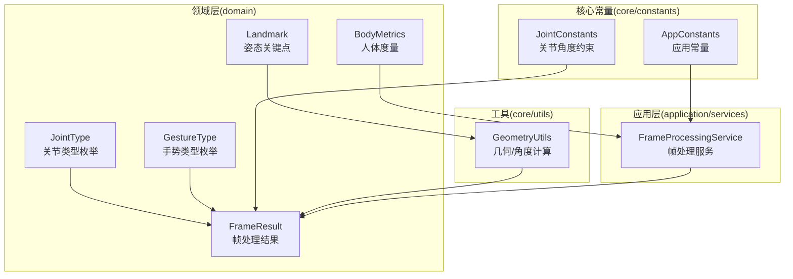
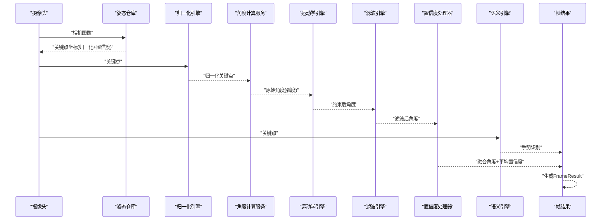
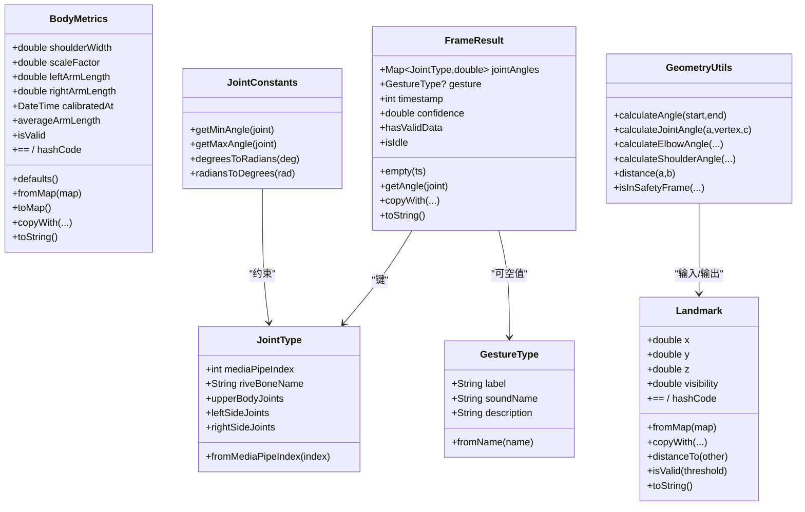
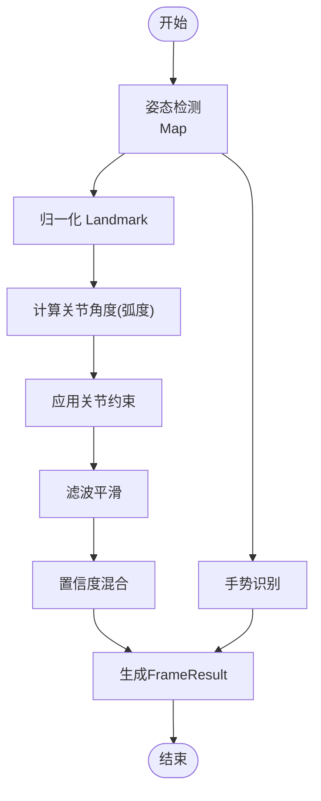
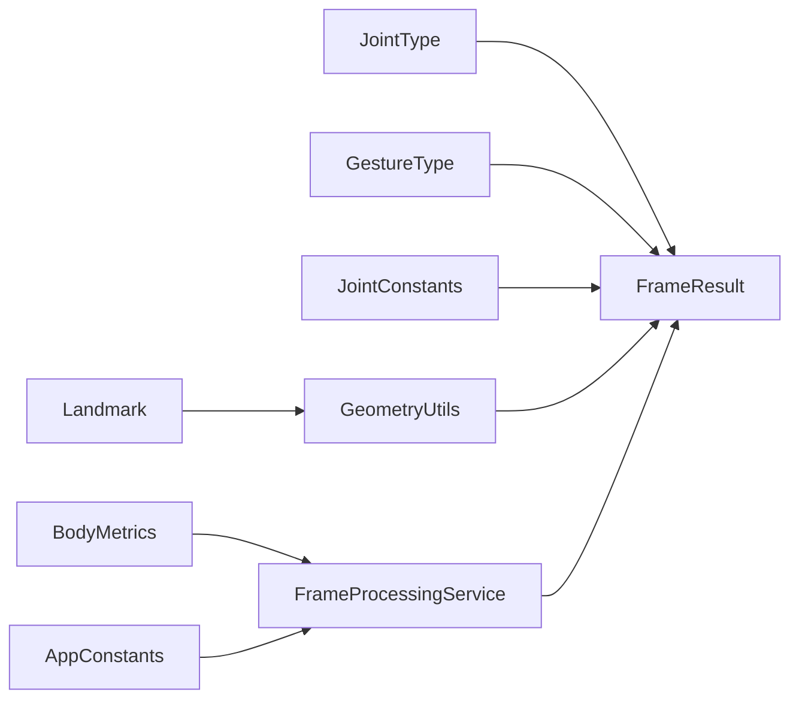

# 数据模型定义

<cite>
**本文引用的文件**
- [landmark.dart](file://lib/domain/entities/landmark.dart)
- [body_metrics.dart](file://lib/domain/entities/body_metrics.dart)
- [joint_type.dart](file://lib/domain/entities/joint_type.dart)
- [frame_result.dart](file://lib/domain/entities/frame_result.dart)
- [gesture_type.dart](file://lib/domain/entities/gesture_type.dart)
- [joint_constants.dart](file://lib/core/constants/joint_constants.dart)
- [app_constants.dart](file://lib/core/constants/app_constants.dart)
- [geometry_utils.dart](file://lib/core/utils/geometry_utils.dart)
- [frame_processing_service.dart](file://lib/application/services/frame_processing_service.dart)
</cite>

## 目录
1. [简介](#简介)
2. [项目结构](#项目结构)
3. [核心组件](#核心组件)
4. [架构总览](#架构总览)
5. [详细组件分析](#详细组件分析)
6. [依赖分析](#依赖分析)
7. [性能考量](#性能考量)
8. [故障排查指南](#故障排查指南)
9. [结论](#结论)
10. [附录](#附录)

## 简介
本文件系统性梳理 Mimo 项目中的数据模型定义，聚焦于以下核心实体：Landmark、BodyMetrics、JointType、FrameResult、GestureType，并阐释它们之间的关系映射、依赖关系、验证与业务规则、序列化/反序列化机制、版本管理与兼容性、跨层传递与转换、完整性约束与索引设计，以及使用示例与最佳实践。本文面向开发者与产品/测试人员，兼顾技术细节与可读性。

## 项目结构
数据模型主要分布在以下层次：
- domain/entities：核心领域模型（Landmark、BodyMetrics、JointType、FrameResult、GestureType）
- core/constants：与模型相关的常量与约束（关节角度约束、应用常量）
- core/utils：几何与角度计算工具（用于从 Landmark 推导角度与距离）
- application/services：数据在各层之间的流转与转换（帧处理服务）

图表来源
- [landmark.dart:1-87](file://lib/domain/entities/landmark.dart#L1-L87)
- [body_metrics.dart:1-109](file://lib/domain/entities/body_metrics.dart#L1-L109)
- [joint_type.dart:1-66](file://lib/domain/entities/joint_type.dart#L1-L66)
- [frame_result.dart:1-93](file://lib/domain/entities/frame_result.dart#L1-L93)
- [gesture_type.dart:1-60](file://lib/domain/entities/gesture_type.dart#L1-L60)
- [joint_constants.dart:1-41](file://lib/core/constants/joint_constants.dart#L1-L41)
- [app_constants.dart:1-35](file://lib/core/constants/app_constants.dart#L1-L35)
- [geometry_utils.dart:1-117](file://lib/core/utils/geometry_utils.dart#L1-L117)
- [frame_processing_service.dart:1-254](file://lib/application/services/frame_processing_service.dart#L1-L254)

章节来源
- [frame_processing_service.dart:1-254](file://lib/application/services/frame_processing_service.dart#L1-L254)

## 核心组件
本节概述每个实体类的设计目标、字段定义、典型方法与用途。

- Landmark（姿态关键点）
  - 字段：x、y、z、visibility（均为双精度浮点；x/y 为归一化坐标，z 为相对深度，visibility 为可见度/置信度）
  - 方法：fromMap（从 Map 构造）、copyWith（不可变复制与部分更新）、distanceTo（欧氏距离）、isValid（基于置信度阈值判断有效性）、toString、==/hashCode
  - 用途：作为 MediaPipe 检测输出的标准化载体，贯穿后续归一化、角度计算、滤波与语义识别

- BodyMetrics（人体度量）
  - 字段：shoulderWidth、scaleFactor、leftArmLength、rightArmLength、calibratedAt
  - 方法：defaults（默认人体度量）、fromMap、toMap（序列化/反序列化）、averageArmLength、isValid、copyWith、toString、==/hashCode
  - 用途：校准后的人体尺寸信息，用于将用户动作幅度归一化，提高跨用户一致性

- JointType（关节类型枚举）
  - 成员：leftShoulder、leftElbow、leftWrist、rightShoulder、rightElbow、rightWrist、nose
  - 元信息：mediaPipeIndex（对应 MediaPipe Pose 关键点索引）、riveBoneName（对应 Rive 骨骼名）
  - 工具：fromMediaPipeIndex（索引到枚举映射）、upperBodyJoints/leftSideJoints/rightSideJoints（分组查询）
  - 用途：统一关节标识，连接姿态检测与动画驱动

- FrameResult（帧处理结果）
  - 字段：jointAngles（Map<JointType, double>，弧度制）、gesture（可空）、timestamp（毫秒）、confidence（平均置信度，默认 1.0）
  - 方法：empty（空结果构造）、getAngle（按关节取角度）、hasValidData、isIdle（低置信度判定）、copyWith、toString
  - 用途：封装一帧处理后的角度与手势，供 UI 与交互引擎消费

- GestureType（手势类型枚举）
  - 成员：handRaise、armsOpen、wave、clap、handsUp
  - 元信息：label（中文名）、soundName（音效文件名）、description（触发条件描述）
  - 工具：fromName（名称到枚举映射）
  - 用途：定义可识别的动作手势，用于触发音效、表情等互动反馈

章节来源
- [landmark.dart:1-87](file://lib/domain/entities/landmark.dart#L1-L87)
- [body_metrics.dart:1-109](file://lib/domain/entities/body_metrics.dart#L1-L109)
- [joint_type.dart:1-66](file://lib/domain/entities/joint_type.dart#L1-L66)
- [frame_result.dart:1-93](file://lib/domain/entities/frame_result.dart#L1-L93)
- [gesture_type.dart:1-60](file://lib/domain/entities/gesture_type.dart#L1-L60)

## 架构总览
下图展示数据模型在系统中的流转路径：摄像头采集 -> 姿态检测 -> 归一化 -> 角度计算 -> 关节约束 -> 滤波 -> 置信度混合 -> 语义识别 -> 帧结果输出。

图表来源
- [frame_processing_service.dart:108-216](file://lib/application/services/frame_processing_service.dart#L108-L216)
- [geometry_utils.dart:1-117](file://lib/core/utils/geometry_utils.dart#L1-L117)

章节来源
- [frame_processing_service.dart:1-254](file://lib/application/services/frame_processing_service.dart#L1-L254)

## 详细组件分析

### 类关系与继承

图表来源
- [landmark.dart:1-87](file://lib/domain/entities/landmark.dart#L1-L87)
- [body_metrics.dart:1-109](file://lib/domain/entities/body_metrics.dart#L1-L109)
- [joint_type.dart:1-66](file://lib/domain/entities/joint_type.dart#L1-L66)
- [frame_result.dart:1-93](file://lib/domain/entities/frame_result.dart#L1-L93)
- [gesture_type.dart:1-60](file://lib/domain/entities/gesture_type.dart#L1-L60)
- [geometry_utils.dart:1-117](file://lib/core/utils/geometry_utils.dart#L1-L117)
- [joint_constants.dart:1-41](file://lib/core/constants/joint_constants.dart#L1-L41)

章节来源
- [landmark.dart:1-87](file://lib/domain/entities/landmark.dart#L1-L87)
- [body_metrics.dart:1-109](file://lib/domain/entities/body_metrics.dart#L1-L109)
- [joint_type.dart:1-66](file://lib/domain/entities/joint_type.dart#L1-L66)
- [frame_result.dart:1-93](file://lib/domain/entities/frame_result.dart#L1-L93)
- [gesture_type.dart:1-60](file://lib/domain/entities/gesture_type.dart#L1-L60)
- [geometry_utils.dart:1-117](file://lib/core/utils/geometry_utils.dart#L1-L117)
- [joint_constants.dart:1-41](file://lib/core/constants/joint_constants.dart#L1-L41)

### 数据验证与业务规则
- Landmark
  - 有效性：通过置信度阈值（默认 0.5）判断是否有效
  - 距离计算：欧氏距离，辅助安全框与手势判定
- BodyMetrics
  - 默认值：提供基准肩宽与标准臂长，scaleFactor 为 1.0
  - 有效性：肩宽与缩放因子需大于 0
  - 序列化：toMap 使用 ISO8601 字符串存储时间戳
- JointType
  - 映射：提供 MediaPipe 索引与 Rive 骨骼名的双向映射能力
  - 分组：上肢/左右侧关节集合，便于批量驱动
- FrameResult
  - 空闲态：平均置信度低于阈值（默认 0.3）视为 idle
  - 角度容器：以 JointType 为键，保证类型安全与可扩展
- GestureType
  - 触发条件：明确每种手势的触发描述，便于语义引擎实现

章节来源
- [landmark.dart:56-57](file://lib/domain/entities/landmark.dart#L56-L57)
- [body_metrics.dart:69-70](file://lib/domain/entities/body_metrics.dart#L69-L70)
- [body_metrics.dart:55-64](file://lib/domain/entities/body_metrics.dart#L55-L64)
- [joint_type.dart:34-42](file://lib/domain/entities/joint_type.dart#L34-L42)
- [frame_result.dart:43-44](file://lib/domain/entities/frame_result.dart#L43-L44)
- [gesture_type.dart:1-60](file://lib/domain/entities/gesture_type.dart#L1-L60)

### 序列化与反序列化
- Landmark.fromMap：从 Map 解析 x/y/z/visibility，缺失或非数值时回退到默认值
- BodyMetrics.fromMap：解析 shoulderWidth/scaleFactor/leftArmLength/rightArmLength，calibratedAt 解析为 DateTime
- BodyMetrics.toMap：序列化为 Map，时间字段采用 ISO8601 字符串
- FrameResult：当前实体类未直接暴露 toMap/fromMap，但其内部字段类型（Map<JointType, double>、可空枚举）在上层服务中被组合使用

章节来源
- [landmark.dart:24-32](file://lib/domain/entities/landmark.dart#L24-L32)
- [body_metrics.dart:42-53](file://lib/domain/entities/body_metrics.dart#L42-L53)
- [body_metrics.dart:55-64](file://lib/domain/entities/body_metrics.dart#L55-L64)

### 版本管理与兼容性
- 版本标识：应用常量中包含 appVersion，可用于记录模型版本
- 兼容策略建议：
  - 新增字段时保留 fromMap 的健壮性（缺省回退），避免解析失败
  - 对于枚举扩展，提供 fromName 或 fromMediaPipeIndex 的容错映射
  - 时间字段统一使用 ISO8601 字符串，确保跨平台一致
  - 对于 Map 容器（如 FrameResult.jointAngles），保持键类型稳定（JointType）

章节来源
- [app_constants.dart:8-9](file://lib/core/constants/app_constants.dart#L8-L9)
- [body_metrics.dart:49-51](file://lib/domain/entities/body_metrics.dart#L49-L51)

### 跨层传递与转换
- 输入层（摄像头）：CameraImage 传入姿态仓库，返回 Map<JointType, Landmark>
- 归一化层：Normalizer 将 Landmark 转为归一化坐标
- 角度计算层：AngleComputeService 基于 Landmark 计算关节角度（弧度）
- 约束与滤波层：JointConstraints 限制角度范围，MotionFilterEngine 平滑角度变化
- 置信度混合：ConfidenceProcessor 将跟踪角度与 idle 角度按置信度加权混合
- 语义识别：SemanticEngine 基于 Landmark 识别手势
- 输出层：FrameResult 封装角度、手势、置信度与时间戳

图表来源
- [frame_processing_service.dart:126-216](file://lib/application/services/frame_processing_service.dart#L126-L216)
- [geometry_utils.dart:1-117](file://lib/core/utils/geometry_utils.dart#L1-L117)

章节来源
- [frame_processing_service.dart:108-216](file://lib/application/services/frame_processing_service.dart#L108-L216)

### 完整性约束与索引设计
- 键约束
  - FrameResult.jointAngles 的键类型为 JointType，天然保证键集合的唯一性与可扩展性
  - JointType 与 MediaPipe 索引一一对应，避免运行期映射错误
- 值域约束
  - Landmark.visibility ∈ [0,1]，isValid 基于此进行有效性判断
  - BodyMetrics.shoulderWidth、scaleFactor > 0
  - 关节角度范围由 JointConstants 提供（度 → 弧度转换）
- 索引设计
  - Map<JointType, T> 作为角度容器，查询与更新均为 O(1) 平均复杂度
  - JointTypeGroup 扩展提供按侧别/上肢的快速筛选

章节来源
- [joint_constants.dart:8-16](file://lib/core/constants/joint_constants.dart#L8-L16)
- [joint_constants.dart:28-32](file://lib/core/constants/joint_constants.dart#L28-L32)
- [frame_result.dart:8-18](file://lib/domain/entities/frame_result.dart#L8-L18)

## 依赖分析
- 内聚性
  - domain/entities 下的实体类职责单一，围绕数据结构与基本行为
- 耦合度
  - FrameResult 依赖 JointType/GestureType；Landmark 与 GeometryUtils 高耦合（角度/距离计算）
  - JointConstants 为外部约束提供集中式配置
- 外部依赖
  - 应用常量（AppConstants）影响阈值与性能目标
  - 上层服务（FrameProcessingService）协调多引擎完成端到端处理

图表来源
- [frame_processing_service.dart:1-254](file://lib/application/services/frame_processing_service.dart#L1-L254)
- [geometry_utils.dart:1-117](file://lib/core/utils/geometry_utils.dart#L1-L117)
- [joint_constants.dart:1-41](file://lib/core/constants/joint_constants.dart#L1-L41)
- [app_constants.dart:1-35](file://lib/core/constants/app_constants.dart#L1-L35)

章节来源
- [frame_processing_service.dart:1-254](file://lib/application/services/frame_processing_service.dart#L1-L254)

## 性能考量
- FPS 与延迟
  - 目标帧率与最大延迟由应用常量定义，帧处理服务负责统计与上报实时 FPS
- 角度变化速率
  - 单帧最大角度变化量限制（度），防止突变导致的视觉抖动
- 置信度阈值
  - 高/低置信度阈值用于区分有效跟踪与 idle 状态，减少无效渲染
- 渲染与计算分离
  - 图像采集与姿态检测异步化，避免阻塞 UI 主线程

章节来源
- [app_constants.dart:11-14](file://lib/core/constants/app_constants.dart#L11-L14)
- [app_constants.dart:26-28](file://lib/core/constants/app_constants.dart#L26-L28)
- [joint_constants.dart:15-16](file://lib/core/constants/joint_constants.dart#L15-L16)
- [frame_processing_service.dart:230-241](file://lib/application/services/frame_processing_service.dart#L230-L241)

## 故障排查指南
- Landmark 无效
  - 症状：isValid 返回 false，FrameResult.isIdle 为真
  - 排查：检查姿态检测输出的 visibility；确认摄像头位置与光照条件
- 角度过大或突变
  - 症状：关节角度越界或单帧跳变明显
  - 排查：确认 JointConstants 的角度约束；检查滤波参数；核对单位换算（度/弧度）
- 手势误判
  - 症状：未做出动作却触发手势
  - 排查：调整手势判定阈值与窗口大小；检查 Landmark 是否在安全框内
- 校准失败
  - 症状：BodyMetrics 不可用或默认值未更新
  - 排查：确认校准流程时长与持帧数；检查 Shoulder 角度阈值；重试校准

章节来源
- [landmark.dart:56-57](file://lib/domain/entities/landmark.dart#L56-L57)
- [frame_result.dart:43-44](file://lib/domain/entities/frame_result.dart#L43-L44)
- [joint_constants.dart:15-16](file://lib/core/constants/joint_constants.dart#L15-L16)
- [app_constants.dart:16-19](file://lib/core/constants/app_constants.dart#L16-L19)

## 结论
Mimo 的数据模型以简洁、强类型为核心设计原则：Landmark 提供标准化的关键点载体，BodyMetrics 支持跨用户归一化，JointType/GestureType 统一了关节与动作语义，FrameResult 将多源信息整合为 UI 可消费的结果。配合几何工具与约束常量，系统在保证可维护性的同时实现了良好的性能与稳定性。建议在后续迭代中持续完善序列化健壮性、版本化策略与跨平台兼容性。

## 附录

### 字段类型与取值范围速览
- Landmark
  - x/y ∈ [0,1]（归一化坐标）
  - z（相对深度，单位与肩宽尺度相关）
  - visibility ∈ [0,1]
- BodyMetrics
  - shoulderWidth > 0
  - scaleFactor > 0
  - leftArmLength、rightArmLength > 0
  - calibratedAt：ISO8601 字符串
- JointType
  - mediaPipeIndex：整数索引（与 MediaPipe Pose 对应）
  - riveBoneName：字符串（Rive 骨骼名）
- FrameResult
  - jointAngles：Map<JointType, double>（弧度）
  - gesture：可空枚举
  - timestamp：毫秒
  - confidence ∈ [0,1]
- GestureType
  - label：中文标签
  - soundName：音效文件名
  - description：触发条件说明

章节来源
- [landmark.dart:4-15](file://lib/domain/entities/landmark.dart#L4-L15)
- [body_metrics.dart:4-18](file://lib/domain/entities/body_metrics.dart#L4-L18)
- [joint_type.dart:26-30](file://lib/domain/entities/joint_type.dart#L26-L30)
- [frame_result.dart:7-18](file://lib/domain/entities/frame_result.dart#L7-L18)
- [gesture_type.dart:40-47](file://lib/domain/entities/gesture_type.dart#L40-L47)