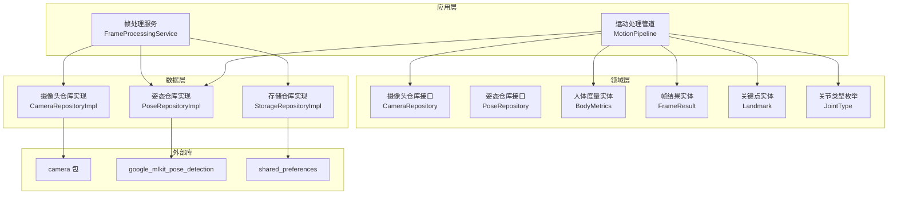
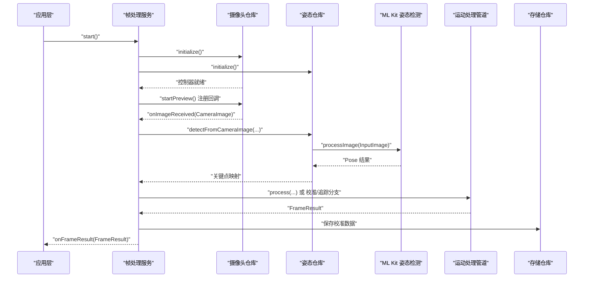
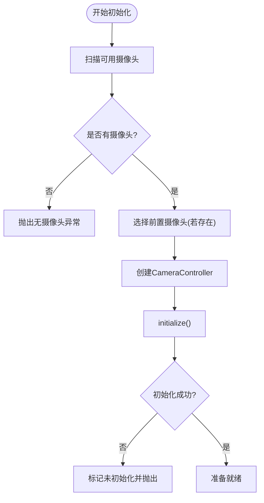
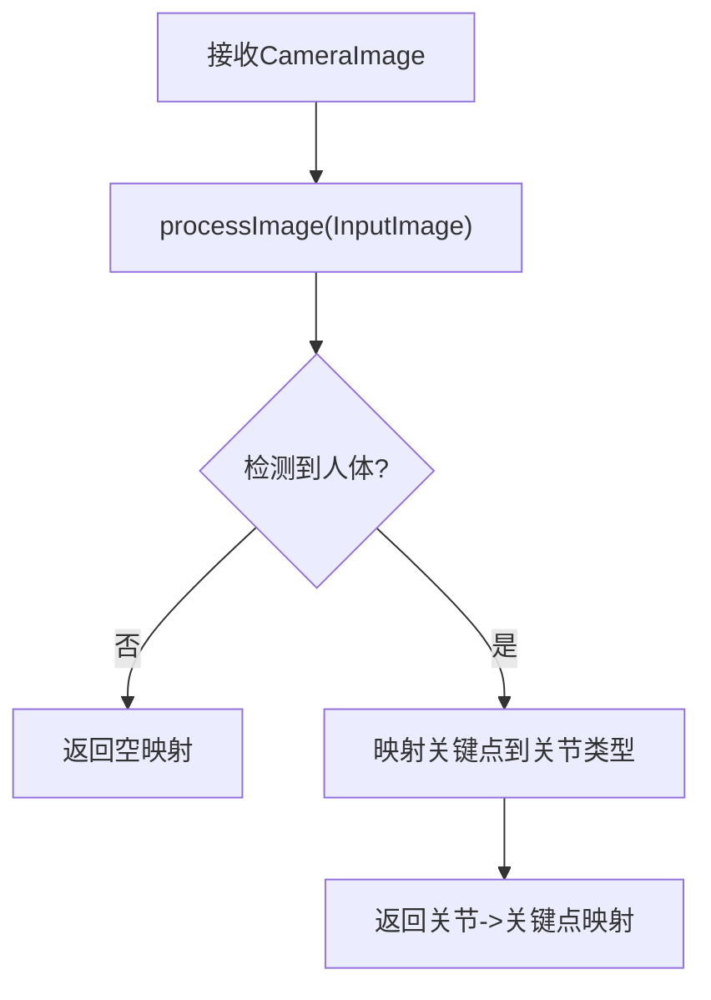
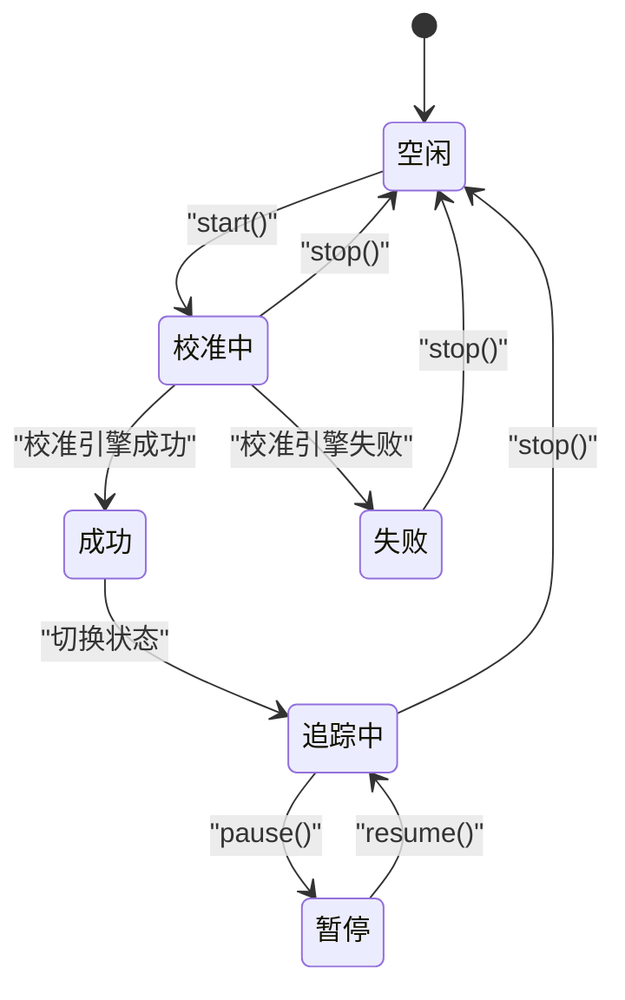
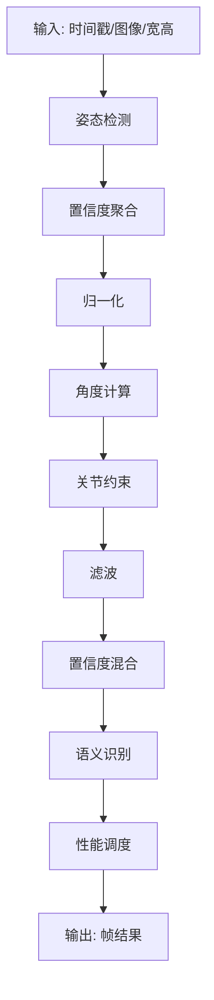
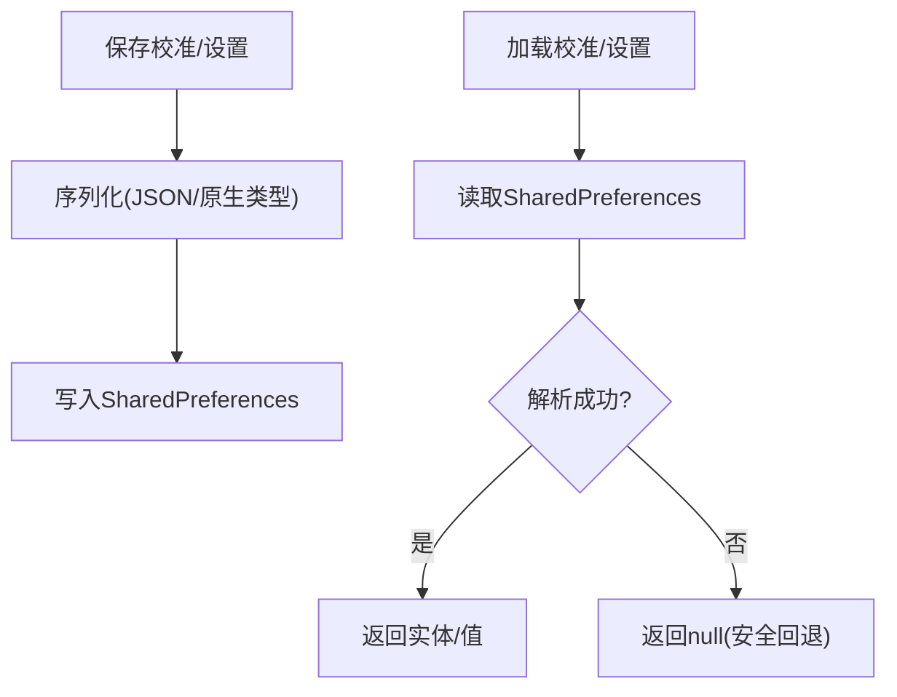
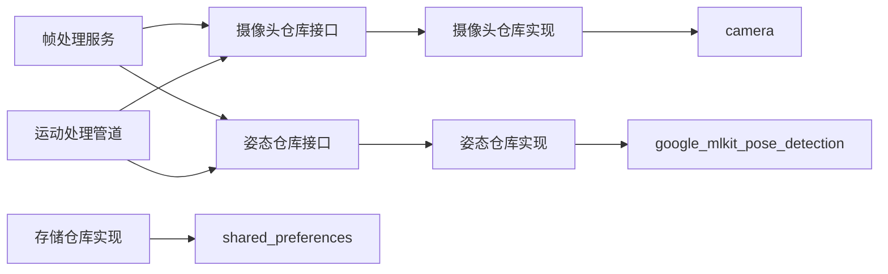

# 数据源管理

<cite>
**本文引用的文件**
- [pubspec.yaml](file://pubspec.yaml)
- [main.dart](file://lib/main.dart)
- [camera_repository.dart](file://lib/domain/repositories/camera_repository.dart)
- [pose_repository.dart](file://lib/domain/repositories/pose_repository.dart)
- [camera_repository_impl.dart](file://lib/data/repositories_impl/camera_repository_impl.dart)
- [pose_repository_impl.dart](file://lib/data/repositories_impl/pose_repository_impl.dart)
- [frame_processing_service.dart](file://lib/application/services/frame_processing_service.dart)
- [motion_pipeline.dart](file://lib/application/pipeline/motion_pipeline.dart)
- [storage_repository_impl.dart](file://lib/data/repositories_impl/storage_repository_impl.dart)
- [body_metrics.dart](file://lib/domain/entities/body_metrics.dart)
- [frame_result.dart](file://lib/domain/entities/frame_result.dart)
- [landmark.dart](file://lib/domain/entities/landmark.dart)
- [joint_type.dart](file://lib/domain/entities/joint_type.dart)
</cite>

## 目录
1. [简介](#简介)
2. [项目结构](#项目结构)
3. [核心组件](#核心组件)
4. [架构总览](#架构总览)
5. [详细组件分析](#详细组件分析)
6. [依赖分析](#依赖分析)
7. [性能考虑](#性能考虑)
8. [故障排查指南](#故障排查指南)
9. [结论](#结论)
10. [附录](#附录)

## 简介
本文件面向Mimo项目的数据源管理，系统性阐述摄像头数据源与AI姿态检测数据源的接入、初始化与配置、数据流获取与处理、生命周期管理与资源释放、错误处理与异常恢复、性能监控与优化、多数据源协调与同步、扩展与插件化设计、安全性与权限管理，以及调试与诊断方法。目标是帮助开发者在不直接阅读代码的情况下，也能理解并维护数据源体系。

## 项目结构
Mimo采用分层架构：应用层负责编排与状态；领域层定义实体、仓库接口与业务引擎；数据层提供具体仓库实现；应用管道串联各引擎完成端到端处理。核心数据源涉及：
- 摄像头数据源：通过camera包提供CameraController与图像流回调
- AI姿态检测数据源：通过google_mlkit_pose_detection提供实时姿态检测
- 存储数据源：通过shared_preferences持久化校准参数与用户设置

图表来源
- [frame_processing_service.dart:32-62](file://lib/application/services/frame_processing_service.dart#L32-L62)
- [motion_pipeline.dart:17-51](file://lib/application/pipeline/motion_pipeline.dart#L17-L51)
- [camera_repository.dart:4-27](file://lib/domain/repositories/camera_repository.dart#L4-L27)
- [pose_repository.dart:5-22](file://lib/domain/repositories/pose_repository.dart#L5-L22)
- [camera_repository_impl.dart:5-89](file://lib/data/repositories_impl/camera_repository_impl.dart#L5-L89)
- [pose_repository_impl.dart:11-203](file://lib/data/repositories_impl/pose_repository_impl.dart#L11-L203)
- [storage_repository_impl.dart:7-114](file://lib/data/repositories_impl/storage_repository_impl.dart#L7-L114)
- [body_metrics.dart:4-108](file://lib/domain/entities/body_metrics.dart#L4-L108)
- [frame_result.dart:7-66](file://lib/domain/entities/frame_result.dart#L7-L66)
- [landmark.dart:4-86](file://lib/domain/entities/landmark.dart#L4-L86)
- [joint_type.dart:4-56](file://lib/domain/entities/joint_type.dart#L4-L56)

章节来源
- [pubspec.yaml:40-55](file://pubspec.yaml#L40-L55)
- [main.dart:1-34](file://lib/main.dart#L1-L34)

## 核心组件
- 摄像头仓库接口与实现：定义摄像头控制器、初始化、预览控制、切换摄像头与资源释放，并通过回调向上传递原始图像帧。
- 姿态仓库接口与实现：封装ML Kit姿态检测器，将CameraImage转换为InputImage并执行检测，输出关键点映射。
- 帧处理服务：连接摄像头与姿态检测，串行处理校准、归一化、角度计算、关节约束、滤波、置信度混合与语义识别，并统计FPS。
- 运动处理管道：作为纯函数式编排层，对单帧进行同样的处理流程，便于测试与复用。
- 存储仓库：提供校准数据与用户设置的持久化读写。
- 实体模型：定义关节类型、关键点、帧结果与人体度量，支撑跨层数据契约。

章节来源
- [camera_repository.dart:4-27](file://lib/domain/repositories/camera_repository.dart#L4-L27)
- [camera_repository_impl.dart:5-89](file://lib/data/repositories_impl/camera_repository_impl.dart#L5-L89)
- [pose_repository.dart:5-22](file://lib/domain/repositories/pose_repository.dart#L5-L22)
- [pose_repository_impl.dart:11-203](file://lib/data/repositories_impl/pose_repository_impl.dart#L11-L203)
- [frame_processing_service.dart:32-248](file://lib/application/services/frame_processing_service.dart#L32-L248)
- [motion_pipeline.dart:17-141](file://lib/application/pipeline/motion_pipeline.dart#L17-L141)
- [storage_repository_impl.dart:7-114](file://lib/data/repositories_impl/storage_repository_impl.dart#L7-L114)
- [body_metrics.dart:4-108](file://lib/domain/entities/body_metrics.dart#L4-L108)
- [frame_result.dart:7-66](file://lib/domain/entities/frame_result.dart#L7-L66)
- [landmark.dart:4-86](file://lib/domain/entities/landmark.dart#L4-L86)
- [joint_type.dart:4-56](file://lib/domain/entities/joint_type.dart#L4-L56)

## 架构总览
下图展示从摄像头采集到姿态检测、再到处理管道与存储的整体数据流：

图表来源
- [frame_processing_service.dart:71-148](file://lib/application/services/frame_processing_service.dart#L71-L148)
- [camera_repository_impl.dart:50-96](file://lib/data/repositories_impl/camera_repository_impl.dart#L50-L96)
- [pose_repository_impl.dart:40-71](file://lib/data/repositories_impl/pose_repository_impl.dart#L40-L71)
- [motion_pipeline.dart:61-130](file://lib/application/pipeline/motion_pipeline.dart#L61-L130)
- [storage_repository_impl.dart:13-39](file://lib/data/repositories_impl/storage_repository_impl.dart#L13-L39)

## 详细组件分析

### 摄像头数据源
- 初始化与配置
  - 自动发现可用摄像头，优先选择前置摄像头；使用中等分辨率与NV21/YUV420/BGRA8888兼容格式。
  - 初始化失败时设置未初始化状态并抛出异常，供上层捕获。
- 数据流获取
  - 通过startImageStream注册回调，将原始CameraImage向上游传递。
- 生命周期管理
  - 提供stopPreview与switchCamera，内部先停止流再释放控制器并重新初始化。
  - dispose彻底释放控制器并重置状态。
- 错误处理
  - 初始化阶段捕获异常并回滚状态；回调中避免重复处理已暂停/空闲状态。

图表来源
- [camera_repository_impl.dart:20-47](file://lib/data/repositories_impl/camera_repository_impl.dart#L20-L47)

章节来源
- [camera_repository.dart:4-27](file://lib/domain/repositories/camera_repository.dart#L4-L27)
- [camera_repository_impl.dart:5-89](file://lib/data/repositories_impl/camera_repository_impl.dart#L5-L89)

### AI姿态检测数据源
- 初始化与配置
  - 使用流式检测模式与高精度模型，初始化即标记为可用。
- 图像格式适配
  - 支持NV21、YUV420与BGRA8888三种常见格式，统一转换为InputImage并设置旋转元数据。
- 关键点映射
  - 将MediaPipe索引映射到关节类型，构建关键点集合；对不可见或异常情况返回空映射。
- 生命周期管理
  - close关闭检测器并重置状态。

图表来源
- [pose_repository_impl.dart:38-71](file://lib/data/repositories_impl/pose_repository_impl.dart#L38-L71)
- [pose_repository_impl.dart:74-131](file://lib/data/repositories_impl/pose_repository_impl.dart#L74-L131)
- [pose_repository_impl.dart:150-183](file://lib/data/repositories_impl/pose_repository_impl.dart#L150-L183)

章节来源
- [pose_repository.dart:5-22](file://lib/domain/repositories/pose_repository.dart#L5-L22)
- [pose_repository_impl.dart:11-203](file://lib/data/repositories_impl/pose_repository_impl.dart#L11-L203)

### 帧处理服务（编排层）
- 组件职责
  - 管理摄像头与姿态检测的生命周期；订阅图像流；按状态处理校准与追踪；统计FPS；对外发布帧结果。
- 状态机
  - idle → calibrating → tracking → paused；暂停/恢复仅改变处理逻辑，不影响底层数据源。
- 处理流程
  - 校准阶段：调用校准引擎生成人体度量，保存至存储，切换到追踪。
  - 追踪阶段：置信度聚合、归一化、角度计算、关节约束、滤波、置信度混合、语义识别，最终产出帧结果。
- 资源管理
  - stop停止预览与取消订阅；dispose依次释放姿态检测器与摄像头控制器。

图表来源
- [frame_processing_service.dart:22-27](file://lib/application/services/frame_processing_service.dart#L22-L27)
- [frame_processing_service.dart:71-106](file://lib/application/services/frame_processing_service.dart#L71-L106)
- [frame_processing_service.dart:150-167](file://lib/application/services/frame_processing_service.dart#L150-L167)
- [frame_processing_service.dart:169-216](file://lib/application/services/frame_processing_service.dart#L169-L216)

章节来源
- [frame_processing_service.dart:32-248](file://lib/application/services/frame_processing_service.dart#L32-L248)

### 运动处理管道（纯函数式编排）
- 输入输出
  - 输入：时间戳、图像、宽高；输出：帧结果（关节角度、手势、置信度）。
- 处理步骤
  - 姿态检测 → 置信度聚合 → 归一化 → 角度计算 → 关节约束 → 滤波 → 置信度混合 → 语义识别 → 性能调度。
- 重置能力
  - 提供reset重置各引擎状态，便于重新训练或切换场景。

图表来源
- [motion_pipeline.dart:61-130](file://lib/application/pipeline/motion_pipeline.dart#L61-L130)

章节来源
- [motion_pipeline.dart:17-141](file://lib/application/pipeline/motion_pipeline.dart#L17-L141)

### 存储数据源
- 校准数据
  - 使用SharedPreferences保存人体度量，序列化为JSON字符串；加载失败时安全回退。
- 用户设置
  - 支持多种基本类型与复杂对象的序列化存储；提供类型安全的读取接口。
- 清理
  - 提供清除校准数据的能力。

图表来源
- [storage_repository_impl.dart:13-39](file://lib/data/repositories_impl/storage_repository_impl.dart#L13-L39)
- [storage_repository_impl.dart:61-84](file://lib/data/repositories_impl/storage_repository_impl.dart#L61-L84)

章节来源
- [storage_repository_impl.dart:7-114](file://lib/data/repositories_impl/storage_repository_impl.dart#L7-L114)
- [body_metrics.dart:43-64](file://lib/domain/entities/body_metrics.dart#L43-L64)

### 实体模型
- 关节类型：定义上肢与头部等关键关节，映射MediaPipe索引与Rive骨骼名。
- 关键点：归一化坐标与可见度，支持距离计算与有效性判断。
- 帧结果：包含关节角度、手势、时间戳与置信度，支持空帧与复制。
- 人体度量：肩宽、缩放因子、左右臂长与校准时间，支持默认值与有效性判断。

章节来源
- [joint_type.dart:4-56](file://lib/domain/entities/joint_type.dart#L4-L56)
- [landmark.dart:4-86](file://lib/domain/entities/landmark.dart#L4-L86)
- [frame_result.dart:7-66](file://lib/domain/entities/frame_result.dart#L7-L66)
- [body_metrics.dart:4-108](file://lib/domain/entities/body_metrics.dart#L4-L108)

## 依赖分析
- 外部依赖
  - camera：提供CameraController与CameraImage
  - google_mlkit_pose_detection：提供PoseDetector与InputImage
  - shared_preferences：提供本地持久化
- 内部耦合
  - 帧处理服务依赖两个仓库接口，通过Riverpod注入具体实现
  - 运动处理管道依赖多个引擎与服务，但保持纯函数式，便于测试
  - 实体模型跨层共享，确保数据契约稳定

图表来源
- [frame_processing_service.dart:34-62](file://lib/application/services/frame_processing_service.dart#L34-L62)
- [motion_pipeline.dart:19-43](file://lib/application/pipeline/motion_pipeline.dart#L19-L43)
- [camera_repository_impl.dart:1-2](file://lib/data/repositories_impl/camera_repository_impl.dart#L1-L2)
- [pose_repository_impl.dart:1-7](file://lib/data/repositories_impl/pose_repository_impl.dart#L1-L7)
- [storage_repository_impl.dart:2-4](file://lib/data/repositories_impl/storage_repository_impl.dart#L2-L4)

章节来源
- [pubspec.yaml:40-55](file://pubspec.yaml#L40-L55)

## 性能考虑
- 帧率统计
  - 帧处理服务每秒更新一次当前FPS，供UI与日志使用。
- 处理链路优化
  - 运动处理管道在追踪阶段按顺序执行，建议在各引擎中实现轻量化与缓存策略；必要时引入异步批处理。
- 图像格式与分辨率
  - 摄像头仓库使用中等分辨率与NV21/YUV420/BGRA8888兼容格式，平衡质量与性能；可根据设备能力调整分辨率预设。
- 置信度融合
  - 在无检测时以idle姿态插值，避免UI抖动；置信度混合提升鲁棒性。
- 调度与限频
  - 可结合性能调度器限制处理频率，降低CPU/GPU占用。

章节来源
- [frame_processing_service.dart:231-241](file://lib/application/services/frame_processing_service.dart#L231-L241)
- [motion_pipeline.dart:118-122](file://lib/application/pipeline/motion_pipeline.dart#L118-L122)
- [camera_repository_impl.dart:34-39](file://lib/data/repositories_impl/camera_repository_impl.dart#L34-L39)

## 故障排查指南
- 摄像头无画面
  - 检查初始化是否抛出“无摄像头可用”异常；确认前置摄像头是否存在；尝试切换摄像头。
- 姿态检测无结果
  - 检查detectFromCameraImage返回空映射的原因（图像格式不支持、转换失败、ML Kit异常）；确认摄像头方向与旋转参数。
- 校准失败
  - 查看校准引擎返回的状态与指标；确认环境光线与遮挡；重新开始校准流程。
- FPS过低
  - 检查处理链路中是否存在阻塞操作；适当降低分辨率或减少滤波强度；避免频繁重置引擎。
- 存储读写异常
  - 检查SharedPreferences读写是否成功；确认序列化/反序列化格式一致；必要时清理损坏数据。

章节来源
- [camera_repository_impl.dart:24-26](file://lib/data/repositories_impl/camera_repository_impl.dart#L24-L26)
- [pose_repository_impl.dart:55-70](file://lib/data/repositories_impl/pose_repository_impl.dart#L55-L70)
- [frame_processing_service.dart:150-167](file://lib/application/services/frame_processing_service.dart#L150-L167)
- [storage_repository_impl.dart:26-32](file://lib/data/repositories_impl/storage_repository_impl.dart#L26-L32)

## 结论
Mimo的数据源管理以清晰的分层与接口抽象为核心，摄像头与AI姿态检测分别由独立仓库实现，通过帧处理服务与运动处理管道进行编排。该设计具备良好的可测试性、可维护性与扩展性，能够满足实时2D动捕的性能与稳定性要求。后续可在多数据源同步、动态插件化与更细粒度的性能监控方面进一步演进。

## 附录
- 应用入口路由
  - 应用启动后进入校准页，随后跳转主页与设置页，数据源在页面交互中被激活与释放。
- 关键路径参考
  - 摄像头初始化与切换：[camera_repository_impl.dart:20-82](file://lib/data/repositories_impl/camera_repository_impl.dart#L20-L82)
  - 姿态检测与格式转换：[pose_repository_impl.dart:38-131](file://lib/data/repositories_impl/pose_repository_impl.dart#L38-L131)
  - 帧处理主循环与状态机：[frame_processing_service.dart:71-216](file://lib/application/services/frame_processing_service.dart#L71-L216)
  - 单帧处理管道：[motion_pipeline.dart:61-130](file://lib/application/pipeline/motion_pipeline.dart#L61-L130)
  - 校准数据持久化：[storage_repository_impl.dart:13-39](file://lib/data/repositories_impl/storage_repository_impl.dart#L13-L39)

章节来源
- [main.dart:26-31](file://lib/main.dart#L26-L31)