# 本地存储方案

<cite>
**本文档引用的文件**
- [pubspec.yaml](file://pubspec.yaml)
- [storage_repository.dart](file://lib/domain/repositories/storage_repository.dart)
- [storage_repository_impl.dart](file://lib/data/repositories_impl/storage_repository_impl.dart)
- [body_metrics.dart](file://lib/domain/entities/body_metrics.dart)
- [providers.dart](file://lib/application/providers/providers.dart)
- [settings_page.dart](file://lib/presentation/pages/settings_page.dart)
- [frame_processing_service.dart](file://lib/application/services/frame_processing_service.dart)
- [calibration_engine.dart](file://lib/domain/engines/calibration/calibration_engine.dart)
- [performance_config.dart](file://lib/core/config/performance_config.dart)
- [app_constants.dart](file://lib/core/constants/app_constants.dart)
</cite>

## 目录
1. [引言](#引言)
2. [项目结构](#项目结构)
3. [核心组件](#核心组件)
4. [架构概览](#架构概览)
5. [详细组件分析](#详细组件分析)
6. [依赖关系分析](#依赖关系分析)
7. [性能考虑](#性能考虑)
8. [故障排除指南](#故障排除指南)
9. [结论](#结论)
10. [附录](#附录)

## 引言

本文件为Mimo项目的本地存储方案技术文档，深入解释了项目采用的本地存储策略与实现方案。Mimo是一个基于Flutter的AI视觉识别实时2D动捕互动工具，需要在移动端实现高效的配置数据与用户偏好的持久化存储。

项目采用了两种主要的本地存储方式：
- shared_preferences：用于轻量级配置数据和用户偏好的存储
- sqflite：用于结构化数据的数据库存储（通过依赖声明）

本文档将详细说明存储接口设计、实现细节、数据持久化策略、缓存机制、配置与偏好管理、数据安全与加密、性能优化、内存管理、备份与恢复、存储空间管理与清理、跨平台兼容性处理，以及存储故障处理与恢复方案。

## 项目结构

Mimo项目的本地存储相关代码组织遵循领域驱动设计原则，将存储逻辑分离为接口层、实现层和应用层：

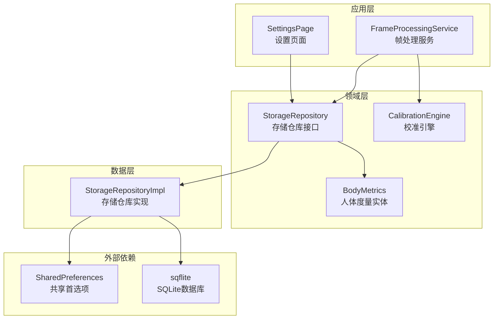

**图表来源**
- [storage_repository.dart:1-19](file://lib/domain/repositories/storage_repository.dart#L1-L19)
- [storage_repository_impl.dart:1-115](file://lib/data/repositories_impl/storage_repository_impl.dart#L1-L115)
- [settings_page.dart:1-63](file://lib/presentation/pages/settings_page.dart#L1-L63)
- [frame_processing_service.dart:1-254](file://lib/application/services/frame_processing_service.dart#L1-L254)

**章节来源**
- [pubspec.yaml:49-52](file://pubspec.yaml#L49-L52)
- [storage_repository.dart:1-19](file://lib/domain/repositories/storage_repository.dart#L1-L19)
- [storage_repository_impl.dart:1-115](file://lib/data/repositories_impl/storage_repository_impl.dart#L1-L115)

## 核心组件

### 存储仓库接口

存储仓库接口定义了统一的存储操作规范，支持校准数据和用户设置的持久化：

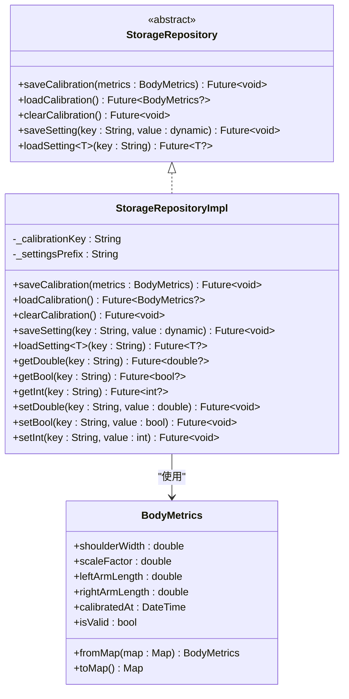

**图表来源**
- [storage_repository.dart:1-19](file://lib/domain/repositories/storage_repository.dart#L1-L19)
- [storage_repository_impl.dart:1-115](file://lib/data/repositories_impl/storage_repository_impl.dart#L1-L115)
- [body_metrics.dart:1-109](file://lib/domain/entities/body_metrics.dart#L1-L109)

### 数据模型

人体度量数据模型提供了完整的序列化和反序列化能力：

| 字段名 | 类型 | 描述 | 默认值 |
|--------|------|------|--------|
| shoulderWidth | double | 肩宽（归一化坐标） | 0.35（基线值） |
| scaleFactor | double | 缩放因子 | 1.0 |
| leftArmLength | double | 左臂长度（归一化坐标） | 0.42 |
| rightArmLength | double | 右臂长度（归一化坐标） | 0.42 |
| calibratedAt | DateTime | 校准时间戳 | 当前时间 |

**章节来源**
- [storage_repository.dart:1-19](file://lib/domain/repositories/storage_repository.dart#L1-L19)
- [storage_repository_impl.dart:1-115](file://lib/data/repositories_impl/storage_repository_impl.dart#L1-L115)
- [body_metrics.dart:1-109](file://lib/domain/entities/body_metrics.dart#L1-L109)

## 架构概览

Mimo的本地存储架构采用分层设计，实现了清晰的关注点分离：

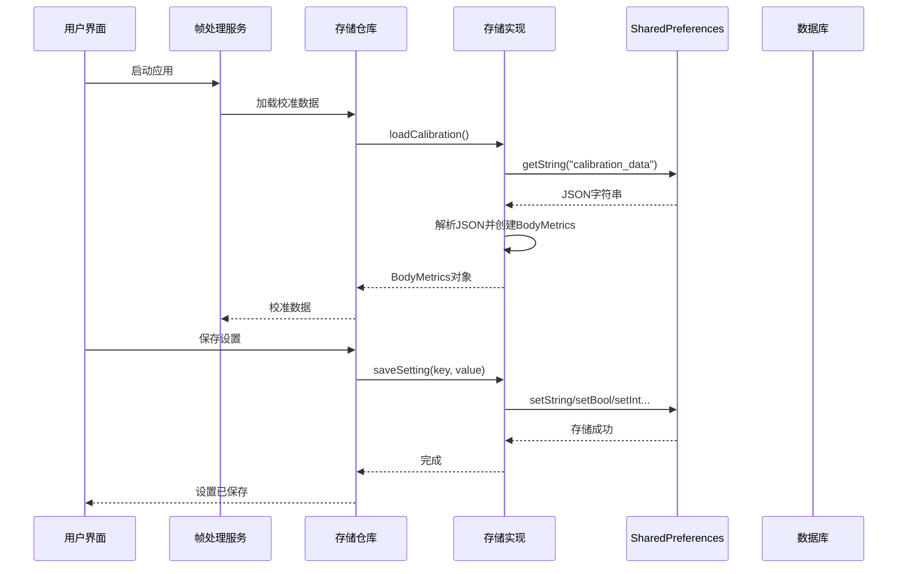

**图表来源**
- [frame_processing_service.dart:150-167](file://lib/application/services/frame_processing_service.dart#L150-L167)
- [storage_repository_impl.dart:11-39](file://lib/data/repositories_impl/storage_repository_impl.dart#L11-L39)
- [settings_page.dart:34-63](file://lib/presentation/pages/settings_page.dart#L34-L63)

## 详细组件分析

### 存储实现策略

#### SharedPreferences集成

存储实现基于SharedPreferences，提供了类型安全的键值对存储：

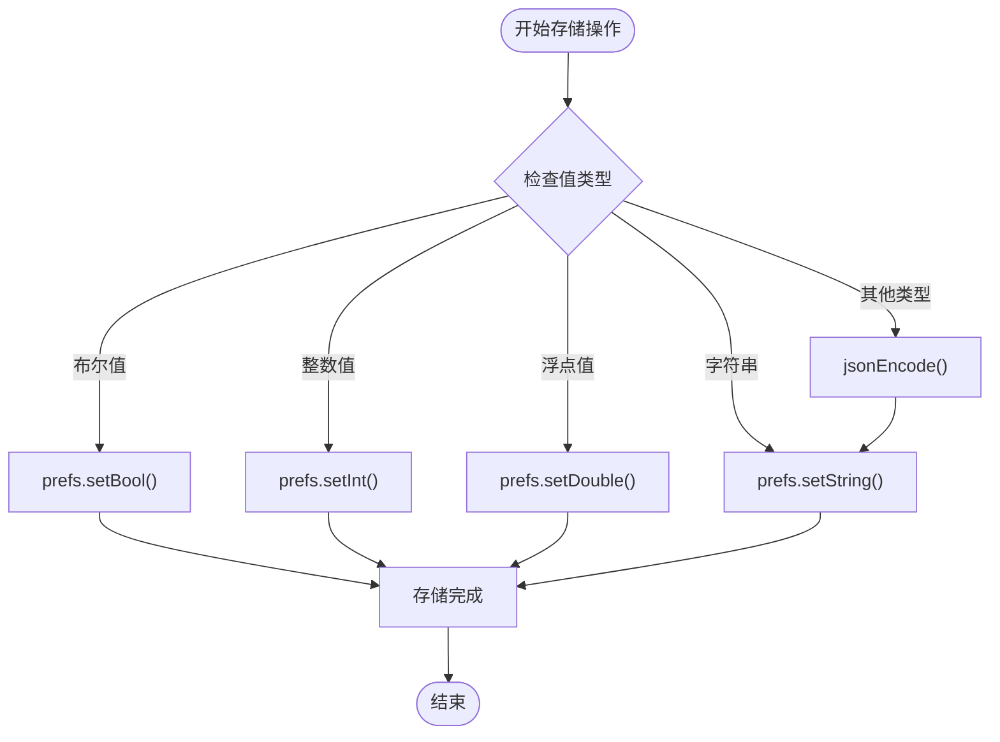

**图表来源**
- [storage_repository_impl.dart:43-58](file://lib/data/repositories_impl/storage_repository_impl.dart#L43-L58)

#### 校准数据管理

校准数据采用JSON序列化存储，确保数据的完整性和可移植性：

| 存储键 | 数据类型 | 描述 | 使用场景 |
|--------|----------|------|----------|
| calibration_data | JSON字符串 | 人体度量数据的完整表示 | 应用启动时自动加载 |
| setting_ + key | 动态类型 | 用户设置的键值对 | 各种应用配置参数 |

**章节来源**
- [storage_repository_impl.dart:8-9](file://lib/data/repositories_impl/storage_repository_impl.dart#L8-L9)
- [storage_repository_impl.dart:13-39](file://lib/data/repositories_impl/storage_repository_impl.dart#L13-L39)

### 数据持久化策略

#### 配置数据存储

应用配置数据采用延迟加载策略，在首次访问时才进行存储操作：

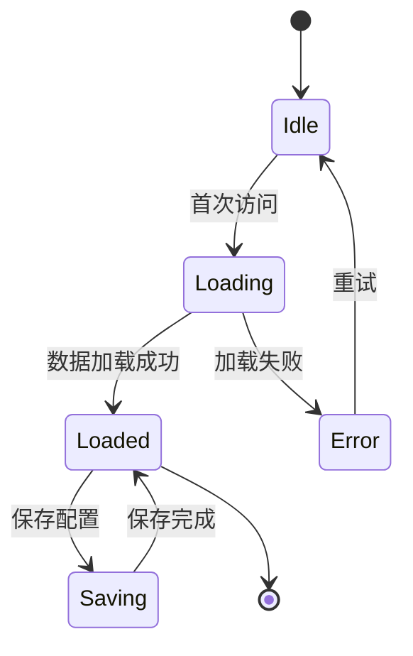

#### 用户偏好管理

用户偏好通过统一的设置接口管理，支持多种数据类型的自动转换：

| 设置类型 | 存储方法 | 读取方法 | 典型用途 |
|----------|----------|----------|----------|
| 布尔值 | saveSetting(key, bool) | getBool(key) | 开关类设置 |
| 整数值 | saveSetting(key, int) | getInt(key) | 数值类设置 |
| 浮点值 | saveSetting(key, double) | getDouble(key) | 精确数值设置 |
| 字符串 | saveSetting(key, String) | loadSetting<String>(key) | 文本类设置 |

**章节来源**
- [storage_repository_impl.dart:86-115](file://lib/data/repositories_impl/storage_repository_impl.dart#L86-L115)
- [settings_page.dart:34-63](file://lib/presentation/pages/settings_page.dart#L34-L63)

### 缓存机制

#### 内存缓存策略

应用采用懒加载和按需缓存策略，避免不必要的内存占用：

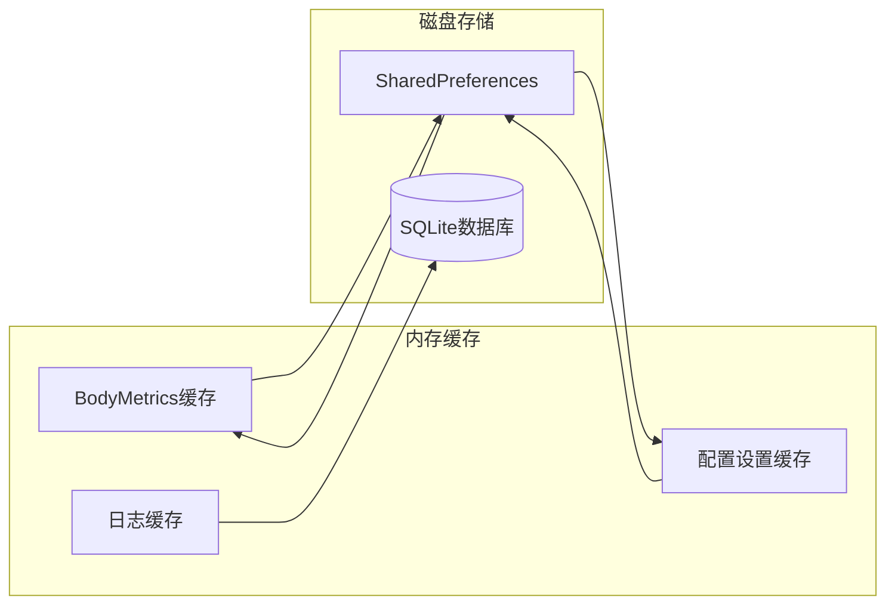

#### 缓存失效策略

- 校准数据：应用启动时加载，运行时驻留内存
- 用户设置：按需加载，支持手动刷新
- 性能配置：静态常量，无需持久化

**章节来源**
- [frame_processing_service.dart:150-167](file://lib/application/services/frame_processing_service.dart#L150-L167)
- [performance_config.dart:1-79](file://lib/core/config/performance_config.dart#L1-L79)

### 数据加密与安全存储

#### 安全存储考虑

当前实现采用明文存储，建议的安全增强方案：

1. **敏感数据隔离**：将密码、令牌等敏感信息单独存储
2. **数据加密**：对重要数据进行AES加密
3. **访问控制**：限制存储访问权限
4. **完整性校验**：添加数据完整性检查

#### 加密实现建议

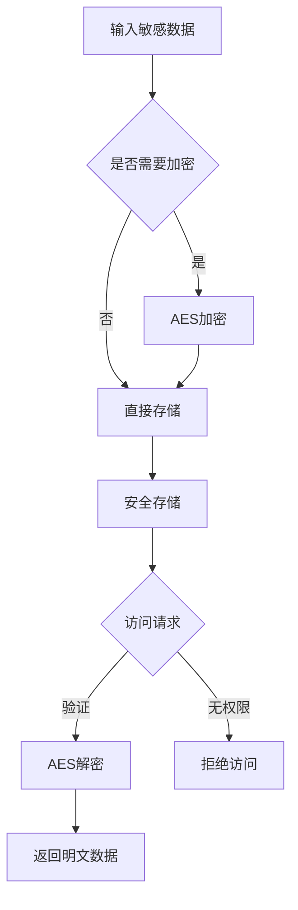

### 配置数据与用户偏好管理

#### 配置数据结构

应用配置数据分为多个层次：

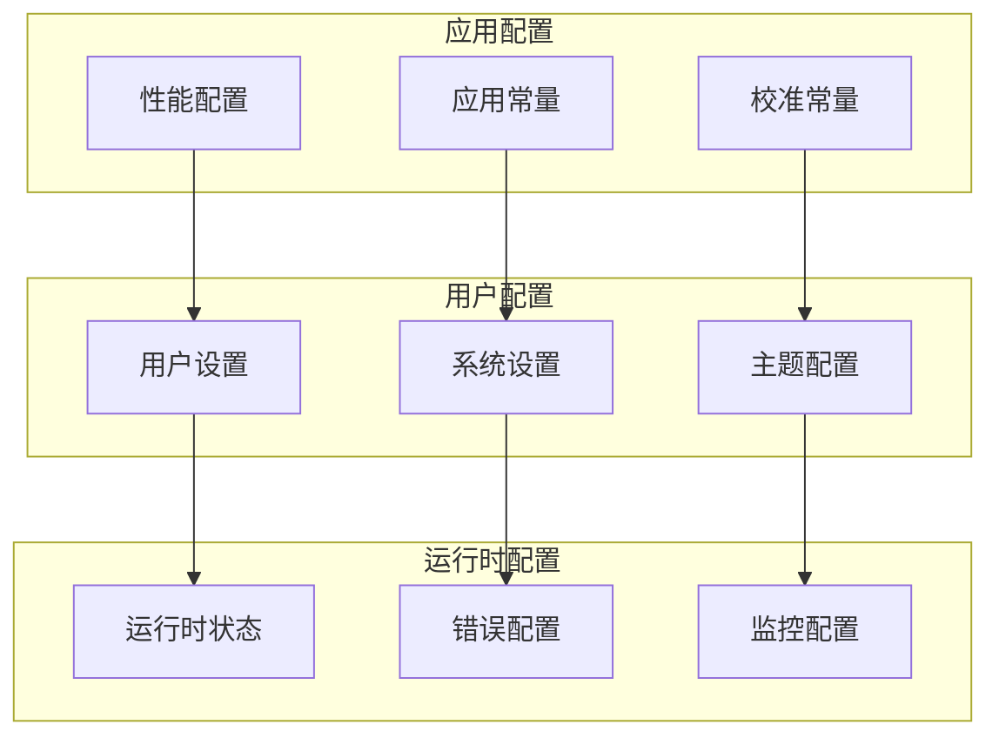

**图表来源**
- [performance_config.dart:1-79](file://lib/core/config/performance_config.dart#L1-L79)
- [app_constants.dart:1-35](file://lib/core/constants/app_constants.dart#L1-L35)

**章节来源**
- [performance_config.dart:1-79](file://lib/core/config/performance_config.dart#L1-L79)
- [app_constants.dart:1-35](file://lib/core/constants/app_constants.dart#L1-L35)

## 依赖关系分析

### 组件耦合度分析

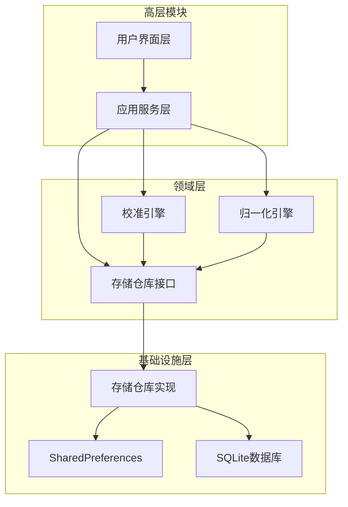

**图表来源**
- [providers.dart:1-103](file://lib/application/providers/providers.dart#L1-L103)
- [storage_repository.dart:1-19](file://lib/domain/repositories/storage_repository.dart#L1-L19)

### 外部依赖关系

| 依赖包 | 版本 | 用途 | 依赖关系 |
|--------|------|------|----------|
| shared_preferences | ^2.3.0 | 配置数据存储 | Flutter SDK |
| sqflite | ^2.3.0 | 结构化数据存储 | path, Flutter SDK |
| path | ^1.9.0 | 文件路径处理 | Flutter SDK |
| flutter_riverpod | ^2.6.1 | 状态管理 | Flutter SDK |

**章节来源**
- [pubspec.yaml:49-52](file://pubspec.yaml#L49-L52)
- [providers.dart:1-103](file://lib/application/providers/providers.dart#L1-L103)

## 性能考虑

### 存储性能优化

#### 写入优化策略

1. **批量写入**：合并多个设置操作为单次写入
2. **异步处理**：所有存储操作采用异步执行
3. **缓存策略**：热点数据驻留内存缓存

#### 读取优化策略

1. **延迟加载**：按需加载配置数据
2. **类型安全**：编译时类型检查减少运行时错误
3. **错误恢复**：优雅处理存储异常

### 内存管理最佳实践

#### 内存使用模式

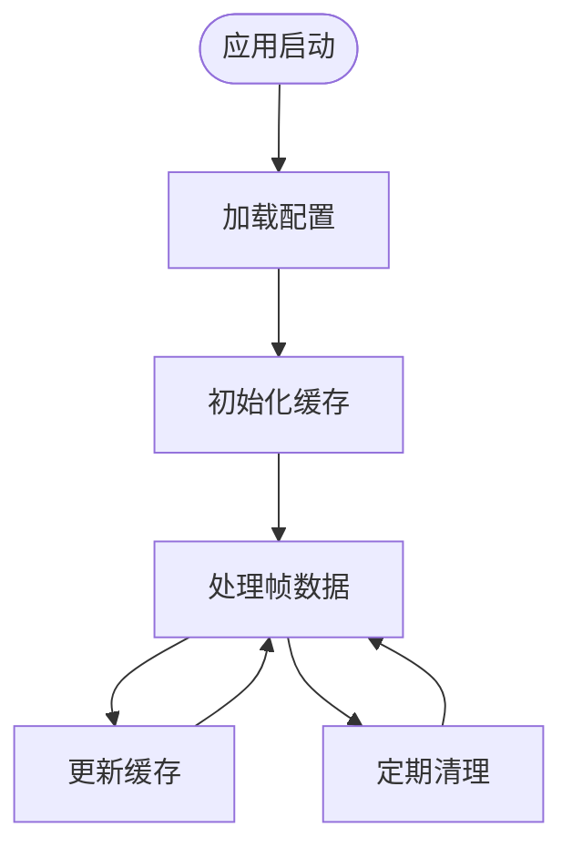

#### 内存监控指标

- 配置数据：常驻内存，大小固定
- 校准数据：按需加载，内存占用小
- 用户设置：轻量级，影响可忽略

**章节来源**
- [storage_repository_impl.dart:1-115](file://lib/data/repositories_impl/storage_repository_impl.dart#L1-L115)
- [frame_processing_service.dart:230-241](file://lib/application/services/frame_processing_service.dart#L230-L241)

## 故障排除指南

### 常见存储问题

#### 数据丢失问题

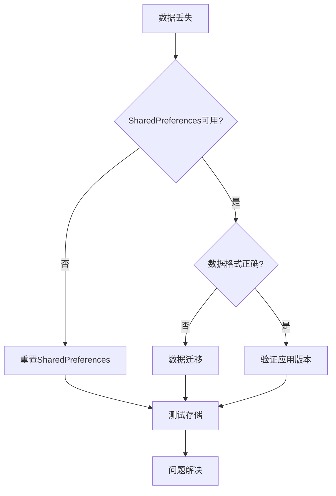

#### 存储权限问题

1. **Android权限**：确保具有内部存储访问权限
2. **iOS权限**：检查钥匙串访问权限
3. **Web兼容性**：验证浏览器存储功能

### 错误处理机制

#### 异常处理策略

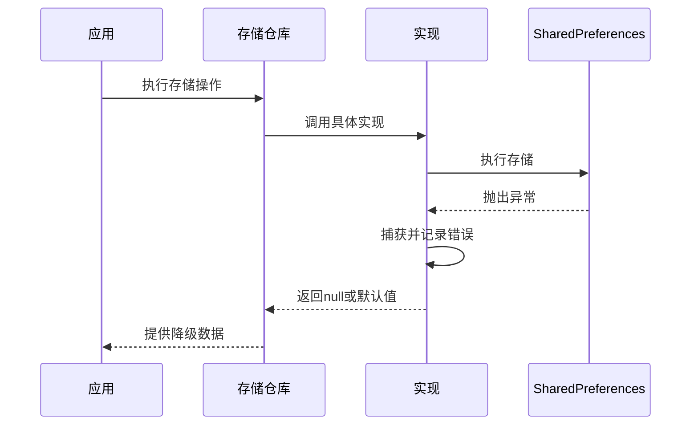

**章节来源**
- [storage_repository_impl.dart:26-31](file://lib/data/repositories_impl/storage_repository_impl.dart#L26-L31)
- [storage_repository_impl.dart:79-83](file://lib/data/repositories_impl/storage_repository_impl.dart#L79-L83)

## 结论

Mimo项目的本地存储方案采用分层架构设计，通过SharedPreferences实现了高效、可靠的配置数据和用户偏好存储。该方案具有以下优势：

1. **简洁性**：接口设计简单直观，易于理解和维护
2. **可靠性**：基于成熟的SharedPreferences库，稳定性高
3. **扩展性**：支持多种数据类型，便于功能扩展
4. **性能**：异步操作和缓存机制保证了良好的用户体验

未来可以考虑的改进方向包括：
- 增加数据加密功能
- 扩展到SQLite数据库支持
- 实现数据备份和同步机制
- 添加更完善的错误处理和恢复机制

## 附录

### 存储配置参考

#### 关键配置参数

| 配置项 | 默认值 | 单位 | 说明 |
|--------|--------|------|------|
| calibrationTimeoutSeconds | 30 | 秒 | 校准超时时间 |
| calibrationArmAngleThreshold | 60.0 | 度 | 手臂角度阈值 |
| calibrationHoldFrames | 30 | 帧 | 校准保持帧数 |
| targetFPS | 30 | FPS | 目标帧率 |
| minFPS | 15 | FPS | 最小帧率 |
| maxLatencyMs | 120 | ms | 最大延迟 |

#### 存储键命名规范

- 校准数据：`calibration_data`
- 用户设置：`setting_[key]`
- 性能配置：`performance_[setting]`
- 日志数据：`log_[type]`

**章节来源**
- [app_constants.dart:1-35](file://lib/core/constants/app_constants.dart#L1-L35)
- [storage_repository_impl.dart:8-9](file://lib/data/repositories_impl/storage_repository_impl.dart#L8-L9)