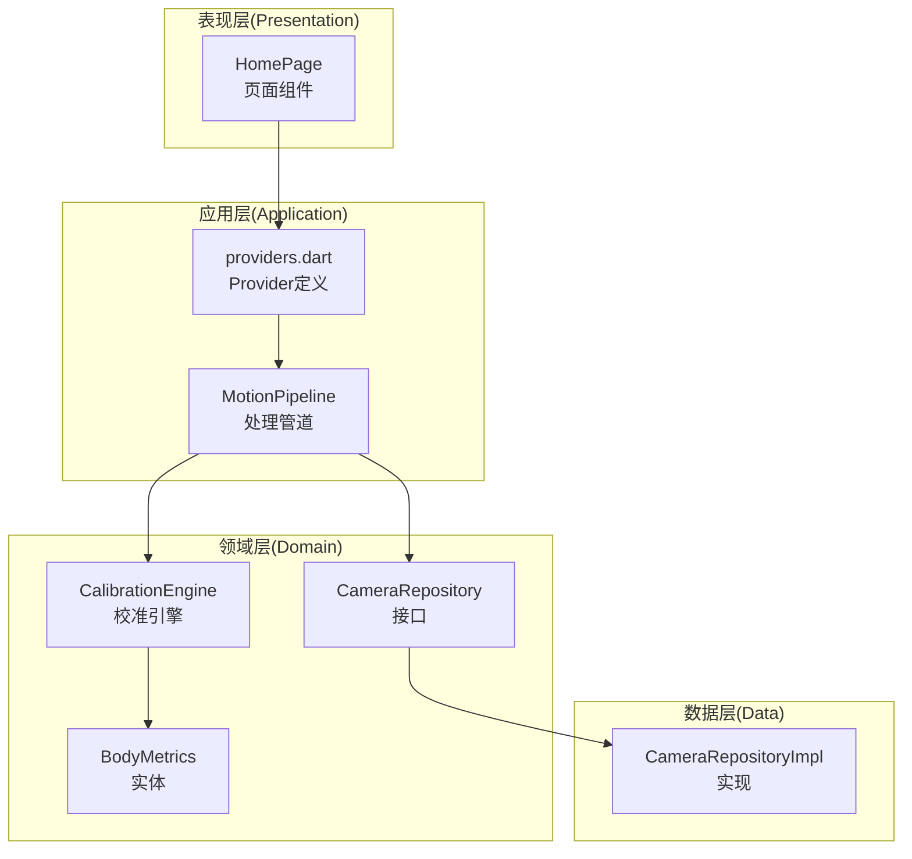
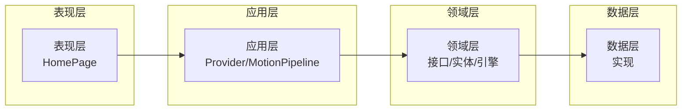
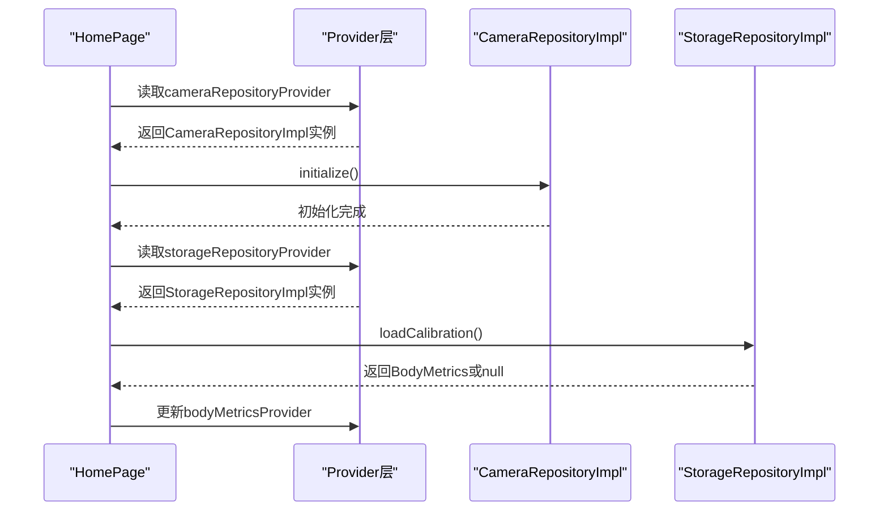
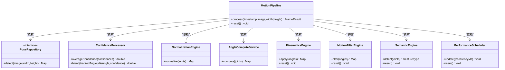
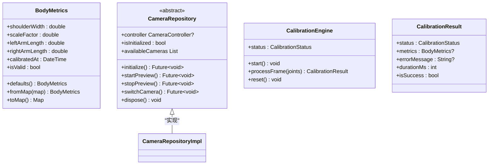
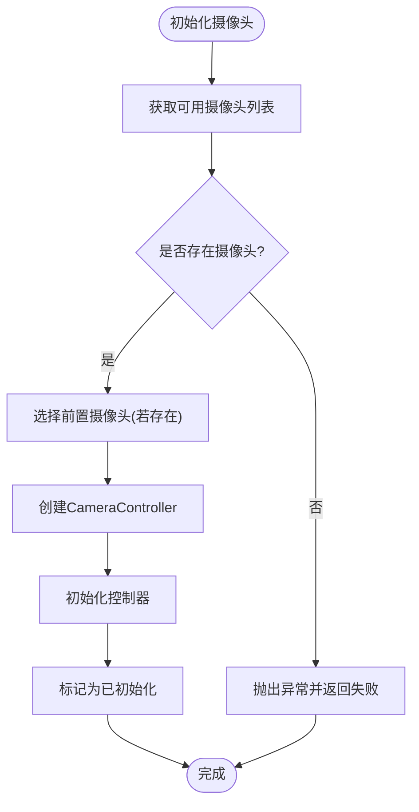
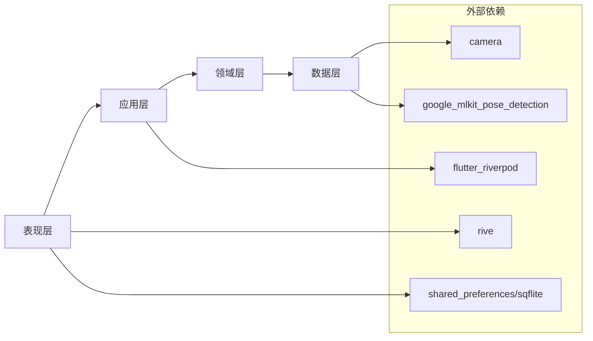

# Clean Architecture分层架构

<cite>
**本文档引用的文件**
- [lib/main.dart](file://lib/main.dart)
- [lib/app/app.dart](file://lib/app/app.dart)
- [lib/application/providers/providers.dart](file://lib/application/providers/providers.dart)
- [lib/application/pipeline/motion_pipeline.dart](file://lib/application/pipeline/motion_pipeline.dart)
- [lib/domain/entities/body_metrics.dart](file://lib/domain/entities/body_metrics.dart)
- [lib/domain/repositories/camera_repository.dart](file://lib/domain/repositories/camera_repository.dart)
- [lib/data/repositories_impl/camera_repository_impl.dart](file://lib/data/repositories_impl/camera_repository_impl.dart)
- [lib/presentation/pages/home_page.dart](file://lib/presentation/pages/home_page.dart)
- [lib/domain/engines/calibration/calibration_engine.dart](file://lib/domain/engines/calibration/calibration_engine.dart)
- [pubspec.yaml](file://pubspec.yaml)
</cite>

## 目录
1. [引言](#引言)
2. [项目结构](#项目结构)
3. [核心组件](#核心组件)
4. [架构总览](#架构总览)
5. [详细组件分析](#详细组件分析)
6. [依赖分析](#依赖分析)
7. [性能考虑](#性能考虑)
8. [故障排除指南](#故障排除指南)
9. [结论](#结论)

## 引言
本文件系统性梳理Mimo项目的Clean Architecture分层架构，明确表现层(Presentation)、应用层(Application)、领域层(Domain)与数据层(Data)的职责边界、依赖方向与交互模式；阐释依赖倒置原则在项目中的落地实践，包括接口定义与依赖注入机制；总结各层间通信方式与数据传递路径，并给出架构图与组件关系图，帮助开发者快速理解与维护该架构。

## 项目结构
Mimo采用按“层”组织的目录结构，配合Riverpod进行依赖注入与状态管理：
- 表现层：负责UI构建与用户交互，使用Flutter与Riverpod进行状态订阅与更新。
- 应用层：包含编排与协调逻辑，通过Provider管理业务对象实例与状态。
- 领域层：定义核心业务实体、接口与引擎算法，强调业务规则与不变量。
- 数据层：封装外部依赖与数据源，提供对领域层接口的具体实现。

图表来源
- [lib/presentation/pages/home_page.dart:1-215](file://lib/presentation/pages/home_page.dart#L1-L215)
- [lib/application/providers/providers.dart:1-103](file://lib/application/providers/providers.dart#L1-L103)
- [lib/application/pipeline/motion_pipeline.dart:1-141](file://lib/application/pipeline/motion_pipeline.dart#L1-L141)
- [lib/domain/engines/calibration/calibration_engine.dart:1-302](file://lib/domain/engines/calibration/calibration_engine.dart#L1-L302)
- [lib/domain/entities/body_metrics.dart:1-109](file://lib/domain/entities/body_metrics.dart#L1-L109)
- [lib/domain/repositories/camera_repository.dart:1-28](file://lib/domain/repositories/camera_repository.dart#L1-L28)
- [lib/data/repositories_impl/camera_repository_impl.dart:1-97](file://lib/data/repositories_impl/camera_repository_impl.dart#L1-L97)

章节来源
- [lib/main.dart:1-34](file://lib/main.dart#L1-L34)
- [lib/app/app.dart:1-27](file://lib/app/app.dart#L1-L27)
- [pubspec.yaml:1-80](file://pubspec.yaml#L1-L80)

## 核心组件
- 表现层组件
  - 页面：HomePage负责UI布局、事件触发与状态展示。
  - 控件：CameraPreviewWidget、RiveAvatarWidget、SafetyFrameOverlay等。
- 应用层组件
  - Provider：集中声明各业务对象与状态Provider，实现依赖注入与状态管理。
  - MotionPipeline：串联姿态检测、归一化、角度计算、运动学约束、滤波、语义识别与性能统计。
- 领域层组件
  - 实体：BodyMetrics保存人体度量数据，支持默认值、序列化与有效性判断。
  - 接口：CameraRepository抽象摄像头控制能力。
  - 引擎：CalibrationEngine实现T-Pose校准流程与人体度量计算。
- 数据层组件
  - 实现：CameraRepositoryImpl基于camera包实现摄像头初始化、图像流与切换。

章节来源
- [lib/presentation/pages/home_page.dart:1-215](file://lib/presentation/pages/home_page.dart#L1-L215)
- [lib/application/providers/providers.dart:1-103](file://lib/application/providers/providers.dart#L1-L103)
- [lib/application/pipeline/motion_pipeline.dart:1-141](file://lib/application/pipeline/motion_pipeline.dart#L1-L141)
- [lib/domain/entities/body_metrics.dart:1-109](file://lib/domain/entities/body_metrics.dart#L1-L109)
- [lib/domain/repositories/camera_repository.dart:1-28](file://lib/domain/repositories/camera_repository.dart#L1-L28)
- [lib/data/repositories_impl/camera_repository_impl.dart:1-97](file://lib/data/repositories_impl/camera_repository_impl.dart#L1-L97)

## 架构总览
Clean Architecture以“依赖倒置”为核心：高层策略不依赖低层实现，而是依赖抽象接口；底层实现依赖抽象接口。Mimo通过以下方式实现：
- 领域层定义接口与实体，不依赖任何外部框架。
- 数据层实现领域接口，向领域层暴露统一契约。
- 应用层通过Provider注入具体实现，编排业务流程。
- 表现层仅消费Provider状态，不直接访问数据层。

图表来源
- [lib/presentation/pages/home_page.dart:1-215](file://lib/presentation/pages/home_page.dart#L1-L215)
- [lib/application/providers/providers.dart:1-103](file://lib/application/providers/providers.dart#L1-L103)
- [lib/application/pipeline/motion_pipeline.dart:1-141](file://lib/application/pipeline/motion_pipeline.dart#L1-L141)
- [lib/domain/repositories/camera_repository.dart:1-28](file://lib/domain/repositories/camera_repository.dart#L1-L28)
- [lib/data/repositories_impl/camera_repository_impl.dart:1-97](file://lib/data/repositories_impl/camera_repository_impl.dart#L1-L97)

## 详细组件分析

### 表现层(Presentation)
- 职责
  - 组合UI组件，响应用户交互，订阅Provider状态并驱动界面更新。
  - 在HomePage中完成摄像头初始化、校准数据加载与状态栏显示。
- 交互模式
  - 使用ConsumerStatefulWidget与ref.read/ref.watch读取Provider状态。
  - 通过Provider触发应用层流程（如启动校准）。
- 关键路径
  - 页面初始化：调用cameraRepository.initialize()与storageRepository.loadCalibration()。
  - 状态展示：订阅currentFpsProvider与calibrationStatusProvider。

图表来源
- [lib/presentation/pages/home_page.dart:24-36](file://lib/presentation/pages/home_page.dart#L24-L36)
- [lib/application/providers/providers.dart:16-29](file://lib/application/providers/providers.dart#L16-L29)
- [lib/data/repositories_impl/camera_repository_impl.dart:20-47](file://lib/data/repositories_impl/camera_repository_impl.dart#L20-L47)

章节来源
- [lib/presentation/pages/home_page.dart:1-215](file://lib/presentation/pages/home_page.dart#L1-L215)

### 应用层(Application)
- 职责
  - 通过Provider集中管理业务对象生命周期与依赖注入。
  - 通过MotionPipeline编排多引擎处理流程，串联姿态检测、归一化、角度计算、运动学约束、滤波、语义识别与性能统计。
- 依赖注入
  - 使用Riverpod Provider将领域接口绑定到具体实现，避免上层直接依赖具体实现。
- 关键路径
  - Provider定义：cameraRepositoryProvider、poseRepositoryProvider、storageRepositoryProvider等。
  - Pipeline编排：process()方法按顺序调用各引擎，返回FrameResult。

图表来源
- [lib/application/pipeline/motion_pipeline.dart:1-141](file://lib/application/pipeline/motion_pipeline.dart#L1-L141)

章节来源
- [lib/application/providers/providers.dart:1-103](file://lib/application/providers/providers.dart#L1-L103)
- [lib/application/pipeline/motion_pipeline.dart:1-141](file://lib/application/pipeline/motion_pipeline.dart#L1-L141)

### 领域层(Domain)
- 职责
  - 定义业务实体、接口与核心算法，保持对技术细节的无感知。
  - 通过抽象接口隔离外部依赖，保证业务规则稳定。
- 核心实体
  - BodyMetrics：保存人体度量数据，支持默认值、序列化与有效性判断。
- 核心接口
  - CameraRepository：抽象摄像头控制器与生命周期管理。
- 核心引擎
  - CalibrationEngine：实现T-Pose校准流程，计算人体度量并输出校准结果。

图表来源
- [lib/domain/entities/body_metrics.dart:1-109](file://lib/domain/entities/body_metrics.dart#L1-L109)
- [lib/domain/repositories/camera_repository.dart:1-28](file://lib/domain/repositories/camera_repository.dart#L1-L28)
- [lib/domain/engines/calibration/calibration_engine.dart:1-302](file://lib/domain/engines/calibration/calibration_engine.dart#L1-L302)
- [lib/data/repositories_impl/camera_repository_impl.dart:1-97](file://lib/data/repositories_impl/camera_repository_impl.dart#L1-L97)

章节来源
- [lib/domain/entities/body_metrics.dart:1-109](file://lib/domain/entities/body_metrics.dart#L1-L109)
- [lib/domain/repositories/camera_repository.dart:1-28](file://lib/domain/repositories/camera_repository.dart#L1-L28)
- [lib/domain/engines/calibration/calibration_engine.dart:1-302](file://lib/domain/engines/calibration/calibration_engine.dart#L1-L302)

### 数据层(Data)
- 职责
  - 封装外部依赖（如camera包），提供对领域接口的具体实现。
  - 对外暴露统一契约，屏蔽平台差异与第三方SDK细节。
- 实现
  - CameraRepositoryImpl基于camera包实现摄像头初始化、图像流回调与切换逻辑。

图表来源
- [lib/data/repositories_impl/camera_repository_impl.dart:20-47](file://lib/data/repositories_impl/camera_repository_impl.dart#L20-L47)

章节来源
- [lib/data/repositories_impl/camera_repository_impl.dart:1-97](file://lib/data/repositories_impl/camera_repository_impl.dart#L1-L97)

## 依赖分析
- 依赖方向
  - 表现层 → 应用层：通过Provider读取状态与触发流程。
  - 应用层 → 领域层：依赖接口而非实现，遵循依赖倒置。
  - 领域层 → 数据层：通过接口调用实现，实现与接口解耦。
- 耦合与内聚
  - 各层内聚良好，跨层交互通过接口进行，降低耦合度。
  - Provider集中管理依赖，提升可测试性与可替换性。
- 外部依赖
  - 摄像头：camera包
  - 姿态检测：google_mlkit_pose_detection
  - 状态管理：flutter_riverpod
  - 动画渲染：rive
  - 本地存储：shared_preferences、sqflite

图表来源
- [pubspec.yaml:30-56](file://pubspec.yaml#L30-L56)
- [lib/application/providers/providers.dart:1-15](file://lib/application/providers/providers.dart#L1-L15)
- [lib/data/repositories_impl/camera_repository_impl.dart:1-2](file://lib/data/repositories_impl/camera_repository_impl.dart#L1-L2)

章节来源
- [pubspec.yaml:1-80](file://pubspec.yaml#L1-L80)

## 性能考虑
- 流水线编排
  - MotionPipeline按阶段串联处理，便于在各阶段插入性能监控与指标统计。
- 资源管理
  - CameraRepositoryImpl在切换摄像头与释放资源时应避免阻塞UI线程，确保流畅性。
- 状态粒度
  - Provider状态拆分合理，避免不必要的重建与重绘。
- 外部依赖优化
  - 姿态检测与滤波等计算密集型操作建议在后台线程执行，减少主线程压力。

## 故障排除指南
- 摄像头初始化失败
  - 现象：初始化后状态为未就绪或抛出异常。
  - 排查：确认设备是否存在可用摄像头，检查权限与相机参数配置。
  - 参考路径：[initialize()实现:20-47](file://lib/data/repositories_impl/camera_repository_impl.dart#L20-L47)
- 校准流程中断
  - 现象：校准超时或提示姿势不正确。
  - 排查：确保关键点可见性达标，维持T-Pose足够帧数，检查阈值配置。
  - 参考路径：[校准引擎状态机与阈值:106-176](file://lib/domain/engines/calibration/calibration_engine.dart#L106-L176)
- 状态未更新
  - 现象：界面未反映最新状态（如FPS、校准进度）。
  - 排查：确认Provider状态更新逻辑与Consumer订阅是否正确。
  - 参考路径：[Provider定义与状态更新:85-103](file://lib/application/providers/providers.dart#L85-L103)

章节来源
- [lib/data/repositories_impl/camera_repository_impl.dart:1-97](file://lib/data/repositories_impl/camera_repository_impl.dart#L1-L97)
- [lib/domain/engines/calibration/calibration_engine.dart:1-302](file://lib/domain/engines/calibration/calibration_engine.dart#L1-L302)
- [lib/application/providers/providers.dart:1-103](file://lib/application/providers/providers.dart#L1-L103)

## 结论
Mimo项目通过Clean Architecture实现了清晰的分层与职责分离，依赖倒置原则贯穿始终：领域层定义接口，数据层提供实现，应用层通过Provider注入并编排业务流程，表现层专注UI与交互。该架构提升了可维护性、可测试性与扩展性，为后续引入更多引擎与数据源提供了良好的基础。