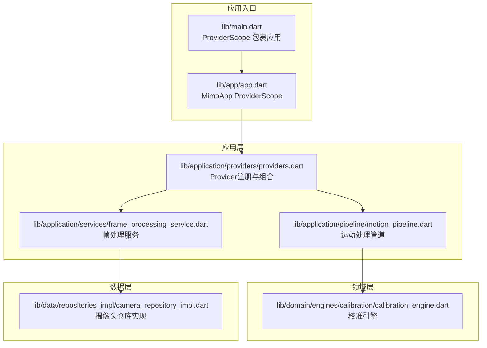
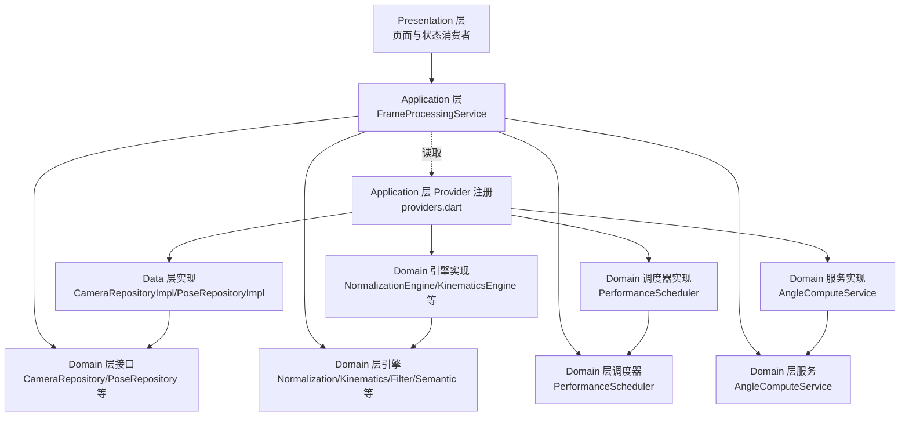
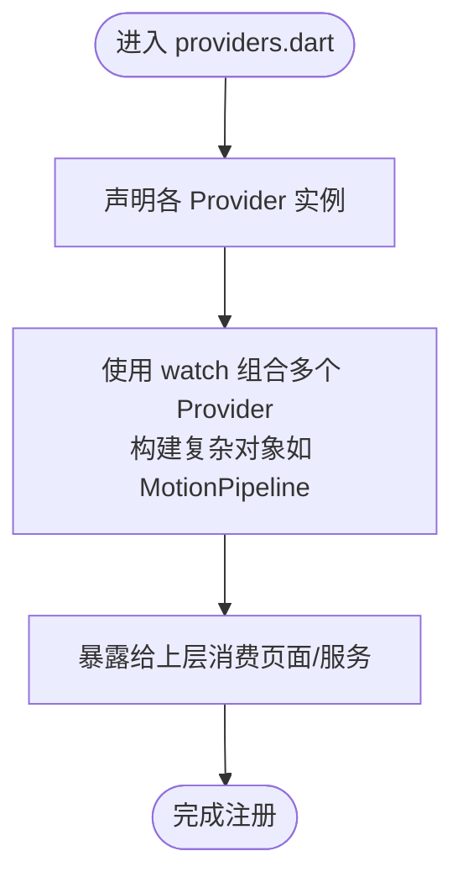
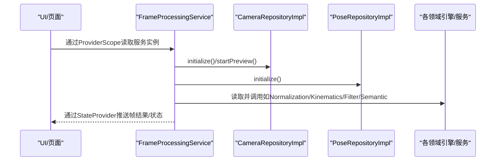
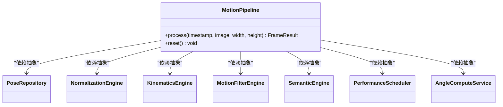
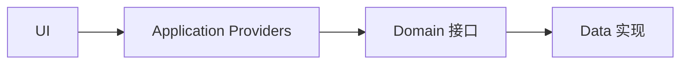

# 依赖注入机制

<cite>
**本文引用的文件**
- [main.dart](file://lib/main.dart)
- [app.dart](file://lib/app/app.dart)
- [providers.dart](file://lib/application/providers/providers.dart)
- [frame_processing_service.dart](file://lib/application/services/frame_processing_service.dart)
- [motion_pipeline.dart](file://lib/application/pipeline/motion_pipeline.dart)
- [calibration_engine.dart](file://lib/domain/engines/calibration/calibration_engine.dart)
- [camera_repository_impl.dart](file://lib/data/repositories_impl/camera_repository_impl.dart)
- [pubspec.yaml](file://pubspec.yaml)
- [widget_test.dart](file://test/widget_test.dart)
</cite>

## 目录
1. [引言](#引言)
2. [项目结构](#项目结构)
3. [核心组件](#核心组件)
4. [架构总览](#架构总览)
5. [详细组件分析](#详细组件分析)
6. [依赖关系分析](#依赖关系分析)
7. [性能考量](#性能考量)
8. [故障排查指南](#故障排查指南)
9. [结论](#结论)
10. [附录](#附录)

## 引言
本文件系统性阐述Mimo项目在Clean Architecture下的依赖注入机制，重点说明如何借助Riverpod实现松耦合的依赖管理，如何通过接口与实现分离及依赖倒置原则解耦各层，并给出生命周期管理、配置注册、最佳实践、常见陷阱以及测试中的依赖模拟与替换策略。文中所有技术细节均基于仓库现有源码进行分析与总结。

## 项目结构
Mimo采用Flutter + Riverpod的分层架构：presentation层负责UI与状态消费；application层负责业务编排与Provider注册；domain层定义实体、接口与领域引擎；data层提供具体实现；core层包含常量与工具；android/ios目录为平台集成。

图表来源
- [main.dart:1-34](file://lib/main.dart#L1-L34)
- [app.dart:1-27](file://lib/app/app.dart#L1-L27)
- [providers.dart:1-103](file://lib/application/providers/providers.dart#L1-L103)
- [frame_processing_service.dart:1-254](file://lib/application/services/frame_processing_service.dart#L1-L254)
- [motion_pipeline.dart:1-141](file://lib/application/pipeline/motion_pipeline.dart#L1-L141)
- [calibration_engine.dart:1-302](file://lib/domain/engines/calibration/calibration_engine.dart#L1-L302)
- [camera_repository_impl.dart:1-97](file://lib/data/repositories_impl/camera_repository_impl.dart#L1-L97)

章节来源
- [main.dart:1-34](file://lib/main.dart#L1-L34)
- [app.dart:1-27](file://lib/app/app.dart#L1-L27)
- [providers.dart:1-103](file://lib/application/providers/providers.dart#L1-L103)

## 核心组件
- 应用入口与Provider作用域
  - 应用通过ProviderScope根作用域启动，使所有Provider在全局范围内可用。
  - 入口文件分别展示了两种入口形态：直接在main中包裹ProviderScope，或封装为独立的MimoApp组件并在其内部包裹ProviderScope。
- Provider注册与组合
  - 在providers.dart中集中声明各类Provider，包括仓库实现、引擎、服务、状态Provider等。
  - 使用Provider构造函数返回具体实现实例，形成“默认实现”的依赖绑定。
  - 使用Provider组合其他Provider，构建复杂对象（如MotionPipeline）。
- 帧处理服务
  - FrameProcessingService通过Ref读取多个Provider，完成初始化与帧处理流程。
  - 该服务体现了对底层实现的“使用而非拥有”，遵循依赖倒置原则。
- 运动处理管道
  - MotionPipeline以构造函数注入的方式接收各个领域引擎与服务，作为编排层串联处理链路。

章节来源
- [main.dart:7-9](file://lib/main.dart#L7-L9)
- [app.dart:12-26](file://lib/app/app.dart#L12-L26)
- [providers.dart:16-83](file://lib/application/providers/providers.dart#L16-L83)
- [frame_processing_service.dart:52-62](file://lib/application/services/frame_processing_service.dart#L52-L62)
- [motion_pipeline.dart:42-51](file://lib/application/pipeline/motion_pipeline.dart#L42-L51)

## 架构总览
下图展示Mimo在Clean Architecture中的依赖流向与依赖注入落地方式：

图表来源
- [frame_processing_service.dart:52-62](file://lib/application/services/frame_processing_service.dart#L52-L62)
- [providers.dart:16-83](file://lib/application/providers/providers.dart#L16-L83)
- [motion_pipeline.dart:17-51](file://lib/application/pipeline/motion_pipeline.dart#L17-L51)
- [camera_repository_impl.dart:5-89](file://lib/data/repositories_impl/camera_repository_impl.dart#L5-L89)

## 详细组件分析

### 组件A：Provider注册与组合（providers.dart）
- 设计要点
  - 将所有Provider集中在单一文件，便于统一管理与查找。
  - 使用Provider构造函数返回具体实现，形成“默认绑定”。
  - 使用watch组合多个Provider，构建复杂对象（如MotionPipeline）。
- 生命周期
  - Provider默认按需创建，随ProviderScope销毁而释放。
  - 对于需要跨组件共享的状态（StateProvider），可由消费方读取其notifier进行状态变更。
- 依赖倒置体现
  - 通过Provider注入具体实现，上层仅依赖抽象（接口）即可工作，满足依赖倒置。

图表来源
- [providers.dart:16-83](file://lib/application/providers/providers.dart#L16-L83)

章节来源
- [providers.dart:16-83](file://lib/application/providers/providers.dart#L16-L83)

### 组件B：帧处理服务（FrameProcessingService）
- 设计要点
  - 通过Ref读取多个Provider，完成初始化与帧处理。
  - 以构造函数注入的方式获取依赖，避免在方法内硬编码new。
  - 在状态管理方面，通过StateProvider暴露状态供UI订阅。
- 依赖注入流程
  - 服务构造时读取Provider，随后在运行期根据状态切换调用不同处理分支。
- 与Provider的关系
  - 服务本身也作为Provider暴露，便于UI层直接消费。

图表来源
- [frame_processing_service.dart:52-62](file://lib/application/services/frame_processing_service.dart#L52-L62)
- [providers.dart:16-83](file://lib/application/providers/providers.dart#L16-L83)

章节来源
- [frame_processing_service.dart:52-62](file://lib/application/services/frame_processing_service.dart#L52-L62)
- [frame_processing_service.dart:70-88](file://lib/application/services/frame_processing_service.dart#L70-L88)
- [frame_processing_service.dart:108-148](file://lib/application/services/frame_processing_service.dart#L108-L148)

### 组件C：运动处理管道（MotionPipeline）
- 设计要点
  - 以构造函数注入的方式接收领域引擎与服务，作为编排层串联处理链路。
  - 通过统一的process方法对外提供处理能力，隐藏内部处理细节。
- 依赖倒置
  - 通过构造函数注入抽象（接口）与具体实现，上层仅依赖抽象，降低耦合。

图表来源
- [motion_pipeline.dart:17-51](file://lib/application/pipeline/motion_pipeline.dart#L17-L51)

章节来源
- [motion_pipeline.dart:42-51](file://lib/application/pipeline/motion_pipeline.dart#L42-L51)
- [motion_pipeline.dart:61-130](file://lib/application/pipeline/motion_pipeline.dart#L61-L130)

### 组件D：校准引擎（CalibrationEngine）
- 设计要点
  - 作为纯领域引擎，不直接依赖UI或框架，便于测试与复用。
  - 提供清晰的状态机与结果模型，便于上层编排。
- 与依赖注入的关系
  - 通过Provider注入到上层服务或管道中，遵循依赖倒置与接口分离。

章节来源
- [calibration_engine.dart:62-88](file://lib/domain/engines/calibration/calibration_engine.dart#L62-L88)
- [calibration_engine.dart:119-176](file://lib/domain/engines/calibration/calibration_engine.dart#L119-L176)

### 组件E：摄像头仓库实现（CameraRepositoryImpl）
- 设计要点
  - 实现CameraRepository接口，封装摄像头初始化、预览、图像流等逻辑。
  - 提供可覆写的图像流回调，便于上层接管处理。
- 与依赖注入的关系
  - 通过Provider注入到上层服务，实现对具体实现的解耦。

章节来源
- [camera_repository_impl.dart:5-89](file://lib/data/repositories_impl/camera_repository_impl.dart#L5-L89)

## 依赖关系分析
- 依赖方向
  - Presentation层依赖Application层提供的Provider。
  - Application层依赖Domain层的接口与实现。
  - Domain层依赖Data层的具体实现。
- 耦合与内聚
  - 通过Provider集中注册，提升内聚性；通过接口分离降低耦合。
- 循环依赖
  - 当前结构未见明显循环依赖；若后续扩展，应避免Provider之间相互watch导致的循环。

图表来源
- [providers.dart:16-83](file://lib/application/providers/providers.dart#L16-L83)
- [frame_processing_service.dart:52-62](file://lib/application/services/frame_processing_service.dart#L52-L62)
- [camera_repository_impl.dart:5-89](file://lib/data/repositories_impl/camera_repository_impl.dart#L5-L89)

章节来源
- [providers.dart:16-83](file://lib/application/providers/providers.dart#L16-L83)
- [frame_processing_service.dart:52-62](file://lib/application/services/frame_processing_service.dart#L52-L62)

## 性能考量
- Provider创建策略
  - 默认Provider按需创建，适合一次性或轻量对象；对于重量级对象可考虑懒加载或自定义工厂。
- 状态Provider
  - 使用StateProvider承载UI状态，避免在深层组件中重复创建。
- 性能调度器
  - 通过PerformanceScheduler记录处理耗时与FPS，便于运行时优化。
- 建议
  - 对高频更新的状态使用合适的粒度拆分，减少不必要的重建。
  - 对重型计算或I/O操作，结合异步Provider与缓存策略。

章节来源
- [providers.dart:56-59](file://lib/application/providers/providers.dart#L56-L59)
- [frame_processing_service.dart:230-241](file://lib/application/services/frame_processing_service.dart#L230-L241)

## 故障排查指南
- 启动失败
  - 检查ProviderScope是否正确包裹应用入口。
  - 确认Provider已正确定义且无拼写错误。
- 依赖未生效
  - 确保服务通过Ref读取Provider，而非在构造函数中直接new具体实现。
  - 检查Provider作用域层级，确认消费方位于ProviderScope之下。
- 测试中模拟依赖
  - 在测试中可通过覆盖Provider或使用替代实现来模拟外部依赖，保证测试隔离性。
- 常见问题
  - Provider未释放：确保在合适时机dispose相关资源。
  - 状态未更新：确认通过notifier访问StateProvider并触发重建。

章节来源
- [main.dart:7-9](file://lib/main.dart#L7-L9)
- [app.dart:12-26](file://lib/app/app.dart#L12-L26)
- [frame_processing_service.dart:244-249](file://lib/application/services/frame_processing_service.dart#L244-L249)
- [widget_test.dart:13-30](file://test/widget_test.dart#L13-L30)

## 结论
Mimo项目通过Riverpod实现了Clean Architecture下的依赖注入：以Provider集中注册与组合依赖，以接口与实现分离实现依赖倒置，以ProviderScope统一管理生命周期。该方案提升了模块内聚性、降低了耦合度，并为测试提供了良好的可替换性基础。建议在后续扩展中继续坚持接口优先、Provider集中管理的原则，并关注性能与状态粒度的平衡。

## 附录

### 依赖注入容器与生命周期
- 容器角色
  - Riverpod充当轻量级依赖容器：集中注册Provider、解析依赖、管理生命周期。
- 生命周期
  - 默认Provider随首次使用创建，随ProviderScope销毁释放。
  - StateProvider承载UI状态，通过notifier驱动重建。
- 配置与注册
  - 在providers.dart中声明Provider，必要时使用watch组合其他Provider。
  - 通过main.dart或MimoApp中的ProviderScope启用全局作用域。

章节来源
- [providers.dart:16-83](file://lib/application/providers/providers.dart#L16-L83)
- [main.dart:7-9](file://lib/main.dart#L7-L9)
- [app.dart:12-26](file://lib/app/app.dart#L12-L26)

### 依赖关系配置与注册模式
- Provider声明模式
  - 单一职责Provider：每个Provider负责一个具体实现。
  - 组合Provider：通过watch组合多个Provider，构建复杂对象。
- 注入模式
  - 构造函数注入：在服务或管道中以参数形式接收依赖。
  - Ref读取注入：在运行期通过ref.read获取Provider实例。
- 最佳实践
  - 将Provider集中在单一文件，便于维护。
  - 优先使用接口与抽象，避免直接依赖具体实现。
  - 对重量级对象考虑懒加载与缓存策略。

章节来源
- [providers.dart:16-83](file://lib/application/providers/providers.dart#L16-L83)
- [frame_processing_service.dart:52-62](file://lib/application/services/frame_processing_service.dart#L52-L62)
- [motion_pipeline.dart:42-51](file://lib/application/pipeline/motion_pipeline.dart#L42-L51)

### 测试中的依赖模拟与替换
- 模拟策略
  - 使用替代Provider或自定义实现替换真实依赖，保证测试隔离。
  - 在测试入口中通过覆盖Provider注入模拟对象。
- 示例参考
  - 参考widget_test.dart的测试入口与应用构建方式，可在测试中以相同思路覆盖Provider。

章节来源
- [widget_test.dart:13-30](file://test/widget_test.dart#L13-L30)

### 代码片段路径（示例）
- Provider注册与组合
  - [providers.dart:16-83](file://lib/application/providers/providers.dart#L16-L83)
- 帧处理服务依赖注入
  - [frame_processing_service.dart:52-62](file://lib/application/services/frame_processing_service.dart#L52-L62)
- 运动处理管道构造注入
  - [motion_pipeline.dart:42-51](file://lib/application/pipeline/motion_pipeline.dart#L42-L51)
- 应用入口与ProviderScope
  - [main.dart:7-9](file://lib/main.dart#L7-L9)
  - [app.dart:12-26](file://lib/app/app.dart#L12-L26)