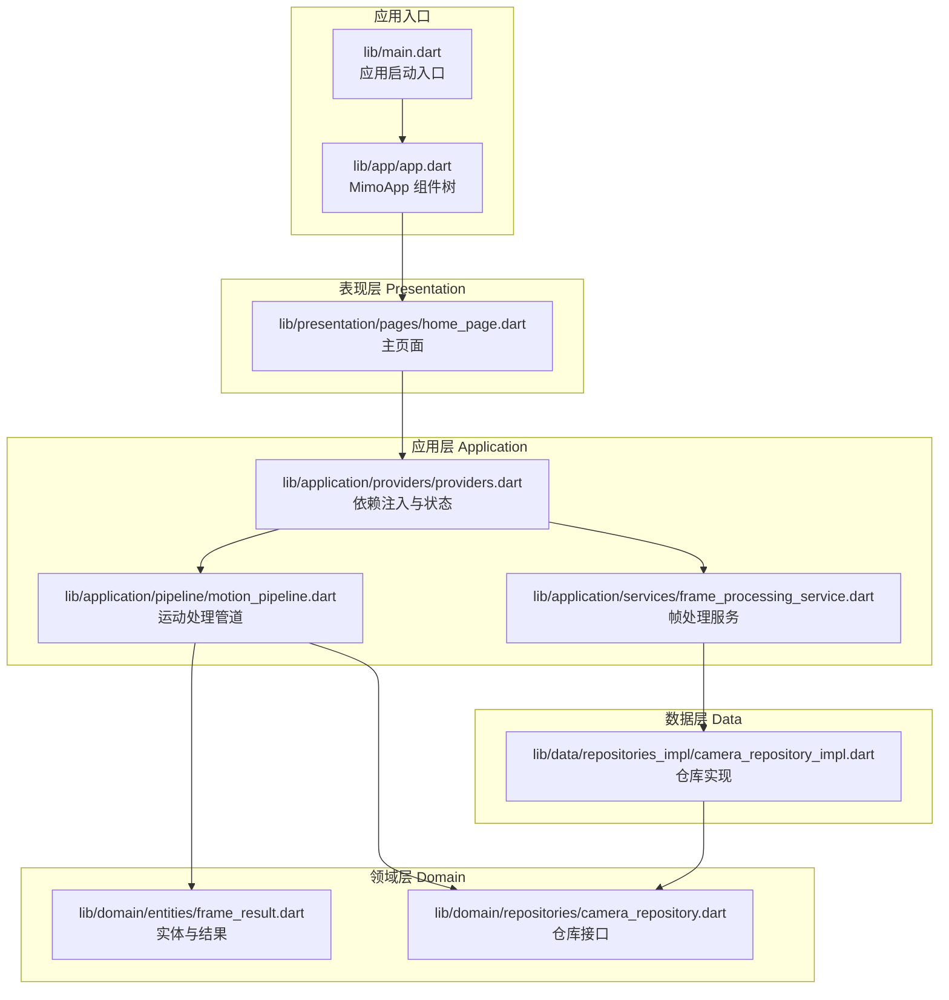
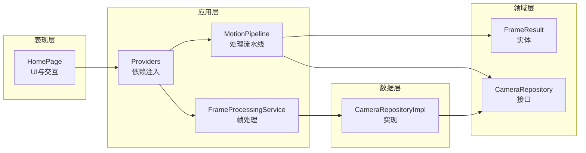
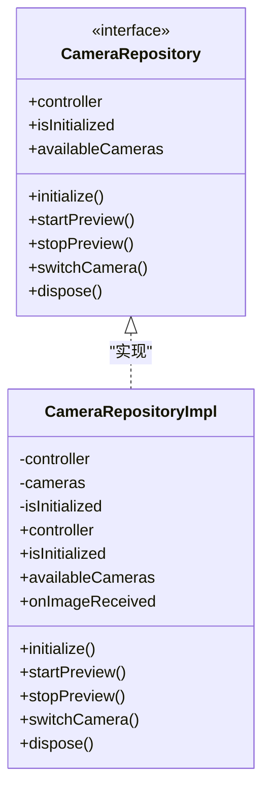
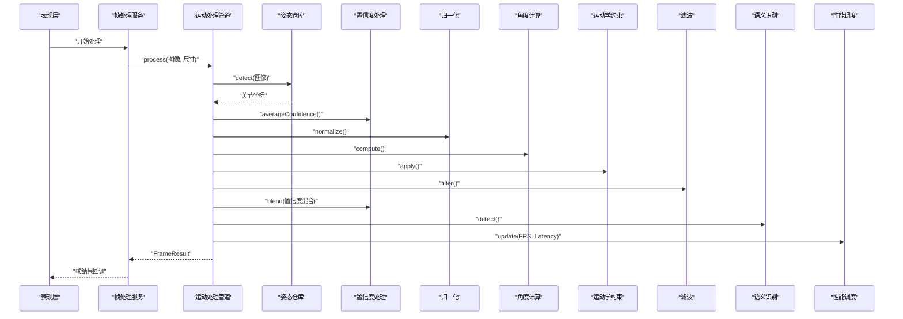
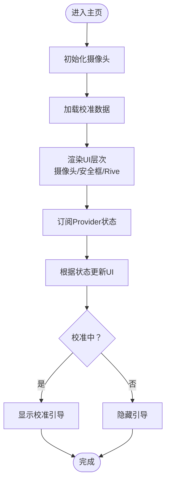
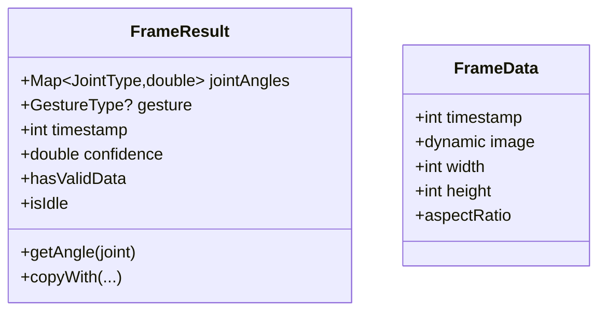
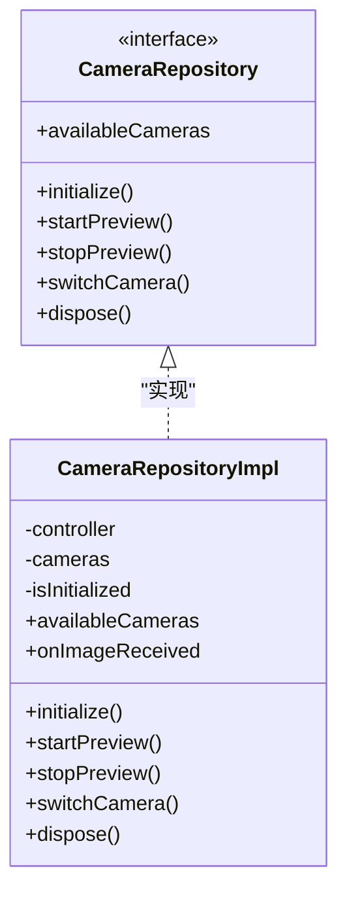
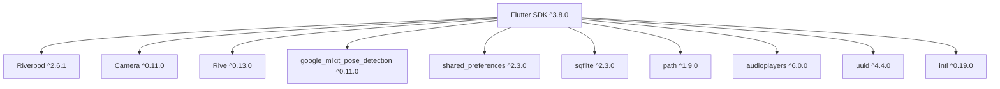

# 架构设计

<cite>
**本文引用的文件**
- [lib/main.dart](file://lib/main.dart)
- [lib/app/app.dart](file://lib/app/app.dart)
- [lib/application/providers/providers.dart](file://lib/application/providers/providers.dart)
- [lib/application/pipeline/motion_pipeline.dart](file://lib/application/pipeline/motion_pipeline.dart)
- [lib/application/services/frame_processing_service.dart](file://lib/application/services/frame_processing_service.dart)
- [lib/domain/entities/frame_result.dart](file://lib/domain/entities/frame_result.dart)
- [lib/domain/repositories/camera_repository.dart](file://lib/domain/repositories/camera_repository.dart)
- [lib/data/repositories_impl/camera_repository_impl.dart](file://lib/data/repositories_impl/camera_repository_impl.dart)
- [lib/presentation/pages/home_page.dart](file://lib/presentation/pages/home_page.dart)
- [pubspec.yaml](file://pubspec.yaml)
</cite>

## 目录
1. [引言](#引言)
2. [项目结构](#项目结构)
3. [核心组件](#核心组件)
4. [架构总览](#架构总览)
5. [详细组件分析](#详细组件分析)
6. [依赖分析](#依赖分析)
7. [性能考虑](#性能考虑)
8. [故障排查指南](#故障排查指南)
9. [结论](#结论)
10. [附录](#附录)

## 引言
本文件为 Mimo 项目的 Clean Architecture 架构设计文档，聚焦于表现层(Presentation)、应用层(Application)、领域层(Domain)与数据层(Data)的职责划分与交互关系；阐述依赖注入与依赖倒置原则的应用；解析“管道模式”在运动处理流水线中的实现；给出系统边界图与组件交互图；并讨论安全性、监控与灾难恢复等横切关注点，以及技术栈、第三方依赖与版本兼容性。

## 项目结构
Mimo 采用按“关注点”分层的目录组织方式：lib 下包含 app、application、domain、data、presentation、core 等模块，分别对应应用入口、应用编排、领域模型与引擎、数据实现与仓库、UI 表现与控件、以及通用配置与工具。

图表来源
- [lib/main.dart:1-123](file://lib/main.dart#L1-L123)
- [lib/app/app.dart:1-27](file://lib/app/app.dart#L1-L27)
- [lib/presentation/pages/home_page.dart:1-214](file://lib/presentation/pages/home_page.dart#L1-L214)
- [lib/application/providers/providers.dart:1-103](file://lib/application/providers/providers.dart#L1-L103)
- [lib/application/pipeline/motion_pipeline.dart:1-141](file://lib/application/pipeline/motion_pipeline.dart#L1-L141)
- [lib/application/services/frame_processing_service.dart:1-254](file://lib/application/services/frame_processing_service.dart#L1-L254)
- [lib/domain/entities/frame_result.dart:1-93](file://lib/domain/entities/frame_result.dart#L1-L93)
- [lib/domain/repositories/camera_repository.dart:1-28](file://lib/domain/repositories/camera_repository.dart#L1-L28)
- [lib/data/repositories_impl/camera_repository_impl.dart:1-102](file://lib/data/repositories_impl/camera_repository_impl.dart#L1-L102)

章节来源
- [lib/main.dart:1-123](file://lib/main.dart#L1-L123)
- [lib/app/app.dart:1-27](file://lib/app/app.dart#L1-L27)
- [pubspec.yaml:1-80](file://pubspec.yaml#L1-L80)

## 核心组件
- 应用入口与组件树
  - 应用通过入口文件启动，顶层组件树由应用入口文件定义，实际应用组件树由应用层组件封装。
- 依赖注入与状态
  - 应用层提供统一的 Provider 注入点，集中声明各仓库、引擎、服务与状态 Provider，体现依赖倒置：上层仅依赖抽象接口，具体实现由 Provider 注入。
- 运动处理管道
  - 管道串联姿态检测、置信度处理、归一化、角度计算、运动学约束、滤波、语义识别与性能统计，形成端到端的处理流水线。
- 帧处理服务
  - 负责连接摄像头与姿态检测，驱动管道执行，并在不同状态（校准、追踪、暂停）下进行差异化处理。
- 领域实体与仓库接口
  - 定义帧结果、手势类型、关节类型等核心实体；定义摄像头仓库接口，隔离外部实现细节。
- 数据层实现
  - 提供摄像头仓库的具体实现，封装底层相机库的初始化、预览、图像流回调等细节。

章节来源
- [lib/app/app.dart:1-27](file://lib/app/app.dart#L1-L27)
- [lib/application/providers/providers.dart:1-103](file://lib/application/providers/providers.dart#L1-L103)
- [lib/application/pipeline/motion_pipeline.dart:1-141](file://lib/application/pipeline/motion_pipeline.dart#L1-L141)
- [lib/application/services/frame_processing_service.dart:1-254](file://lib/application/services/frame_processing_service.dart#L1-L254)
- [lib/domain/entities/frame_result.dart:1-93](file://lib/domain/entities/frame_result.dart#L1-L93)
- [lib/domain/repositories/camera_repository.dart:1-28](file://lib/domain/repositories/camera_repository.dart#L1-L28)
- [lib/data/repositories_impl/camera_repository_impl.dart:1-102](file://lib/data/repositories_impl/camera_repository_impl.dart#L1-L102)

## 架构总览
Clean Architecture 的四层职责与交互如下：
- 表现层(Presentation)
  - 负责 UI 渲染、用户交互与状态展示；通过 Provider 订阅应用层提供的状态与事件。
- 应用层(Application)
  - 负责业务用例编排与流程控制；通过 Provider 注入领域引擎与数据仓库；对外暴露统一的服务接口。
- 领域层(Domain)
  - 定义核心业务实体、接口与规则；不依赖外部实现，确保业务稳定性与可测试性。
- 数据层(Data)
  - 提供领域接口的具体实现；封装外部依赖（如相机、MLKit、数据库等）。

图表来源
- [lib/presentation/pages/home_page.dart:1-214](file://lib/presentation/pages/home_page.dart#L1-L214)
- [lib/application/providers/providers.dart:1-103](file://lib/application/providers/providers.dart#L1-L103)
- [lib/application/pipeline/motion_pipeline.dart:1-141](file://lib/application/pipeline/motion_pipeline.dart#L1-L141)
- [lib/application/services/frame_processing_service.dart:1-254](file://lib/application/services/frame_processing_service.dart#L1-L254)
- [lib/domain/entities/frame_result.dart:1-93](file://lib/domain/entities/frame_result.dart#L1-L93)
- [lib/domain/repositories/camera_repository.dart:1-28](file://lib/domain/repositories/camera_repository.dart#L1-L28)
- [lib/data/repositories_impl/camera_repository_impl.dart:1-102](file://lib/data/repositories_impl/camera_repository_impl.dart#L1-L102)

## 详细组件分析

### 依赖注入与依赖倒置
- 依赖倒置
  - 表现层与应用层仅依赖领域接口（如 CameraRepository），不直接依赖具体实现，从而降低耦合、提升可替换性。
- 依赖注入
  - 应用层通过 Provider 将具体实现注入到上层组件；例如摄像头仓库、姿态仓库、引擎与服务均通过 Provider 统一管理。
- Provider 结构
  - 仓库 Provider、引擎 Provider、服务 Provider、状态 Provider 分层清晰，便于测试与替换。

图表来源
- [lib/domain/repositories/camera_repository.dart:1-28](file://lib/domain/repositories/camera_repository.dart#L1-L28)
- [lib/data/repositories_impl/camera_repository_impl.dart:1-102](file://lib/data/repositories_impl/camera_repository_impl.dart#L1-L102)

章节来源
- [lib/application/providers/providers.dart:1-103](file://lib/application/providers/providers.dart#L1-L103)
- [lib/domain/repositories/camera_repository.dart:1-28](file://lib/domain/repositories/camera_repository.dart#L1-L28)
- [lib/data/repositories_impl/camera_repository_impl.dart:1-102](file://lib/data/repositories_impl/camera_repository_impl.dart#L1-L102)

### 管道模式：运动处理流水线
- 流水线职责
  - 输入：单帧图像与尺寸信息；
  - 处理：姿态检测 → 置信度处理 → 归一化 → 角度计算 → 运动学约束 → 滤波 → 置信度混合 → 语义识别 → 性能统计；
  - 输出：包含关节角度、手势、置信度与时间戳的结果对象。
- 控制流
  - 应用层通过 Provider 注入各引擎与仓库；
  - 管道在 process 中顺序调用各步骤，若中间任一步返回空结果则提前短路；
  - 最终生成帧结果并上报性能指标。

图表来源
- [lib/application/services/frame_processing_service.dart:1-254](file://lib/application/services/frame_processing_service.dart#L1-L254)
- [lib/application/pipeline/motion_pipeline.dart:1-141](file://lib/application/pipeline/motion_pipeline.dart#L1-L141)

章节来源
- [lib/application/pipeline/motion_pipeline.dart:1-141](file://lib/application/pipeline/motion_pipeline.dart#L1-L141)
- [lib/application/services/frame_processing_service.dart:1-254](file://lib/application/services/frame_processing_service.dart#L1-L254)

### 表现层：主页面与状态订阅
- 主页面负责：
  - 初始化摄像头与加载校准数据；
  - 展示摄像头预览、安全框叠加与 Rive 角色层；
  - 顶部状态栏显示 FPS 与设置入口；
  - 校准引导覆盖层根据状态切换显示。
- 状态订阅：
  - 通过 Provider 订阅校准状态、人体度量、是否追踪、当前 FPS 等状态，驱动 UI 更新。

图表来源
- [lib/presentation/pages/home_page.dart:1-214](file://lib/presentation/pages/home_page.dart#L1-L214)

章节来源
- [lib/presentation/pages/home_page.dart:1-214](file://lib/presentation/pages/home_page.dart#L1-L214)

### 领域实体与结果模型
- FrameResult
  - 描述单帧处理后的关节角度、手势、时间戳与置信度；
  - 提供空结果工厂方法、角度查询、有效性判断与复制方法。
- FrameData
  - 描述原始输入帧的元信息（时间戳、图像数据、宽高）与宽高比。

图表来源
- [lib/domain/entities/frame_result.dart:1-93](file://lib/domain/entities/frame_result.dart#L1-L93)

章节来源
- [lib/domain/entities/frame_result.dart:1-93](file://lib/domain/entities/frame_result.dart#L1-L93)

### 数据层：摄像头仓库实现
- 实现细节
  - 初始化摄像头控制器、启动/停止图像流、切换摄像头、释放资源；
  - 对外暴露 onImageReceived 回调，供上层接收图像帧。
- 与接口解耦
  - 通过实现 CameraRepository 接口，向上屏蔽底层相机库的复杂性。

图表来源
- [lib/domain/repositories/camera_repository.dart:1-28](file://lib/domain/repositories/camera_repository.dart#L1-L28)
- [lib/data/repositories_impl/camera_repository_impl.dart:1-102](file://lib/data/repositories_impl/camera_repository_impl.dart#L1-L102)

章节来源
- [lib/data/repositories_impl/camera_repository_impl.dart:1-102](file://lib/data/repositories_impl/camera_repository_impl.dart#L1-L102)

## 依赖分析
- 技术栈与版本
  - Flutter SDK: ^3.8.0
  - 状态管理: flutter_riverpod ^2.6.1
  - 摄像头: camera ^0.11.0
  - Rive 动画: rive ^0.13.0
  - 姿态识别: google_mlkit_pose_detection ^0.11.0
  - 本地存储: shared_preferences ^2.3.0, sqflite ^2.3.0, path ^1.9.0
  - 音效播放: audioplayers ^6.0.0
  - 工具类: uuid ^4.4.0, intl ^0.19.0
- 依赖方向
  - 表现层依赖应用层 Provider；
  - 应用层依赖领域接口与 Provider；
  - 数据层实现领域接口；
  - 第三方库作为外部依赖被数据层封装。

图表来源
- [pubspec.yaml:1-80](file://pubspec.yaml#L1-L80)

章节来源
- [pubspec.yaml:1-80](file://pubspec.yaml#L1-L80)

## 性能考虑
- 端到端延迟与 FPS
  - 管道内部记录处理耗时并更新 FPS 与延迟指标，表现层订阅并展示当前 FPS。
- 处理链路优化
  - 在姿态检测为空时提前返回空结果，避免后续无意义计算；
  - 角度计算为空时短路，减少无效处理；
  - 使用置信度混合策略平衡跟踪与 idle 角度，提升鲁棒性。
- 资源管理
  - 帧处理服务在停止与释放时正确关闭摄像头与取消订阅，防止资源泄漏。

章节来源
- [lib/application/pipeline/motion_pipeline.dart:1-141](file://lib/application/pipeline/motion_pipeline.dart#L1-L141)
- [lib/application/services/frame_processing_service.dart:1-254](file://lib/application/services/frame_processing_service.dart#L1-L254)

## 故障排查指南
- 摄像头初始化失败
  - 现象：无法启动摄像头或预览；
  - 排查：确认可用摄像头列表非空；检查权限与设备支持；查看初始化异常日志。
- 姿态检测为空
  - 现象：连续空结果导致 UI 无响应；
  - 排查：检查摄像头对焦、光照与遮挡；验证图像格式与尺寸；确认姿态检测引擎可用。
- 校准失败
  - 现象：校准状态停留在等待或进行中；
  - 排查：确保用户完成 T-Pose 保持；检查校准引擎输出与人体度量保存逻辑。
- 性能异常
  - 现象：FPS 波动大或持续偏低；
  - 排查：检查滤波与语义识别耗时；评估设备性能与分辨率设置；观察是否存在频繁重算。

章节来源
- [lib/application/services/frame_processing_service.dart:1-254](file://lib/application/services/frame_processing_service.dart#L1-L254)
- [lib/data/repositories_impl/camera_repository_impl.dart:1-102](file://lib/data/repositories_impl/camera_repository_impl.dart#L1-L102)

## 结论
Mimo 采用 Clean Architecture 分层与 Riverpod 依赖注入，实现了表现层、应用层、领域层与数据层的清晰分离。管道模式将复杂的运动处理流程拆分为可维护的步骤，结合依赖倒置与 Provider 注入，提升了系统的可扩展性与可测试性。通过状态订阅与性能指标上报，系统具备良好的可观测性与用户体验反馈。

## 附录
- 系统边界
  - 内部：应用层、领域层、数据层；
  - 外部：Flutter 框架、第三方库（相机、MLKit、Rive、音频等）。
- 横切关注点
  - 安全性：权限申请与隐私保护（需在平台配置与运行时策略中补充）；
  - 监控：FPS 与延迟指标采集与 UI 展示；
  - 灾难恢复：资源释放与错误回退路径（已在服务释放与空结果短路中体现）。