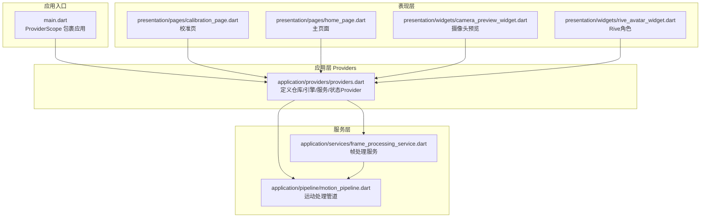
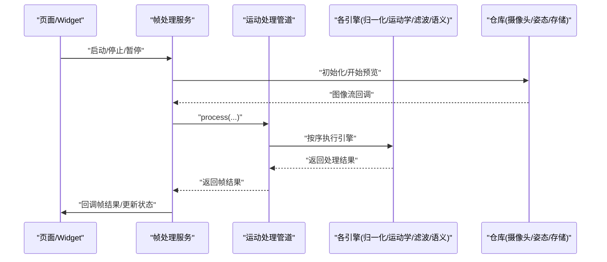
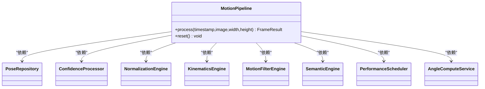
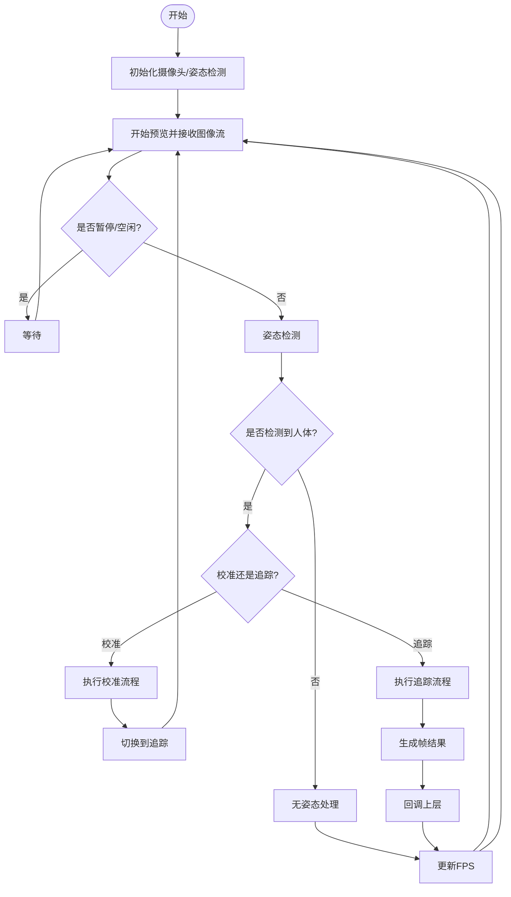
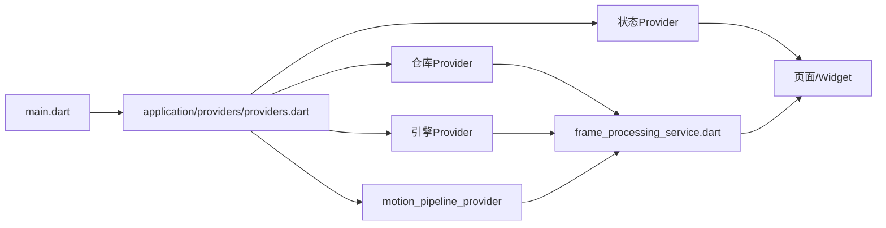

# 状态管理系统

<cite>
**本文引用的文件**
- [pubspec.yaml](file://pubspec.yaml)
- [main.dart](file://main.dart)
- [lib/application/providers/providers.dart](file://lib/application/providers/providers.dart)
- [lib/application/services/frame_processing_service.dart](file://lib/application/services/frame_processing_service.dart)
- [lib/application/pipeline/motion_pipeline.dart](file://lib/application/pipeline/motion_pipeline.dart)
- [lib/presentation/pages/calibration_page.dart](file://lib/presentation/pages/calibration_page.dart)
- [lib/presentation/pages/home_page.dart](file://lib/presentation/pages/home_page.dart)
- [lib/presentation/widgets/camera_preview_widget.dart](file://lib/presentation/widgets/camera_preview_widget.dart)
- [lib/presentation/widgets/rive_avatar_widget.dart](file://lib/presentation/widgets/rive_avatar_widget.dart)
- [lib/data/repositories_impl/camera_repository_impl.dart](file://lib/data/repositories_impl/camera_repository_impl.dart)
</cite>

## 目录
1. [简介](#简介)
2. [项目结构](#项目结构)
3. [核心组件](#核心组件)
4. [架构总览](#架构总览)
5. [详细组件分析](#详细组件分析)
6. [依赖分析](#依赖分析)
7. [性能考量](#性能考量)
8. [故障排查指南](#故障排查指南)
9. [结论](#结论)
10. [附录：常见使用模式与最佳实践](#附录常见使用模式与最佳实践)

## 简介
本文件系统性梳理Mimo项目中的Riverpod状态管理方案，围绕以下目标展开：
- 深入解释Riverpod的设计理念与与传统Provider的区别
- 详述Provider的定义、使用与生命周期管理
- 阐述StateProvider、AsyncNotifier、FutureProvider等类型的应用场景
- 解释状态订阅机制与响应式更新原理
- 描述Provider之间的依赖关系与依赖注入实现
- 给出状态管理的最佳实践与性能优化建议
- 覆盖异步状态处理与错误状态管理
- 提供实际代码示例与常见使用模式

## 项目结构
Mimo采用分层架构组织状态管理相关代码：
- 入口与作用域：在应用入口通过ProviderScope包裹根组件，统一提供Provider作用域
- 应用层Providers：集中定义业务域的Provider，包含仓库、引擎、服务与状态
- 服务层：封装帧处理、性能统计、校准流程等复杂逻辑
- 表现层：页面与Widget通过Consumer/ConsumerStatefulWidget订阅状态并驱动UI

**图表来源**
- [main.dart:7-9](file://main.dart#L7-L9)
- [lib/application/providers/providers.dart:16-83](file://lib/application/providers/providers.dart#L16-L83)
- [lib/application/services/frame_processing_service.dart:252-254](file://lib/application/services/frame_processing_service.dart#L252-L254)
- [lib/application/pipeline/motion_pipeline.dart:17-51](file://lib/application/pipeline/motion_pipeline.dart#L17-L51)
- [lib/presentation/pages/calibration_page.dart:54-112](file://lib/presentation/pages/calibration_page.dart#L54-L112)
- [lib/presentation/pages/home_page.dart:38-88](file://lib/presentation/pages/home_page.dart#L38-L88)
- [lib/presentation/widgets/camera_preview_widget.dart:7-49](file://lib/presentation/widgets/camera_preview_widget.dart#L7-L49)
- [lib/presentation/widgets/rive_avatar_widget.dart:74-118](file://lib/presentation/widgets/rive_avatar_widget.dart#L74-L118)

**章节来源**
- [main.dart:7-9](file://main.dart#L7-L9)
- [lib/application/providers/providers.dart:16-83](file://lib/application/providers/providers.dart#L16-L83)

## 核心组件
本项目的核心状态组件由以下Provider构成：
- 仓库Provider：摄像头、姿态检测、存储
- 引擎Provider：置信度处理、归一化、运动学、滤波、语义、性能调度、角度计算、校准
- 管道Provider：MotionPipeline，串联各引擎
- 状态Provider：校准状态、人体度量、是否追踪、当前FPS

这些Provider在应用启动时被统一注册，并通过Ref在服务与页面中读取或写入。

**章节来源**
- [lib/application/providers/providers.dart:16-103](file://lib/application/providers/providers.dart#L16-L103)

## 架构总览
下图展示从UI到引擎的完整调用链路，以及状态在各层间的传递与更新。

**图表来源**
- [lib/application/services/frame_processing_service.dart:70-148](file://lib/application/services/frame_processing_service.dart#L70-L148)
- [lib/application/pipeline/motion_pipeline.dart:61-130](file://lib/application/pipeline/motion_pipeline.dart#L61-L130)
- [lib/application/providers/providers.dart:71-83](file://lib/application/providers/providers.dart#L71-L83)

## 详细组件分析

### Provider定义与依赖注入
- 仓库Provider：负责实例化具体仓库实现，如摄像头、姿态检测、存储
- 引擎Provider：负责实例化各领域引擎，如归一化、运动学、滤波、语义、性能调度、角度计算、校准
- 管道Provider：将多个引擎组合为MotionPipeline，通过ref.watch注入依赖
- 状态Provider：使用StateProvider维护简单可变状态，如校准状态、人体度量、追踪标志、FPS

依赖注入通过Provider构造函数中的Ref完成，Ref.read用于读取其他Provider；Provider之间通过watch建立响应式依赖。

**章节来源**
- [lib/application/providers/providers.dart:16-83](file://lib/application/providers/providers.dart#L16-L83)

### 状态订阅机制与响应式更新
- 页面与Widget通过Consumer/ConsumerStatefulWidget订阅Provider
- 使用ref.watch监听状态变化，自动重建UI
- 使用ref.read读取Provider实例或写入状态（notifier.state）
- 使用ref.listen监听状态变化并执行副作用（如日志、导航）

示例路径：
- 页面监听校准状态与FPS：[lib/presentation/pages/calibration_page.dart:55-56](file://lib/presentation/pages/calibration_page.dart#L55-L56)
- 页面监听FPS并显示：[lib/presentation/pages/home_page.dart:121-137](file://lib/presentation/pages/home_page.dart#L121-L137)
- 监听BodyMetrics并做副作用：[lib/presentation/widgets/rive_avatar_widget.dart:99-101](file://lib/presentation/widgets/rive_avatar_widget.dart#L99-L101)

**章节来源**
- [lib/presentation/pages/calibration_page.dart:54-112](file://lib/presentation/pages/calibration_page.dart#L54-L112)
- [lib/presentation/pages/home_page.dart:38-88](file://lib/presentation/pages/home_page.dart#L38-L88)
- [lib/presentation/widgets/rive_avatar_widget.dart:99-101](file://lib/presentation/widgets/rive_avatar_widget.dart#L99-L101)

### 状态Provider与状态更新
- StateProvider用于维护简单可变状态，如布尔、枚举、数值、对象
- 写入方式：ref.read(provider.notifier).state = 新值
- 读取方式：ref.watch(provider)

示例路径：
- 校准状态：[lib/application/providers/providers.dart:85-88](file://lib/application/providers/providers.dart#L85-L88)
- 人体度量：[lib/application/providers/providers.dart:90-93](file://lib/application/providers/providers.dart#L90-L93)
- 是否追踪：[lib/application/providers/providers.dart:95-98](file://lib/application/providers/providers.dart#L95-L98)
- 当前FPS：[lib/application/providers/providers.dart:100-103](file://lib/application/providers/providers.dart#L100-L103)
- 页面写入校准状态：[lib/presentation/pages/calibration_page.dart:282-284](file://lib/presentation/pages/calibration_page.dart#L282-L284)
- 服务写入FPS：[lib/application/services/frame_processing_service.dart:239-240](file://lib/application/services/frame_processing_service.dart#L239-L240)

**章节来源**
- [lib/application/providers/providers.dart:85-103](file://lib/application/providers/providers.dart#L85-L103)
- [lib/application/services/frame_processing_service.dart:230-241](file://lib/application/services/frame_processing_service.dart#L230-L241)
- [lib/presentation/pages/calibration_page.dart:282-284](file://lib/presentation/pages/calibration_page.dart#L282-L284)

### AsyncNotifier/FutureProvider的适用场景
- 本项目未直接使用AsyncNotifier/FutureProvider
- 建议在需要发起一次性异步任务且仅需最终结果时使用FutureProvider
- 在需要分阶段更新异步状态（Loading/Success/Error）时使用AsyncNotifier
- 对于持续流数据，推荐使用StreamProvider或自定义Provider

本节为概念性说明，不直接对应具体源码文件

### 管道与引擎的编排
MotionPipeline作为核心编排层，串联姿态检测、置信度计算、归一化、角度计算、运动学约束、滤波、置信度混合、语义识别与性能统计。其构造函数通过ref.watch注入各依赖，形成强内聚、低耦合的状态流转。

**图表来源**
- [lib/application/pipeline/motion_pipeline.dart:17-51](file://lib/application/pipeline/motion_pipeline.dart#L17-L51)

**章节来源**
- [lib/application/pipeline/motion_pipeline.dart:17-141](file://lib/application/pipeline/motion_pipeline.dart#L17-L141)

### 帧处理服务与状态流转
FrameProcessingService连接摄像头、姿态检测与运动处理管道，负责：
- 初始化与启动摄像头预览
- 接收图像流并异步处理
- 根据状态（校准/追踪/暂停/idle）执行不同分支
- 更新FPS与校准状态
- 回调帧结果给上层UI

**图表来源**
- [lib/application/services/frame_processing_service.dart:70-148](file://lib/application/services/frame_processing_service.dart#L70-L148)

**章节来源**
- [lib/application/services/frame_processing_service.dart:32-249](file://lib/application/services/frame_processing_service.dart#L32-L249)

### 页面与Widget中的状态使用
- 校准页：订阅校准状态与FPS，根据状态显示UI与引导文案
- 主页：显示FPS、条件性显示校准覆盖层、加载校准数据并初始化归一化
- 摄像头预览Widget：初始化摄像头控制器并在不可用时显示加载指示
- Rive角色Widget：监听BodyMetrics变化并驱动角色骨骼

示例路径：
- 订阅与显示FPS：[lib/presentation/pages/calibration_page.dart:55-56](file://lib/presentation/pages/calibration_page.dart#L55-L56), [lib/presentation/pages/home_page.dart:121-137](file://lib/presentation/pages/home_page.dart#L121-L137)
- 监听BodyMetrics：[lib/presentation/widgets/rive_avatar_widget.dart:99-101](file://lib/presentation/widgets/rive_avatar_widget.dart#L99-L101)
- 初始化摄像头：[lib/presentation/widgets/camera_preview_widget.dart:25-35](file://lib/presentation/widgets/camera_preview_widget.dart#L25-L35)

**章节来源**
- [lib/presentation/pages/calibration_page.dart:54-112](file://lib/presentation/pages/calibration_page.dart#L54-L112)
- [lib/presentation/pages/home_page.dart:38-88](file://lib/presentation/pages/home_page.dart#L38-L88)
- [lib/presentation/widgets/camera_preview_widget.dart:7-49](file://lib/presentation/widgets/camera_preview_widget.dart#L7-L49)
- [lib/presentation/widgets/rive_avatar_widget.dart:74-118](file://lib/presentation/widgets/rive_avatar_widget.dart#L74-L118)

## 依赖分析
- 应用入口通过ProviderScope提供全局Provider作用域
- 应用层Providers集中定义并注入依赖
- 服务层通过Ref读取Provider，实现解耦
- 表现层通过Consumer订阅状态，实现响应式UI

**图表来源**
- [main.dart:7-9](file://main.dart#L7-L9)
- [lib/application/providers/providers.dart:16-103](file://lib/application/providers/providers.dart#L16-L103)
- [lib/application/services/frame_processing_service.dart:52-62](file://lib/application/services/frame_processing_service.dart#L52-L62)

**章节来源**
- [main.dart:7-9](file://main.dart#L7-L9)
- [lib/application/providers/providers.dart:16-103](file://lib/application/providers/providers.dart#L16-L103)
- [lib/application/services/frame_processing_service.dart:52-62](file://lib/application/services/frame_processing_service.dart#L52-L62)

## 性能考量
- 使用StateProvider维护轻量状态，避免频繁重建
- 将耗时操作放入服务层，通过异步处理与回调减少UI阻塞
- 合理使用ref.watch，避免在build中进行昂贵计算
- 使用PerformanceScheduler更新FPS，便于监控与调试
- 在页面中对不必要的子树进行局部刷新，减少重建范围

本节为通用指导，不直接对应具体源码文件

## 故障排查指南
- 摄像头初始化失败：检查相机权限与设备可用性，参考初始化逻辑
  - 示例路径：[lib/data/repositories_impl/camera_repository_impl.dart:20-47](file://lib/data/repositories_impl/camera_repository_impl.dart#L20-L47)
- 姿态检测为空：在处理流程中判断空结果并跳过后续步骤
  - 示例路径：[lib/application/services/frame_processing_service.dart:134-137](file://lib/application/services/frame_processing_service.dart#L134-L137)
- 校准状态异常：通过ref.read(provider.notifier).state手动重置
  - 示例路径：[lib/presentation/pages/calibration_page.dart:282-284](file://lib/presentation/pages/calibration_page.dart#L282-L284)
- FPS异常：检查帧计数与时间戳更新逻辑
  - 示例路径：[lib/application/services/frame_processing_service.dart:230-241](file://lib/application/services/frame_processing_service.dart#L230-L241)

**章节来源**
- [lib/data/repositories_impl/camera_repository_impl.dart:20-47](file://lib/data/repositories_impl/camera_repository_impl.dart#L20-L47)
- [lib/application/services/frame_processing_service.dart:134-137](file://lib/application/services/frame_processing_service.dart#L134-L137)
- [lib/presentation/pages/calibration_page.dart:282-284](file://lib/presentation/pages/calibration_page.dart#L282-L284)
- [lib/application/services/frame_processing_service.dart:230-241](file://lib/application/services/frame_processing_service.dart#L230-L241)

## 结论
Mimo项目通过Riverpod实现了清晰的分层状态管理：应用层集中定义Provider，服务层编排引擎与异步流程，表现层通过订阅实现响应式更新。该方案具备良好的可扩展性与可测试性，适合复杂的实时交互场景。

## 附录：常见使用模式与最佳实践
- 使用ProviderScope包裹应用根组件，确保Provider作用域一致
- 将“只读”依赖通过Provider构造函数注入，将“可变”状态通过StateProvider管理
- 在服务层使用Ref.read读取Provider，避免在UI中直接访问底层实现
- 使用ref.watch监听状态，ref.listen监听副作用
- 对于一次性异步任务使用FutureProvider，对于流数据使用StreamProvider
- 将耗时计算放入后台线程或服务层，避免阻塞UI线程

本节为通用指导，不直接对应具体源码文件