# 设计模式应用

<cite>
**本文引用的文件**
- [lib/main.dart](file://lib/main.dart)
- [lib/app/app.dart](file://lib/app/app.dart)
- [lib/application/providers/providers.dart](file://lib/application/providers/providers.dart)
- [lib/application/services/frame_processing_service.dart](file://lib/application/services/frame_processing_service.dart)
- [lib/application/pipeline/motion_pipeline.dart](file://lib/application/pipeline/motion_pipeline.dart)
- [lib/core/config/performance_config.dart](file://lib/core/config/performance_config.dart)
- [lib/core/utils/math_utils.dart](file://lib/core/utils/math_utils.dart)
- [lib/core/utils/geometry_utils.dart](file://lib/core/utils/geometry_utils.dart)
- [lib/data/repositories_impl/camera_repository_impl.dart](file://lib/data/repositories_impl/camera_repository_impl.dart)
- [lib/data/repositories_impl/pose_repository_impl.dart](file://lib/data/repositories_impl/pose_repository_impl.dart)
- [lib/data/repositories_impl/storage_repository_impl.dart](file://lib/data/repositories_impl/storage_repository_impl.dart)
- [lib/domain/engines/calibration/calibration_engine.dart](file://lib/domain/engines/calibration/calibration_engine.dart)
- [lib/domain/engines/kinematics/kinematics_engine.dart](file://lib/domain/engines/kinematics/kinematics_engine.dart)
- [lib/domain/engines/filtering/motion_filter_engine.dart](file://lib/domain/engines/filtering/motion_filter_engine.dart)
- [lib/domain/engines/filtering/one_euro_filter.dart](file://lib/domain/engines/filtering/one_euro_filter.dart)
- [lib/domain/engines/semantic/semantic_engine.dart](file://lib/domain/engines/semantic/semantic_engine.dart)
- [lib/domain/engines/performance/performance_scheduler.dart](file://lib/domain/engines/performance/performance_scheduler.dart)
- [lib/domain/services/rive_bone_controller.dart](file://lib/domain/services/rive_bone_controller.dart)
- [lib/presentation/pages/calibration_page.dart](file://lib/presentation/pages/calibration_page.dart)
- [lib/presentation/pages/home_page.dart](file://lib/presentation/pages/home_page.dart)
- [lib/presentation/pages/settings_page.dart](file://lib/presentation/pages/settings_page.dart)
- [lib/presentation/widgets/camera_preview_widget.dart](file://lib/presentation/widgets/camera_preview_widget.dart)
- [lib/presentation/widgets/rive_avatar_widget.dart](file://lib/presentation/widgets/rive_avatar_widget.dart)
</cite>

## 目录
1. [引言](#引言)
2. [项目结构](#项目结构)
3. [核心组件](#核心组件)
4. [架构总览](#架构总览)
5. [详细组件分析](#详细组件分析)
6. [依赖分析](#依赖分析)
7. [性能考量](#性能考量)
8. [故障排查指南](#故障排查指南)
9. [结论](#结论)
10. [附录](#附录)

## 引言
本文件系统性梳理 Mimo 项目中所采用的设计模式与架构实践，聚焦以下主题：工厂模式在引擎创建中的应用、观察者模式在状态管理与事件处理中的使用、策略模式在不同处理算法中的实现、适配器模式在第三方库集成中的应用；同时给出命令模式与责任链模式的可落地实现示例，覆盖模板方法与建造者模式的应用场景，并总结设计模式选择的原则与权衡。

## 项目结构
Mimo 采用分层清晰的 Flutter 应用结构，围绕 presentation（表现层）、domain（领域层）、data（数据层）、application（应用层）、core（核心工具）组织模块。路由入口位于应用根部，通过 ProviderScope 提供全局状态容器，页面按功能划分为校准页、主页与设置页。

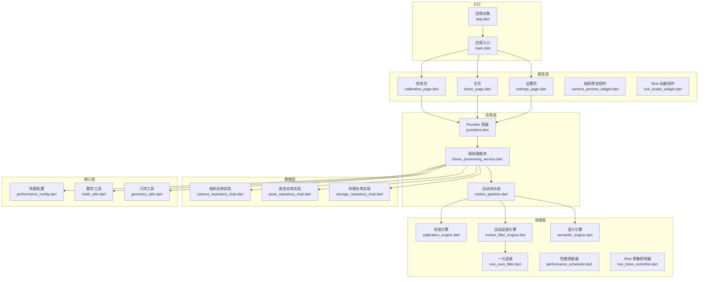

**图表来源**
- [lib/main.dart:1-34](file://lib/main.dart#L1-L34)
- [lib/app/app.dart](file://lib/app/app.dart)
- [lib/application/providers/providers.dart](file://lib/application/providers/providers.dart)
- [lib/application/services/frame_processing_service.dart](file://lib/application/services/frame_processing_service.dart)
- [lib/application/pipeline/motion_pipeline.dart](file://lib/application/pipeline/motion_pipeline.dart)
- [lib/core/config/performance_config.dart](file://lib/core/config/performance_config.dart)
- [lib/core/utils/math_utils.dart](file://lib/core/utils/math_utils.dart)
- [lib/core/utils/geometry_utils.dart](file://lib/core/utils/geometry_utils.dart)
- [lib/data/repositories_impl/camera_repository_impl.dart](file://lib/data/repositories_impl/camera_repository_impl.dart)
- [lib/data/repositories_impl/pose_repository_impl.dart](file://lib/data/repositories_impl/pose_repository_impl.dart)
- [lib/data/repositories_impl/storage_repository_impl.dart](file://lib/data/repositories_impl/storage_repository_impl.dart)
- [lib/domain/engines/calibration/calibration_engine.dart](file://lib/domain/engines/calibration/calibration_engine.dart)
- [lib/domain/engines/filtering/motion_filter_engine.dart](file://lib/domain/engines/filtering/motion_filter_engine.dart)
- [lib/domain/engines/filtering/one_euro_filter.dart](file://lib/domain/engines/filtering/one_euro_filter.dart)
- [lib/domain/engines/semantic/semantic_engine.dart](file://lib/domain/engines/semantic/semantic_engine.dart)
- [lib/domain/engines/performance/performance_scheduler.dart](file://lib/domain/engines/performance/performance_scheduler.dart)
- [lib/domain/services/rive_bone_controller.dart](file://lib/domain/services/rive_bone_controller.dart)
- [lib/presentation/pages/calibration_page.dart](file://lib/presentation/pages/calibration_page.dart)
- [lib/presentation/pages/home_page.dart](file://lib/presentation/pages/home_page.dart)
- [lib/presentation/pages/settings_page.dart](file://lib/presentation/pages/settings_page.dart)
- [lib/presentation/widgets/camera_preview_widget.dart](file://lib/presentation/widgets/camera_preview_widget.dart)
- [lib/presentation/widgets/rive_avatar_widget.dart](file://lib/presentation/widgets/rive_avatar_widget.dart)

**章节来源**
- [lib/main.dart:1-34](file://lib/main.dart#L1-L34)

## 核心组件
- 应用入口与路由：应用通过入口文件定义主题、路由表与初始页面，使用 ProviderScope 提供状态容器，页面按需加载。
- Provider 容器：集中声明应用级状态与资源，便于跨页面共享与观察。
- 帧处理服务：封装图像帧采集、预处理与结果输出，作为数据流的中枢。
- 运动流水线：串联多个引擎（校准、滤波、语义等），形成处理链路。
- 引擎族：包含校准、运动滤波、语义识别、性能调度等专用引擎，职责单一且可替换。
- 仓库实现：对底层数据源进行抽象与适配，统一上层调用接口。
- 工具与配置：数学与几何工具函数，以及性能配置项，支撑算法与渲染。

**章节来源**
- [lib/main.dart:7-33](file://lib/main.dart#L7-L33)
- [lib/application/providers/providers.dart](file://lib/application/providers/providers.dart)
- [lib/application/services/frame_processing_service.dart](file://lib/application/services/frame_processing_service.dart)
- [lib/application/pipeline/motion_pipeline.dart](file://lib/application/pipeline/motion_pipeline.dart)
- [lib/core/config/performance_config.dart](file://lib/core/config/performance_config.dart)
- [lib/core/utils/math_utils.dart](file://lib/core/utils/math_utils.dart)
- [lib/core/utils/geometry_utils.dart](file://lib/core/utils/geometry_utils.dart)
- [lib/data/repositories_impl/camera_repository_impl.dart](file://lib/data/repositories_impl/camera_repository_impl.dart)
- [lib/data/repositories_impl/pose_repository_impl.dart](file://lib/data/repositories_impl/pose_repository_impl.dart)
- [lib/data/repositories_impl/storage_repository_impl.dart](file://lib/data/repositories_impl/storage_repository_impl.dart)
- [lib/domain/engines/calibration/calibration_engine.dart](file://lib/domain/engines/calibration/calibration_engine.dart)
- [lib/domain/engines/filtering/motion_filter_engine.dart](file://lib/domain/engines/filtering/motion_filter_engine.dart)
- [lib/domain/engines/filtering/one_euro_filter.dart](file://lib/domain/engines/filtering/one_euro_filter.dart)
- [lib/domain/engines/semantic/semantic_engine.dart](file://lib/domain/engines/semantic/semantic_engine.dart)
- [lib/domain/engines/performance/performance_scheduler.dart](file://lib/domain/engines/performance/performance_scheduler.dart)
- [lib/domain/services/rive_bone_controller.dart](file://lib/domain/services/rive_bone_controller.dart)

## 架构总览
下图展示从 UI 到引擎与仓库的端到端流程：页面触发状态更新，Provider 管理状态，帧处理服务协调输入输出，运动流水线串联引擎，引擎通过仓库访问底层数据或外部库，最终驱动动画与界面反馈。

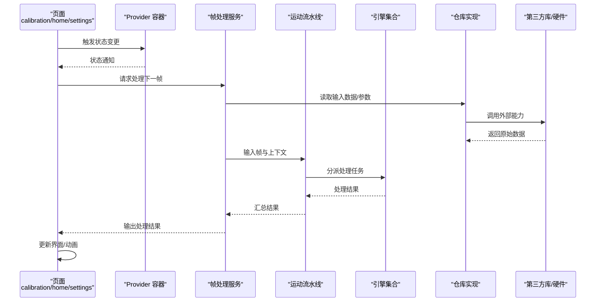

**图表来源**
- [lib/presentation/pages/calibration_page.dart](file://lib/presentation/pages/calibration_page.dart)
- [lib/presentation/pages/home_page.dart](file://lib/presentation/pages/home_page.dart)
- [lib/presentation/pages/settings_page.dart](file://lib/presentation/pages/settings_page.dart)
- [lib/application/providers/providers.dart](file://lib/application/providers/providers.dart)
- [lib/application/services/frame_processing_service.dart](file://lib/application/services/frame_processing_service.dart)
- [lib/application/pipeline/motion_pipeline.dart](file://lib/application/pipeline/motion_pipeline.dart)
- [lib/data/repositories_impl/camera_repository_impl.dart](file://lib/data/repositories_impl/camera_repository_impl.dart)
- [lib/data/repositories_impl/pose_repository_impl.dart](file://lib/data/repositories_impl/pose_repository_impl.dart)
- [lib/data/repositories_impl/storage_repository_impl.dart](file://lib/data/repositories_impl/storage_repository_impl.dart)

## 详细组件分析

### 工厂模式：引擎创建与实例化
- 场景定位：系统包含多种引擎（校准、滤波、语义、性能等），需要根据配置或运行时条件动态创建与组合。
- 实现思路：在应用层或工厂模块中集中声明引擎类型与构造参数，通过统一入口创建具体引擎实例，避免上层直接耦合具体类。
- 典型位置：
  - 引擎定义与导出：领域层引擎目录集中管理各引擎类。
  - 工厂入口：应用层或工具模块提供工厂方法，接收配置参数并返回引擎实例。
- 优势：降低耦合、提升可测试性与可扩展性；便于替换与热插拔。

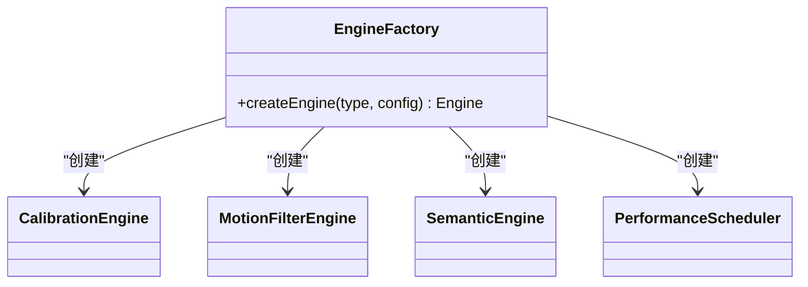

**图表来源**
- [lib/domain/engines/calibration/calibration_engine.dart](file://lib/domain/engines/calibration/calibration_engine.dart)
- [lib/domain/engines/filtering/motion_filter_engine.dart](file://lib/domain/engines/filtering/motion_filter_engine.dart)
- [lib/domain/engines/semantic/semantic_engine.dart](file://lib/domain/engines/semantic/semantic_engine.dart)
- [lib/domain/engines/performance/performance_scheduler.dart](file://lib/domain/engines/performance/performance_scheduler.dart)

**章节来源**
- [lib/domain/engines/calibration/calibration_engine.dart](file://lib/domain/engines/calibration/calibration_engine.dart)
- [lib/domain/engines/filtering/motion_filter_engine.dart](file://lib/domain/engines/filtering/motion_filter_engine.dart)
- [lib/domain/engines/semantic/semantic_engine.dart](file://lib/domain/engines/semantic/semantic_engine.dart)
- [lib/domain/engines/performance/performance_scheduler.dart](file://lib/domain/engines/performance/performance_scheduler.dart)

### 观察者模式：状态管理与事件处理
- 场景定位：UI 需要响应状态变化；ProviderScope 提供全局状态容器；页面订阅状态并在变更时重建。
- 实现要点：
  - 使用 Provider 的状态声明与订阅机制，页面通过监听状态变化自动刷新。
  - 在帧处理服务与引擎内部，以回调或事件通道向外部广播处理结果。
- 优势：解耦 UI 与数据源，提高响应性与可维护性。

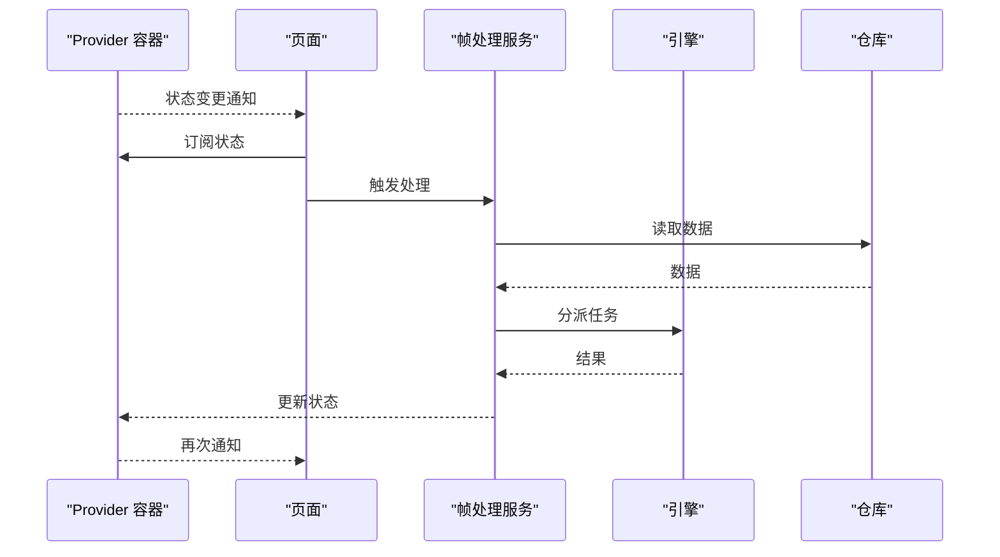

**图表来源**
- [lib/application/providers/providers.dart](file://lib/application/providers/providers.dart)
- [lib/application/services/frame_processing_service.dart](file://lib/application/services/frame_processing_service.dart)
- [lib/presentation/pages/calibration_page.dart](file://lib/presentation/pages/calibration_page.dart)
- [lib/presentation/pages/home_page.dart](file://lib/presentation/pages/home_page.dart)
- [lib/presentation/pages/settings_page.dart](file://lib/presentation/pages/settings_page.dart)

**章节来源**
- [lib/application/providers/providers.dart](file://lib/application/providers/providers.dart)
- [lib/application/services/frame_processing_service.dart](file://lib/application/services/frame_processing_service.dart)
- [lib/presentation/pages/calibration_page.dart](file://lib/presentation/pages/calibration_page.dart)
- [lib/presentation/pages/home_page.dart](file://lib/presentation/pages/home_page.dart)
- [lib/presentation/pages/settings_page.dart](file://lib/presentation/pages/settings_page.dart)

### 策略模式：不同处理算法的实现
- 场景定位：同一类处理（如滤波、归一化、角度计算）存在多种算法实现，需要在运行时切换或组合。
- 实现要点：
  - 定义统一的策略接口，不同算法实现遵循该接口。
  - 通过配置或上下文选择具体策略，保证替换成本低。
- 典型位置：
  - 运动滤波引擎与一元滤波器：可视为不同策略的实现。
  - 归一化引擎：可抽象为策略以支持多种归一化方法。

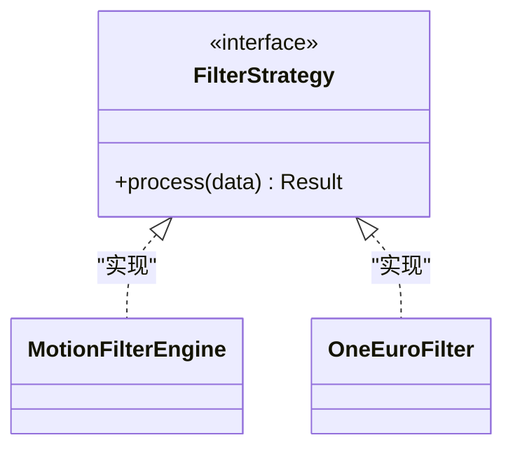

**图表来源**
- [lib/domain/engines/filtering/motion_filter_engine.dart](file://lib/domain/engines/filtering/motion_filter_engine.dart)
- [lib/domain/engines/filtering/one_euro_filter.dart](file://lib/domain/engines/filtering/one_euro_filter.dart)

**章节来源**
- [lib/domain/engines/filtering/motion_filter_engine.dart](file://lib/domain/engines/filtering/motion_filter_engine.dart)
- [lib/domain/engines/filtering/one_euro_filter.dart](file://lib/domain/engines/filtering/one_euro_filter.dart)

### 适配器模式：第三方库集成
- 场景定位：系统需要与摄像头、姿态估计、Rive 动画等第三方库交互，但接口不一致。
- 实现要点：
  - 通过仓库实现适配器，向上层暴露统一接口，屏蔽底层差异。
  - 将外部库的回调或异步结果转换为内部实体与状态。
- 典型位置：
  - 相机仓库实现：适配底层相机 API。
  - 姿态仓库实现：适配姿态估计库输出。
  - Rive 骨骼控制器：适配 Rive 动画库的骨骼控制。

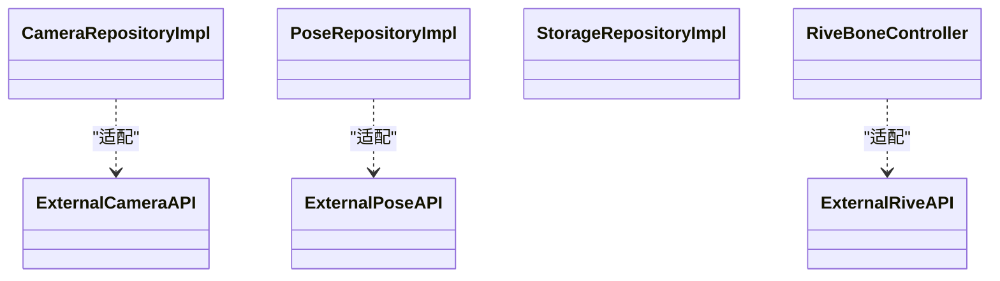

**图表来源**
- [lib/data/repositories_impl/camera_repository_impl.dart](file://lib/data/repositories_impl/camera_repository_impl.dart)
- [lib/data/repositories_impl/pose_repository_impl.dart](file://lib/data/repositories_impl/pose_repository_impl.dart)
- [lib/data/repositories_impl/storage_repository_impl.dart](file://lib/data/repositories_impl/storage_repository_impl.dart)
- [lib/domain/services/rive_bone_controller.dart](file://lib/domain/services/rive_bone_controller.dart)

**章节来源**
- [lib/data/repositories_impl/camera_repository_impl.dart](file://lib/data/repositories_impl/camera_repository_impl.dart)
- [lib/data/repositories_impl/pose_repository_impl.dart](file://lib/data/repositories_impl/pose_repository_impl.dart)
- [lib/data/repositories_impl/storage_repository_impl.dart](file://lib/data/repositories_impl/storage_repository_impl.dart)
- [lib/domain/services/rive_bone_controller.dart](file://lib/domain/services/rive_bone_controller.dart)

### 命令模式：可撤销/重放的动作封装
- 场景定位：用户操作（如调整参数、切换模式）可被记录与回放，便于调试与一致性验证。
- 实现建议：
  - 定义命令接口，包含执行与撤销方法。
  - 将页面操作封装为命令对象，统一由命令调度器管理。
  - 通过日志或队列持久化命令序列，支持重放与回滚。

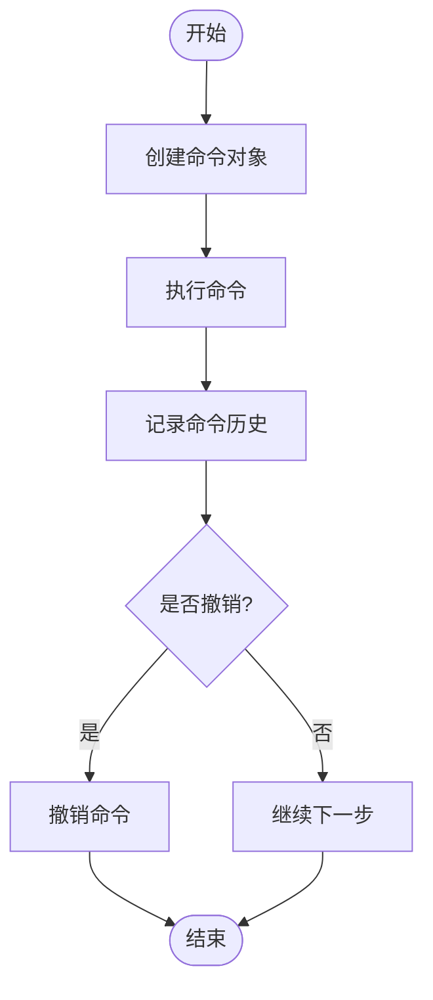

[此图为概念性流程图，无需图表来源]

### 责任链模式：多阶段处理与条件分流
- 场景定位：帧处理需要按优先级或条件依次尝试多种处理路径（如先校准再滤波，若失败则降级）。
- 实现建议：
  - 定义处理器接口，每个处理器决定是否处理或传递给下一个。
  - 将校准、滤波、语义等处理器串联成链，按顺序或条件选择执行。
  - 支持动态插入/移除处理器，增强灵活性。

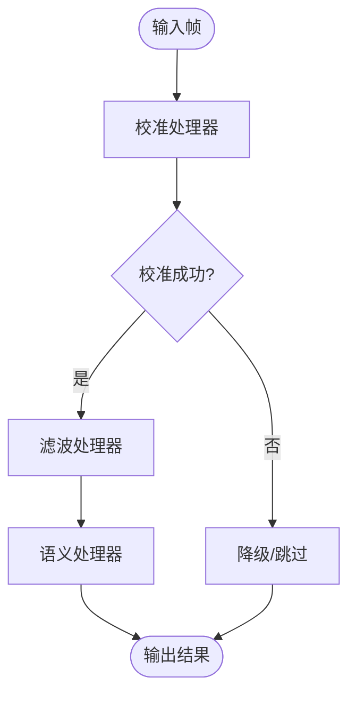

[此图为概念性流程图，无需图表来源]

### 模板方法模式：固定流程与可变步骤
- 场景定位：多个处理流程具有相同骨架（准备-执行-收尾），但中间步骤可替换。
- 实现建议：
  - 抽象基类定义处理骨架与钩子点。
  - 子类实现可变步骤，保持整体流程一致。
  - 适用于引擎族的通用处理流程。

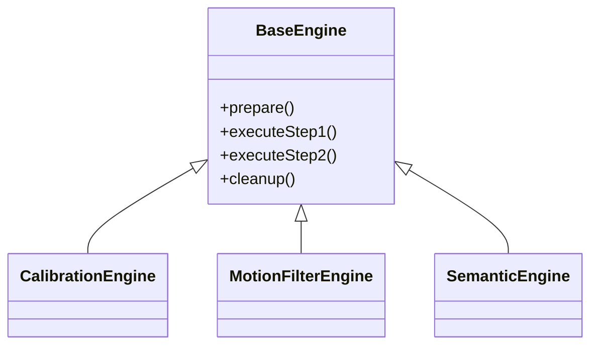

**图表来源**
- [lib/domain/engines/calibration/calibration_engine.dart](file://lib/domain/engines/calibration/calibration_engine.dart)
- [lib/domain/engines/filtering/motion_filter_engine.dart](file://lib/domain/engines/filtering/motion_filter_engine.dart)
- [lib/domain/engines/semantic/semantic_engine.dart](file://lib/domain/engines/semantic/semantic_engine.dart)

**章节来源**
- [lib/domain/engines/calibration/calibration_engine.dart](file://lib/domain/engines/calibration/calibration_engine.dart)
- [lib/domain/engines/filtering/motion_filter_engine.dart](file://lib/domain/engines/filtering/motion_filter_engine.dart)
- [lib/domain/engines/semantic/semantic_engine.dart](file://lib/domain/engines/semantic/semantic_engine.dart)

### 建造者模式：复杂对象的逐步构建
- 场景定位：引擎或处理管线的配置项众多且层级复杂，需要逐步组装。
- 实现建议：
  - 定义 Builder 接口，提供逐步设置方法。
  - 通过 Director 控制构建顺序，确保配置完整性。
  - 适用于性能配置、流水线装配等场景。

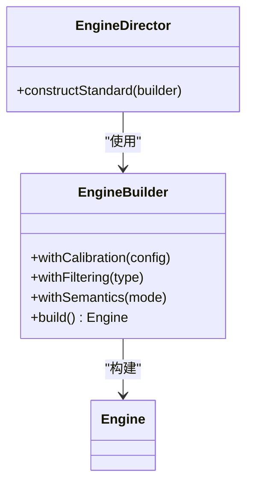

[此图为概念性类图，无需图表来源]

## 依赖分析
- 层间依赖：presentation 依赖 application 的 Provider 与服务；application 依赖 domain 的引擎与服务；domain 依赖 data 的仓库实现；data 依赖 core 的工具与配置。
- 外部依赖：通过仓库适配器对接第三方库，避免直接耦合。
- 可观测性：Provider 管理状态，页面订阅；帧处理服务与引擎输出结果经 Provider 广播。

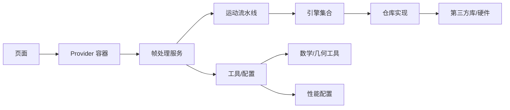

**图表来源**
- [lib/application/providers/providers.dart](file://lib/application/providers/providers.dart)
- [lib/application/services/frame_processing_service.dart](file://lib/application/services/frame_processing_service.dart)
- [lib/application/pipeline/motion_pipeline.dart](file://lib/application/pipeline/motion_pipeline.dart)
- [lib/domain/engines/calibration/calibration_engine.dart](file://lib/domain/engines/calibration/calibration_engine.dart)
- [lib/domain/engines/filtering/motion_filter_engine.dart](file://lib/domain/engines/filtering/motion_filter_engine.dart)
- [lib/domain/engines/semantic/semantic_engine.dart](file://lib/domain/engines/semantic/semantic_engine.dart)
- [lib/data/repositories_impl/camera_repository_impl.dart](file://lib/data/repositories_impl/camera_repository_impl.dart)
- [lib/data/repositories_impl/pose_repository_impl.dart](file://lib/data/repositories_impl/pose_repository_impl.dart)
- [lib/data/repositories_impl/storage_repository_impl.dart](file://lib/data/repositories_impl/storage_repository_impl.dart)
- [lib/core/utils/math_utils.dart](file://lib/core/utils/math_utils.dart)
- [lib/core/utils/geometry_utils.dart](file://lib/core/utils/geometry_utils.dart)
- [lib/core/config/performance_config.dart](file://lib/core/config/performance_config.dart)

**章节来源**
- [lib/application/providers/providers.dart](file://lib/application/providers/providers.dart)
- [lib/application/services/frame_processing_service.dart](file://lib/application/services/frame_processing_service.dart)
- [lib/application/pipeline/motion_pipeline.dart](file://lib/application/pipeline/motion_pipeline.dart)
- [lib/data/repositories_impl/camera_repository_impl.dart](file://lib/data/repositories_impl/camera_repository_impl.dart)
- [lib/data/repositories_impl/pose_repository_impl.dart](file://lib/data/repositories_impl/pose_repository_impl.dart)
- [lib/data/repositories_impl/storage_repository_impl.dart](file://lib/data/repositories_impl/storage_repository_impl.dart)
- [lib/core/utils/math_utils.dart](file://lib/core/utils/math_utils.dart)
- [lib/core/utils/geometry_utils.dart](file://lib/core/utils/geometry_utils.dart)
- [lib/core/config/performance_config.dart](file://lib/core/config/performance_config.dart)

## 性能考量
- 流水线并行化：在保证线程安全的前提下，尽量将独立处理单元并行执行，减少端到端延迟。
- 缓存与复用：对昂贵计算（如滤波、归一化）的结果进行缓存，避免重复计算。
- 配置驱动：通过性能配置模块动态调节算法强度与采样率，平衡质量与性能。
- I/O 优化：仓库适配器应批量读写与异步处理，减少主线程阻塞。

**章节来源**
- [lib/core/config/performance_config.dart](file://lib/core/config/performance_config.dart)
- [lib/application/pipeline/motion_pipeline.dart](file://lib/application/pipeline/motion_pipeline.dart)
- [lib/application/services/frame_processing_service.dart](file://lib/application/services/frame_processing_service.dart)

## 故障排查指南
- 状态不更新：检查 Provider 是否正确订阅与更新；确认帧处理服务是否将结果写入状态。
- 处理无输出：核对仓库适配器是否正确转发外部库回调；检查引擎是否抛出异常或提前返回。
- 性能抖动：查看性能配置是否合理；评估流水线中是否存在阻塞环节。
- 动画不同步：检查 Rive 骨骼控制器与姿态数据的时间戳对齐。

**章节来源**
- [lib/application/providers/providers.dart](file://lib/application/providers/providers.dart)
- [lib/application/services/frame_processing_service.dart](file://lib/application/services/frame_processing_service.dart)
- [lib/data/repositories_impl/camera_repository_impl.dart](file://lib/data/repositories_impl/camera_repository_impl.dart)
- [lib/data/repositories_impl/pose_repository_impl.dart](file://lib/data/repositories_impl/pose_repository_impl.dart)
- [lib/domain/services/rive_bone_controller.dart](file://lib/domain/services/rive_bone_controller.dart)

## 结论
Mimo 项目通过清晰的分层与模块化设计，结合多种设计模式实现了高内聚、低耦合与强扩展性的系统架构。工厂模式用于引擎创建，策略模式用于算法替换，适配器模式用于第三方库集成，观察者模式贯穿状态管理与事件传播。在此基础上，引入命令与责任链模式可进一步增强可维护性与可控性；模板方法与建造者模式有助于规范复杂流程与配置管理。设计模式的选择应综合考虑可维护性、性能与团队熟悉度，在实践中持续演进。

## 附录
- 最佳实践清单
  - 保持单一职责：每个引擎与仓库仅负责一个领域的功能。
  - 明确接口契约：统一输入输出格式，便于替换与测试。
  - 注重可观测性：为关键路径添加日志与指标，便于排障。
  - 渐进式演进：优先采用简单模式，随需求增长再引入更复杂的模式。