# 运动处理管道设计

<cite>
**本文引用的文件**
- [lib/main.dart](file://lib/main.dart)
- [lib/application/pipeline/motion_pipeline.dart](file://lib/application/pipeline/motion_pipeline.dart)
- [lib/application/providers/providers.dart](file://lib/application/providers/providers.dart)
- [lib/domain/engines/calibration/calibration_engine.dart](file://lib/domain/engines/calibration/calibration_engine.dart)
- [lib/domain/engines/normalization/normalization_engine.dart](file://lib/domain/engines/normalization/normalization_engine.dart)
- [lib/domain/engines/kinematics/kinematics_engine.dart](file://lib/domain/engines/kinematics/kinematics_engine.dart)
- [lib/domain/engines/filtering/motion_filter_engine.dart](file://lib/domain/engines/filtering/motion_filter_engine.dart)
- [lib/domain/engines/semantic/semantic_engine.dart](file://lib/domain/engines/semantic/semantic_engine.dart)
- [lib/domain/engines/confidence/confidence_processor.dart](file://lib/domain/engines/confidence/confidence_processor.dart)
- [lib/domain/engines/performance/performance_scheduler.dart](file://lib/domain/engines/performance/performance_scheduler.dart)
- [lib/domain/services/angle_compute_service.dart](file://lib/domain/services/angle_compute_service.dart)
- [lib/domain/entities/body_metrics.dart](file://lib/domain/entities/body_metrics.dart)
</cite>

## 目录
1. [引言](#引言)
2. [项目结构](#项目结构)
3. [核心组件](#核心组件)
4. [架构总览](#架构总览)
5. [详细组件分析](#详细组件分析)
6. [依赖关系分析](#依赖关系分析)
7. [性能考虑](#性能考虑)
8. [故障排查指南](#故障排查指南)
9. [结论](#结论)
10. [附录](#附录)

## 引言
本设计文档围绕 Mimo 项目的“运动处理管道”展开，系统阐述了基于流水线模式的运动数据处理架构。该管道以 MotionPipeline 为核心编排层，串联姿态检测、置信度处理、人体归一化、角度计算、运动学约束、滤波、置信度混合、动作语义识别以及性能调度等引擎与服务，形成一条完整的从图像到动作语义与交互反馈的处理链路。文档将深入解释各处理引擎的职责、执行顺序、数据流转与状态变化，并给出可扩展性设计、配置与调优方法、性能监控与调试技巧，以及实际处理流程示例与错误处理机制。

## 项目结构
Mimo 采用 Flutter Riverpod 架构，将应用划分为 presentation、application、domain、data 等层次。运动处理管道位于 application 层，通过 providers.dart 统一注入各引擎与服务；domain 层定义实体、引擎与服务接口与实现；lib/main.dart 作为应用入口，负责页面路由与主题初始化。

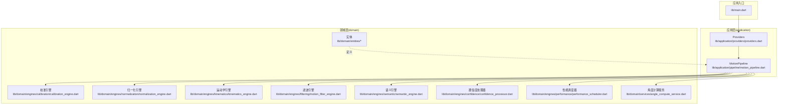

图表来源
- [lib/main.dart:1-34](file://lib/main.dart#L1-L34)
- [lib/application/providers/providers.dart:1-103](file://lib/application/providers/providers.dart#L1-L103)
- [lib/application/pipeline/motion_pipeline.dart:1-141](file://lib/application/pipeline/motion_pipeline.dart#L1-L141)

章节来源
- [lib/main.dart:1-34](file://lib/main.dart#L1-L34)
- [lib/application/providers/providers.dart:1-103](file://lib/application/providers/providers.dart#L1-L103)

## 核心组件
- 运动处理管道（MotionPipeline）：串行编排所有处理步骤，负责控制流程、状态更新与结果封装。
- 引擎与服务：
  - 置信度处理器（ConfidenceProcessor）：根据关键点置信度混合跟踪角度与 idle 角度。
  - 人体归一化引擎（NormalizationEngine）：基于校准数据消除个体差异，统一动作幅度。
  - 关节运动学引擎（KinematicsEngine）：施加角度范围与单帧变化量约束，保证动作符合人体生物力学。
  - 运动滤波引擎（MotionFilterEngine）：组合死区过滤、One Euro 滤波与速度平滑，抑制抖动。
  - 动作语义引擎（SemanticEngine）：识别举手、双手张开、挥手、拍手、双手高举等手势。
  - 角度计算服务（AngleComputeService）：从关键点几何关系计算肩/肘关节角度。
  - 校准引擎（CalibrationEngine）：T-Pose 校准，提取人体度量数据。
  - 性能调度器（PerformanceScheduler）：动态调整性能级别，保障实时性与稳定性。

章节来源
- [lib/application/pipeline/motion_pipeline.dart:14-141](file://lib/application/pipeline/motion_pipeline.dart#L14-L141)
- [lib/application/providers/providers.dart:31-83](file://lib/application/providers/providers.dart#L31-L83)

## 架构总览
运动处理管道采用“流水线 + 引擎编排”的架构模式，将复杂的数据处理拆分为多个独立且可替换的处理单元。每一步处理均以 Map<JointType, T> 的键值形式传递数据，便于模块解耦与组合。

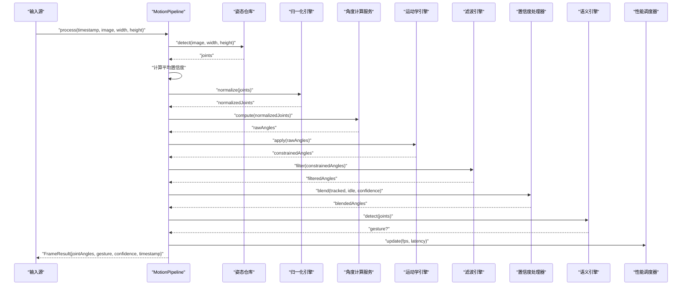

图表来源
- [lib/application/pipeline/motion_pipeline.dart:61-130](file://lib/application/pipeline/motion_pipeline.dart#L61-L130)
- [lib/domain/services/angle_compute_service.dart:20-65](file://lib/domain/services/angle_compute_service.dart#L20-L65)
- [lib/domain/engines/kinematics/kinematics_engine.dart:36-53](file://lib/domain/engines/kinematics/kinematics_engine.dart#L36-L53)
- [lib/domain/engines/filtering/motion_filter_engine.dart:28-48](file://lib/domain/engines/filtering/motion_filter_engine.dart#L28-L48)
- [lib/domain/engines/confidence/confidence_processor.dart:26-50](file://lib/domain/engines/confidence/confidence_processor.dart#L26-L50)
- [lib/domain/engines/semantic/semantic_engine.dart:32-80](file://lib/domain/engines/semantic/semantic_engine.dart#L32-L80)
- [lib/domain/engines/performance/performance_scheduler.dart:96-129](file://lib/domain/engines/performance/performance_scheduler.dart#L96-L129)

## 详细组件分析

### 运动处理管道（MotionPipeline）
- 职责：串行执行姿态检测、置信度统计、归一化、角度计算、运动学约束、滤波、置信度混合、语义识别与性能更新。
- 数据流：输入图像与尺寸 → 关键点集合 → 归一化关键点 → 关节角度 → 约束角度 → 滤波角度 → 置信度混合角度 → 语义识别 → 性能调度 → FrameResult。
- 执行顺序：严格线性，每步输出作为下一步输入；若中间任一步为空或失败，会短路返回空结果或最小必要结果。
- 状态变化：记录处理耗时，驱动性能调度器更新 FPS 与延迟指标。

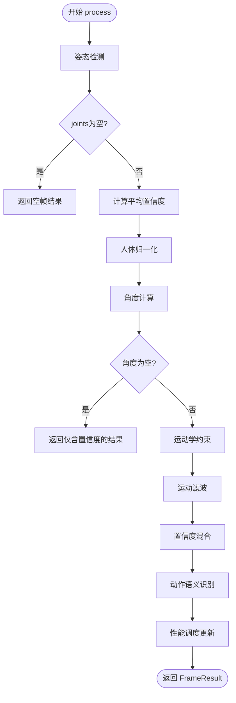

图表来源
- [lib/application/pipeline/motion_pipeline.dart:61-130](file://lib/application/pipeline/motion_pipeline.dart#L61-L130)

章节来源
- [lib/application/pipeline/motion_pipeline.dart:14-141](file://lib/application/pipeline/motion_pipeline.dart#L14-L141)

### 置信度处理器（ConfidenceProcessor）
- 职责：根据关键点可见性置信度，在跟踪角度与 idle 角度之间进行平滑插值，避免置信度低时的突变。
- 算法：分段权重函数，结合高/低阈值，线性插值得到最终角度。
- 复杂度：O(n) 遍历角度映射；静态方法计算平均置信度 O(n)。

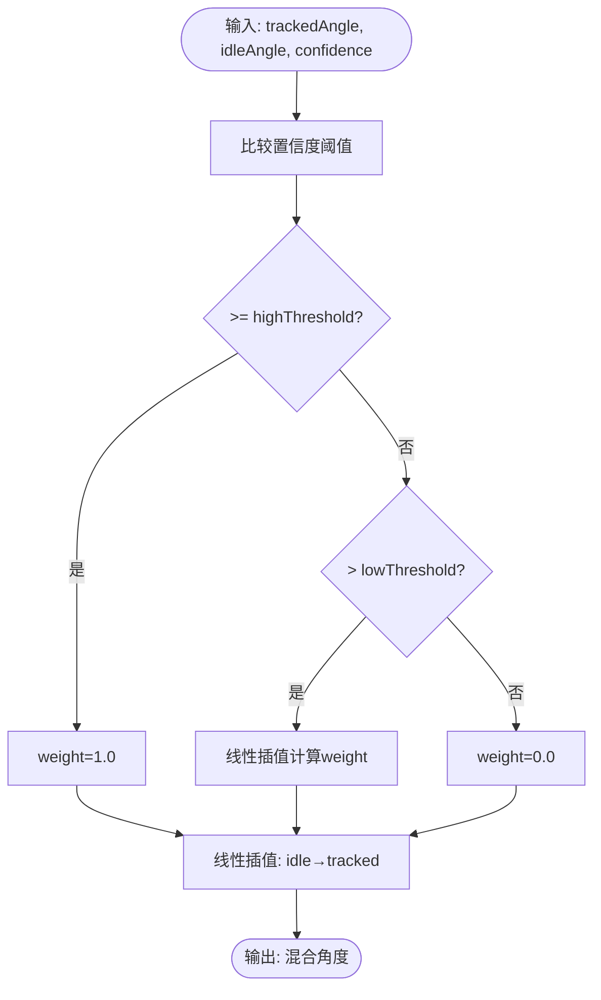

图表来源
- [lib/domain/engines/confidence/confidence_processor.dart:26-50](file://lib/domain/engines/confidence/confidence_processor.dart#L26-L50)

章节来源
- [lib/domain/engines/confidence/confidence_processor.dart:1-91](file://lib/domain/engines/confidence/confidence_processor.dart#L1-L91)

### 人体归一化引擎（NormalizationEngine）
- 职责：基于 BodyMetrics（肩宽、缩放因子、臂长）对关键点进行归一化，消除个体差异。
- 算法：以两肩中心为原点，按缩放因子对偏移进行缩放与钳制，得到统一尺度的关键点。
- 复杂度：O(n) 遍历关键点；校准阶段 O(n) 计算距离。

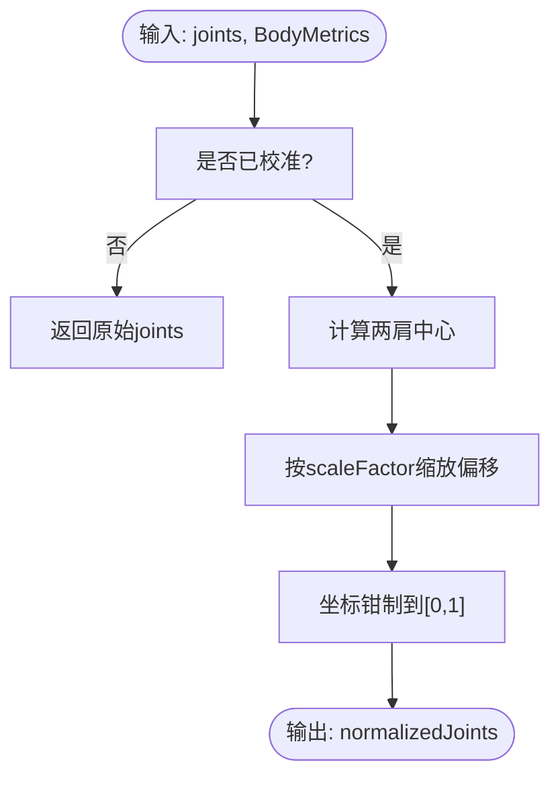

图表来源
- [lib/domain/engines/normalization/normalization_engine.dart:77-113](file://lib/domain/engines/normalization/normalization_engine.dart#L77-L113)

章节来源
- [lib/domain/engines/normalization/normalization_engine.dart:1-143](file://lib/domain/engines/normalization/normalization_engine.dart#L1-L143)
- [lib/domain/entities/body_metrics.dart:1-40](file://lib/domain/entities/body_metrics.dart#L1-L40)

### 角度计算服务（AngleComputeService）
- 职责：从关键点几何关系计算肩/肘关节角度，支持肩角度归一化与肘角度钳制。
- 算法：利用几何工具计算角度，肩角度归一化至 [-π, π]，肘角度钳制至 [0, π]。
- 复杂度：O(n) 遍历需要计算的关节。

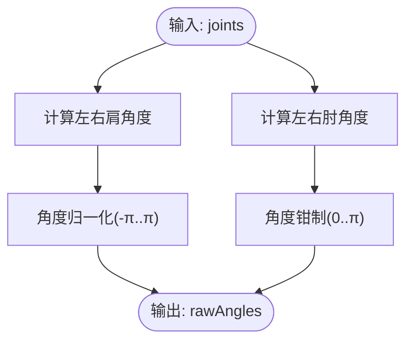

图表来源
- [lib/domain/services/angle_compute_service.dart:20-65](file://lib/domain/services/angle_compute_service.dart#L20-L65)

章节来源
- [lib/domain/services/angle_compute_service.dart:1-120](file://lib/domain/services/angle_compute_service.dart#L1-L120)

### 关节运动学引擎（KinematicsEngine）
- 职责：施加关节角度范围约束与单帧最大变化量约束，防止动作突变。
- 算法：逐关节应用约束，维护 JointStates，限制角度范围与变化速率。
- 复杂度：O(n) 遍历关节；状态更新 O(1)。

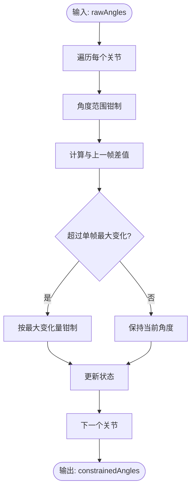

图表来源
- [lib/domain/engines/kinematics/kinematics_engine.dart:36-81](file://lib/domain/engines/kinematics/kinematics_engine.dart#L36-L81)

章节来源
- [lib/domain/engines/kinematics/kinematics_engine.dart:1-95](file://lib/domain/engines/kinematics/kinematics_engine.dart#L1-L95)

### 运动滤波引擎（MotionFilterEngine）
- 职责：组合死区过滤、One Euro 滤波与速度平滑，抑制抖动与噪声。
- 算法：对每个关节维护 OneEuroFilter，先死区过滤，再 One Euro 滤波，最后速度平滑。
- 复杂度：O(n) 遍历关节；滤波器按需创建 O(1)。

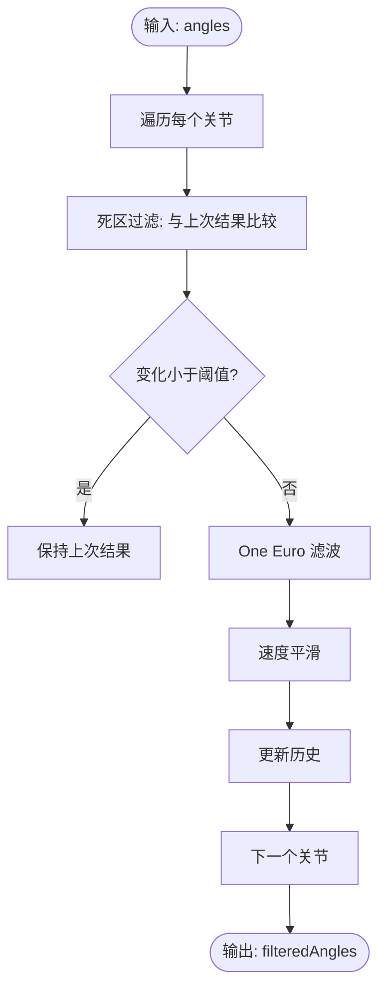

图表来源
- [lib/domain/engines/filtering/motion_filter_engine.dart:28-102](file://lib/domain/engines/filtering/motion_filter_engine.dart#L28-L102)

章节来源
- [lib/domain/engines/filtering/motion_filter_engine.dart:1-117](file://lib/domain/engines/filtering/motion_filter_engine.dart#L1-L117)

### 动作语义引擎（SemanticEngine）
- 职责：识别举手、双手张开、挥手、拍手、双手高举等手势，提供稳定检测。
- 算法：基于关键点坐标与历史记录，结合阈值与周期检测逻辑，使用固定窗口长度的历史记录判断稳定触发。
- 复杂度：O(n) 检测各手势；挥手检测峰值计数 O(t)，t 为历史长度。

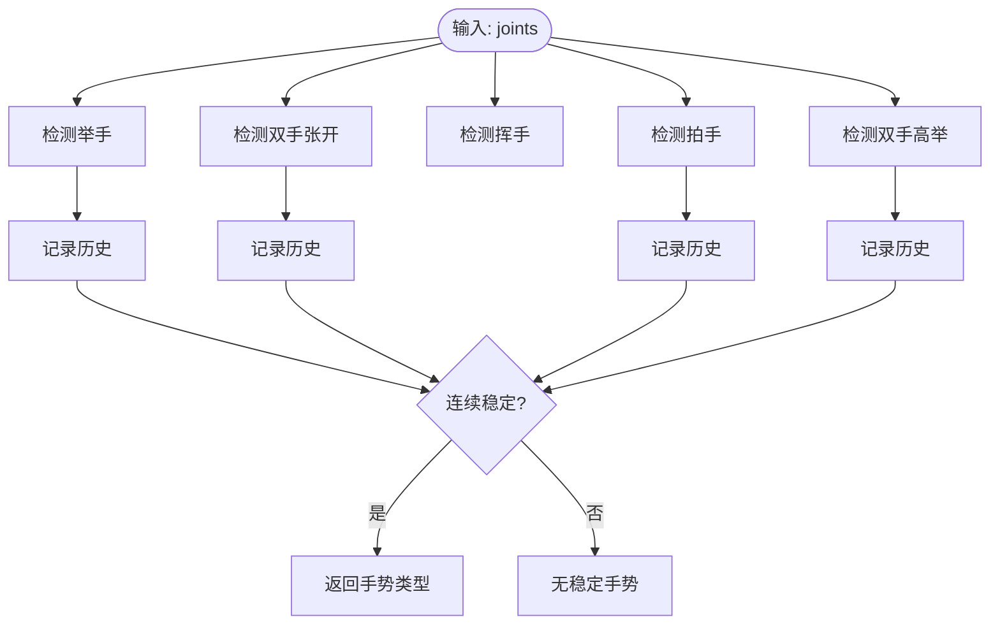

图表来源
- [lib/domain/engines/semantic/semantic_engine.dart:32-205](file://lib/domain/engines/semantic/semantic_engine.dart#L32-L205)

章节来源
- [lib/domain/engines/semantic/semantic_engine.dart:1-221](file://lib/domain/engines/semantic/semantic_engine.dart#L1-L221)

### 校准引擎（CalibrationEngine）
- 职责：执行 T-Pose 校准流程，计算 BodyMetrics，提供人体度量数据。
- 状态机：waiting → detecting → tPoseDetected → calibrating → inProgress → verifying → success/failed。
- 算法：检测 T-Pose 连续帧数、阈值判断、超时控制、度量计算（肩宽、缩放因子、臂长）。
- 复杂度：每帧 O(1) 状态转移与阈值判断；度量计算 O(1)。

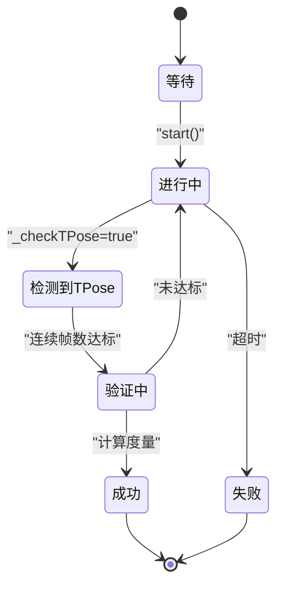

图表来源
- [lib/domain/engines/calibration/calibration_engine.dart:8-32](file://lib/domain/engines/calibration/calibration_engine.dart#L8-L32)
- [lib/domain/engines/calibration/calibration_engine.dart:106-176](file://lib/domain/engines/calibration/calibration_engine.dart#L106-L176)

章节来源
- [lib/domain/engines/calibration/calibration_engine.dart:1-302](file://lib/domain/engines/calibration/calibration_engine.dart#L1-L302)
- [lib/domain/entities/body_metrics.dart:1-40](file://lib/domain/entities/body_metrics.dart#L1-L40)

### 性能调度器（PerformanceScheduler）
- 职责：根据 FPS、延迟与温度等指标动态调整性能级别（高/中/低），实现自适应降级与升级。
- 算法：累计连续高/低负载帧数，达到阈值后切换性能级别；读取配置表获取对应设置。
- 复杂度：每次更新 O(1)；状态复制 O(1)。

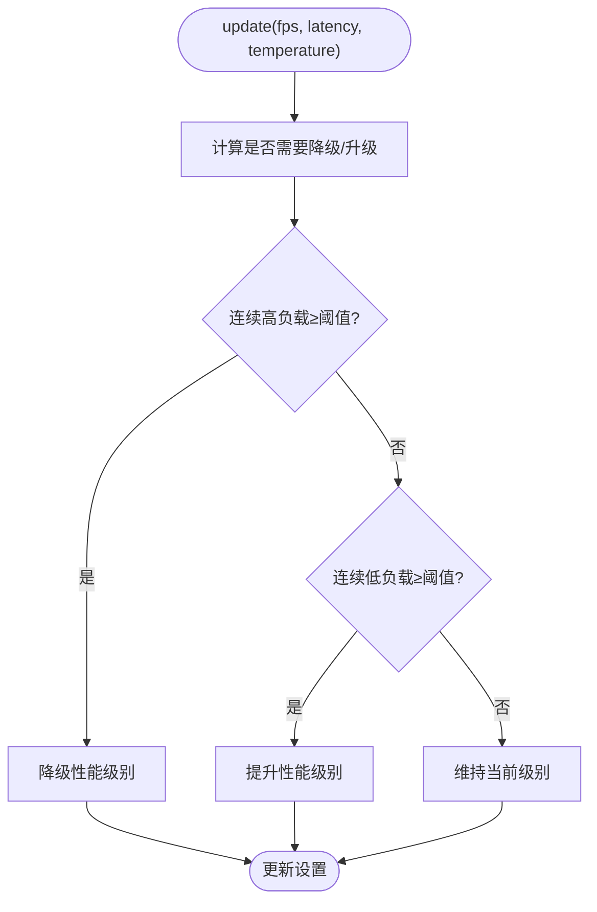

图表来源
- [lib/domain/engines/performance/performance_scheduler.dart:96-180](file://lib/domain/engines/performance/performance_scheduler.dart#L96-L180)

章节来源
- [lib/domain/engines/performance/performance_scheduler.dart:1-194](file://lib/domain/engines/performance/performance_scheduler.dart#L1-L194)

## 依赖关系分析
- 组件耦合：MotionPipeline 对各引擎与服务存在强依赖，但通过 Riverpod Provider 解耦注入；各引擎内部低耦合，仅依赖实体与工具类。
- 直接依赖：
  - MotionPipeline 依赖 PoseRepository、ConfidenceProcessor、NormalizationEngine、KinematicsEngine、MotionFilterEngine、SemanticEngine、PerformanceScheduler、AngleComputeService。
  - AngleComputeService 依赖几何工具与 Landmark。
  - KinematicsEngine 依赖 JointConstraint 与 JointStates。
  - MotionFilterEngine 依赖 OneEuroFilter。
  - NormalizationEngine 依赖 BodyMetrics。
  - CalibrationEngine 依赖 BodyMetrics 与常量配置。
- 外部依赖：Flutter Riverpod 用于状态与依赖注入；Dart 数学库用于三角函数与数值运算。

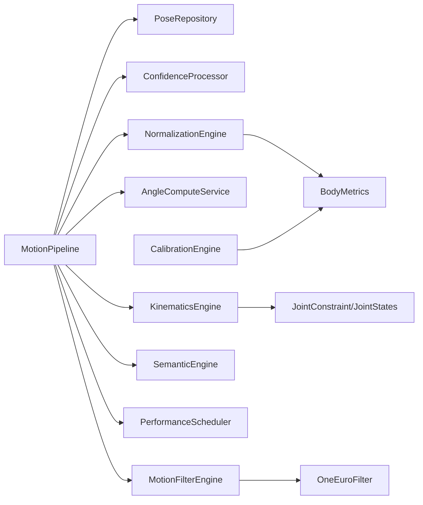

图表来源
- [lib/application/pipeline/motion_pipeline.dart:18-40](file://lib/application/pipeline/motion_pipeline.dart#L18-L40)
- [lib/application/providers/providers.dart:72-83](file://lib/application/providers/providers.dart#L72-L83)
- [lib/domain/engines/normalization/normalization_engine.dart:10-11](file://lib/domain/engines/normalization/normalization_engine.dart#L10-L11)
- [lib/domain/engines/kinematics/kinematics_engine.dart:10-19](file://lib/domain/engines/kinematics/kinematics_engine.dart#L10-L19)
- [lib/domain/engines/filtering/motion_filter_engine.dart:9-21](file://lib/domain/engines/filtering/motion_filter_engine.dart#L9-L21)
- [lib/domain/engines/calibration/calibration_engine.dart:2-5](file://lib/domain/engines/calibration/calibration_engine.dart#L2-L5)

章节来源
- [lib/application/providers/providers.dart:1-103](file://lib/application/providers/providers.dart#L1-L103)

## 性能考虑
- 流水线优化：
  - 将计算密集型步骤（角度计算、滤波）尽量并行化，但需注意共享状态（如 JointStates、滤波器实例）的线程安全。
  - 使用惰性初始化与复用对象，减少分配与 GC 压力。
- 滤波与平滑：
  - 调整死区阈值与速度平滑系数，平衡响应速度与稳定性。
  - One Euro 滤波参数可根据场景动态调整。
- 性能调度：
  - 根据设备温度与延迟阈值动态降级，避免过热与卡顿。
  - 在低端设备上优先降低滤波复杂度或减少滤波器数量。
- 内存与缓存：
  - 控制历史记录长度（如语义引擎的手势历史、滤波器的速度历史），避免内存膨胀。
  - 对频繁使用的滤波器与状态进行池化或复用。

## 故障排查指南
- 常见问题与定位：
  - 姿态检测为空：检查摄像头权限、光照条件与人物是否完全入镜；确认 PoseRepository 的 detect 实现。
  - 角度过度抖动：增大滤波死区阈值、提高 One Euro 滤波截止频率或增强速度平滑系数。
  - 角度突变：检查运动学约束范围与单帧最大变化量是否合理；查看 JointStates 是否被重置。
  - 置信度混合无效：确认 ConfidenceProcessor 的 idle 角度设置与阈值配置；检查 joints 的可见性。
  - 校准失败：检查 T-Pose 检测阈值、连续帧要求与超时设置；确保关键点可见性足够。
  - 性能不稳定：监控 FPS 与温度，适当降级性能级别；检查是否存在额外后台任务占用资源。
- 调试建议：
  - 在 MotionPipeline.process 中记录每一步耗时，定位瓶颈。
  - 使用 Riverpod 的调试工具观察 Provider 状态变化与重建次数。
  - 对关键函数添加日志（如 AngleComputeService、KinematicsEngine、MotionFilterEngine 的输入/输出）。

章节来源
- [lib/application/pipeline/motion_pipeline.dart:67-122](file://lib/application/pipeline/motion_pipeline.dart#L67-L122)
- [lib/domain/engines/semantic/semantic_engine.dart:190-205](file://lib/domain/engines/semantic/semantic_engine.dart#L190-L205)
- [lib/domain/engines/performance/performance_scheduler.dart:96-129](file://lib/domain/engines/performance/performance_scheduler.dart#L96-L129)

## 结论
Mimo 的运动处理管道以清晰的流水线模式组织，将姿态检测、归一化、角度计算、运动学约束、滤波、置信度混合与语义识别等步骤模块化，既保证了可读性与可维护性，也为后续扩展提供了良好基础。通过 PerformanceScheduler 的自适应调度与各引擎的参数化配置，系统能够在不同硬件条件下保持稳定的实时表现。建议在实际部署中结合设备特性与业务需求，持续调优滤波参数与性能阈值，以获得最佳体验。

## 附录
- 管道配置与参数调优要点：
  - 置信度混合：调整高/低阈值与 idle 角度，使跟踪与 idle 的过渡自然。
  - 归一化：确保 BodyMetrics 准确，必要时使用默认值兜底。
  - 运动学约束：针对不同关节约束范围与单帧变化量进行校准。
  - 滤波：根据场景噪声水平调整死区阈值、One Euro 参数与速度平滑系数。
  - 校准：优化 T-Pose 检测阈值与连续帧要求，提升鲁棒性。
  - 性能调度：依据目标帧率与设备能力设定阈值，避免频繁升降级。
- 新引擎集成方式：
  - 在 providers.dart 中新增 Provider，注入新引擎实例。
  - 在 MotionPipeline 中添加新步骤，明确输入/输出与异常处理。
  - 为新引擎提供默认配置与可调参数，确保与现有流水线兼容。
  - 通过 PerformanceScheduler 评估新引擎对整体性能的影响，必要时进行降级。