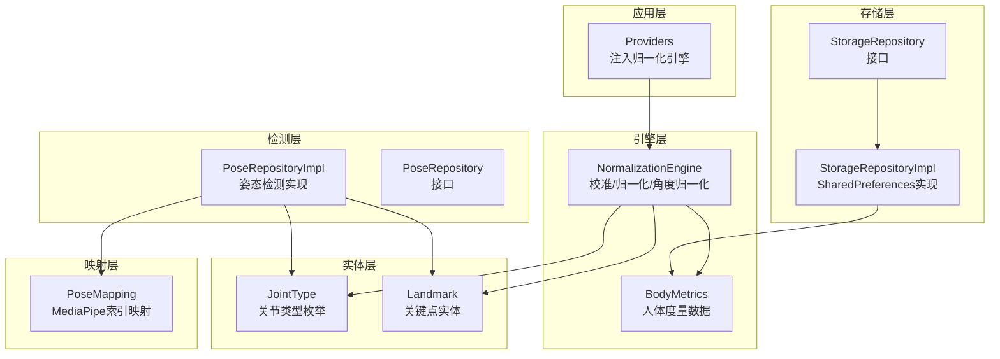
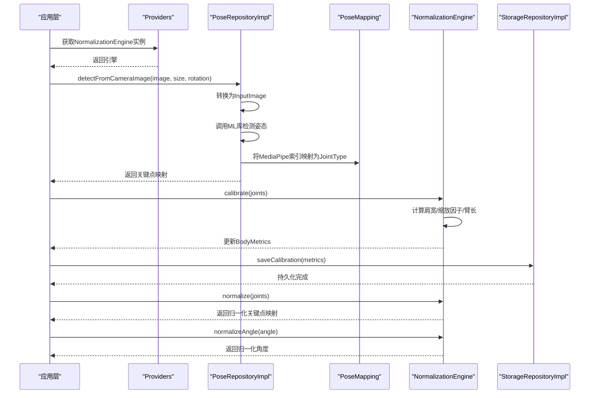
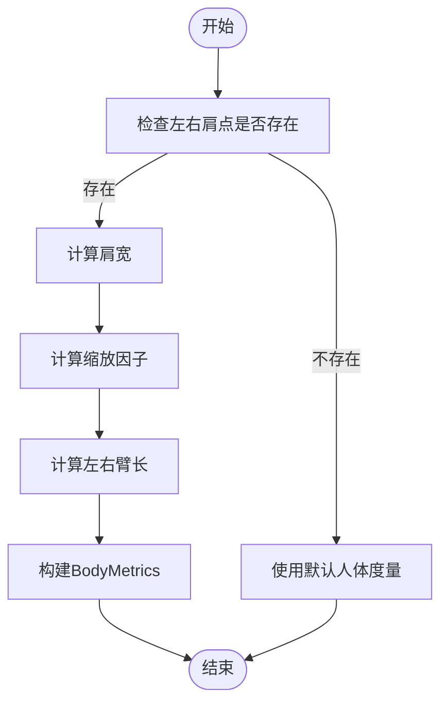
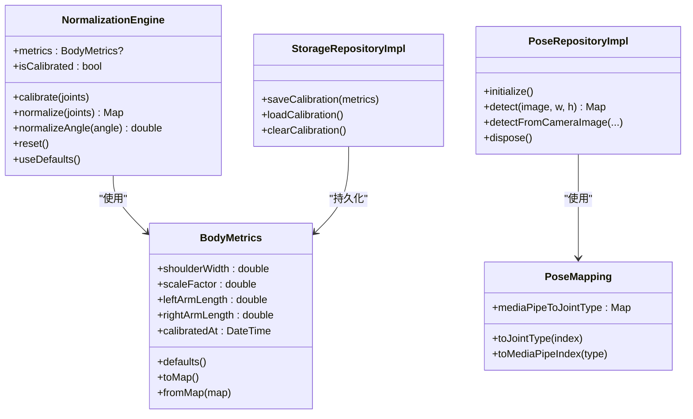

# 人体归一化引擎

<cite>
**本文引用的文件**
- [normalization_engine.dart](file://lib/domain/engines/normalization/normalization_engine.dart)
- [body_metrics.dart](file://lib/domain/entities/body_metrics.dart)
- [pose_mapping_service.dart](file://lib/domain/services/pose_mapping_service.dart)
- [pose_repository_impl.dart](file://lib/data/repositories_impl/pose_repository_impl.dart)
- [pose_repository.dart](file://lib/domain/repositories/pose_repository.dart)
- [joint_type.dart](file://lib/domain/entities/joint_type.dart)
- [landmark.dart](file://lib/domain/entities/landmark.dart)
- [storage_repository.dart](file://lib/domain/repositories/storage_repository.dart)
- [storage_repository_impl.dart](file://lib/data/repositories_impl/storage_repository_impl.dart)
- [providers.dart](file://lib/application/providers/providers.dart)
</cite>

## 目录
1. [简介](#简介)
2. [项目结构](#项目结构)
3. [核心组件](#核心组件)
4. [架构总览](#架构总览)
5. [详细组件分析](#详细组件分析)
6. [依赖分析](#依赖分析)
7. [性能考虑](#性能考虑)
8. [故障排查指南](#故障排查指南)
9. [结论](#结论)
10. [附录](#附录)

## 简介
本文件面向Mimo项目的人体归一化引擎，系统性阐述其算法原理、人体度量计算流程、关键点坐标归一化方法、比例调整与姿态对齐机制，并说明如何适配不同身高与体型用户。文档同时给出数学模型与算法步骤、代码示例路径、数据存储与缓存策略，以及与姿态检测、映射与存储等模块的交互方式。

## 项目结构
围绕人体归一化引擎，涉及以下关键层次与文件：
- 引擎层：归一化引擎负责校准、关键点归一化与角度归一化
- 实体层：关键点、关节类型、人体度量数据
- 映射层：MediaPipe关键点索引到Mimo关节类型的映射
- 检测层：姿态检测仓库实现，负责从相机帧提取关键点
- 存储层：校准数据的持久化与加载
- 应用层：通过Provider注入与使用归一化引擎

图表来源
- [providers.dart:36-39](file://lib/application/providers/providers.dart#L36-L39)
- [normalization_engine.dart:9-16](file://lib/domain/engines/normalization/normalization_engine.dart#L9-L16)
- [body_metrics.dart:4-26](file://lib/domain/entities/body_metrics.dart#L4-L26)
- [pose_mapping_service.dart:6-37](file://lib/domain/services/pose_mapping_service.dart#L6-L37)
- [pose_repository_impl.dart:11-22](file://lib/data/repositories_impl/pose_repository_impl.dart#L11-L22)
- [pose_repository.dart:5-23](file://lib/domain/repositories/pose_repository.dart#L5-L23)
- [storage_repository.dart:4-19](file://lib/domain/repositories/storage_repository.dart#L4-L19)
- [storage_repository_impl.dart:7-39](file://lib/data/repositories_impl/storage_repository_impl.dart#L7-L39)

章节来源
- [normalization_engine.dart:1-143](file://lib/domain/engines/normalization/normalization_engine.dart#L1-L143)
- [body_metrics.dart:1-109](file://lib/domain/entities/body_metrics.dart#L1-L109)
- [pose_mapping_service.dart:1-37](file://lib/domain/services/pose_mapping_service.dart#L1-L37)
- [pose_repository_impl.dart:1-204](file://lib/data/repositories_impl/pose_repository_impl.dart#L1-L204)
- [pose_repository.dart:1-23](file://lib/domain/repositories/pose_repository.dart#L1-L23)
- [storage_repository.dart:1-19](file://lib/domain/repositories/storage_repository.dart#L1-L19)
- [storage_repository_impl.dart:1-39](file://lib/data/repositories_impl/storage_repository_impl.dart#L1-L39)
- [providers.dart:31-69](file://lib/application/providers/providers.dart#L31-L69)

## 核心组件
- 归一化引擎：执行校准、关键点归一化、角度归一化；维护人体度量数据
- 人体度量数据：记录肩宽、缩放因子、左右臂长与校准时间戳
- 关节类型与关键点：定义支持的关节类型及关键点坐标与置信度
- 姿态检测仓库：将相机帧转换为InputImage并调用ML库进行姿态检测，输出关键点映射
- 姿态映射服务：将MediaPipe关键点索引映射到Mimo的关节类型
- 存储仓库：提供SharedPreferences实现，持久化BodyMetrics与用户设置

章节来源
- [normalization_engine.dart:9-16](file://lib/domain/engines/normalization/normalization_engine.dart#L9-L16)
- [body_metrics.dart:4-26](file://lib/domain/entities/body_metrics.dart#L4-L26)
- [joint_type.dart:4-57](file://lib/domain/entities/joint_type.dart#L4-L57)
- [landmark.dart:4-22](file://lib/domain/entities/landmark.dart#L4-L22)
- [pose_repository_impl.dart:11-22](file://lib/data/repositories_impl/pose_repository_impl.dart#L11-L22)
- [pose_mapping_service.dart:6-37](file://lib/domain/services/pose_mapping_service.dart#L6-L37)
- [storage_repository_impl.dart:7-39](file://lib/data/repositories_impl/storage_repository_impl.dart#L7-L39)

## 架构总览
归一化引擎在应用层通过Provider注入，接收来自姿态检测仓库的关键点映射，经过校准得到人体度量数据，再对关键点与角度进行归一化处理，最终供运动学与动画模块使用。

图表来源
- [providers.dart:36-39](file://lib/application/providers/providers.dart#L36-L39)
- [pose_repository_impl.dart:40-71](file://lib/data/repositories_impl/pose_repository_impl.dart#L40-L71)
- [pose_mapping_service.dart:10-37](file://lib/domain/services/pose_mapping_service.dart#L10-L37)
- [normalization_engine.dart:25-70](file://lib/domain/engines/normalization/normalization_engine.dart#L25-L70)
- [storage_repository_impl.dart:13-16](file://lib/data/repositories_impl/storage_repository_impl.dart#L13-L16)

## 详细组件分析

### 归一化引擎（NormalizationEngine）
职责与流程
- 校准：基于T-Pose关键点计算肩宽与缩放因子，估算左右臂长，生成人体度量数据
- 关键点归一化：以双肩中点为中心，按缩放因子对每个关键点进行相对位移缩放，并裁剪至[0,1]
- 角度归一化：根据缩放因子对角度幅度进行反比缩放，使小个子动作幅度放大、大个子动作幅度缩小
- 默认与重置：支持默认人体度量与手动重置

数学模型与算法步骤
- 肩宽计算：d = sqrt((x2−x1)^2 + (y2−y1)^2)
- 缩放因子：scaleFactor = 肩宽 / 标准肩宽（限制在[0.5, 2.0]）
- 臂长计算：左臂=肩-肘距离+肘-腕距离；右臂同理（若缺失则累加为空）
- 归一化关键点：centerX=centerY=0.5（若肩点可用则取两肩中点）；x' = centerX + (x − centerX)/scale；y' = centerY + (y − centerY)/scale；裁剪至[0,1]
- 角度归一化：angle' = angle × (1/sqrt(scaleFactor))

图表来源
- [normalization_engine.dart:25-70](file://lib/domain/engines/normalization/normalization_engine.dart#L25-L70)

章节来源
- [normalization_engine.dart:9-16](file://lib/domain/engines/normalization/normalization_engine.dart#L9-L16)
- [normalization_engine.dart:25-70](file://lib/domain/engines/normalization/normalization_engine.dart#L25-L70)
- [normalization_engine.dart:77-113](file://lib/domain/engines/normalization/normalization_engine.dart#L77-L113)
- [normalization_engine.dart:118-125](file://lib/domain/engines/normalization/normalization_engine.dart#L118-L125)
- [normalization_engine.dart:134-142](file://lib/domain/engines/normalization/normalization_engine.dart#L134-L142)

### 人体度量数据（BodyMetrics）
- 字段：肩宽、缩放因子、左右臂长、校准时间戳
- 默认值：标准肩宽、缩放因子为1、左右臂长为肩宽的约1.2倍
- 序列化/反序列化：toMap/fromMap，便于持久化
- 辅助属性：平均臂长、有效性判断、拷贝与哈希

章节来源
- [body_metrics.dart:4-26](file://lib/domain/entities/body_metrics.dart#L4-L26)
- [body_metrics.dart:32-40](file://lib/domain/entities/body_metrics.dart#L32-L40)
- [body_metrics.dart:56-64](file://lib/domain/entities/body_metrics.dart#L56-L64)
- [body_metrics.dart:67-71](file://lib/domain/entities/body_metrics.dart#L67-L71)

### 关节类型与关键点（JointType/Landmark）
- 关节类型：定义支持的关节（如左右肩、肘、腕、鼻），并标注MediaPipe索引与Rive骨骼名
- 关键点：包含归一化坐标(x,y∈[0,1])、深度(z)与可见度(visibility)，提供拷贝、距离与有效性判断

章节来源
- [joint_type.dart:4-57](file://lib/domain/entities/joint_type.dart#L4-L57)
- [landmark.dart:4-22](file://lib/domain/entities/landmark.dart#L4-L22)
- [landmark.dart:49-57](file://lib/domain/entities/landmark.dart#L49-L57)

### 姿态映射服务（PoseMapping）
- 将MediaPipe Pose关键点索引映射到Mimo的关节类型集合（仅使用部分关键点）
- 提供索引与关节类型的双向查询

章节来源
- [pose_mapping_service.dart:6-37](file://lib/domain/services/pose_mapping_service.dart#L6-L37)

### 姿态检测仓库（PoseRepositoryImpl）
- 初始化：配置流式检测与高精度模型
- 输入转换：支持NV21、YUV420、BGRA8888格式，生成InputImage
- 检测流程：调用ML库检测，取首个结果，映射关键点为JointType→Landmark映射
- 错误处理：捕获异常并返回空映射

章节来源
- [pose_repository_impl.dart:11-22](file://lib/data/repositories_impl/pose_repository_impl.dart#L11-L22)
- [pose_repository_impl.dart:40-71](file://lib/data/repositories_impl/pose_repository_impl.dart#L40-L71)
- [pose_repository_impl.dart:74-131](file://lib/data/repositories_impl/pose_repository_impl.dart#L74-L131)
- [pose_repository_impl.dart:150-170](file://lib/data/repositories_impl/pose_repository_impl.dart#L150-L170)
- [pose_repository_impl.dart:186-197](file://lib/data/repositories_impl/pose_repository_impl.dart#L186-L197)

### 存储与缓存策略（StorageRepositoryImpl）
- 校准数据：以JSON字符串形式保存BodyMetrics，键为固定常量
- 用户设置：统一前缀键值保存设置项
- 加载与清理：解析失败时返回空；提供清除校准数据能力

章节来源
- [storage_repository.dart:4-19](file://lib/domain/repositories/storage_repository.dart#L4-L19)
- [storage_repository_impl.dart:7-39](file://lib/data/repositories_impl/storage_repository_impl.dart#L7-L39)

### 引擎与模块交互
- 应用层通过Provider注入归一化引擎实例
- 归一化引擎依赖人体度量数据与关节类型/关键点实体
- 归一化引擎与姿态检测仓库配合，先校准后归一化
- 归一化结果可写入存储，供后续会话复用

章节来源
- [providers.dart:36-39](file://lib/application/providers/providers.dart#L36-L39)
- [normalization_engine.dart:9-16](file://lib/domain/engines/normalization/normalization_engine.dart#L9-L16)
- [pose_repository_impl.dart:40-71](file://lib/data/repositories_impl/pose_repository_impl.dart#L40-L71)
- [storage_repository_impl.dart:13-16](file://lib/data/repositories_impl/storage_repository_impl.dart#L13-L16)

## 依赖分析
- 组件耦合
  - 归一化引擎依赖人体度量数据与关节类型/关键点实体
  - 姿态检测仓库依赖映射服务与ML库
  - 存储仓库实现依赖SharedPreferences
- 直接依赖链
  - 归一化引擎 → 人体度量数据、关节类型、关键点
  - 姿态检测仓库 → 映射服务、关键点、关节类型
  - 应用层Provider → 归一化引擎
- 外部依赖
  - Google ML Kit Pose Detection（用于姿态检测）
  - SharedPreferences（用于本地持久化）

图表来源
- [normalization_engine.dart:9-16](file://lib/domain/engines/normalization/normalization_engine.dart#L9-L16)
- [body_metrics.dart:4-26](file://lib/domain/entities/body_metrics.dart#L4-L26)
- [pose_repository_impl.dart:11-22](file://lib/data/repositories_impl/pose_repository_impl.dart#L11-L22)
- [pose_mapping_service.dart:6-37](file://lib/domain/services/pose_mapping_service.dart#L6-L37)
- [storage_repository_impl.dart:7-39](file://lib/data/repositories_impl/storage_repository_impl.dart#L7-L39)

## 性能考虑
- 归一化计算复杂度
  - 校准阶段：O(1)（仅使用有限关键点）
  - 关键点归一化：O(n)，n为关键点数量（当前实现仅使用少数上肢关键点）
  - 角度归一化：O(1)
- 优化建议
  - 在UI线程外执行归一化，避免阻塞
  - 对关键点坐标进行边界裁剪与异常值过滤，减少无效计算
  - 缓存中心点与缩放因子，避免重复计算
  - 对ML检测结果进行置信度阈值过滤后再进入归一化

## 故障排查指南
- 归一化无效果或输出不变
  - 检查是否已完成校准（isCalibrated）
  - 确认关键点映射包含左右肩点
- 归一化结果越界
  - 确认归一化后坐标裁剪逻辑生效
- 角度归一化异常
  - 检查缩放因子是否为正数且非零
- 检测失败
  - 查看输入图像格式与旋转参数是否正确
  - 捕获异常并确认返回空映射的分支

章节来源
- [normalization_engine.dart:18-19](file://lib/domain/engines/normalization/normalization_engine.dart#L18-L19)
- [normalization_engine.dart:77-80](file://lib/domain/engines/normalization/normalization_engine.dart#L77-L80)
- [pose_repository_impl.dart:67-70](file://lib/data/repositories_impl/pose_repository_impl.dart#L67-L70)
- [pose_repository_impl.dart:127-130](file://lib/data/repositories_impl/pose_repository_impl.dart#L127-L130)

## 结论
人体归一化引擎通过标准肩宽基准与缩放因子，实现了对不同身高与体型用户的动作幅度适配。结合姿态检测与映射服务，引擎能够稳定地将检测到的关键点转换为标准化的关节位置，并对角度进行比例调整。通过存储模块持久化人体度量数据，可在后续会话中复用，提升用户体验与一致性。

## 附录
- 代码示例路径（不展示具体代码内容）
  - 校准流程：[normalization_engine.dart:25-70](file://lib/domain/engines/normalization/normalization_engine.dart#L25-L70)
  - 关键点归一化：[normalization_engine.dart:77-113](file://lib/domain/engines/normalization/normalization_engine.dart#L77-L113)
  - 角度归一化：[normalization_engine.dart:118-125](file://lib/domain/engines/normalization/normalization_engine.dart#L118-L125)
  - 默认人体度量：[body_metrics.dart:32-40](file://lib/domain/entities/body_metrics.dart#L32-L40)
  - 关键点实体：[landmark.dart:17-22](file://lib/domain/entities/landmark.dart#L17-L22)
  - 姿态检测实现：[pose_repository_impl.dart:40-71](file://lib/data/repositories_impl/pose_repository_impl.dart#L40-L71)
  - 映射服务：[pose_mapping_service.dart:10-37](file://lib/domain/services/pose_mapping_service.dart#L10-L37)
  - 存储实现：[storage_repository_impl.dart:13-16](file://lib/data/repositories_impl/storage_repository_impl.dart#L13-L16)