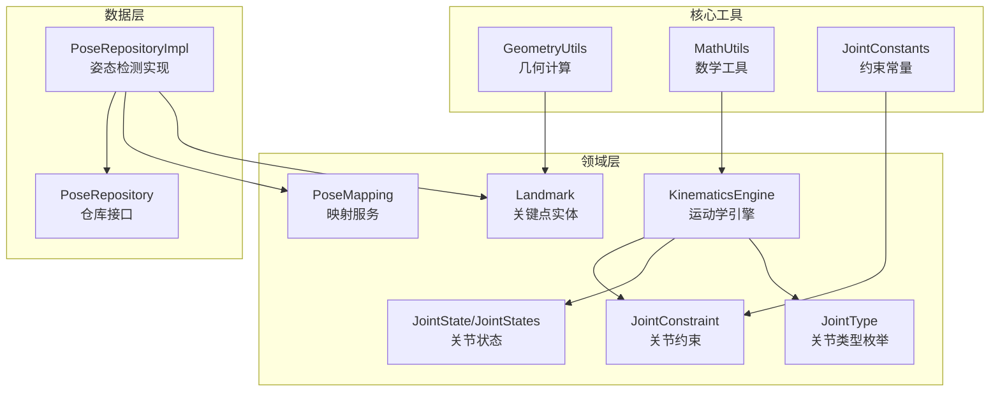
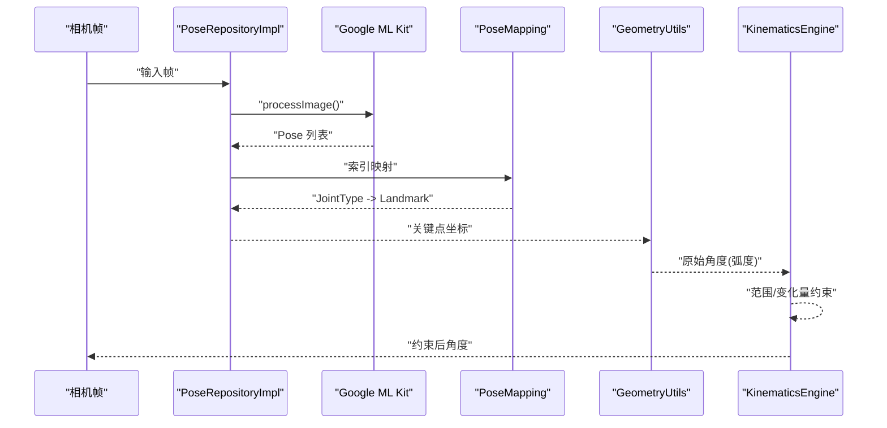
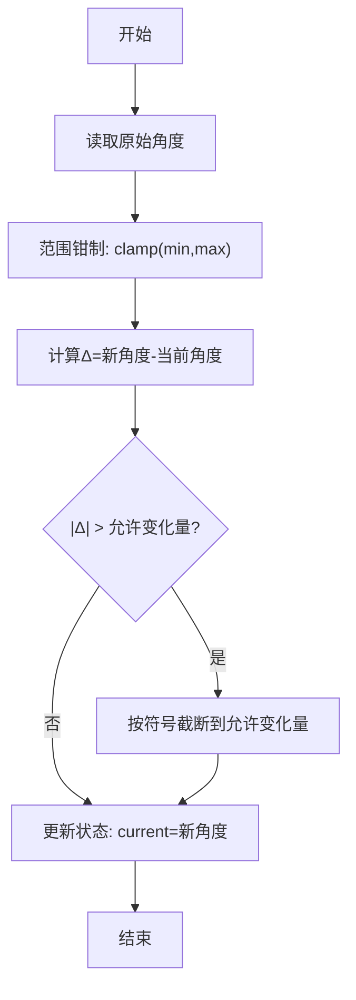
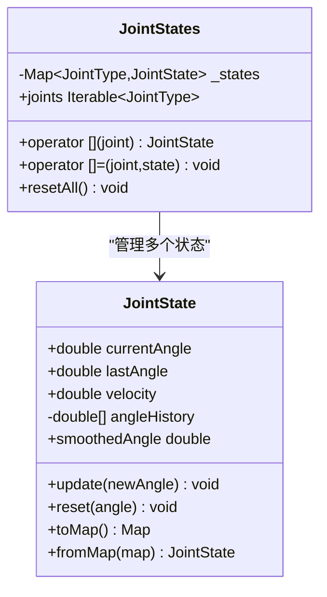
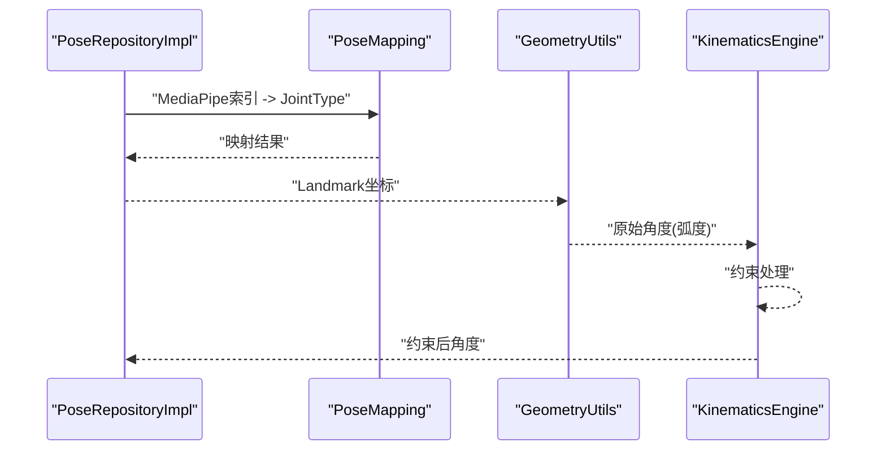
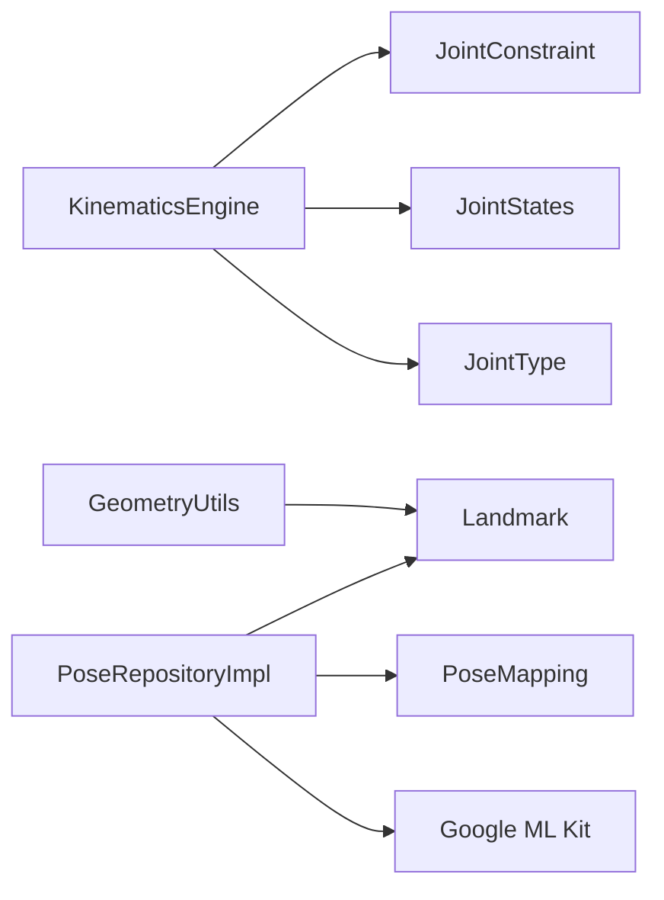

# 关节运动学引擎

<cite>
**本文引用的文件**
- [kinematics_engine.dart](file://lib/domain/engines/kinematics/kinematics_engine.dart)
- [joint_constraint.dart](file://lib/domain/engines/kinematics/joint_constraint.dart)
- [joint_state.dart](file://lib/domain/engines/kinematics/joint_state.dart)
- [joint_type.dart](file://lib/domain/entities/joint_type.dart)
- [geometry_utils.dart](file://lib/core/utils/geometry_utils.dart)
- [math_utils.dart](file://lib/core/utils/math_utils.dart)
- [landmark.dart](file://lib/domain/entities/landmark.dart)
- [pose_repository.dart](file://lib/domain/repositories/pose_repository.dart)
- [pose_repository_impl.dart](file://lib/data/repositories_impl/pose_repository_impl.dart)
- [pose_mapping_service.dart](file://lib/domain/services/pose_mapping_service.dart)
- [joint_constants.dart](file://lib/core/constants/joint_constants.dart)
</cite>

## 目录
1. [简介](#简介)
2. [项目结构](#项目结构)
3. [核心组件](#核心组件)
4. [架构总览](#架构总览)
5. [详细组件分析](#详细组件分析)
6. [依赖分析](#依赖分析)
7. [性能考量](#性能考量)
8. [故障排查指南](#故障排查指南)
9. [结论](#结论)
10. [附录](#附录)

## 简介
本技术文档围绕 Mimo 项目的关节运动学引擎展开，系统阐述运动学约束原理、人体关节运动规律、关节角度计算方法、运动学变换矩阵的应用、JointConstraint 的约束定义与满足算法、JointState 的状态管理与角度更新机制，以及正向与逆向求解的实现思路。同时给出运动学引擎与姿态检测数据的对接方式，并提供数学公式与代码路径示例，帮助开发者快速理解与扩展。

## 项目结构
运动学引擎位于领域层的 engines 子模块中，配合实体与工具类共同完成从姿态检测到驱动动画的关键路径。核心文件组织如下：
- 领域引擎：kinematics_engine.dart、joint_constraint.dart、joint_state.dart
- 实体与映射：joint_type.dart、landmark.dart、pose_mapping_service.dart
- 工具类：geometry_utils.dart、math_utils.dart、joint_constants.dart
- 姿态检测仓库：pose_repository.dart、pose_repository_impl.dart

图表来源
- [kinematics_engine.dart:1-95](file://lib/domain/engines/kinematics/kinematics_engine.dart#L1-L95)
- [joint_constraint.dart:1-47](file://lib/domain/engines/kinematics/joint_constraint.dart#L1-L47)
- [joint_state.dart:1-99](file://lib/domain/engines/kinematics/joint_state.dart#L1-L99)
- [joint_type.dart:1-66](file://lib/domain/entities/joint_type.dart#L1-L66)
- [geometry_utils.dart:1-117](file://lib/core/utils/geometry_utils.dart#L1-L117)
- [math_utils.dart:1-66](file://lib/core/utils/math_utils.dart#L1-L66)
- [landmark.dart:1-87](file://lib/domain/entities/landmark.dart#L1-L87)
- [pose_mapping_service.dart:1-37](file://lib/domain/services/pose_mapping_service.dart#L1-L37)
- [pose_repository.dart:1-23](file://lib/domain/repositories/pose_repository.dart#L1-L23)
- [pose_repository_impl.dart:1-204](file://lib/data/repositories_impl/pose_repository_impl.dart#L1-L204)
- [joint_constants.dart:1-41](file://lib/core/constants/joint_constants.dart#L1-L41)

章节来源
- [kinematics_engine.dart:1-95](file://lib/domain/engines/kinematics/kinematics_engine.dart#L1-L95)
- [joint_constraint.dart:1-47](file://lib/domain/engines/kinematics/joint_constraint.dart#L1-L47)
- [joint_state.dart:1-99](file://lib/domain/engines/kinematics/joint_state.dart#L1-L99)
- [joint_type.dart:1-66](file://lib/domain/entities/joint_type.dart#L1-L66)
- [geometry_utils.dart:1-117](file://lib/core/utils/geometry_utils.dart#L1-L117)
- [math_utils.dart:1-66](file://lib/core/utils/math_utils.dart#L1-L66)
- [landmark.dart:1-87](file://lib/domain/entities/landmark.dart#L1-L87)
- [pose_mapping_service.dart:1-37](file://lib/domain/services/pose_mapping_service.dart#L1-L37)
- [pose_repository.dart:1-23](file://lib/domain/repositories/pose_repository.dart#L1-L23)
- [pose_repository_impl.dart:1-204](file://lib/data/repositories_impl/pose_repository_impl.dart#L1-L204)
- [joint_constants.dart:1-41](file://lib/core/constants/joint_constants.dart#L1-L41)

## 核心组件
- 运动学引擎 KinematicsEngine：负责应用关节约束、限制角度范围与单帧变化量、维护关节状态并输出约束后的角度。
- 关节约束 JointConstraint：定义每个关节的最小/最大角度与单帧最大变化量，提供默认肩/肘约束与按关节类型选择。
- 关节状态 JointState/JointStates：跟踪当前角、上一帧角、角速度与历史角度，提供平滑与重置能力。
- 关节类型 JointType：定义支持的关节枚举及其与 MediaPipe 索引、Rive 骨骼名的映射。
- 几何与数学工具：GeometryUtils 提供角度计算、距离与 T-Pose 判定；MathUtils 提供角度归一化、插值等基础运算。
- 姿态检测与映射：PoseRepository/PoseRepositoryImpl 使用 Google ML Kit 进行姿态检测并将结果映射为 JointType -> Landmark。

章节来源
- [kinematics_engine.dart:1-95](file://lib/domain/engines/kinematics/kinematics_engine.dart#L1-L95)
- [joint_constraint.dart:1-47](file://lib/domain/engines/kinematics/joint_constraint.dart#L1-L47)
- [joint_state.dart:1-99](file://lib/domain/engines/kinematics/joint_state.dart#L1-L99)
- [joint_type.dart:1-66](file://lib/domain/entities/joint_type.dart#L1-L66)
- [geometry_utils.dart:1-117](file://lib/core/utils/geometry_utils.dart#L1-L117)
- [math_utils.dart:1-66](file://lib/core/utils/math_utils.dart#L1-L66)
- [pose_repository.dart:1-23](file://lib/domain/repositories/pose_repository.dart#L1-L23)
- [pose_repository_impl.dart:1-204](file://lib/data/repositories_impl/pose_repository_impl.dart#L1-L204)
- [pose_mapping_service.dart:1-37](file://lib/domain/services/pose_mapping_service.dart#L1-L37)

## 架构总览
运动学引擎与姿态检测的数据流如下：
- 姿态检测：通过 PoseRepositoryImpl 将相机帧转换为 InputImage，调用 Google ML Kit 进行检测，返回 Pose。
- 数据映射：使用 PoseMapping 将 MediaPipe 索引映射到 JointType，再封装为 Landmark 映射。
- 角度计算：GeometryUtils 基于 Landmark 计算关节角度（如肩/肘）。
- 运动学约束：KinematicsEngine 对原始角度应用范围与单帧变化量约束，并更新 JointState。
- 动画驱动：最终输出约束后的角度，驱动 Rive 骨骼（由 JointType.riveBoneName 指定）。

图表来源
- [pose_repository_impl.dart:38-71](file://lib/data/repositories_impl/pose_repository_impl.dart#L38-L71)
- [pose_mapping_service.dart:9-18](file://lib/domain/services/pose_mapping_service.dart#L9-L18)
- [geometry_utils.dart:9-38](file://lib/core/utils/geometry_utils.dart#L9-L38)
- [kinematics_engine.dart:31-53](file://lib/domain/engines/kinematics/kinematics_engine.dart#L31-L53)

## 详细组件分析

### 运动学约束原理与人体关节运动规律
- 角度范围限制：每个关节的最小/最大角度来自 JointConstraint 或默认肩/肘约束，单位为度，内部统一转换为弧度进行比较与钳制。
- 单帧变化量限制：防止相邻帧间角度突变，限制单帧最大变化量（度），超过则按符号截断到最大允许变化。
- 生物力学一致性：通过限制变化量与范围，避免不自然的动作，提升动画流畅性与真实感。

章节来源
- [kinematics_engine.dart:63-75](file://lib/domain/engines/kinematics/kinematics_engine.dart#L63-L75)
- [joint_constraint.dart:20-32](file://lib/domain/engines/kinematics/joint_constraint.dart#L20-L32)

### 关节角度计算方法
- 两关键点夹角：GeometryUtils.calculateAngle 基于 atan2(dy, dx) 计算从起点到终点的方向角（弧度）。
- 三点夹角（关节角）：calculateJointAngle 通过两个方向角之差并归一化到 [-π, π] 得到相对角度。
- 肩关节角：calculateShoulderAngle 以躯干方向（肩到髋）为参考，计算手臂方向（肩到肘）相对角度。
- 肘关节角：calculateElbowAngle 以肩/腕为端点，肘为顶点，计算肘弯角度。

章节来源
- [geometry_utils.dart:9-66](file://lib/core/utils/geometry_utils.dart#L9-L66)

### 运动学变换矩阵的应用
- 本项目未直接实现齐次变换矩阵或 DH 参数法。运动学约束通过角度钳制与平滑策略实现“运动学正向”层面的约束，确保输出角度满足人体运动学范围与连续性。
- 若需引入逆向求解（IK），可在现有角度基础上扩展：以末端目标位姿为约束，迭代优化各关节角度，使链式连杆末端达到目标位置，同时满足 JointConstraint 与平滑条件。

（本节为概念性说明，不直接分析具体源码）

### JointConstraint 类的约束定义与满足算法
- 约束字段：minAngle、maxAngle、maxDeltaPerFrame（单位：度）。
- 默认约束：肩关节 [-180°, 180°]，肘关节 [0°, 150°]；单帧最大变化量均为 25°。
- 约束满足流程：
  1) 将原始角度钳制到 [minAngle, maxAngle]；
  2) 计算与上一帧角度的差值，若超过 maxDeltaPerFrame，则按符号截断到允许范围；
  3) 更新 JointState 的 currentAngle、lastAngle 与 velocity。

图表来源
- [kinematics_engine.dart:55-81](file://lib/domain/engines/kinematics/kinematics_engine.dart#L55-L81)
- [joint_constraint.dart:14-18](file://lib/domain/engines/kinematics/joint_constraint.dart#L14-L18)

章节来源
- [joint_constraint.dart:1-47](file://lib/domain/engines/kinematics/joint_constraint.dart#L1-L47)
- [kinematics_engine.dart:55-81](file://lib/domain/engines/kinematics/kinematics_engine.dart#L55-L81)

### JointState 类的状态管理与关节角度更新机制
- 状态字段：currentAngle、lastAngle、velocity、angleHistory（最大长度 5）。
- 更新逻辑：保存 lastAngle，设置 currentAngle 为新值，velocity = current - last；将新角度加入历史队列并保持最大长度。
- 平滑输出：smoothedAngle 为历史角度的简单平均，用于降低抖动。
- 重置：将状态恢复为初始值并清空历史。

图表来源
- [joint_state.dart:6-99](file://lib/domain/engines/kinematics/joint_state.dart#L6-L99)

章节来源
- [joint_state.dart:1-99](file://lib/domain/engines/kinematics/joint_state.dart#L1-L99)

### 正向与逆向求解的实现细节
- 正向求解（Forward Kinematics）：本项目通过几何工具基于关键点坐标直接计算关节角度，属于“正向”层面的运动学。
- 逆向求解（Inverse Kinematics）：当前未实现。若需 IK，建议在现有约束基础上增加目标位姿误差最小化，结合梯度下降或 Jacobian 方法迭代求解，同时满足范围与变化量约束。

章节来源
- [geometry_utils.dart:9-66](file://lib/core/utils/geometry_utils.dart#L9-L66)
- [kinematics_engine.dart:31-53](file://lib/domain/engines/kinematics/kinematics_engine.dart#L31-L53)

### 关节超范围与冲突处理
- 超范围处理：通过范围钳制与单帧变化量限制，避免超出生理范围与突变。
- 冲突处理：当多关节联动时，可采用加权优先级或分层约束，先满足主要关节（如肩/肘）范围，再微调次要关节，避免相互抵消导致不稳定。

章节来源
- [kinematics_engine.dart:63-75](file://lib/domain/engines/kinematics/kinematics_engine.dart#L63-L75)

### 运动学引擎与姿态检测数据的对接方式
- 姿态检测：PoseRepositoryImpl 使用 Google ML Kit 的 PoseDetector 对 CameraImage 进行检测，返回 Pose。
- 数据映射：PoseMapping 将 MediaPipe 索引映射到 JointType，再封装为 Landmark（含 x,y,z,visibility）。
- 角度计算：GeometryUtils 基于 Landmark 计算肩/肘角度。
- 约束应用：KinematicsEngine 接收原始角度，应用范围与变化量约束，输出稳定角度。
- 动画驱动：JointType.riveBoneName 指定骨骼名称，用于驱动 Rive 动画。

图表来源
- [pose_repository_impl.dart:150-170](file://lib/data/repositories_impl/pose_repository_impl.dart#L150-L170)
- [pose_mapping_service.dart:9-18](file://lib/domain/services/pose_mapping_service.dart#L9-L18)
- [geometry_utils.dart:9-66](file://lib/core/utils/geometry_utils.dart#L9-L66)
- [kinematics_engine.dart:31-53](file://lib/domain/engines/kinematics/kinematics_engine.dart#L31-L53)

章节来源
- [pose_repository.dart:1-23](file://lib/domain/repositories/pose_repository.dart#L1-L23)
- [pose_repository_impl.dart:1-204](file://lib/data/repositories_impl/pose_repository_impl.dart#L1-L204)
- [pose_mapping_service.dart:1-37](file://lib/domain/services/pose_mapping_service.dart#L1-L37)
- [geometry_utils.dart:1-117](file://lib/core/utils/geometry_utils.dart#L1-L117)
- [kinematics_engine.dart:1-95](file://lib/domain/engines/kinematics/kinematics_engine.dart#L1-L95)

## 依赖分析
- 组件耦合：
  - KinematicsEngine 依赖 JointConstraint、JointStates、JointType。
  - GeometryUtils 依赖 Landmark 与数学库。
  - PoseRepositoryImpl 依赖 Google ML Kit、PoseMapping、Landmark。
- 外部依赖：Google ML Kit（姿态检测）、Flutter Riverpod（状态管理，见 main.dart）。
- 潜在循环依赖：当前未发现循环导入；JointType 仅作为键/值标识，无反向依赖。

图表来源
- [kinematics_engine.dart:1-95](file://lib/domain/engines/kinematics/kinematics_engine.dart#L1-L95)
- [joint_constraint.dart:1-47](file://lib/domain/engines/kinematics/joint_constraint.dart#L1-L47)
- [joint_state.dart:1-99](file://lib/domain/engines/kinematics/joint_state.dart#L1-L99)
- [joint_type.dart:1-66](file://lib/domain/entities/joint_type.dart#L1-L66)
- [geometry_utils.dart:1-117](file://lib/core/utils/geometry_utils.dart#L1-L117)
- [pose_repository_impl.dart:1-204](file://lib/data/repositories_impl/pose_repository_impl.dart#L1-L204)
- [pose_mapping_service.dart:1-37](file://lib/domain/services/pose_mapping_service.dart#L1-L37)

章节来源
- [kinematics_engine.dart:1-95](file://lib/domain/engines/kinematics/kinematics_engine.dart#L1-L95)
- [geometry_utils.dart:1-117](file://lib/core/utils/geometry_utils.dart#L1-L117)
- [pose_repository_impl.dart:1-204](file://lib/data/repositories_impl/pose_repository_impl.dart#L1-L204)

## 性能考量
- 角度计算复杂度：每帧对关键点进行角度计算，时间复杂度与关键点数量线性相关；当前仅使用肩/肘关键点，开销较小。
- 约束处理复杂度：对每个关节执行钳制与变化量检查，整体 O(N)。
- 状态平滑：历史队列长度固定为 5，平滑计算为 O(k)，k≈5，开销极低。
- 建议优化：
  - 使用缓存中间结果（如方向角）避免重复计算。
  - 在 UI 线程外进行姿态检测与几何计算，减少主线程阻塞。
  - 对 Landmark 可见度进行阈值过滤，提高稳定性。

（本节为通用性能讨论，不直接分析具体源码）

## 故障排查指南
- 角度过大或过小：
  - 检查 JointConstraint 的 min/max 是否合理；确认输入角度单位是否为度。
  - 参考路径：[joint_constraint.dart:20-32](file://lib/domain/engines/kinematics/joint_constraint.dart#L20-L32)
- 角度突变或抖动：
  - 提高 maxDeltaPerFrame 或启用状态平滑；检查帧率与 delta 时间。
  - 参考路径：[kinematics_engine.dart:68-75](file://lib/domain/engines/kinematics/kinematics_engine.dart#L68-L75)
- 姿态检测失败：
  - 确认相机权限、图像格式与旋转参数；检查 PoseRepositoryImpl 的转换逻辑。
  - 参考路径：[pose_repository_impl.dart:73-147](file://lib/data/repositories_impl/pose_repository_impl.dart#L73-L147)
- 关节映射错误：
  - 核对 PoseMapping 中的索引映射与 JointType 定义。
  - 参考路径：[pose_mapping_service.dart:9-18](file://lib/domain/services/pose_mapping_service.dart#L9-L18)

章节来源
- [joint_constraint.dart:20-32](file://lib/domain/engines/kinematics/joint_constraint.dart#L20-L32)
- [kinematics_engine.dart:68-75](file://lib/domain/engines/kinematics/kinematics_engine.dart#L68-L75)
- [pose_repository_impl.dart:73-147](file://lib/data/repositories_impl/pose_repository_impl.dart#L73-L147)
- [pose_mapping_service.dart:9-18](file://lib/domain/services/pose_mapping_service.dart#L9-L18)

## 结论
Mimo 的关节运动学引擎通过明确的关节约束与状态管理，实现了稳定的关节角度输出，满足人体运动学的基本要求。结合姿态检测与几何计算，能够将 MediaPipe 关键点转化为可控的动画驱动信号。未来可在此基础上扩展逆向求解与更复杂的约束策略，进一步提升动作的真实感与鲁棒性。

## 附录
- 数学工具与常量：
  - 角度与弧度转换：参见 MathUtils 与 JointConstants。
  - 角度归一化与差值：MathUtils 提供 normalizeAngle 与 angleDifference。
- 关键点实体：
  - Landmark 包含 x,y,z,visibility，并提供有效性判断与复制方法。
- 关节类型与骨骼映射：
  - JointType 含 MediaPipe 索引与 Rive 骨骼名，便于驱动动画。

章节来源
- [math_utils.dart:1-66](file://lib/core/utils/math_utils.dart#L1-L66)
- [joint_constants.dart:1-41](file://lib/core/constants/joint_constants.dart#L1-L41)
- [landmark.dart:1-87](file://lib/domain/entities/landmark.dart#L1-L87)
- [joint_type.dart:1-66](file://lib/domain/entities/joint_type.dart#L1-L66)