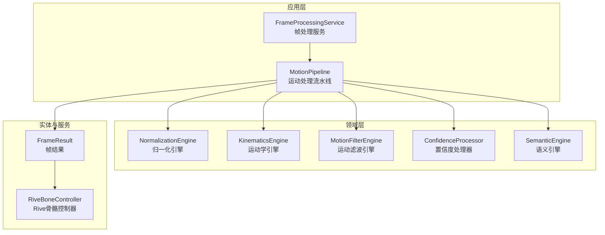
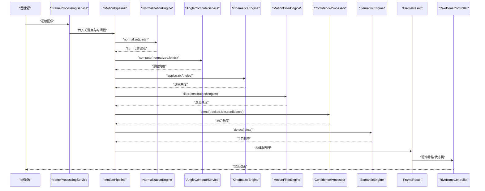
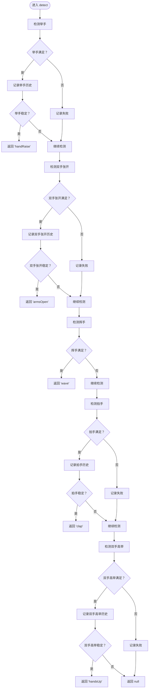
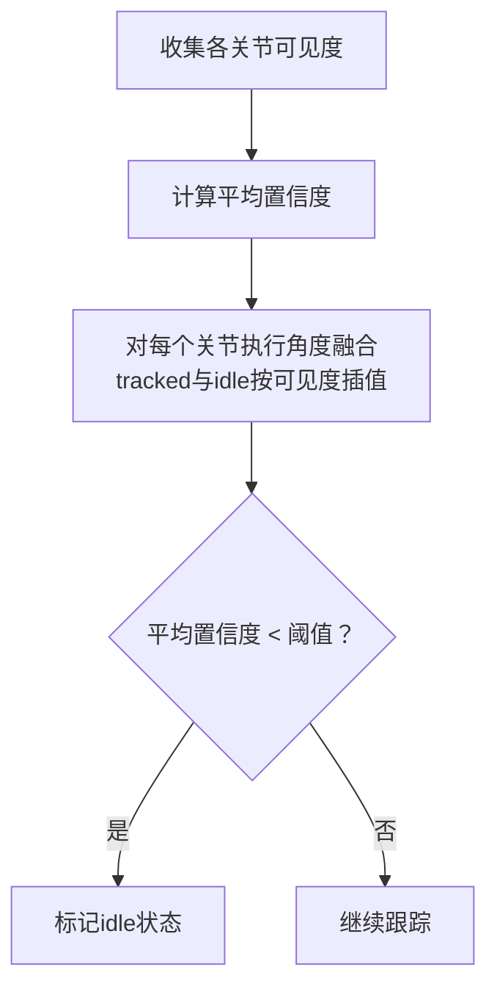
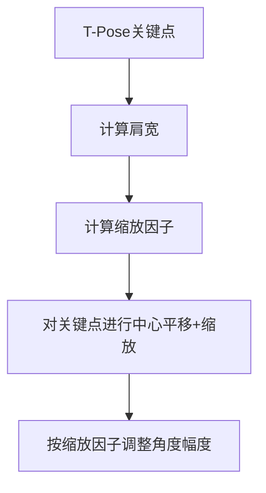
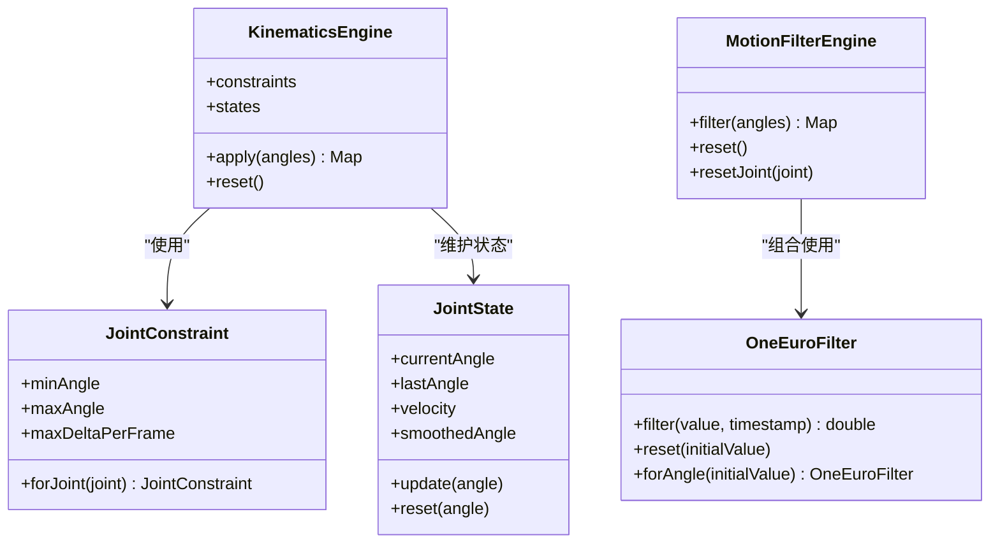
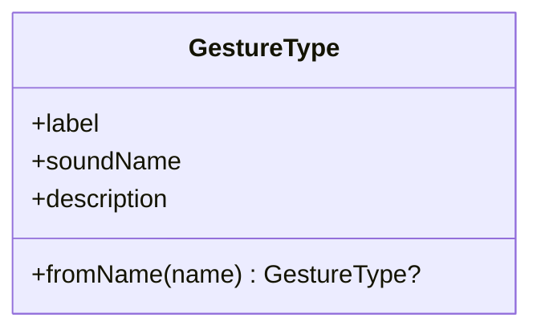
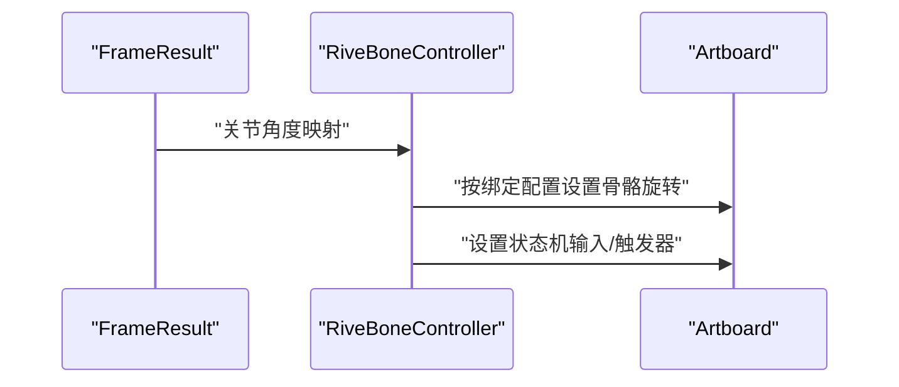
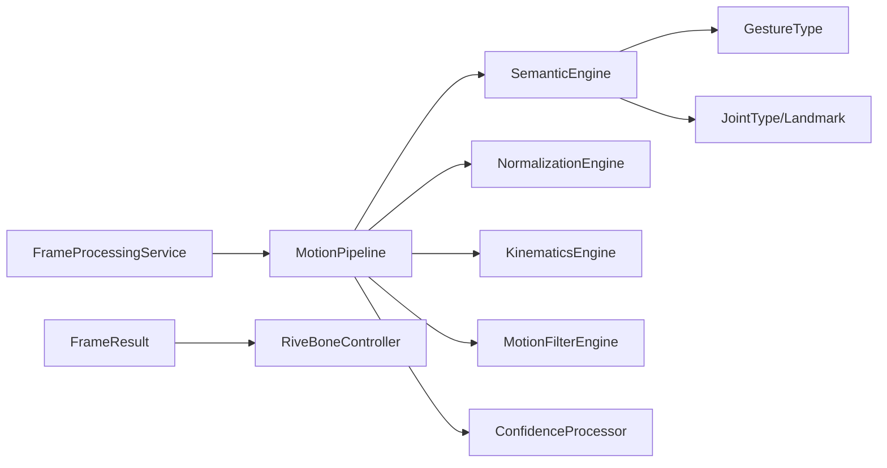

# 动作语义引擎

<cite>
**本文引用的文件**
- [semantic_engine.dart](file://lib/domain/engines/semantic/semantic_engine.dart)
- [gesture_type.dart](file://lib/domain/entities/gesture_type.dart)
- [motion_pipeline.dart](file://lib/application/pipeline/motion_pipeline.dart)
- [frame_processing_service.dart](file://lib/application/services/frame_processing_service.dart)
- [confidence_processor.dart](file://lib/domain/engines/confidence/confidence_processor.dart)
- [motion_filter_engine.dart](file://lib/domain/engines/filtering/motion_filter_engine.dart)
- [one_euro_filter.dart](file://lib/domain/engines/filtering/one_euro_filter.dart)
- [normalization_engine.dart](file://lib/domain/engines/normalization/normalization_engine.dart)
- [body_metrics.dart](file://lib/domain/entities/body_metrics.dart)
- [kinematics_engine.dart](file://lib/domain/engines/kinematics/kinematics_engine.dart)
- [joint_state.dart](file://lib/domain/engines/kinematics/joint_state.dart)
- [joint_constraint.dart](file://lib/domain/engines/kinematics/joint_constraint.dart)
- [rive_bone_controller.dart](file://lib/domain/services/rive_bone_controller.dart)
- [frame_result.dart](file://lib/domain/entities/frame_result.dart)
</cite>

## 目录
1. [简介](#简介)
2. [项目结构](#项目结构)
3. [核心组件](#核心组件)
4. [架构总览](#架构总览)
5. [详细组件分析](#详细组件分析)
6. [依赖关系分析](#依赖关系分析)
7. [性能考量](#性能考量)
8. [故障排查指南](#故障排查指南)
9. [结论](#结论)
10. [附录](#附录)

## 简介
本文件面向Mimo项目的行为语义引擎，系统性阐述动作识别与语义分析的实现原理与工程实践。内容涵盖：
- 如何从连续的姿态序列中识别特定动作或行为
- 语义引擎的规则与阈值设计、历史稳定性判断
- 置信度评估与融合策略
- 语义标签定义与动作模板匹配流程
- 与动画驱动系统的集成方式
- 训练数据需求与模型更新策略建议

## 项目结构
语义引擎位于领域层（domain），通过应用层流水线（MotionPipeline）与服务层（FrameProcessingService）协同工作，最终驱动Rive动画系统。

图表来源
- [motion_pipeline.dart:14-141](file://lib/application/pipeline/motion_pipeline.dart#L14-L141)
- [frame_processing_service.dart:29-216](file://lib/application/services/frame_processing_service.dart#L29-L216)
- [semantic_engine.dart:9-221](file://lib/domain/engines/semantic/semantic_engine.dart#L9-L221)
- [normalization_engine.dart:9-143](file://lib/domain/engines/normalization/normalization_engine.dart#L9-L143)
- [motion_filter_engine.dart:8-117](file://lib/domain/engines/filtering/motion_filter_engine.dart#L8-L117)
- [confidence_processor.dart:52-91](file://lib/domain/engines/confidence/confidence_processor.dart#L52-L91)
- [rive_bone_controller.dart:29-255](file://lib/domain/services/rive_bone_controller.dart#L29-L255)
- [frame_result.dart:7-66](file://lib/domain/entities/frame_result.dart#L7-L66)

章节来源
- [motion_pipeline.dart:14-141](file://lib/application/pipeline/motion_pipeline.dart#L14-L141)
- [frame_processing_service.dart:29-216](file://lib/application/services/frame_processing_service.dart#L29-L216)

## 核心组件
- 语义引擎（SemanticEngine）：基于规则与阈值，对连续帧进行手势检测与稳定性判断，输出语义标签。
- 归一化引擎（NormalizationEngine）：消除不同用户体型差异，统一动作幅度尺度。
- 运动学引擎（KinematicsEngine）：施加生物力学约束，限制关节角度范围与变化速率。
- 运动滤波引擎（MotionFilterEngine）：组合死区过滤、One Euro滤波与速度平滑，降低抖动。
- 置信度处理器（ConfidenceProcessor）：基于关键点可见度进行角度融合与idle判定。
- 帧结果（FrameResult）：封装每帧处理后的关节角度、手势标签与置信度。
- Rive骨骼控制器（RiveBoneController）：将关节角度映射到Rive骨骼，驱动动画。

章节来源
- [semantic_engine.dart:9-221](file://lib/domain/engines/semantic/semantic_engine.dart#L9-L221)
- [normalization_engine.dart:9-143](file://lib/domain/engines/normalization/normalization_engine.dart#L9-L143)
- [motion_filter_engine.dart:8-117](file://lib/domain/engines/filtering/motion_filter_engine.dart#L8-L117)
- [confidence_processor.dart:52-91](file://lib/domain/engines/confidence/confidence_processor.dart#L52-L91)
- [frame_result.dart:7-66](file://lib/domain/entities/frame_result.dart#L7-L66)
- [rive_bone_controller.dart:29-255](file://lib/domain/services/rive_bone_controller.dart#L29-L255)

## 架构总览
语义引擎在MotionPipeline中被调用，其上游依次完成归一化、角度计算、运动学约束、滤波与置信度融合；下游将手势标签与关节角度传递给动画驱动。

图表来源
- [motion_pipeline.dart:99-130](file://lib/application/pipeline/motion_pipeline.dart#L99-L130)
- [frame_processing_service.dart:170-216](file://lib/application/services/frame_processing_service.dart#L170-L216)
- [semantic_engine.dart:33-80](file://lib/domain/engines/semantic/semantic_engine.dart#L33-L80)
- [rive_bone_controller.dart:96-127](file://lib/domain/services/rive_bone_controller.dart#L96-L127)

## 详细组件分析

### 语义引擎（SemanticEngine）
- 设计目标：从连续姿态序列中识别固定模板动作，如举手、双手张开、挥手、拍手、双手高举，并输出稳定手势标签。
- 关键实现要点：
  - 历史记录与稳定性判断：对每个手势维护布尔历史，仅当连续N帧均为真时才判定稳定输出。
  - 置信度门槛：多数检测条件在关键点可见度低于阈值时直接返回不满足，避免误判。
  - 模板匹配：
    - 举手：手腕y坐标显著低于肩膀（考虑屏幕坐标系y轴向下），且可见度达标。
    - 双手张开：双腕间距超过肩宽的1.5倍，作为“双臂侧平举”近似。
    - 挥手：右手腕x坐标在历史窗口内出现足够峰值数，体现周期性摆动。
    - 拍手：双手距离小于阈值，体现“靠近”模板。
    - 双手高举：双手y均低于鼻子，体现“头顶上方”模板。
  - 周期检测细节：维护x坐标历史窗口，统计局部极值数量，达到阈值即判定为挥手。
  - 距离计算：使用欧氏距离衡量手腕间距与肩宽关系。

图表来源
- [semantic_engine.dart:33-205](file://lib/domain/engines/semantic/semantic_engine.dart#L33-L205)

章节来源
- [semantic_engine.dart:33-205](file://lib/domain/engines/semantic/semantic_engine.dart#L33-L205)

### 置信度评估与融合（ConfidenceProcessor）
- 平均置信度：对各关节可见度求平均，用于整体质量评估与idle判定。
- 角度融合：将跟踪角度与默认idle角度按可见度线性插值，提升遮挡场景鲁棒性。
- idle判断：当平均置信度低于阈值时，系统进入idle状态，避免错误驱动。

图表来源
- [confidence_processor.dart:52-91](file://lib/domain/engines/confidence/confidence_processor.dart#L52-L91)

章节来源
- [confidence_processor.dart:52-91](file://lib/domain/engines/confidence/confidence_processor.dart#L52-L91)

### 归一化与尺度适配（NormalizationEngine）
- 校准：基于T-Pose关键点估计肩宽、左右臂长，计算缩放因子。
- 归一化：以两肩中点为中心，按缩放因子对关键点坐标进行平移与缩放，消除身高差异。
- 角度归一化：根据缩放因子调整角度幅度，使小个子用户动作幅度放大、大个子用户动作幅度缩小。

图表来源
- [normalization_engine.dart:25-125](file://lib/domain/engines/normalization/normalization_engine.dart#L25-L125)

章节来源
- [normalization_engine.dart:25-125](file://lib/domain/engines/normalization/normalization_engine.dart#L25-L125)

### 运动学约束与滤波（KinematicsEngine + MotionFilterEngine）
- 运动学约束：对肩、肘等关节施加角度范围与单帧最大变化量限制，保证动作符合人体生物力学。
- 滤波策略：
  - 死区过滤：忽略微小变化，减少噪声影响。
  - One Euro滤波：自适应低通滤波，低延迟同时抑制抖动。
  - 速度平滑：对角速度历史做滑动平均，进一步平滑输出。

图表来源
- [kinematics_engine.dart:9-29](file://lib/domain/engines/kinematics/kinematics_engine.dart#L9-L29)
- [joint_constraint.dart:4-47](file://lib/domain/engines/kinematics/joint_constraint.dart#L4-L47)
- [joint_state.dart:6-63](file://lib/domain/engines/kinematics/joint_state.dart#L6-L63)
- [motion_filter_engine.dart:28-102](file://lib/domain/engines/filtering/motion_filter_engine.dart#L28-L102)
- [one_euro_filter.dart:38-92](file://lib/domain/engines/filtering/one_euro_filter.dart#L38-L92)

章节来源
- [kinematics_engine.dart:9-29](file://lib/domain/engines/kinematics/kinematics_engine.dart#L9-L29)
- [motion_filter_engine.dart:28-102](file://lib/domain/engines/filtering/motion_filter_engine.dart#L28-L102)
- [one_euro_filter.dart:38-92](file://lib/domain/engines/filtering/one_euro_filter.dart#L38-L92)

### 语义标签与动作模板（GestureType）
- 标签定义：包含none/idle/tPose/handRaise/armsOpen/wave/clap/handsUp等，每个标签附带中文名、音效名与触发描述。
- 与流水线集成：语义引擎输出GestureType，MotionPipeline将其写入FrameResult，供后续驱动与反馈使用。

图表来源
- [gesture_type.dart:4-81](file://lib/domain/entities/gesture_type.dart#L4-L81)

章节来源
- [gesture_type.dart:4-81](file://lib/domain/entities/gesture_type.dart#L4-L81)

### 动画驱动集成（RiveBoneController）
- 骨骼绑定：将关节名称映射到Rive骨骼，支持角度偏移、缩放与反转。
- 角度应用：将关节角度（度）转换为弧度后设置到骨骼旋转。
- 状态机控制：支持设置状态机输入与触发器，配合动画状态切换。

图表来源
- [rive_bone_controller.dart:96-127](file://lib/domain/services/rive_bone_controller.dart#L96-L127)
- [rive_bone_controller.dart:201-225](file://lib/domain/services/rive_bone_controller.dart#L201-L225)

章节来源
- [rive_bone_controller.dart:96-127](file://lib/domain/services/rive_bone_controller.dart#L96-L127)
- [rive_bone_controller.dart:201-225](file://lib/domain/services/rive_bone_controller.dart#L201-L225)

## 依赖关系分析
- 语义引擎依赖关键点实体与关节类型枚举，用于坐标与可见度判断。
- MotionPipeline串联归一化、角度计算、运动学、滤波与置信度处理，最后调用语义引擎。
- FrameProcessingService在追踪阶段完成上述管线，并将结果交给Rive驱动。
- 置信度处理器与归一化引擎共同提升鲁棒性，One Euro滤波与运动学约束降低抖动与非自然动作。

图表来源
- [semantic_engine.dart:2-4](file://lib/domain/engines/semantic/semantic_engine.dart#L2-L4)
- [motion_pipeline.dart:17-51](file://lib/application/pipeline/motion_pipeline.dart#L17-L51)
- [frame_processing_service.dart:32-44](file://lib/application/services/frame_processing_service.dart#L32-L44)
- [frame_result.dart:8-18](file://lib/domain/entities/frame_result.dart#L8-L18)
- [rive_bone_controller.dart:29-155](file://lib/domain/services/rive_bone_controller.dart#L29-L155)

章节来源
- [motion_pipeline.dart:17-51](file://lib/application/pipeline/motion_pipeline.dart#L17-L51)
- [frame_processing_service.dart:32-44](file://lib/application/services/frame_processing_service.dart#L32-L44)

## 性能考量
- 流水线阶段划分清晰，便于并行与异步优化。
- One Euro滤波与速度平滑在保证实时性的前提下显著降低抖动。
- 置信度融合与idle判定有助于在遮挡或丢失情况下维持系统稳定性。
- 建议：
  - 在移动端优先使用轻量化滤波参数，平衡延迟与平滑度。
  - 将历史窗口与阈值参数化，支持运行时调整。
  - 对关键路径（滤波、融合）进行性能监控与调度。

## 故障排查指南
- 误检/漏检：
  - 检查关键点可见度阈值与手势阈值是否合理。
  - 调整稳定性帧数与周期峰值阈值。
- 抖动明显：
  - 增大死区阈值或提高速度平滑系数。
  - 检查One Euro滤波初始参数与截止频率。
- 驱动异常：
  - 确认关节到骨骼的绑定配置正确，角度偏移与缩放合理。
  - 检查状态机输入类型与名称是否匹配。
- idle误判：
  - 调整平均置信度阈值与连续帧数，避免遮挡导致的误判。

章节来源
- [semantic_engine.dart:16-23](file://lib/domain/engines/semantic/semantic_engine.dart#L16-L23)
- [motion_filter_engine.dart:18-21](file://lib/domain/engines/filtering/motion_filter_engine.dart#L18-L21)
- [confidence_processor.dart:87-91](file://lib/domain/engines/confidence/confidence_processor.dart#L87-L91)
- [rive_bone_controller.dart:92-127](file://lib/domain/services/rive_bone_controller.dart#L92-L127)

## 结论
Mimo的语义引擎采用“规则+阈值+历史稳定性”的设计，在保证实时性的同时具备良好的鲁棒性。通过归一化、运动学约束、滤波与置信度融合，系统能够稳定地从连续姿态序列中识别出举手、挥手、拍手、双手张开与双手高举等动作，并与Rive动画系统无缝集成，实现流畅的交互反馈。

## 附录

### 语义标签定义与触发条件
- none/idle/tPose：系统状态与校准姿势
- handRaise：手腕高于肩膀（可见度达标）
- armsOpen：双腕间距 > 肩宽×1.5
- wave：右手腕x坐标历史中出现足够峰值
- clap：双手距离 < 阈值
- handsUp：双手均高于鼻子

章节来源
- [gesture_type.dart:4-81](file://lib/domain/entities/gesture_type.dart#L4-L81)

### 代码示例路径（展示语义分析实现流程）
- 语义检测主流程：[semantic_engine.dart:33-80](file://lib/domain/engines/semantic/semantic_engine.dart#L33-L80)
- 挥手周期检测：[semantic_engine.dart:125-153](file://lib/domain/engines/semantic/semantic_engine.dart#L125-L153)
- 拍手距离阈值：[semantic_engine.dart:158-171](file://lib/domain/engines/semantic/semantic_engine.dart#L158-L171)
- 双手高举条件：[semantic_engine.dart:176-188](file://lib/domain/engines/semantic/semantic_engine.dart#L176-L188)
- 举手稳定性判断：[semantic_engine.dart:199-205](file://lib/domain/engines/semantic/semantic_engine.dart#L199-L205)
- 归一化与角度归一化：[normalization_engine.dart:77-125](file://lib/domain/engines/normalization/normalization_engine.dart#L77-L125)
- 置信度融合与idle判定：[confidence_processor.dart:52-91](file://lib/domain/engines/confidence/confidence_processor.dart#L52-L91)
- 运动学约束与滤波：[kinematics_engine.dart:16-29](file://lib/domain/engines/kinematics/kinematics_engine.dart#L16-L29), [motion_filter_engine.dart:28-102](file://lib/domain/engines/filtering/motion_filter_engine.dart#L28-L102)
- 动画驱动：[rive_bone_controller.dart:96-127](file://lib/domain/services/rive_bone_controller.dart#L96-L127)