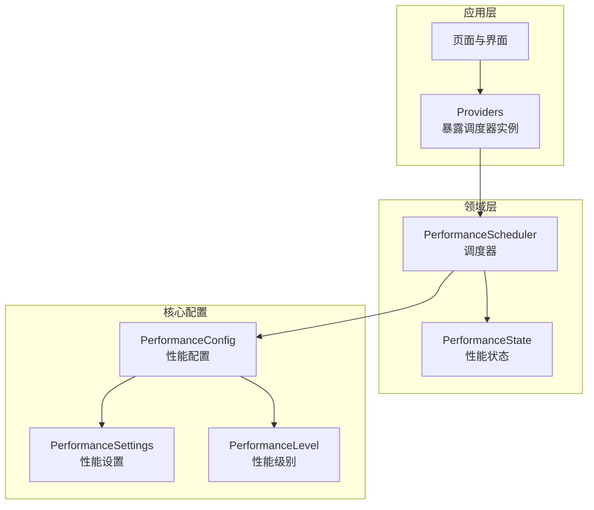
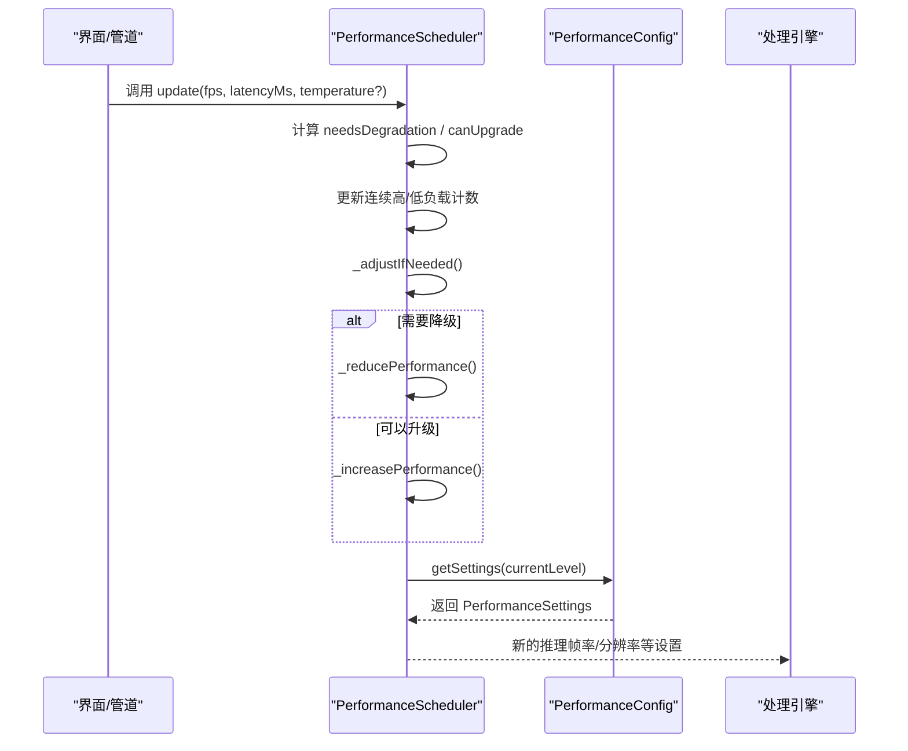
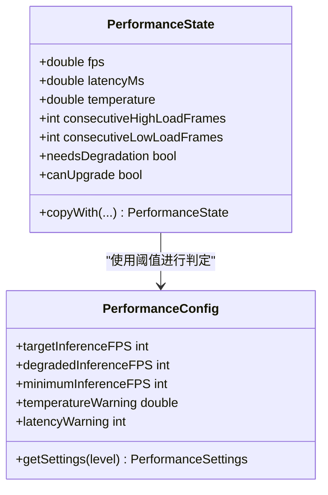
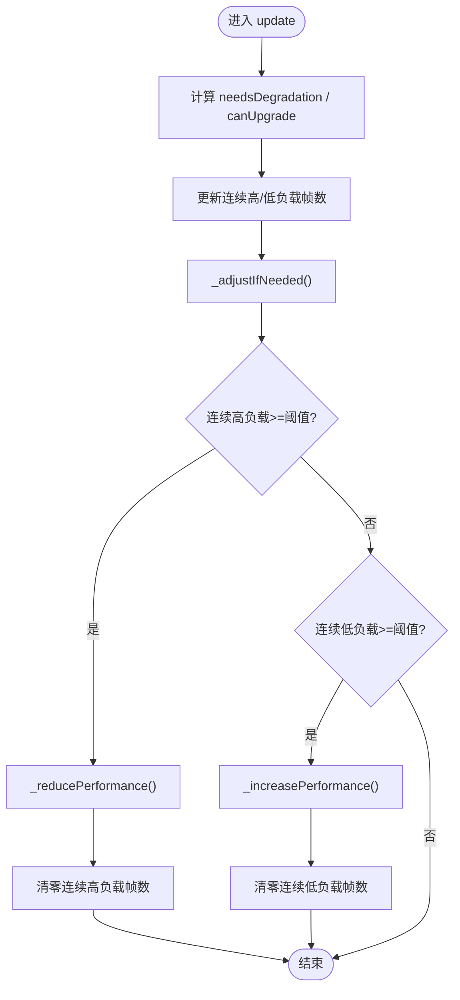
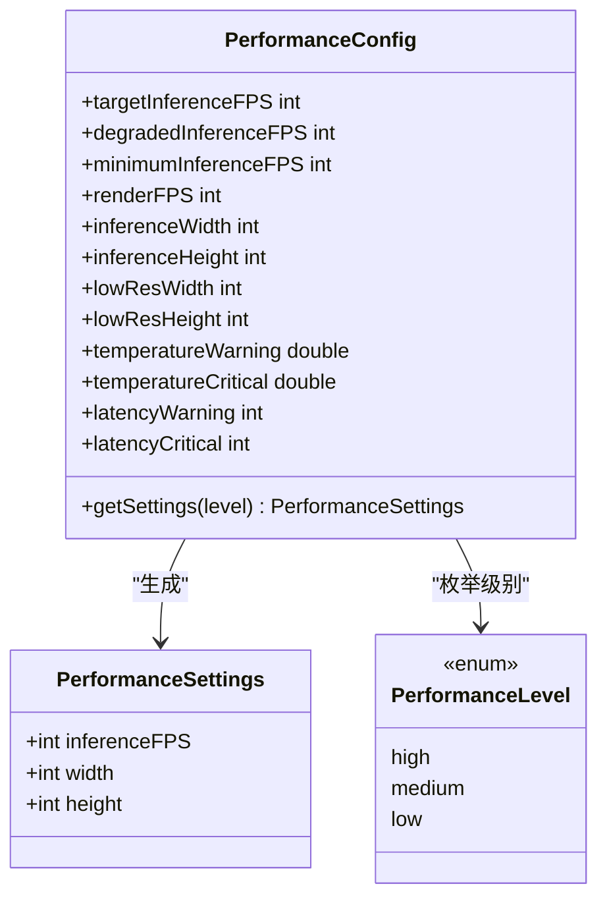
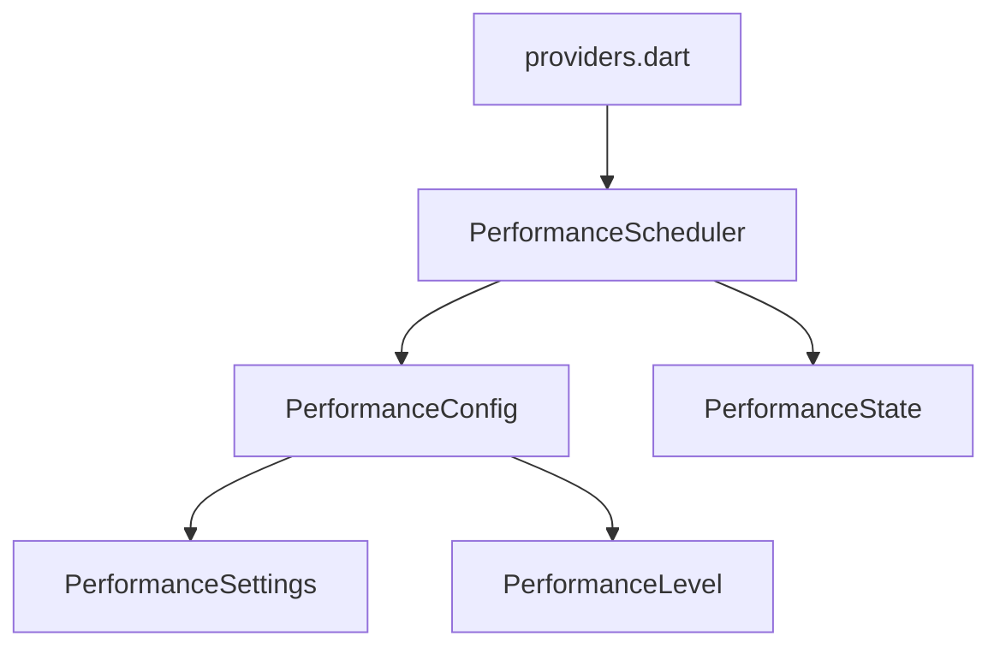

# 性能调度器

<cite>
**本文引用的文件**
- [performance_scheduler.dart](file://lib/domain/engines/performance/performance_scheduler.dart)
- [performance_config.dart](file://lib/core/config/performance_config.dart)
- [providers.dart](file://lib/application/providers/providers.dart)
- [app_constants.dart](file://lib/core/constants/app_constants.dart)
- [main.dart](file://lib/main.dart)
</cite>

## 目录
1. [简介](#简介)
2. [项目结构](#项目结构)
3. [核心组件](#核心组件)
4. [架构总览](#架构总览)
5. [详细组件分析](#详细组件分析)
6. [依赖关系分析](#依赖关系分析)
7. [性能考量](#性能考量)
8. [故障排查指南](#故障排查指南)
9. [结论](#结论)
10. [附录](#附录)

## 简介
本技术文档围绕 Mimo 项目的性能调度器展开，系统性阐述其性能监控与自适应调节机制、基于设备性能的动态处理策略、性能指标采集与分析算法、质量与资源消耗的平衡策略、阈值设定与动态调整策略，以及调度器与各处理引擎的协调机制与多设备适配策略。文档以代码为依据，结合可视化图示帮助读者快速理解与落地实践。

## 项目结构
性能调度器位于领域层的引擎模块中，通过应用层的 Riverpod Provider 对外暴露，供上层业务使用；性能配置集中于核心配置模块，统一定义目标帧率、分辨率、温度与延迟阈值等关键参数。

**图表来源**
- [providers.dart:57-60](file://lib/application/providers/providers.dart#L57-L60)
- [performance_scheduler.dart:63-88](file://lib/domain/engines/performance/performance_scheduler.dart#L63-L88)
- [performance_config.dart:36-58](file://lib/core/config/performance_config.dart#L36-L58)

**章节来源**
- [main.dart:1-34](file://lib/main.dart#L1-L34)
- [providers.dart:1-70](file://lib/application/providers/providers.dart#L1-L70)
- [performance_scheduler.dart:1-194](file://lib/domain/engines/performance/performance_scheduler.dart#L1-L194)
- [performance_config.dart:1-79](file://lib/core/config/performance_config.dart#L1-L79)

## 核心组件
- 性能状态（PerformanceState）：封装当前 FPS、延迟（ms）、设备温度、连续高/低负载帧数等指标，并提供“是否需要降级”“是否可升级”的判定逻辑。
- 性能调度器（PerformanceScheduler）：维护当前性能级别与设置，接收实时性能指标，更新状态并触发降级或升级策略。
- 性能配置（PerformanceConfig）：集中定义目标/降级/最低推理帧率、渲染帧率、推理分辨率、温度与延迟阈值，以及按级别返回对应的性能设置。
- 性能设置（PerformanceSettings）：包含推理帧率、宽度、高度等具体运行参数。
- 性能级别（PerformanceLevel）：高/中/低三级。

这些组件共同构成“采集—评估—决策—执行”的闭环，确保在不同设备与负载条件下维持稳定体验。

**章节来源**
- [performance_scheduler.dart:3-58](file://lib/domain/engines/performance/performance_scheduler.dart#L3-L58)
- [performance_scheduler.dart:63-194](file://lib/domain/engines/performance/performance_scheduler.dart#L63-L194)
- [performance_config.dart:2-58](file://lib/core/config/performance_config.dart#L2-L58)

## 架构总览
调度器通过 Riverpod Provider 在应用层注册，UI 或管道层在每帧或周期性地向调度器上报性能指标，调度器据此判断是否需要调整性能级别，并将新的设置下发给各处理引擎。

**图表来源**
- [performance_scheduler.dart:96-129](file://lib/domain/engines/performance/performance_scheduler.dart#L96-L129)
- [performance_scheduler.dart:131-180](file://lib/domain/engines/performance/performance_scheduler.dart#L131-L180)
- [performance_config.dart:36-58](file://lib/core/config/performance_config.dart#L36-L58)

## 详细组件分析

### 组件A：性能状态（PerformanceState）
- 关键字段：当前 FPS、延迟（ms）、设备温度、连续高/低负载帧数。
- 判定逻辑：
  - 需要降级：温度超过告警阈值、延迟超过告警阈值、FPS 低于降级阈值。
  - 可以升级：温度低于告警阈值-Δ、延迟低于告警阈值-Δ、FPS 高于目标阈值-Δ。
- 复制与修改：提供 copyWith，便于无副作用地更新状态。

**图表来源**
- [performance_scheduler.dart:3-58](file://lib/domain/engines/performance/performance_scheduler.dart#L3-L58)
- [performance_config.dart:5-31](file://lib/core/config/performance_config.dart#L5-L31)

**章节来源**
- [performance_scheduler.dart:3-58](file://lib/domain/engines/performance/performance_scheduler.dart#L3-L58)
- [performance_config.dart:5-31](file://lib/core/config/performance_config.dart#L5-L31)

### 组件B：性能调度器（PerformanceScheduler）
- 状态与级别：
  - 当前性能级别（高/中/低）与对应设置。
  - 当前性能状态（由外部输入）。
- 更新流程：
  - 接收 fps、latencyMs、temperature，计算 needsDegradation 与 canUpgrade。
  - 基于连续高/低负载帧数递增或清零。
  - 若达到阈值则触发降级或升级。
- 级别切换：
  - 降级：高→中→低，逐级降级。
  - 升级：低→中→高，逐级升级。
- 外部接口：
  - update：上报性能指标并触发调整。
  - setLevel：强制设置级别。
  - reset：恢复默认级别与状态。

**图表来源**
- [performance_scheduler.dart:96-146](file://lib/domain/engines/performance/performance_scheduler.dart#L96-L146)

**章节来源**
- [performance_scheduler.dart:63-194](file://lib/domain/engines/performance/performance_scheduler.dart#L63-L194)

### 组件C：性能配置（PerformanceConfig）与设置（PerformanceSettings）
- 目标与降级阈值：目标推理帧率、降级帧率、最低帧率。
- 渲染帧率：固定 60FPS，采用插值保证视觉流畅。
- 分辨率策略：高分辨率（默认）→中分辨率（降级）→低分辨率（最低）。
- 温度与延迟阈值：分别定义告警与严重阈值。
- 级别到设置映射：按级别返回对应的 PerformanceSettings，包含推理帧率与分辨率。

**图表来源**
- [performance_config.dart:2-58](file://lib/core/config/performance_config.dart#L2-L58)

**章节来源**
- [performance_config.dart:2-58](file://lib/core/config/performance_config.dart#L2-L58)

### 组件D：应用层集成（Riverpod Provider）
- 在应用层通过 Provider 将 PerformanceScheduler 注册为单例，供页面与管道使用。
- UI 层可通过 ProviderScope 访问调度器实例，调用 update 上报性能指标。

**图表来源**
- [main.dart:7-9](file://lib/main.dart#L7-L9)
- [providers.dart:57-60](file://lib/application/providers/providers.dart#L57-L60)

**章节来源**
- [main.dart:1-34](file://lib/main.dart#L1-L34)
- [providers.dart:57-60](file://lib/application/providers/providers.dart#L57-L60)

## 依赖关系分析
- 耦合与内聚：
  - PerformanceScheduler 与 PerformanceConfig 强耦合，但职责清晰：前者负责状态与决策，后者负责参数与策略。
  - 通过 PerformanceSettings 解耦了“策略参数”与“执行参数”，便于扩展。
- 外部依赖：
  - 应用层通过 Riverpod Provider 注入调度器，避免直接依赖具体实现。
- 潜在循环依赖：
  - 未发现循环导入；调度器仅依赖配置模块，不反向依赖应用层。

**图表来源**
- [performance_scheduler.dart:1-194](file://lib/domain/engines/performance/performance_scheduler.dart#L1-L194)
- [performance_config.dart:1-79](file://lib/core/config/performance_config.dart#L1-L79)
- [providers.dart:57-60](file://lib/application/providers/providers.dart#L57-L60)

**章节来源**
- [performance_scheduler.dart:1-194](file://lib/domain/engines/performance/performance_scheduler.dart#L1-L194)
- [performance_config.dart:1-79](file://lib/core/config/performance_config.dart#L1-L79)
- [providers.dart:1-70](file://lib/application/providers/providers.dart#L1-L70)

## 性能考量
- 指标采集频率：建议以固定时间窗口（如每 1 秒）统计一次 FPS、延迟与温度，避免过高的采集开销。
- 抖动抑制：阈值比较时引入滞回（hysteresis），例如升级阈值比降级阈值更严格，减少频繁切换。
- 资源消耗平衡：
  - 降级优先降低推理帧率与分辨率，其次再考虑关闭非关键功能。
  - 升级时优先恢复推理帧率，再逐步提升分辨率。
- 渲染与推理解耦：渲染固定 60FPS，推理帧率可独立调节，避免相互干扰。

[本节为通用指导，无需特定文件引用]

## 故障排查指南
- 现象：频繁降级/升级
  - 可能原因：阈值设置过于敏感或滞回不足。
  - 排查步骤：检查温度/延迟阈值与滞回差值；确认 update 调用频率与数据稳定性。
- 现象：无法升级
  - 可能原因：温度持续偏高或延迟长期高于阈值。
  - 排查步骤：查看设备散热情况；确认是否存在后台任务占用 CPU/GPU。
- 现象：分辨率未变化
  - 可能原因：处理引擎未读取新设置或设置下发失败。
  - 排查步骤：确认调度器 settings 是否已更新；检查引擎对 PerformanceSettings 的消费路径。

**章节来源**
- [performance_scheduler.dart:28-40](file://lib/domain/engines/performance/performance_scheduler.dart#L28-L40)
- [performance_config.dart:25-31](file://lib/core/config/performance_config.dart#L25-L31)

## 结论
Mimo 的性能调度器通过“状态评估—阈值判定—连续帧计数—级别切换”的闭环机制，实现了对设备性能的自适应调节。配合集中化的性能配置与清晰的 Provider 集成，调度器能够在不同设备与场景下平衡处理质量与资源消耗，保障稳定体验。后续可在滞回策略、指标平滑与引擎联动方面进一步优化。

[本节为总结，无需特定文件引用]

## 附录

### A. 性能阈值与动态调整策略
- 目标与降级阈值：目标推理帧率、降级帧率、最低帧率。
- 温度与延迟阈值：告警与严重阈值，用于触发降级。
- 动态调整策略：
  - 连续高负载帧数达到阈值后降级；
  - 连续低负载帧数达到阈值后升级；
  - 升级/降级均需满足滞回条件，避免抖动。

**章节来源**
- [performance_config.dart:5-31](file://lib/core/config/performance_config.dart#L5-L31)
- [performance_scheduler.dart:73-77](file://lib/domain/engines/performance/performance_scheduler.dart#L73-L77)
- [performance_scheduler.dart:131-146](file://lib/domain/engines/performance/performance_scheduler.dart#L131-L146)

### B. 与处理引擎的协调机制
- 调度器输出 PerformanceSettings，处理引擎应读取并应用新的推理帧率与分辨率。
- 建议在引擎初始化与级别切换时刷新内部参数，避免跨级别参数混用。

**章节来源**
- [performance_config.dart:36-58](file://lib/core/config/performance_config.dart#L36-L58)
- [performance_scheduler.dart:148-180](file://lib/domain/engines/performance/performance_scheduler.dart#L148-L180)

### C. 不同设备上的适配策略
- 高端设备：默认高/中性能级别，保持较高推理帧率与分辨率。
- 中端设备：根据温度与延迟表现自动降级至中/低级别，保证稳定性。
- 低端设备：降至最低级别，优先保证帧率不低于最低阈值。

**章节来源**
- [performance_config.dart:36-58](file://lib/core/config/performance_config.dart#L36-L58)
- [app_constants.dart:11-35](file://lib/core/constants/app_constants.dart#L11-L35)