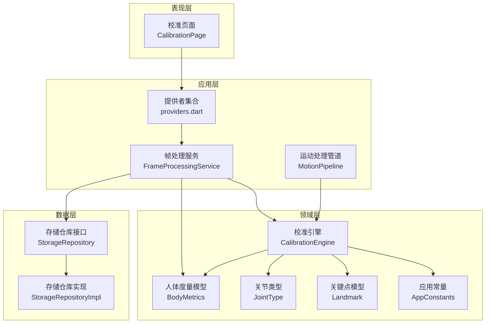
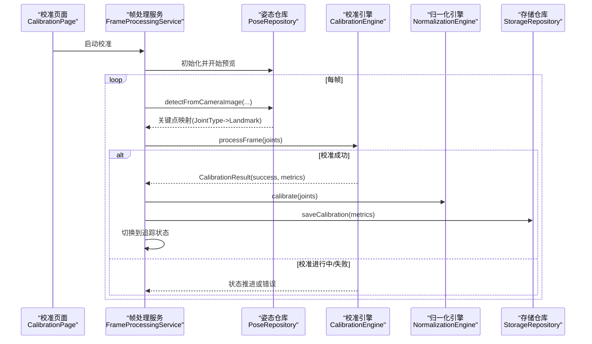
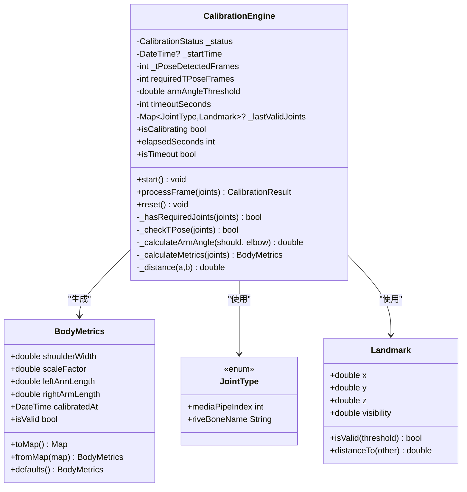
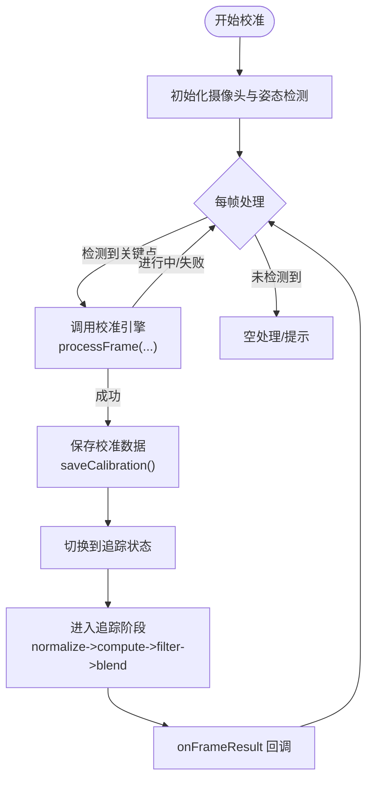
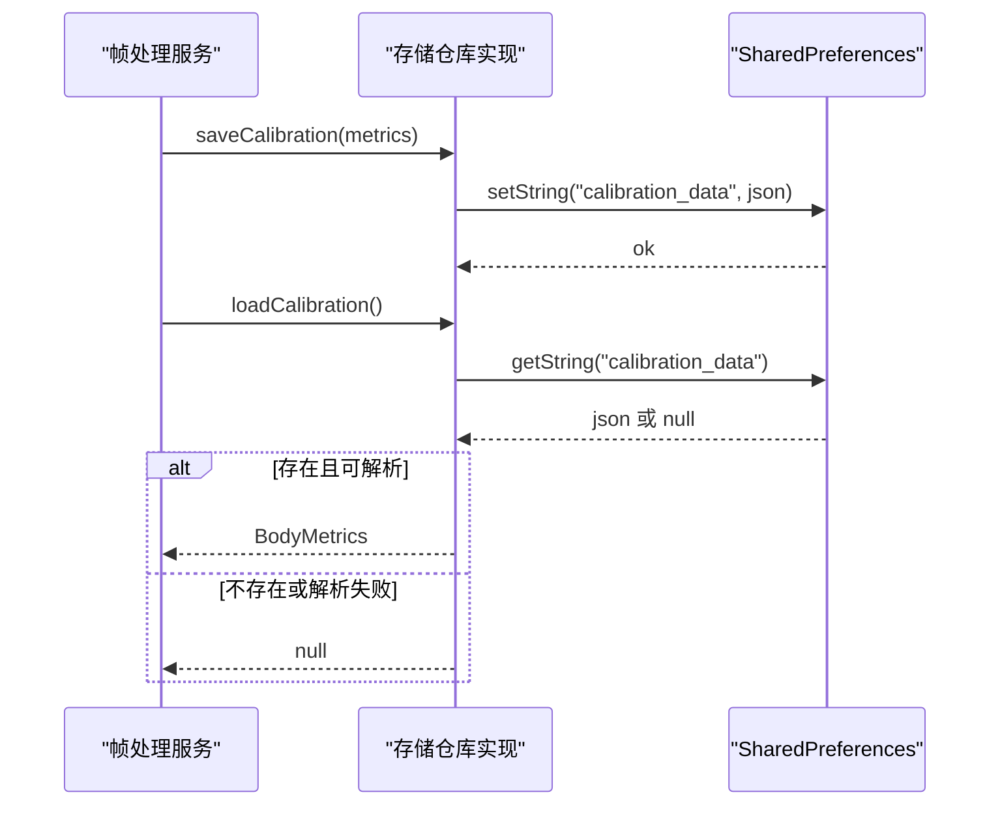
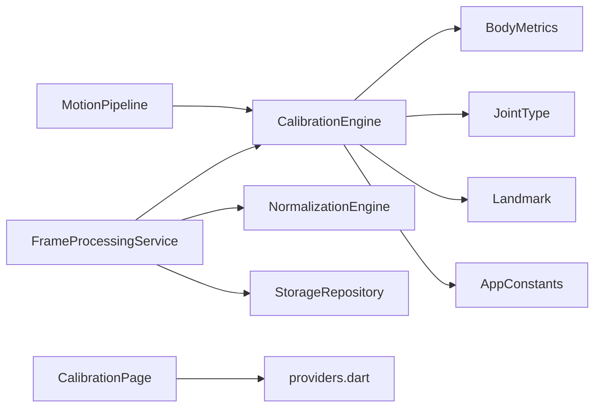

# 校准引擎

<cite>
**本文引用的文件**
- [lib/domain/engines/calibration/calibration_engine.dart](file://lib/domain/engines/calibration/calibration_engine.dart)
- [lib/domain/entities/body_metrics.dart](file://lib/domain/entities/body_metrics.dart)
- [lib/domain/entities/joint_type.dart](file://lib/domain/entities/joint_type.dart)
- [lib/domain/entities/landmark.dart](file://lib/domain/entities/landmark.dart)
- [lib/core/constants/app_constants.dart](file://lib/core/constants/app_constants.dart)
- [lib/application/providers/providers.dart](file://lib/application/providers/providers.dart)
- [lib/application/services/frame_processing_service.dart](file://lib/application/services/frame_processing_service.dart)
- [lib/application/pipeline/motion_pipeline.dart](file://lib/application/pipeline/motion_pipeline.dart)
- [lib/presentation/pages/calibration_page.dart](file://lib/presentation/pages/calibration_page.dart)
- [lib/domain/repositories/storage_repository.dart](file://lib/domain/repositories/storage_repository.dart)
- [lib/data/repositories_impl/storage_repository_impl.dart](file://lib/data/repositories_impl/storage_repository_impl.dart)
</cite>

## 目录
1. [简介](#简介)
2. [项目结构](#项目结构)
3. [核心组件](#核心组件)
4. [架构总览](#架构总览)
5. [详细组件分析](#详细组件分析)
6. [依赖关系分析](#依赖关系分析)
7. [性能考量](#性能考量)
8. [故障排查指南](#故障排查指南)
9. [结论](#结论)
10. [附录](#附录)

## 简介
本技术文档围绕 Mimo 项目的“校准引擎”展开，系统性阐述其设计原理、算法实现、人体度量采集方法、参数计算流程、对用户差异与姿态变化的处理策略、校准数据的存储与加载机制、精度评估与验证方法、状态管理与缓存策略，以及与用户设置系统的集成方式。文档同时提供面向开发者的代码级图示与路径引用，帮助快速定位实现细节。

## 项目结构
校准引擎位于领域层（domain），通过应用层的服务与提供者连接 UI 层与数据层，形成清晰的分层架构。关键模块包括：
- 领域层：校准引擎、人体度量模型、关键点与关节类型、应用常量
- 应用层：帧处理服务、运动处理管道、Riverpod 提供者
- 数据层：存储仓库接口与实现（SharedPreferences）
- 表现层：校准页面 UI 与状态展示

图表来源
- [lib/presentation/pages/calibration_page.dart:1-286](file://lib/presentation/pages/calibration_page.dart#L1-L286)
- [lib/application/services/frame_processing_service.dart:1-254](file://lib/application/services/frame_processing_service.dart#L1-L254)
- [lib/application/pipeline/motion_pipeline.dart:1-141](file://lib/application/pipeline/motion_pipeline.dart#L1-L141)
- [lib/application/providers/providers.dart:1-109](file://lib/application/providers/providers.dart#L1-L109)
- [lib/domain/engines/calibration/calibration_engine.dart:1-302](file://lib/domain/engines/calibration/calibration_engine.dart#L1-L302)
- [lib/domain/entities/body_metrics.dart:1-109](file://lib/domain/entities/body_metrics.dart#L1-L109)
- [lib/domain/entities/joint_type.dart:1-66](file://lib/domain/entities/joint_type.dart#L1-L66)
- [lib/domain/entities/landmark.dart:1-87](file://lib/domain/entities/landmark.dart#L1-L87)
- [lib/core/constants/app_constants.dart:1-35](file://lib/core/constants/app_constants.dart#L1-L35)
- [lib/domain/repositories/storage_repository.dart:1-19](file://lib/domain/repositories/storage_repository.dart#L1-L19)
- [lib/data/repositories_impl/storage_repository_impl.dart:1-39](file://lib/data/repositories_impl/storage_repository_impl.dart#L1-L39)

章节来源
- [lib/application/providers/providers.dart:67-89](file://lib/application/providers/providers.dart#L67-L89)
- [lib/application/services/frame_processing_service.dart:70-88](file://lib/application/services/frame_processing_service.dart#L70-L88)

## 核心组件
- 校准引擎（CalibrationEngine）：负责 T-Pose 检测、状态机推进、超时控制、人体度量计算与结果封装。
- 人体度量模型（BodyMetrics）：承载肩宽、缩放因子、左右臂长与校准时间戳，并提供默认值、序列化/反序列化与有效性判断。
- 关键点与关节类型（Landmark、JointType）：定义 MediaPipe 关键点与 Rive 骨骼映射，支撑姿态检测与驱动。
- 应用常量（AppConstants）：校准超时、持帧数、角度阈值等可配置参数。
- 帧处理服务（FrameProcessingService）：串联摄像头、姿态检测、校准引擎与后续处理管线；负责状态切换与数据持久化。
- 存储仓库（StorageRepository/StorageRepositoryImpl）：基于 SharedPreferences 的校准数据与用户设置读写。

章节来源
- [lib/domain/engines/calibration/calibration_engine.dart:59-302](file://lib/domain/engines/calibration/calibration_engine.dart#L59-L302)
- [lib/domain/entities/body_metrics.dart:1-109](file://lib/domain/entities/body_metrics.dart#L1-L109)
- [lib/domain/entities/joint_type.dart:1-66](file://lib/domain/entities/joint_type.dart#L1-L66)
- [lib/domain/entities/landmark.dart:1-87](file://lib/domain/entities/landmark.dart#L1-L87)
- [lib/core/constants/app_constants.dart:16-19](file://lib/core/constants/app_constants.dart#L16-L19)
- [lib/application/services/frame_processing_service.dart:150-167](file://lib/application/services/frame_processing_service.dart#L150-L167)
- [lib/domain/repositories/storage_repository.dart:1-19](file://lib/domain/repositories/storage_repository.dart#L1-L19)
- [lib/data/repositories_impl/storage_repository_impl.dart:1-39](file://lib/data/repositories_impl/storage_repository_impl.dart#L1-L39)

## 架构总览
下图展示了从摄像头图像到校准完成并进入追踪阶段的端到端流程，以及与存储层的交互。

图表来源
- [lib/application/services/frame_processing_service.dart:108-167](file://lib/application/services/frame_processing_service.dart#L108-L167)
- [lib/domain/engines/calibration/calibration_engine.dart:114-176](file://lib/domain/engines/calibration/calibration_engine.dart#L114-L176)
- [lib/application/providers/providers.dart:67-84](file://lib/application/providers/providers.dart#L67-L84)

## 详细组件分析

### 校准引擎（CalibrationEngine）
- 设计原则
  - 基于 T-Pose 的静态校准：要求用户双臂侧平举，确保肩宽与臂长测量稳定。
  - 状态机驱动：waiting → inProgress → verifying → success/failed，配合超时与提示反馈。
  - 参数可配置：持帧数、角度阈值、超时时间来自应用常量。
- 关键算法
  - T-Pose 检测：计算左右臂角度与肘部伸直约束，使用阈值判定是否水平。
  - 人体度量计算：肩宽=两肩关键点距离；缩放因子=肩宽/标准肩宽；左右臂长=肩到肘+肘到腕的累计距离（若可见）。
  - 结果封装：返回 CalibrationResult，包含状态、度量与耗时。
- 容错与鲁棒性
  - 必需关键点检查：至少包含左右肩、左右肘。
  - 可见度阈值：关键点可见度低于阈值则视为无效。
  - 超时保护：超过设定秒数自动失败。
  - 角度阈值：避免手臂微小偏移导致误判。
- 与 UI 的协作
  - 通过状态 Provider 推送当前状态，驱动 UI 提示与按钮行为。

图表来源
- [lib/domain/engines/calibration/calibration_engine.dart:59-302](file://lib/domain/engines/calibration/calibration_engine.dart#L59-L302)
- [lib/domain/entities/body_metrics.dart:1-109](file://lib/domain/entities/body_metrics.dart#L1-L109)
- [lib/domain/entities/joint_type.dart:1-66](file://lib/domain/entities/joint_type.dart#L1-L66)
- [lib/domain/entities/landmark.dart:1-87](file://lib/domain/entities/landmark.dart#L1-L87)

章节来源
- [lib/domain/engines/calibration/calibration_engine.dart:106-176](file://lib/domain/engines/calibration/calibration_engine.dart#L106-L176)
- [lib/domain/engines/calibration/calibration_engine.dart:197-238](file://lib/domain/engines/calibration/calibration_engine.dart#L197-L238)
- [lib/domain/engines/calibration/calibration_engine.dart:245-286](file://lib/domain/engines/calibration/calibration_engine.dart#L245-L286)

### 人体度量模型（BodyMetrics）
- 字段含义
  - 肩宽：归一化坐标系中的肩宽。
  - 缩放因子：实际肩宽与标准肩宽之比，用于将用户动作幅度归一化。
  - 左/右臂长：肩到肘再到腕的累计距离（若可见）。
  - 校准时间戳：记录本次校准时间。
- 默认值与有效性
  - defaults() 提供合理初始值，便于首次启动或无校准数据时使用。
  - isValid 用于判断度量是否有效。
- 序列化
  - toMap()/fromMap() 支持 JSON 序列化，便于持久化与跨会话复用。

章节来源
- [lib/domain/entities/body_metrics.dart:20-87](file://lib/domain/entities/body_metrics.dart#L20-L87)

### 关键点与关节类型（Landmark、JointType）
- Landmark：包含归一化坐标与可见度，提供距离计算与有效性判断。
- JointType：定义上肢关键点映射，便于与姿态检测输出对齐与驱动 Rive 骨骼。

章节来源
- [lib/domain/entities/landmark.dart:1-87](file://lib/domain/entities/landmark.dart#L1-L87)
- [lib/domain/entities/joint_type.dart:1-66](file://lib/domain/entities/joint_type.dart#L1-L66)

### 应用常量（AppConstants）
- 校准相关：超时秒数、持帧数、角度阈值。
- 其他性能与安全常量：目标帧率、最小帧率、最大延迟、置信度阈值等。

章节来源
- [lib/core/constants/app_constants.dart:16-28](file://lib/core/constants/app_constants.dart#L16-L28)

### 帧处理服务（FrameProcessingService）
- 职责
  - 连接摄像头与姿态检测，按帧推送关键点给校准引擎。
  - 在校准成功后调用归一化引擎并保存 BodyMetrics。
  - 将追踪阶段的处理结果通过回调通知 UI。
- 状态机
  - idle → calibrating → tracking/paused，依据摄像头与检测状态切换。
- 回调与性能
  - onFrameResult 回调用于 UI 更新。
  - 内置 FPS 统计，通过 Provider 暴露当前帧率。

图表来源
- [lib/application/services/frame_processing_service.dart:108-216](file://lib/application/services/frame_processing_service.dart#L108-L216)

章节来源
- [lib/application/services/frame_processing_service.dart:70-88](file://lib/application/services/frame_processing_service.dart#L70-L88)
- [lib/application/services/frame_processing_service.dart:150-167](file://lib/application/services/frame_processing_service.dart#L150-L167)
- [lib/application/services/frame_processing_service.dart:169-216](file://lib/application/services/frame_processing_service.dart#L169-L216)

### 存储与加载（StorageRepository/StorageRepositoryImpl）
- 接口职责
  - saveCalibration/loadCalibration/clearCalibration：校准数据的持久化与清理。
  - saveSetting/loadSetting：用户设置的读写。
- 实现策略
  - 使用 SharedPreferences，以 JSON 字符串存储 BodyMetrics。
  - 加载失败时返回空值，保证健壮性。

图表来源
- [lib/data/repositories_impl/storage_repository_impl.dart:11-32](file://lib/data/repositories_impl/storage_repository_impl.dart#L11-L32)
- [lib/domain/repositories/storage_repository.dart:5-9](file://lib/domain/repositories/storage_repository.dart#L5-L9)

章节来源
- [lib/domain/repositories/storage_repository.dart:1-19](file://lib/domain/repositories/storage_repository.dart#L1-L19)
- [lib/data/repositories_impl/storage_repository_impl.dart:1-39](file://lib/data/repositories_impl/storage_repository_impl.dart#L1-L39)

### UI 集成与状态管理
- 校准页面（CalibrationPage）
  - 通过 Provider 订阅校准状态与 FPS，动态更新 UI 提示与底部指引。
  - 成功后提供“开始互动”按钮，失败后提供“重新校准”按钮。
- 状态 Provider
  - calibrationStatusProvider：驱动 UI 状态与提示。
  - bodyMetricsProvider：保存校准成功的 BodyMetrics，供后续流程使用。

章节来源
- [lib/presentation/pages/calibration_page.dart:54-112](file://lib/presentation/pages/calibration_page.dart#L54-L112)
- [lib/presentation/pages/calibration_page.dart:184-279](file://lib/presentation/pages/calibration_page.dart#L184-L279)
- [lib/application/providers/providers.dart:86-94](file://lib/application/providers/providers.dart#L86-L94)

## 依赖关系分析
- 组件耦合
  - FrameProcessingService 依赖多个引擎与仓库，承担编排职责；与 UI 通过 Provider 解耦。
  - CalibrationEngine 仅依赖关键点模型与常量，内聚性高、可测试性强。
- 外部依赖
  - 摄像头与姿态检测由外部仓库抽象接入，便于替换实现。
- 循环依赖
  - 未发现直接循环依赖；Provider 作为注入点避免了运行时循环。

图表来源
- [lib/application/services/frame_processing_service.dart:32-62](file://lib/application/services/frame_processing_service.dart#L32-L62)
- [lib/application/pipeline/motion_pipeline.dart:17-51](file://lib/application/pipeline/motion_pipeline.dart#L17-L51)
- [lib/application/providers/providers.dart:67-84](file://lib/application/providers/providers.dart#L67-L84)

章节来源
- [lib/application/services/frame_processing_service.dart:32-62](file://lib/application/services/frame_processing_service.dart#L32-L62)
- [lib/application/pipeline/motion_pipeline.dart:17-51](file://lib/application/pipeline/motion_pipeline.dart#L17-L51)

## 性能考量
- 帧率与延迟
  - 目标帧率与最大延迟在常量中定义，有助于平衡实时性与能耗。
- FPS 监控
  - 帧处理服务内置 FPS 统计并通过 Provider 暴露，便于 UI 显示与调试。
- 处理链路
  - 校准阶段仅进行姿态检测与引擎计算，处理开销较小；追踪阶段包含多步处理，需关注整体延迟与吞吐。

章节来源
- [lib/core/constants/app_constants.dart:11-14](file://lib/core/constants/app_constants.dart#L11-L14)
- [lib/application/services/frame_processing_service.dart:230-241](file://lib/application/services/frame_processing_service.dart#L230-L241)

## 故障排查指南
- 常见问题与对策
  - 无法检测到人体：检查摄像头权限、光线条件与用户站位；确保上半身完整出现在画面中。
  - T-Pose 误判：调整角度阈值与持帧数；确保双臂尽量水平，肘部自然伸直。
  - 校准超时：延长超时时间或改善环境光照；提示用户保持稳定。
  - 数据加载失败：确认 SharedPreferences 中的键名一致，JSON 格式正确。
- 状态与日志
  - 通过 CalibrationStatus 与错误消息定位问题阶段；在帧处理服务中打印异常堆栈辅助诊断。

章节来源
- [lib/domain/engines/calibration/calibration_engine.dart:124-132](file://lib/domain/engines/calibration/calibration_engine.dart#L124-L132)
- [lib/application/services/frame_processing_service.dart:134-147](file://lib/application/services/frame_processing_service.dart#L134-L147)

## 结论
Mimo 的校准引擎以 T-Pose 为核心，结合状态机与阈值策略，实现了对用户身体差异与姿态变化的稳健适配。通过 BodyMetrics 的归一化与存储机制，系统能够在不同用户间保持一致的动作体验。配合帧处理服务与 Provider 的解耦设计，校准流程具备良好的可维护性与扩展性。建议在后续迭代中引入更丰富的校准模式与自适应阈值，以进一步提升鲁棒性与用户体验。

## 附录
- 代码示例路径（不展示具体代码内容）
  - 校准引擎主流程入口：[processFrame:114-176](file://lib/domain/engines/calibration/calibration_engine.dart#L114-L176)
  - T-Pose 检测逻辑：[_checkTPose:197-238](file://lib/domain/engines/calibration/calibration_engine.dart#L197-L238)
  - 人体度量计算：[_calculateMetrics:245-286](file://lib/domain/engines/calibration/calibration_engine.dart#L245-L286)
  - 帧处理服务校准分支：[_handleCalibration:150-167](file://lib/application/services/frame_processing_service.dart#L150-L167)
  - 存储与加载：[saveCalibration/loadCalibration:11-32](file://lib/data/repositories_impl/storage_repository_impl.dart#L11-L32)
  - UI 状态订阅与渲染：[CalibrationPage:54-112](file://lib/presentation/pages/calibration_page.dart#L54-L112)