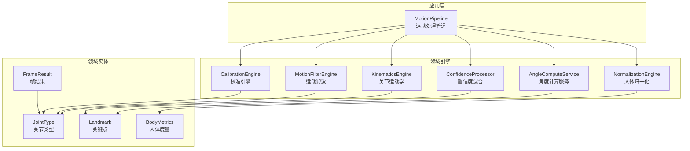
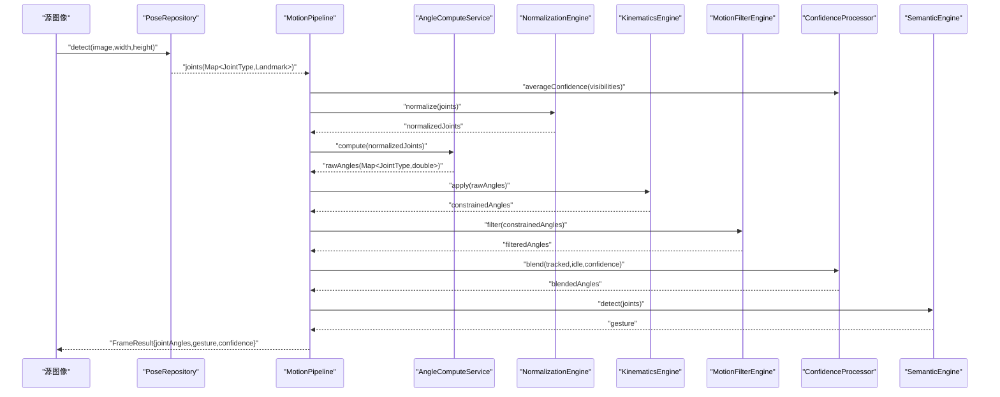
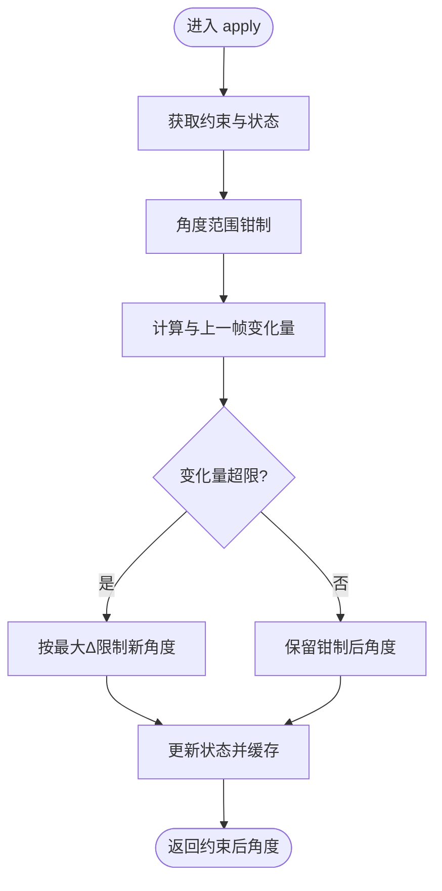
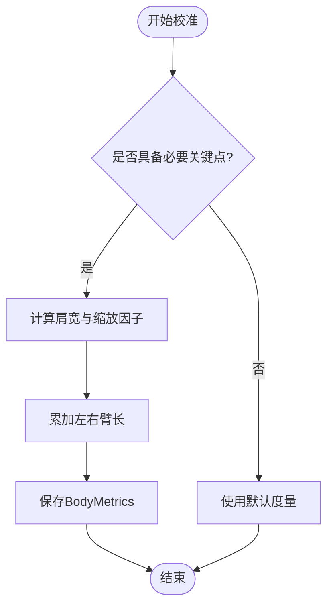
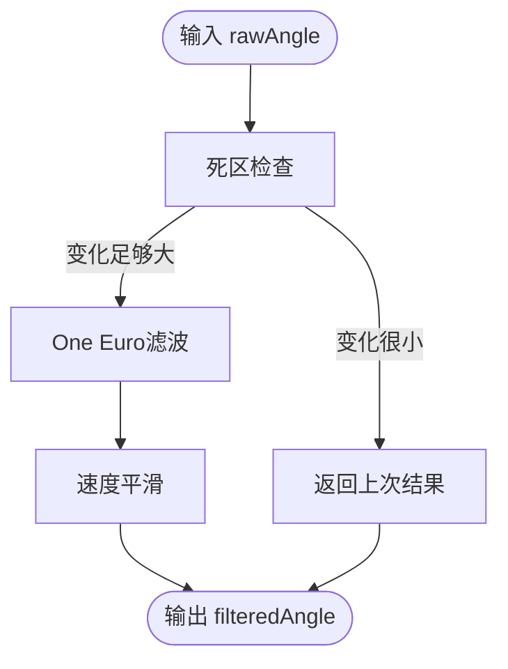
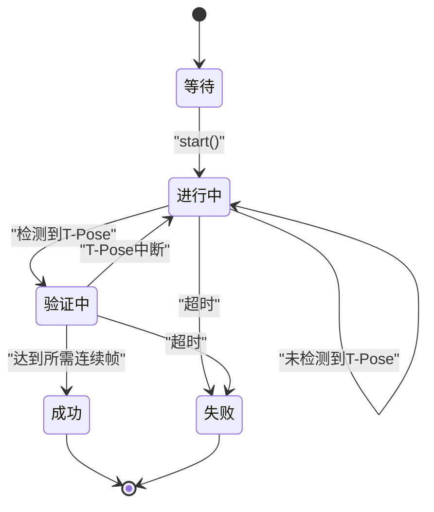
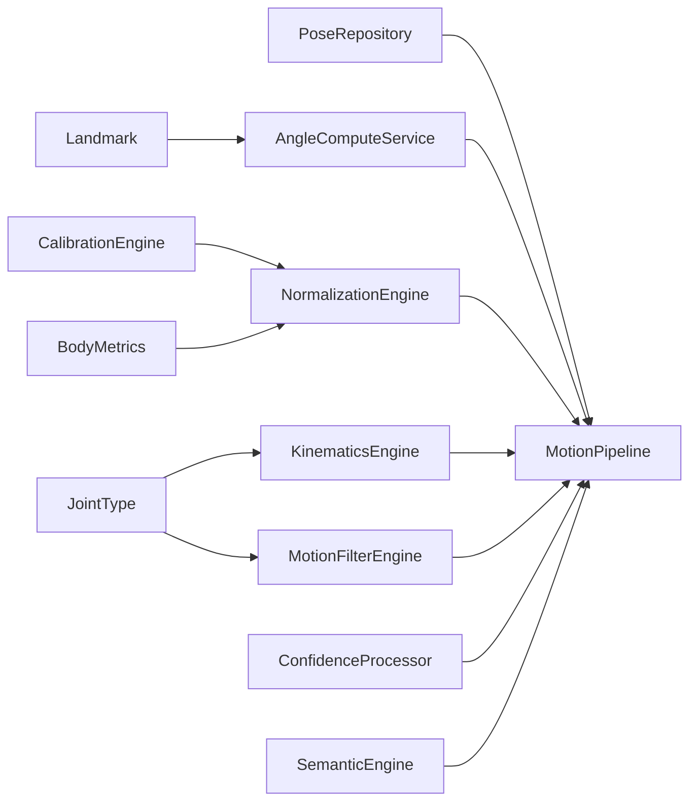

# 核心模块

<cite>
**本文引用的文件**
- [motion_pipeline.dart](file://lib/application/pipeline/motion_pipeline.dart)
- [kinematics_engine.dart](file://lib/domain/engines/kinematics/kinematics_engine.dart)
- [joint_constraint.dart](file://lib/domain/engines/kinematics/joint_constraint.dart)
- [joint_state.dart](file://lib/domain/engines/kinematics/joint_state.dart)
- [normalization_engine.dart](file://lib/domain/engines/normalization/normalization_engine.dart)
- [motion_filter_engine.dart](file://lib/domain/engines/filtering/motion_filter_engine.dart)
- [one_euro_filter.dart](file://lib/domain/engines/filtering/one_euro_filter.dart)
- [calibration_engine.dart](file://lib/domain/engines/calibration/calibration_engine.dart)
- [body_metrics.dart](file://lib/domain/entities/body_metrics.dart)
- [joint_type.dart](file://lib/domain/entities/joint_type.dart)
- [frame_result.dart](file://lib/domain/entities/frame_result.dart)
- [landmark.dart](file://lib/domain/entities/landmark.dart)
- [angle_compute_service.dart](file://lib/domain/services/angle_compute_service.dart)
- [confidence_processor.dart](file://lib/domain/engines/confidence/confidence_processor.dart)
- [app_constants.dart](file://lib/core/constants/app_constants.dart)
</cite>

## 目录
1. [简介](#简介)
2. [项目结构](#项目结构)
3. [核心组件](#核心组件)
4. [架构总览](#架构总览)
5. [详细组件分析](#详细组件分析)
6. [依赖分析](#依赖分析)
7. [性能考虑](#性能考虑)
8. [故障排查指南](#故障排查指南)
9. [结论](#结论)
10. [附录](#附录)

## 简介
本文件面向Mimo项目的运动处理核心模块，系统性阐述运动处理管道的架构设计与引擎编排机制，并深入解析以下五大引擎：
- 关节运动学引擎：运动学约束原理与关节角度计算方法
- 人体归一化引擎：校准算法与人体度量计算流程
- 运动滤波引擎：多滤波策略组合与One Euro滤波器应用
- 校准引擎：校准流程设计与校准数据存储机制
- 置信度混合引擎：与idle姿态的融合策略

文档还提供各模块的输入输出规范、参数配置、性能特征、典型使用模式以及模块间的数据流转过程。

## 项目结构
核心代码位于lib目录下，采用“领域层引擎 + 应用层管道 + 领域实体”的分层组织方式：
- domain/engines：各引擎实现（kinematics、normalization、filtering、calibration、confidence）
- domain/entities：数据模型（关节类型、关键点、帧结果、人体度量）
- domain/services：业务服务（角度计算）
- application/pipeline：运动处理管道，负责编排各引擎
- core/constants：全局常量（如校准阈值、性能目标）

图表来源
- [motion_pipeline.dart:14-51](file://lib/application/pipeline/motion_pipeline.dart#L14-L51)
- [kinematics_engine.dart:6-19](file://lib/domain/engines/kinematics/kinematics_engine.dart#L6-L19)
- [normalization_engine.dart:6-16](file://lib/domain/engines/normalization/normalization_engine.dart#L6-L16)
- [motion_filter_engine.dart:5-21](file://lib/domain/engines/filtering/motion_filter_engine.dart#L5-L21)
- [calibration_engine.dart:50-79](file://lib/domain/engines/calibration/calibration_engine.dart#L50-L79)
- [angle_compute_service.dart:6-13](file://lib/domain/services/angle_compute_service.dart#L6-L13)
- [confidence_processor.dart:3-19](file://lib/domain/engines/confidence/confidence_processor.dart#L3-L19)
- [joint_type.dart:1-32](file://lib/domain/entities/joint_type.dart#L1-L32)
- [landmark.dart:1-22](file://lib/domain/entities/landmark.dart#L1-L22)
- [frame_result.dart:4-25](file://lib/domain/entities/frame_result.dart#L4-L25)
- [body_metrics.dart:1-26](file://lib/domain/entities/body_metrics.dart#L1-L26)

章节来源
- [motion_pipeline.dart:14-51](file://lib/application/pipeline/motion_pipeline.dart#L14-L51)
- [app_constants.dart:16-19](file://lib/core/constants/app_constants.dart#L16-L19)

## 核心组件
本节概述五大核心引擎及其职责边界：
- 运动处理管道：串联姿态检测、置信度评估、归一化、角度计算、运动学约束、滤波、置信度混合、语义识别与性能统计
- 关节运动学引擎：对肩、肘等关键关节施加角度范围与单帧变化量约束，维持动作的生物力学合理性
- 人体归一化引擎：基于T-Pose校准计算人体度量（肩宽、左右臂长），通过缩放因子消除不同体型的动作幅度差异
- 运动滤波引擎：组合死区过滤、One Euro滤波与速度平滑，降低抖动并保持快速响应
- 校准引擎：检测T-Pose并进行校准，输出人体度量数据；支持超时、失败与成功状态
- 置信度混合引擎：根据关键点置信度在跟踪角度与idle姿态之间平滑过渡

章节来源
- [motion_pipeline.dart:53-130](file://lib/application/pipeline/motion_pipeline.dart#L53-L130)
- [kinematics_engine.dart:31-53](file://lib/domain/engines/kinematics/kinematics_engine.dart#L31-L53)
- [normalization_engine.dart:21-70](file://lib/domain/engines/normalization/normalization_engine.dart#L21-L70)
- [motion_filter_engine.dart:23-48](file://lib/domain/engines/filtering/motion_filter_engine.dart#L23-L48)
- [calibration_engine.dart:105-167](file://lib/domain/engines/calibration/calibration_engine.dart#L105-L167)
- [confidence_processor.dart:26-50](file://lib/domain/engines/confidence/confidence_processor.dart#L26-L50)

## 架构总览
运动处理管道以“帧”为单位，依次调用各引擎完成端到端处理。下图展示典型一帧的处理序列：

图表来源
- [motion_pipeline.dart:61-129](file://lib/application/pipeline/motion_pipeline.dart#L61-L129)
- [angle_compute_service.dart:20-65](file://lib/domain/services/angle_compute_service.dart#L20-L65)
- [normalization_engine.dart:77-113](file://lib/domain/engines/normalization/normalization_engine.dart#L77-L113)
- [kinematics_engine.dart:36-53](file://lib/domain/engines/kinematics/kinematics_engine.dart#L36-L53)
- [motion_filter_engine.dart:28-48](file://lib/domain/engines/filtering/motion_filter_engine.dart#L28-L48)
- [confidence_processor.dart:29-50](file://lib/domain/engines/confidence/confidence_processor.dart#L29-L50)

## 详细组件分析

### 运动处理管道（MotionPipeline）
- 职责：编排姿态检测、置信度评估、归一化、角度计算、运动学约束、滤波、置信度混合、语义识别与性能统计
- 输入：timestamp、image、width、height
- 输出：FrameResult（包含jointAngles、gesture、timestamp、confidence）
- 关键流程：
  - 姿态检测 → 置信度平均值计算 → 归一化 → 角度计算 → 运动学约束 → 滤波 → 置信度混合 → 语义识别 → 性能更新
- 性能：记录每帧处理耗时并更新FPS/延迟指标

章节来源
- [motion_pipeline.dart:53-130](file://lib/application/pipeline/motion_pipeline.dart#L53-L130)
- [frame_result.dart:20-25](file://lib/domain/entities/frame_result.dart#L20-L25)

### 关节运动学引擎（KinematicsEngine）
- 职责：对关节角度施加范围约束与单帧变化量约束，保证动作符合人体生物力学
- 输入：rawAngles（弧度）
- 输出：constrainedAngles（弧度）
- 约束类型：
  - 角度范围限制（min/max）
  - 单帧最大变化量限制（maxDeltaPerFrame）
- 状态管理：JointStates维护每个关节的currentAngle、lastAngle、velocity与角度历史，用于平滑与稳定性控制

图表来源
- [kinematics_engine.dart:36-81](file://lib/domain/engines/kinematics/kinematics_engine.dart#L36-L81)
- [joint_state.dart:29-46](file://lib/domain/engines/kinematics/joint_state.dart#L29-L46)

章节来源
- [kinematics_engine.dart:31-81](file://lib/domain/engines/kinematics/kinematics_engine.dart#L31-L81)
- [joint_constraint.dart:4-47](file://lib/domain/engines/kinematics/joint_constraint.dart#L4-L47)
- [joint_state.dart:75-99](file://lib/domain/engines/kinematics/joint_state.dart#L75-L99)

### 人体归一化引擎（NormalizationEngine）
- 职责：基于T-Pose校准计算人体度量，对关键点与角度进行归一化
- 校准输入：T-Pose关键点（至少左/右肩）
- 校准输出：BodyMetrics（肩宽、缩放因子、左右臂长、校准时间）
- 归一化流程：
  - 若未校准：直接返回原始关键点
  - 计算中心点（两肩中点），按scaleFactor对每个关键点进行相对中心的缩放与钳制
  - 提供normalizeAngle接口，按scaleFactor调整角度幅度

图表来源
- [normalization_engine.dart:21-70](file://lib/domain/engines/normalization/normalization_engine.dart#L21-L70)
- [body_metrics.dart:20-40](file://lib/domain/entities/body_metrics.dart#L20-L40)

章节来源
- [normalization_engine.dart:21-125](file://lib/domain/engines/normalization/normalization_engine.dart#L21-L125)
- [body_metrics.dart:1-109](file://lib/domain/entities/body_metrics.dart#L1-L109)

### 运动滤波引擎（MotionFilterEngine）
- 职责：组合死区过滤、One Euro滤波与速度平滑，降低抖动并保持快速响应
- 输入：constrainedAngles（弧度）
- 输出：filteredAngles（弧度）
- 策略说明：
  - 死区过滤：当变化小于阈值时直接返回上次结果
  - One Euro滤波：自适应截止频率，动态抑制高频噪声
  - 速度平滑：基于最近若干帧的速度历史计算加权平滑结果

图表来源
- [motion_filter_engine.dart:28-102](file://lib/domain/engines/filtering/motion_filter_engine.dart#L28-L102)
- [one_euro_filter.dart:43-66](file://lib/domain/engines/filtering/one_euro_filter.dart#L43-L66)

章节来源
- [motion_filter_engine.dart:23-117](file://lib/domain/engines/filtering/motion_filter_engine.dart#L23-L117)
- [one_euro_filter.dart:1-112](file://lib/domain/engines/filtering/one_euro_filter.dart#L1-L112)

### 校准引擎（CalibrationEngine）
- 职责：检测T-Pose并进行校准，输出BodyMetrics；支持超时、失败与成功状态
- 状态机：waiting → inProgress → verifying → success/failed
- 校准条件：
  - 连续帧满足T-Pose（armAngle阈值、肘部伸直）
  - 必要关键点齐全（肩、肘）
- 超时控制：timeoutSeconds
- 结果：CalibrationResult（status、metrics、errorMessage、durationMs）

图表来源
- [calibration_engine.dart:8-23](file://lib/domain/engines/calibration/calibration_engine.dart#L8-L23)
- [calibration_engine.dart:97-167](file://lib/domain/engines/calibration/calibration_engine.dart#L97-L167)

章节来源
- [calibration_engine.dart:50-293](file://lib/domain/engines/calibration/calibration_engine.dart#L50-L293)
- [app_constants.dart:16-19](file://lib/core/constants/app_constants.dart#L16-L19)

### 置信度混合引擎（ConfidenceProcessor）
- 职责：根据关键点置信度在跟踪角度与idle角度之间平滑过渡，避免直接冻结
- 输入：trackedAngle、idleAngle、confidence
- 策略：高置信度完全跟踪，低置信度过渡至idle，中等置信度线性插值
- 辅助：averageConfidence、shouldEnterIdle

章节来源
- [confidence_processor.dart:26-91](file://lib/domain/engines/confidence/confidence_processor.dart#L26-L91)

### 角度计算服务（AngleComputeService）
- 职责：从关键点计算肩、肘角度
- 输入：joints（归一化坐标）
- 输出：rawAngles（弧度）
- 方法：
  - 肩关节：基于肩到肘的角度并归一化到[-π, π]
  - 肘关节：基于肩-肘-腕三点夹角，钳制在[0, π]

章节来源
- [angle_compute_service.dart:15-120](file://lib/domain/services/angle_compute_service.dart#L15-L120)

## 依赖分析
- 组件耦合：
  - MotionPipeline依赖PoseRepository、AngleComputeService、NormalizationEngine、KinematicsEngine、MotionFilterEngine、ConfidenceProcessor、SemanticEngine、PerformanceScheduler
  - 各引擎内部通过领域实体（JointType、Landmark、BodyMetrics）交互
- 外部依赖：
  - 摄像头与姿态检测库（由PoseRepository抽象）
  - 性能调度器（PerformanceScheduler）用于统计FPS与延迟
- 数据流：
  - 关键点从PoseRepository流向NormalizationEngine与AngleComputeService
  - 角度经KinematicsEngine与MotionFilterEngine处理后进入ConfidenceProcessor
  - 校准引擎独立于主管道，输出BodyMetrics供NormalizationEngine使用

图表来源
- [motion_pipeline.dart:18-51](file://lib/application/pipeline/motion_pipeline.dart#L18-L51)
- [calibration_engine.dart:237-277](file://lib/domain/engines/calibration/calibration_engine.dart#L237-L277)
- [body_metrics.dart:1-26](file://lib/domain/entities/body_metrics.dart#L1-L26)
- [landmark.dart:1-22](file://lib/domain/entities/landmark.dart#L1-L22)
- [joint_type.dart:1-32](file://lib/domain/entities/joint_type.dart#L1-L32)

章节来源
- [motion_pipeline.dart:18-51](file://lib/application/pipeline/motion_pipeline.dart#L18-L51)

## 性能考虑
- 目标与阈值：
  - 目标FPS：30；最低FPS：15；最大延迟：120ms
  - 置信度阈值：高置信度阈值0.6，低置信度阈值0.3
- 优化建议：
  - 使用One Euro滤波器降低抖动的同时保持低延迟
  - 通过死区过滤减少无效更新
  - 速度平滑利用短历史窗口平衡响应与稳定
  - 在idle状态下降低处理负载（置信度低于阈值时）
- 温度与降级：
  - 设备温度超过预警阈值时可考虑降级策略（如降低目标FPS）

章节来源
- [app_constants.dart:11-14](file://lib/core/constants/app_constants.dart#L11-L14)
- [app_constants.dart:26-28](file://lib/core/constants/app_constants.dart#L26-L28)
- [motion_filter_engine.dart:80-102](file://lib/domain/engines/filtering/motion_filter_engine.dart#L80-L102)
- [confidence_processor.dart:87-91](file://lib/domain/engines/confidence/confidence_processor.dart#L87-L91)

## 故障排查指南
- 校准失败：
  - 现象：状态停留在进行中或变为失败，提示“请站成T-Pose姿势”或“校准超时”
  - 排查要点：确保肩、肘关键点可见度高于阈值；保持双臂水平且肘部伸直；在要求的持续帧数内维持T-Pose
- 归一化无效：
  - 现象：未显示校准结果或使用默认度量
  - 排查要点：确认已执行校准；检查BodyMetrics.isValid；确保关键点坐标有效
- 角度过度抖动：
  - 现象：角度波动明显
  - 排查要点：调整死区阈值与速度平滑系数；检查One Euro滤波初始参数
- 置信度混合异常：
  - 现象：角度在跟踪与idle之间跳变
  - 排查要点：检查置信度阈值设置；确认idle角度表是否正确初始化

章节来源
- [calibration_engine.dart:115-167](file://lib/domain/engines/calibration/calibration_engine.dart#L115-L167)
- [normalization_engine.dart:18-19](file://lib/domain/engines/normalization/normalization_engine.dart#L18-L19)
- [motion_filter_engine.dart:18-21](file://lib/domain/engines/filtering/motion_filter_engine.dart#L18-L21)
- [confidence_processor.dart:16-19](file://lib/domain/engines/confidence/confidence_processor.dart#L16-L19)

## 结论
Mimo的核心模块通过清晰的分层与编排，实现了从姿态检测到动作驱动的完整链路。五大引擎各司其职：校准引擎提供人体度量基础，归一化引擎消除个体差异，角度计算服务提供几何角度，运动学引擎保障动作合理性，滤波引擎提升稳定性，置信度混合引擎确保用户体验。整体设计兼顾实时性与鲁棒性，适合在移动端场景中部署与扩展。

## 附录

### 输入输出规范与参数配置

- 运动处理管道（MotionPipeline.process）
  - 输入：timestamp（毫秒）、image、width、height
  - 输出：FrameResult（jointAngles、gesture、timestamp、confidence）
  - 关键参数：无（内部使用各引擎默认配置）

- 关节运动学引擎（KinematicsEngine.apply）
  - 输入：Map<JointType, double> rawAngles（弧度）
  - 输出：Map<JointType, double> constrainedAngles（弧度）
  - 关键参数：约束配置（minAngle、maxAngle、maxDeltaPerFrame）

- 人体归一化引擎（NormalizationEngine.normalize/calibrate）
  - 输入：Map<JointType, Landmark> joints 或 T-Pose joints
  - 输出：Map<JointType, Landmark> normalizedJoints 或 BodyMetrics
  - 关键参数：baselineShoulderWidth（默认0.35）

- 运动滤波引擎（MotionFilterEngine.filter）
  - 输入：Map<JointType, double> angles（弧度）
  - 输出：Map<JointType, double> filteredAngles（弧度）
  - 关键参数：deadZoneThreshold（默认约0.57度）、velocitySmoothing（默认0.3）

- 校准引擎（CalibrationEngine.processFrame）
  - 输入：Map<JointType, Landmark> joints
  - 输出：CalibrationResult（status、metrics、errorMessage、durationMs）
  - 关键参数：requiredTPoseFrames（默认30）、armAngleThreshold（默认60度）、timeoutSeconds（默认30）

- 置信度混合引擎（ConfidenceProcessor.blend）
  - 输入：trackedAngle、idleAngle、confidence
  - 输出：混合后的角度
  - 关键参数：highThreshold（默认0.6）、lowThreshold（默认0.3）

章节来源
- [motion_pipeline.dart:61-129](file://lib/application/pipeline/motion_pipeline.dart#L61-L129)
- [kinematics_engine.dart:36-53](file://lib/domain/engines/kinematics/kinematics_engine.dart#L36-L53)
- [normalization_engine.dart:77-125](file://lib/domain/engines/normalization/normalization_engine.dart#L77-L125)
- [motion_filter_engine.dart:18-21](file://lib/domain/engines/filtering/motion_filter_engine.dart#L18-L21)
- [calibration_engine.dart:75-79](file://lib/domain/engines/calibration/calibration_engine.dart#L75-L79)
- [confidence_processor.dart:16-19](file://lib/domain/engines/confidence/confidence_processor.dart#L16-L19)

### 典型使用模式
- 实时处理一帧：
  - 调用MotionPipeline.process传入图像与尺寸，获得FrameResult
  - 依据FrameResult.jointAngles驱动动画或交互
- 校准流程：
  - 初始化CalibrationEngine，调用start
  - 循环调用processFrame，根据CalibrationResult.status判断进度
  - 成功后将BodyMetrics交给NormalizationEngine使用
- 参数调优：
  - 根据设备性能调整MotionFilterEngine的deadZoneThreshold与velocitySmoothing
  - 根据环境光照调整CalibrationEngine的armAngleThreshold与requiredTPoseFrames

章节来源
- [motion_pipeline.dart:61-130](file://lib/application/pipeline/motion_pipeline.dart#L61-L130)
- [calibration_engine.dart:97-167](file://lib/domain/engines/calibration/calibration_engine.dart#L97-L167)
- [motion_filter_engine.dart:18-21](file://lib/domain/engines/filtering/motion_filter_engine.dart#L18-L21)