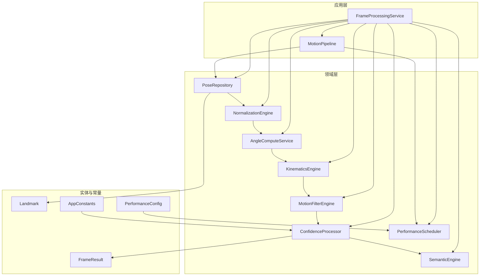
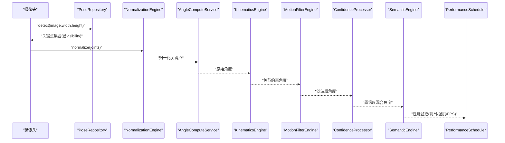
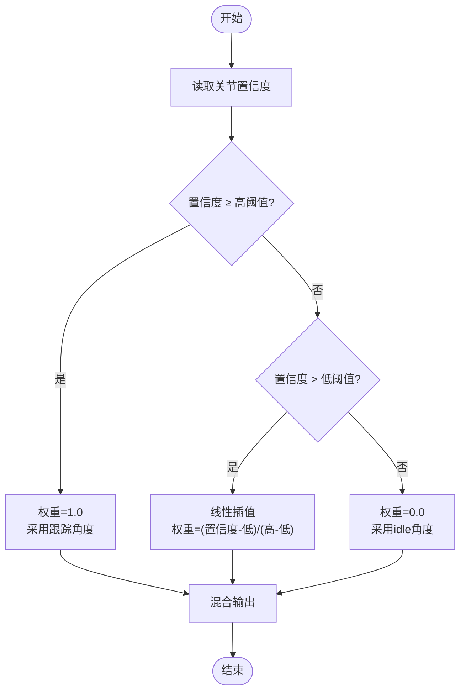
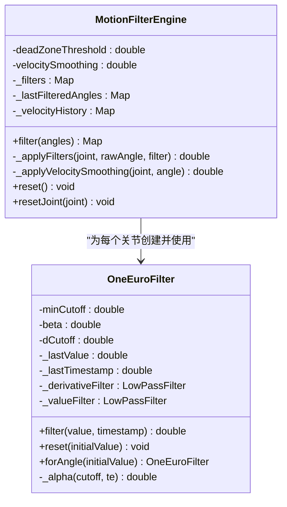
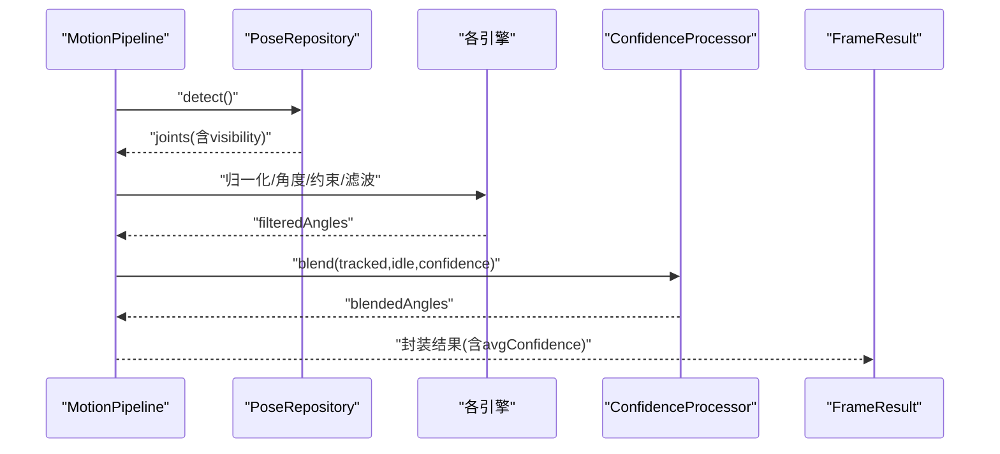
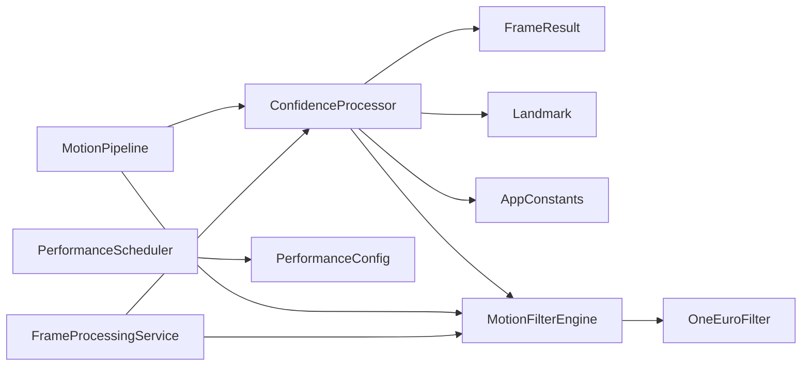

# 置信度处理器

<cite>
**本文档引用的文件**
- [confidence_processor.dart](file://lib/domain/engines/confidence/confidence_processor.dart)
- [motion_pipeline.dart](file://lib/application/pipeline/motion_pipeline.dart)
- [frame_processing_service.dart](file://lib/application/services/frame_processing_service.dart)
- [motion_filter_engine.dart](file://lib/domain/engines/filtering/motion_filter_engine.dart)
- [one_euro_filter.dart](file://lib/domain/engines/filtering/one_euro_filter.dart)
- [frame_result.dart](file://lib/domain/entities/frame_result.dart)
- [landmark.dart](file://lib/domain/entities/landmark.dart)
- [app_constants.dart](file://lib/core/constants/app_constants.dart)
- [performance_scheduler.dart](file://lib/domain/engines/performance/performance_scheduler.dart)
- [performance_config.dart](file://lib/core/config/performance_config.dart)
</cite>

## 目录
1. [简介](#简介)
2. [项目结构](#项目结构)
3. [核心组件](#核心组件)
4. [架构总览](#架构总览)
5. [详细组件分析](#详细组件分析)
6. [依赖关系分析](#依赖关系分析)
7. [性能考虑](#性能考虑)
8. [故障排除指南](#故障排除指南)
9. [结论](#结论)
10. [附录](#附录)

## 简介
本文件针对Mimo项目的置信度处理器进行深入技术说明，涵盖以下重点：
- 置信度评估算法的实现原理与关键点质量判断机制
- 置信度阈值的设定与动态调整策略
- 如何通过置信度过滤低质量姿态数据
- 置信度与滤波处理的协同工作机制
- 置信度评分的计算方法与权重分配策略
- 不同光照与姿态条件下的适应性
- 置信度数据的统计分析与性能监控机制

## 项目结构
置信度处理位于应用的“领域层”和“应用层”之间，作为姿态处理流水线中的关键环节，贯穿于姿态检测、归一化、角度计算、运动学约束、滤波以及最终输出的全过程。

图表来源
- [motion_pipeline.dart:1-141](file://lib/application/pipeline/motion_pipeline.dart#L1-L141)
- [frame_processing_service.dart:1-254](file://lib/application/services/frame_processing_service.dart#L1-L254)
- [confidence_processor.dart:1-91](file://lib/domain/engines/confidence/confidence_processor.dart#L1-L91)
- [motion_filter_engine.dart:1-117](file://lib/domain/engines/filtering/motion_filter_engine.dart#L1-L117)
- [frame_result.dart:1-93](file://lib/domain/entities/frame_result.dart#L1-L93)
- [landmark.dart:1-87](file://lib/domain/entities/landmark.dart#L1-L87)
- [app_constants.dart:1-35](file://lib/core/constants/app_constants.dart#L1-L35)
- [performance_scheduler.dart:1-194](file://lib/domain/engines/performance/performance_scheduler.dart#L1-L194)
- [performance_config.dart:1-79](file://lib/core/config/performance_config.dart#L1-L79)

章节来源
- [motion_pipeline.dart:1-141](file://lib/application/pipeline/motion_pipeline.dart#L1-L141)
- [frame_processing_service.dart:1-254](file://lib/application/services/frame_processing_service.dart#L1-L254)

## 核心组件
- 置信度处理器（ConfidenceProcessor）：负责根据关键点可见度（置信度）对角度进行加权混合，实现“高置信度跟踪、中等置信度过渡、低置信度回退到idle”的平滑控制。
- 运动滤波引擎（MotionFilterEngine）：在角度层面进行多策略组合滤波（死区过滤、One Euro滤波、速度平滑），减少抖动并提升稳定性。
- One Euro滤波器（OneEuroFilter）：自适应低通滤波，依据信号变化率动态调节截止频率，兼顾低延迟与平滑性。
- 帧结果（FrameResult）：封装每帧处理后的关节角度、手势、时间戳与平均置信度，支持idle状态判定。
- 关键点实体（Landmark）：包含可见度字段visibility，作为置信度的直接来源。
- 性能调度器（PerformanceScheduler）：基于FPS、延迟与温度等指标进行性能级别动态调整，间接影响置信度处理的稳定性与实时性。

章节来源
- [confidence_processor.dart:1-91](file://lib/domain/engines/confidence/confidence_processor.dart#L1-L91)
- [motion_filter_engine.dart:1-117](file://lib/domain/engines/filtering/motion_filter_engine.dart#L1-L117)
- [one_euro_filter.dart:1-112](file://lib/domain/engines/filtering/one_euro_filter.dart#L1-L112)
- [frame_result.dart:1-93](file://lib/domain/entities/frame_result.dart#L1-L93)
- [landmark.dart:1-87](file://lib/domain/entities/landmark.dart#L1-L87)
- [performance_scheduler.dart:1-194](file://lib/domain/engines/performance/performance_scheduler.dart#L1-L194)

## 架构总览
置信度处理器在整体流水线中的位置如下：

图表来源
- [motion_pipeline.dart:61-130](file://lib/application/pipeline/motion_pipeline.dart#L61-L130)
- [frame_processing_service.dart:124-216](file://lib/application/services/frame_processing_service.dart#L124-L216)

## 详细组件分析

### 置信度处理器（ConfidenceProcessor）
- 算法原理
  - 使用双阈值策略：当某关节的可见度≥高阈值时，完全采用跟踪角度；当可见度低于低阈值时，完全回退到idle角度；在两者之间进行线性插值，实现平滑过渡。
  - 支持为每个关节单独设置idle角度，若未设置则默认使用跟踪角度。
  - 提供平均置信度计算与连续帧idle判断能力，便于系统在长时间低置信度时进入idle状态。
- 关键点质量判断机制
  - 可见度visibility来自关键点实体，范围[0,1]，越高表示检测越可靠。
  - 平均置信度用于整帧质量评估，作为idle判定与UI反馈的重要依据。
- 阈值设定与权重分配
  - 高阈值与低阈值分别定义了“完全跟踪”和“完全idle”的边界，中间区域按比例线性混合。
  - 权重w由公式计算：当置信度在低阈值与高阈值之间时，w=(confidence−low)/(high−low)，确保权重在[0,1]范围内单调递增。
- idle姿态角度管理
  - 可通过setIdleAngle为特定关节设置idle角度；若未设置，则默认使用跟踪角度，保证无配置时的可用性。
- 与流水线的集成
  - 在滤波之后、语义识别之前，对每个关节的角度执行置信度混合，得到更稳健的输出角度。
  - 平均置信度随帧结果返回，供上层逻辑（如UI、性能调度）使用。

图表来源
- [confidence_processor.dart:29-50](file://lib/domain/engines/confidence/confidence_processor.dart#L29-L50)

章节来源
- [confidence_processor.dart:1-91](file://lib/domain/engines/confidence/confidence_processor.dart#L1-L91)
- [frame_result.dart:17-44](file://lib/domain/entities/frame_result.dart#L17-L44)

### 运动滤波引擎（MotionFilterEngine）与One Euro滤波器
- 死区过滤：对微小变化进行抑制，避免噪声导致的抖动。
- One Euro滤波：根据信号变化率动态调整截止频率，实现低延迟与平滑性的平衡。
- 速度平滑：基于角速度历史计算平均速度，并与当前速度加权融合，进一步抑制突变。
- 协同工作机制
  - 在置信度混合之前对角度进行滤波，可显著降低低质量检测带来的抖动。
  - 与置信度处理器配合：在低置信度时，滤波后的角度会更接近idle，从而实现更自然的过渡。

图表来源
- [motion_filter_engine.dart:1-117](file://lib/domain/engines/filtering/motion_filter_engine.dart#L1-L117)
- [one_euro_filter.dart:1-112](file://lib/domain/engines/filtering/one_euro_filter.dart#L1-L112)

章节来源
- [motion_filter_engine.dart:1-117](file://lib/domain/engines/filtering/motion_filter_engine.dart#L1-L117)
- [one_euro_filter.dart:1-112](file://lib/domain/engines/filtering/one_euro_filter.dart#L1-L112)

### 帧处理流水线中的置信度处理
- MotionPipeline
  - 在滤波后对每个关节执行置信度混合，使用每关节的visibility作为权重。
  - 将平均置信度写入FrameResult，供后续模块使用。
- FrameProcessingService
  - 在追踪阶段同样执行置信度混合，并将结果通过回调传递给UI层。
  - 提供空帧处理（无姿态检测）的分支，便于idle状态的衔接。

图表来源
- [motion_pipeline.dart:61-130](file://lib/application/pipeline/motion_pipeline.dart#L61-L130)
- [frame_processing_service.dart:169-216](file://lib/application/services/frame_processing_service.dart#L169-L216)

章节来源
- [motion_pipeline.dart:61-130](file://lib/application/pipeline/motion_pipeline.dart#L61-L130)
- [frame_processing_service.dart:169-216](file://lib/application/services/frame_processing_service.dart#L169-L216)

### 阈值设定与动态调整策略
- 固定阈值
  - 高阈值与低阈值在ConfidenceProcessor构造时确定，也可通过应用常量统一管理，便于全局一致性。
- 动态调整
  - 当前实现未内置自动阈值调整机制；建议在实际部署中结合场景统计（如光照变化、遮挡频次）引入自适应策略（例如滑动窗口统计平均置信度，动态微调阈值）。
- 与性能调度联动
  - 性能调度器根据FPS、延迟与温度进行性能级别升降，间接影响置信度处理的稳定性与实时性；在降级时应适当提高阈值以增强鲁棒性。

章节来源
- [confidence_processor.dart:16-19](file://lib/domain/engines/confidence/confidence_processor.dart#L16-L19)
- [app_constants.dart:26-28](file://lib/core/constants/app_constants.dart#L26-L28)
- [performance_scheduler.dart:90-129](file://lib/domain/engines/performance/performance_scheduler.dart#L90-L129)

### 置信度评分与权重分配
- 评分计算
  - 平均置信度=Σ(各关节visibility)/关节数；用于整帧质量评估与idle判定。
- 权重分配
  - 对每个关节：当visibility≥高阈值时，权重为1；当visibility≤低阈值时，权重为0；否则按线性比例分配。
- 过滤低质量数据
  - 在低置信度区间内，置信度混合会显著降低跟踪角度的影响，使输出更接近idle，从而避免错误动作传播。

章节来源
- [confidence_processor.dart:80-90](file://lib/domain/engines/confidence/confidence_processor.dart#L80-L90)
- [landmark.dart:14-15](file://lib/domain/entities/landmark.dart#L14-L15)

### 代码示例路径（展示置信度处理流程）
- 置信度混合（单关节）
  - [confidence_processor.dart:29-50](file://lib/domain/engines/confidence/confidence_processor.dart#L29-L50)
- 多关节批量处理
  - [confidence_processor.dart:52-73](file://lib/domain/engines/confidence/confidence_processor.dart#L52-L73)
- 流水线中的使用（MotionPipeline）
  - [motion_pipeline.dart:100-112](file://lib/application/pipeline/motion_pipeline.dart#L100-L112)
- 流水线中的使用（FrameProcessingService）
  - [frame_processing_service.dart:189-201](file://lib/application/services/frame_processing_service.dart#L189-L201)
- 平均置信度计算
  - [confidence_processor.dart:80-84](file://lib/domain/engines/confidence/confidence_processor.dart#L80-L84)
- idle状态判定
  - [confidence_processor.dart:86-90](file://lib/domain/engines/confidence/confidence_processor.dart#L86-L90)
- 帧结果中的置信度字段
  - [frame_result.dart:17-18](file://lib/domain/entities/frame_result.dart#L17-L18)

章节来源
- [confidence_processor.dart:29-90](file://lib/domain/engines/confidence/confidence_processor.dart#L29-L90)
- [motion_pipeline.dart:100-112](file://lib/application/pipeline/motion_pipeline.dart#L100-L112)
- [frame_processing_service.dart:189-201](file://lib/application/services/frame_processing_service.dart#L189-L201)
- [frame_result.dart:17-18](file://lib/domain/entities/frame_result.dart#L17-L18)

### 适应性与鲁棒性
- 光照条件
  - 在弱光或逆光下，visibility普遍偏低，置信度混合会自动回退到idle，避免误动作；可通过性能降级与阈值微调提升鲁棒性。
- 姿态与遮挡
  - 关节被遮挡时，对应visibility下降，系统通过置信度混合与滤波共同抑制抖动与错误传播。
- 交互体验
  - idle状态的平滑过渡避免了突然冻结，提升用户体验。

章节来源
- [motion_pipeline.dart:100-112](file://lib/application/pipeline/motion_pipeline.dart#L100-L112)
- [frame_processing_service.dart:189-201](file://lib/application/services/frame_processing_service.dart#L189-L201)
- [frame_result.dart:43-44](file://lib/domain/entities/frame_result.dart#L43-L44)

### 统计分析与性能监控
- 置信度统计
  - 平均置信度可用于评估整帧质量，支持idle判定与异常检测。
- 性能监控
  - 性能调度器基于FPS、延迟与温度进行性能级别动态调整，间接影响置信度处理的稳定性与实时性。
- 数据结构支撑
  - FrameResult提供confidence字段与isIdle判定，便于上层统计与可视化。

章节来源
- [frame_result.dart:17-44](file://lib/domain/entities/frame_result.dart#L17-L44)
- [performance_scheduler.dart:90-129](file://lib/domain/engines/performance/performance_scheduler.dart#L90-L129)
- [performance_config.dart:1-79](file://lib/core/config/performance_config.dart#L1-L79)

## 依赖关系分析
置信度处理器与滤波引擎、流水线、实体与常量之间的依赖关系如下：

图表来源
- [confidence_processor.dart:1-91](file://lib/domain/engines/confidence/confidence_processor.dart#L1-L91)
- [motion_filter_engine.dart:1-117](file://lib/domain/engines/filtering/motion_filter_engine.dart#L1-L117)
- [one_euro_filter.dart:1-112](file://lib/domain/engines/filtering/one_euro_filter.dart#L1-L112)
- [motion_pipeline.dart:1-141](file://lib/application/pipeline/motion_pipeline.dart#L1-L141)
- [frame_processing_service.dart:1-254](file://lib/application/services/frame_processing_service.dart#L1-L254)
- [frame_result.dart:1-93](file://lib/domain/entities/frame_result.dart#L1-L93)
- [landmark.dart:1-87](file://lib/domain/entities/landmark.dart#L1-L87)
- [app_constants.dart:1-35](file://lib/core/constants/app_constants.dart#L1-L35)
- [performance_scheduler.dart:1-194](file://lib/domain/engines/performance/performance_scheduler.dart#L1-L194)
- [performance_config.dart:1-79](file://lib/core/config/performance_config.dart#L1-L79)

章节来源
- [motion_pipeline.dart:1-141](file://lib/application/pipeline/motion_pipeline.dart#L1-L141)
- [frame_processing_service.dart:1-254](file://lib/application/services/frame_processing_service.dart#L1-L254)

## 性能考虑
- 计算复杂度
  - 置信度混合为O(N)（N为关节数），滤波为O(N)；整体开销较小，适合实时应用。
- 内存占用
  - One Euro滤波器按关节维护状态，内存占用与关节数量线性相关。
- 优化建议
  - 在低置信度时可减少滤波强度或跳过部分关节的精细滤波，以节省计算资源。
  - 结合性能调度器的降级策略，动态调整滤波参数与阈值，提升整体稳定性。

## 故障排除指南
- 症状：置信度混合后角度出现跳跃
  - 可能原因：滤波参数不当或阈值设置不合理。
  - 处理建议：检查MotionFilterEngine的死区阈值与速度平滑系数；适当提高高阈值或降低低阈值。
- 症状：长时间处于idle状态
  - 可能原因：平均置信度过低或阈值过高。
  - 处理建议：检查关键点检测质量（光照、遮挡）；必要时降低阈值或启用性能降级以提升检测稳定性。
- 症状：UI卡顿或延迟升高
  - 可能原因：性能调度器未及时降级。
  - 处理建议：检查PerformanceScheduler的更新频率与阈值；确保滤波与置信度处理在降级后仍保持稳定。

章节来源
- [motion_filter_engine.dart:18-21](file://lib/domain/engines/filtering/motion_filter_engine.dart#L18-L21)
- [performance_scheduler.dart:90-129](file://lib/domain/engines/performance/performance_scheduler.dart#L90-L129)
- [frame_result.dart:43-44](file://lib/domain/entities/frame_result.dart#L43-L44)

## 结论
置信度处理器通过双阈值策略与线性插值，在高、中、低置信度区间实现了平滑可控的角度输出，有效提升了姿态跟踪在复杂环境下的鲁棒性。与滤波引擎的协同工作进一步降低了抖动与误动作传播风险。结合性能调度器与统计分析，系统能够在不同光照与姿态条件下保持稳定的实时表现。

## 附录
- 关键实现参考路径
  - [置信度混合（单关节）:29-50](file://lib/domain/engines/confidence/confidence_processor.dart#L29-L50)
  - [多关节批量处理:52-73](file://lib/domain/engines/confidence/confidence_processor.dart#L52-L73)
  - [平均置信度计算:80-84](file://lib/domain/engines/confidence/confidence_processor.dart#L80-L84)
  - [idle状态判定:86-90](file://lib/domain/engines/confidence/confidence_processor.dart#L86-L90)
  - [滤波策略（MotionFilterEngine）:28-72](file://lib/domain/engines/filtering/motion_filter_engine.dart#L28-L72)
  - [One Euro滤波器:38-66](file://lib/domain/engines/filtering/one_euro_filter.dart#L38-L66)
  - [流水线中的置信度混合:100-112](file://lib/application/pipeline/motion_pipeline.dart#L100-L112)
  - [帧结果中的置信度字段:17-18](file://lib/domain/entities/frame_result.dart#L17-L18)