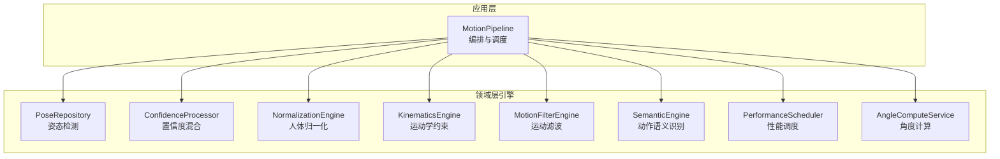
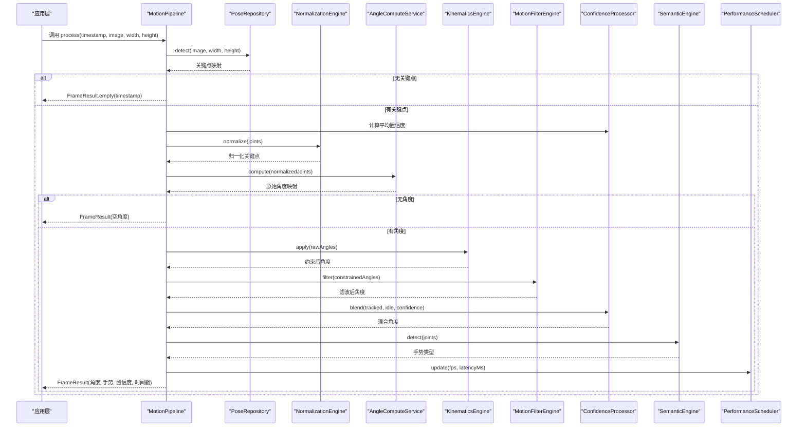
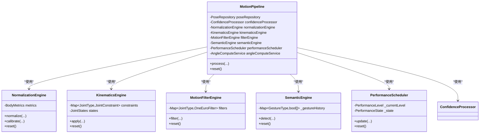
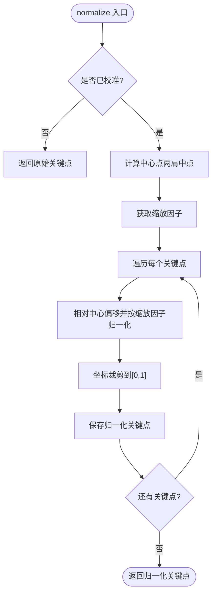
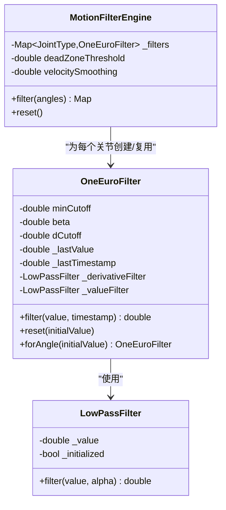
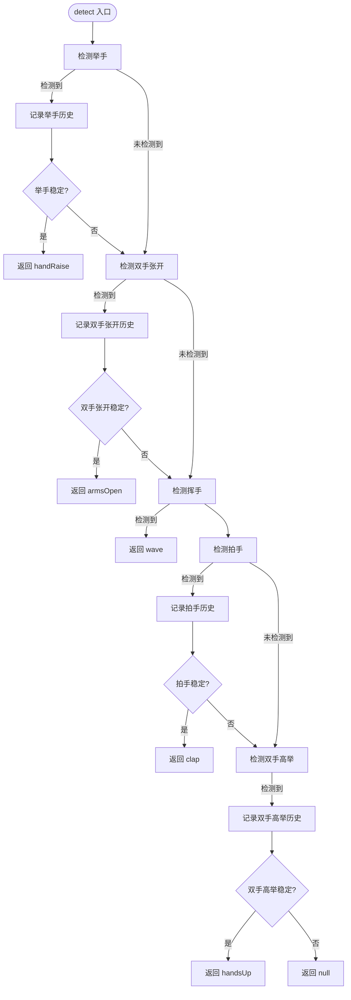
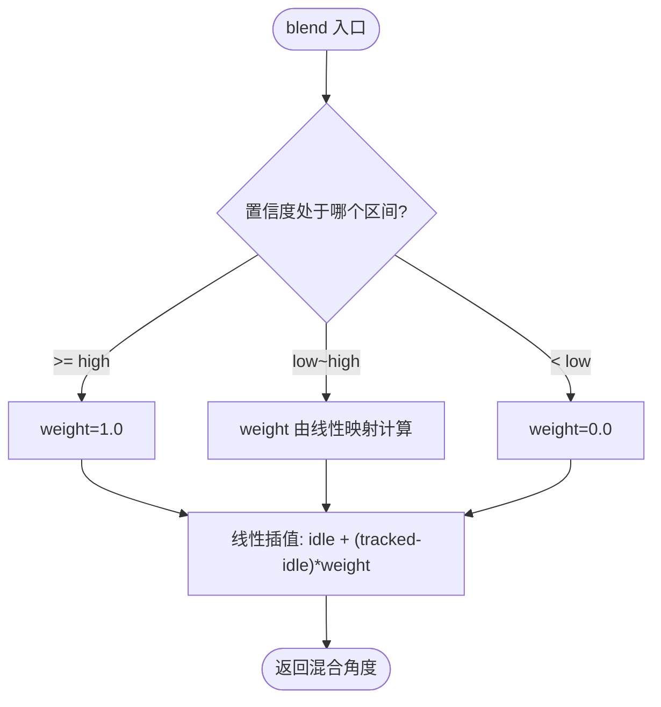
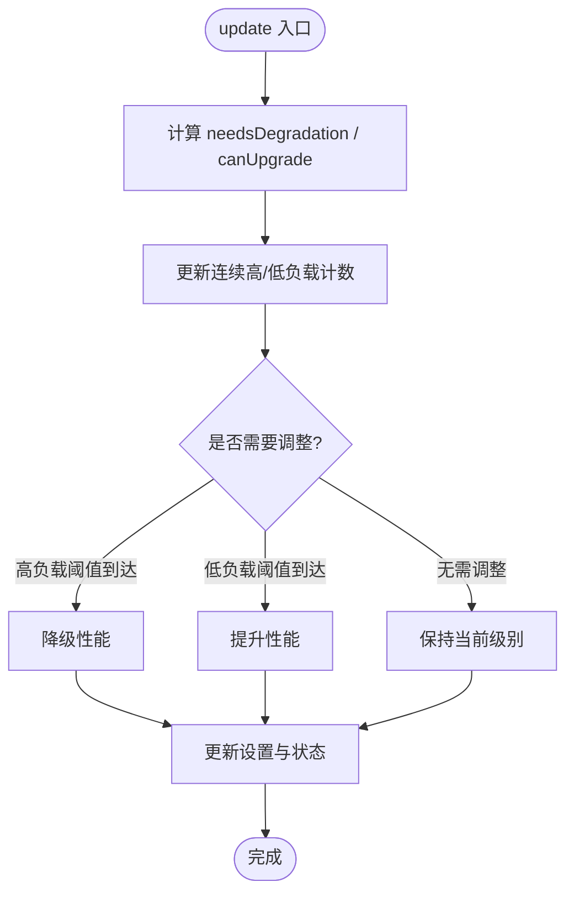
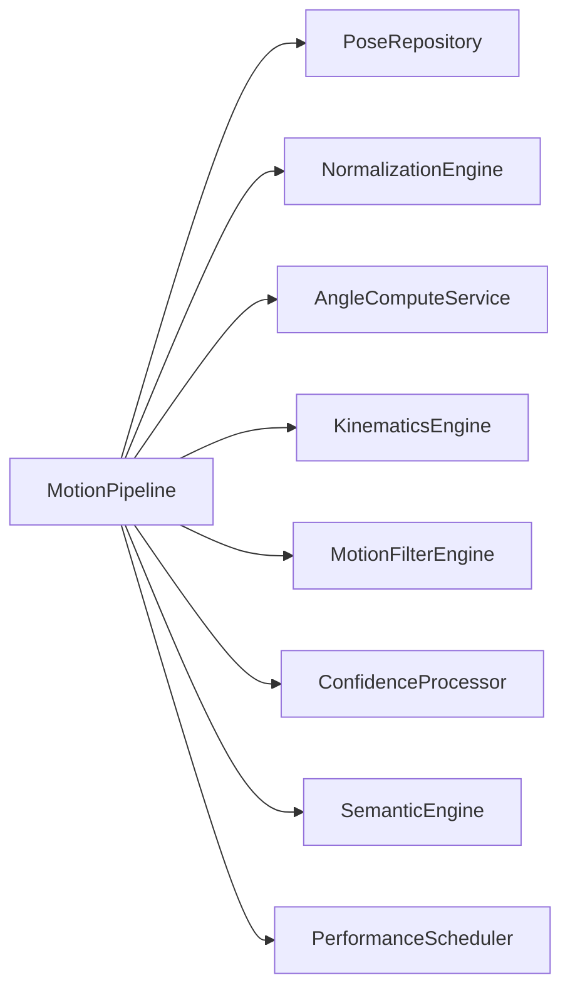

# 运动处理管道

<cite>
**本文引用的文件**
- [motion_pipeline.dart](file://lib/application/pipeline/motion_pipeline.dart)
- [kinematics_engine.dart](file://lib/domain/engines/kinematics/kinematics_engine.dart)
- [joint_constraint.dart](file://lib/domain/engines/kinematics/joint_constraint.dart)
- [joint_state.dart](file://lib/domain/engines/kinematics/joint_state.dart)
- [normalization_engine.dart](file://lib/domain/engines/normalization/normalization_engine.dart)
- [motion_filter_engine.dart](file://lib/domain/engines/filtering/motion_filter_engine.dart)
- [one_euro_filter.dart](file://lib/domain/engines/filtering/one_euro_filter.dart)
- [calibration_engine.dart](file://lib/domain/engines/calibration/calibration_engine.dart)
- [semantic_engine.dart](file://lib/domain/engines/semantic/semantic_engine.dart)
- [confidence_processor.dart](file://lib/domain/engines/confidence/confidence_processor.dart)
- [performance_scheduler.dart](file://lib/domain/engines/performance/performance_scheduler.dart)
</cite>

## 目录
1. [简介](#简介)
2. [项目结构](#项目结构)
3. [核心组件](#核心组件)
4. [架构总览](#架构总览)
5. [详细组件分析](#详细组件分析)
6. [依赖关系分析](#依赖关系分析)
7. [性能考虑](#性能考虑)
8. [故障排查指南](#故障排查指南)
9. [结论](#结论)
10. [附录](#附录)

## 简介
本文件系统性阐述 Mimo 项目的“运动处理管道”的整体架构与引擎编排机制，重点覆盖以下方面：
- 管道各阶段的执行顺序与数据流
- MotionPipeline 类的设计模式与状态管理
- 如何协调运动学、归一化、滤波、校准、语义识别与性能调度等引擎协同工作
- 初始化流程、错误处理与性能优化策略
- 与状态管理系统的集成方式
- 提供可操作的配置与使用指引（以路径与步骤形式呈现）

## 项目结构
运动处理相关代码主要分布在以下层次：
- 应用层编排：MotionPipeline（串联各引擎）
- 领域层引擎：运动学、归一化、滤波、校准、语义识别、置信度处理、性能调度
- 实体与工具：关节类型、关键点、身体指标、角度计算服务等



图表来源
- [motion_pipeline.dart:17-51](file://lib/application/pipeline/motion_pipeline.dart#L17-L51)
- [kinematics_engine.dart:9-19](file://lib/domain/engines/kinematics/kinematics_engine.dart#L9-L19)
- [normalization_engine.dart:9-16](file://lib/domain/engines/normalization/normalization_engine.dart#L9-L16)
- [motion_filter_engine.dart:8-21](file://lib/domain/engines/filtering/motion_filter_engine.dart#L8-L21)
- [semantic_engine.dart:9-30](file://lib/domain/engines/semantic/semantic_engine.dart#L9-L30)
- [confidence_processor.dart:6-19](file://lib/domain/engines/confidence/confidence_processor.dart#L6-L19)
- [performance_scheduler.dart:63-72](file://lib/domain/engines/performance/performance_scheduler.dart#L63-L72)

章节来源
- [motion_pipeline.dart:17-51](file://lib/application/pipeline/motion_pipeline.dart#L17-L51)

## 核心组件
- MotionPipeline：核心编排层，负责串行调用各引擎，并将中间结果与最终输出整合为 FrameResult。
- 各引擎职责清晰且解耦：
  - NormalizationEngine：基于人体度量对关键点与角度进行尺度归一化
  - KinematicsEngine：施加角度范围与单帧变化量约束，维持动作的生物力学合理性
  - MotionFilterEngine：组合死区、One Euro 滤波与速度平滑，降低抖动
  - SemanticEngine：识别常见手势并输出语义标签
  - ConfidenceProcessor：根据关键点置信度混合跟踪角度与 idle 角度
  - PerformanceScheduler：依据 FPS、延迟与温度动态调整推理性能等级
  - CalibrationEngine：T-Pose 校准流程的状态机与度量计算
  - AngleComputeService：将归一化后的关键点转换为关节角度

章节来源
- [motion_pipeline.dart:17-51](file://lib/application/pipeline/motion_pipeline.dart#L17-L51)
- [normalization_engine.dart:9-16](file://lib/domain/engines/normalization/normalization_engine.dart#L9-L16)
- [kinematics_engine.dart:9-19](file://lib/domain/engines/kinematics/kinematics_engine.dart#L9-L19)
- [motion_filter_engine.dart:8-21](file://lib/domain/engines/filtering/motion_filter_engine.dart#L8-L21)
- [semantic_engine.dart:9-30](file://lib/domain/engines/semantic/semantic_engine.dart#L9-L30)
- [confidence_processor.dart:6-19](file://lib/domain/engines/confidence/confidence_processor.dart#L6-L19)
- [performance_scheduler.dart:63-72](file://lib/domain/engines/performance/performance_scheduler.dart#L63-L72)
- [calibration_engine.dart:62-88](file://lib/domain/engines/calibration/calibration_engine.dart#L62-L88)

## 架构总览
运动处理管道采用“流水线式”编排，输入为图像与尺寸，输出为包含关节角度、置信度、手势与时间戳的帧结果；同时通过 PerformanceScheduler 实时反馈性能状态，驱动降级/升级策略。



图表来源
- [motion_pipeline.dart:61-130](file://lib/application/pipeline/motion_pipeline.dart#L61-L130)
- [normalization_engine.dart:77-113](file://lib/domain/engines/normalization/normalization_engine.dart#L77-L113)
- [kinematics_engine.dart:36-53](file://lib/domain/engines/kinematics/kinematics_engine.dart#L36-L53)
- [motion_filter_engine.dart:28-48](file://lib/domain/engines/filtering/motion_filter_engine.dart#L28-L48)
- [confidence_processor.dart:26-50](file://lib/domain/engines/confidence/confidence_processor.dart#L26-L50)
- [semantic_engine.dart:33-80](file://lib/domain/engines/semantic/semantic_engine.dart#L33-L80)
- [performance_scheduler.dart:96-129](file://lib/domain/engines/performance/performance_scheduler.dart#L96-L129)

## 详细组件分析

### MotionPipeline 设计与状态管理
- 设计模式：依赖注入 + 流水线编排。通过构造函数注入各引擎与服务，确保高内聚、低耦合。
- 状态管理：
  - 无显式全局状态，但通过各引擎内部状态（如 JointStates、OneEuroFilter、历史记录）维持局部状态。
  - reset() 方法统一调用子引擎 reset()，便于在设备切换、校准失败或长时间运行后恢复一致初始状态。
- 数据流：
  - 输入：图像、尺寸、时间戳
  - 输出：FrameResult（包含关节角度、手势、置信度、时间戳）
  - 性能统计：记录处理耗时并更新 PerformanceScheduler



图表来源
- [motion_pipeline.dart:17-51](file://lib/application/pipeline/motion_pipeline.dart#L17-L51)
- [normalization_engine.dart:9-16](file://lib/domain/engines/normalization/normalization_engine.dart#L9-L16)
- [kinematics_engine.dart:9-19](file://lib/domain/engines/kinematics/kinematics_engine.dart#L9-L19)
- [motion_filter_engine.dart:8-21](file://lib/domain/engines/filtering/motion_filter_engine.dart#L8-L21)
- [semantic_engine.dart:9-30](file://lib/domain/engines/semantic/semantic_engine.dart#L9-L30)
- [performance_scheduler.dart:63-72](file://lib/domain/engines/performance/performance_scheduler.dart#L63-L72)

章节来源
- [motion_pipeline.dart:61-141](file://lib/application/pipeline/motion_pipeline.dart#L61-L141)

### 关节运动学引擎（KinematicsEngine）
- 功能要点：
  - 对每个关节施加角度范围与单帧最大变化量约束，防止突变
  - 维护 JointStates，记录当前角、上一帧角与角速度，并维护角度历史用于平滑
- 约束配置：
  - 默认肩关节与肘关节的约束参数可通过 JointConstraint 定义
- 状态：
  - reset() 清空所有关节状态

```mermaid
flowchart TD
Start(["进入 apply"]) --> Loop["遍历每个关节"]
Loop --> GetConstraint["获取约束配置"]
GetConstraint --> Clamp["角度范围限制"]
Clamp --> Delta["计算与上一帧变化量"]
Delta --> CheckDelta{"超过单帧最大变化量?"}
CheckDelta --> |是| Limit["限制到最大变化量"]
CheckDelta --> |否| Keep["保持当前角度"]
Limit --> Update["更新 JointState"]
Keep --> Update
Update --> Next["下一个关节"]
Next --> |还有| Loop
Next --> |结束| End(["返回约束后角度"])
```



图表来源
- [kinematics_engine.dart:36-81](file://lib/domain/engines/kinematics/kinematics_engine.dart#L36-L81)
- [joint_state.dart:29-46](file://lib/domain/engines/kinematics/joint_state.dart#L29-L46)

章节来源
- [kinematics_engine.dart:31-95](file://lib/domain/engines/kinematics/kinematics_engine.dart#L31-L95)
- [joint_constraint.dart:20-47](file://lib/domain/engines/kinematics/joint_constraint.dart#L20-L47)
- [joint_state.dart:74-99](file://lib/domain/engines/kinematics/joint_state.dart#L74-L99)

### 人体归一化引擎（NormalizationEngine）
- 功能要点：
  - 基于 T-Pose 校准得到的 BodyMetrics，对关键点进行中心化与按缩放因子归一化
  - 提供 normalizeAngle() 将角度幅度按用户体型进行缩放
- 校准条件：
  - 未校准时直接返回原始关键点
  - 使用默认 BodyMetrics 或重新校准



图表来源
- [normalization_engine.dart:77-113](file://lib/domain/engines/normalization/normalization_engine.dart#L77-L113)

章节来源
- [normalization_engine.dart:18-143](file://lib/domain/engines/normalization/normalization_engine.dart#L18-L143)

### 运动滤波引擎（MotionFilterEngine）与 One Euro Filter
- 功能要点：
  - 为每个关节维护独立的 OneEuroFilter 实例
  - 组合死区过滤、One Euro 滤波与速度平滑，降低抖动
- One Euro Filter：
  - 自适应截止频率，随导数幅度变化而动态调节
  - 内含低通滤波器与导数滤波器



图表来源
- [motion_filter_engine.dart:8-48](file://lib/domain/engines/filtering/motion_filter_engine.dart#L8-L48)
- [one_euro_filter.dart:7-112](file://lib/domain/engines/filtering/one_euro_filter.dart#L7-L112)

章节来源
- [motion_filter_engine.dart:23-48](file://lib/domain/engines/filtering/motion_filter_engine.dart#L23-L48)
- [one_euro_filter.dart:38-80](file://lib/domain/engines/filtering/one_euro_filter.dart#L38-L80)

### 动作语义引擎（SemanticEngine）
- 功能要点：
  - 检测举手、双手张开、挥手、拍手、双手高举等手势
  - 使用历史记录与稳定性阈值避免误检
- 状态：
  - 维护各手势的历史布尔序列与挥手 x 坐标历史



图表来源
- [semantic_engine.dart:33-80](file://lib/domain/engines/semantic/semantic_engine.dart#L33-L80)

章节来源
- [semantic_engine.dart:32-221](file://lib/domain/engines/semantic/semantic_engine.dart#L32-L221)

### 置信度处理（ConfidenceProcessor）
- 功能要点：
  - 根据关键点置信度在跟踪角度与 idle 角度之间进行线性混合
  - 提供平均置信度与 idle 切入判断
- 使用场景：
  - 在 MotionPipeline 的第 100–112 行，将滤波后的角度与 idle 角度按置信度混合



图表来源
- [confidence_processor.dart:26-50](file://lib/domain/engines/confidence/confidence_processor.dart#L26-L50)

章节来源
- [confidence_processor.dart:26-91](file://lib/domain/engines/confidence/confidence_processor.dart#L26-L91)

### 性能调度（PerformanceScheduler）
- 功能要点：
  - 维护 PerformanceState（FPS、延迟、温度、连续高/低负载帧数）
  - 根据阈值自动降级/升级推理性能等级
- 策略：
  - 连续高负载达到阈值则降级
  - 连续低负载达到阈值则升级
  - 支持强制设置性能级别与重置



图表来源
- [performance_scheduler.dart:96-180](file://lib/domain/engines/performance/performance_scheduler.dart#L96-L180)

章节来源
- [performance_scheduler.dart:90-194](file://lib/domain/engines/performance/performance_scheduler.dart#L90-L194)

### 校准引擎（CalibrationEngine）
- 功能要点：
  - T-Pose 校准流程的状态机：waiting → detecting → tPoseDetected → calibrating → inProgress → verifying → success/failed
  - 检测超时、关键点完整性、手臂水平与肘部伸直等条件
  - 计算并返回 BodyMetrics
- 使用建议：
  - 在开始运动前引导用户进行 T-Pose 校准，确保归一化精度

```mermaid
stateDiagram-v2
[*] --> 等待
等待 --> 进行中 : "start()"
进行中 --> 检测中 : "检测到人体"
检测中 --> 检测到T-Pose : "满足T-Pose条件"
检测到T-Pose --> 验证中 : "记录连续帧"
验证中 --> 成功 : "达到所需连续帧"
验证中 --> 进行中 : "姿势不稳"
进行中 --> 失败 : "超时或关键点不足"
成功 --> [*]
失败 --> [*]
```

图表来源
- [calibration_engine.dart:8-32](file://lib/domain/engines/calibration/calibration_engine.dart#L8-L32)
- [calibration_engine.dart:106-176](file://lib/domain/engines/calibration/calibration_engine.dart#L106-L176)

章节来源
- [calibration_engine.dart:62-302](file://lib/domain/engines/calibration/calibration_engine.dart#L62-L302)

## 依赖关系分析
- 耦合与内聚：
  - MotionPipeline 对各引擎为“使用”关系，无直接继承或实现耦合，内聚良好
  - 各引擎内部状态相互独立，避免跨引擎副作用
- 外部依赖：
  - PoseRepository 提供关键点检测能力
  - AngleComputeService 提供角度计算
  - PerformanceConfig 提供性能阈值与目标帧率
- 循环依赖：
  - 未发现循环导入或循环调用



图表来源
- [motion_pipeline.dart:17-51](file://lib/application/pipeline/motion_pipeline.dart#L17-L51)

章节来源
- [motion_pipeline.dart:17-51](file://lib/application/pipeline/motion_pipeline.dart#L17-L51)

## 性能考虑
- 降级/升级策略：
  - 基于温度、延迟与 FPS 的阈值判断，连续高/低负载帧数决定是否调整性能等级
- 滤波与平滑：
  - One Euro Filter 自适应截止频率，兼顾响应速度与去抖
  - KinematicsEngine 的单帧最大变化量限制，减少突变带来的后续抖动
- 角度混合：
  - 置信度混合避免在低置信度时出现“冻结”现象
- 建议优化：
  - 在低端设备上优先启用降级策略，必要时降低滤波强度或减少历史窗口
  - 对 AngleComputeService 的计算复杂度进行评估，避免在关键路径上引入额外开销

## 故障排查指南
- 无关键点或置信度过低
  - 现象：返回空角度或置信度较低
  - 排查：确认摄像头视角、光照条件与人体完整度；检查 PoseRepository 的检测阈值
- 校准失败
  - 现象：校准状态停留在 inProgress 或 failed
  - 排查：确保 T-Pose 姿势稳定、手臂水平且肘部伸直；检查 requiredTPoseFrames 与 timeoutSeconds 配置
- 手势误检
  - 现象：频繁触发非预期手势
  - 排查：提高稳定性阈值（handRaiseFrames 等）；检查置信度阈值与坐标历史长度
- 性能抖动
  - 现象：FPS 波动大、延迟升高
  - 排查：观察 PerformanceScheduler 的连续高/低负载帧数；适当降级推理等级

章节来源
- [calibration_engine.dart:124-176](file://lib/domain/engines/calibration/calibration_engine.dart#L124-L176)
- [semantic_engine.dart:198-205](file://lib/domain/engines/semantic/semantic_engine.dart#L198-L205)
- [performance_scheduler.dart:132-146](file://lib/domain/engines/performance/performance_scheduler.dart#L132-L146)

## 结论
Mimo 的运动处理管道通过清晰的分层与编排，实现了从姿态检测到语义识别的完整链路。MotionPipeline 作为核心编排者，将归一化、角度计算、运动学约束、滤波与语义识别等模块有机串联，并通过置信度混合与性能调度保障鲁棒性与实时性。该设计易于扩展新引擎与新阶段，适合在多平台与多设备上部署。

## 附录

### 使用与配置指引（步骤说明）
- 初始化与装配
  - 准备各引擎实例：NormalizationEngine、KinematicsEngine、MotionFilterEngine、SemanticEngine、ConfidenceProcessor、PerformanceScheduler、AngleComputeService
  - 注入到 MotionPipeline 构造函数
  - 参考路径：[motion_pipeline.dart:42-51](file://lib/application/pipeline/motion_pipeline.dart#L42-L51)
- 帧处理
  - 调用 process(timestamp, image, width, height)，接收 FrameResult
  - 参考路径：[motion_pipeline.dart:61-130](file://lib/application/pipeline/motion_pipeline.dart#L61-L130)
- 校准流程
  - 使用 CalibrationEngine.start() 开始校准，随后逐帧调用 processFrame(joints) 获取结果
  - 参考路径：[calibration_engine.dart:106-176](file://lib/domain/engines/calibration/calibration_engine.dart#L106-L176)
- 重置状态
  - 在设备切换、校准失败或长时间运行后调用 reset()，恢复一致初始状态
  - 参考路径：[motion_pipeline.dart:132-141](file://lib/application/pipeline/motion_pipeline.dart#L132-L141)

### 状态管理集成
- MotionPipeline 本身不维护全局状态，但通过各引擎内部状态实现：
  - KinematicsEngine 的 JointStates 记录关节状态
  - MotionFilterEngine 的 OneEuroFilter 维护滤波器状态
  - SemanticEngine 的历史记录与挥手坐标历史
  - PerformanceScheduler 的连续负载计数与当前性能级别
- reset() 统一调用子引擎 reset()，确保状态一致性

章节来源
- [kinematics_engine.dart:83-86](file://lib/domain/engines/kinematics/kinematics_engine.dart#L83-L86)
- [motion_filter_engine.dart:74-80](file://lib/domain/engines/filtering/motion_filter_engine.dart#L74-L80)
- [semantic_engine.dart:214-221](file://lib/domain/engines/semantic/semantic_engine.dart#L214-L221)
- [performance_scheduler.dart:188-194](file://lib/domain/engines/performance/performance_scheduler.dart#L188-L194)