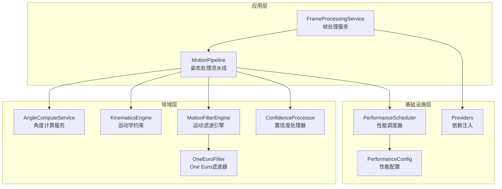
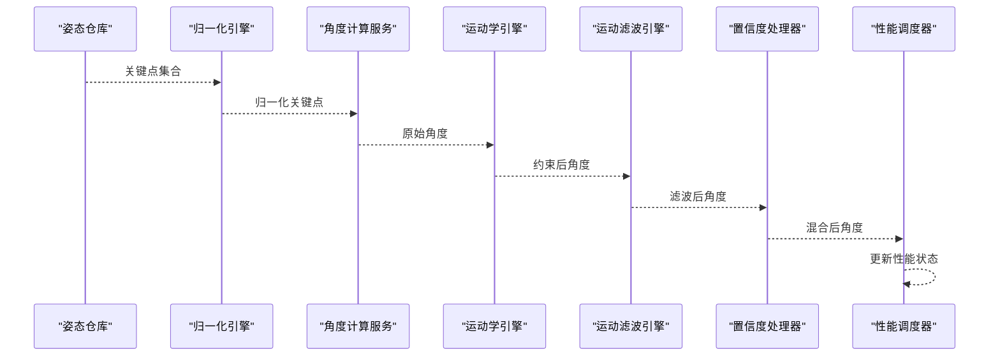
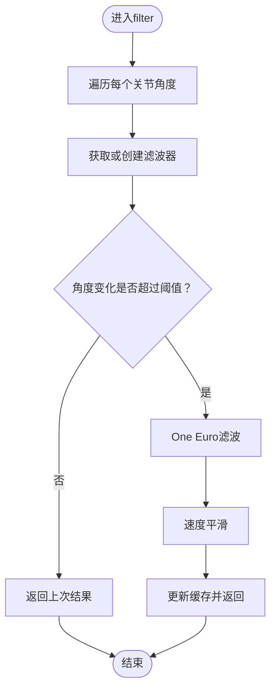
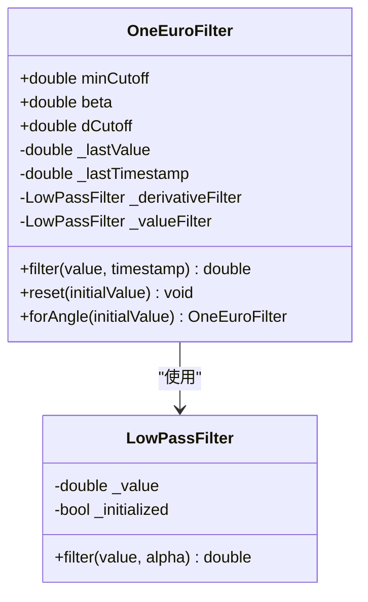
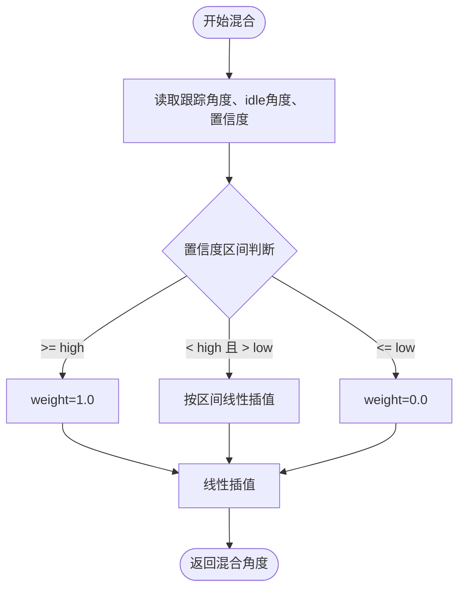
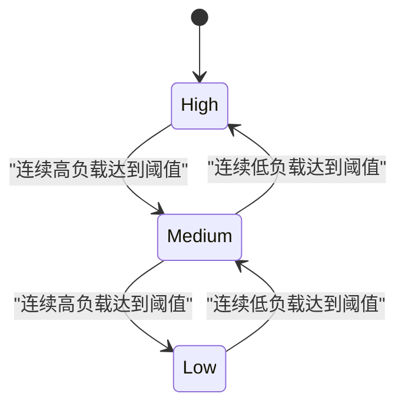
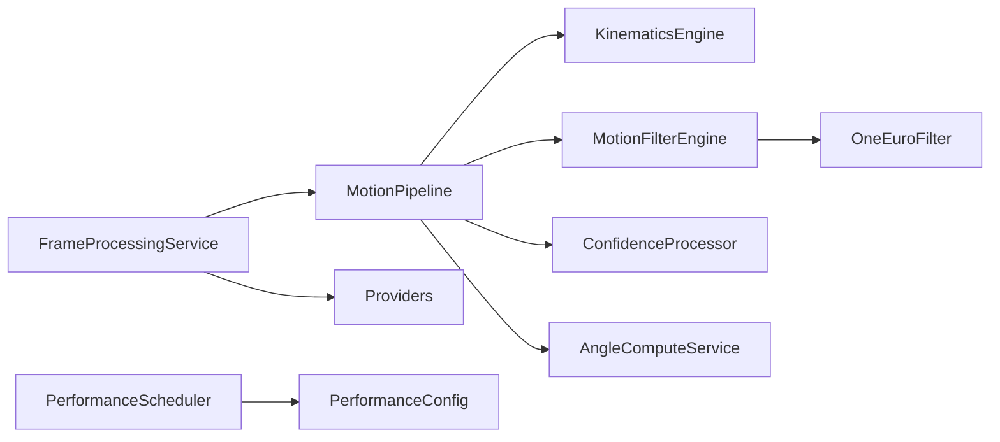

# 运动滤波引擎

<cite>
**本文档引用的文件**
- [motion_filter_engine.dart](file://lib/domain/engines/filtering/motion_filter_engine.dart)
- [one_euro_filter.dart](file://lib/domain/engines/filtering/one_euro_filter.dart)
- [motion_pipeline.dart](file://lib/application/pipeline/motion_pipeline.dart)
- [confidence_processor.dart](file://lib/domain/engines/confidence/confidence_processor.dart)
- [joint_type.dart](file://lib/domain/entities/joint_type.dart)
- [kinematics_engine.dart](file://lib/domain/engines/kinematics/kinematics_engine.dart)
- [performance_scheduler.dart](file://lib/domain/engines/performance/performance_scheduler.dart)
- [performance_config.dart](file://lib/core/config/performance_config.dart)
- [frame_processing_service.dart](file://lib/application/services/frame_processing_service.dart)
- [providers.dart](file://lib/application/providers/providers.dart)
- [settings_page.dart](file://lib/presentation/pages/settings_page.dart)
- [frame_result.dart](file://lib/domain/entities/frame_result.dart)
- [landmark.dart](file://lib/domain/entities/landmark.dart)
- [angle_compute_service.dart](file://lib/domain/services/angle_compute_service.dart)
</cite>

## 目录
1. [简介](#简介)
2. [项目结构](#项目结构)
3. [核心组件](#核心组件)
4. [架构总览](#架构总览)
5. [详细组件分析](#详细组件分析)
6. [依赖关系分析](#依赖关系分析)
7. [性能考虑](#性能考虑)
8. [故障排除指南](#故障排除指南)
9. [结论](#结论)
10. [附录](#附录)

## 简介
本文件面向Mimo项目的运动滤波引擎，系统性阐述多滤波策略组合的实现原理与One Euro滤波器的应用。重点解释滤波引擎如何处理姿态数据中的噪声与抖动，如何通过死区过滤、One Euro滤波与速度平滑三阶段处理实现低延迟、高鲁棒性的角度输出；并说明置信度评估与滤波决策的结合方式，以及在不同场景下的自适应调整策略。文档同时提供参数配置与效果对比建议、实时性能优化与延迟控制机制，并给出代码示例路径以便快速定位实现。

## 项目结构
运动滤波引擎位于领域层的filtering子模块中，与姿态管线、置信度处理、运动学约束、性能调度等模块协同工作。整体采用分层架构：
- 应用层：MotionPipeline串联各引擎，负责端到端流程编排
- 领域层：MotionFilterEngine、OneEuroFilter、ConfidenceProcessor、KinematicsEngine等
- 基础设施层：PerformanceScheduler、PerformanceConfig、Providers等

图表来源
- [motion_pipeline.dart:16-51](file://lib/application/pipeline/motion_pipeline.dart#L16-L51)
- [motion_filter_engine.dart:8-21](file://lib/domain/engines/filtering/motion_filter_engine.dart#L8-L21)
- [one_euro_filter.dart:7-36](file://lib/domain/engines/filtering/one_euro_filter.dart#L7-L36)
- [kinematics_engine.dart:9-29](file://lib/domain/engines/kinematics/kinematics_engine.dart#L9-L29)
- [confidence_processor.dart:6-19](file://lib/domain/engines/confidence/confidence_processor.dart#L6-L19)
- [performance_scheduler.dart:63-86](file://lib/domain/engines/performance/performance_scheduler.dart#L63-L86)
- [performance_config.dart:36-58](file://lib/core/config/performance_config.dart#L36-L58)
- [providers.dart:46-49](file://lib/application/providers/providers.dart#L46-L49)

章节来源
- [motion_pipeline.dart:16-51](file://lib/application/pipeline/motion_pipeline.dart#L16-L51)
- [providers.dart:46-49](file://lib/application/providers/providers.dart#L46-L49)

## 核心组件
- 运动滤波引擎（MotionFilterEngine）：组合死区过滤、One Euro滤波与速度平滑，按关节维度独立维护滤波器实例，输出稳定且低延迟的角度序列。
- One Euro滤波器（OneEuroFilter）：自适应低通滤波器，基于信号变化率动态调整截止频率，兼顾去抖与快速响应。
- 置信度处理器（ConfidenceProcessor）：根据关键点置信度在跟踪角度与idle姿态间进行平滑插值，避免误检导致的跳变。
- 运动学引擎（KinematicsEngine）：对原始角度施加范围与单帧变化量约束，防止不合理的动作突变。
- 性能调度器（PerformanceScheduler）：基于温度、延迟与FPS等指标进行主动降级/升级，保障系统稳定性与实时性。

章节来源
- [motion_filter_engine.dart:8-21](file://lib/domain/engines/filtering/motion_filter_engine.dart#L8-L21)
- [one_euro_filter.dart:7-36](file://lib/domain/engines/filtering/one_euro_filter.dart#L7-L36)
- [confidence_processor.dart:6-19](file://lib/domain/engines/confidence/confidence_processor.dart#L6-L19)
- [kinematics_engine.dart:9-29](file://lib/domain/engines/kinematics/kinematics_engine.dart#L9-L29)
- [performance_scheduler.dart:63-86](file://lib/domain/engines/performance/performance_scheduler.dart#L63-L86)

## 架构总览
滤波引擎在MotionPipeline中被调用，其典型流程如下：

图表来源
- [motion_pipeline.dart:69-129](file://lib/application/pipeline/motion_pipeline.dart#L69-L129)
- [motion_filter_engine.dart:28-48](file://lib/domain/engines/filtering/motion_filter_engine.dart#L28-L48)
- [confidence_processor.dart:29-50](file://lib/domain/engines/confidence/confidence_processor.dart#L29-L50)

## 详细组件分析

### 运动滤波引擎（MotionFilterEngine）
- 多策略组合
  - 死区过滤：当相邻帧角度差小于阈值时直接返回上次结果，抑制微小抖动。
  - One Euro滤波：对每个关节维护独立滤波器，动态调整截止频率，抑制高频噪声。
  - 速度平滑：基于角速度历史计算平均速度，对当前结果进行加权平滑，提升连续性。
- 数据结构与复杂度
  - 每关节维护OneEuroFilter实例，时间复杂度O(1)，空间复杂度O(N关节)。
  - 速度平滑使用长度不超过5的历史窗口，时间/空间均为O(1)。
- 实现要点
  - 首次调用会为缺失的关节创建滤波器并初始化。
  - 支持重置与按关节重置，便于校准或异常恢复。

图表来源
- [motion_filter_engine.dart:28-102](file://lib/domain/engines/filtering/motion_filter_engine.dart#L28-L102)

章节来源
- [motion_filter_engine.dart:8-117](file://lib/domain/engines/filtering/motion_filter_engine.dart#L8-L117)

### One Euro滤波器（OneEuroFilter）
- 自适应原理
  - 估计信号导数并以其绝对值作为增益，动态增大截止频率以允许快速变化，减小截止频率以抑制噪声。
  - 使用两个低通滤波器分别处理信号与导数，确保平滑与响应的平衡。
- 关键参数
  - minCutoff：最小截止频率，决定滤波器的基线平滑程度。
  - beta：导数增益系数，影响自适应灵敏度。
  - dCutoff：导数的截止频率，控制导数滤波强度。
- 实现细节
  - alpha由截止频率与采样间隔推导，保证时变系统的稳定性。
  - 首次调用时初始化导数与值滤波器。

图表来源
- [one_euro_filter.dart:7-112](file://lib/domain/engines/filtering/one_euro_filter.dart#L7-L112)

章节来源
- [one_euro_filter.dart:7-112](file://lib/domain/engines/filtering/one_euro_filter.dart#L7-L112)

### 置信度评估与滤波决策（ConfidenceProcessor）
- 混合策略
  - 高置信度：完全采用跟踪角度。
  - 中等置信度：按权重线性插值于idle与跟踪角度之间。
  - 低置信度：向idle姿态过渡，避免误动作。
- 与滤波的结合
  - 在滤波之后进行置信度混合，既保证了角度的稳定性，又能在不可靠数据时自然退化到idle姿态。
- 入口与使用
  - MotionPipeline在滤波后对每个关节执行blend操作，使用关键点可见度作为权重。

图表来源
- [confidence_processor.dart:29-50](file://lib/domain/engines/confidence/confidence_processor.dart#L29-L50)
- [motion_pipeline.dart:101-112](file://lib/application/pipeline/motion_pipeline.dart#L101-L112)

章节来源
- [confidence_processor.dart:6-91](file://lib/domain/engines/confidence/confidence_processor.dart#L6-L91)
- [motion_pipeline.dart:101-112](file://lib/application/pipeline/motion_pipeline.dart#L101-L112)

### 关节约束与滤波顺序（KinematicsEngine）
- 作用
  - 将原始角度限制在合理范围内，并限制单帧最大变化量，防止动作突变。
- 与滤波的关系
  - 在滤波之前应用约束，确保后续滤波仅处理“合理”的角度序列，减少异常值的影响。
- 默认约束
  - 肩关节：全幅度范围，单帧最大变化约±25°。
  - 肘关节：0–150°，单帧最大变化约±25°。

章节来源
- [kinematics_engine.dart:31-81](file://lib/domain/engines/kinematics/kinematics_engine.dart#L31-L81)

### 性能调度与实时性控制
- 主动降级/升级
  - 基于温度、延迟与FPS阈值，周期性统计连续高/低负载帧数，触发性能级别切换。
- 与滤波的配合
  - 通过降低推理帧率或分辨率，减轻滤波与整体管线的计算压力，维持目标渲染帧率。
- 配置项
  - 目标/降级/最低推理帧率、温度与延迟阈值、分辨率等级等。

图表来源
- [performance_scheduler.dart:148-180](file://lib/domain/engines/performance/performance_scheduler.dart#L148-L180)
- [performance_config.dart:36-58](file://lib/core/config/performance_config.dart#L36-L58)

章节来源
- [performance_scheduler.dart:90-129](file://lib/domain/engines/performance/performance_scheduler.dart#L90-L129)
- [performance_config.dart:1-79](file://lib/core/config/performance_config.dart#L1-L79)

## 依赖关系分析
- 组件耦合
  - MotionPipeline对各引擎存在强依赖，但通过Provider解耦，便于替换与测试。
  - MotionFilterEngine依赖OneEuroFilter与关节类型，内部按关节维度隔离状态。
  - ConfidenceProcessor与MotionPipeline在混合阶段耦合，但逻辑清晰。
- 外部依赖
  - 无第三方滤波库依赖，核心算法自实现，便于定制与审计。

图表来源
- [motion_pipeline.dart:16-51](file://lib/application/pipeline/motion_pipeline.dart#L16-L51)
- [motion_filter_engine.dart:8-21](file://lib/domain/engines/filtering/motion_filter_engine.dart#L8-L21)
- [providers.dart:46-49](file://lib/application/providers/providers.dart#L46-L49)

章节来源
- [motion_pipeline.dart:16-51](file://lib/application/pipeline/motion_pipeline.dart#L16-L51)
- [providers.dart:46-49](file://lib/application/providers/providers.dart#L46-L49)

## 性能考虑
- 实时性保障
  - One Euro滤波器的自适应特性在噪声与抖动之间取得平衡，避免过度平滑导致的延迟。
  - 死区过滤减少无效计算，速度平滑使用固定长度历史窗口，复杂度可控。
- 延迟控制
  - MotionPipeline在每帧结束后更新性能调度器，根据处理耗时动态调整推理帧率与分辨率，维持目标渲染帧率。
- 参数调优建议
  - minCutoff：增大使更平滑但响应更慢；减小使响应更快但噪声更多。
  - beta：增大使导数增益更强，自适应更敏感；过大会放大噪声。
  - dCutoff：增大导数平滑，有助于抑制瞬时尖峰。
  - deadZoneThreshold：增大可进一步抑制微小抖动，但可能错过细微动作。
  - velocitySmoothing：增大提升连续性，但可能引入轻微拖尾。

章节来源
- [motion_filter_engine.dart:18-21](file://lib/domain/engines/filtering/motion_filter_engine.dart#L18-L21)
- [one_euro_filter.dart:29-36](file://lib/domain/engines/filtering/one_euro_filter.dart#L29-L36)
- [performance_scheduler.dart:90-129](file://lib/domain/engines/performance/performance_scheduler.dart#L90-L129)

## 故障排除指南
- 滤波后角度出现跳变
  - 检查死区阈值是否过大，导致微小变化被忽略；适当减小阈值。
  - 检查One Euro滤波参数，尤其是minCutoff与beta，避免过度平滑或响应不足。
- 滤波后角度持续拖尾
  - 减小velocitySmoothing或增大minCutoff，提高响应速度。
- 置信度混合效果不佳
  - 调整高低置信度阈值，使混合过渡更符合预期。
- 性能不稳定
  - 检查PerformanceScheduler的阈值与连续帧计数，确认降级/升级触发逻辑正常。

章节来源
- [motion_filter_engine.dart:56-72](file://lib/domain/engines/filtering/motion_filter_engine.dart#L56-L72)
- [confidence_processor.dart:34-50](file://lib/domain/engines/confidence/confidence_processor.dart#L34-L50)
- [performance_scheduler.dart:132-146](file://lib/domain/engines/performance/performance_scheduler.dart#L132-L146)

## 结论
Mimo的运动滤波引擎通过“死区过滤 + One Euro滤波 + 速度平滑”的组合策略，在保证低延迟的同时显著抑制噪声与抖动。置信度处理器与滤波结果的融合提升了系统在弱观测条件下的鲁棒性。性能调度器的主动降级/升级机制确保了在不同硬件条件下的一致体验。通过合理配置参数与利用现有Provider体系，开发者可在不同场景下实现自适应优化。

## 附录

### 参数配置与使用示例（代码路径）
- One Euro滤波器参数
  - [OneEuroFilter构造参数:29-36](file://lib/domain/engines/filtering/one_euro_filter.dart#L29-L36)
  - [静态工厂forAngle:83-92](file://lib/domain/engines/filtering/one_euro_filter.dart#L83-L92)
- 运动滤波引擎参数
  - [MotionFilterEngine构造参数:18-21](file://lib/domain/engines/filtering/motion_filter_engine.dart#L18-L21)
  - [filter方法入口:28-48](file://lib/domain/engines/filtering/motion_filter_engine.dart#L28-L48)
- 置信度混合
  - [ConfidenceProcessor.blend:29-50](file://lib/domain/engines/confidence/confidence_processor.dart#L29-L50)
  - [MotionPipeline中的混合调用:101-112](file://lib/application/pipeline/motion_pipeline.dart#L101-L112)
- 性能调度
  - [PerformanceScheduler.update:96-129](file://lib/domain/engines/performance/performance_scheduler.dart#L96-L129)
  - [PerformanceConfig配置项:36-58](file://lib/core/config/performance_config.dart#L36-L58)
- 依赖注入
  - [motionFilterEngineProvider:46-49](file://lib/application/providers/providers.dart#L46-L49)
- 设置保存（参数持久化）
  - [settings_page中保存滤波参数:52-63](file://lib/presentation/pages/settings_page.dart#L52-L63)

### 数据模型与实体
- 关节类型
  - [JointType枚举与分组:4-56](file://lib/domain/entities/joint_type.dart#L4-L56)
- 帧结果
  - [FrameResult结构:7-25](file://lib/domain/entities/frame_result.dart#L7-L25)
- 关键点实体
  - [Landmark结构:4-22](file://lib/domain/entities/landmark.dart#L4-L22)

章节来源
- [joint_type.dart:4-56](file://lib/domain/entities/joint_type.dart#L4-L56)
- [frame_result.dart:7-25](file://lib/domain/entities/frame_result.dart#L7-L25)
- [landmark.dart:4-22](file://lib/domain/entities/landmark.dart#L4-L22)