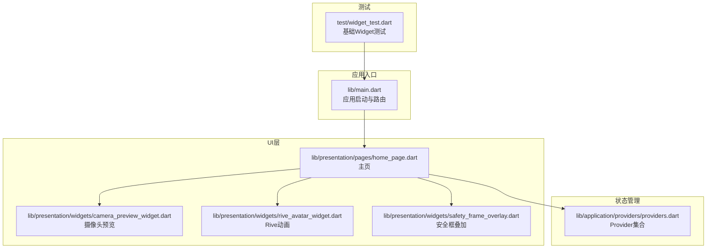
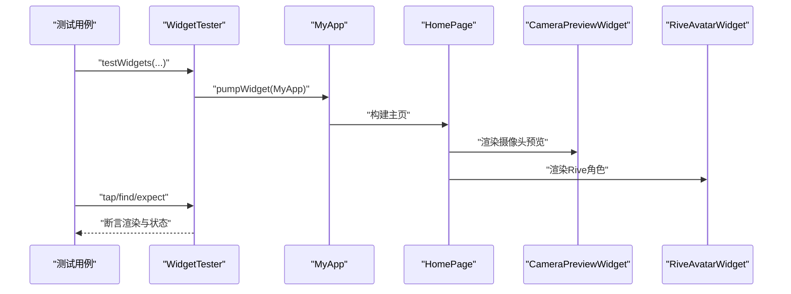
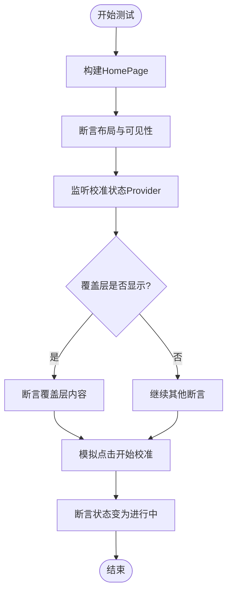
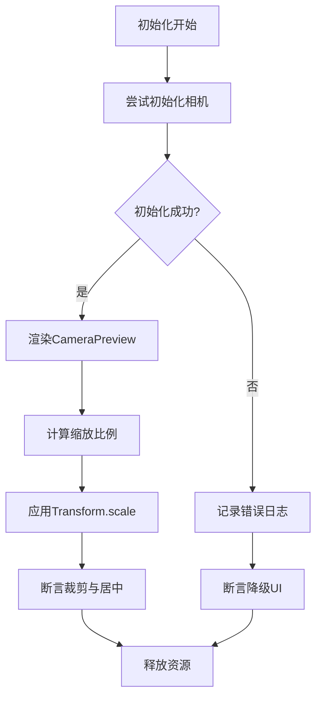
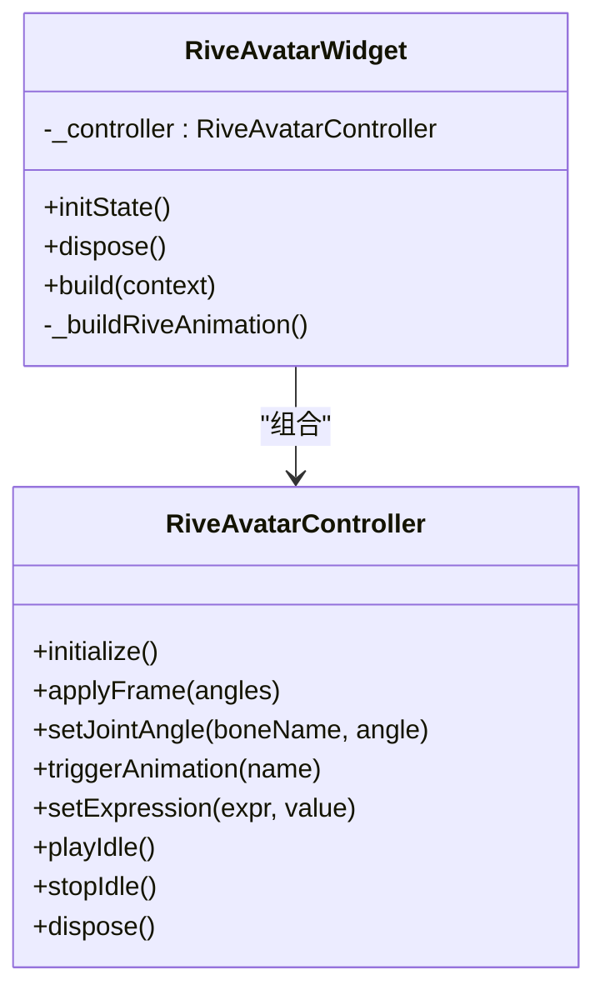
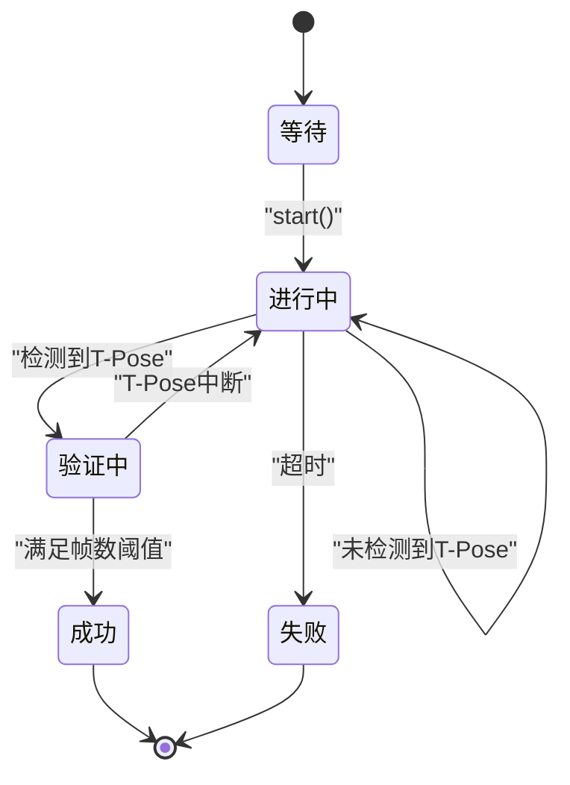
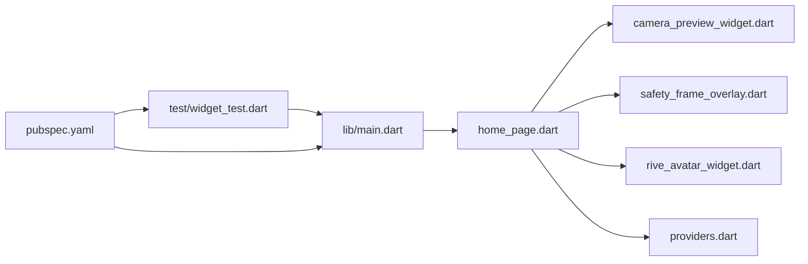

# UI测试

<cite>
**本文引用的文件**
- [lib/main.dart](file://lib/main.dart)
- [test/widget_test.dart](file://test/widget_test.dart)
- [pubspec.yaml](file://pubspec.yaml)
- [analysis_options.yaml](file://analysis_options.yaml)
- [lib/presentation/pages/home_page.dart](file://lib/presentation/pages/home_page.dart)
- [lib/presentation/widgets/camera_preview_widget.dart](file://lib/presentation/widgets/camera_preview_widget.dart)
- [lib/presentation/widgets/rive_avatar_widget.dart](file://lib/presentation/widgets/rive_avatar_widget.dart)
- [lib/presentation/widgets/safety_frame_overlay.dart](file://lib/presentation/widgets/safety_frame_overlay.dart)
- [lib/application/providers/providers.dart](file://lib/application/providers/providers.dart)
- [lib/domain/engines/calibration/calibration_engine.dart](file://lib/domain/engines/calibration/calibration_engine.dart)
- [lib/domain/entities/body_metrics.dart](file://lib/domain/entities/body_metrics.dart)
</cite>

## 目录
1. [简介](#简介)
2. [项目结构](#项目结构)
3. [核心组件](#核心组件)
4. [架构总览](#架构总览)
5. [详细组件分析](#详细组件分析)
6. [依赖关系分析](#依赖关系分析)
7. [性能考量](#性能考量)
8. [故障排查指南](#故障排查指南)
9. [结论](#结论)
10. [附录](#附录)

## 简介
本文件面向Mimo项目的UI测试，系统化阐述Flutter Widget测试框架的使用与配置策略，聚焦表现层组件的测试方法与最佳实践。文档围绕以下目标展开：
- 使用Flutter Widget测试框架进行组件渲染、交互与状态变更验证
- 针对主页、摄像头预览组件与Rive动画组件的测试策略
- 用户交互测试：按钮点击、手势与状态变化
- 响应式设计与多尺寸屏幕适配测试
- 异步UI更新与状态管理的测试处理
- 可访问性与跨平台UI兼容性验证
- 测试自动化与持续集成中的配置建议

## 项目结构
Mimo采用分层架构，UI层位于lib/presentation目录，包含页面与可复用小部件；状态管理通过Riverpod Provider体系实现；测试入口位于test/widget_test.dart。

**图表来源**
- [lib/main.dart:1-34](file://lib/main.dart#L1-L34)
- [lib/presentation/pages/home_page.dart:1-215](file://lib/presentation/pages/home_page.dart#L1-L215)
- [lib/presentation/widgets/camera_preview_widget.dart:1-76](file://lib/presentation/widgets/camera_preview_widget.dart#L1-L76)
- [lib/presentation/widgets/rive_avatar_widget.dart:1-118](file://lib/presentation/widgets/rive_avatar_widget.dart#L1-L118)
- [lib/presentation/widgets/safety_frame_overlay.dart:1-49](file://lib/presentation/widgets/safety_frame_overlay.dart#L1-L49)
- [lib/application/providers/providers.dart:1-103](file://lib/application/providers/providers.dart#L1-L103)
- [test/widget_test.dart:1-31](file://test/widget_test.dart#L1-L31)

**章节来源**
- [lib/main.dart:1-34](file://lib/main.dart#L1-L34)
- [test/widget_test.dart:1-31](file://test/widget_test.dart#L1-L31)

## 核心组件
- 应用入口与路由：应用在入口处注册主题、路由表，并通过ProviderScope提供状态上下文。
- 主页（Home Page）：聚合摄像头预览、安全框叠加与Rive角色层，顶部显示FPS与设置入口；根据校准状态控制覆盖层显隐。
- 摄像头预览组件（Camera Preview Widget）：负责初始化相机、处理缩放与裁剪，渲染CameraPreview。
- Rive动画组件（Rive Avatar Widget）：封装RiveAvatarController，负责加载动画资源、监听姿态数据并驱动骨骼。
- 安全框叠加（Safety Frame Overlay）：自定义绘制安全框，辅助用户定位。
- Provider体系：集中管理各引擎与状态，如校准状态、人体度量、当前FPS等。

**章节来源**
- [lib/main.dart:11-34](file://lib/main.dart#L11-L34)
- [lib/presentation/pages/home_page.dart:9-215](file://lib/presentation/pages/home_page.dart#L9-L215)
- [lib/presentation/widgets/camera_preview_widget.dart:7-76](file://lib/presentation/widgets/camera_preview_widget.dart#L7-L76)
- [lib/presentation/widgets/rive_avatar_widget.dart:9-118](file://lib/presentation/widgets/rive_avatar_widget.dart#L9-L118)
- [lib/presentation/widgets/safety_frame_overlay.dart:3-49](file://lib/presentation/widgets/safety_frame_overlay.dart#L3-L49)
- [lib/application/providers/providers.dart:16-103](file://lib/application/providers/providers.dart#L16-L103)

## 架构总览
下图展示了UI测试视角下的关键交互路径：测试通过WidgetTester构建应用树，触发交互事件，观察组件渲染与状态变化。

**图表来源**
- [test/widget_test.dart:13-30](file://test/widget_test.dart#L13-L30)
- [lib/main.dart:11-34](file://lib/main.dart#L11-L34)
- [lib/presentation/pages/home_page.dart:38-88](file://lib/presentation/pages/home_page.dart#L38-L88)
- [lib/presentation/widgets/camera_preview_widget.dart:44-61](file://lib/presentation/widgets/camera_preview_widget.dart#L44-L61)
- [lib/presentation/widgets/rive_avatar_widget.dart:96-118](file://lib/presentation/widgets/rive_avatar_widget.dart#L96-L118)

## 详细组件分析

### 主页（home_page.dart）测试要点
- 渲染验证：断言背景色、Stack布局、子组件位置与可见性。
- 状态联动：监听校准状态Provider，验证覆盖层显隐逻辑。
- 顶部栏：断言标题文本、FPS指示器文本格式与颜色、设置按钮存在。
- 交互验证：触发开始校准按钮，断言校准状态切换至进行中。

**图表来源**
- [lib/presentation/pages/home_page.dart:38-215](file://lib/presentation/pages/home_page.dart#L38-L215)
- [lib/application/providers/providers.dart:85-88](file://lib/application/providers/providers.dart#L85-L88)

**章节来源**
- [lib/presentation/pages/home_page.dart:38-215](file://lib/presentation/pages/home_page.dart#L38-L215)
- [lib/application/providers/providers.dart:85-88](file://lib/application/providers/providers.dart#L85-L88)

### 摄像头预览组件（camera_preview_widget.dart）测试要点
- 初始化流程：等待相机初始化完成，断言加载指示器消失与CameraPreview渲染。
- 异常处理：模拟初始化失败场景，断言日志输出与错误兜底UI。
- 缩放与裁剪：基于设备屏幕与相机纵横比计算缩放比例，断言Transform.scale与ClipRect行为。
- 生命周期：验证dispose时释放资源。

**图表来源**
- [lib/presentation/widgets/camera_preview_widget.dart:25-76](file://lib/presentation/widgets/camera_preview_widget.dart#L25-L76)

**章节来源**
- [lib/presentation/widgets/camera_preview_widget.dart:15-76](file://lib/presentation/widgets/camera_preview_widget.dart#L15-L76)

### Rive动画组件（rive_avatar_widget.dart）测试要点
- 资源加载：断言RiveAnimation.asset资源路径与fit策略。
- 控制器生命周期：验证initialize与dispose调用顺序。
- 数据驱动：监听bodyMetricsProvider，断言控制器applyFrame被调用（可通过mock验证）。
- 动画触发：断言playIdle/triggerAnimation等接口调用（可通过mock验证）。

**图表来源**
- [lib/presentation/widgets/rive_avatar_widget.dart:9-118](file://lib/presentation/widgets/rive_avatar_widget.dart#L9-L118)

**章节来源**
- [lib/presentation/widgets/rive_avatar_widget.dart:74-118](file://lib/presentation/widgets/rive_avatar_widget.dart#L74-L118)

### 安全框叠加（safety_frame_overlay.dart）测试要点
- 自定义绘制：断言CustomPaint与自定义Painter绘制的矩形与圆角半径。
- 文本提示：断言“请站在框内”文本的颜色与字号。
- 绘制有效性：断言shouldRepaint返回值与绘制缓存策略。

**章节来源**
- [lib/presentation/widgets/safety_frame_overlay.dart:6-49](file://lib/presentation/widgets/safety_frame_overlay.dart#L6-L49)

### 校准引擎与状态（calibration_engine.dart、providers.dart）测试要点
- 校准状态机：断言状态枚举与状态流转（waiting/detecting/tPoseDetected/calibrating/inProgress/verifying/success/failed）。
- 校准流程：输入关键点，断言processFrame返回的CalibrationResult与状态变化。
- Provider状态：断言calibrationStatusProvider与bodyMetricsProvider在不同输入下的状态变化。

**图表来源**
- [lib/domain/engines/calibration/calibration_engine.dart:7-32](file://lib/domain/engines/calibration/calibration_engine.dart#L7-L32)
- [lib/domain/engines/calibration/calibration_engine.dart:106-176](file://lib/domain/engines/calibration/calibration_engine.dart#L106-L176)
- [lib/application/providers/providers.dart:85-93](file://lib/application/providers/providers.dart#L85-L93)

**章节来源**
- [lib/domain/engines/calibration/calibration_engine.dart:62-302](file://lib/domain/engines/calibration/calibration_engine.dart#L62-L302)
- [lib/application/providers/providers.dart:85-93](file://lib/application/providers/providers.dart#L85-L93)

## 依赖关系分析
- 测试依赖：flutter_test提供WidgetTester；flutter与flutter_riverpod为UI与状态管理基础。
- 组件依赖：HomePage依赖CameraPreviewWidget、SafetyFrameOverlay与RiveAvatarWidget；三者通过Provider体系共享状态。
- 资源依赖：Rive动画资源与声音资源在pubspec中声明。

**图表来源**
- [test/widget_test.dart:8-11](file://test/widget_test.dart#L8-L11)
- [pubspec.yaml:30-80](file://pubspec.yaml#L30-L80)
- [lib/main.dart:1-9](file://lib/main.dart#L1-L9)
- [lib/presentation/pages/home_page.dart:1-8](file://lib/presentation/pages/home_page.dart#L1-L8)
- [lib/application/providers/providers.dart:1-14](file://lib/application/providers/providers.dart#L1-L14)

**章节来源**
- [pubspec.yaml:30-80](file://pubspec.yaml#L30-L80)
- [lib/application/providers/providers.dart:16-83](file://lib/application/providers/providers.dart#L16-L83)

## 性能考量
- 渲染性能：避免在build中执行昂贵计算，将复杂逻辑移至initState或异步任务。
- 动画与绘制：Rive动画与CustomPainter应尽量减少重绘，合理使用shouldRepaint。
- 测试性能：使用tester.pump()与tester.pumpWidget()最小化触发重建次数，批量断言。
- 资源加载：在测试中可替换真实资源为轻量资源或占位符，缩短测试时间。

## 故障排查指南
- 相机初始化失败：检查权限与设备可用性；在测试中模拟异常路径，断言错误日志与降级UI。
- Rive资源加载失败：确认pubspec中assets路径与文件名一致；在测试中断言资源路径与fit策略。
- 状态不更新：确认Provider状态变更是否通过notifier.state或引用同一Provider实例；在测试中使用tester.pump()等待重建。
- 绘制异常：检查CustomPainter的shouldRepaint与绘制参数；在测试中断言绘制区域与颜色。

**章节来源**
- [lib/presentation/widgets/camera_preview_widget.dart:25-35](file://lib/presentation/widgets/camera_preview_widget.dart#L25-L35)
- [lib/presentation/widgets/rive_avatar_widget.dart:112-117](file://lib/presentation/widgets/rive_avatar_widget.dart#L112-L117)
- [lib/application/providers/providers.dart:85-93](file://lib/application/providers/providers.dart#L85-L93)

## 结论
通过对Mimo UI层组件的系统化测试设计，可以有效保障主页、摄像头预览与Rive动画在不同屏幕尺寸与状态下的稳定性与一致性。结合Provider状态管理与自定义绘制组件，建议在测试中重点关注异步初始化、状态机流转与资源加载路径，并通过Mock与占位资源提升测试效率与可维护性。

## 附录

### UI测试用例示例（路径指引）
- 基础计数器冒烟测试：[test/widget_test.dart:13-30](file://test/widget_test.dart#L13-L30)
- 主页渲染与覆盖层：[lib/presentation/pages/home_page.dart:38-215](file://lib/presentation/pages/home_page.dart#L38-L215)
- 摄像头预览初始化与缩放：[lib/presentation/widgets/camera_preview_widget.dart:25-76](file://lib/presentation/widgets/camera_preview_widget.dart#L25-L76)
- Rive动画资源与控制器：[lib/presentation/widgets/rive_avatar_widget.dart:96-118](file://lib/presentation/widgets/rive_avatar_widget.dart#L96-L118)
- 安全框绘制与文本：[lib/presentation/widgets/safety_frame_overlay.dart:10-23](file://lib/presentation/widgets/safety_frame_overlay.dart#L10-L23)
- Provider状态与校准流程：[lib/application/providers/providers.dart:85-93](file://lib/application/providers/providers.dart#L85-L93)、[lib/domain/engines/calibration/calibration_engine.dart:106-176](file://lib/domain/engines/calibration/calibration_engine.dart#L106-L176)

### 响应式设计与多尺寸适配
- 使用MediaQuery动态计算高度与宽度，断言不同尺寸下的布局比例与元素位置。
- 在测试中通过调整模拟设备尺寸或手动设置MediaQuery，验证组件在小屏与大屏上的表现。

### 异步UI更新与状态管理
- 使用tester.pump()与tester.pumpWidget()推进帧，等待异步初始化与状态更新。
- 对于Provider状态，先断言初始值，再触发状态变更，最后断言新值与UI同步。

### 可访问性与跨平台兼容
- 文本颜色对比度与图标可见性：断言颜色值与尺寸，确保在深色/浅色主题下可读。
- 跨平台：在Android/iOS/Web环境下分别运行测试，关注平台差异（如相机权限、资源路径）。