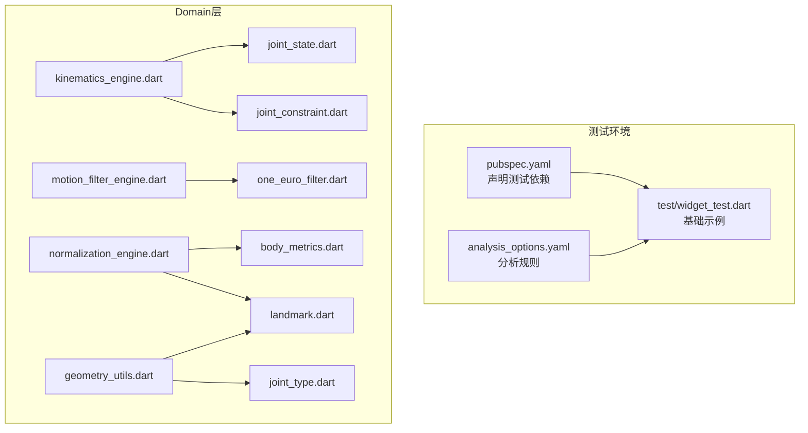
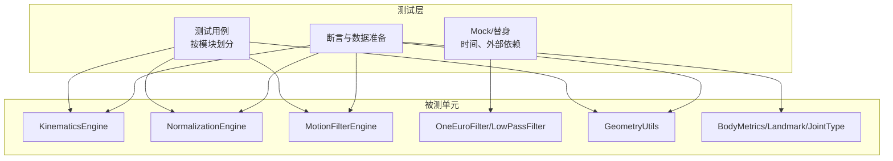
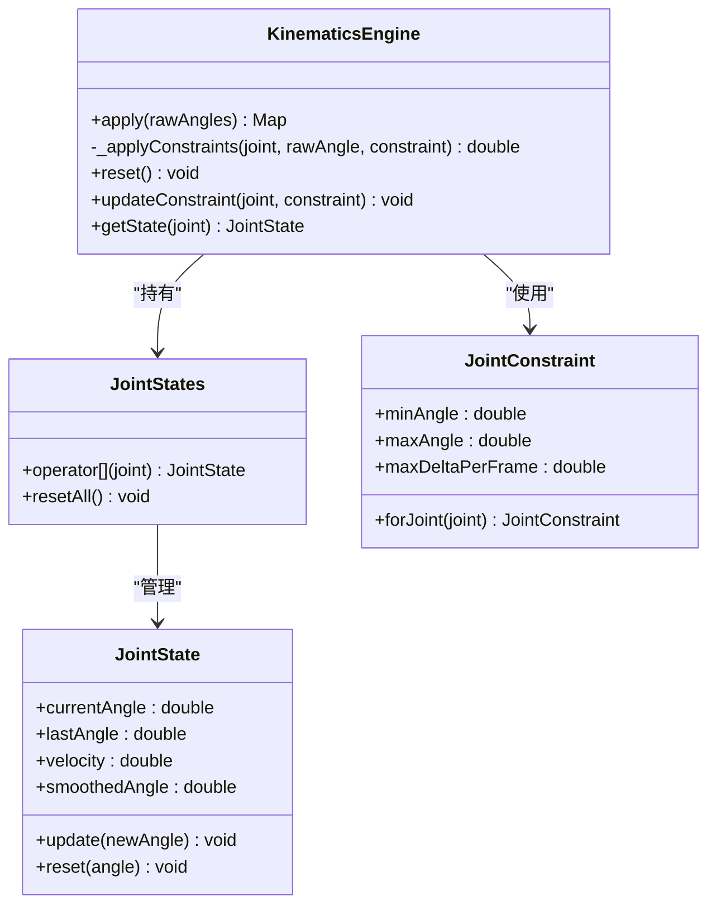
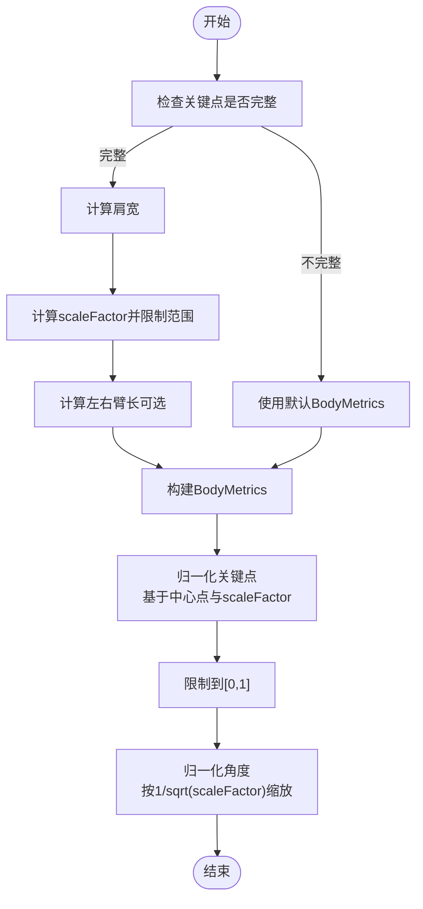
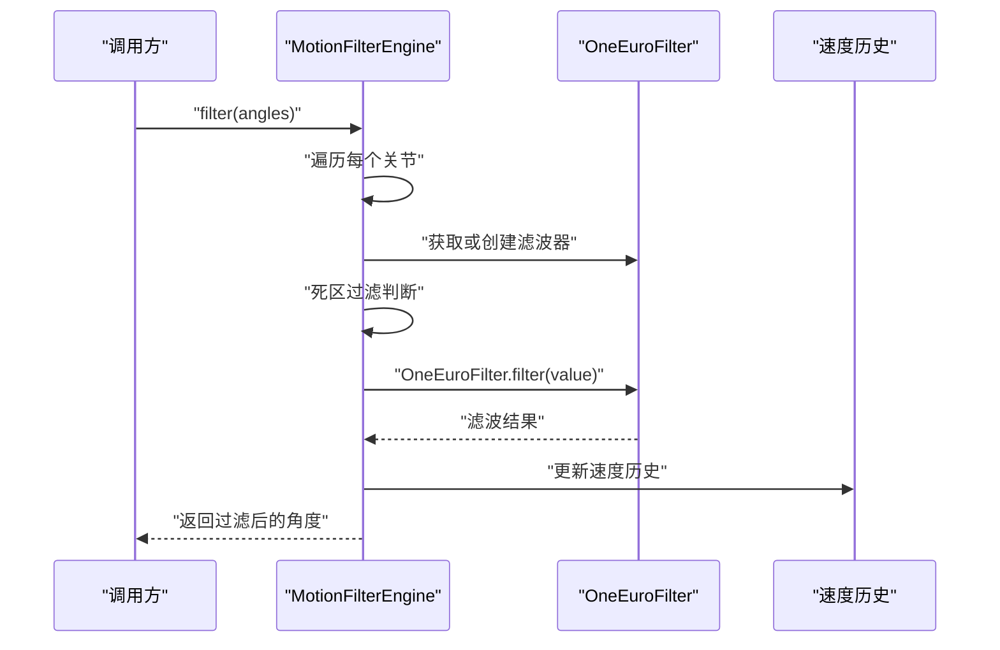
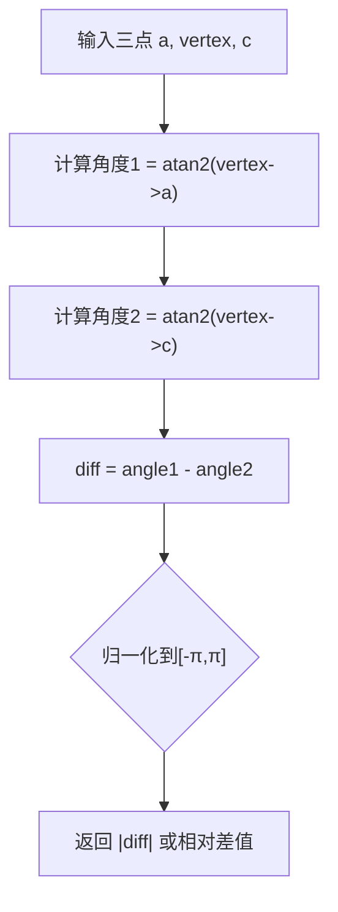
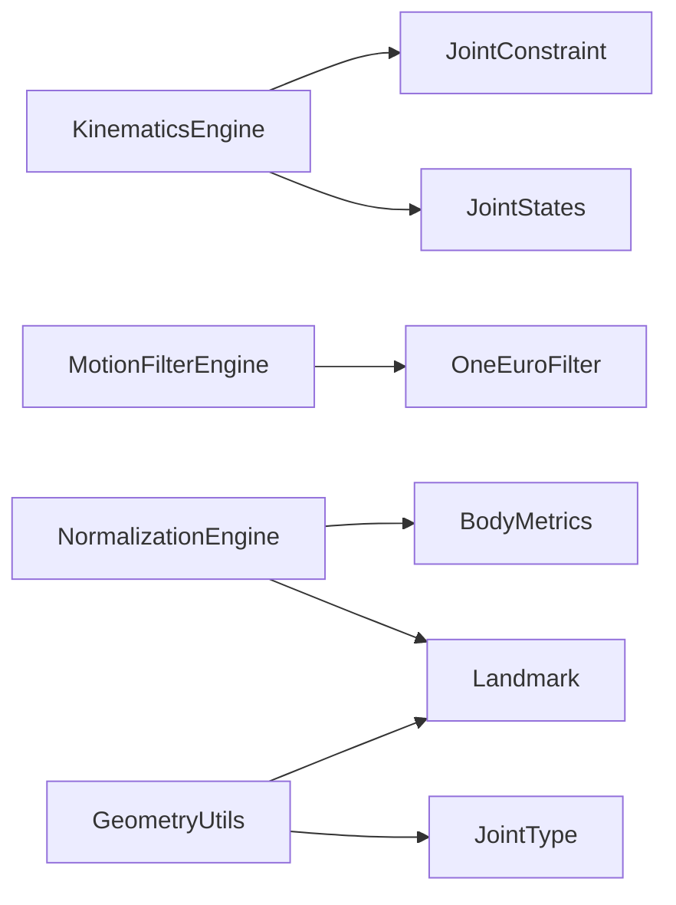

# 单元测试

<cite>
**本文引用的文件**
- [pubspec.yaml](file://pubspec.yaml)
- [analysis_options.yaml](file://analysis_options.yaml)
- [widget_test.dart](file://test/widget_test.dart)
- [kinematics_engine.dart](file://lib/domain/engines/kinematics/kinematics_engine.dart)
- [joint_constraint.dart](file://lib/domain/engines/kinematics/joint_constraint.dart)
- [joint_state.dart](file://lib/domain/engines/kinematics/joint_state.dart)
- [normalization_engine.dart](file://lib/domain/engines/normalization/normalization_engine.dart)
- [motion_filter_engine.dart](file://lib/domain/engines/filtering/motion_filter_engine.dart)
- [one_euro_filter.dart](file://lib/domain/engines/filtering/one_euro_filter.dart)
- [geometry_utils.dart](file://lib/core/utils/geometry_utils.dart)
- [body_metrics.dart](file://lib/domain/entities/body_metrics.dart)
- [landmark.dart](file://lib/domain/entities/landmark.dart)
- [joint_type.dart](file://lib/domain/entities/joint_type.dart)
</cite>

## 目录
1. [简介](#简介)
2. [项目结构](#项目结构)
3. [核心组件](#核心组件)
4. [架构总览](#架构总览)
5. [详细组件分析](#详细组件分析)
6. [依赖分析](#依赖分析)
7. [性能考量](#性能考量)
8. [故障排查指南](#故障排查指南)
9. [结论](#结论)
10. [附录](#附录)

## 简介
本文件面向Mimo项目的单元测试，系统性说明测试框架选择与配置、Domain层核心引擎（kinematics_engine.dart、normalization_engine.dart、motion_filter_engine.dart）的测试策略、工具类与实体类的测试方法、Mock与测试替身的使用、断言与数据准备的最佳实践，并给出高覆盖率与测试隔离的实现建议。目标是帮助开发者以最小耦合、可维护的方式构建高质量的单元测试。

## 项目结构
- 测试框架与配置
  - Flutter测试框架通过dev_dependencies声明，位于pubspec.yaml中，确保在测试环境中可用。
  - 分析选项由analysis_options.yaml统一管理，推荐启用Flutter Lints以提升代码质量。
- 测试入口与示例
  - test目录下存在基础的widget测试示例，演示了Flutter测试的基本流程与断言方式。
- Domain层核心引擎与工具类
  - Domain层包含kinematics、normalization、filtering三大引擎，以及相关的实体与工具类，是单元测试的重点覆盖区域。

图表来源
- [pubspec.yaml:61-67](file://pubspec.yaml#L61-L67)
- [analysis_options.yaml:10](file://analysis_options.yaml#L10)
- [widget_test.dart:13-30](file://test/widget_test.dart#L13-L30)
- [kinematics_engine.dart:9-95](file://lib/domain/engines/kinematics/kinematics_engine.dart#L9-L95)
- [motion_filter_engine.dart:8-117](file://lib/domain/engines/filtering/motion_filter_engine.dart#L8-L117)
- [normalization_engine.dart:9-143](file://lib/domain/engines/normalization/normalization_engine.dart#L9-L143)
- [one_euro_filter.dart:7-112](file://lib/domain/engines/filtering/one_euro_filter.dart#L7-L112)
- [geometry_utils.dart:6-117](file://lib/core/utils/geometry_utils.dart#L6-L117)
- [body_metrics.dart:4-109](file://lib/domain/entities/body_metrics.dart#L4-L109)
- [landmark.dart:4-87](file://lib/domain/entities/landmark.dart#L4-L87)
- [joint_type.dart:4-66](file://lib/domain/entities/joint_type.dart#L4-L66)
- [joint_constraint.dart:4-47](file://lib/domain/engines/kinematics/joint_constraint.dart#L4-L47)
- [joint_state.dart:6-99](file://lib/domain/engines/kinematics/joint_state.dart#L6-L99)

章节来源
- [pubspec.yaml:61-67](file://pubspec.yaml#L61-L67)
- [analysis_options.yaml:10](file://analysis_options.yaml#L10)
- [widget_test.dart:13-30](file://test/widget_test.dart#L13-L30)

## 核心组件
- 测试框架与配置
  - 使用flutter_test作为核心测试包，配合Flutter SDK版本要求，确保在多平台（Android/iOS/Web/Linux/macOS/Windows）上的一致性。
  - 建议在项目根目录添加test目录并遵循按功能分层的测试组织方式（例如：test/domain/engines、test/core/utils等），便于定位与维护。
- 断言与匹配
  - 使用expect进行断言；结合find系列（如find.text、find.byIcon）验证UI状态；对数值比较建议使用近似相等或误差区间，避免浮点精度问题。
- 异步与时间
  - 对涉及时间戳的滤波器（OneEuroFilter）建议使用fake或mock时钟，或通过可控的输入序列验证稳定性与收敛性。

章节来源
- [pubspec.yaml:21-23](file://pubspec.yaml#L21-L23)
- [pubspec.yaml:61-67](file://pubspec.yaml#L61-L67)
- [analysis_options.yaml:10](file://analysis_options.yaml#L10)
- [widget_test.dart:13-30](file://test/widget_test.dart#L13-L30)

## 架构总览
单元测试围绕Domain层核心引擎与工具类展开，通过隔离外部依赖（如摄像头、网络、数据库）与时间因素，专注于纯函数与状态机的行为验证。

图表来源
- [kinematics_engine.dart:9-95](file://lib/domain/engines/kinematics/kinematics_engine.dart#L9-L95)
- [normalization_engine.dart:9-143](file://lib/domain/engines/normalization/normalization_engine.dart#L9-L143)
- [motion_filter_engine.dart:8-117](file://lib/domain/engines/filtering/motion_filter_engine.dart#L8-L117)
- [one_euro_filter.dart:7-112](file://lib/domain/engines/filtering/one_euro_filter.dart#L7-L112)
- [geometry_utils.dart:6-117](file://lib/core/utils/geometry_utils.dart#L6-L117)
- [body_metrics.dart:4-109](file://lib/domain/entities/body_metrics.dart#L4-L109)
- [landmark.dart:4-87](file://lib/domain/entities/landmark.dart#L4-L87)
- [joint_type.dart:4-66](file://lib/domain/entities/joint_type.dart#L4-L66)

## 详细组件分析

### 运动学引擎（KinematicsEngine）测试策略
- 覆盖要点
  - 角度范围约束：输入超出约束范围时，输出应被裁剪至允许区间。
  - 单帧变化量限制：当变化超过maxDeltaPerFrame时，输出应被限制在允许范围内。
  - 状态更新：每次调用后JointState应正确更新currentAngle、lastAngle与velocity，并维护历史记录。
  - 默认约束与自定义约束：验证默认肩/肘约束与updateConstraint行为。
  - reset：重置后状态应恢复初始值。
- 测试数据与断言
  - 使用边界值（minAngle、maxAngle、±maxDeltaPerFrame）构造输入，验证裁剪与限幅。
  - 使用连续帧输入验证历史记录长度与平滑效果（若JointState暴露smoothedAngle）。
- Mock与替身
  - 若需验证状态持久化，可在测试中直接访问states内部结构或通过getState获取状态对象。
- 典型用例路径
  - 角度裁剪与变化量限制：[apply/_applyConstraints:36-81](file://lib/domain/engines/kinematics/kinematics_engine.dart#L36-L81)
  - 状态管理：[JointState.update:30-40](file://lib/domain/engines/kinematics/joint_state.dart#L30-L40)
  - 约束配置：[JointConstraint.forJoint:35-46](file://lib/domain/engines/kinematics/joint_constraint.dart#L35-L46)

图表来源
- [kinematics_engine.dart:9-95](file://lib/domain/engines/kinematics/kinematics_engine.dart#L9-L95)
- [joint_state.dart:6-99](file://lib/domain/engines/kinematics/joint_state.dart#L6-L99)
- [joint_constraint.dart:4-47](file://lib/domain/engines/kinematics/joint_constraint.dart#L4-L47)

章节来源
- [kinematics_engine.dart:36-81](file://lib/domain/engines/kinematics/kinematics_engine.dart#L36-L81)
- [joint_state.dart:30-46](file://lib/domain/engines/kinematics/joint_state.dart#L30-L46)
- [joint_constraint.dart:35-46](file://lib/domain/engines/kinematics/joint_constraint.dart#L35-L46)

### 归一化引擎（NormalizationEngine）测试策略
- 覆盖要点
  - 校准流程：缺失关键点时回退到默认BodyMetrics；肩宽计算与scaleFactor限制；左右臂长累加。
  - 归一化关键点：基于中心点与scaleFactor进行平移与缩放，结果限定在[0,1]。
  - 归一化角度：根据scaleFactor调整角度幅度，验证非线性关系。
  - 重置与默认：reset与useDefaults行为。
- 测试数据与断言
  - 构造不同肩宽与臂长场景，验证scaleFactor与平均臂长的计算。
  - 对关键点进行边界测试（x/y接近0或1），验证clamp行为。
- Mock与替身
  - 可通过构造包含部分关键点的Map来模拟不完整校准场景。
- 典型用例路径
  - 校准与归一化：[calibrate/normalize:25-113](file://lib/domain/engines/normalization/normalization_engine.dart#L25-L113)
  - 角度归一化：[normalizeAngle:118-125](file://lib/domain/engines/normalization/normalization_engine.dart#L118-L125)
  - 默认度量：[BodyMetrics.defaults:32-40](file://lib/domain/entities/body_metrics.dart#L32-L40)

图表来源
- [normalization_engine.dart:25-125](file://lib/domain/engines/normalization/normalization_engine.dart#L25-L125)
- [body_metrics.dart:32-40](file://lib/domain/entities/body_metrics.dart#L32-L40)

章节来源
- [normalization_engine.dart:25-125](file://lib/domain/engines/normalization/normalization_engine.dart#L25-L125)
- [body_metrics.dart:32-40](file://lib/domain/entities/body_metrics.dart#L32-L40)

### 运动滤波引擎（MotionFilterEngine）测试策略
- 覆盖要点
  - 死区过滤：微小变化应被忽略，返回上次结果。
  - OneEuroFilter组合：验证滤波器初始化与状态保留。
  - 速度平滑：基于角速度历史计算平滑结果，验证窗口大小与权重。
  - reset与resetJoint：验证状态清理与重新初始化。
- 测试数据与断言
  - 使用递增/递减的小步进输入，验证死区阈值与平滑系数的影响。
  - 使用连续帧输入验证速度历史长度与收敛行为。
- Mock与替身
  - OneEuroFilter内部依赖时间戳，建议通过可控输入或替换内部时间源进行测试。
- 典型用例路径
  - 滤波流程：[filter/_applyFilters:28-72](file://lib/domain/engines/filtering/motion_filter_engine.dart#L28-L72)
  - 速度平滑：[_applyVelocitySmoothing:80-102](file://lib/domain/engines/filtering/motion_filter_engine.dart#L80-L102)
  - OneEuroFilter：[OneEuroFilter.filter:43-66](file://lib/domain/engines/filtering/one_euro_filter.dart#L43-L66)

图表来源
- [motion_filter_engine.dart:28-72](file://lib/domain/engines/filtering/motion_filter_engine.dart#L28-L72)
- [one_euro_filter.dart:43-66](file://lib/domain/engines/filtering/one_euro_filter.dart#L43-L66)

章节来源
- [motion_filter_engine.dart:28-102](file://lib/domain/engines/filtering/motion_filter_engine.dart#L28-L102)
- [one_euro_filter.dart:43-66](file://lib/domain/engines/filtering/one_euro_filter.dart#L43-L66)

### 几何工具类（GeometryUtils）测试策略
- 覆盖要点
  - 角度计算：calculateAngle、calculateJointAngle、calculateElbowAngle、calculateShoulderAngle。
  - 角度归一化：确保结果落在[-π, π]范围内。
  - T-Pose检测：基于阈值判断手臂是否水平。
  - 距离与安全框：distance、isInSafetyFrame。
- 测试数据与断言
  - 使用标准几何图形（直线、直角、平行线）验证角度计算与归一化。
  - 使用边界点（接近0或π）验证归一化循环逻辑。
  - 使用阈值边界点验证T-Pose判定的临界情况。
- 典型用例路径
  - 角度计算：[calculateAngle/calculateJointAngle:15-38](file://lib/core/utils/geometry_utils.dart#L15-L38)
  - 肩/肘角度：[calculateElbowAngle/calculateShoulderAngle:41-66](file://lib/core/utils/geometry_utils.dart#L41-L66)
  - T-Pose：[isTPose:71-91](file://lib/core/utils/geometry_utils.dart#L71-L91)
  - 距离与安全框：[distance/isInSafetyFrame:94-112](file://lib/core/utils/geometry_utils.dart#L94-L112)

图表来源
- [geometry_utils.dart:28-38](file://lib/core/utils/geometry_utils.dart#L28-L38)

章节来源
- [geometry_utils.dart:15-112](file://lib/core/utils/geometry_utils.dart#L15-L112)

### 实体类与工具类测试策略
- 实体类（BodyMetrics、Landmark、JointType）
  - 构造与复制：验证fromMap/toMap、copyWith行为与默认值。
  - 有效性判断：isValid、isTPose等布尔属性。
  - 等值性与哈希：==与hashCode一致性。
- 工具类（JointType扩展）
  - 批量判断：hasLeftSide、hasRightSide。
- 典型用例路径
  - BodyMetrics：[defaults/fromMap/toMap:32-64](file://lib/domain/entities/body_metrics.dart#L32-L64)
  - Landmark：[fromMap/distance/isValid:25-57](file://lib/domain/entities/landmark.dart#L25-L57)
  - JointType：[fromMediaPipeIndex/upperBodyJoints:35-50](file://lib/domain/entities/joint_type.dart#L35-L50)

章节来源
- [body_metrics.dart:32-64](file://lib/domain/entities/body_metrics.dart#L32-L64)
- [landmark.dart:25-57](file://lib/domain/entities/landmark.dart#L25-L57)
- [joint_type.dart:35-50](file://lib/domain/entities/joint_type.dart#L35-L50)

## 依赖分析
- 内聚与耦合
  - KinematicsEngine依赖JointConstraint与JointStates，内聚于运动学约束与状态管理。
  - MotionFilterEngine依赖OneEuroFilter，耦合于滤波策略组合。
  - NormalizationEngine依赖BodyMetrics与Landmark，耦合于人体度量与归一化。
- 外部依赖
  - OneEuroFilter内部使用LowPassFilter与时间戳，测试时建议通过可控输入或替换时间源进行验证。
- 循环依赖
  - 当前文件间无循环导入，测试时可通过局部导入或抽象接口降低耦合。

图表来源
- [kinematics_engine.dart:9-95](file://lib/domain/engines/kinematics/kinematics_engine.dart#L9-L95)
- [motion_filter_engine.dart:8-117](file://lib/domain/engines/filtering/motion_filter_engine.dart#L8-L117)
- [normalization_engine.dart:9-143](file://lib/domain/engines/normalization/normalization_engine.dart#L9-L143)
- [one_euro_filter.dart:7-112](file://lib/domain/engines/filtering/one_euro_filter.dart#L7-L112)
- [geometry_utils.dart:6-117](file://lib/core/utils/geometry_utils.dart#L6-L117)
- [body_metrics.dart:4-109](file://lib/domain/entities/body_metrics.dart#L4-L109)
- [landmark.dart:4-87](file://lib/domain/entities/landmark.dart#L4-L87)
- [joint_type.dart:4-66](file://lib/domain/entities/joint_type.dart#L4-L66)

章节来源
- [kinematics_engine.dart:9-95](file://lib/domain/engines/kinematics/kinematics_engine.dart#L9-L95)
- [motion_filter_engine.dart:8-117](file://lib/domain/engines/filtering/motion_filter_engine.dart#L8-L117)
- [normalization_engine.dart:9-143](file://lib/domain/engines/normalization/normalization_engine.dart#L9-L143)
- [one_euro_filter.dart:7-112](file://lib/domain/engines/filtering/one_euro_filter.dart#L7-L112)
- [geometry_utils.dart:6-117](file://lib/core/utils/geometry_utils.dart#L6-L117)
- [body_metrics.dart:4-109](file://lib/domain/entities/body_metrics.dart#L4-L109)
- [landmark.dart:4-87](file://lib/domain/entities/landmark.dart#L4-L87)
- [joint_type.dart:4-66](file://lib/domain/entities/joint_type.dart#L4-L66)

## 性能考量
- 测试执行效率
  - 将耗时的滤波与归一化测试拆分为独立用例，避免重复初始化。
  - 使用固定种子或可控输入减少随机性带来的不稳定。
- 内存与状态
  - 注意JointStates与速度历史的容量上限，避免在测试中积累过多历史导致内存压力。
- 时间相关测试
  - 对OneEuroFilter等依赖时间戳的组件，建议通过可控时间推进或替换内部时间源，确保可重复性。

## 故障排查指南
- 断言失败
  - 浮点比较：使用误差区间或近似相等断言，避免绝对相等。
  - 边界条件：优先检查极值（0、±π、边界阈值）与异常输入（空Map、null键）。
- 状态不一致
  - JointState历史长度与平滑结果：确认历史窗口大小与更新逻辑。
  - MotionFilterEngine状态：检查_lastFilteredAngles与_velocityHistory是否正确更新。
- 外部依赖问题
  - OneEuroFilter初始化：确认首次调用时导数滤波器与值滤波器的懒加载逻辑。
- 常见错误定位
  - 使用最小可复现用例：仅包含必要字段与边界输入，逐步扩大范围。
  - 日志与调试：在测试中打印关键中间值（如scaleFactor、角度差、速度历史）辅助定位。

章节来源
- [motion_filter_engine.dart:74-102](file://lib/domain/engines/filtering/motion_filter_engine.dart#L74-L102)
- [joint_state.dart:36-46](file://lib/domain/engines/kinematics/joint_state.dart#L36-L46)
- [one_euro_filter.dart:43-66](file://lib/domain/engines/filtering/one_euro_filter.dart#L43-L66)

## 结论
通过对Domain层核心引擎与工具类的系统化测试设计，可以显著提升代码质量与稳定性。建议采用“按模块分层”的测试组织方式，结合Mock与可控输入，重点覆盖边界条件、状态持久化与算法收敛性，并通过分析选项与Lints持续优化代码规范与可测试性。

## 附录
- 测试组织建议
  - test/domain/engines/kinematics_engine_test.dart
  - test/domain/engines/normalization_engine_test.dart
  - test/domain/engines/motion_filter_engine_test.dart
  - test/core/utils/geometry_utils_test.dart
  - test/domain/entities/*_test.dart
- 断言与数据准备最佳实践
  - 使用命名参数与结构化数据（Map/JointType）构造输入，便于复用与维护。
  - 对数学计算与数据转换，优先使用边界值与典型值组合，覆盖正常、异常与边界三种场景。
  - 对状态机（JointState、MotionFilterEngine），验证状态迁移与收敛行为。