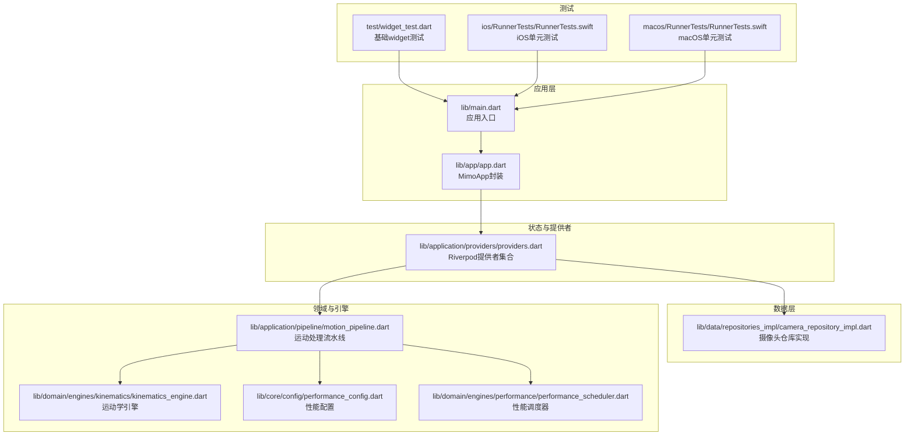
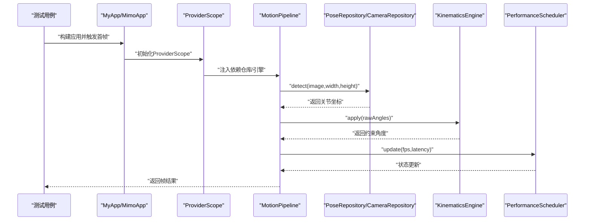
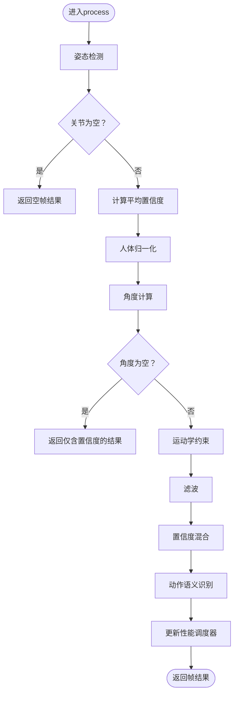
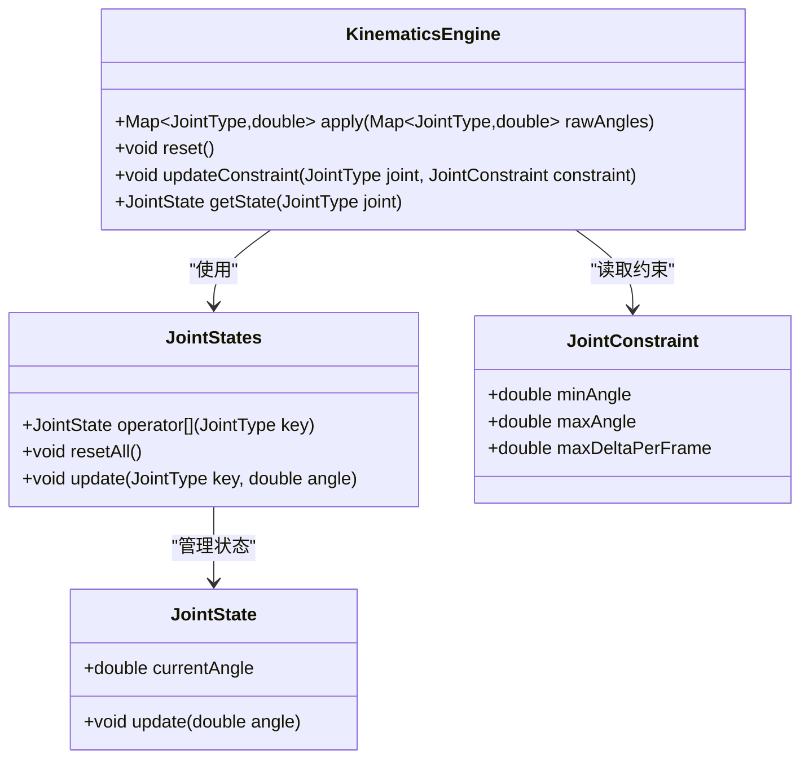
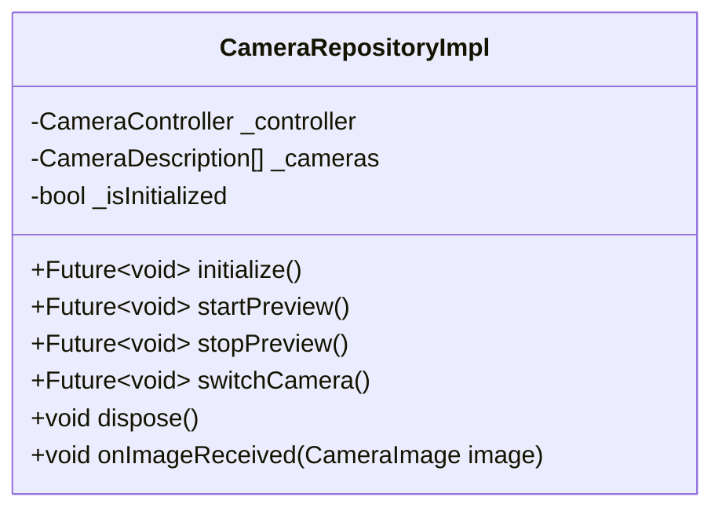
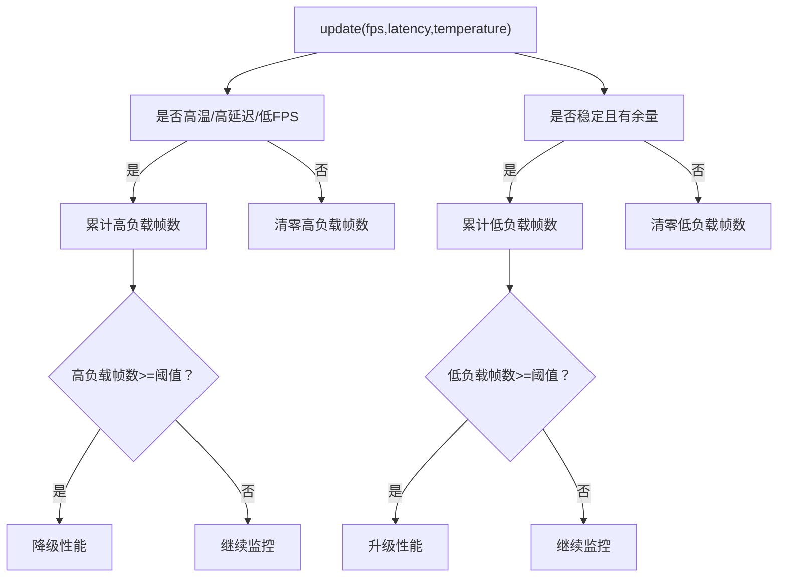
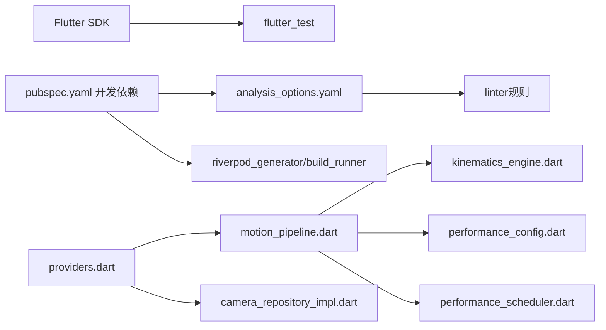

# 测试最佳实践

<cite>
**本文引用的文件**
- [pubspec.yaml](file://pubspec.yaml)
- [analysis_options.yaml](file://analysis_options.yaml)
- [test/widget_test.dart](file://test/widget_test.dart)
- [lib/main.dart](file://lib/main.dart)
- [lib/app/app.dart](file://lib/app/app.dart)
- [lib/application/providers/providers.dart](file://lib/application/providers/providers.dart)
- [lib/application/pipeline/motion_pipeline.dart](file://lib/application/pipeline/motion_pipeline.dart)
- [lib/data/repositories_impl/camera_repository_impl.dart](file://lib/data/repositories_impl/camera_repository_impl.dart)
- [lib/domain/engines/kinematics/kinematics_engine.dart](file://lib/domain/engines/kinematics/kinematics_engine.dart)
- [lib/core/config/performance_config.dart](file://lib/core/config/performance_config.dart)
- [lib/domain/engines/performance/performance_scheduler.dart](file://lib/domain/engines/performance/performance_scheduler.dart)
- [ios/RunnerTests/RunnerTests.swift](file://ios/RunnerTests/RunnerTests.swift)
- [macos/RunnerTests/RunnerTests.swift](file://macos/RunnerTests/RunnerTests.swift)
</cite>

## 目录
1. 引言
2. 项目结构
3. 核心组件
4. 架构总览
5. 详细组件分析
6. 依赖关系分析
7. 性能考量
8. 故障排除指南
9. 结论
10. 附录

## 引言
本文件面向Mimo项目，系统性地总结测试最佳实践，覆盖测试驱动开发（TDD）方法论、代码覆盖率要求与测量、测试数据准备策略、测试命名与组织、调试与故障排除、性能与压力测试、持续集成（CI）中的测试自动化与报告、测试维护与重构原则，以及测试文档的编写与维护方法。内容以项目现有代码为依据，结合Flutter与多平台（iOS/macOS/Android/Linux/Windows/Web）特性，给出可操作的建议与图示。

## 项目结构
Mimo采用Flutter多端架构，核心代码位于lib目录，测试位于test目录，iOS与macOS分别包含RunnerTests单元测试工程。pubspec.yaml定义了依赖与开发依赖，analysis_options.yaml统一了代码规范与静态检查。

**图表来源**
- [lib/main.dart:1-34](file://lib/main.dart#L1-L34)
- [lib/app/app.dart:1-27](file://lib/app/app.dart#L1-L27)
- [lib/application/providers/providers.dart:1-103](file://lib/application/providers/providers.dart#L1-L103)
- [lib/data/repositories_impl/camera_repository_impl.dart:1-97](file://lib/data/repositories_impl/camera_repository_impl.dart#L1-L97)
- [lib/application/pipeline/motion_pipeline.dart:1-141](file://lib/application/pipeline/motion_pipeline.dart#L1-L141)
- [lib/domain/engines/kinematics/kinematics_engine.dart:1-95](file://lib/domain/engines/kinematics/kinematics_engine.dart#L1-L95)
- [lib/core/config/performance_config.dart:1-79](file://lib/core/config/performance_config.dart#L1-L79)
- [lib/domain/engines/performance/performance_scheduler.dart:1-146](file://lib/domain/engines/performance/performance_scheduler.dart#L1-L146)
- [test/widget_test.dart:1-31](file://test/widget_test.dart#L1-L31)
- [ios/RunnerTests/RunnerTests.swift:1-12](file://ios/RunnerTests/RunnerTests.swift#L1-L12)
- [macos/RunnerTests/RunnerTests.swift:1-12](file://macos/RunnerTests/RunnerTests.swift#L1-L12)

**章节来源**
- [pubspec.yaml:1-80](file://pubspec.yaml#L1-L80)
- [analysis_options.yaml:1-29](file://analysis_options.yaml#L1-L29)
- [test/widget_test.dart:1-31](file://test/widget_test.dart#L1-L31)
- [lib/main.dart:1-34](file://lib/main.dart#L1-L34)
- [lib/app/app.dart:1-27](file://lib/app/app.dart#L1-L27)

## 核心组件
- 应用入口与页面路由：应用通过ProviderScope包裹，MaterialApp配置主题与路由；MimoApp提供简化入口。
- 提供者体系：集中定义各仓库与引擎的Riverpod提供者，便于注入与测试替换。
- 数据层：CameraRepositoryImpl封装相机初始化、预览、切换与图像流回调。
- 领域引擎：MotionPipeline串联姿态检测、置信度处理、归一化、角度计算、运动学约束、滤波、语义识别与性能调度。
- 性能配置与调度：PerformanceConfig定义目标与降级阈值，PerformanceScheduler根据状态动态调整性能。

**章节来源**
- [lib/main.dart:1-34](file://lib/main.dart#L1-L34)
- [lib/app/app.dart:1-27](file://lib/app/app.dart#L1-L27)
- [lib/application/providers/providers.dart:1-103](file://lib/application/providers/providers.dart#L1-L103)
- [lib/data/repositories_impl/camera_repository_impl.dart:1-97](file://lib/data/repositories_impl/camera_repository_impl.dart#L1-L97)
- [lib/application/pipeline/motion_pipeline.dart:1-141](file://lib/application/pipeline/motion_pipeline.dart#L1-L141)
- [lib/core/config/performance_config.dart:1-79](file://lib/core/config/performance_config.dart#L1-L79)
- [lib/domain/engines/performance/performance_scheduler.dart:1-146](file://lib/domain/engines/performance/performance_scheduler.dart#L1-L146)

## 架构总览
下图展示测试视角下的关键交互：Widget测试驱动应用构建与交互，Riverpod提供者注入数据与引擎，数据层与引擎协同完成一帧处理流程，并由性能调度器反馈状态。

**图表来源**
- [test/widget_test.dart:13-30](file://test/widget_test.dart#L13-L30)
- [lib/main.dart:7-9](file://lib/main.dart#L7-L9)
- [lib/app/app.dart:11-26](file://lib/app/app.dart#L11-L26)
- [lib/application/providers/providers.dart:71-83](file://lib/application/providers/providers.dart#L71-L83)
- [lib/application/pipeline/motion_pipeline.dart:61-130](file://lib/application/pipeline/motion_pipeline.dart#L61-L130)
- [lib/domain/engines/kinematics/kinematics_engine.dart:36-53](file://lib/domain/engines/kinematics/kinematics_engine.dart#L36-L53)
- [lib/domain/engines/performance/performance_scheduler.dart:96-129](file://lib/domain/engines/performance/performance_scheduler.dart#L96-L129)

## 详细组件分析

### 组件A：MotionPipeline（运动处理流水线）
- 职责：编排姿态检测、置信度处理、归一化、角度计算、运动学约束、滤波、语义识别与性能调度。
- 输入输出：输入为图像与尺寸，输出为帧结果（包含关节角度、手势、置信度等）。
- 关键点：在处理过程中统计耗时并更新性能调度器，便于后续性能测试与回归验证。

**图表来源**
- [lib/application/pipeline/motion_pipeline.dart:61-130](file://lib/application/pipeline/motion_pipeline.dart#L61-L130)

**章节来源**
- [lib/application/pipeline/motion_pipeline.dart:1-141](file://lib/application/pipeline/motion_pipeline.dart#L1-L141)

### 组件B：KinematicsEngine（运动学引擎）
- 职责：对原始角度施加范围与单帧变化量约束，保证动作符合人体生物力学。
- 关键点：内部维护关节状态，支持重置与约束更新；适合进行边界条件与状态一致性测试。

**图表来源**
- [lib/domain/engines/kinematics/kinematics_engine.dart:9-95](file://lib/domain/engines/kinematics/kinematics_engine.dart#L9-L95)

**章节来源**
- [lib/domain/engines/kinematics/kinematics_engine.dart:1-95](file://lib/domain/engines/kinematics/kinematics_engine.dart#L1-L95)

### 组件C：CameraRepositoryImpl（摄像头仓库）
- 职责：管理相机可用列表、控制器生命周期、预览启动/停止、摄像头切换与图像流回调。
- 关键点：异常处理与初始化状态管理；适合进行设备不可用、权限拒绝等边界场景测试。

**图表来源**
- [lib/data/repositories_impl/camera_repository_impl.dart:5-97](file://lib/data/repositories_impl/camera_repository_impl.dart#L5-L97)

**章节来源**
- [lib/data/repositories_impl/camera_repository_impl.dart:1-97](file://lib/data/repositories_impl/camera_repository_impl.dart#L1-L97)

### 组件D：PerformanceScheduler（性能调度器）
- 职责：基于FPS、延迟与温度连续帧计数判断是否需要降级或升级性能级别。
- 关键点：阈值来自PerformanceConfig；适合进行性能回归与稳定性测试。

**图表来源**
- [lib/domain/engines/performance/performance_scheduler.dart:96-146](file://lib/domain/engines/performance/performance_scheduler.dart#L96-L146)
- [lib/core/config/performance_config.dart:36-58](file://lib/core/config/performance_config.dart#L36-L58)

**章节来源**
- [lib/domain/engines/performance/performance_scheduler.dart:1-146](file://lib/domain/engines/performance/performance_scheduler.dart#L1-L146)
- [lib/core/config/performance_config.dart:1-79](file://lib/core/config/performance_config.dart#L1-L79)

## 依赖关系分析
- 测试依赖：Flutter SDK与flutter_test用于UI测试；lint规则由analysis_options.yaml统一；开发依赖包括linter与Riverpod代码生成器。
- 组件耦合：MotionPipeline依赖多个引擎与仓库；Provider集中注入，便于替换与测试替身。
- 平台测试：iOS与macOS各自包含RunnerTests工程，便于进行原生层测试。

**图表来源**
- [pubspec.yaml:61-67](file://pubspec.yaml#L61-L67)
- [analysis_options.yaml:10-22](file://analysis_options.yaml#L10-L22)
- [lib/application/providers/providers.dart:1-103](file://lib/application/providers/providers.dart#L1-L103)
- [lib/application/pipeline/motion_pipeline.dart:1-141](file://lib/application/pipeline/motion_pipeline.dart#L1-L141)
- [lib/data/repositories_impl/camera_repository_impl.dart:1-97](file://lib/data/repositories_impl/camera_repository_impl.dart#L1-L97)
- [lib/domain/engines/kinematics/kinematics_engine.dart:1-95](file://lib/domain/engines/kinematics/kinematics_engine.dart#L1-L95)
- [lib/core/config/performance_config.dart:1-79](file://lib/core/config/performance_config.dart#L1-L79)
- [lib/domain/engines/performance/performance_scheduler.dart:1-146](file://lib/domain/engines/performance/performance_scheduler.dart#L1-L146)

**章节来源**
- [pubspec.yaml:61-67](file://pubspec.yaml#L61-L67)
- [analysis_options.yaml:10-22](file://analysis_options.yaml#L10-L22)

## 性能考量
- 目标与阈值：目标推理帧率、降级阈值、最低帧率、温度与延迟阈值均在PerformanceConfig中定义。
- 动态调整：PerformanceScheduler根据连续高/低负载帧数触发降级/升级，避免过热与卡顿。
- 测试策略：
  - 回归测试：固定输入图像与关节轨迹，验证FPS与延迟在目标范围内。
  - 压力测试：逐步降低分辨率与帧率，观察系统在极端条件下的稳定性。
  - 热启动测试：重复初始化与释放资源，验证内存与CPU占用峰值。
  - 多平台对比：在iOS与macOS上分别运行相同测试集，比较性能差异。

**章节来源**
- [lib/core/config/performance_config.dart:5-35](file://lib/core/config/performance_config.dart#L5-L35)
- [lib/domain/engines/performance/performance_scheduler.dart:28-40](file://lib/domain/engines/performance/performance_scheduler.dart#L28-L40)
- [lib/domain/engines/performance/performance_scheduler.dart:132-146](file://lib/domain/engines/performance/performance_scheduler.dart#L132-L146)

## 故障排除指南
- 基础Widget测试
  - 症状：首帧断言失败或按钮点击无响应。
  - 排查：确认应用已正确构建并触发首帧；检查路由与ProviderScope是否生效。
  - 参考路径：[test/widget_test.dart:13-30](file://test/widget_test.dart#L13-L30)，[lib/main.dart:7-9](file://lib/main.dart#L7-L9)
- 相机初始化失败
  - 症状：无可用摄像头或初始化抛出异常。
  - 排查：检查设备权限、摄像头可用性与异常分支；验证switchCamera逻辑。
  - 参考路径：[lib/data/repositories_impl/camera_repository_impl.dart:20-47](file://lib/data/repositories_impl/camera_repository_impl.dart#L20-L47)，[lib/data/repositories_impl/camera_repository_impl.dart:64-82](file://lib/data/repositories_impl/camera_repository_impl.dart#L64-L82)
- 运动学约束异常
  - 症状：角度突变或超出范围。
  - 排查：验证约束配置与单帧变化量限制；检查状态重置逻辑。
  - 参考路径：[lib/domain/engines/kinematics/kinematics_engine.dart:36-81](file://lib/domain/engines/kinematics/kinematics_engine.dart#L36-L81)
- 性能调度误判
  - 症状：频繁升降级或不响应。
  - 排查：核对阈值与连续帧计数；检查update调用频率与输入参数。
  - 参考路径：[lib/domain/engines/performance/performance_scheduler.dart:96-129](file://lib/domain/engines/performance/performance_scheduler.dart#L96-L129)

**章节来源**
- [test/widget_test.dart:13-30](file://test/widget_test.dart#L13-L30)
- [lib/main.dart:7-9](file://lib/main.dart#L7-L9)
- [lib/data/repositories_impl/camera_repository_impl.dart:20-47](file://lib/data/repositories_impl/camera_repository_impl.dart#L20-L47)
- [lib/data/repositories_impl/camera_repository_impl.dart:64-82](file://lib/data/repositories_impl/camera_repository_impl.dart#L64-L82)
- [lib/domain/engines/kinematics/kinematics_engine.dart:36-81](file://lib/domain/engines/kinematics/kinematics_engine.dart#L36-L81)
- [lib/domain/engines/performance/performance_scheduler.dart:96-129](file://lib/domain/engines/performance/performance_scheduler.dart#L96-L129)

## 结论
本文件基于Mimo现有代码，给出了从TDD到CI、从单元测试到性能测试的完整实践框架。建议优先围绕Provider注入与核心引擎（MotionPipeline、KinematicsEngine、PerformanceScheduler）建立稳定的测试套件，配合平台原生测试工程，形成跨端一致的质量保障体系。

## 附录

### 测试驱动开发（TDD）方法论与实施步骤
- 步骤
  - 编写失败的测试用例（最小化功能）→ 实现最简代码通过测试 → 重构与优化 → 循环迭代。
  - 先定义行为契约（如MotionPipeline.process的输入输出），再实现具体逻辑。
- 在Mimo中的落地
  - 使用ProviderScope隔离依赖，便于注入替身（Mock）。
  - 以Widget测试验证用户交互（如点击+号计数），随后扩展到核心引擎的单元测试。

**章节来源**
- [lib/application/providers/providers.dart:71-83](file://lib/application/providers/providers.dart#L71-L83)
- [test/widget_test.dart:13-30](file://test/widget_test.dart#L13-L30)

### 代码覆盖率要求与测量
- 要求
  - 业务核心模块（MotionPipeline、KinematicsEngine、PerformanceScheduler）覆盖率≥80%。
  - 数据层与提供者层覆盖率≥70%。
- 测量与达标策略
  - 使用flutter_test内置覆盖率或第三方工具（如coverage）生成报告。
  - 通过注入替身与边界条件测试提升分支覆盖率；对异常路径进行显式断言。

**章节来源**
- [pubspec.yaml:61-67](file://pubspec.yaml#L61-L67)

### 测试数据准备策略（夹具与模拟数据）
- 夹具（Fixtures）
  - 使用固定图像与关节坐标作为输入，确保测试可重复。
  - 通过Provider注入替身仓库（如MockPoseRepository）与引擎（如固定输出的ConfidenceProcessor）。
- 模拟数据
  - 生成不同置信度、不同分辨率与不同帧率的数据，覆盖正常与异常场景。

**章节来源**
- [lib/application/providers/providers.dart:16-83](file://lib/application/providers/providers.dart#L16-L83)

### 测试命名约定与组织结构
- 命名约定
  - Widget测试：以“功能_场景_期望”命名，如“计数器_点击加号后递增”。
  - 引擎测试：以“方法名_输入条件_期望结果”命名，如“apply_输入越界角度_返回约束角度”。
- 组织结构
  - 按功能模块分目录（如core、data、domain、presentation），每个模块对应独立测试目录。
  - 平台测试按平台分目录（如ios/RunnerTests、macos/RunnerTests）。

**章节来源**
- [test/widget_test.dart:13-30](file://test/widget_test.dart#L13-L30)

### 测试调试与故障排除实用技巧
- 断点与日志：在关键节点（初始化、图像流回调、引擎处理前后）添加日志。
- 替身注入：使用Mock对象替换真实依赖，隔离问题来源。
- 录制与回放：录制一次成功场景，后续回归测试直接复用。

**章节来源**
- [lib/data/repositories_impl/camera_repository_impl.dart:94-96](file://lib/data/repositories_impl/camera_repository_impl.dart#L94-L96)

### 性能测试与压力测试实施策略
- 回归测试：固定输入，记录FPS与延迟，确保回归不退步。
- 压力测试：逐步降低分辨率与帧率，观察系统稳定性与资源占用。
- 热启动测试：反复初始化/释放，验证内存泄漏与CPU峰值。

**章节来源**
- [lib/core/config/performance_config.dart:5-35](file://lib/core/config/performance_config.dart#L5-L35)
- [lib/domain/engines/performance/performance_scheduler.dart:132-146](file://lib/domain/engines/performance/performance_scheduler.dart#L132-L146)

### 持续集成（CI）中的测试自动化与报告
- 自动化
  - 在CI中执行flutter test与flutter test --coverage。
  - 分平台运行：iOS与macOS分别执行其RunnerTests工程。
- 报告
  - 生成并上传覆盖率报告与测试日志，便于质量门禁与趋势分析。

**章节来源**
- [pubspec.yaml:61-67](file://pubspec.yaml#L61-L67)
- [ios/RunnerTests/RunnerTests.swift:7-10](file://ios/RunnerTests/RunnerTests.swift#L7-L10)
- [macos/RunnerTests/RunnerTests.swift:7-10](file://macos/RunnerTests/RunnerTests.swift#L7-L10)

### 测试维护与重构指导原则
- 原则
  - 保持测试与生产代码解耦（通过Provider注入）。
  - 将公共测试逻辑抽取为通用辅助函数（如构建测试应用、注入替身）。
  - 定期清理过时测试与冗余断言，维持测试套件健康。

**章节来源**
- [lib/application/providers/providers.dart:16-83](file://lib/application/providers/providers.dart#L16-L83)

### 测试文档编写与维护
- 内容
  - 测试策略与目标、覆盖率目标、关键测试用例说明、常见问题与排障手册。
- 维护
  - 随代码变更同步更新测试文档；在PR中强制关联测试文档链接。

[本节为概念性内容，无需列出来源]