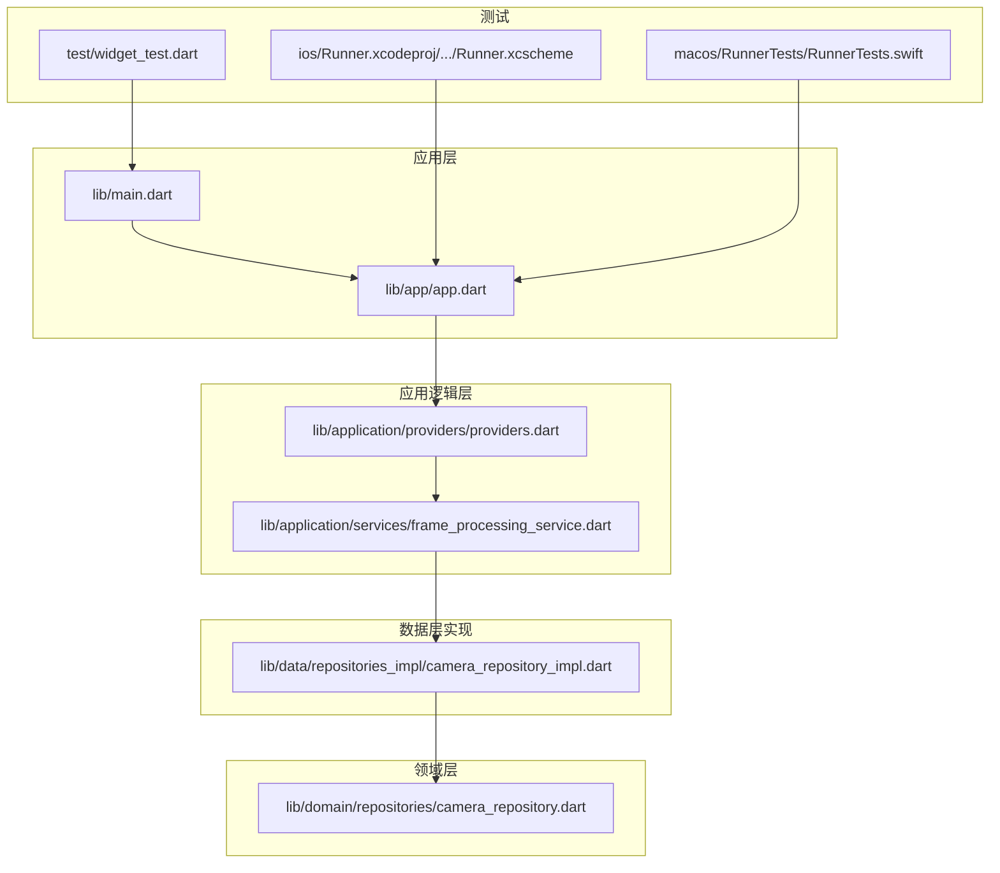
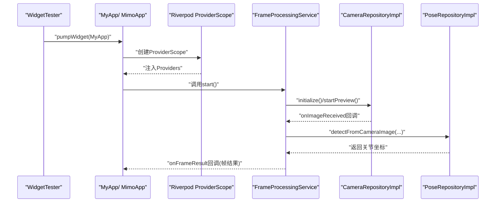
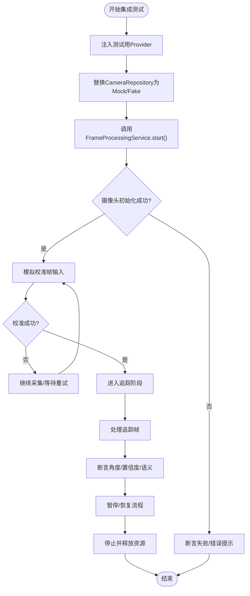
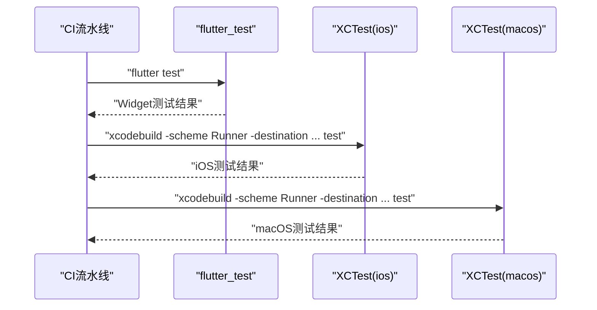
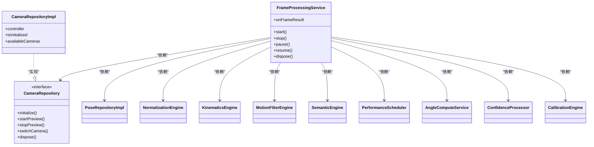

# 测试策略

<cite>
**本文引用的文件**
- [pubspec.yaml](file://pubspec.yaml)
- [analysis_options.yaml](file://analysis_options.yaml)
- [widget_test.dart](file://test/widget_test.dart)
- [main.dart](file://lib/main.dart)
- [app.dart](file://lib/app/app.dart)
- [providers.dart](file://lib/application/providers/providers.dart)
- [frame_processing_service.dart](file://lib/application/services/frame_processing_service.dart)
- [camera_repository.dart](file://lib/domain/repositories/camera_repository.dart)
- [camera_repository_impl.dart](file://lib/data/repositories_impl/camera_repository_impl.dart)
- [Runner.xcscheme](file://ios/Runner.xcodeproj/xcshareddata/xcschemes/Runner.xcscheme)
- [RunnerTests.swift](file://macos/RunnerTests/RunnerTests.swift)
- [linux/CMakeLists.txt](file://linux/CMakeLists.txt)
</cite>

## 目录
1. [引言](#引言)
2. [项目结构](#项目结构)
3. [核心组件](#核心组件)
4. [架构总览](#架构总览)
5. [详细组件分析](#详细组件分析)
6. [依赖分析](#依赖分析)
7. [性能考虑](#性能考虑)
8. [故障排查指南](#故障排查指南)
9. [结论](#结论)
10. [附录](#附录)

## 引言
本文件面向Mimo项目的测试策略，系统性阐述单元测试、集成测试与UI测试的框架选择、设计原则与实施路径；覆盖模拟对象与测试数据准备、TDD方法论、持续集成与自动化测试配置建议、性能与压力测试策略，以及测试报告生成与分析方法。文档同时结合当前仓库中的现有配置与代码结构，给出可落地的改进建议与最佳实践。

## 项目结构
Mimo是一个基于Flutter的跨平台应用，包含Android、iOS、macOS、Windows与Linux平台支持。测试方面，仓库中已包含基础的Flutter Widget测试入口与XCTest示例，以及iOS/ macOS测试目标配置片段。整体结构如下：

图示来源
- [main.dart:1-34](file://lib/main.dart#L1-L34)
- [app.dart:1-27](file://lib/app/app.dart#L1-L27)
- [providers.dart:1-103](file://lib/application/providers/providers.dart#L1-L103)
- [frame_processing_service.dart:1-254](file://lib/application/services/frame_processing_service.dart#L1-L254)
- [camera_repository.dart:1-28](file://lib/domain/repositories/camera_repository.dart#L1-L28)
- [camera_repository_impl.dart:1-102](file://lib/data/repositories_impl/camera_repository_impl.dart#L1-L102)
- [widget_test.dart:1-31](file://test/widget_test.dart#L1-L31)
- [Runner.xcscheme:34-68](file://ios/Runner.xcodeproj/xcshareddata/xcschemes/Runner.xcscheme#L34-L68)
- [RunnerTests.swift:1-12](file://macos/RunnerTests/RunnerTests.swift#L1-L12)

章节来源
- [main.dart:1-34](file://lib/main.dart#L1-L34)
- [app.dart:1-27](file://lib/app/app.dart#L1-L27)
- [providers.dart:1-103](file://lib/application/providers/providers.dart#L1-L103)
- [frame_processing_service.dart:1-254](file://lib/application/services/frame_processing_service.dart#L1-L254)
- [camera_repository.dart:1-28](file://lib/domain/repositories/camera_repository.dart#L1-L28)
- [camera_repository_impl.dart:1-102](file://lib/data/repositories_impl/camera_repository_impl.dart#L1-L102)
- [widget_test.dart:1-31](file://test/widget_test.dart#L1-L31)
- [Runner.xcscheme:34-68](file://ios/Runner.xcodeproj/xcshareddata/xcschemes/Runner.xcscheme#L34-L68)
- [RunnerTests.swift:1-12](file://macos/RunnerTests/RunnerTests.swift#L1-L12)

## 核心组件
- 应用入口与路由：应用通过入口文件启动Provider作用域，并在MaterialApp中定义初始路由与页面路由表，便于UI测试时快速构建与断言。
- 应用逻辑层（Riverpod）：通过Provider集中管理各引擎与服务实例，便于在测试中替换实现或注入Mock。
- 帧处理服务：封装摄像头、姿态检测、归一化、运动学、滤波、语义识别等链路，是UI与业务逻辑的关键集成点。
- 仓库接口与实现：将摄像头访问抽象为接口，实现位于数据层，便于在测试中注入Fake实现。

章节来源
- [main.dart:7-33](file://lib/main.dart#L7-L33)
- [app.dart:7-26](file://lib/app/app.dart#L7-L26)
- [providers.dart:16-83](file://lib/application/providers/providers.dart#L16-L83)
- [frame_processing_service.dart:32-88](file://lib/application/services/frame_processing_service.dart#L32-L88)
- [camera_repository.dart:4-28](file://lib/domain/repositories/camera_repository.dart#L4-L28)
- [camera_repository_impl.dart:5-47](file://lib/data/repositories_impl/camera_repository_impl.dart#L5-L47)

## 架构总览
下图展示测试视角下的关键交互：UI测试通过WidgetTester驱动应用；应用通过ProviderScope与Riverpod依赖注入；帧处理服务串联多个引擎与仓库；仓库接口可被替换为Mock/Fake以实现隔离测试。

图示来源
- [widget_test.dart:13-29](file://test/widget_test.dart#L13-L29)
- [main.dart:7-33](file://lib/main.dart#L7-L33)
- [app.dart:12-25](file://lib/app/app.dart#L12-L25)
- [providers.dart:252-254](file://lib/application/providers/providers.dart#L252-L254)
- [frame_processing_service.dart:71-88](file://lib/application/services/frame_processing_service.dart#L71-L88)
- [camera_repository_impl.dart:20-54](file://lib/data/repositories_impl/camera_repository_impl.dart#L20-L54)

## 详细组件分析

### 单元测试：框架选择与配置
- 框架选择
  - Flutter官方测试框架：使用flutter_test与WidgetTester进行UI与组件级测试。
  - Riverpod Provider：利用ProviderScope在测试中注入自定义Provider实现，隔离外部依赖。
- 配置要点
  - 依赖声明：在开发依赖中包含flutter_test与lint规则，确保静态检查与风格统一。
  - 分析选项：启用推荐的Flutter Lints，减少低质量代码进入测试套件。
- 建议
  - 为每个Provider创建“测试专用”的工厂或注入点，便于在测试中替换具体实现。
  - 对纯函数与算法（如置信度混合、角度计算）单独抽离为独立模块，便于单元测试。

章节来源
- [pubspec.yaml:61-67](file://pubspec.yaml#L61-L67)
- [analysis_options.yaml:8-22](file://analysis_options.yaml#L8-L22)
- [providers.dart:16-83](file://lib/application/providers/providers.dart#L16-L83)

### 集成测试：设计原则与实施策略
- 设计原则
  - 最小化外部依赖：通过接口与Provider注入，将摄像头、网络、数据库等外部依赖替换为Mock/Fake。
  - 端到端链路验证：验证从摄像头图像输入到帧结果输出的完整链路，关注错误分支与边界条件。
- 实施策略
  - 使用ProviderScope在测试中替换具体仓库实现，避免真实摄像头初始化。
  - 在帧处理服务中暴露回调与状态读取接口，便于断言中间状态与最终结果。
  - 覆盖关键状态转换：idle -> calibrating -> tracking，以及pause/resume场景。
- 关键断言点
  - 校准成功后切换状态并保存校准数据。
  - 追踪阶段对关节角度、置信度与动作语义的组合断言。
  - FPS更新与状态Provider变化。

图示来源
- [frame_processing_service.dart:71-88](file://lib/application/services/frame_processing_service.dart#L71-L88)
- [frame_processing_service.dart:150-167](file://lib/application/services/frame_processing_service.dart#L150-L167)
- [frame_processing_service.dart:169-216](file://lib/application/services/frame_processing_service.dart#L169-L216)
- [providers.dart:252-254](file://lib/application/providers/providers.dart#L252-L254)
- [camera_repository.dart:4-28](file://lib/domain/repositories/camera_repository.dart#L4-L28)

章节来源
- [frame_processing_service.dart:32-249](file://lib/application/services/frame_processing_service.dart#L32-L249)
- [camera_repository_impl.dart:5-47](file://lib/data/repositories_impl/camera_repository_impl.dart#L5-L47)

### UI测试：方法与自动化流程
- 方法
  - 使用WidgetTester进行交互与断言：构建应用、触发手势、断言UI文本与控件存在性。
  - 通过ProviderScope注入测试用Provider，避免真实摄像头与网络请求。
- 自动化流程
  - 在CI中运行flutter test，结合XCTest（iOS/macOS）与平台特定的构建脚本。
  - 为不同平台配置测试目标与scheme，确保测试可并行执行。
- 建议
  - 将UI测试拆分为“无依赖”（仅渲染）与“有依赖”（需要Provider注入）两类，提升稳定性与速度。

图示来源
- [widget_test.dart:13-29](file://test/widget_test.dart#L13-L29)
- [Runner.xcscheme:40-51](file://ios/Runner.xcodeproj/xcshareddata/xcschemes/Runner.xcscheme#L40-L51)
- [RunnerTests.swift:7-10](file://macos/RunnerTests/RunnerTests.swift#L7-L10)

章节来源
- [widget_test.dart:1-31](file://test/widget_test.dart#L1-L31)
- [Runner.xcscheme:34-68](file://ios/Runner.xcodeproj/xcshareddata/xcschemes/Runner.xcscheme#L34-L68)
- [RunnerTests.swift:1-12](file://macos/RunnerTests/RunnerTests.swift#L1-L12)

### 测试最佳实践与覆盖率
- 最佳实践
  - 优先测试边界与异常：空输入、初始化失败、摄像头不可用、无姿态检测等。
  - 使用“Arrange-Act-Assert”结构组织测试，保持测试名称与断言意图清晰。
  - 为Provider注入测试桩，避免真实设备依赖。
- 覆盖率
  - 建议对核心业务逻辑（帧处理链路、角度计算、置信度混合）达到较高覆盖率；对UI与工具类可适度放宽。
  - 在CI中收集覆盖率报告，设置阈值门禁，防止覆盖率回退。

[本节为通用指导，不直接分析具体文件]

### 测试数据准备与模拟对象
- 测试数据
  - 构造标准化的Landmark与FrameResult样本，覆盖不同可见度与关节类型。
  - 提供“无姿态”与“多姿态”场景的数据集，验证健壮性。
- 模拟对象
  - 替换CameraRepository为Fake实现，返回固定帧序列或抛出异常。
  - 替换PoseRepository为Mock实现，按需返回关节坐标或错误。
- 注入方式
  - 通过ProviderScope在测试中替换对应Provider，确保测试隔离。

章节来源
- [camera_repository.dart:4-28](file://lib/domain/repositories/camera_repository.dart#L4-L28)
- [camera_repository_impl.dart:5-47](file://lib/data/repositories_impl/camera_repository_impl.dart#L5-L47)
- [providers.dart:16-83](file://lib/application/providers/providers.dart#L16-L83)

### 测试用例编写指南与TDD
- 编写指南
  - 先写失败的测试，再实现最小功能满足测试；逐步细化边界与异常。
  - 将复杂流程拆分为多个小测试，分别验证初始化、状态转换、错误处理。
- TDD步骤
  - 定义需求：例如“开始追踪后应更新FPS并发出帧结果回调”。
  - 编写测试：构造输入、触发行为、断言输出。
  - 实现代码：满足测试并通过，再重构优化。
  - 回归测试：新增用例覆盖新功能与回归问题。

[本节为通用指导，不直接分析具体文件]

### 持续集成与自动化测试配置
- iOS/macOS测试目标
  - 仓库中已包含Runner与RunnerTests目标的scheme配置片段，可在CI中复用。
- Linux构建
  - Linux平台使用CMakeLists定义二进制名与构建类型，可用于打包与测试环境准备。
- 建议
  - 在CI中分阶段执行：单元测试（无设备）、UI测试（模拟器/沙盒）、集成测试（真机/模拟器）。
  - 为不同平台设置并行任务，缩短总耗时。

章节来源
- [Runner.xcscheme:34-68](file://ios/Runner.xcodeproj/xcshareddata/xcschemes/Runner.xcscheme#L34-L68)
- [linux/CMakeLists.txt:1-35](file://linux/CMakeLists.txt#L1-L35)

### 性能测试与压力测试
- 性能指标
  - FPS稳定性：在不同分辨率与设备上测量帧率波动。
  - 内存占用：长时间运行下的内存增长趋势。
  - CPU/GPU占用：在高并发图像处理时的资源消耗。
- 压力测试
  - 多设备并发：模拟多用户同时使用，验证资源竞争与锁机制。
  - 异常注入：模拟摄像头不可用、网络超时等极端情况，验证降级策略。
- 工具建议
  - 使用Flutter DevTools进行性能分析。
  - 在CI中加入基准测试与回归阈值，防止性能退化。

[本节为通用指导，不直接分析具体文件]

### 测试报告生成与分析
- 报告格式
  - 单元与UI测试可输出JUnit XML，便于CI平台解析。
  - 集成测试可输出JSON或CSV，记录关键指标（FPS、成功率、失败原因）。
- 分析方法
  - 统计失败率、平均耗时、覆盖率趋势。
  - 结合日志与堆栈定位根因，建立问题跟踪与修复闭环。

[本节为通用指导，不直接分析具体文件]

## 依赖分析
- 组件耦合
  - 帧处理服务依赖多个引擎与仓库，通过Provider注入降低耦合度，便于测试替换。
  - 仓库接口抽象使得实现可插拔，利于Mock/Fake注入。
- 外部依赖
  - camera、rive、google_mlkit_pose_detection等外部库在测试中应被隔离。
- 循环依赖
  - 当前结构未见明显循环依赖；建议在新增Provider时保持单向依赖。

图示来源
- [frame_processing_service.dart:32-62](file://lib/application/services/frame_processing_service.dart#L32-L62)
- [camera_repository.dart:4-28](file://lib/domain/repositories/camera_repository.dart#L4-L28)
- [camera_repository_impl.dart:5-47](file://lib/data/repositories_impl/camera_repository_impl.dart#L5-L47)

章节来源
- [frame_processing_service.dart:32-249](file://lib/application/services/frame_processing_service.dart#L32-L249)
- [camera_repository.dart:4-28](file://lib/domain/repositories/camera_repository.dart#L4-L28)
- [camera_repository_impl.dart:5-47](file://lib/data/repositories_impl/camera_repository_impl.dart#L5-L47)

## 性能考虑
- 测试性能
  - 使用Mock/Fake替代真实摄像头与ML模型，显著降低测试时间。
  - 在UI测试中避免不必要的pump与等待，使用精确的断言时机。
- 运行时性能
  - 在帧处理链路中引入性能调度器，控制处理频率与资源占用。
  - 对高频操作（如FPS统计）采用采样与平滑策略，避免过度开销。

[本节为通用指导，不直接分析具体文件]

## 故障排查指南
- 常见问题
  - 摄像头初始化失败：检查相机权限、设备是否可用、Provider注入是否正确。
  - 无姿态检测：检查图像格式、分辨率与旋转参数，验证PoseRepository实现。
  - UI断言失败：确认WidgetTester的pump时机与断言范围。
- 排查步骤
  - 启用详细日志，定位异常发生的具体阶段。
  - 使用最小化测试用例复现问题，逐步缩小范围。
  - 在CI中增加失败重试与详细日志上传，便于远程诊断。

章节来源
- [frame_processing_service.dart:74-87](file://lib/application/services/frame_processing_service.dart#L74-L87)
- [frame_processing_service.dart:134-137](file://lib/application/services/frame_processing_service.dart#L134-L137)
- [camera_repository_impl.dart:20-46](file://lib/data/repositories_impl/camera_repository_impl.dart#L20-L46)

## 结论
Mimo的测试策略应围绕“隔离外部依赖、分层验证、可扩展的自动化流程”展开。通过Provider注入与接口抽象，将摄像头、姿态检测等外部能力替换为Mock/Fake；在CI中分阶段执行单元、UI与集成测试；结合性能与压力测试，确保在多平台上的稳定性与可靠性。建议尽快完善测试数据与模拟对象体系，建立覆盖率与性能基线，持续改进测试质量。

## 附录
- 快速检查清单
  - 是否为每个Provider提供了测试注入点？
  - 是否覆盖了关键状态转换与异常路径？
  - 是否在CI中配置了跨平台测试任务？
  - 是否建立了覆盖率与性能回归阈值？

[本节为通用指导，不直接分析具体文件]