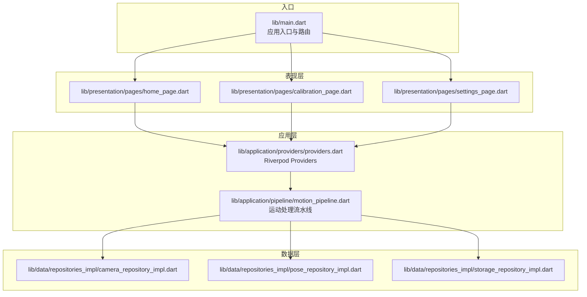
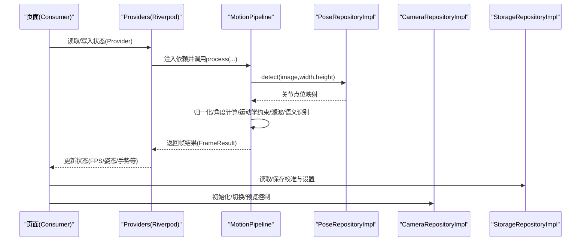
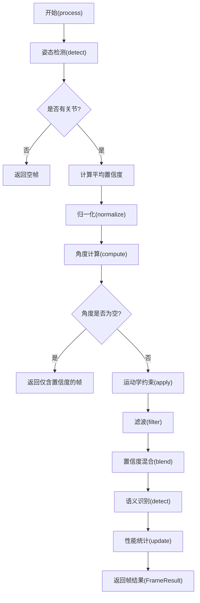
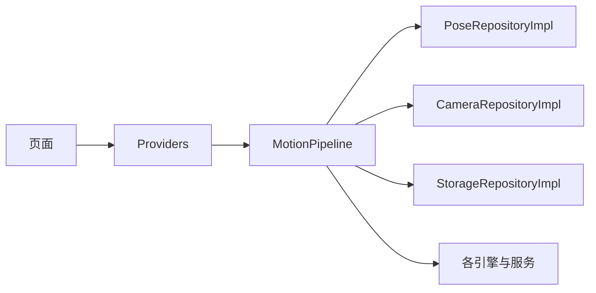

# 集成测试

<cite>
**本文引用的文件**
- [lib/main.dart](file://lib/main.dart)
- [test/widget_test.dart](file://test/widget_test.dart)
- [lib/application/providers/providers.dart](file://lib/application/providers/providers.dart)
- [lib/application/pipeline/motion_pipeline.dart](file://lib/application/pipeline/motion_pipeline.dart)
- [lib/data/repositories_impl/camera_repository_impl.dart](file://lib/data/repositories_impl/camera_repository_impl.dart)
- [lib/data/repositories_impl/pose_repository_impl.dart](file://lib/data/repositories_impl/pose_repository_impl.dart)
- [lib/data/repositories_impl/storage_repository_impl.dart](file://lib/data/repositories_impl/storage_repository_impl.dart)
- [lib/presentation/pages/home_page.dart](file://lib/presentation/pages/home_page.dart)
- [lib/presentation/pages/calibration_page.dart](file://lib/presentation/pages/calibration_page.dart)
- [lib/presentation/pages/settings_page.dart](file://lib/presentation/pages/settings_page.dart)
</cite>

## 目录
1. [简介](#简介)
2. [项目结构](#项目结构)
3. [核心组件](#核心组件)
4. [架构总览](#架构总览)
5. [详细组件分析](#详细组件分析)
6. [依赖分析](#依赖分析)
7. [性能考虑](#性能考虑)
8. [故障排查指南](#故障排查指南)
9. [结论](#结论)
10. [附录](#附录)

## 简介
本文件面向Mimo项目的集成测试，系统性阐述测试设计原则与实施策略，聚焦Application层与Data层的组件交互，验证Riverpod状态管理在异步状态与依赖注入下的集成效果；同时给出仓库实现（repositories_impl）的集成测试方法、运动处理流水线（motion_pipeline）的多引擎协作与数据流转验证策略，并提供完整业务流程的测试场景与用例、测试环境配置与外部依赖模拟方法，以及组件间通信与数据传递的验证手段。

## 项目结构
Mimo采用分层架构：Presentation层负责UI与用户交互；Application层负责编排与状态管理（Riverpod Providers）；Domain层定义实体与接口；Data层提供仓库实现与数据源；核心入口通过ProviderScope挂载全局状态树。

图表来源
- [lib/main.dart:1-34](file://lib/main.dart#L1-L34)
- [lib/application/providers/providers.dart:1-103](file://lib/application/providers/providers.dart#L1-L103)
- [lib/application/pipeline/motion_pipeline.dart:1-141](file://lib/application/pipeline/motion_pipeline.dart#L1-L141)
- [lib/data/repositories_impl/camera_repository_impl.dart:1-97](file://lib/data/repositories_impl/camera_repository_impl.dart#L1-L97)
- [lib/data/repositories_impl/pose_repository_impl.dart:1-204](file://lib/data/repositories_impl/pose_repository_impl.dart#L1-L204)
- [lib/data/repositories_impl/storage_repository_impl.dart:1-115](file://lib/data/repositories_impl/storage_repository_impl.dart#L1-L115)
- [lib/presentation/pages/home_page.dart:1-215](file://lib/presentation/pages/home_page.dart#L1-L215)
- [lib/presentation/pages/calibration_page.dart:1-286](file://lib/presentation/pages/calibration_page.dart#L1-L286)
- [lib/presentation/pages/settings_page.dart:1-284](file://lib/presentation/pages/settings_page.dart#L1-L284)

章节来源
- [lib/main.dart:1-34](file://lib/main.dart#L1-L34)
- [lib/application/providers/providers.dart:1-103](file://lib/application/providers/providers.dart#L1-L103)
- [lib/application/pipeline/motion_pipeline.dart:1-141](file://lib/application/pipeline/motion_pipeline.dart#L1-L141)
- [lib/data/repositories_impl/camera_repository_impl.dart:1-97](file://lib/data/repositories_impl/camera_repository_impl.dart#L1-L97)
- [lib/data/repositories_impl/pose_repository_impl.dart:1-204](file://lib/data/repositories_impl/pose_repository_impl.dart#L1-L204)
- [lib/data/repositories_impl/storage_repository_impl.dart:1-115](file://lib/data/repositories_impl/storage_repository_impl.dart#L1-L115)
- [lib/presentation/pages/home_page.dart:1-215](file://lib/presentation/pages/home_page.dart#L1-L215)
- [lib/presentation/pages/calibration_page.dart:1-286](file://lib/presentation/pages/calibration_page.dart#L1-L286)
- [lib/presentation/pages/settings_page.dart:1-284](file://lib/presentation/pages/settings_page.dart#L1-L284)

## 核心组件
- Riverpod Providers：集中声明仓库、引擎、服务与状态Provider，形成可注入的依赖图；MotionPipeline作为编排器串联各引擎。
- 运动处理流水线（MotionPipeline）：从姿态检测到置信度混合、归一化、运动学约束、滤波、语义识别与性能统计的完整链路。
- 仓库实现（repositories_impl）：CameraRepositoryImpl、PoseRepositoryImpl、StorageRepositoryImpl分别对接相机、姿态检测与本地存储。
- 页面与状态：Home、Calibration、Settings页面通过ConsumerStatefulWidget与ProviderScope读取与更新状态，驱动UI与业务流程。

章节来源
- [lib/application/providers/providers.dart:1-103](file://lib/application/providers/providers.dart#L1-L103)
- [lib/application/pipeline/motion_pipeline.dart:14-141](file://lib/application/pipeline/motion_pipeline.dart#L14-L141)
- [lib/data/repositories_impl/camera_repository_impl.dart:4-97](file://lib/data/repositories_impl/camera_repository_impl.dart#L4-L97)
- [lib/data/repositories_impl/pose_repository_impl.dart:10-204](file://lib/data/repositories_impl/pose_repository_impl.dart#L10-L204)
- [lib/data/repositories_impl/storage_repository_impl.dart:6-115](file://lib/data/repositories_impl/storage_repository_impl.dart#L6-L115)
- [lib/presentation/pages/home_page.dart:9-215](file://lib/presentation/pages/home_page.dart#L9-L215)
- [lib/presentation/pages/calibration_page.dart:9-286](file://lib/presentation/pages/calibration_page.dart#L9-L286)
- [lib/presentation/pages/settings_page.dart:5-284](file://lib/presentation/pages/settings_page.dart#L5-L284)

## 架构总览
下图展示从页面到Provider、再到仓库与引擎的端到端调用路径，体现Application层与Data层的交互与状态传播。

图表来源
- [lib/application/providers/providers.dart:71-83](file://lib/application/providers/providers.dart#L71-L83)
- [lib/application/pipeline/motion_pipeline.dart:53-130](file://lib/application/pipeline/motion_pipeline.dart#L53-L130)
- [lib/data/repositories_impl/pose_repository_impl.dart:32-71](file://lib/data/repositories_impl/pose_repository_impl.dart#L32-L71)
- [lib/data/repositories_impl/camera_repository_impl.dart:20-89](file://lib/data/repositories_impl/camera_repository_impl.dart#L20-L89)
- [lib/data/repositories_impl/storage_repository_impl.dart:11-39](file://lib/data/repositories_impl/storage_repository_impl.dart#L11-L39)

## 详细组件分析

### Riverpod Providers集成测试
- 测试目标
  - 验证Provider作用域与依赖注入是否按预期工作（ProviderScope包裹）。
  - 验证状态Provider在异步初始化与事件触发后的状态变更。
  - 验证Provider之间的耦合与生命周期（如dispose）。
- 设计原则
  - 使用ProviderScope隔离测试上下文，避免跨测试污染。
  - 通过ConsumerWidget在测试中订阅Provider，断言状态变化。
  - 对异步初始化（如相机初始化、姿态检测初始化）进行超时与错误分支验证。
- 实施策略
  - 在测试入口构建ProviderScope包裹的应用树，使用WidgetTester渲染页面。
  - 通过ref.watch/ref.read读取Provider状态，断言初始值与变更值。
  - 对异常路径（无相机、初始化失败）进行断言。
- 示例场景
  - 场景1：启动应用，校准状态Provider初始为等待，点击开始后进入进行中。
  - 场景2：加载本地校准数据后，归一化引擎应处于校准状态。
  - 场景3：切换高性能模式后，性能调度器更新FPS与延迟指标。
- 关键断言点
  - ProviderScope根节点存在且生效。
  - 状态Provider初始值与后续变更一致。
  - 引擎Provider在Pipeline中被正确注入与复用。

章节来源
- [lib/application/providers/providers.dart:16-103](file://lib/application/providers/providers.dart#L16-L103)
- [lib/presentation/pages/calibration_page.dart:19-51](file://lib/presentation/pages/calibration_page.dart#L19-L51)
- [lib/presentation/pages/home_page.dart:24-36](file://lib/presentation/pages/home_page.dart#L24-L36)
- [lib/presentation/pages/settings_page.dart:34-63](file://lib/presentation/pages/settings_page.dart#L34-L63)

### 仓库实现（repositories_impl）集成测试
- 测试目标
  - 验证CameraRepositoryImpl的初始化、预览开关、摄像头切换与资源释放。
  - 验证PoseRepositoryImpl对不同图像格式的转换与姿态检测能力。
  - 验证StorageRepositoryImpl的校准数据与设置项的存取一致性。
- 设计原则
  - 使用模拟或桩对象替换真实外部依赖（相机、ML Kit、SharedPreferences），保证可重复性。
  - 对图像格式转换与输入元数据进行边界条件测试（空图像、不支持格式）。
  - 对存取过程中的JSON序列化/反序列化进行健壮性测试。
- 实施策略
  - 替换CameraRepositoryImpl的控制器与回调，注入测试用图像流。
  - 替换PoseRepositoryImpl的检测器，返回固定结果以验证流水线。
  - 使用SharedPreferences的模拟实现，断言键值与类型。
- 示例场景
  - 场景1：初始化相机后可用摄像头列表非空，预览开始/停止正常。
  - 场景2：NV21/YUV420/BGRA8888三种格式均能转换并返回Landmark映射。
  - 场景3：保存与加载BodyMetrics一致，清空后返回空值。
- 关键断言点
  - 控制器状态与初始化标志位。
  - 转换函数对不同格式的处理与返回值。
  - 存储键名与类型匹配，异常情况返回默认值。

章节来源
- [lib/data/repositories_impl/camera_repository_impl.dart:10-97](file://lib/data/repositories_impl/camera_repository_impl.dart#L10-L97)
- [lib/data/repositories_impl/pose_repository_impl.dart:32-147](file://lib/data/repositories_impl/pose_repository_impl.dart#L32-L147)
- [lib/data/repositories_impl/pose_repository_impl.dart:149-197](file://lib/data/repositories_impl/pose_repository_impl.dart#L149-L197)
- [lib/data/repositories_impl/storage_repository_impl.dart:11-115](file://lib/data/repositories_impl/storage_repository_impl.dart#L11-L115)

### 运动处理流水线（motion_pipeline）集成测试
- 测试目标
  - 验证MotionPipeline的九步处理链路：姿态检测、置信度计算、归一化、角度计算、运动学约束、滤波、置信度混合、语义识别、性能统计。
  - 验证空帧与异常路径的降级行为（返回空帧或默认值）。
  - 验证引擎复位与状态清理。
- 设计原则
  - 通过桩对象模拟各引擎与服务，确保可控输入与可预测输出。
  - 对每个阶段的中间产物进行断言（如归一化后的关节、约束后的角度、滤波后的角度）。
  - 验证性能调度器对FPS与延迟的更新逻辑。
- 实施策略
  - 为ConfidenceProcessor、NormalizationEngine、KinematicsEngine、MotionFilterEngine、SemanticEngine、AngleComputeService、PerformanceScheduler提供可控实现。
  - 输入包含空关节、空角度等边界条件，验证流水线的健壮性。
- 示例场景
  - 场景1：输入为空关节，返回空帧结果。
  - 场景2：输入有效关节，经过归一化与角度计算后，依次通过约束、滤波、置信度混合，最终得到包含手势与置信度的结果。
  - 场景3：重置流水线后，各引擎状态清零。
- 关键断言点
  - 各阶段输出与期望一致。
  - 空输入路径的降级处理。
  - 性能指标更新逻辑正确。

图表来源
- [lib/application/pipeline/motion_pipeline.dart:53-130](file://lib/application/pipeline/motion_pipeline.dart#L53-L130)

章节来源
- [lib/application/pipeline/motion_pipeline.dart:14-141](file://lib/application/pipeline/motion_pipeline.dart#L14-L141)

### 页面与状态管理集成测试
- 测试目标
  - 验证页面初始化流程（相机初始化、校准数据加载、归一化引擎校准）。
  - 验证状态Provider在页面生命周期内的读写与联动。
  - 验证设置页对存储的读写与参数持久化。
- 设计原则
  - 使用ProviderScope与Mock仓库，确保页面渲染与状态更新可验证。
  - 对导航与路由进行断言，确保页面跳转正确。
- 实施策略
  - 在测试中模拟相机与存储，断言初始化与状态变更。
  - 在设置页修改参数后，断言存储写入与页面刷新。
- 示例场景
  - 场景1：进入校准页后，帧处理服务启动，状态指示器显示FPS。
  - 场景2：进入主页后，加载本地校准数据并校准归一化引擎。
  - 场景3：设置页保存参数后，下次进入仍能读取最新值。
- 关键断言点
  - 页面构建后Provider状态符合预期。
  - 导航与路由跳转正确。
  - 存储读写一致性。

章节来源
- [lib/presentation/pages/calibration_page.dart:19-51](file://lib/presentation/pages/calibration_page.dart#L19-L51)
- [lib/presentation/pages/home_page.dart:24-36](file://lib/presentation/pages/home_page.dart#L24-L36)
- [lib/presentation/pages/settings_page.dart:34-63](file://lib/presentation/pages/settings_page.dart#L34-L63)

## 依赖分析
- 组件耦合
  - MotionPipeline强依赖多个引擎与服务，通过Provider注入，耦合集中在Provider层。
  - 页面通过Provider读取状态与仓库，低耦合高内聚。
- 外部依赖
  - 相机与图像流：camera包；姿态检测：google_mlkit_pose_detection；本地存储：shared_preferences。
- 依赖注入与生命周期
  - ProviderScope提供全局作用域；各仓库在dispose中释放资源；页面在dispose中释放服务实例。

图表来源
- [lib/application/providers/providers.dart:71-83](file://lib/application/providers/providers.dart#L71-L83)
- [lib/application/pipeline/motion_pipeline.dart:17-51](file://lib/application/pipeline/motion_pipeline.dart#L17-L51)

章节来源
- [lib/application/providers/providers.dart:16-103](file://lib/application/providers/providers.dart#L16-L103)
- [lib/application/pipeline/motion_pipeline.dart:14-141](file://lib/application/pipeline/motion_pipeline.dart#L14-L141)
- [lib/data/repositories_impl/camera_repository_impl.dart:10-97](file://lib/data/repositories_impl/camera_repository_impl.dart#L10-L97)
- [lib/data/repositories_impl/pose_repository_impl.dart:10-204](file://lib/data/repositories_impl/pose_repository_impl.dart#L10-L204)
- [lib/data/repositories_impl/storage_repository_impl.dart:6-115](file://lib/data/repositories_impl/storage_repository_impl.dart#L6-L115)

## 性能考虑
- 流水线性能
  - 通过PerformanceScheduler记录处理耗时与FPS，测试中应断言指标在合理范围。
  - 高性能模式下降低滤波强度，需验证延迟与稳定性权衡。
- 资源管理
  - 相机与ML Kit检测器应在页面销毁时释放，避免内存泄漏。
  - 存储操作应异步执行，避免阻塞主线程。
- 测试中的性能验证
  - 使用时间断言与帧率断言评估端到端性能。
  - 对异常路径（无检测结果）进行降级处理验证。

## 故障排查指南
- 常见问题
  - 无相机可用：检查相机权限与设备支持；验证CameraRepositoryImpl初始化失败分支。
  - 姿态检测为空：验证图像格式转换与输入元数据；确认ML Kit初始化与异常捕获。
  - 状态未更新：检查ProviderScope作用域与Consumer订阅；确认notifier.state赋值。
  - 设置未持久化：检查键名前缀与类型编码；验证SharedPreferences写入。
- 排查步骤
  - 在测试中逐步断言各Provider状态与仓库返回值。
  - 使用日志与断言定位异常发生的具体阶段。
  - 对外部依赖进行模拟，隔离问题来源。

章节来源
- [lib/data/repositories_impl/camera_repository_impl.dart:20-47](file://lib/data/repositories_impl/camera_repository_impl.dart#L20-L47)
- [lib/data/repositories_impl/pose_repository_impl.dart:46-71](file://lib/data/repositories_impl/pose_repository_impl.dart#L46-L71)
- [lib/data/repositories_impl/storage_repository_impl.dart:11-39](file://lib/data/repositories_impl/storage_repository_impl.dart#L11-L39)
- [lib/application/providers/providers.dart:86-103](file://lib/application/providers/providers.dart#L86-L103)

## 结论
通过对Provider注入、仓库实现与运动流水线的系统性集成测试，可以有效验证Mimo在Application层与Data层的协同工作能力。结合页面状态管理与设置持久化，能够覆盖从用户交互到数据处理的完整业务闭环。建议在CI中引入模拟外部依赖的策略，确保测试的稳定性与可重复性。

## 附录
- 测试环境配置建议
  - 使用ProviderScope包裹测试应用树，确保Riverpod状态隔离。
  - 使用mockito或自定义桩对象替换相机、ML Kit与SharedPreferences。
  - 对页面渲染与状态更新使用WidgetTester进行断言。
- 外部依赖模拟方法
  - 相机：模拟CameraController与图像流回调，注入测试帧。
  - 姿态检测：模拟PoseDetector返回固定结果，便于验证流水线。
  - 存储：模拟SharedPreferences，断言键值与类型。
- 组件间通信与数据传递验证
  - 通过ProviderScope与Consumer订阅，断言状态变更与UI联动。
  - 在MotionPipeline中对中间结果进行断言，确保数据流转正确。