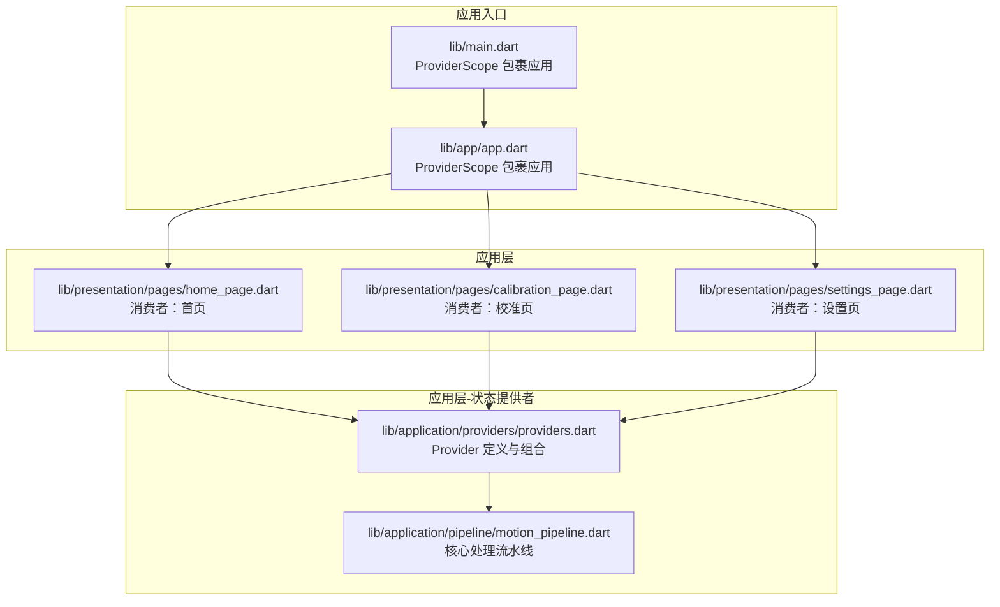
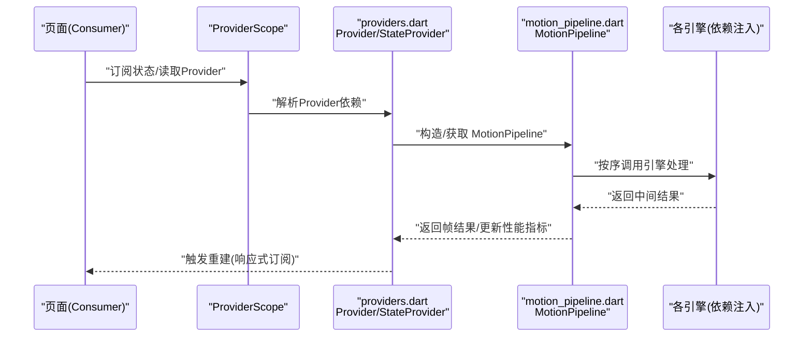
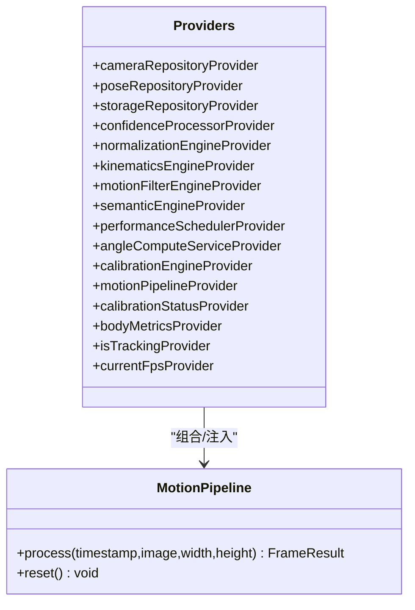
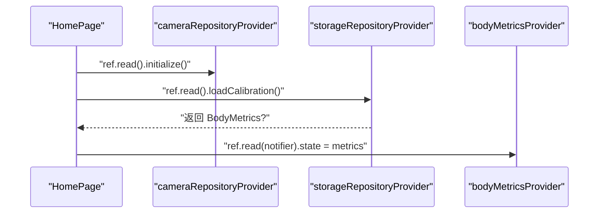
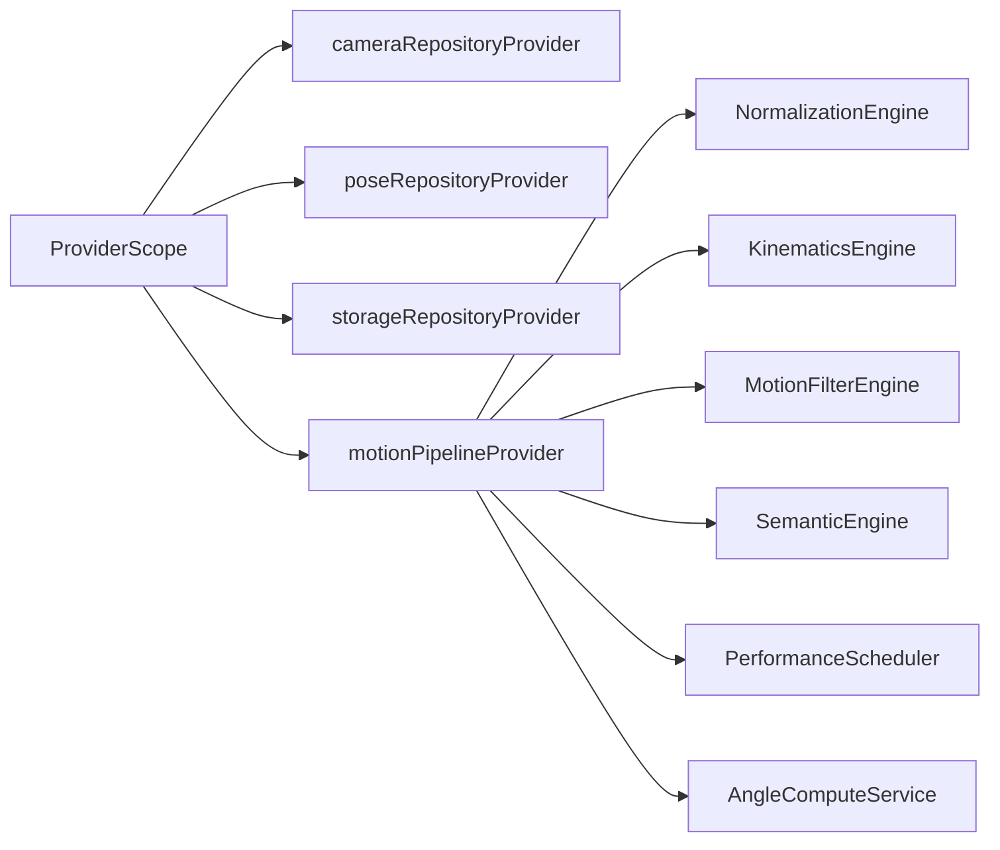
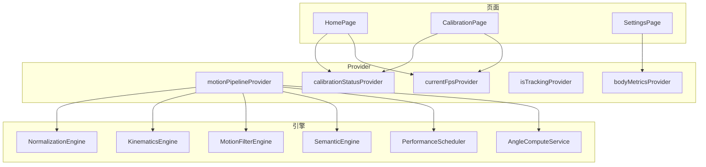

# 状态管理

<cite>
**本文引用的文件**
- [lib/main.dart](file://lib/main.dart)
- [lib/app/app.dart](file://lib/app/app.dart)
- [lib/application/providers/providers.dart](file://lib/application/providers/providers.dart)
- [lib/application/pipeline/motion_pipeline.dart](file://lib/application/pipeline/motion_pipeline.dart)
- [lib/presentation/pages/home_page.dart](file://lib/presentation/pages/home_page.dart)
- [lib/presentation/pages/calibration_page.dart](file://lib/presentation/pages/calibration_page.dart)
- [lib/presentation/pages/settings_page.dart](file://lib/presentation/pages/settings_page.dart)
</cite>

## 目录
1. [引言](#引言)
2. [项目结构](#项目结构)
3. [核心组件](#核心组件)
4. [架构总览](#架构总览)
5. [详细组件分析](#详细组件分析)
6. [依赖关系分析](#依赖关系分析)
7. [性能考量](#性能考量)
8. [故障排查指南](#故障排查指南)
9. [结论](#结论)
10. [附录](#附录)

## 引言
本文件系统性梳理 Mimo 项目基于 Riverpod 的状态管理体系，重点围绕以下主题展开：Riverpod 架构设计与响应式状态管理原理；Provider 的定义、使用与生命周期管理；状态订阅机制与异步状态处理策略；状态树组织与状态传播路径；最佳实践与性能优化；常见状态管理模式示例；与传统 Provider 的差异与优势；以及状态持久化、状态恢复与调试工具的使用建议。

## 项目结构
Mimo 采用分层清晰的 Flutter 项目结构，状态管理集中在 application 层的 providers 中，并通过 presentation 层页面进行消费。根入口在 main.dart 使用 ProviderScope 包裹应用，确保全局 Provider 作用域一致。

图表来源
- [lib/main.dart:7-9](file://lib/main.dart#L7-L9)
- [lib/app/app.dart:12-26](file://lib/app/app.dart#L12-L26)
- [lib/application/providers/providers.dart:16-83](file://lib/application/providers/providers.dart#L16-L83)
- [lib/application/pipeline/motion_pipeline.dart:17-51](file://lib/application/pipeline/motion_pipeline.dart#L17-L51)

章节来源
- [lib/main.dart:1-34](file://lib/main.dart#L1-L34)
- [lib/app/app.dart:1-27](file://lib/app/app.dart#L1-L27)

## 核心组件
- Provider 定义与组合
  - 数据源与引擎 Provider：如摄像头仓库、姿态仓库、存储仓库、置信度处理器、归一化引擎、运动学引擎、滤波引擎、语义引擎、性能调度器、角度计算服务、校准引擎等。
  - 流水线 Provider：MotionPipeline 将多个引擎串联，形成“姿态检测 → 归一化 → 角度计算 → 约束 → 滤波 → 置信度混合 → 语义识别 → 性能统计”的处理链。
  - 状态 Provider：校准状态、人体度量、是否正在追踪、当前 FPS 等，均以 StateProvider 表达可变状态。
- 页面级消费者
  - 首页：初始化摄像头与加载校准数据，订阅校准状态与 FPS，渲染摄像头预览、安全框叠加与 Rive 角色层。
  - 校准页：启动帧处理服务，订阅校准状态与 FPS，根据状态动态更新 UI 与交互。
  - 设置页：读取/保存配置到存储仓库，动态调整滤波与关节约束参数，必要时重建对应引擎以应用新参数。

章节来源
- [lib/application/providers/providers.dart:16-103](file://lib/application/providers/providers.dart#L16-L103)
- [lib/application/pipeline/motion_pipeline.dart:17-141](file://lib/application/pipeline/motion_pipeline.dart#L17-L141)
- [lib/presentation/pages/home_page.dart:23-35](file://lib/presentation/pages/home_page.dart#L23-L35)
- [lib/presentation/pages/calibration_page.dart:31-45](file://lib/presentation/pages/calibration_page.dart#L31-L45)
- [lib/presentation/pages/settings_page.dart:34-63](file://lib/presentation/pages/settings_page.dart#L34-L63)

## 架构总览
下图展示了从页面到 Provider 再到引擎流水线的整体调用链路，体现 Riverpod 的响应式订阅与状态传播机制。

图表来源
- [lib/application/providers/providers.dart:72-83](file://lib/application/providers/providers.dart#L72-L83)
- [lib/application/pipeline/motion_pipeline.dart:61-130](file://lib/application/pipeline/motion_pipeline.dart#L61-L130)

## 详细组件分析

### Provider 定义与生命周期
- 工厂型 Provider：以 Provider<T> 定义无状态依赖，如摄像头仓库、姿态仓库、存储仓库、各类引擎与服务。其生命周期由 ProviderScope 管理，默认随作用域销毁而释放。
- 组合型 Provider：motionPipelineProvider 通过 ref.watch 注入多个子 Provider，形成“依赖注入 + 组合”的模式，便于测试与替换。
- 状态型 Provider：calibrationStatusProvider、bodyMetricsProvider、isTrackingProvider、currentFpsProvider 以 StateProvider 表达可变状态，支持 ref.read(...).state 或 notifier 更新。

图表来源
- [lib/application/providers/providers.dart:16-103](file://lib/application/providers/providers.dart#L16-L103)
- [lib/application/pipeline/motion_pipeline.dart:17-51](file://lib/application/pipeline/motion_pipeline.dart#L17-L51)

章节来源
- [lib/application/providers/providers.dart:16-103](file://lib/application/providers/providers.dart#L16-L103)

### 状态订阅机制与异步处理
- 订阅方式
  - ref.watch：用于读取状态并自动订阅变更，触发 UI 重建。例如首页订阅校准状态与 FPS，校准页订阅校准状态与 FPS。
  - ref.read：用于读取状态或调用 Notifier 的 state 属性进行更新。例如首页初始化时读取存储并写入 bodyMetrics，校准页通过 Notifier 切换校准状态。
- 异步处理
  - 页面初始化时通过 Future<void> 调用仓库 initialize/load 等方法，完成后写入状态，实现“异步初始化 → 状态更新 → 自动重建”的闭环。
  - 设置页通过存储仓库读取/保存配置，支持运行时参数调整并触发相关引擎重建。

图表来源
- [lib/presentation/pages/home_page.dart:23-35](file://lib/presentation/pages/home_page.dart#L23-L35)
- [lib/application/providers/providers.dart:17-29](file://lib/application/providers/providers.dart#L17-L29)
- [lib/application/providers/providers.dart:27-29](file://lib/application/providers/providers.dart#L27-L29)
- [lib/application/providers/providers.dart:91-93](file://lib/application/providers/providers.dart#L91-L93)

章节来源
- [lib/presentation/pages/home_page.dart:23-35](file://lib/presentation/pages/home_page.dart#L23-L35)
- [lib/presentation/pages/calibration_page.dart:31-45](file://lib/presentation/pages/calibration_page.dart#L31-L45)
- [lib/presentation/pages/settings_page.dart:34-63](file://lib/presentation/pages/settings_page.dart#L34-L63)

### 状态树组织与传播
- ProviderScope 作为根作用域，承载所有 Provider 实例与订阅关系。
- 页面通过 ref.watch/ref.read 访问所需 Provider，形成“页面 → Provider → 引擎流水线”的单向数据流。
- 状态变更通过 StateProvider 的 notifier/state 触发，自动通知订阅者重建，实现响应式更新。

图表来源
- [lib/main.dart:7-9](file://lib/main.dart#L7-L9)
- [lib/application/providers/providers.dart:72-83](file://lib/application/providers/providers.dart#L72-L83)
- [lib/application/pipeline/motion_pipeline.dart:19-40](file://lib/application/pipeline/motion_pipeline.dart#L19-L40)

章节来源
- [lib/main.dart:7-9](file://lib/main.dart#L7-L9)
- [lib/application/providers/providers.dart:72-83](file://lib/application/providers/providers.dart#L72-L83)

### 常见状态管理模式示例
- 初始化与加载
  - 在页面 initState 中读取仓库 initialize/load，完成后写入状态，触发 UI 更新。
  - 示例路径：[lib/presentation/pages/home_page.dart:23-35](file://lib/presentation/pages/home_page.dart#L23-L35)
- 状态切换
  - 通过 ref.read(notifier).state 切换校准状态，驱动 UI 分支渲染。
  - 示例路径：[lib/presentation/pages/home_page.dart:211](file://lib/presentation/pages/home_page.dart#L211)、[lib/presentation/pages/calibration_page.dart:283](file://lib/presentation/pages/calibration_page.dart#L283)
- 参数持久化与动态生效
  - 设置页读取/保存配置到存储仓库；必要时重建对应引擎以应用新参数。
  - 示例路径：[lib/presentation/pages/settings_page.dart:34-63](file://lib/presentation/pages/settings_page.dart#L34-L63)

章节来源
- [lib/presentation/pages/home_page.dart:23-35](file://lib/presentation/pages/home_page.dart#L23-L35)
- [lib/presentation/pages/calibration_page.dart:281-285](file://lib/presentation/pages/calibration_page.dart#L281-L285)
- [lib/presentation/pages/settings_page.dart:34-63](file://lib/presentation/pages/settings_page.dart#L34-L63)

### 与传统 Provider 的区别与优势
- 作用域与生命周期
  - 传统 Provider 需要手动管理 Scope；Riverpod 通过 ProviderScope 统一管理，避免泄漏与重复实例。
- 无上下文依赖
  - Riverpod 支持在任意位置创建 Provider，不依赖 BuildContext，便于在业务层直接使用。
- 更强的组合与测试性
  - 通过 Provider 组合与依赖注入，易于替换与模拟，提升可测试性。
- 响应式订阅
  - ref.watch 提供细粒度订阅，仅在相关状态变化时重建，减少不必要的 UI 刷新。

[本节为概念性说明，不直接分析具体文件]

## 依赖关系分析
- Provider 间依赖
  - motionPipelineProvider 依赖多个引擎与仓库 Provider，形成“组合式依赖”。
- 页面与 Provider
  - 各页面通过 ref.watch/ref.read 访问所需 Provider，实现解耦与复用。
- 引擎流水线
  - MotionPipeline 将多引擎串联，形成稳定的处理链，便于扩展与维护。

图表来源
- [lib/application/providers/providers.dart:72-83](file://lib/application/providers/providers.dart#L72-L83)
- [lib/application/pipeline/motion_pipeline.dart:19-40](file://lib/application/pipeline/motion_pipeline.dart#L19-L40)
- [lib/presentation/pages/home_page.dart:39-136](file://lib/presentation/pages/home_page.dart#L39-L136)
- [lib/presentation/pages/calibration_page.dart:55-100](file://lib/presentation/pages/calibration_page.dart#L55-L100)
- [lib/presentation/pages/settings_page.dart:34-63](file://lib/presentation/pages/settings_page.dart#L34-L63)

章节来源
- [lib/application/providers/providers.dart:72-83](file://lib/application/providers/providers.dart#L72-L83)
- [lib/application/pipeline/motion_pipeline.dart:19-40](file://lib/application/pipeline/motion_pipeline.dart#L19-L40)
- [lib/presentation/pages/home_page.dart:39-136](file://lib/presentation/pages/home_page.dart#L39-L136)
- [lib/presentation/pages/calibration_page.dart:55-100](file://lib/presentation/pages/calibration_page.dart#L55-L100)
- [lib/presentation/pages/settings_page.dart:34-63](file://lib/presentation/pages/settings_page.dart#L34-L63)

## 性能考量
- 状态粒度与订阅范围
  - 使用 ref.watch 精确订阅所需状态，避免过度订阅导致的频繁重建。
- 引擎流水线优化
  - MotionPipeline 中的处理步骤顺序明确，可在保证正确性的前提下评估各步骤耗时，结合 PerformanceScheduler 的指标进行调优。
- FPS 与性能调度
  - 通过 currentFpsProvider 与 PerformanceScheduler 更新，页面可据此动态调整渲染策略（如降低刷新频率或简化视觉效果）。
- 参数化与动态生效
  - 设置页支持 One Euro Filter 参数与关节约束参数的动态调整，必要时重建对应引擎以应用新参数，平衡平滑度与实时性。

[本节提供通用指导，不直接分析具体文件]

## 故障排查指南
- 状态未更新
  - 确认使用 ref.read(notifier).state 或 ref.read(provider.notifier).state 正确更新 StateProvider。
  - 检查页面是否通过 ref.watch 订阅了该状态。
- 初始化失败
  - 确保在页面 initState 中先执行仓库 initialize/load，再写入状态。
  - 检查存储仓库返回值是否为空，必要时提供默认值或提示用户重试。
- 参数未生效
  - 设置页保存后若需立即生效，考虑重建相关 Provider（如注释中的 invalidate 方案），或在引擎内部支持热更新。
- FPS 异常
  - 检查 PerformanceScheduler 的更新逻辑与页面订阅，确认是否存在阻塞操作导致处理时间过长。

章节来源
- [lib/presentation/pages/home_page.dart:23-35](file://lib/presentation/pages/home_page.dart#L23-L35)
- [lib/presentation/pages/settings_page.dart:62](file://lib/presentation/pages/settings_page.dart#L62)

## 结论
Mimo 的状态管理以 Riverpod 为核心，通过 Provider 的工厂/组合/状态三类形态，实现了清晰的依赖注入、细粒度的状态订阅与高效的响应式更新。配合 MotionPipeline 的流水线式处理与页面级的异步初始化/参数持久化，形成了高内聚、低耦合且易于扩展的状态体系。遵循本文的最佳实践与性能优化建议，可进一步提升系统的稳定性与用户体验。

## 附录
- 入口与作用域
  - 应用入口通过 ProviderScope 包裹，确保全局 Provider 生效。
  - 示例路径：[lib/main.dart:7-9](file://lib/main.dart#L7-L9)、[lib/app/app.dart:12-26](file://lib/app/app.dart#L12-L26)
- Provider 定义清单
  - 数据源与引擎 Provider：见 [lib/application/providers/providers.dart:16-59](file://lib/application/providers/providers.dart#L16-L59)
  - 流水线 Provider：见 [lib/application/providers/providers.dart:72-83](file://lib/application/providers/providers.dart#L72-L83)
  - 状态 Provider：见 [lib/application/providers/providers.dart:85-103](file://lib/application/providers/providers.dart#L85-L103)
- 页面消费示例
  - 首页：见 [lib/presentation/pages/home_page.dart:39-136](file://lib/presentation/pages/home_page.dart#L39-L136)
  - 校准页：见 [lib/presentation/pages/calibration_page.dart:55-100](file://lib/presentation/pages/calibration_page.dart#L55-L100)
  - 设置页：见 [lib/presentation/pages/settings_page.dart:66-175](file://lib/presentation/pages/settings_page.dart#L66-L175)