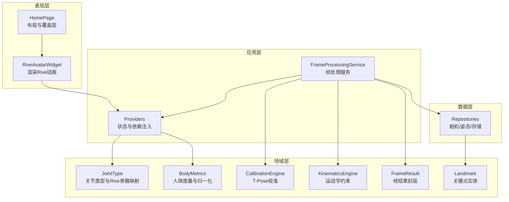
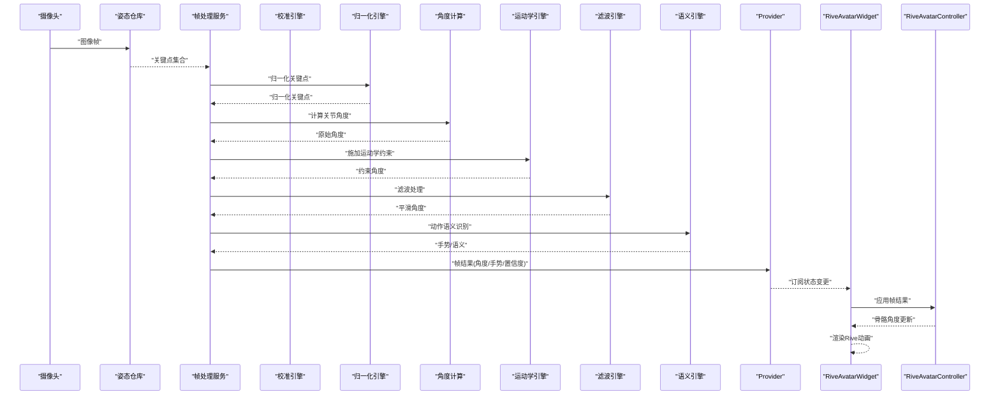
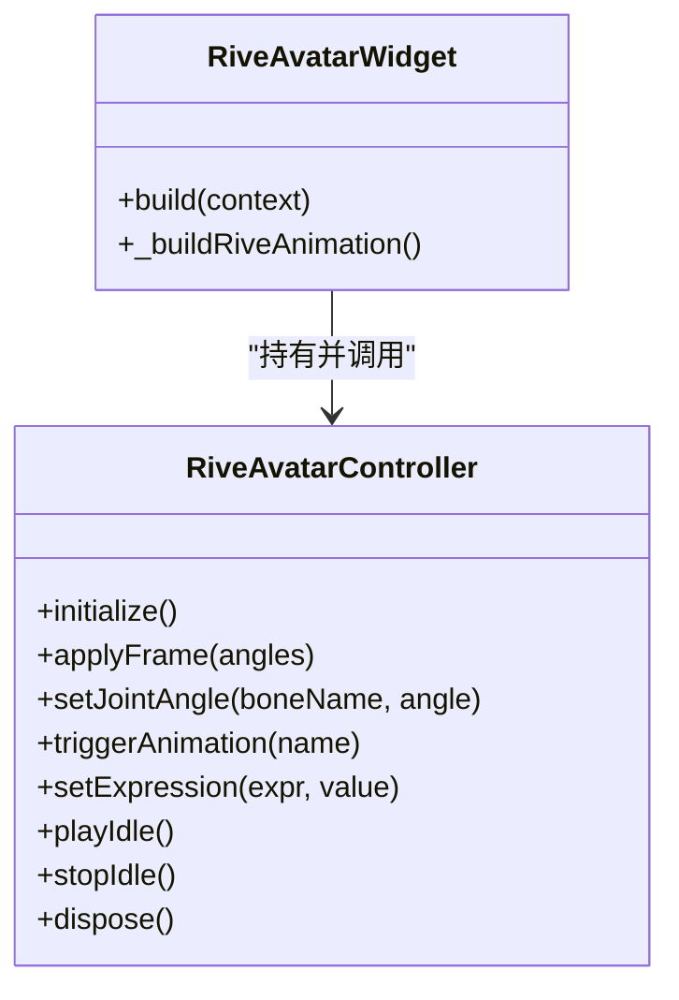
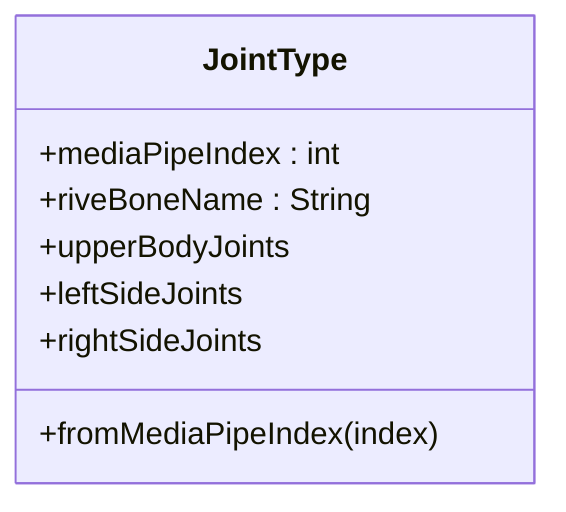
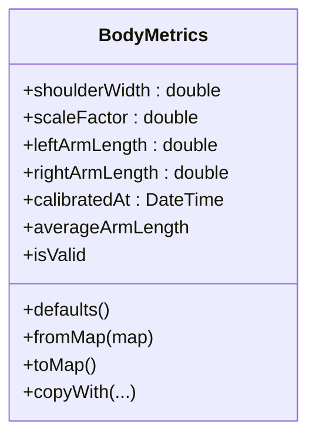
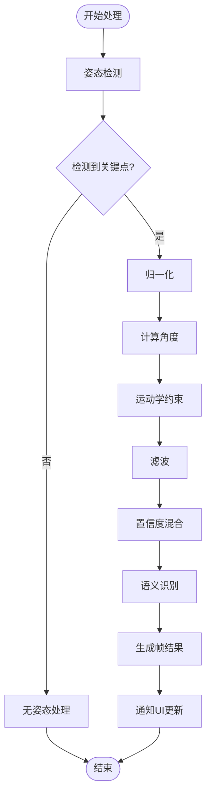
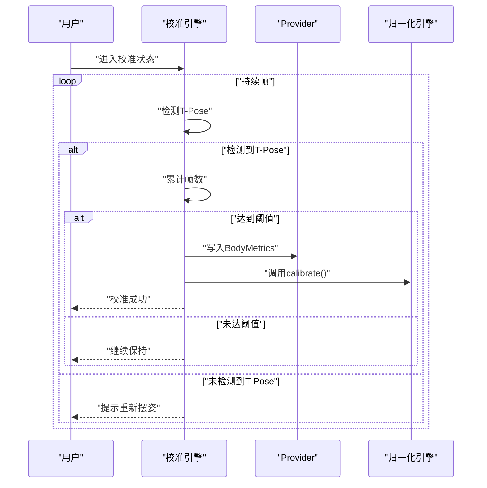
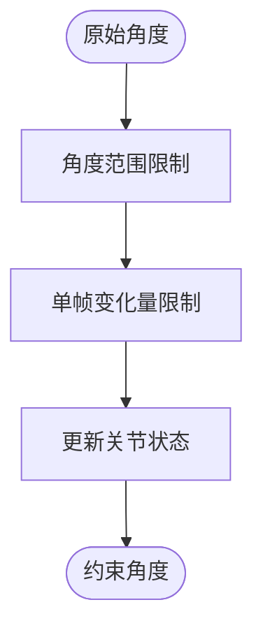
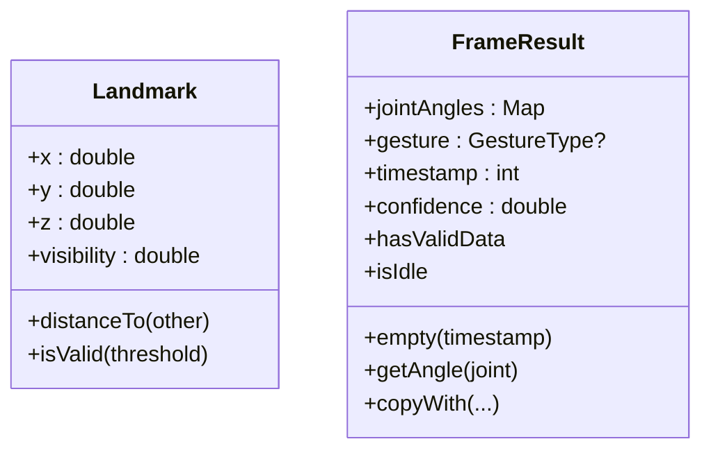
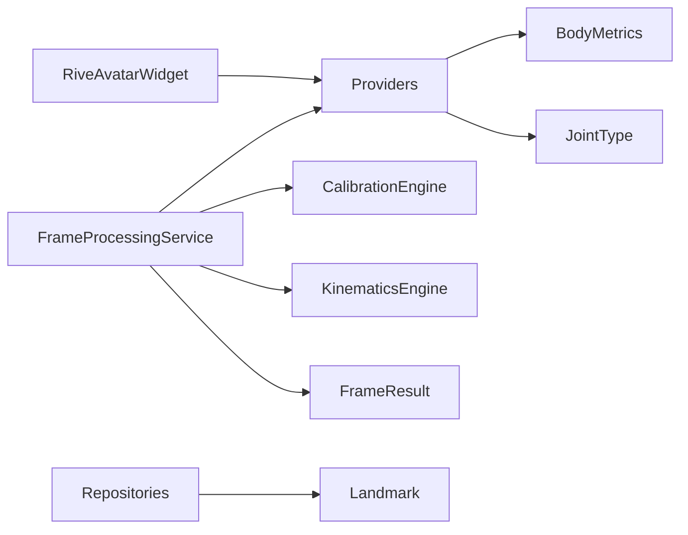

# Rive动画组件

<cite>
**本文引用的文件**
- [rive_avatar_widget.dart](file://lib/presentation/widgets/rive_avatar_widget.dart)
- [joint_type.dart](file://lib/domain/entities/joint_type.dart)
- [body_metrics.dart](file://lib/domain/entities/body_metrics.dart)
- [providers.dart](file://lib/application/providers/providers.dart)
- [frame_processing_service.dart](file://lib/application/services/frame_processing_service.dart)
- [home_page.dart](file://lib/presentation/pages/home_page.dart)
- [main.dart](file://lib/main.dart)
- [calibration_engine.dart](file://lib/domain/engines/calibration/calibration_engine.dart)
- [kinematics_engine.dart](file://lib/domain/engines/kinematics/kinematics_engine.dart)
- [frame_result.dart](file://lib/domain/entities/frame_result.dart)
- [landmark.dart](file://lib/domain/entities/landmark.dart)
</cite>

## 目录
1. [简介](#简介)
2. [项目结构](#项目结构)
3. [核心组件](#核心组件)
4. [架构总览](#架构总览)
5. [详细组件分析](#详细组件分析)
6. [依赖关系分析](#依赖关系分析)
7. [性能考虑](#性能考虑)
8. [故障排查指南](#故障排查指南)
9. [结论](#结论)
10. [附录](#附录)

## 简介
本技术文档围绕Mimo项目中的Rive动画组件展开，系统性阐述其集成架构、实时驱动机制、动画文件加载、骨骼绑定与关键帧控制、姿态数据到动画驱动的转换流程与映射算法、动画状态管理与播放控制、循环策略、性能优化与内存管理、渲染调优、属性配置、事件监听与自定义参数设置，以及动画混合、过渡与同步机制，并覆盖动画文件格式支持、版本兼容性与资源管理策略。

## 项目结构
Rive动画组件位于Flutter应用的展示层，通过Riverpod进行状态管理，连接姿态处理流水线与渲染层。整体采用分层设计：表现层负责渲染与交互；应用层提供服务与Provider；领域层包含实体、引擎与常量；数据层负责外部接口与存储。

图表来源
- [home_page.dart:64-71](file://lib/presentation/pages/home_page.dart#L64-L71)
- [rive_avatar_widget.dart:74-118](file://lib/presentation/widgets/rive_avatar_widget.dart#L74-L118)
- [frame_processing_service.dart:32-62](file://lib/application/services/frame_processing_service.dart#L32-L62)
- [providers.dart:90-93](file://lib/application/providers/providers.dart#L90-L93)
- [joint_type.dart:4-32](file://lib/domain/entities/joint_type.dart#L4-L32)
- [body_metrics.dart:4-26](file://lib/domain/entities/body_metrics.dart#L4-L26)
- [calibration_engine.dart:62-88](file://lib/domain/engines/calibration/calibration_engine.dart#L62-L88)
- [kinematics_engine.dart:9-29](file://lib/domain/engines/kinematics/kinematics_engine.dart#L9-L29)
- [frame_result.dart:7-25](file://lib/domain/entities/frame_result.dart#L7-L25)
- [landmark.dart:4-22](file://lib/domain/entities/landmark.dart#L4-L22)

章节来源
- [main.dart:1-34](file://lib/main.dart#L1-L34)
- [home_page.dart:38-88](file://lib/presentation/pages/home_page.dart#L38-L88)
- [providers.dart:16-103](file://lib/application/providers/providers.dart#L16-L103)

## 核心组件
- RiveAvatarWidget：承载Rive动画渲染，作为顶层容器展示角色动画。
- RiveAvatarController：负责Rive实例生命周期、骨骼绑定、动画触发与表情参数设置。
- FrameProcessingService：连接摄像头与姿态检测，构建帧结果并驱动动画。
- JointType：定义关节类型与Rive骨骼名称映射，支撑骨骼绑定。
- BodyMetrics：人体度量数据，用于归一化与缩放，影响动画幅度。
- CalibrationEngine：T-Pose校准，产出BodyMetrics并驱动归一化。
- KinematicsEngine：对原始角度施加运动学约束，保证动作自然与稳定。
- FrameResult：封装每帧关节角度、手势与置信度等信息。
- Landmark：姿态关键点实体，提供坐标与可见度。

章节来源
- [rive_avatar_widget.dart:9-71](file://lib/presentation/widgets/rive_avatar_widget.dart#L9-L71)
- [frame_processing_service.dart:32-249](file://lib/application/services/frame_processing_service.dart#L32-L249)
- [joint_type.dart:4-57](file://lib/domain/entities/joint_type.dart#L4-L57)
- [body_metrics.dart:4-109](file://lib/domain/entities/body_metrics.dart#L4-L109)
- [calibration_engine.dart:62-302](file://lib/domain/engines/calibration/calibration_engine.dart#L62-L302)
- [kinematics_engine.dart:9-95](file://lib/domain/engines/kinematics/kinematics_engine.dart#L9-L95)
- [frame_result.dart:7-66](file://lib/domain/entities/frame_result.dart#L7-L66)
- [landmark.dart:4-87](file://lib/domain/entities/landmark.dart#L4-L87)

## 架构总览
Rive动画组件的实时驱动链路如下：摄像头采集图像 → 姿态检测得到关键点 → 归一化与角度计算 → 运动学约束 → 滤波与置信度混合 → 生成帧结果 → 通过Provider传递给RiveAvatarWidget → RiveAvatarController应用到骨骼 → 渲染输出。

图表来源
- [frame_processing_service.dart:124-216](file://lib/application/services/frame_processing_service.dart#L124-L216)
- [providers.dart:90-93](file://lib/application/providers/providers.dart#L90-L93)
- [rive_avatar_widget.dart:99-101](file://lib/presentation/widgets/rive_avatar_widget.dart#L99-L101)

## 详细组件分析

### RiveAvatarWidget与RiveAvatarController
- 渲染层：RiveAvatarWidget负责加载Rive资源并渲染，当前占位实现加载本地资源文件。
- 控制层：RiveAvatarController负责生命周期管理、骨骼绑定占位、动画触发与表情参数占位。
- 数据流：通过Riverpod监听bodyMetricsProvider，结合帧结果中的关节角度，驱动骨骼旋转。

图表来源
- [rive_avatar_widget.dart:74-118](file://lib/presentation/widgets/rive_avatar_widget.dart#L74-L118)
- [rive_avatar_widget.dart:9-71](file://lib/presentation/widgets/rive_avatar_widget.dart#L9-L71)

章节来源
- [rive_avatar_widget.dart:74-118](file://lib/presentation/widgets/rive_avatar_widget.dart#L74-L118)
- [rive_avatar_widget.dart:9-71](file://lib/presentation/widgets/rive_avatar_widget.dart#L9-L71)

### 关节类型与骨骼映射
- JointType枚举定义了上肢关键关节与对应的Rive骨骼名称，形成“媒体管道索引 → Rive骨骼名”的映射。
- 支持批量筛选左右侧关节，便于按肢体分组驱动。

图表来源
- [joint_type.dart:4-57](file://lib/domain/entities/joint_type.dart#L4-L57)

章节来源
- [joint_type.dart:4-57](file://lib/domain/entities/joint_type.dart#L4-L57)

### 人体度量与归一化
- BodyMetrics提供肩宽、缩放因子、左右臂长与校准时间戳，用于将用户动作幅度归一化到标准尺度。
- 默认值与序列化/反序列化支持，便于持久化与跨会话复用。

图表来源
- [body_metrics.dart:4-109](file://lib/domain/entities/body_metrics.dart#L4-L109)

章节来源
- [body_metrics.dart:4-109](file://lib/domain/entities/body_metrics.dart#L4-L109)

### 帧处理与实时驱动
- FrameProcessingService串联摄像头、姿态检测与处理引擎，异步处理图像帧，计算平均置信度、归一化、角度、约束、滤波与语义识别，最终生成FrameResult并通过Provider广播。
- 支持暂停/恢复与FPS统计，便于性能监控。

图表来源
- [frame_processing_service.dart:124-216](file://lib/application/services/frame_processing_service.dart#L124-L216)

章节来源
- [frame_processing_service.dart:32-249](file://lib/application/services/frame_processing_service.dart#L32-L249)

### 校准与归一化
- CalibrationEngine通过T-Pose检测与持续帧计数，计算肩宽、缩放因子与臂长，生成BodyMetrics并写入Provider。
- 归一化引擎在后续流程中使用该度量，使不同用户动作幅度一致。

图表来源
- [calibration_engine.dart:114-176](file://lib/domain/engines/calibration/calibration_engine.dart#L114-L176)
- [providers.dart:90-93](file://lib/application/providers/providers.dart#L90-L93)

章节来源
- [calibration_engine.dart:62-302](file://lib/domain/engines/calibration/calibration_engine.dart#L62-L302)
- [providers.dart:90-93](file://lib/application/providers/providers.dart#L90-L93)

### 运动学约束与稳定性
- KinematicsEngine对原始角度施加角度范围与单帧最大变化量限制，避免动作突兀，提升自然度。
- 维护关节状态，支持动态更新约束与重置。

图表来源
- [kinematics_engine.dart:36-81](file://lib/domain/engines/kinematics/kinematics_engine.dart#L36-L81)

章节来源
- [kinematics_engine.dart:9-95](file://lib/domain/engines/kinematics/kinematics_engine.dart#L9-L95)

### 姿态实体与帧结果
- Landmark提供关键点坐标与可见度，支持距离计算与有效性判断。
- FrameResult封装关节角度、手势、时间戳与置信度，支持空帧与复制扩展。

图表来源
- [landmark.dart:4-87](file://lib/domain/entities/landmark.dart#L4-L87)
- [frame_result.dart:7-66](file://lib/domain/entities/frame_result.dart#L7-L66)

章节来源
- [landmark.dart:4-87](file://lib/domain/entities/landmark.dart#L4-L87)
- [frame_result.dart:7-66](file://lib/domain/entities/frame_result.dart#L7-L66)

## 依赖关系分析
- RiveAvatarWidget依赖Riverpod提供的bodyMetricsProvider与帧结果Provider，实现状态驱动渲染。
- FrameProcessingService聚合多个引擎与仓库，形成完整的姿态处理流水线。
- JointType与BodyMetrics贯穿从数据采集到动画驱动的全过程，是映射与归一化的桥梁。

图表来源
- [rive_avatar_widget.dart:99-101](file://lib/presentation/widgets/rive_avatar_widget.dart#L99-L101)
- [providers.dart:90-93](file://lib/application/providers/providers.dart#L90-L93)
- [frame_processing_service.dart:32-62](file://lib/application/services/frame_processing_service.dart#L32-L62)
- [calibration_engine.dart:62-88](file://lib/domain/engines/calibration/calibration_engine.dart#L62-L88)
- [kinematics_engine.dart:9-29](file://lib/domain/engines/kinematics/kinematics_engine.dart#L9-L29)
- [frame_result.dart:7-25](file://lib/domain/entities/frame_result.dart#L7-L25)
- [landmark.dart:4-22](file://lib/domain/entities/landmark.dart#L4-L22)

章节来源
- [home_page.dart:38-88](file://lib/presentation/pages/home_page.dart#L38-L88)
- [providers.dart:16-103](file://lib/application/providers/providers.dart#L16-L103)

## 性能考虑
- 帧率监控：通过FrameProcessingService统计并更新当前FPS，便于运行时性能反馈。
- 异步处理：图像处理在后台执行，避免阻塞UI线程。
- 滤波与约束：在运动学与滤波阶段减少抖动与突变，降低渲染压力。
- 资源释放：控制器与服务提供统一的释放接口，避免内存泄漏。
- 渲染优化：Rive动画建议使用合适的分辨率与缓存策略，避免频繁重建资源。

章节来源
- [frame_processing_service.dart:230-241](file://lib/application/services/frame_processing_service.dart#L230-L241)
- [frame_processing_service.dart:243-249](file://lib/application/services/frame_processing_service.dart#L243-L249)
- [rive_avatar_widget.dart:65-71](file://lib/presentation/widgets/rive_avatar_widget.dart#L65-L71)

## 故障排查指南
- 无姿态检测：检查摄像头权限与前置条件，确认关键点可见度阈值与环境光照。
- 校准失败：确保T-Pose保持稳定且持续足够帧数，避免快速移动或遮挡。
- 动作不自然：调整运动学约束与滤波参数，适当降低单帧最大变化量。
- 渲染卡顿：降低目标分辨率、减少同时渲染对象数量、启用必要的缓存策略。
- 内存泄漏：确保在组件销毁时调用控制器与服务的释放方法。

章节来源
- [calibration_engine.dart:124-132](file://lib/domain/engines/calibration/calibration_engine.dart#L124-L132)
- [frame_processing_service.dart:134-137](file://lib/application/services/frame_processing_service.dart#L134-L137)
- [kinematics_engine.dart:68-75](file://lib/domain/engines/kinematics/kinematics_engine.dart#L68-L75)

## 结论
Rive动画组件通过清晰的分层架构与状态驱动机制，实现了从姿态检测到动画渲染的闭环。借助关节类型映射、人体度量归一化与运动学约束，系统在保证实时性的同时提升了动作的自然度与稳定性。未来可在骨骼绑定API完善、动画混合与过渡机制、资源缓存与渲染优化等方面进一步增强。

## 附录

### 动画文件加载与资源管理
- 资源路径：RiveAvatarWidget当前使用本地资源加载方式，建议统一管理于assets目录并按平台打包。
- 版本兼容：确保Rive SDK与Flutter版本匹配，关注API变更与废弃特性。
- 资源缓存：避免重复加载同一资源，必要时引入LRU缓存策略。

章节来源
- [rive_avatar_widget.dart:111-117](file://lib/presentation/widgets/rive_avatar_widget.dart#L111-L117)

### 动画状态管理与播放控制
- 状态机：Idle/Tracking/Paused等状态由帧处理服务维护，UI根据状态切换动画。
- 循环策略：Idle动画建议使用循环播放，避免打断用户观看体验。
- 触发时机：在无姿态或低置信度时触发Idle，在检测到有效姿态时播放动作动画。

章节来源
- [frame_processing_service.dart:21-27](file://lib/application/services/frame_processing_service.dart#L21-L27)
- [frame_processing_service.dart:218-221](file://lib/application/services/frame_processing_service.dart#L218-L221)
- [rive_avatar_widget.dart:55-63](file://lib/presentation/widgets/rive_avatar_widget.dart#L55-L63)

### 属性配置、事件监听与自定义参数
- 属性配置：可通过RiveAvatarController预留接口扩展动画参数与表情参数设置。
- 事件监听：结合Provider监听帧结果，实现动画事件与UI联动。
- 自定义参数：利用BodyMetrics与JointType映射，实现按用户特征定制动画幅度与节奏。

章节来源
- [rive_avatar_widget.dart:45-53](file://lib/presentation/widgets/rive_avatar_widget.dart#L45-L53)
- [providers.dart:90-93](file://lib/application/providers/providers.dart#L90-L93)
- [joint_type.dart:4-32](file://lib/domain/entities/joint_type.dart#L4-L32)

### 动画混合、过渡与同步
- 混合策略：基于置信度对追踪角度与Idle角度进行加权混合，避免闪烁。
- 过渡机制：在状态切换时引入淡入淡出或插值过渡，提升观感一致性。
- 同步策略：以帧时间戳为基准，确保动画与姿态数据的时间轴对齐。

章节来源
- [frame_processing_service.dart:189-201](file://lib/application/services/frame_processing_service.dart#L189-L201)
- [frame_result.dart:14-25](file://lib/domain/entities/frame_result.dart#L14-L25)