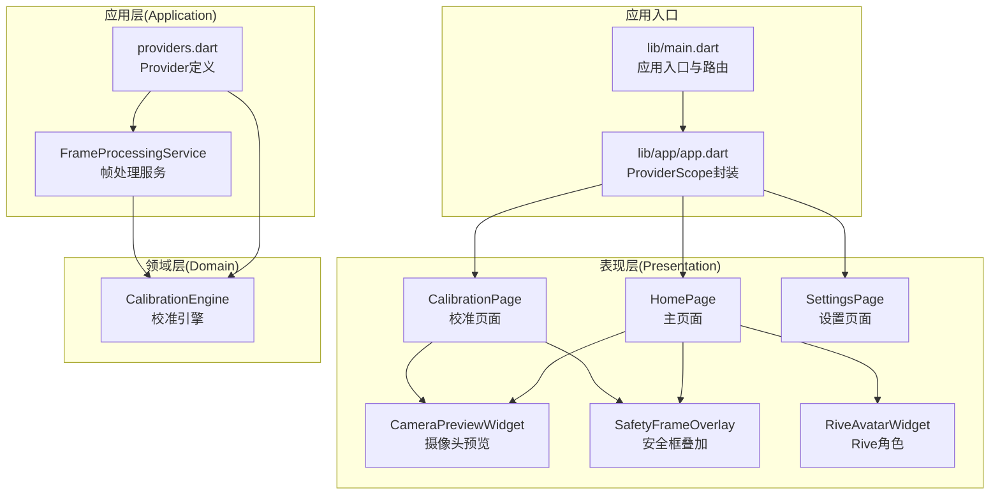
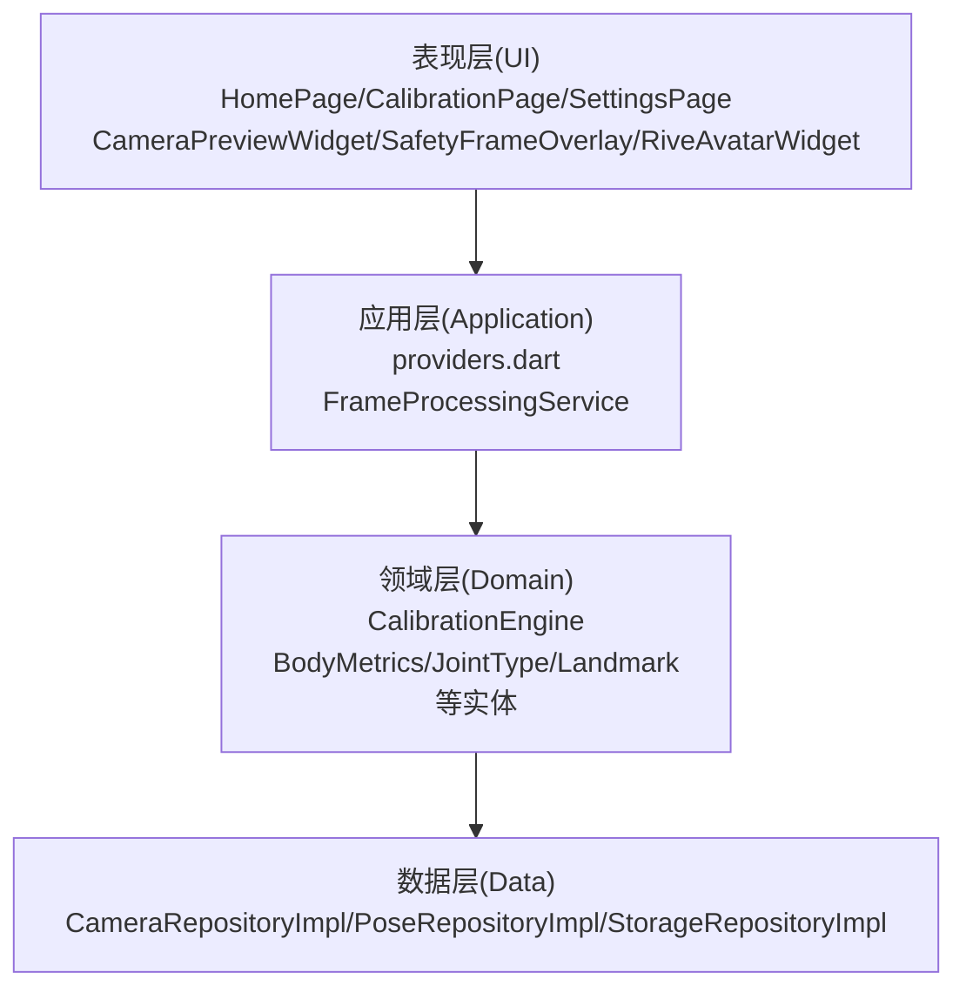
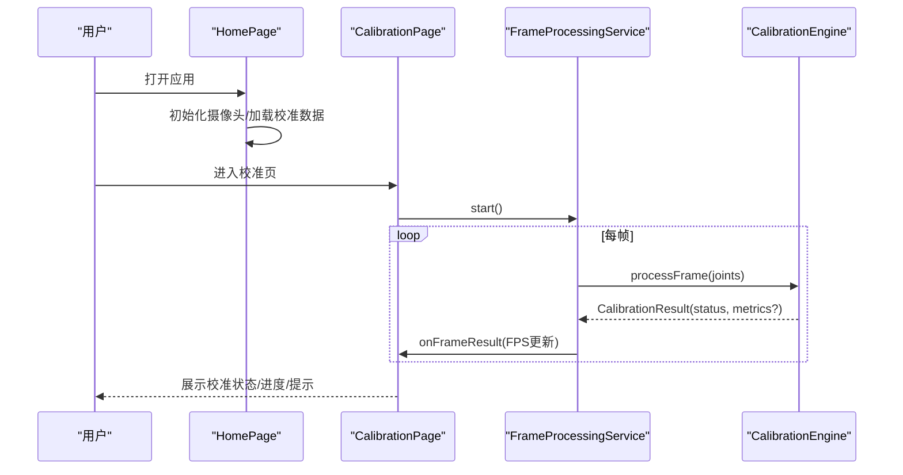
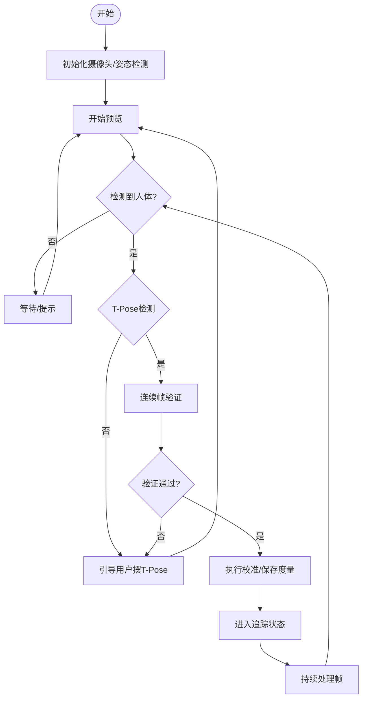
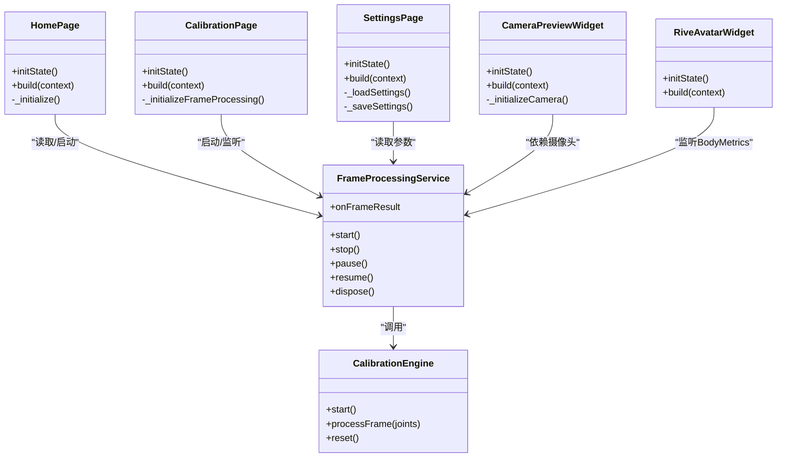
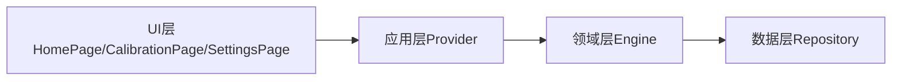

# UI组件架构

<cite>
**本文引用的文件**
- [lib/main.dart](file://lib/main.dart)
- [lib/app/app.dart](file://lib/app/app.dart)
- [lib/application/providers/providers.dart](file://lib/application/providers/providers.dart)
- [lib/application/services/frame_processing_service.dart](file://lib/application/services/frame_processing_service.dart)
- [lib/presentation/pages/home_page.dart](file://lib/presentation/pages/home_page.dart)
- [lib/presentation/pages/calibration_page.dart](file://lib/presentation/pages/calibration_page.dart)
- [lib/presentation/pages/settings_page.dart](file://lib/presentation/pages/settings_page.dart)
- [lib/presentation/widgets/camera_preview_widget.dart](file://lib/presentation/widgets/camera_preview_widget.dart)
- [lib/presentation/widgets/safety_frame_overlay.dart](file://lib/presentation/widgets/safety_frame_overlay.dart)
- [lib/presentation/widgets/rive_avatar_widget.dart](file://lib/presentation/widgets/rive_avatar_widget.dart)
- [lib/domain/engines/calibration/calibration_engine.dart](file://lib/domain/engines/calibration/calibration_engine.dart)
</cite>

## 目录
1. [简介](#简介)
2. [项目结构](#项目结构)
3. [核心组件](#核心组件)
4. [架构总览](#架构总览)
5. [组件详细分析](#组件详细分析)
6. [依赖关系分析](#依赖关系分析)
7. [性能考量](#性能考量)
8. [故障排查指南](#故障排查指南)
9. [结论](#结论)
10. [附录](#附录)

## 简介
本文件面向Mimo项目的UI组件架构，系统阐述基于Flutter与Riverpod的响应式UI设计与实现。重点包括：
- 设计模式与架构原则：分层清晰、关注点分离、单向数据流与状态提升
- Controller与ViewModel的职责分离与协作：UI层仅负责展示与交互；状态与业务逻辑通过Provider与Service解耦
- 组件间通信、状态共享与数据流向：通过Riverpod Provider实现跨组件状态共享与订阅
- 响应式UI实现原理与最佳实践：基于ConsumerWidget/ConsumerStatefulWidget与watch/listen
- 组件复用策略、抽象层设计与扩展机制：Widget抽象、Engine接口化、Repository抽象
- 生命周期管理、内存优化与性能监控：组件dispose、订阅取消、FPS统计
- UI测试策略、模拟数据与调试技巧：Provider隔离、Mock Engine、断言状态变化
- 可访问性支持、国际化与主题系统集成：Material Design 3、颜色方案、暗色主题

## 项目结构
Mimo采用“按层次+按功能”的混合组织方式：
- lib/main.dart：应用入口与路由配置
- lib/app/app.dart：应用主体封装（ProviderScope包裹）
- lib/application：应用层（Provider定义、服务编排）
- lib/presentation：表现层（页面与可复用Widget）
- lib/domain：领域层（引擎、实体、常量）
- lib/data：数据层（仓库实现）

图表来源
- [lib/main.dart:1-34](file://lib/main.dart#L1-L34)
- [lib/app/app.dart:1-27](file://lib/app/app.dart#L1-L27)
- [lib/application/providers/providers.dart:1-103](file://lib/application/providers/providers.dart#L1-L103)
- [lib/application/services/frame_processing_service.dart:1-254](file://lib/application/services/frame_processing_service.dart#L1-L254)
- [lib/presentation/pages/home_page.dart:1-215](file://lib/presentation/pages/home_page.dart#L1-L215)
- [lib/presentation/pages/calibration_page.dart:1-286](file://lib/presentation/pages/calibration_page.dart#L1-L286)
- [lib/presentation/pages/settings_page.dart:1-284](file://lib/presentation/pages/settings_page.dart#L1-L284)
- [lib/presentation/widgets/camera_preview_widget.dart:1-76](file://lib/presentation/widgets/camera_preview_widget.dart#L1-L76)
- [lib/presentation/widgets/safety_frame_overlay.dart:1-49](file://lib/presentation/widgets/safety_frame_overlay.dart#L1-L49)
- [lib/presentation/widgets/rive_avatar_widget.dart:1-118](file://lib/presentation/widgets/rive_avatar_widget.dart#L1-L118)
- [lib/domain/engines/calibration/calibration_engine.dart:1-302](file://lib/domain/engines/calibration/calibration_engine.dart#L1-L302)

章节来源
- [lib/main.dart:1-34](file://lib/main.dart#L1-L34)
- [lib/app/app.dart:1-27](file://lib/app/app.dart#L1-L27)

## 核心组件
- 应用入口与主题
  - 入口文件配置MaterialApp、路由与ProviderScope，统一注入Provider树
  - 主题采用Material 3与深色方案，便于视觉一致性
- Provider体系
  - 定义仓库、引擎、服务与状态Provider，集中管理可观察状态
  - 包含校准状态、人体度量、追踪状态、当前FPS等全局状态
- 帧处理服务
  - FrameProcessingService串联摄像头、姿态检测、归一化、运动学、滤波、语义识别与性能调度
  - 通过回调onFrameResult驱动UI更新
- 页面与Widget
  - HomePage：主界面布局，包含摄像头预览、安全框叠加、Rive角色与状态栏
  - CalibrationPage：校准流程引导，状态可视化与底部指引
  - SettingsPage：参数调节与持久化，支持高性能模式与目标FPS
  - CameraPreviewWidget：摄像头初始化、缩放适配与错误兜底
  - SafetyFrameOverlay：自定义绘制安全框
  - RiveAvatarWidget：占位控制器与动画容器，监听姿态数据更新角色

章节来源
- [lib/application/providers/providers.dart:1-103](file://lib/application/providers/providers.dart#L1-L103)
- [lib/application/services/frame_processing_service.dart:1-254](file://lib/application/services/frame_processing_service.dart#L1-L254)
- [lib/presentation/pages/home_page.dart:1-215](file://lib/presentation/pages/home_page.dart#L1-L215)
- [lib/presentation/pages/calibration_page.dart:1-286](file://lib/presentation/pages/calibration_page.dart#L1-L286)
- [lib/presentation/pages/settings_page.dart:1-284](file://lib/presentation/pages/settings_page.dart#L1-L284)
- [lib/presentation/widgets/camera_preview_widget.dart:1-76](file://lib/presentation/widgets/camera_preview_widget.dart#L1-L76)
- [lib/presentation/widgets/safety_frame_overlay.dart:1-49](file://lib/presentation/widgets/safety_frame_overlay.dart#L1-L49)
- [lib/presentation/widgets/rive_avatar_widget.dart:1-118](file://lib/presentation/widgets/rive_avatar_widget.dart#L1-L118)

## 架构总览
Mimo采用“表现层-应用层-领域层-数据层”的分层架构，结合Riverpod实现响应式UI与状态共享。

图表来源
- [lib/application/providers/providers.dart:1-103](file://lib/application/providers/providers.dart#L1-L103)
- [lib/application/services/frame_processing_service.dart:1-254](file://lib/application/services/frame_processing_service.dart#L1-L254)
- [lib/domain/engines/calibration/calibration_engine.dart:1-302](file://lib/domain/engines/calibration/calibration_engine.dart#L1-L302)

## 组件详细分析

### 页面与状态管理
- HomePage
  - 负责初始化摄像头与加载校准数据，并根据校准状态决定是否显示引导覆盖层
  - 顶部状态栏显示FPS与设置入口
- CalibrationPage
  - 启动帧处理服务，监听校准状态与FPS，动态更新UI状态与底部指引
  - 支持成功/失败后的继续或重试流程
- SettingsPage
  - 读取/保存滤波参数、关节约束与性能设置，支持重置默认值与重新校准

图表来源
- [lib/presentation/pages/home_page.dart:1-215](file://lib/presentation/pages/home_page.dart#L1-L215)
- [lib/presentation/pages/calibration_page.dart:1-286](file://lib/presentation/pages/calibration_page.dart#L1-L286)
- [lib/application/services/frame_processing_service.dart:1-254](file://lib/application/services/frame_processing_service.dart#L1-L254)
- [lib/domain/engines/calibration/calibration_engine.dart:1-302](file://lib/domain/engines/calibration/calibration_engine.dart#L1-L302)

章节来源
- [lib/presentation/pages/home_page.dart:1-215](file://lib/presentation/pages/home_page.dart#L1-L215)
- [lib/presentation/pages/calibration_page.dart:1-286](file://lib/presentation/pages/calibration_page.dart#L1-L286)
- [lib/presentation/pages/settings_page.dart:1-284](file://lib/presentation/pages/settings_page.dart#L1-L284)

### 帧处理与状态流转
- 状态机
  - FrameProcessingState：idle、calibrating、tracking、paused
  - CalibrationStatus：waiting、detecting、tPoseDetected、calibrating、inProgress、verifying、success、failed
- 数据流
  - 摄像头图像 -> 姿态检测 -> 归一化 -> 角度计算 -> 关节约束 -> 滤波 -> 置信度混合 -> 语义识别 -> FrameResult -> UI更新
- FPS统计
  - 每秒统计帧数并写入Provider，供UI显示

图表来源
- [lib/application/services/frame_processing_service.dart:1-254](file://lib/application/services/frame_processing_service.dart#L1-L254)
- [lib/domain/engines/calibration/calibration_engine.dart:1-302](file://lib/domain/engines/calibration/calibration_engine.dart#L1-L302)

章节来源
- [lib/application/services/frame_processing_service.dart:1-254](file://lib/application/services/frame_processing_service.dart#L1-L254)
- [lib/domain/engines/calibration/calibration_engine.dart:1-302](file://lib/domain/engines/calibration/calibration_engine.dart#L1-L302)

### UI组件与职责分离
- Controller与ViewModel
  - HomePage/CalibrationPage/SettingsPage作为UI层，负责构建Widget树与事件处理
  - 状态通过Provider管理，业务逻辑由Service与Engine承担
  - CameraPreviewWidget/RiveAvatarWidget等可复用Widget封装具体渲染细节
- 协作机制
  - UI通过ref.watch/ref.read订阅/读取Provider状态
  - 通过ref.listen监听状态变化（如BodyMetrics）驱动副作用
  - 通过回调（onFrameResult）接收实时数据更新

图表来源
- [lib/presentation/pages/home_page.dart:1-215](file://lib/presentation/pages/home_page.dart#L1-L215)
- [lib/presentation/pages/calibration_page.dart:1-286](file://lib/presentation/pages/calibration_page.dart#L1-L286)
- [lib/presentation/pages/settings_page.dart:1-284](file://lib/presentation/pages/settings_page.dart#L1-L284)
- [lib/presentation/widgets/camera_preview_widget.dart:1-76](file://lib/presentation/widgets/camera_preview_widget.dart#L1-L76)
- [lib/presentation/widgets/rive_avatar_widget.dart:1-118](file://lib/presentation/widgets/rive_avatar_widget.dart#L1-L118)
- [lib/application/services/frame_processing_service.dart:1-254](file://lib/application/services/frame_processing_service.dart#L1-L254)
- [lib/domain/engines/calibration/calibration_engine.dart:1-302](file://lib/domain/engines/calibration/calibration_engine.dart#L1-L302)

章节来源
- [lib/presentation/widgets/camera_preview_widget.dart:1-76](file://lib/presentation/widgets/camera_preview_widget.dart#L1-L76)
- [lib/presentation/widgets/rive_avatar_widget.dart:1-118](file://lib/presentation/widgets/rive_avatar_widget.dart#L1-L118)

### 组件复用与抽象
- 可复用Widget
  - CameraPreviewWidget：封装摄像头初始化、缩放与错误处理
  - SafetyFrameOverlay：自定义绘制安全框，无状态
  - RiveAvatarWidget：占位控制器，便于后续接入真实Rive动画
- 抽象层设计
  - Repository抽象（CameraRepositoryImpl/PoseRepositoryImpl/StorageRepositoryImpl）隔离平台差异
  - Engine抽象（Normalization/Kinematics/MotionFilter/Semantic/Calibration）便于替换与测试
- 扩展机制
  - 新增Provider与Service，遵循现有命名与依赖注入模式
  - 新增页面通过ProviderScope接入，避免全局污染

章节来源
- [lib/presentation/widgets/camera_preview_widget.dart:1-76](file://lib/presentation/widgets/camera_preview_widget.dart#L1-L76)
- [lib/presentation/widgets/safety_frame_overlay.dart:1-49](file://lib/presentation/widgets/safety_frame_overlay.dart#L1-L49)
- [lib/presentation/widgets/rive_avatar_widget.dart:1-118](file://lib/presentation/widgets/rive_avatar_widget.dart#L1-L118)
- [lib/application/providers/providers.dart:1-103](file://lib/application/providers/providers.dart#L1-L103)

## 依赖关系分析
- UI层依赖应用层Provider，应用层依赖领域层Engine与数据层Repository
- Provider之间存在显式依赖链：motionPipelineProvider依赖多个Engine与Service
- 页面与Widget通过ref.read/ref.watch解耦直接依赖，降低耦合度

图表来源
- [lib/application/providers/providers.dart:1-103](file://lib/application/providers/providers.dart#L1-L103)
- [lib/application/services/frame_processing_service.dart:1-254](file://lib/application/services/frame_processing_service.dart#L1-L254)
- [lib/domain/engines/calibration/calibration_engine.dart:1-302](file://lib/domain/engines/calibration/calibration_engine.dart#L1-L302)

章节来源
- [lib/application/providers/providers.dart:1-103](file://lib/application/providers/providers.dart#L1-L103)

## 性能考量
- 响应式更新
  - 使用ref.watch/ref.listen精准订阅，避免不必要的重建
- FPS监控
  - 帧处理服务每秒统计并写入Provider，UI层仅读取显示
- 渲染优化
  - CameraPreviewWidget按屏幕与相机纵横比计算缩放，减少裁剪与拉伸
- 资源管理
  - 页面与Widget在dispose中释放订阅与控制器，避免内存泄漏
- 性能模式
  - SettingsPage支持高性能模式与目标FPS，便于在不同设备上平衡流畅度与功耗

章节来源
- [lib/application/services/frame_processing_service.dart:1-254](file://lib/application/services/frame_processing_service.dart#L1-L254)
- [lib/presentation/widgets/camera_preview_widget.dart:1-76](file://lib/presentation/widgets/camera_preview_widget.dart#L1-L76)
- [lib/presentation/pages/settings_page.dart:1-284](file://lib/presentation/pages/settings_page.dart#L1-L284)

## 故障排查指南
- 摄像头初始化失败
  - 检查权限与设备可用性；CameraPreviewWidget中已捕获异常并打印日志
- 校准失败
  - 查看CalibrationEngine的状态转换与超时逻辑；确保T-Pose保持足够帧数且关键点可见
- UI不更新
  - 确认Provider状态变更是否通过notifier写入；确认UI是否使用watch/listen订阅
- FPS异常
  - 检查帧处理服务的计时逻辑与写入频率；确认UI层是否正确读取Provider

章节来源
- [lib/presentation/widgets/camera_preview_widget.dart:1-76](file://lib/presentation/widgets/camera_preview_widget.dart#L1-L76)
- [lib/application/services/frame_processing_service.dart:1-254](file://lib/application/services/frame_processing_service.dart#L1-L254)
- [lib/domain/engines/calibration/calibration_engine.dart:1-302](file://lib/domain/engines/calibration/calibration_engine.dart#L1-L302)

## 结论
Mimo的UI组件架构以Riverpod为核心，实现了清晰的分层与职责分离。通过Provider统一管理状态，Service与Engine承载业务逻辑，UI层专注于展示与交互。该架构具备良好的可扩展性与可维护性，适合在多端场景下演进与迭代。

## 附录
- 可访问性支持
  - 使用Material Design组件与明暗主题，确保对比度与可读性
- 国际化
  - 可在现有文本基础上引入i18n库与本地化资源
- 主题系统
  - 基于Material 3 ColorScheme与useMaterial3，支持深色模式切换